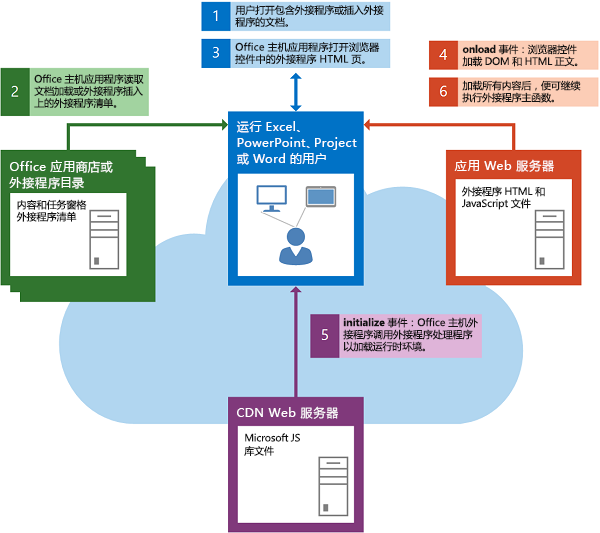
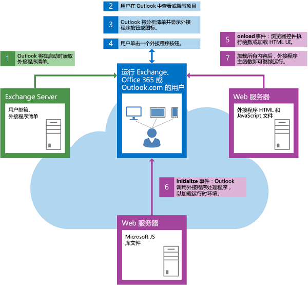

# 加载 DOM 和运行时环境Loading the DOM and runtime environment

外接程序在运行自己的自定义逻辑前必须确保 DOM 和 Office 外接程序运行时环境都已加载。An add-in must ensure that both the DOM and the Office Add-ins runtime environment are loaded before running its own custom logic.

## 启动内容或任务窗格加载项Startup of a content or task pane add-in

下图显示了在 Excel、PowerPoint、Project 或 Word 中启动内容或任务窗格加载项所涉及的事件流。The following figure shows the flow of events involved in starting a content or task pane add-in in Excel, PowerPoint, Project, or Word.

启动内容/任务窗格外接程序时，将发生以下事件：The following events occur when a content or task pane add-in starts:

1. 用户打开已包含加载项的文档，或在文档中插入加载项。The user opens a document that already contains an add-in or inserts an add-in in the document.

2. 客户端Office应用程序从 AppSource、SharePoint 上的应用程序目录或源自的共享文件夹目录读取加载项的 XML 清单。The Office client application reads the add-in's XML manifest from AppSource, an app catalog on SharePoint, or the shared folder catalog it originates from.

3. 客户端Office应用程序在浏览器控件中打开加载项的 HTML 页面。The Office client application opens the add-in's HTML page in a browser control.

    后面的两个步骤第 4 步和第 5 步以异步方式并行发生。因此，您的加载项代码必须在继续之前确保 DOM 和加载项运行时环境已加载完。The next two steps, steps 4 and 5, occur asynchronously and in parallel. For this reason, your add-in's code must make sure that both the DOM and the add-in runtime environment have finished loading before proceeding.

4. 浏览器控件加载 DOM 和 HTML 正文，并调用事件的事件 `window.onload` 处理程序。The browser control loads the DOM and HTML body, and calls the event handler for the `window.onload` event.

5. Office 客户端应用程序加载运行时环境，该环境从内容分发网络 (CDN) 服务器下载并缓存 Office JavaScript API 库文件，然后为[Office](/javascript/api/office)对象的[initialize](/javascript/api/office#office-initialize-reason-)事件调用外接程序的事件处理程序（如果已为其分配处理程序）。The Office client application loads the runtime environment, which downloads and caches the Office JavaScript API library files from the content distribution network (CDN) server, and then calls the add-in's event handler for the [initialize](/javascript/api/office#office-initialize-reason-) event of the [Office](/javascript/api/office) object, if a handler has been assigned to it. 此时它还会检查是否有任何回调（或链接 `then()` 函数）已传递（或链接）到 `Office.onReady` 处理程序。At this time it also checks to see if any callbacks (or chained `then()` functions) have been passed (or chained) to the `Office.onReady` handler. 有关 和 之间的区别详细信息， `Office.initialize` `Office.onReady` 请参阅 [初始化外接程序](initialize-add-in.md)。For more information about the distinction between `Office.initialize` and `Office.onReady`, see [Initialize your add-in](initialize-add-in.md).

6. 当 DOM 和 HTML 正文加载完毕并且加载项完成初始化后，加载项的主函数就可以继续进行。When the DOM and HTML body finish loading and the add-in finishes initializing, the main function of the add-in can proceed.

## 启动 Outlook 外接程序Startup of an Outlook add-in

下图显示了启动在台式机、平板电脑或智能手机上运行的 Outlook 外接程序所涉及的事件流。The following figure shows the flow of events involved in starting an Outlook add-in running on the desktop, tablet, or smartphone.

启动 Outlook 外接程序时，将发生以下事件：The following events occur when an Outlook add-in starts:

1. 当 Outlook 启动时，Outlook 读取已为用户的电子邮件帐户安装的 Outlook 外接程序的 XML 清单。When Outlook starts, Outlook reads the XML manifests for Outlook add-ins that have been installed for the user's email account.

2. 用户选择 Outlook 中的一个项目。The user selects an item in Outlook.

3. 如果所选项目满足某个 Outlook 外接程序的激活条件，则 Outlook 将激活该外接程序，并使其按钮在 UI 中可见。If the selected item satisfies the activation conditions of an Outlook add-in, Outlook activates the add-in and makes its button visible in the UI.

4. 如果用户单击该按钮以启动 Outlook 外接程序，Outlook 将在浏览器控件中打开 HTML 页面。下面两个步骤（步骤 5 和 6）并行发生。If the user clicks the button to start the Outlook add-in, Outlook opens the HTML page in a browser control. The next two steps, steps 5 and 6, occur in parallel.

5. 浏览器控件加载 DOM 和 HTML 正文，并调用事件的事件 `onload` 处理程序。The browser control loads the DOM and HTML body, and calls the event handler for the `onload` event.

6. Outlook 加载运行时环境，这将从内容分发网络 (CDN) 服务器中为 JavaScript 库文件下载并缓存 JavaScript API，然后为 [Office](/javascript/api/office) 加载项对象的 [initialize](/javascript/api/office#office-initialize-reason-) 事件调用事件处理程序（如果已为其分配处理程序）。Outlook loads the runtime environment, which downloads and caches the JavaScript API for JavaScript library files from the content distribution network (CDN) server, and then calls the event handler for the [initialize](/javascript/api/office#office-initialize-reason-) event of the [Office](/javascript/api/office) object of the add-in, if a handler has been assigned to it. 此时它还会检查是否有任何回调（或链接 `then()` 函数）已传递（或链接）到 `Office.onReady` 处理程序。At this time it also checks to see if any callbacks (or chained `then()` functions) have been passed (or chained) to the `Office.onReady` handler. 有关 和 之间的区别详细信息， `Office.initialize` `Office.onReady` 请参阅 [初始化外接程序](initialize-add-in.md)。For more information about the distinction between `Office.initialize` and `Office.onReady`, see [Initialize your add-in](initialize-add-in.md).

7. 当 DOM 和 HTML 正文加载完毕并且加载项完成初始化后，加载项的主函数就可以继续进行。When the DOM and HTML body finish loading and the add-in finishes initializing, the main function of the add-in can proceed.

## 另请参阅See also

- [了解 Office JavaScript APIUnderstanding the Office JavaScript API](understanding-the-javascript-api-for-office.md)
- [初始化 Office 加载项Initialize your Office Add-in](initialize-add-in.md)
