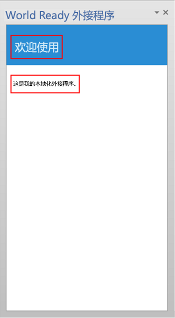
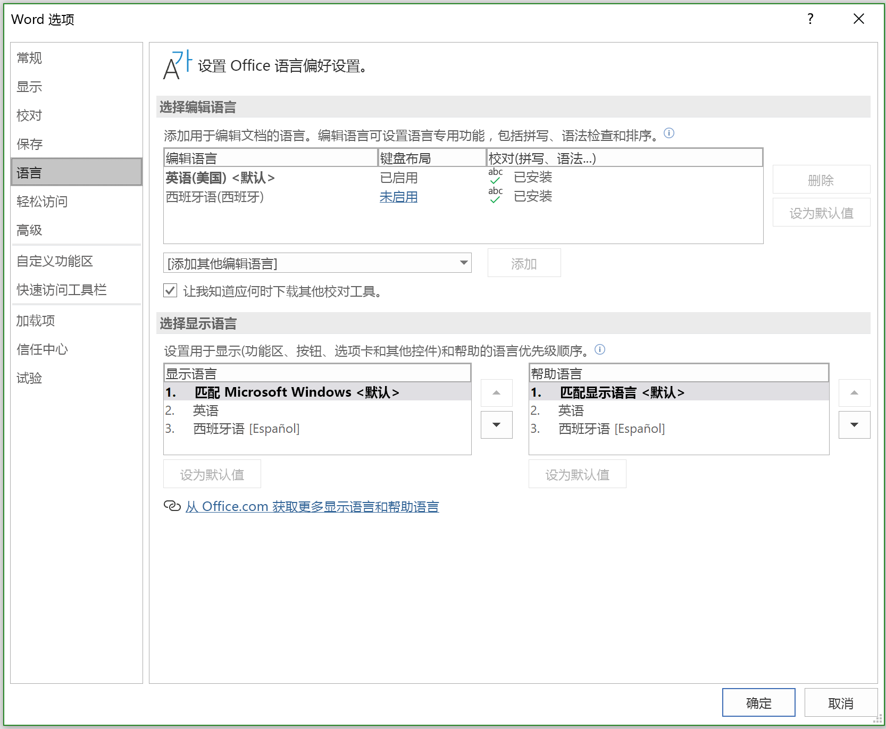
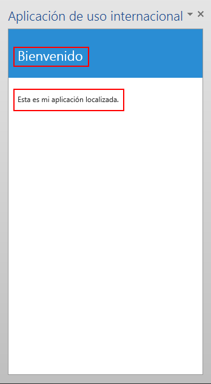

# <a name="localization-for-office-add-ins"></a>Office 加载项的本地化

您可以实现适合 Office 外接程序的任何本地化方案。Office 外接程序平台的 JavaScript API 和清单架构提供了一些选择。可以使用适用于 Office 的 JavaScript API 确定区域设置并根据主机应用程序的区域设置显示字符串，或根据数据的区域设置解释或显示数据。可以使用清单指定区域设置特定的加载项文件位置和描述性信息。也可以使用 Microsoft Ajax 脚本支持全球化和本地化。

## <a name="use-the-javascript-api-to-determine-locale-specific-strings"></a>使用 JavaScript API 确定区域设置特定的字符串

适用于 Office 的 JavaScript API 提供两个属性，支持显示或解释与主机应用程序和数据的区域设置一致的值：

- [Context.displayLanguage][displayLanguage] 指定主机应用程序用户界面的区域设置（或语言）。 以下示例验证主机应用程序是否使用 en-US 或 fr-FR 区域设置，并显示特定区域设置的问候语。

    ```js
    function sayHelloWithDisplayLanguage() {
        var myLanguage = Office.context.displayLanguage;
        switch (myLanguage) {
            case 'en-US':
                write('Hello!');
                break;
            case 'fr-FR':
                write('Bonjour!');
                break;
        }
    }

    // Function that writes to a div with id='message' on the page.
    function write(message) {
        document.getElementById('message').innerText += message;
    }
    ```

- [Context.contentLanguage][contentLanguage] 指定数据的区域设置（或语言）。展开上一个代码示例，不检查 [displayLanguage] 属性，而是为 `myLanguage` 分配 [contentLanguage] 属性值，并使用相同代码的其余部分根据数据的区域设置显示问候语：

    ```js
    var myLanguage = Office.context.contentLanguage;
    ```

## <a name="control-localization-from-the-manifest"></a>通过清单控制本地化


每个 Office 外接程序在其清单中指定一个 [DefaultLocale] 元素和区域设置。默认情况下，Office 外接程序平台和 Office 主机应用程序将 [Description]、[DisplayName]、[IconUrl]、[HighResolutionIconUrl] 和 [SourceLocation] 元素的值应用于所有的区域设置。可以通过为每个其他区域设置的上述五个元素中的任意一个指定 [Override] 子元素来选择支持将特定值用于特定的区域设置。[DefaultLocale] 元素和 [Override] 元素的 `Locale` 属性的值根据 [RFC 3066]（“用于语言标识的标记”）指定。表 1 描述了这些元素的本地化支持。

*表 1.本地化支持*


|**Element**|**本地化支持**|
|:-----|:-----|
|[Description]   |指定的每个区域设置中的用户都可以在 AppSource（或专有目录）中看到本地化的加载项说明。<br/>对于 Outlook 加载项，在安装后，用户可以在 Exchange 管理中心 (EAC) 中看到说明。|
|[DisplayName]   |指定的每个区域设置中的用户都可以在 AppSource（或专有目录）中看到本地化的加载项说明。<br/>对于 Outlook 加载项，在安装后，用户可以看到显示名称为 Outlook 加载项按钮标签，也可以在 EAC 中看到显示名称。<br/>对于内容和任务窗格外接程序，安装外接程序后，用户可以在功能区中看到该显示名称。|
|[IconUrl]        |图标图像是可选的。可以使用相同的替代方法为特定区域性指定特定图像。如果使用并本地化图标，则您指定的每个区域设置中的用户均可看到该加载项的本地化图标图像。<br/>对于 Outlook 外接程序，安装外接程序后，用户可以在 EAC 中看到该图标。<br/>对于内容和任务窗格加载项，安装加载项后，用户可以在功能区中看到此图标。|
|[HighResolutionIconUrl] **重要说明：** 此元素仅适用于使用加载项清单版本 1.1 的情况。|高分辨率图标图像是可选的，但一旦指定，则必须在  [IconUrl] 元素之后出现。指定 [HighResolutionIconUrl] 且在支持高 DPI 分辨率的设备上安装了加载项后，将使用 [HighResolutionIconUrl] 值而不是 [IconUrl] 值。<br/>图标图像是可选的。可以使用相同的替代方法为特定区域性指定特定图像。如果使用并本地化图标，则您指定的每个区域设置中的用户均可看到该加载项的本地化图标图像。<br/>对于 Outlook 外接程序，安装外接程序后，用户可以在 EAC 中看到该图标。<br/>对于内容和任务窗格加载项，安装加载项后，用户可以在功能区中看到此图标。|
|[Resources] **重要说明：** 此元素仅适用于使用加载项清单版本 1.1 的情况。   |指定的每个区域设置中的用户都可以看到专门针对相应区域设置为加载项创建的字符串和图标资源。 |
|[SourceLocation]   |指定的每个区域设置中的用户都可以看到专门针对该区域设置为该加载项设计的网页。 |


> [!NOTE]
> 可以仅为 Office 支持的语言环境对说明和显示名称进行本地化。 有关当前版本的 Office 的语言和区域设置列表，请参阅 [Office 2013 中的语言标识符和 OptionState ID 值](https://docs.microsoft.com/previous-versions/office/office-2013-resource-kit/cc179219(v=office.15))。


### <a name="examples"></a>示例

例如，Office 加载项可以将 [DefaultLocale] 指定为 `en-us`。对于 [DisplayName] 元素，加载项可以为区域设置 `fr-fr` 指定 [Override] 子元素，如下所示。


```xml
<DefaultLocale>en-us</DefaultLocale>
...
<DisplayName DefaultValue="Video player">
    <Override Locale="fr-fr" Value="Lecteur vidéo" />
</DisplayName>
```

> [!NOTE]
> 如需针对一个语系内的多个区域进行本地化，例如 `de-de` 和 `de-at`，则建议对各个区域使用独立的 `Override` 元素。 并非 Office 主机应用程序和平台的所有组合均支持仅单独使用语言名称（在此示例中是 `de`）。

这意味着，加载项默认情况下采用 `en-us` 区域设置。除非客户端计算机的区域设置为 `fr-fr`（此时用户将看到法语的显示名称“Lecteur vidéo”），否则对于所有区域设置，用户都将看到英文显示名称“Video player”。

> [!NOTE]
> 每种语言只可指定单一的覆盖，包括对于默认区域设置的覆盖。 例如，如果默认区域设置为 `en-us`，则无法也指定 `en-us` 的覆盖。 

以下示例对 [Description] 元素应用区域设置覆盖。它首先指定默认区域设置 `en-us` 和英文说明，然后指定 [Override] 语句，其中包含 `fr-fr` 区域设置的法语说明：

```xml
<DefaultLocale>en-us</DefaultLocale>
...
<Description DefaultValue=
   "Watch YouTube videos referenced in the emails you receive
   without leaving your email client.">
   <Override Locale="fr-fr" Value=
   "Visualisez les vidéos YouTube référencées dans vos courriers 
   électronique directement depuis Outlook et Outlook Web App."/>
</Description>
```

也就是说，加载项默认采用 `en-us` 区域设置。除非客户端计算机的区域设置为 `fr-fr`（此时用户将看到法语说明），否则对于所有区域设置，用户都将看到 `DefaultValue` 属性中的英文说明。

在以下示例中，加载项指定更适合 `fr-fr` 区域设置和区域性的不同图像。默认情况下，用户看到的是图像 DefaultLogo.png，客户端计算机的区域设置为 `fr-fr` 时除外。此时，用户将看到图像 FrenchLogo.png。 


```xml
<!-- Replace "domain" with a real web server name and path. -->
<IconUrl DefaultValue="https://<domain>/DefaultLogo.png"/>
<Override Locale="fr-fr" Value="https://<domain>/FrenchLogo.png"/>
```

以下示例显示了如何本地化 `Resources` 部分中的资源。它对一个更适用于 `ja-jp` 區域性的图像应用了区域设置覆盖。

```xml
<Resources>
      <bt:Images>
        <bt:Image id="icon1_16x16" DefaultValue="https://www.contoso.com/icon_default.png">
          <bt:Override Locale="ja-jp" Value="https://www.contoso.com/ja-jp16-icon_default.png" />
        </bt:Image>
 ...
```


对于 [SourceLocation] 元素，支持其他区域设置意味着为每个指定的区域设置提供单独的源 HTML 文件。指定的每个区域设置中的用户都可以看到为相应区域设置设计的自定义网页。

对于 Outlook 加载项，[SourceLocation] 元素还与外形规格保持一致。这样一来，就可以为每个相应外形规格提供不同的本地化源 HTML 文件。可以在每个适用的 settings 元素（[DesktopSettings]、[TabletSettings] 或 [PhoneSettings]）中指定一个或多个 [Override] 子元素。下面的示例展示了用于台式机、平板电脑和智能手机外形规格的 settings 元素，每个都有一个用于默认区域设置的 HTML 文件，以及另一个用于法语区域设置的 HTML 文件。


```xml
<DesktopSettings>
   <SourceLocation DefaultValue="https://contoso.com/Desktop.html">
      <Override Locale="fr-fr" Value="https://contoso.com/fr/Desktop.html" />
   </SourceLocation>
   <RequestedHeight>250</RequestedHeight>
</DesktopSettings>
<TabletSettings>
   <SourceLocation DefaultValue="https://contoso.com/Tablet.html">
      <Override Locale="fr-fr" Value="https://contoso.com/fr/Tablet.html" />
   </SourceLocation>
   <RequestedHeight>200</RequestedHeight>
</TabletSettings>
<PhoneSettings>
   <SourceLocation DefaultValue="https://contoso.com/Mobile.html">
      <Override Locale="fr-fr" Value="https://contoso.com/fr/Mobile.html" />
   </SourceLocation>
</PhoneSettings>
```

## <a name="match-datetime-format-with-client-locale"></a>将日期/时间格式与客户端区域设置匹配

可以通过 [displayLanguage] 属性获取主机应用程序用户界面的区域位置。然后可以显示格式与主机应用程序中的当前区域位置一致的日期和时间值。执行上述操作的一种方法是准备一个指定日期/时间显示格式的资源文件以用于 Office 外界程序支持的各个区域设置。在运行时，外接程序可以使用该资源文件并匹配通过 [displayLanguage] 获得的区域设置正确的日期/时间格式。

可以使用 [contentLanguage] 属性，获取主机应用数据的区域设置。根据此值，可以正确地解释或显示日期/时间字符串。例如，`jp-JP` 区域设置将数据/时间值表示为 `yyyy/MM/dd`，而 `fr-FR` 区域设置则表示为 `dd/MM/yyyy`。


## <a name="use-ajax-for-globalization-and-localization"></a>将 Ajax 用于全球化和本地化


如果使用 Visual Studio 创建 Office 外接程序，.NET Framework 和 Ajax 会提供用于全球化和本地化客户端脚本文件的方法。

您可以全球化 Office 外接程序并在其 JavaScript 代码中使用 [Date](https://msdn.microsoft.com/library/caf98d32-2de2-4704-8198-692350343681.aspx) 和 [Number](https://msdn.microsoft.com/library/c216d3a1-12ae-47d1-bca1-c3666d04572f.aspx) JavaScript 类型扩展和 JavaScript [Date](https://developer.mozilla.org/docs/Web/JavaScript/Reference/Global_Objects/Date) 对象，以根据当前浏览器的区域设置显示值。有关详细信息，请参阅 [Walkthrough: Globalizing a Date by Using Client Script](https://msdn.microsoft.com/library/69b34e6d-d590-4d03-a763-b7ae54b47d74.aspx)。

可将本地化的资源字符串直接包含在独立的 JavaScript 文件中，以便为不同区域设置提供客户端脚本文件，这些文件在浏览器中设置或由用户提供。为每个受支持的区域设置创建单独的脚本文件。在每个脚本文件中，包括一个 JSON 格式的对象，其中包含用于该区域设置的资源字符串。在浏览器中运行脚本时，会应用本地化的值。


## <a name="example-build-a-localized-office-add-in"></a>示例：生成本地化 Office 加载项

本节提供示例，演示如何本地化 Office 外接程序描述、显示名称和 UI。 

> [!NOTE]
> 要下载 Visual Studio 2017，请参阅 [Visual Studio IDE 页面](https://visualstudio.microsoft.com/vs/)。 在安装过程中，你需要选择 Office/SharePoint 开发工作负载。

### <a name="configure-office-to-use-additional-languages-for-display-or-editing"></a>配置 Office 以使用其他语言进行显示或编辑

若要运行所提供的示例代码，请在计算机上配置 Microsoft Office 以使用其他语言，这样您就可以通过切换用于显示菜单和命令的语言或者切换用于编辑和校对的语言（或同时切换两者）来测试您的加载项。

可以使用 Office 语言包安装其他语言。 有关语言包以及如何获取语言包的详细信息，请参阅[适用于 Office 的 Language Accessory Pack](https://office.microsoft.com/language-packs/)。

安装 Language Accessory Pack 后，可以将 Office 配置使用安装的语言，以便在 UI 中显示，或编辑文档内容，或者两者兼具。 在本文的示例中，所安装的 Office 应用了西班牙语语言包。

### <a name="create-an-office-add-in-project"></a>创建 Office 加载项项目

需要创建 Visual Studio 2017 Office 加载项项目。 

> [!NOTE]
> 如果未安装 Visual Studio 2017，请参阅 [Visual Studio IDE 页面](https://visualstudio.microsoft.com/vs/)，以获取下载说明。 在安装过程中，你需要选择 Office/SharePoint 开发工作负载。 如果之前已安装 Visual Studio 2017，请使用 [Visual Studio 安装程序](https://docs.microsoft.com/visualstudio/install/modify-visual-studio/)，以确保安装 Office/SharePoint 开发工作负载。


1. 在 Visual Studio 中，依次选择“文件”**** > “新建项目”****。
2. 在“新建项目”**** 对话框中，展开“Visual Basic”**** 或“Visual C#”****，展开“Office/SharePoint”****，再选择“加载项”****。
3. 选择“Word 加载项”****，再为加载项命名 **WorldReadyAddIn**。选择“确定”****。

### <a name="localize-the-text-used-in-your-add-in"></a>本地化加载项中使用的文本

您要本地化为另一种语言的文本出现在两个区域中：

-  **加载项显示名称和说明**。这是受应用程序清单文件中的条目控制的。

-  **加载项 UI**。 可以通过使用 JavaScript 代码本地化在加载项 UI 中出现的字符串（例如，通过使用包含已本地化的字符串的单独资源文件）。

要本地化加载项显示名称和说明，请执行以下操作：

1. 在“解决方案资源管理器”**** 中，展开“WorldReadyAddIn”****、“WorldReadyAddInManifest”****，再选择“WorldReadyAddIn.xml”****。

2. 在 WorldReadyAddInManifest.xml 中，将 [DisplayName] 和 [Description] 元素替换为以下代码块：

    > [!NOTE]
    > 对于本示例中使用的西班牙语本地化字符串的[DisplayName] 和 [Description] 元素，您可以替换为任何其他语言的本地化字符串。

    ```xml
    <DisplayName DefaultValue="World Ready add-in">
      <Override Locale="es-es" Value="Aplicación de uso internacional"/>
    </DisplayName>
    <Description DefaultValue="An add-in for testing localization">
      <Override Locale="es-es" Value="Una aplicación para la prueba de la localización"/>
    </Description>
    ```

3. 例如，如果您将 Office 2013 的显示语言从英语切换到西班牙语，然后运行加载项，加载项的显示名称和说明将用本地化文本显示。

若要设计加载项 UI 的布局，请执行以下操作：

1. 在 Visual Studio 的“解决方案资源管理器”**** 中，选择“Home.html”****。

2. 在 Home.html 中，将 `<body>` 元素替换为以下 HTML，并保存文件。

    ```html
    <body>
        <!-- Page content -->
        <div id="content-header" class="ms-bgColor-themePrimary ms-font-xl">
            <div class="padding">
                <h1 id="greeting" class="ms-fontColor-white"></h1>
            </div>
        </div>
        <div id="content-main">
            <div class="padding">
                <div class="ms-font-m">
                    <p id="about"></p>
                </div>
            </div>
        </div>
    </body>
    ```

下图展示了在完成剩余步骤和运行加载项时显示本地化文本的 heading (h1) 元素和 paragraph (p) 元素。

*图 1：加载项 UI*



### <a name="add-the-resource-file-that-contains-the-localized-strings"></a>添加包含本地化字符串的资源文件

JavaScript 资源文件包含加载项 UI 使用的字符串。 示例加载项 UI 的 HTML 中包含用于显示问候语的 `<h1>` 元素以及用于向用户介绍加载项的 `<p>` 元素。 

若要为标题和段落启用本地化字符串，您需要将字符串放在一个单独的资源文件中。资源文件会创建一个 JavaScript 对象，对每组本地化字符串来说，它都包含一个单独的 JavaScript 对象表示法 (JSON) 对象。资源文件也提供为给定区域设置找回适当 JSON 对象的方法。

若要为加载项项目添加资源文件：

1. 在 Visual Studio 的“解决方案资源管理器”**** 中，右键单击“WorldReadyAddInWeb”**** 项目并选择“添加”**** > “新项目”****。 

2. 在“添加新项目”**** 对话框中，选择“JavaScript 文件”****。

3. 输入文件名 **UIStrings.js**，然后选择“添加”****。

4. 将以下代码添加到 UIStrings.js 文件，然后保存文件。

    ```js
    /* Store the locale-specific strings */

    var UIStrings = (function ()
    {
        "use strict";

        var UIStrings = {};

        // JSON object for English strings
        UIStrings.EN =
        {
            "Greeting": "Welcome",
            "Introduction": "This is my localized add-in."
        };

        // JSON object for Spanish strings
        UIStrings.ES =
        {
            "Greeting": "Bienvenido",
            "Introduction": "Esta es mi aplicación localizada."
        };

        UIStrings.getLocaleStrings = function (locale)
        {
            var text;

            // Get the resource strings that match the language.
            switch (locale)
            {
                case 'en-US':
                    text = UIStrings.EN;
                    break;
                case 'es-ES':
                    text = UIStrings.ES;
                    break;
                default:
                    text = UIStrings.EN;
                    break;
            }

            return text;
        };

        return UIStrings;
    })();
    ```

UIStrings.js 资源文件创建对象 **UIStrings**，其中包含加载项 UI 的本地化字符串。

### <a name="localize-the-text-used-for-the-add-in-ui"></a>本地化加载项 UI 文本

若要在加载项中使用资源文件，需要在 Home.html 中为它添加脚本标记。在 Home.html 加载后，UIStrings.js 便会执行，同时用于获取字符串的 **UIStrings** 对象也可供代码使用。在 Home.html 的头标记中添加以下 HTML，让 **UIStrings** 可供代码使用。

```html
<!-- Resource file for localized strings:                                                          -->
<script src="../UIStrings.js" type="text/javascript"></script>
```

现在，可以使用 **UIStrings** 对象，为加载项 UI 设置字符串了。

若要根据主机应用中的菜单和命令的显示语言来更改加载项的本地化，可以使用 **Office.context.displayLanguage** 属性，获取相应语言的区域设置。例如，如果主机应用语言使用西班牙语显示菜单和命令，那么 **Office.context.displayLanguage** 属性返回语言代码 es-ES。

如果您要根据编辑文档内容所用的语言更改您的加载项的本地化，可以使用  **Office.context.contentLanguage** 属性获取该语言的区域设置。例如，如果主机应用程序语言使用西班牙语编辑文档内容， **Office.context.contentLanguage** 属性将返回语言代码 es-ES。

确定主机应用使用的语言后，可以使用 **UIStrings**，获取与主机应用语言一致的本地化字符串组。

用以下代码替换 Home.js 文件中的代码。以下代码显示您可以如何基于主机应用程序的显示语言或主机应用程序的编辑语言更改 Home.html 上 UI 元素中使用的字符串。

> [!NOTE]
> 要根据编辑所使用的语言在更改加载项本地化之间进行切换，请取消注释代码行 `var myLanguage = Office.context.contentLanguage;` 并注释掉代码行 `var myLanguage = Office.context.displayLanguage;`

```js
/// <reference path="../App.js" />
/// <reference path="../UIStrings.js" />


(function () {
    "use strict";

    // The initialize function must be run each time a new page is loaded.
    Office.initialize = function (reason)
    {

        $(document).ready(function () {
            // Get the language setting for editing document content.
            // To test this, uncomment the following line and then comment out the
            // line that uses Office.context.displayLanguage.
            // var myLanguage = Office.context.contentLanguage;

            // Get the language setting for UI display in the host application.
            var myLanguage = Office.context.displayLanguage;
            var UIText;

            // Get the resource strings that match the language.
            // Use the UIStrings object from the UIStrings.js file
            // to get the JSON object with the correct localized strings.
            UIText = UIStrings.getLocaleStrings(myLanguage);

            // Set localized text for UI elements.
            $("#greeting").text(UIText.Greeting);
            $("#about").text(UIText.Introduction);
        });
    };
})();
```

### <a name="test-your-localized-add-in"></a>测试本地化的加载项

若要测试本地化加载项，请更改在主机应用程序中用于显示或编辑的语言，然后运行加载项。

若要更改加载项中的显示或编辑语言，请执行以下操作：

1. 在 Word 中，选择“文件”**** > “选项”**** > “语言”****。 下图显示打开了“语言”选项卡的“Word 选项”**** 对话框。

    *图 2：“Word 选项”对话框中的“语言”选项*

    

2. 在“**选择显示语言**”下，选择想要显示的语言，例如西班牙语，然后选择向上箭头键将西班牙语移至列表中的第一个位置。 或者，若要更改编辑时使用的语言，在“选择编辑语言”**** 下，选择编辑时想要使用的语言，例如西班牙语，然后选择“设置为默认值”****。

3. 选择“确定”**** 确认选择，然后关闭 Word。

4. 在 Visual Studio 中按 F5 以运行示例加载项，或者从菜单栏中选择“调试”**** > “开始调试”****。

5. 在 Word 中选择“开始”**** > “显示任务窗格”****。

运行后，加载项 UI 中的字符串将会更改，以匹配主机应用程序使用的语言，如下图所示。


*图 3. 使用本地化文本的加载项 UI*



## <a name="see-also"></a>另请参阅

- [Office 加载项的设计准则](../design/add-in-design.md)
- [Office 2013 中的语言标识符和 OptionState Id 值](https://docs.microsoft.com/previous-versions/office/office-2013-resource-kit/cc179219(v=office.15))

[DefaultLocale]:        https://docs.microsoft.com/office/dev/add-ins/reference/manifest/defaultlocale?view=office-js
[说明]:          https://docs.microsoft.com/office/dev/add-ins/reference/manifest/description?view=office-js
[DisplayName]:          https://docs.microsoft.com/office/dev/add-ins/reference/manifest/displayname?view=office-js
[IconUrl]:              https://docs.microsoft.com/office/dev/add-ins/reference/manifest/iconurl?view=office-js
[HighResolutionIconUrl]:https://docs.microsoft.com/office/dev/add-ins/reference/manifest/highresolutioniconurl?view=office-js
[Resources]:            https://docs.microsoft.com/office/dev/add-ins/reference/manifest/resources?view=office-js
[SourceLocation]:       https://docs.microsoft.com/office/dev/add-ins/reference/manifest/sourcelocation?view=office-js
[替代]:             https://docs.microsoft.com/office/dev/add-ins/reference/manifest/override?view=office-js
[DesktopSettings]:      https://docs.microsoft.com/office/dev/add-ins/reference/manifest/desktopsettings?view=office-js
[TabletSettings]:       https://docs.microsoft.com/office/dev/add-ins/reference/manifest/tabletsettings?view=office-js
[PhoneSettings]:        https://docs.microsoft.com/office/dev/add-ins/reference/manifest/phonesettings?view=office-js
[displayLanguage]:  https://docs.microsoft.com/javascript/api/office/office.context?view=office-js#displaylanguage 
[contentLanguage]:  https://docs.microsoft.com/javascript/api/office/office.context?view=office-js#contentlanguage 
[RFC 3066]: https://www.rfc-editor.org/info/rfc3066
