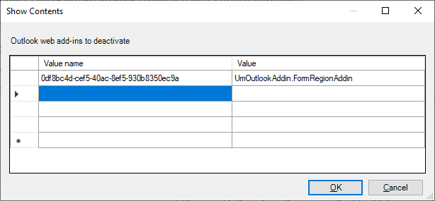

# <a name="make-your-office-add-in-compatible-with-an-existing-com-add-in"></a>确认 Office 加载项与已有的COM 加载项兼容

如果你有现有的 COM 加载项，可以在 Office 加载项中生成等效功能，从而使你的解决方案可以在其他平台（如 Office 网页或 Mac）中运行。 在某些情况下，Office 加载项可能无法提供相应 COM 加载项中提供的所有功能。 在这些情况下，COM 加载项在 Windows 上的用户体验可能会优于相应的 Office 加载项提供的用户体验。

您可以配置 Office 外接程序，以便当用户的计算机上已安装等效 COM 加载项时，Windows 上的 Office 将运行 COM 加载项，而不是 Office 加载项。 COM 加载项称为"等效"加载项，因为 Office 将在 COM 加载项和 Office 加载项之间无缝转换，根据加载项安装用户计算机。

> [!NOTE]
> 连接到 Microsoft 365 订阅时，以下平台支持此功能。
>
> - Excel、Word 和 PowerPoint 网页
> - Windows 版 Excel、Word 和 PowerPoint (版本 1904 或更高版本) 
> - Mac 版 Excel、Word 和 PowerPoint (版本 13.329 或更高版本) 
> - Windows 版 Outlook (版本 2102 或更高版本) 

## <a name="specify-an-equivalent-com-add-in"></a>指定等效的 COM 加载项

### <a name="manifest"></a>清单

> [!IMPORTANT]
> 适用于 Excel、PowerPoint 和 Word。 即将推出 Outlook 支持。

若要启用 Office 加载项和 COM 加载项之间的兼容性，请确定 Office 加载项清单中的等效[](add-in-manifests.md)COM 加载项。 然后，Windows 上的 Office 将使用 COM 加载项，而不是 Office 加载项（如果两者均已安装）。

以下示例显示清单中将 COM 加载项指定为等效加载项的部分。 元素的值标识 `ProgId` COM 加载项， [而 EquivalentAddins](../reference/manifest/equivalentaddins.md) 元素必须紧接在结束标记 `VersionOverrides` 的之前。

```xml
<VersionOverrides>
  ...
  <EquivalentAddins>
    <EquivalentAddin>
      <ProgId>ContosoCOMAddin</ProgId>
      <Type>COM</Type>
    </EquivalentAddin>
  </EquivalentAddins>
</VersionOverrides>
```

> [!TIP]
> 有关 COM 加载项和 XLL UDF 兼容性的信息，请参阅使自定义函数与 [XLL 用户定义函数兼容](../excel/make-custom-functions-compatible-with-xll-udf.md)。

### <a name="group-policy"></a>组策略

> [!IMPORTANT]
> 仅适用于 Outlook。

若要声明 Outlook Web 加载项和 COM/VSTO 加载项之间的兼容性，请标识组策略停用其等效 COM 或 VSTO 加载项的等效 COM 或 **VSTO** 加载项的组策略中的等效 COM 加载项，在用户计算机上进行配置。 然后，Windows 上的 Outlook 将使用 COM 加载项，而不是 Web 加载项（如果两者均已安装）。

1. 下载最新的 [管理模板工具](https://www.microsoft.com/download/details.aspx?id=49030)，注意该工具的 **安装说明**。
1. 打开 **gpedit.msc (本地组策略**) 。
1. 导航到 **"用户配置**  >  **""管理模板**   >  **""Microsoft Outlook 2016**  >  **杂项"。**
1. 选择"停用安装了等效 COM 或 VSTO 加载项的 **Outlook Web 加载项"设置**。
1. 打开链接以编辑策略设置。
1. 在对话框中 **，Outlook Web 外接程序将停用**：
    1. 将 **"值** `Id` 名称"设置为在 Web 加载项清单中找到的 。 **重要** 提示 *：请勿* 在条目周围 `{}` 添加大括号。
    1. 将 **"** 值 `ProgId` "设置为等效 COM/VSTO 加载项的 。
    1. 选择 **"** 确定"将更新生效。
    

## <a name="equivalent-behavior-for-users"></a>用户的等效行为

指定等效 COM 加载项时，如果安装了等效 [的 COM](#specify-an-equivalent-com-add-in)加载项，Windows 上的 Office (UI) Office 加载项的用户界面将不会显示。 Office 仅隐藏 Office 外接程序的功能区按钮，不会阻止安装。 因此，您的 Office 外接程序仍将显示在 UI 内的以下位置：

- 在 **"我的外接程序"下**
- 作为功能区管理器中的条目， (Excel、Word 和 PowerPoint) 

> [!NOTE]
> 在清单中指定等效 COM 加载项对 Web 上的 Office 或 Mac 上的其他平台没有影响。

以下方案描述了根据用户如何获取 Office 外接程序而发生的情况。

### <a name="appsource-acquisition-of-an-office-add-in"></a>Office 加载项的 AppSource 购置

如果用户从 AppSource 获取 Office 加载项，并且已安装等效 COM 加载项，则 Office 将：

1. 安装 Office 加载项。
2. 在功能区中隐藏 Office 外接程序 UI。
3. 为指出 COM 加载项功能区按钮的用户显示一个调用。

### <a name="centralized-deployment-of-office-add-in"></a>Office 加载项的集中部署

如果管理员使用集中式部署将 Office 外接程序部署到其租户，并且已安装等效的 COM 加载项，则用户必须先重新启动 Office，然后才能看到任何更改。 Office 重新启动后，它将：

1. 安装 Office 加载项。
2. 在功能区中隐藏 Office 外接程序 UI。
3. 为指出 COM 加载项功能区按钮的用户显示一个调用。

### <a name="document-shared-with-embedded-office-add-in"></a>与嵌入式 Office 外接程序共享的文档

如果用户已安装 COM 加载项，然后获取与嵌入的 Office 加载项的共享文档，则当打开该文档时，Office 将：

1. 提示用户信任 Office 外接程序。
2. 如果受信任，将安装 Office 外接程序。
3. 在功能区中隐藏 Office 外接程序 UI。

## <a name="other-com-add-in-behavior"></a>其他 COM 加载项行为

### <a name="excel-powerpoint-word"></a>Excel、PowerPoint 和 Word

如果用户卸载等效的 COM 加载项，Windows 上的 Office 将还原 Office 加载项 UI。

为 Office 加载项指定等效 COM 加载项后，Office 将停止处理 Office 加载项的更新。 若要获取 Office 加载项的最新更新，用户必须先卸载 COM 加载项。

### <a name="outlook"></a>Outlook

启动 Outlook 时，COM/VSTO 加载项必须连接，才能禁用相应的 Web 加载项。

如果在后续 Outlook 会话期间 COM/VSTO 加载项断开连接，在重新启动 Outlook 之前，Web 加载项可能保持禁用状态。

## <a name="see-also"></a>另请参阅

- [使自定义函数与 XLL 用户定义函数兼容](../excel/make-custom-functions-compatible-with-xll-udf.md)
