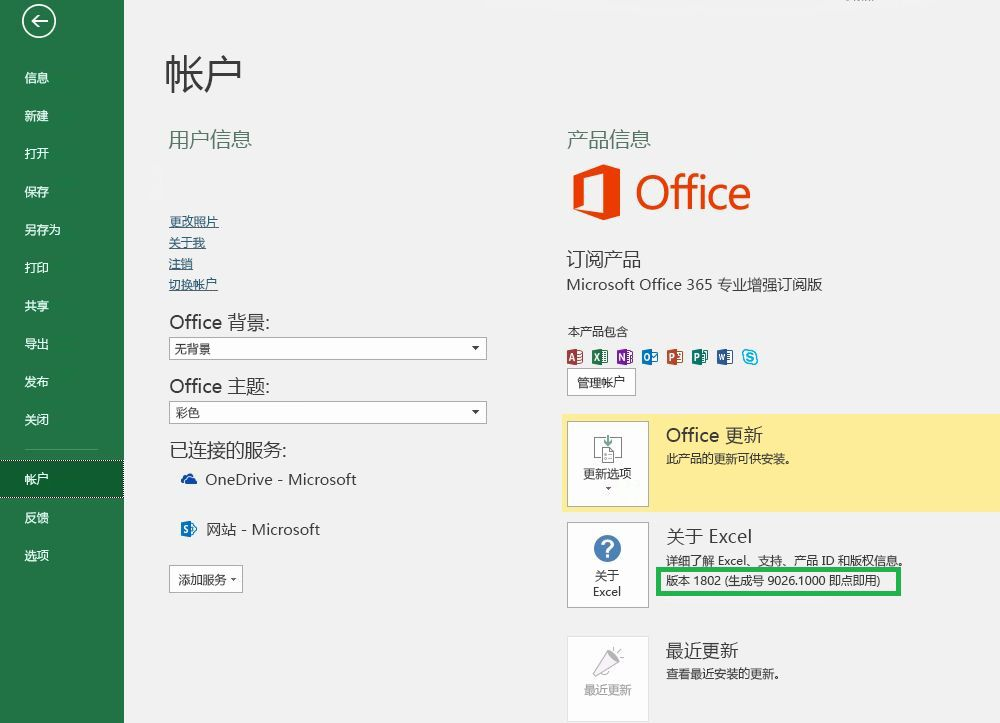

# Office 版本和要求集Office versions and requirement sets

Office 跨多个平台运行且有许多版本，它们并非全都支持 Office JavaScript API (Office.js) 中的所有 API。 不一定总能控制用户安装的 Office 版本。  为了应对这种情况，我们提供了名为“要求集”的系统，以帮助确定 Office 主机是否支持 Office 加载项需要的功能。There are many versions of Office on several platforms, and they don't all support every API in Office JavaScript API (Office.js). You may not always have control over the version of Office your users have installed.  To handle this situation, we provide a system called requirement sets to help you determine whether an Office host supports the capabilities you need in your Office Add-in. 

> [!NOTE]
> - Office 跨多个平台运行，其中包括 Office for Windows、Office Online、Office for Mac 和 Office for iPad。Office runs across multiple platforms, including Office for Windows, Office Online, Office for the Mac, and Office for the iPad.
> - Office 主机示例包括 Excel、Word、PowerPoint、Outlook、OneNote 等 Office 产品。Examples of Office hosts are Office Products: Excel, Word, PowerPoint, Outlook, OneNote, and so forth.  
> - 要求集是 API 成员（如 `ExcelApi 1.5`、`WordApi 1.3` 等）的已命名组。A requirement set is a named group of API members e.g., `ExcelApi 1.5`, `WordApi 1.3`, and so on.  

## 如何检查 Office 版本How to check your Office version

若要确定使用的 Office 版本，请在 Office 应用程序中，依次选择“文件”\*\*\*\* 菜单和“帐户”\*\*\*\*。 Office 版本显示在“产品信息”\*\*\*\* 部分中。 例如，下面的屏幕截图指明 Office 版本 1802（生成号 9026.1000）：To identify the Office version that you're using, from within an Office application, select the **File** menu, and then choose **Account**. The version of Office will appear in the **Product Information** section. For example, the following screenshot indicates Office Version 1802 (Build 9026.1000):

## Office 要求集可用性Office requirement sets availability

Office 加载项可使用 API 要求集，以确定 Office 主机是否支持需要使用的 API 成员。 要求集支持因 Office 主机和 Office 主机版本而异（见上一部分）。Office Add-ins can use API requirement sets to determine whether the Office host supports the API members that it need to use. Requirement set support varies by Office host and the Office host version (see previous section).

一些 Office 主机有自己的 API 要求集。 例如，第一个 Excel API 要求集为 `ExcelApi 1.1`，第一个 Word API 要求集为 `WordApi 1.1`。 从那以后，便新增了多个 ExcelApi 要求集和 WordApi 要求集，以提供其他 API 功能。Some Office hosts have their own API requirement sets. For example, the first requirement set for the Excel API was `ExcelApi 1.1` and the first requirement set for the Word API was `WordApi 1.1`. Since then, multiple new ExcelApi requirement sets and WordApi requirement sets have been added to provide additional API functionality.

此外，通用 API 中还添加了加载项命令（功能区扩展性）和对话框启动功能（对话框 API）等其他功能。In addition, other functionality such as add-in commands (ribbon extensibility) and the ability to launch dialog boxes (Dialog API) were added to the Common API. 加载项命令和对话框 API 要求集是各种 Office 主机共用的 API 集示例。Add-in commands and Dialog API requirement sets are examples of API sets that the various Office hosts share in common.

加载项使用的要求集中的 API 只能是受运行加载项的 Office 主机版本支持的 API。 若要确切了解适用于特定 Office 主机版本的要求集，请参阅以下主机专用要求集文章：An add-in can only use APIs in requirement sets that are supported by the version of Office host where the add-in is running. To know exactly which requirement sets are available for a specific Office host version, refer to the following host-specific requirement set articles:

- [Excel JavaScript API 要求集](/office/dev/add-ins/reference/requirement-sets/excel-api-requirement-sets) (ExcelApi)[Excel JavaScript API requirement sets](/office/dev/add-ins/reference/requirement-sets/excel-api-requirement-sets) (ExcelApi)
- [Word JavaScript API 要求集](/office/dev/add-ins/reference/requirement-sets/word-api-requirement-sets) (WordApi)[Word JavaScript API requirement sets](/office/dev/add-ins/reference/requirement-sets/word-api-requirement-sets) (WordApi)
- [OneNote JavaScript API 要求集](/office/dev/add-ins/reference/requirement-sets/onenote-api-requirement-sets) (OneNoteApi)[OneNote JavaScript API requirement sets](/office/dev/add-ins/reference/requirement-sets/onenote-api-requirement-sets) (OneNoteApi)
- [了解 Outlook API 要求集](/office/dev/add-ins/reference/requirement-sets/outlook-api-requirement-sets) (MailBox)[Understanding Outlook API requirement sets](/office/dev/add-ins/reference/requirement-sets/outlook-api-requirement-sets) (Mailbox)

一些要求集包含任何 Office 主机都能使用的 API。 若要了解这些要求集，请参阅以下文章：Some requirement sets contain APIs that can be used by any Office host. For information about these requirement sets, refer to the following articles:

- [Office 通用要求集Office common requirement sets](/office/dev/add-ins/reference/requirement-sets/office-add-in-requirement-sets)
- [加载项命令要求集Add-in commands requirement sets](/office/dev/add-ins/reference/requirement-sets/add-in-commands-requirement-sets)
- [对话框 API 要求集Dialog API requirement sets](/office/dev/add-ins/reference/requirement-sets/dialog-api-requirement-sets)
- [标识 API 要求集Identity API requirement sets](/office/dev/add-ins/reference/requirement-sets/identity-api-requirement-sets)

要求集的版本号（如 `ExcelApi 1.1` 中的“1.1”）是相对于 Office 主机而言。 给定要求集的版本号（例如，`ExcelApi 1.1`）既不对应于 Office.js 的版本号，也不对应于其他 Office 主机（例如，Word、Outlook 等）的要求集。  各个 Office 主机的要求集的发布速度和时间不同。 例如，`ExcelApi 1.5` 要求集先于 `WordApi 1.3` 要求集发布。The version number of a requirement set, such as the "1.1" in `ExcelApi 1.1`, is relative to the Office host. The version number of a given requirement set (e.g., `ExcelApi 1.1`) does not correspond to the version number of Office.js or to requirement sets for other Office hosts (e.g., Word, Outlook, etc.).  Requirement sets for the different Office hosts are released at different speeds and times. For example, `ExcelApi 1.5` was released before the `WordApi 1.3` requirement set.

适用于 Office 的 JavaScript API 库 (Office.js) 包含当前可用的所有要求集。The JavaScript API for Office library (Office.js) includes all requirement sets that are currently available. 虽然有 `ExcelApi 1.3` 和 `WordApi 1.3` 等要求集，但并无 `Office.js 1.3` 要求集。While there is such a thing as requirement sets `ExcelApi 1.3` and `WordApi 1.3`, there is no `Office.js 1.3` requirement set. 最新版 Office.js 作为一个通过内容传送网络 (CDN) 提供的 Office 终结点进行维护。The latest release of Office.js is maintained as a single Office endpoint delivered via the content delivery network (CDN). 若要详细了解 Office.js CDN（包括如何处理版本控制和向后兼容性），请参阅[了解适用于 Office 的 JavaScript API](/office/dev/add-ins/develop/understanding-the-javascript-api-for-office)。For more details around the Office.js CDN, including how versioning and backward compatibility is handled, see [Understanding the JavaScript API for Office](/office/dev/add-ins/develop/understanding-the-javascript-api-for-office).

## 指定 Office 主机和要求集Specify Office hosts and requirement sets

可通过多种方法来指定加载项需要的 Office 主机和要求集。  有关详细信息，请参阅[指定 Office 主机和 API 要求](/office/dev/add-ins/develop/specify-office-hosts-and-api-requirements)There are various ways to specify which Office hosts and requirement sets are required by an add-in.  For detailed information, see [Specify Office hosts and API requirements](/office/dev/add-ins/develop/specify-office-hosts-and-api-requirements)

## 另请参阅See also

- [指定 Office 主机和 API 要求Specify Office hosts and API requirements](/office/dev/add-ins/develop/specify-office-hosts-and-api-requirements)
- [安装最新版 OfficeInstall the latest version of Office](/office/dev/add-ins/develop/install-latest-office-version)
- [Office 365 专业增强版的更新通道概述Overview of update channels for Office 365 ProPlus](/deployoffice/overview-of-update-channels-for-office-365-proplus)
- [通过 Office 365 充分利用 OfficeGet the most from Office with Office 365](https://products.office.com/compare-all-microsoft-office-products?tab=2)
