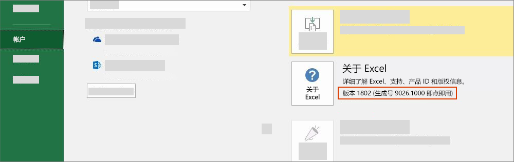

# Office 版本和要求集

Office 跨多个平台运行且有许多版本，它们并非全都支持 Office JavaScript API (Office.js) 中的所有 API。不一定总能控制用户安装的 Office 版本。为了应对这种情况，我们提供了名为“要求集”的系统，以帮助确定 Office 应用程序是否支持 Office 加载项需要的功能。

> [!NOTE]
>
> - Office 跨多个平台（包括 Windows、浏览器、Mac 和 iPad）运行。
> - Office 应用程序示例包括 Excel、Word、PowerPoint、Outlook、OneNote 等 Office 产品。  
> - 要求集是 API 成员（如 `ExcelApi 1.5`、`WordApi 1.3` 等）的已命名组。  

## 如何检查 Office 版本

若要确定使用的 Office 版本，请在 Office 应用程序中，依次选择“**文件**”菜单和“**帐户**”。Office 版本显示在“**产品信息**”部分中。例如，下面的屏幕截图指明 Office 版本 1802（生成号 9026.1000）。

## Office 要求集可用性

Office 加载项可使用 API 要求集，以确定 Office 应用程序是否支持需要使用的 API 成员。要求集支持因 Office 应用程序和 Office 应用程序版本而异（见上一部分）。

一些 Office 应用程序有自己的 API 要求集。 例如，第一个 Excel API 要求集为 `ExcelApi 1.1`，第一个 Word API 要求集为 `WordApi 1.1`。从那以后，便新增了多个 ExcelApi 要求集和 WordApi 要求集，以提供其他 API 功能。

此外，通用 API 中还添加了加载项命令（功能区扩展性）和对话框启动功能（对话框 API）等其他功能。 加载项命令和对话框 API 要求集是各种 Office 应用程序共用的 API 集示例。

加载项使用的要求集中的 API 只能是受运行加载项的 Office 应用程序版本支持的 API。若要确切了解适用于特定 Office 应用程序版本的要求集，请参阅以下特定于应用程序的要求集文章。

- [Excel JavaScript API 要求集](../reference/requirement-sets/excel-api-requirement-sets.md) (ExcelApi)
- [Word JavaScript API 要求集](../reference/requirement-sets/word-api-requirement-sets.md) (WordApi)
- [OneNote JavaScript API 要求集](../reference/requirement-sets/onenote-api-requirement-sets.md) (OneNoteApi)
- [PowerPoint JavaScript API 要求集](../reference/requirement-sets/powerpoint-api-requirement-sets.md) (PowerPointApi)
- [了解 Outlook API 要求集](../reference/requirement-sets/outlook-api-requirement-sets.md) (MailBox)

一些要求集包含任何 Office 应用程序都能使用的 API。若要了解这些要求集，请参阅以下文章。

- [Office 通用要求集](../reference/requirement-sets/office-add-in-requirement-sets.md)
- [加载项命令要求集](../reference/requirement-sets/add-in-commands-requirement-sets.md)
- [对话框 API 要求集](../reference/requirement-sets/dialog-api-requirement-sets.md)
- [标识 API 要求集](../reference/requirement-sets/identity-api-requirement-sets.md)

要求集的版本号（如 `ExcelApi 1.1` 中的“1.1”）是相对于 Office 应用程序而言。给定要求集的版本号（例如，`ExcelApi 1.1`）既不对应于 Office.js 的版本号，也不对应于其他 Office 应用程序（例如，Word、Outlook 等）的要求集。各个 Office 应用程序的要求集的发布速率不同。例如，`ExcelApi 1.5` 要求集先于 `WordApi 1.3` 要求集发布。

适用于 Office 的 JavaScript API 库 (Office.js) 包含当前可用的所有要求集。 虽然有 `ExcelApi 1.3` 和 `WordApi 1.3` 等要求集，但并无 `Office.js 1.3` 要求集。 最新版 Office.js 作为一个通过内容传送网络 (CDN) 提供的 Office 终结点进行维护。 若要详细了解 Office.js CDN（包括如何处理版本控制和向后兼容性），请参阅[了解适用于 Office 的 JavaScript API](../develop/understanding-the-javascript-api-for-office.md)。

## 指定 Office 应用程序和要求集

可通过多种方法来指定加载项需要的 Office 应用程序和要求集。有关详细信息，请参阅[指定 Office 应用程序和 API 要求](../develop/specify-office-hosts-and-api-requirements.md)

## 另请参阅

- [指定 Office 应用程序和 API 要求集](../develop/specify-office-hosts-and-api-requirements.md)
- [安装最新版 Office](../develop/install-latest-office-version.md)
- [Microsoft 365 应用版更新频道概述](/deployoffice/overview-of-update-channels-for-office-365-proplus)
- [利用 Microsoft 365 和 Microsoft Teams 重塑生产力](https://products.office.com/compare-all-microsoft-office-products?tab=2)
