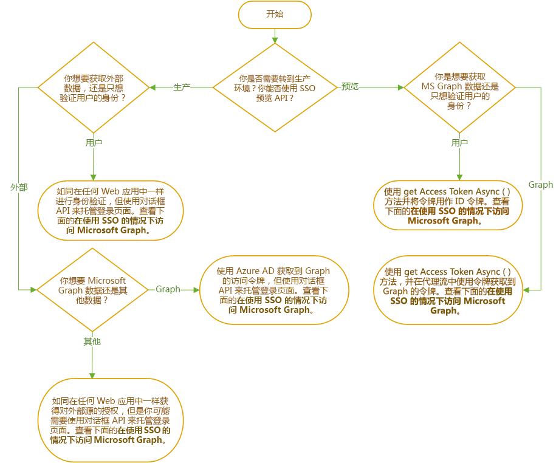

# Office 加载项中的身份验证和授权概述Overview of identity, authentication, and authorization in Office 2013

Web 应用程序和 Office 加载项默认允许匿名访问，但你可要求用户通过登录进行身份验证。Web applications and, hence, Office Add-ins allow anonymous access by default, but you can require users to authenticate with a login. 例如，可以要求用户使用 Microsoft 帐户、Office 365 工作或学校帐户或者其他常用帐户登录。For example, you can require that your users be logged in with a Microsoft Account, an Office 365 Work or School account, or other common account. 此任务被称为“用户身份验证”，因为它让加载项能够知道用户的身份。This task is called user authentication because it enables the add-in to know who the user is.

你的加载项还能够获得用户的同意来访问其 Microsoft Graph 数据（例如其 Office 365 个人资料、OneDrive 文件和 SharePoint 数据），或者访问 Google、Facebook、领英、SalesForce 和 GitHub 等其他外部源中的数据。Your add-in can also get the user's consent to access their Microsoft Graph data (such as their Office 365 profile, OneDrive files, and SharePoint data) or to data in other external sources such as Google, Facebook, LinkedIn, SalesForce, and GitHub. 此任务被称为“加载项（或应用）授权”，因为要获得授权的是*加载项*，而不是用户。This task is called add-in (or app) authorization, because it is the *add-in* that is being authorized, not the user.

有两种方式可用来完成这些身份验证。You have a choice of two ways to accomplish these authentications.

- **Office 单一登录 (SSO)**：此系统*当前为预览版*，它让用户能在登录到 Office 的同时登录到加载项。**Office Single Sign-on (SSO)**: A system, *currently in preview*, that enables the user's login to Office to also function as a login to the add-in. 此外，此加载项还可使用用户的 Office 凭据向加载项授予对 Microsoft Graph 的权限。Optionally, the add-in can also use the user's Office credentials to authorize the add-in to Microsoft Graph. （不可通过此系统访问非 Microsoft 源。）(Non-Microsoft sources are not accessible through this system.)
- **通过 Azure Active Directory 进行 Web 身份验证和授权**：这是老生常谈，没有特别之处。**Web Application Authentication and Authorization with Azure Active Directory**: This isn't something new or special. 它只是在出现 Office SSO 系统之前 Office 加载项（及其他 Web 应用）对用户进行身份验证和授权应用的方式，现在仍在 Office SSO 不可用的场景中使用。It's just the way Office add-in (and other web apps) authenticated users and authorized apps before there was an Office SSO system and is still used in scenarios where Office SSO cannot be.

下列流程图展示了需要如同加载项开发人员一样作出的决策。The following flowchart shows you the decisions that you need to make as an add-in developer. 详细信息请参见本文稍后部分。Authentication options are discussed later in this article.

## 在不使用 SSO 的情况下进行用户身份验证User authentication without SSO

你可如同在任何其他 Web 应用程序中操作一样使用 Azure Active Directory (AAD) 在 Office 加载项中对用户进行身份验证，但存在一个例外：AAD 禁止其登录页在 iFrame 中打开。You can authenticate a user in an Office Add-in with Azure Active Directory (AAD) as you would any in any other web application with one exception: AAD does not allow its login page to open in an iframe. 当 Office 加载项在 *Office 网页版*中运行时，任务窗格是一个 iFrame。When an Office Add-in is running on *Office on the web*, the task pane is an iframe. 这意味着你将需要在通过 Office 对话框 API 打开的对话框中打开 AAD 登录屏幕。This means that you will need to open the AAD login screen in a dialog opened with the Office Dialog API. 这会影响你使用身份验证帮助程序库的方式。This affects how you use authentication helper libraries. 有关详细信息，请参阅[使用 Office 对话框 API 进行身份验证](auth-with-office-dialog-api.md)。For more information, see [Authentication with the Office Dialog API](auth-with-office-dialog-api.md).

要了解如何使用 AAD 对身份验证进行编程，首先请查看 [Microsoft 标识平台 (v2.0) 概述](/azure/active-directory/develop/v2-overview)。For information about programming authentication with AAD, begin with [Microsoft identity platform (v2.0) overview](/azure/active-directory/develop/v2-overview). 该文档集中有很多教程和指南，还有相关示例和库的链接。There are many tutorials and guides in that documentation set, as well as links to relevant samples and libraries. 正如[使用 Office 对话框 API 进行身份验证](auth-with-office-dialog-api.md)中所述，你可能需要调整示例中的代码以在 Office 对话框中运行。As explained in [Authentication with the Office Dialog API](auth-with-office-dialog-api.md), you may need to adjust the code in the samples to run in the Office Dialog.

## 在不使用 SSO 的情况下访问 Microsoft GraphAccess to Microsoft Graph without SSO

可通过从 Azure Active Directory (AAD) 获取到 Microsoft Graph 的访问令牌，为加载项获得到 Graph 数据的授权。You can get authorization to Microsoft Graph data for your add-in by obtaining an access token to Graph from Azure Active Directory (AAD). 可在不依赖 Office SSO 的情况下执行此操作。You can do this without relying on Office SSO. 要详细了解操作方式，请参阅[在不使用 SSO 的情况下访问 Microsoft Graph](authorize-to-microsoft-graph-without-sso.md)（此文中有更多详细信息和示例链接）。For more information about how, see [Access to Microsoft Graph without SSO](authorize-to-microsoft-graph-without-sso.md) which has more details and links to samples.

## 在使用 SSO 的情况下进行用户身份验证User authentication with SSO

要使用 SSO 来验证用户的身份，任务窗格或函数文件中的代码会调用 [getAccessTokenAsync](/javascript/api/office/office.auth#getaccesstokenasync-options--callback-) 方法。To use SSO to authenticate the user, your code in a task pane or function file calls the [getAccessTokenAsync](/javascript/api/office/office.auth#getaccesstokenasync-options--callback-) method. 如果用户未登录 Office，则 Office 将打开一个对话框，并将其导航到 Azure Active Directory 登录页面。If the user is not signed into Office, Office will open a dialog and navigate it to the Azure Active Directory login page. 用户登录后或者在用户已登录时，该方法会返回一个访问令牌。After the user is signed in, or if the user is already signed in, the method returns an access token. 此令牌是**代理**流中的启动令牌。The token is a bootstrap token in the **On Behalf Of** flow. （详见[使用 SSO 访问 Microsoft Graph](#access-to-microsoft-graph-with-sso)。）但是，它也可用作 ID 令牌，因为它包含多个对当前用户而言唯一的声明，例如 `preferred_username`、`name`、`sub` 和 `oid`。(See [Access to Microsoft Graph with SSO](#access-to-microsoft-graph-with-sso).) However, it can be used as an ID token as well, because it contains several claims that are unique to the current user, including `preferred_username`, `name`, `sub`, and `oid`. 要查看指南了解将哪个属性用作最终用户 ID，请参阅 [Microsoft 标识平台访问令牌](https://docs.microsoft.com/zh-CN/azure/active-directory/develop/access-tokens#payload-claims)。For guidance on which property to use as the ultimate user ID, see [Microsoft identity platform access tokens](https://docs.microsoft.com/zh-CN/azure/active-directory/develop/access-tokens#payload-claims). 有关上述某一令牌的示例，请参阅[访问令牌示例](sso-in-office-add-ins.md#example-access-token)。For an example of a one of these tokens, see the [Example access token](sso-in-office-add-ins.md#example-access-token).

代码从令牌中提取所需的声明后，它将使用该值在你保留的用户表或用户数据库中查找用户。After your code has extracted the desired claim from the token, it uses that value to look up the user in a user table or user database that you maintain. 使用数据库来用户用户首选项或用户帐户状态等用户相关信息。Use the database to store user-relative information such as the user's preferences or the state of the user's account. 由于你在使用 SSO，因此你的用户不单独登录到你的加载项，你无需存储用户的密码。Since you are using SSO, your users don't sign-in separately to your add-in, so you do not need to store a password for the user.

在开始使用 SSO 实现用户身份验证之前，请确保你完全熟悉[为 Office 加载项启用单一登录](sso-in-office-add-ins.md)一文。另请注意下述示例：Before you begin implementing user authentication with SSO, be sure that you are thoroughly familiar with the article [Enable single sign-on for Office Add-ins](sso-in-office-add-ins.md). Note also these samples:

- [NodeJS SSO 中的 Office 加载项](https://github.com/OfficeDev/Office-Add-in-NodeJS-SSO)，尤其是 [auth.ts](https://github.com/OfficeDev/Office-Add-in-NodeJS-SSO/blob/master/Completed/src/auth.ts) 文件，它使用 [jswebtoken](https://github.com/auth0/node-jsonwebtoken) 库来解码和分析令牌。[Office Add-in NodeJS SSO](https://github.com/OfficeDev/Office-Add-in-NodeJS-SSO), especially the file [auth.ts](https://github.com/OfficeDev/Office-Add-in-NodeJS-SSO/blob/master/Completed/src/auth.ts) which uses the library [jswebtoken](https://github.com/auth0/node-jsonwebtoken) to decode and parse the token. （但是，此示例不将令牌用作 ID 令牌。(This sample, however, does not use the token as an ID token. 它使用此令牌通过**代理**流获得对 Microsoft Graph 的访问权限。）It uses it to get access to Microsoft Graph with the **On Behalf Of** flow.)
- [ASP.NET SSO 中的 Office 加载项](https://github.com/OfficeDev/Office-Add-in-ASPNET-SSO)，尤其是 [ValuesController.ts](https://github.com/OfficeDev/Office-Add-in-ASPNET-SSO/blob/master/Complete/Office-Add-in-ASPNET-SSO-WebAPI/Controllers/ValuesController.cs) 文件，它使用库 [System.Security.Claims.ClaimsPrincipal](https://docs.microsoft.com/dotnet/api/system.security.claims.claimsprincipal) 类从令牌中提取声明。[Office Add-in ASP.NET SSO](https://github.com/OfficeDev/Office-Add-in-ASPNET-SSO), especially the file [ValuesController.ts](https://github.com/OfficeDev/Office-Add-in-ASPNET-SSO/blob/master/Complete/Office-Add-in-ASPNET-SSO-WebAPI/Controllers/ValuesController.cs) which uses the library [System.Security.Claims.ClaimsPrincipal](https://docs.microsoft.com/dotnet/api/system.security.claims.claimsprincipal) class to extract claims from the token. （但是，此示例不将令牌用作 ID 令牌。(This sample, however, does not use the token as an ID token. 它从令牌中提取 `scope`，并用它通过**代理**流获得访问 Microsoft Graph 的权限。）It extracts a `scope` claim from the token and uses it to get access to Microsoft Graph with the **On Behalf Of** flow.)

## 在使用 SSO 的情况下访问 Microsoft GraphAccess to Microsoft Graph with SSO

要使用 SSO 来获取访问 Microsoft Graph 的权限，任务窗格或函数文件中的加载项会调用 [getAccessTokenAsync](/javascript/api/office/office.auth#getaccesstokenasync-options--callback-) 方法。To use SSO to get access to Microsoft Graph, your add-in in a task pane or function file calls the [getAccessTokenAsync](/javascript/api/office/office.auth#getaccesstokenasync-options--callback-) method. 如果用户未登录 Office，则 Office 将打开一个对话框，并将其导航到 Azure Active Directory 登录页面。If the user is not signed into Office, Office will open a dialog and navigate it to the Azure Active Directory login page. 用户登录后或者在用户已登录时，该方法会返回一个访问令牌。After the user is signed in, or if the user is already signed in, the method returns an access token. 此令牌是**代理**流中的启动令牌。The token is a bootstrap token in the **On Behalf Of** flow. 具体而言，它有一个带 `access_as_user` 值的 `scope` 声明。Specifically, it has a `scope` claim with the value `access_as_user`. 要在指南中了解令牌中的声明，请参阅 [Microsoft 标识平台访问令牌](https://docs.microsoft.com/zh-CN/azure/active-directory/develop/access-tokens#payload-claims)。For guidance about the claims in the token, see [Microsoft identity platform access tokens](https://docs.microsoft.com/zh-CN/azure/active-directory/develop/access-tokens#payload-claims). 有关上述某一令牌的示例，请参阅[访问令牌示例](sso-in-office-add-ins.md#example-access-token)。For an example of a one of these tokens, see the [Example access token](sso-in-office-add-ins.md#example-access-token).

在代码获取令牌后，它会在**代理**流中使用该令牌来获取第二个令牌，即到 Microsoft Graph 的访问令牌。After your code obtains the token, it uses it in the **On Behalf Of** flow to obtain a second token: an access token to Microsoft Graph.

在开始实现 Office SSO 之前，请确保你完全熟悉下面两篇文章：Before you begin implementing Office SSO, be sure that you are thoroughly familiar with these two articles:

- [为 Office 加载项启用单一登录Enable single sign-on for Office Add-ins](sso-in-office-add-ins.md)
- [使用 SSO 对 Microsoft Graph 授权Authorize to Microsoft Graph with SSO](authorize-to-microsoft-graph.md)

你还应至少阅读此处所列的其中一篇演示文章。You should also read at least one of the walkthrough articles listed here. 即使你不执行这些步骤，也可在其中了解有关如何实现 Office SSO 和**代理**流的宝贵信息。Even if you don't carry out the steps, these contain valuable information about how you implement Office SSO and the **On Behalf Of** flow. 

- [创建使用单一登录的 ASP.NET Office 加载项Create an ASP.NET Office Add-in that uses single sign-on](create-sso-office-add-ins-aspnet.md)
- [创建使用单一登录的 Node.js Office 加载项Create a Node.js Office Add-in that uses single sign-on](create-sso-office-add-ins-nodejs.md)

另请注意下述示例：Note also these samples:

- [Office 加载项 NodeJS SSOOffice Add-in NodeJS SSO](https://github.com/OfficeDev/Office-Add-in-NodeJS-SSO)
- [Office 加载项 ASP.NET SSOOffice Add-in ASP.NET SSO](https://github.com/OfficeDev/Office-Add-in-ASPNET-SSO)

## 访问非 Microsoft 数据源Access to non-Microsoft data sources

借助 Google、Facebook、领英、SalesForce 和 GitHub 等热门在线服务，开发人员可授权用户访问自己在其他应用中的帐户。Popular online services, including Office 365, Google, Facebook, LinkedIn, SalesForce, and GitHub, let developers give users access to their accounts in other applications. 这样，便可在 Office 加载项中添加这些服务。This gives you the ability to include these services in your Office Add-in. 要概述了解加载项可执行此操作的方法，请参阅[在 Office 加载项中授权外部服务](auth-external-add-ins.md)。For an overview of the ways that your add-in can do this, see [Authorize external services in your Office Add-in](auth-external-add-ins.md).

> [!IMPORTANT]
> 开始编码之前，请了解数据源是否允许在 iFrame 中打开其登录屏幕。Before you begin coding, find out if the data source allows its login in screen to be opened in an iFrame. 当 Office 加载项在 *Office 网页版*中运行时，任务窗格是一个 iFrame。When an Office Add-in is running on *Office on the web*, the task pane is an iFrame. 如果数据源禁止在 iFrame 中打开其登录屏幕，则你需要在通过 Office 对话框 API 打开的对话框中打开登录屏幕。If the data source does not allow its login screen to be opened in an iFrame, then you will need to open the login screen in a dialog opened with the Office Dialog API. 有关详细信息，请参阅[使用 Office 对话框 API 进行身份验证](auth-with-office-dialog-api.md)。For more information, see [Authentication with the Office Dialog API](auth-with-office-dialog-api.md).

