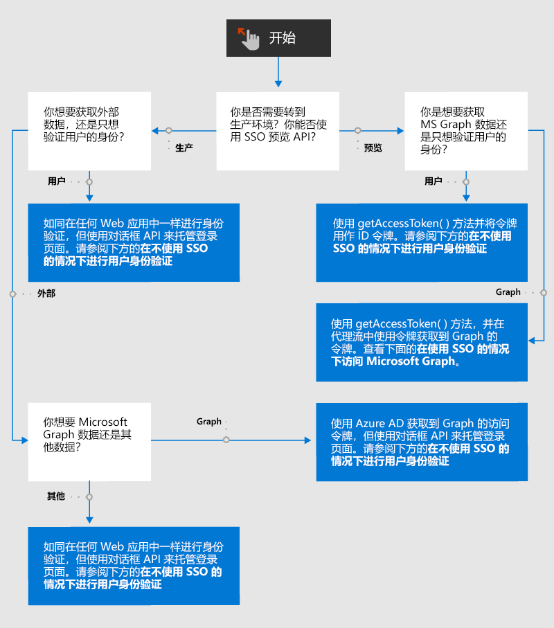

# Office 加载项中的身份验证和授权概述

Web 应用程序和 Office 加载项默认允许匿名访问，但你可要求用户通过登录进行身份验证。 例如，你可以要求用户使用 Microsoft 帐户、Microsoft 365 教育版或工作帐户，或者其他常用帐户登录。 此任务被称为“用户身份验证”，因为它让加载项能够知道用户的身份。

你的加载项还能从用户处获得对其以下数据的访问许可：Microsoft Graph 数据（例如其 Microsoft 365 个人资料、OneDrive 文件和 SharePoint 数据），或者 Google、Facebook、领英、SalesForce 和 GitHub 等其他外部源中的数据。 此任务被称为“加载项（或应用）授权”，因为要获得授权的是 *加载项*，而不是用户。

可选择两种方法来完成身份验证和授权。

- **Office 单一登录 (SSO)**：一种可让用户登录到 Office 从而还可用于登录到加载项的系统。 此外，此加载项还可使用用户的 Office 凭据向加载项授予对 Microsoft Graph 的权限。 （不可通过此系统访问非 Microsoft 源。）
- **通过 Azure Active Directory 进行 Web 身份验证和授权**：这是老生常谈，没有特别之处。 这只是 Office 加载项（及其他 Web 应用）在出现 Office SSO 系统之前对用户进行身份验证和授权应用的方式，现在仍在 Office SSO 不可用的场景中使用。 此外，在某些方案中，即使在 SSO 可用的情况下，用户也需要单独登录加载项；例如，当你希望他们可以选择使用与当前登录到 Office 的 ID 不同的 ID 登录到该加载项时。

下列流程图展示了需要如同加载项开发人员一样作出的决策。详细信息请参见本文稍后部分。

## 在不使用 SSO 的情况下进行用户身份验证

你可如同在其他 Web 应用程序中操作一样使用 Azure Active Directory (AAD) 在 Office 加载项中对用户进行身份验证，但存在一个例外：AAD 禁止其登录页在 iFrame 中打开。 当 Office 加载项在 *Office 网页版* 中运行时，任务窗格是一个 iFrame。 这意味着你将需要在通过 Office 对话框 API 打开的对话框中打开 AAD 登录屏幕。 这会影响你使用身份验证帮助程序库的方式。 有关详细信息，请参阅[使用 Office 对话框 API 进行身份验证](auth-with-office-dialog-api.md)。

有关使用 AAD 设置身份验证的信息，请先参阅[Microsoft 标识平台 (v2.0) 概览](/azure/active-directory/develop/v2-overview)，其中可找到诸多教程和指南以及相关示例和库的链接。 正如[使用 Office 对话框 API 进行身份验证](auth-with-office-dialog-api.md)中所述，你可能需要调整示例中的代码以在 Office 对话框中运行。

## 在不使用 SSO 的情况下访问 Microsoft Graph

可通过从 Azure Active Directory (AAD) 获取到 Microsoft Graph 的访问令牌，为加载项获得到 Graph 数据的授权。 可在不依赖 Office SSO 的情况下执行此操作。 要详细了解操作方式，请参阅[在不使用 SSO 的情况下访问 Microsoft Graph](authorize-to-microsoft-graph-without-sso.md)（此文中有更多详细信息和示例链接）。

## 在使用 SSO 的情况下进行用户身份验证

要使用 SSO 来验证用户身份，任务窗格或函数文件中的代码会调用 [getAccessToken](/javascript/api/office-runtime/officeruntime.auth#getAccessToken_options_) 方法。 如果用户未登录，则 Office 将打开一个对话框，并将其导航到 Azure Active Directory 登录页面。 用户登录后或者在用户已登录时，该方法会返回一个访问令牌。 此令牌是 **代理** 流中的启动令牌。 （详见[使用 SSO 访问 Microsoft Graph](#access-to-microsoft-graph-with-sso)。）但是，它也可用作 ID 令牌，因为它包含多个对当前用户而言唯一的声明，例如 `preferred_username`、`name`、`sub` 和 `oid`。 要查看指南了解将哪个属性用作最终用户 ID，请参阅 [Microsoft 标识平台访问令牌](/azure/active-directory/develop/access-tokens#payload-claims)。 有关上述某一令牌的示例，请参阅[访问令牌示例](sso-in-office-add-ins.md#example-access-token)。

代码从令牌中提取所需的声明后，它将使用该值在你保留的用户表或用户数据库中查找用户。 使用数据库来用户用户首选项或用户帐户状态等用户相关信息。 由于你在使用 SSO，因此你的用户不单独登录到你的加载项，你无需存储用户的密码。

在开始使用 SSO 急性用户身份验证之前，请确保完全了解[为 Office 加载项启用单一登录](sso-in-office-add-ins.md)。另请注意下述示例。

- [Office 加载项 NodeJS SSO](https://github.com/OfficeDev/Office-Add-in-NodeJS-SSO)，特别是文件 [ssoAuthES6.js](https://github.com/OfficeDev/Office-Add-in-NodeJS-SSO/blob/master/Complete/public/javascripts/ssoAuthES6.js)。
- [Office 加载项 ASP.NET SSO](https://github.com/OfficeDev/Office-Add-in-ASPNET-SSO)。

但是，这些示例不将令牌用作 ID 令牌。 它们使用此令牌通过 **代理** 流获得对 Microsoft Graph 的访问权限。

## 在使用 SSO 的情况下访问 Microsoft Graph

要使用 SSO 来获取访问 Microsoft Graph 的权限，任务窗格或函数文件中的加载项会调用 [getAccessToken](/javascript/api/office-runtime/officeruntime.auth#getAccessToken_options_) 方法。 如果用户未登录 Office，则 Office 将打开一个对话框，并导航到 Azure Active Directory 登录页面。 用户登录后或者在用户已登录时，该方法会返回一个访问令牌。 此令牌是 **代理** 流中的启动令牌。 具体而言，它有一个带 `access_as_user` 值的 `scope` 声明。 要在指南中了解令牌中的声明，请参阅 [Microsoft 标识平台访问令牌](/azure/active-directory/develop/access-tokens#payload-claims)。 有关上述某一令牌的示例，请参阅[访问令牌示例](sso-in-office-add-ins.md#example-access-token)。

在代码获取令牌后，它会在 **代理** 流中使用该令牌来获取第二个令牌，即到 Microsoft Graph 的访问令牌。

在开始使用 Office SSO 之前，请确保完全了解下面两篇文章。

- [为 Office 加载项启用单一登录](sso-in-office-add-ins.md)
- [使用 SSO 对 Microsoft Graph 授权](authorize-to-microsoft-graph.md)

你还应至少阅读此处所列的其中一篇演示文章。 即使你不执行这些步骤，也可在其中了解有关如何实现 Office SSO 和 **代理** 流的宝贵信息。

- [创建使用单一登录的 ASP.NET Office 加载项](create-sso-office-add-ins-aspnet.md)
- [创建使用单一登录的 Node.js Office 加载项](create-sso-office-add-ins-nodejs.md)

另请参阅以下内容。

- [Office 加载项 NodeJS SSO](https://github.com/OfficeDev/Office-Add-in-NodeJS-SSO)
- [Office 加载项 ASP.NET SSO](https://github.com/OfficeDev/Office-Add-in-ASPNET-SSO)

## 访问非 Microsoft 数据源

借助 Google、Facebook、领英、SalesForce 和 GitHub 等热门在线服务，开发人员可授权用户访问自己在其他应用中的帐户。 这样，便可在 Office 加载项中添加这些服务。 要概述了解加载项可执行此操作的方法，请参阅[在 Office 加载项中授权外部服务](auth-external-add-ins.md)。

> [!IMPORTANT]
> 开始编码之前，请了解数据源是否允许在 iFrame 中打开其登录屏幕。 当 Office 加载项在 *Office 网页版* 中运行时，任务窗格是一个 iFrame。 如果数据源禁止在 iFrame 中打开其登录屏幕，则你需要在通过 Office 对话框 API 打开的对话框中打开登录屏幕。 有关详细信息，请参阅[使用 Office 对话框 API 进行身份验证](auth-with-office-dialog-api.md)。
