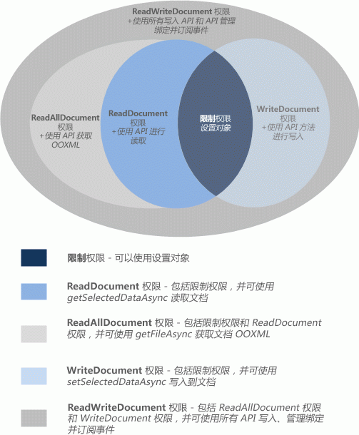

# <a name="requesting-permissions-for-api-use-in-add-ins"></a><span data-ttu-id="37cf5-102">在加载项中请求获取 API 使用权限</span><span class="sxs-lookup"><span data-stu-id="37cf5-102">Requesting permissions for API use in add-ins</span></span>

<span data-ttu-id="37cf5-103">本文说明您可以在内容或任务窗格加载项清单中声明的不同权限级别，以指定加载项功能所需的 JavaScript API 访问的级别。</span><span class="sxs-lookup"><span data-stu-id="37cf5-103">This article describes the different permission levels that you can declare in your content or task pane add-in's manifest to specify the level of JavaScript API access your add-in requires for its features.</span></span> 

## <a name="permissions-model"></a><span data-ttu-id="37cf5-104">权限模型</span><span class="sxs-lookup"><span data-stu-id="37cf5-104">Permissions model</span></span>

<span data-ttu-id="37cf5-105">5 级 JavaScript API 访问权限模型为内容和任务窗格加载项的用户提供基本的隐私和安全功能。图 1 显示您可以在加载项清单中声明的 API 权限的 5 个级别。</span><span class="sxs-lookup"><span data-stu-id="37cf5-105">A five-level JavaScript API access-permissions model provides the basis for privacy and security for users of your content and task pane add-ins. Figure 1 shows the five levels of API permissions you can declare in your add-in's manifest.</span></span>

<span data-ttu-id="37cf5-106">*图 1：内容和任务窗格加载项的 5 级权限模型*</span><span class="sxs-lookup"><span data-stu-id="37cf5-106">*Figure 1. The five-level permission model for content and task pane add-ins*</span></span>



<span data-ttu-id="37cf5-p101">这些权限指定加载项运行时在用户插入然后激活（信任）加载项时允许内容或任务窗格加载项使用的 API 子集。若要声明内容或任务窗格加载项所需的权限级别，请在加载项清单的 [Permissions](/office/dev/add-ins/reference/manifest/permissions) 元素中指定任一权限文本值。以下示例要求 **WriteDocument** 权限，仅允许可以对文档进行写入（而非阅读）的方法。</span><span class="sxs-lookup"><span data-stu-id="37cf5-p101">These permissions specify the subset of the API that the add-in runtime will allow your content or task pane add-in to use when a user inserts, and then activates (trusts) your add-in. To declare the permission level your content or task pane add-in requires, specify one of the permission text values in the [Permissions](/office/dev/add-ins/reference/manifest/permissions) element of your add-in's manifest. The following example requests the **WriteDocument** permission, which will allow only methods that can write to (but not read) the document.</span></span>

```XML
<Permissions>WriteDocument</Permissions>
```

<span data-ttu-id="37cf5-p102">作为最佳做法，应该根据 _最小特权_ 原则请求权限。也就是说，应该请求仅可访问加载项正常运行所需的 API 最小子集的权限。例如，如果您加载项的功能只需要读取用户文档中的数据，应该请求的权限不应高于 **ReadDocument** 权限。</span><span class="sxs-lookup"><span data-stu-id="37cf5-p102">As a best practice, you should request permissions based on the principle of  _least privilege_. That is, you should request permission to access only the minimum subset of the API that your add-in requires to function correctly. For example, if your add-in needs only to read data in a user's document for its features, you should request no more than the **ReadDocument** permission.</span></span>

<span data-ttu-id="37cf5-114">下表描述了每个权限级别启用的 JavaScript API 子集。</span><span class="sxs-lookup"><span data-stu-id="37cf5-114">The following table describes the subset of the JavaScript API that is enabled by each permission level.</span></span>

|<span data-ttu-id="37cf5-115">**权限**</span><span class="sxs-lookup"><span data-stu-id="37cf5-115">**Permission**</span></span>|<span data-ttu-id="37cf5-116">**启用的 API 子集**</span><span class="sxs-lookup"><span data-stu-id="37cf5-116">**Enabled subset of the API**</span></span>|
|:-----|:-----|
|<span data-ttu-id="37cf5-117">**受限**</span><span class="sxs-lookup"><span data-stu-id="37cf5-117">**Restricted**</span></span>|<span data-ttu-id="37cf5-118">[Settings](/javascript/api/office/office.settings) 对象的方法和 [Document.getActiveViewAsync](/javascript/api/office/office.document#getactiveviewasync-options--callback-) 方法。这是内容或任务窗格加载项可以请求的最低级别权限。</span><span class="sxs-lookup"><span data-stu-id="37cf5-118">The methods of the [Settings](/javascript/api/office/office.settings) object, and the [Document.getActiveViewAsync](/javascript/api/office/office.document#getactiveviewasync-options--callback-) method.This is the minimum permission level that can be requested by a content or task pane add-in.</span></span>|
|<span data-ttu-id="37cf5-119">**ReadDocument**</span><span class="sxs-lookup"><span data-stu-id="37cf5-119">**ReadDocument**</span></span>|<span data-ttu-id="37cf5-120">除了**受限制**权限允许的 api，添加对 api 成员的访问权限，以读取文档和管理绑定。这包括使用：</span><span class="sxs-lookup"><span data-stu-id="37cf5-120">In addition to the API allowed by the **Restricted** permission, adds access to the API members necessary to read the document and manage bindings.This includes the use of:</span></span><br/><ul><li><span data-ttu-id="37cf5-121">
  <a href="/javascript/api/office/office.document#getselecteddataasync-coerciontype--options--callback-" target="_blank">Document.getSelectedDataAsync</a> 方法，用于获取所选文本、HTML（仅限 Word）或表格数据，但不可用于包含文档中所有数据的基础 Open Office XML (OOXML) 代码。</span><span class="sxs-lookup"><span data-stu-id="37cf5-121">The <a href="/javascript/api/office/office.document#getselecteddataasync-coerciontype--options--callback-" target="_blank">Document.getSelectedDataAsync</a> method to get the selected text, HTML (Word only), or tabular data, but not the underlying Open Office XML (OOXML) code that contains all of the data in the document.</span></span></p></li><li><p><span data-ttu-id="37cf5-122"><a href="/javascript/api/office/office.document#getfileasync-filetype--options--callback-" target="_blank">Document.getFileAsync</a> 方法，用于获取文档中的所有文本，而不是文档的基础 OOXML 二进制副本。</span><span class="sxs-lookup"><span data-stu-id="37cf5-122">The <a href="/javascript/api/office/office.document#getfileasync-filetype--options--callback-" target="_blank">Document.getFileAsync</a> method to get all of the text in the document, but not the underlying OOXML binary copy of the document.</span></span></p></li><li><p><span data-ttu-id="37cf5-123"><a href="/javascript/api/office/office.binding#getdataasync-options--callback-" target="_blank">Binding.getDataAsync</a> 方法，用于读取文档中的绑定数据。</span><span class="sxs-lookup"><span data-stu-id="37cf5-123">The <a href="/javascript/api/office/office.binding#getdataasync-options--callback-" target="_blank">Binding.getDataAsync</a> method for reading bound data in the document.</span></span></p></li><li><p><span data-ttu-id="37cf5-124"><a href="/javascript/api/office/office.bindings#addfromnameditemasync-itemname--bindingtype--options--callback-" target="_blank">Bindings</a> 对象的 <a href="/javascript/api/office/office.bindings#addfrompromptasync-bindingtype--options--callback-" target="_blank">addFromNamedItemAsync</a>、<a href="/javascript/api/office/office.bindings#addfromselectionasync-bindingtype--options--callback-" target="_blank">addFromPromptAsync</a>、<span class="keyword">addFromSelectionAsync</span> 方法，用于在文档中创建绑定。</span><span class="sxs-lookup"><span data-stu-id="37cf5-124">The <a href="/javascript/api/office/office.bindings#addfromnameditemasync-itemname--bindingtype--options--callback-" target="_blank">addFromNamedItemAsync</a>, <a href="/javascript/api/office/office.bindings#addfrompromptasync-bindingtype--options--callback-" target="_blank">addFromPromptAsync</a>, <a href="/javascript/api/office/office.bindings#addfromselectionasync-bindingtype--options--callback-" target="_blank">addFromSelectionAsync</a> methods of the <span class="keyword">Bindings</span> object for creating bindings in the document.</span></span></p></li><li><p><span data-ttu-id="37cf5-125"><a href="/javascript/api/office/office.bindings#getallasync-options--callback-" target="_blank">Bindings</a> 对象的 <a href="/javascript/api/office/office.bindings#getbyidasync-id--options--callback-" target="_blank">getAllAsync</a>、<a href="/javascript/api/office/office.bindings#releasebyidasync-id--options--callback-" target="_blank">getByIdAsync</a> 和 <span class="keyword">releaseByIdAsync</span> 方法，用于访问和删除文档中的绑定。</span><span class="sxs-lookup"><span data-stu-id="37cf5-125">The <a href="/javascript/api/office/office.bindings#getallasync-options--callback-" target="_blank">getAllAsync</a>, <a href="/javascript/api/office/office.bindings#getbyidasync-id--options--callback-" target="_blank">getByIdAsync</a>, and <a href="/javascript/api/office/office.bindings#releasebyidasync-id--options--callback-" target="_blank">releaseByIdAsync</a> methods of the <span class="keyword">Bindings</span> object for accessing and removing bindings in the document.</span></span></p></li><li><p><span data-ttu-id="37cf5-126"><a href="/javascript/api/office/office.document#getfilepropertiesasync-options--callback-" target="_blank">Document.getFilePropertiesAsync</a> 方法，用于访问文档文件属性，例如文档的 URL。</span><span class="sxs-lookup"><span data-stu-id="37cf5-126">The <a href="/javascript/api/office/office.document#getfilepropertiesasync-options--callback-" target="_blank">Document.getFilePropertiesAsync</a> method to access document file properties, such as the URL of the document.</span></span></p></li><li><p><span data-ttu-id="37cf5-127"><a href="/javascript/api/office/office.document#gotobyidasync-id--gototype--options--callback-" target="_blank">Document.goToByIdAsync</a> 方法，用于导航到文档中的已命名对象和位置。</span><span class="sxs-lookup"><span data-stu-id="37cf5-127">The <a href="/javascript/api/office/office.document#gotobyidasync-id--gototype--options--callback-" target="_blank">Document.goToByIdAsync</a> method to navigate to named objects and locations in the document.</span></span></p></li><li><p><span data-ttu-id="37cf5-128">对于项目的任务窗格外接程序，<a href="/javascript/api/office/office.document" target="_blank">ProjectDocument</a> 对象的所有"get"方法。</span><span class="sxs-lookup"><span data-stu-id="37cf5-128">For task pane add-ins for Project, all of the "get" methods of the <a href="/javascript/api/office/office.document" target="_blank">ProjectDocument</a> object.</span></span> </p></li></ul>|
|<span data-ttu-id="37cf5-129">**ReadAllDocument**</span><span class="sxs-lookup"><span data-stu-id="37cf5-129">**ReadAllDocument**</span></span>|<span data-ttu-id="37cf5-130">除了**受限制**和**ReadDocument**权限允许的 API 之外，还允许以下对文档数据的额外访问权限：</span><span class="sxs-lookup"><span data-stu-id="37cf5-130">In addition to the API allowed by the **Restricted** and **ReadDocument** permissions, allows the following additional access to document data:</span></span><br/><ul><li><p><span data-ttu-id="37cf5-131"><span class="keyword">Document.getSelectedDataAsync</span> 和 <span class="keyword">Document.getFileAsync</span> 方法可以访问文档（文档中除了文本，还可能包含格式、链接、嵌入图片、注释、修订等）的基础 OOXML 代码。</span><span class="sxs-lookup"><span data-stu-id="37cf5-131">The <span class="keyword">Document.getSelectedDataAsync</span> and <span class="keyword">Document.getFileAsync</span> methods can access the underlying OOXML code of the document (which in addition to the text may include formatting, links, embedded graphics, comments, revisions, and so forth).</span></span></p></li></ul>|
|<span data-ttu-id="37cf5-132">**WriteDocument**</span><span class="sxs-lookup"><span data-stu-id="37cf5-132">**WriteDocument**</span></span>|<span data-ttu-id="37cf5-133">除了**受限制**权限允许的 API，添加对以下 API 成员的访问权限：</span><span class="sxs-lookup"><span data-stu-id="37cf5-133">In addition to the API allowed by the **Restricted** permission, adds access to the following API members:</span></span><br/><ul><li><p><span data-ttu-id="37cf5-134"><a href="/javascript/api/office/office.document#setselecteddataasync-data--options--callback-" target="_blank">Document.setSelectedDataAsync</a> 方法，用于在文档中写入用户所选内容。</span><span class="sxs-lookup"><span data-stu-id="37cf5-134">The <a href="/javascript/api/office/office.document#setselecteddataasync-data--options--callback-" target="_blank">Document.setSelectedDataAsync</a> method to write to the user's selection in the document.</span></span></p></li></ul>|
|<span data-ttu-id="37cf5-135">**ReadWriteDocument**</span><span class="sxs-lookup"><span data-stu-id="37cf5-135">**ReadWriteDocument**</span></span>|<span data-ttu-id="37cf5-136">除了**受限制**的**ReadDocument**、**需要使用 readalldocument**和**WriteDocument**权限允许的 api 之外，还包括对内容和任务窗格外接程序支持的所有其他 api （包括用于订阅事件的方法）的访问权限。必须声明**ReadWriteDocument**权限才能访问这些附加 API 成员：</span><span class="sxs-lookup"><span data-stu-id="37cf5-136">In addition to the API allowed by the **Restricted**, **ReadDocument**, **ReadAllDocument**, and **WriteDocument** permissions, includes access to all remaining API supported by content and task pane add-ins, including methods for subscribing to events.You must declare the **ReadWriteDocument** permission to access these additional API members:</span></span><br/><ul><li><p><span data-ttu-id="37cf5-137"><a href="/javascript/api/office/office.binding#setdataasync-data--options--callback-" target="_blank">Binding.setDataAsync</a> 方法，用于将内容写入到文档的绑定区域。</span><span class="sxs-lookup"><span data-stu-id="37cf5-137">The <a href="/javascript/api/office/office.binding#setdataasync-data--options--callback-" target="_blank">Binding.setDataAsync</a> method for writing to bound regions of the document.</span></span></p></li><li><p><span data-ttu-id="37cf5-138"><a href="/javascript/api/office/office.tablebinding#addrowsasync-rows--options--callback-" target="_blank">TableBinding.addRowsAsync</a> 方法，用于将行添加到绑定表格中。</span><span class="sxs-lookup"><span data-stu-id="37cf5-138">The <a href="/javascript/api/office/office.tablebinding#addrowsasync-rows--options--callback-" target="_blank">TableBinding.addRowsAsync</a> method for adding rows to bound tables.</span></span></p></li><li><p><span data-ttu-id="37cf5-139"><a href="/javascript/api/office/office.tablebinding#addcolumnsasync-tabledata--options--callback-" target="_blank">TableBinding.addColumnsAsync</a> 方法，用于将列添加到绑定表格中。</span><span class="sxs-lookup"><span data-stu-id="37cf5-139">The <a href="/javascript/api/office/office.tablebinding#addcolumnsasync-tabledata--options--callback-" target="_blank">TableBinding.addColumnsAsync</a> method for adding columns to bound tables.</span></span></p></li><li><p><span data-ttu-id="37cf5-140"><a href="/javascript/api/office/office.tablebinding#deletealldatavaluesasync-options--callback-" target="_blank">TableBinding.deleteAllDataValuesAsync</a> 方法，用于删除绑定表格中的所有数据。</span><span class="sxs-lookup"><span data-stu-id="37cf5-140">The <a href="/javascript/api/office/office.tablebinding#deletealldatavaluesasync-options--callback-" target="_blank">TableBinding.deleteAllDataValuesAsync</a> method for deleting all data in a bound table.</span></span></p></li><li><p><span data-ttu-id="37cf5-141"><a href="/javascript/api/office/office.tablebinding#setformatsasync-cellformat--options--callback-" target="_blank">TableBinding</a> 对象的 <a href="/javascript/api/office/office.tablebinding#clearformatsasync-options--callback-" target="_blank">setFormatsAsync</a>、<a href="/javascript/api/office/office.tablebinding#settableoptionsasync-tableoptions--options--callback-" target="_blank">clearFormatsAsync</a> 和 <span class="keyword">setTableOptionsAsync</span> 方法，用于设置绑定表格中的格式和选项。</span><span class="sxs-lookup"><span data-stu-id="37cf5-141">The <a href="/javascript/api/office/office.tablebinding#setformatsasync-cellformat--options--callback-" target="_blank">setFormatsAsync</a>, <a href="/javascript/api/office/office.tablebinding#clearformatsasync-options--callback-" target="_blank">clearFormatsAsync</a>, and <a href="/javascript/api/office/office.tablebinding#settableoptionsasync-tableoptions--options--callback-" target="_blank">setTableOptionsAsync</a> methods of the <span class="keyword">TableBinding</span> object for setting formatting and options on bound tables.</span></span></p></li><li><p><span data-ttu-id="37cf5-142"><a href="/javascript/api/office/office.customxmlnode" target="_blank">CustomXmlNode</a>、<a href="/javascript/api/office/office.customxmlpart" target="_blank">CustomXmlPart</a>、<a href="/javascript/api/office/office.customxmlparts" target="_blank">CustomXmlParts</a> 和 <a href="/javascript/api/office/office.customxmlprefixmappings" target="_blank">CustomXmlPrefixMappings</a> 对象的所有成员。</span><span class="sxs-lookup"><span data-stu-id="37cf5-142">All of the members of the <a href="/javascript/api/office/office.customxmlnode" target="_blank">CustomXmlNode</a>, <a href="/javascript/api/office/office.customxmlpart" target="_blank">CustomXmlPart</a>, <a href="/javascript/api/office/office.customxmlparts" target="_blank">CustomXmlParts</a>, and <a href="/javascript/api/office/office.customxmlprefixmappings" target="_blank">CustomXmlPrefixMappings</a> objects.</span></span></p></li><li><p><span data-ttu-id="37cf5-143">内容和任务窗格加载项支持的所有订阅事件的方法，具体来说即 <span class="keyword">Binding</span>、<span class="keyword">CustomXmlPart</span>、<a href="/javascript/api/office/office.binding" target="_blank">Document</a>、<a href="/javascript/api/office/office.customxmlpart" target="_blank">ProjectDocument</a> 和 <a href="/javascript/api/office/office.document" target="_blank">Settings</a> 对象的 <a href="/javascript/api/office/office.document" target="_blank">addHandlerAsync</a> 和 <a href="/javascript/api/office/office.document#settings" target="_blank">removeHandlerAsync</a> 方法。</span><span class="sxs-lookup"><span data-stu-id="37cf5-143">All of the methods for subscribing to the events supported by content and task pane add-ins, specifically the <span class="keyword">addHandlerAsync</span> and <span class="keyword">removeHandlerAsync</span> methods of the <a href="/javascript/api/office/office.binding" target="_blank">Binding</a>, <a href="/javascript/api/office/office.customxmlpart" target="_blank">CustomXmlPart</a>, <a href="/javascript/api/office/office.document" target="_blank">Document</a>, <a href="/javascript/api/office/office.document" target="_blank">ProjectDocument</a>, and <a href="/javascript/api/office/office.document#settings" target="_blank">Settings</a> objects.</span></span></p></li></ul>|

## <a name="see-also"></a><span data-ttu-id="37cf5-144">另请参阅</span><span class="sxs-lookup"><span data-stu-id="37cf5-144">See also</span></span>

- [<span data-ttu-id="37cf5-145">Office 加载项的隐私和安全</span><span class="sxs-lookup"><span data-stu-id="37cf5-145">Privacy and security for Office Add-ins</span></span>](../concepts/privacy-and-security.md)
