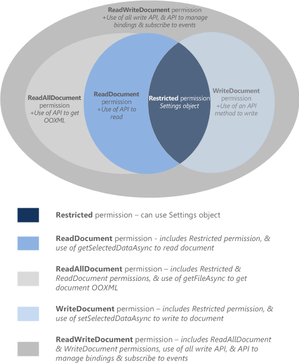

# <a name="requesting-permissions-for-api-use-in-content-and-task-pane-add-ins"></a>在内容和任务窗格加载项中请求获取 API 使用权限

本文说明您可以在内容或任务窗格加载项清单中声明的不同权限级别，以指定加载项功能所需的 JavaScript API 访问的级别。 


## <a name="permissions-model"></a>权限模型


5 级 JavaScript API 访问权限模型为内容和任务窗格加载项的用户提供基本的隐私和安全功能。图 1 显示您可以在加载项清单中声明的 API 权限的 5 个级别。


*图 1：内容和任务窗格加载项的 5 级权限模型*




这些权限指定加载项运行时在用户插入然后激活（信任）加载项时允许内容或任务窗格加载项使用的 API 子集。若要声明内容或任务窗格加载项所需的权限级别，请在加载项清单的 [Permissions](http://msdn.microsoft.com/zh-cn/library/d4cfe645-353d-8240-8495-f76fb36602fe%28Office.15%29.aspx) 元素中指定任一权限文本值。以下示例要求 **WriteDocument** 权限，仅允许可以对文档进行写入（而非阅读）的方法。


```XML
<Permissions>WriteDocument</Permissions>
```

作为最佳做法，应该根据 _最小特权_ 原则请求权限。也就是说，应该请求仅可访问加载项正常运行所需的 API 最小子集的权限。例如，如果您加载项的功能只需要读取用户文档中的数据，应该请求的权限不应高于 **ReadDocument** 权限。

下表描述了每个权限级别启用的 JavaScript API 子集。


|**权限**|**启用的 API 子集**|
|:-----|:-----|
|**受限**|[Settings](https://dev.office.com/reference/add-ins/shared/settings) 对象的方法和 [Document.getActiveViewAsync](https://dev.office.com/reference/add-ins/shared/document.getactiveviewasync) 方法。这是内容或任务窗格加载项可以请求的最低级别权限。|
|**ReadDocument**|除了  **Restricted** 权限允许的 API，添加对 API 成员的访问权，这是阅读文档和管理绑定所必需的权限。这包括对以下内容的使用：<br/><ul><li>
  <a href="https://dev.office.com/reference/add-ins/shared/document.getselecteddataasync" target="_blank">Document.getSelectedDataAsync</a> 方法，用于获取所选文本、HTML（仅限 Word）或表格数据，但不可用于包含文档中所有数据的基础 Open Office XML (OOXML) 代码。</p></li><li><p><a href="https://dev.office.com/reference/add-ins/shared/document.getfileasync" target="_blank">Document.getFileAsync</a> 方法，用于获取文档中的所有文本，而不是文档的基础 OOXML 二进制副本。</p></li><li><p>
  <a href="http://msdn.microsoft.com/zh-cn/library/5372ffd8-579d-4fcb-9e5b-e9a2128f3201(Office.15).aspx" target="_blank">Binding.getDataAsync</a> 方法，用于读取文档中的绑定数据。</p></li><li><p>
  <a href="http://msdn.microsoft.com/zh-cn/library/afbadac7-60c7-47cb-9477-6e9466ded44c(Office.15).aspx" target="_blank">Bindings</a> 对象的 <a href="http://msdn.microsoft.com/zh-cn/library/9dc03608-b08b-4700-8be1-3c86ae236799(Office.15).aspx" target="_blank">addFromNamedItemAsync</a>、<a href="http://msdn.microsoft.com/zh-cn/library/edc99214-e63e-43f2-9392-97ead42fc155(Office.15).aspx" target="_blank">addFromPromptAsync</a>、<span class="keyword">addFromSelectionAsync</span> 方法，用于在文档中创建绑定。</p></li><li><p>
  <a href="http://msdn.microsoft.com/zh-cn/library/ef902b73-cc4c-4551-95de-d8a51eeba82f(Office.15).aspx" target="_blank">Bindings</a> 对象的 <a href="http://msdn.microsoft.com/zh-cn/library/2727c891-bc05-465c-9324-113fbfeb3fbb(Office.15).aspx" target="_blank">getAllAsync</a>、<a href="http://msdn.microsoft.com/zh-cn/library/ad285984-8b44-435d-9b84-f0ade570c896(Office.15).aspx" target="_blank">getByIdAsync</a> 和 <span class="keyword">releaseByIdAsync</span> 方法，用于访问和删除文档中的绑定。</p></li><li><p>
  <a href="http://msdn.microsoft.com/zh-cn/library/2533a563-95ae-4d52-b2d5-a6783e4ef5b4(Office.15).aspx" target="_blank">Document.getFilePropertiesAsync</a> 方法，用于访问文档文件属性，例如文档的 URL。</p></li><li><p>
  <a href="http://msdn.microsoft.com/zh-cn/library/35dda81c-235e-4eab-8a77-9acb3b73a380(Office.15).aspx" target="_blank">Document.goToByIdAsync</a> 方法，用于导航到文档中的已命名对象和位置。</p></li><li><p>对于项目的任务窗格外接程序，<a href="http://msdn.microsoft.com/zh-cn/library/1908af4f-93b9-4859-87e3-06942014fae1(Office.15).aspx" target="_blank">ProjectDocument</a> 对象的所有"get"方法。 </p></li></ul>|
|**ReadAllDocument**|除了 **Restricted** 和 **ReadDocument** 权限允许的 API，允许以下对文档数据的额外访问权：<br/><ul><li><p><span class="keyword">Document.getSelectedDataAsync</span> 和 <span class="keyword">Document.getFileAsync</span> 方法可以访问文档（文档中除了文本，还可能包含格式、链接、嵌入图片、注释、修订等）的基础 OOXML 代码。</p></li></ul>|
|**WriteDocument**|除了 **Restricted** 权限允许的 API，添加对以下 API 成员的访问权：<br/><ul><li><p>
  <a href="http://msdn.microsoft.com/zh-cn/library/998f38dc-83bd-4659-a759-4758c632a6ef(Office.15).aspx" target="_blank">Document.setSelectedDataAsync</a> 方法，用于在文档中写入用户所选内容。</p></li></ul>|
|**ReadWriteDocument**|除了  **Restricted**、 **ReadDocument**、 **ReadAllDocument** 和 **WriteDocument** 权限允许的 API，将对内容和任务窗格加载项支持的所有其他 API 的访问权包含在内，包括订阅事件的方法。必须声明  **ReadWriteDocument** 权限才能访问这些额外的 API 成员：<br/><ul><li><p>
  <a href="http://msdn.microsoft.com/zh-cn/library/6a59bb6d-40b6-4a95-9b98-d70d4616de09(Office.15).aspx" target="_blank">Binding.setDataAsync</a> 方法，用于将内容写入到文档的绑定区域。</p></li><li><p>
  <a href="http://msdn.microsoft.com/zh-cn/library/1cd23454-8435-4e13-98b3-d0d29ed278a8(Office.15).aspx" target="_blank">TableBinding.addRowsAsync</a> 方法，用于将行添加到绑定表格中。</p></li><li><p>
  <a href="http://msdn.microsoft.com/zh-cn/library/8f1bfa81-3850-4ea1-ba2e-c9bcf5847a44(Office.15).aspx" target="_blank">TableBinding.addColumnsAsync</a> 方法，用于将列添加到绑定表格中。</p></li><li><p>
  <a href="http://msdn.microsoft.com/zh-cn/library/8f5cc783-384d-4520-a218-190dfed74dd2(Office.15).aspx" target="_blank">TableBinding.deleteAllDataValuesAsync</a> 方法，用于删除绑定表格中的所有数据。</p></li><li><p>
  <a href="http://msdn.microsoft.com/zh-cn/library/49712906-f582-4055-9ef8-6edde6e97679(Office.15).aspx" target="_blank">TableBinding</a> 对象的 <a href="http://msdn.microsoft.com/zh-cn/library/cc56e9c0-b33c-4d9b-b676-a7e50f757c10(Office.15).aspx" target="_blank">setFormatsAsync</a>、<a href="http://msdn.microsoft.com/zh-cn/library/2885fc57-4527-4ca4-a43d-9ee447ec27d3(Office.15).aspx" target="_blank">clearFormatsAsync</a> 和 <span class="keyword">setTableOptionsAsync</span> 方法，用于设置绑定表格中的格式和选项。</p></li><li><p>
  <a href="http://msdn.microsoft.com/zh-cn/library/dc1518de-47fa-4108-aab7-04a022724b04(Office.15).aspx" target="_blank">CustomXmlNode</a>、<a href="http://msdn.microsoft.com/zh-cn/library/83f0e668-8236-4f2f-a20f-b173a9e3f65f(Office.15).aspx" target="_blank">CustomXmlPart</a>、<a href="http://msdn.microsoft.com/zh-cn/library/ba40cd4c-29bb-4f31-875d-6f1382fd1ee8(Office.15).aspx" target="_blank">CustomXmlParts</a> 和 <a href="http://msdn.microsoft.com/zh-cn/library/18b9aa8c-83e7-4c2f-8530-6a0ac8ce5535(Office.15).aspx" target="_blank">CustomXmlPrefixMappings</a> 对象的所有成员。</p></li><li><p>内容和任务窗格加载项支持的所有订阅事件的方法，具体来说即 <span class="keyword">Binding</span>、<span class="keyword">CustomXmlPart</span>、<a href="http://msdn.microsoft.com/zh-cn/library/42882642-d22b-47d2-a8d3-3aa8c6a4435e(Office.15).aspx" target="_blank">Document</a>、<a href="http://msdn.microsoft.com/zh-cn/library/83f0e668-8236-4f2f-a20f-b173a9e3f65f(Office.15).aspx" target="_blank">ProjectDocument</a> 和 <a href="http://msdn.microsoft.com/zh-cn/library/f8859516-cc1f-4b20-a8f3-cee37a983e70(Office.15).aspx" target="_blank">Settings</a> 对象的 <a href="http://msdn.microsoft.com/zh-cn/library/1908af4f-93b9-4859-87e3-06942014fae1(Office.15).aspx" target="_blank">addHandlerAsync</a> 和 <a href="http://msdn.microsoft.com/zh-cn/library/ad733387-a58c-4514-8fc2-53e64fad468d(Office.15).aspx" target="_blank">removeHandlerAsync</a> 方法。</p></li></ul>|

## <a name="see-also"></a>另请参阅

- [Office 加载项的隐私和安全](../concepts/privacy-and-security.md)
    


