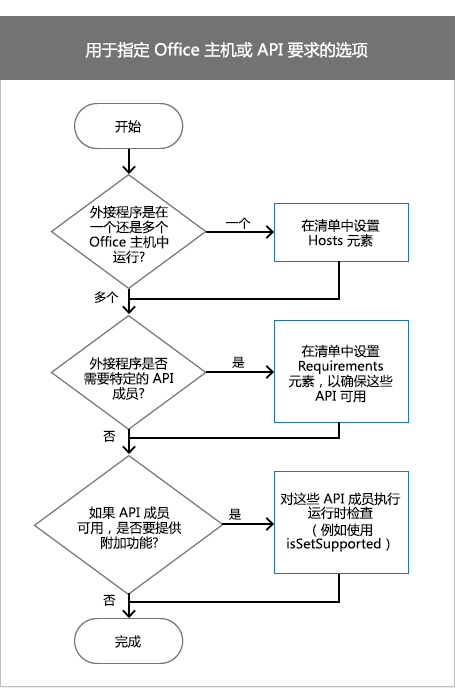

# <a name="specify-office-hosts-and-api-requirements"></a><span data-ttu-id="9dd0b-102">指定 Office 主机和 API 要求</span><span class="sxs-lookup"><span data-stu-id="9dd0b-102">Specify Office hosts and API requirements</span></span>

<span data-ttu-id="9dd0b-p101">你的 Office外接程序可能依赖于特定的 Office 主机、要求集、API 成员或 API 版本才能按预期运行。例如，你的外接程序可能：</span><span class="sxs-lookup"><span data-stu-id="9dd0b-p101">Your Office Add-in might depend on a specific Office host, a requirement set, an API member, or a version of the API in order to work as expected. For example, your add-in might:</span></span>

- <span data-ttu-id="9dd0b-105">在单个 Office 应用程序（Word 或 Excel）或多个应用程序中运行。</span><span class="sxs-lookup"><span data-stu-id="9dd0b-105">Run in a single Office application (Word or Excel), or several applications.</span></span>
    
- <span data-ttu-id="9dd0b-p102">使用仅在 Office 的某些版本中可用的 JavaScript API。例如，可能会在运行在 Excel 2016 中的外接程序中使用适用于 Excel 的 JavaScript API。</span><span class="sxs-lookup"><span data-stu-id="9dd0b-p102">Make use of JavaScript APIs that are only available in some versions of Office. For example, you might use the Excel JavaScript APIs in an add-in that runs in Excel 2016.</span></span> 
    
- <span data-ttu-id="9dd0b-108">只能在 Office 的某些版本中运行，这些版本支持供你的外接程序使用的 API 成员。</span><span class="sxs-lookup"><span data-stu-id="9dd0b-108">Run only in versions of Office that support API members that your add-in uses.</span></span>
    
<span data-ttu-id="9dd0b-109">本文可帮助你了解应选择的选项，以确保你的外接程序按预期运行，并遍及可能的最广泛的访问群体。</span><span class="sxs-lookup"><span data-stu-id="9dd0b-109">This article helps you understand which options you should choose to ensure that your add-in works as expected and reaches the broadest audience possible.</span></span>

> [!NOTE]
> <span data-ttu-id="9dd0b-110">若要概览 Office 加载项的当前受支持情况，请参阅 [Office 加载项主机和平台可用性](../overview/office-add-in-availability.md)页面。</span><span class="sxs-lookup"><span data-stu-id="9dd0b-110">For a high-level view of where Office Add-ins are currently supported, see the [Office Add-in host and platform availability](../overview/office-add-in-availability.md) page.</span></span> 

<span data-ttu-id="9dd0b-111">下表列出了本文中讨论的核心概念。</span><span class="sxs-lookup"><span data-stu-id="9dd0b-111">The following table lists core concepts discussed throughout this article.</span></span>

|<span data-ttu-id="9dd0b-112">**概念**</span><span class="sxs-lookup"><span data-stu-id="9dd0b-112">**Concept**</span></span>|<span data-ttu-id="9dd0b-113">**说明**</span><span class="sxs-lookup"><span data-stu-id="9dd0b-113">**Description**</span></span>|
|:-----|:-----|
|<span data-ttu-id="9dd0b-114">Office 应用程序、Office 主机应用程序、Office 主机或主机</span><span class="sxs-lookup"><span data-stu-id="9dd0b-114">Office application, Office host application, Office host, or host</span></span>|<span data-ttu-id="9dd0b-p103">Office 应用程序、Office 主机应用程序、Office 主机或主机</span><span class="sxs-lookup"><span data-stu-id="9dd0b-p103">The Office application used to run your add-in. For example, Word, Word Online, Excel, and so on.</span></span>|
|<span data-ttu-id="9dd0b-117">平台</span><span class="sxs-lookup"><span data-stu-id="9dd0b-117">Platform</span></span>|<span data-ttu-id="9dd0b-118">平台</span><span class="sxs-lookup"><span data-stu-id="9dd0b-118">Where the Office host runs, such as Office Online or Office for iPad.</span></span>|
|<span data-ttu-id="9dd0b-119">要求集</span><span class="sxs-lookup"><span data-stu-id="9dd0b-119">Requirement set</span></span>|<span data-ttu-id="9dd0b-p104">命名的一组相关的 API 成员。外接程序使用要求集来确定 Office 主机是否支持你的外接程序使用的 API 成员。测试对要求集的支持比对单个的 API 成员的支持更为容易。要求集支持根据 Office 主机和 Office 主机的版本变化。 </span><span class="sxs-lookup"><span data-stu-id="9dd0b-p104">A named group of related API members. Add-ins use requirement sets to determine whether the Office host supports API members used by your add-in. It's easier to test for the support of a requirement set than for the support of individual API members. Requirement set support varies by Office host and the version of the Office host. </span></span><br ><span data-ttu-id="9dd0b-124">要求集在清单文件中指定。</span><span class="sxs-lookup"><span data-stu-id="9dd0b-124">Requirement sets are specified in the manifest file.</span></span> <span data-ttu-id="9dd0b-125">当你在清单中指定要求集时，你可以设置 Office 主机必须提供的用于运行你的外接程序的最低级别的 API 支持。</span><span class="sxs-lookup"><span data-stu-id="9dd0b-125">When you specify requirement sets in the manifest, you set the minimum level of API support that the Office host must provide in order to run your add-in.</span></span> <span data-ttu-id="9dd0b-126">不支持在清单中指定的要求集的 Office 主机不能运行加载项，并且加载项不会显示在“我的加载项”<span class="ui"></span>中。</span><span class="sxs-lookup"><span data-stu-id="9dd0b-126">Requirement sets are specified in the manifest file. When you specify requirement sets in the manifest, you set the minimum level of API support that the Office host must provide in order to run your add-in. Office hosts that don't support requirement sets specified in the manifest can't run your add-in, and your add-in won't display in <span class="ui">My Add-ins</span>. This restricts where your add-in is available.In code using runtime checks. For the complete list of requirement sets, see Office add-in requirement sets.</span></span> <span data-ttu-id="9dd0b-127">有关要求集的完整列表，请参阅 [Office 加载项要求集](https://docs.microsoft.com/office/dev/add-ins/reference/requirement-sets/office-add-in-requirement-sets)。</span><span class="sxs-lookup"><span data-stu-id="9dd0b-127">For the complete list of requirement sets, see [Office add-in requirement sets](https://docs.microsoft.com/office/dev/add-ins/reference/requirement-sets/office-add-in-requirement-sets).</span></span>|
|<span data-ttu-id="9dd0b-128">运行时检查</span><span class="sxs-lookup"><span data-stu-id="9dd0b-128">Runtime check</span></span>|<span data-ttu-id="9dd0b-p106">在运行时执行的一种测试，用以确定运行外接程序的 Office 主机是否支持要求集或外接程序使用的方法。若要执行运行时检查，请使用包含 **isSetSupported** 方法、要求集或不属于要求集的方法名称的 **if** 语句。使用运行时检查以确保达到的客户数目最大。与要求集不同，运行时检查不指定 Office 主机必须提供的用于运行外接程序的最低级别的 API 支持。相反，使用 **if** 语句来确定是否支持某个 API 成员。如果支持，则可以在外接程序中提供其他功能。使用运行时检查时，外接程序将始终在“**我的外接程序**”中显示。</span><span class="sxs-lookup"><span data-stu-id="9dd0b-p106">A test that is performed at runtime to determine whether the Office host running your add-in supports requirement sets or methods used by your add-in. To perform a runtime check, you use an  **if** statement with the **isSetSupported** method, the requirement sets, or the method names that aren't part of a requirement set.Use runtime checks to ensure that your add-in reaches the broadest number of customers. Unlike requirement sets, runtime checks don't specify the minimum level of API support that the Office host must provide for your add-in to run. Instead, you use the  **if** statement to determine whether an API member is supported. If it is, you can provide additional functionality in your add-in. Your add-in will always display in **My Add-ins** when you use runtime checks.</span></span>|

## <a name="before-you-begin"></a><span data-ttu-id="9dd0b-135">开始之前</span><span class="sxs-lookup"><span data-stu-id="9dd0b-135">Before you begin</span></span>

<span data-ttu-id="9dd0b-p107">您的外接程序必须使用最新版本的外接程序清单架构。如果您在外接程序中使用运行时检查，请确保您使用的是适用于 Office 的最新 JavaScript API (office.js) 库。</span><span class="sxs-lookup"><span data-stu-id="9dd0b-p107">Your add-in must use the most current version of the add-in manifest schema. If you use runtime checks in your add-in, ensure that you use the latest JavaScript API for Office (office.js) library.</span></span>

### <a name="specify-the-latest-add-in-manifest-schema"></a><span data-ttu-id="9dd0b-138">指定最新的外接程序清单架构</span><span class="sxs-lookup"><span data-stu-id="9dd0b-138">Specify the latest add-in manifest schema</span></span>

<span data-ttu-id="9dd0b-p108">外接程序清单必须使用外接程序清单架构版本 1.1。按照以下操作设置外接程序清单中的 **OfficeApp**。</span><span class="sxs-lookup"><span data-stu-id="9dd0b-p108">Your add-in's manifest must use version 1.1 of the add-in manifest schema. Set the  **OfficeApp** element in your add-in manifest as follows.</span></span>

```XML
<OfficeApp xmlns="http://schemas.microsoft.com/office/appforoffice/1.1" xmlns:xsi="https://www.w3.org/2001/XMLSchema-instance" xsi:type="TaskPaneApp">
```

### <a name="specify-the-latest-javascript-api-for-office-library"></a><span data-ttu-id="9dd0b-141">指定最新的适用于 Office 的 JavaScript API 库</span><span class="sxs-lookup"><span data-stu-id="9dd0b-141">Specify the latest JavaScript API for Office library</span></span>

<span data-ttu-id="9dd0b-p109">如果使用运行时检查，则请引用内容传送网络 (CDN) 中的最新版本的适用于 Office 的 JavaScript API 库。若要执行此操作，请将以下 `script` 标记添加到 HTML 中。使用 CDN URL 中的 `/1/` 可以确保引用的是最新版本的 Office.js。</span><span class="sxs-lookup"><span data-stu-id="9dd0b-p109">If you use runtime checks, reference the most current version of the JavaScript API for Office library from the content delivery network (CDN). To do this, add the following  `script` tag to your HTML. Using `/1/` in the CDN URL ensures that you reference the most recent version of Office.js.</span></span>

```HTML
<script src="https://appsforoffice.microsoft.com/lib/1/hosted/Office.js" type="text/javascript"></script>
```

## <a name="options-to-specify-office-hosts-or-api-requirements"></a><span data-ttu-id="9dd0b-145">指定 Office 主机或 API 要求的选项</span><span class="sxs-lookup"><span data-stu-id="9dd0b-145">Options to specify Office hosts or API requirements</span></span>

<span data-ttu-id="9dd0b-p110">指定 Office 主机或 API 要求时，有几个决策因素需要考虑。下图显示了如何确定要在外接程序中使用的技术。</span><span class="sxs-lookup"><span data-stu-id="9dd0b-p110">When you specify Office hosts or API requirements, there are several factors to consider. The following diagram shows how to decide which technique to use in your add-in.</span></span>



- <span data-ttu-id="9dd0b-p111">如果加载项在 Office 主机中运行，请在清单中设置 **Hosts** 元素。有关详细信息，请参阅[设置 Hosts 元素](#set-the-hosts-element)。</span><span class="sxs-lookup"><span data-stu-id="9dd0b-p111">If your add-in runs in one Office host, set the **Hosts** element in the manifest. For more information, see [Set the Hosts element](#set-the-hosts-element).</span></span>
    
- <span data-ttu-id="9dd0b-p112">若要设置 Office 主机必须支持的用以运行外接程序的最低要求集或 API 成员，请在清单中设置 **Requirements** 元素。有关详细信息，请参阅[在清单中设置 Requirements 元素](#set-the-requirements-element-in-the-manifest)。</span><span class="sxs-lookup"><span data-stu-id="9dd0b-p112">To set the minimum requirement set or API members that an Office host must support to run your add-in, set the  **Requirements** element in the manifest. For more information, see [Set the Requirements element in the manifest](#set-the-requirements-element-in-the-manifest).</span></span>
    
- <span data-ttu-id="9dd0b-p113">如果特定要求集或 API 成员可在 Office 主机中使用，在这种情况下如果你想要提供其他功能，请在外接程序的 JavaScript 代码中执行运行时检查。例如，如果外接程序在 Excel 2016 中运行，你可能想要使用新的适用于 Excel 的 JavaScript API 中的 API 成员以提供附加功能。有关详细信息，请参阅[在你的 JavaScript 代码中使用运行时检查](#use-runtime-checks-in-your-javascript-code)。</span><span class="sxs-lookup"><span data-stu-id="9dd0b-p113">If you would like to provide additional functionality if specific requirement sets or API members are available in the Office host, perform a runtime check in your add-in's JavaScript code. For example, if your add-in runs in Excel 2016, use API members from the new JavaScript API for Excel to provide additional functionality. For more information, see [Use runtime checks in your JavaScript code](#use-runtime-checks-in-your-javascript-code).</span></span>
    
## <a name="set-the-hosts-element"></a><span data-ttu-id="9dd0b-156">设置 Hosts 元素</span><span class="sxs-lookup"><span data-stu-id="9dd0b-156">Set the Hosts element</span></span>

<span data-ttu-id="9dd0b-p114">若要使外接程序运行在一个 Office 主机应用程序中，请使用清单中的 **Hosts** 和 **Host** 元素。如果未指定 **Hosts** 元素，你的外接程序将在所有主机中运行。</span><span class="sxs-lookup"><span data-stu-id="9dd0b-p114">To make your add-in run in one Office host application, use the  **Hosts** and **Host** elements in the manifest. If you don't specify the **Hosts** element, your add-in will run in all hosts.</span></span>

<span data-ttu-id="9dd0b-159">例如，以下 **Hosts** 和 **Host** 声明指定外接程序将使用任何版本的 Excel，其中包括适用于 Windows 的 Excel、Excel Online 和适用于 iPad 的 Excel。</span><span class="sxs-lookup"><span data-stu-id="9dd0b-159">For example, the following  **Hosts** and **Host** declaration specifies that the add-in will work with any release of Excel, which includes Excel for Windows, Excel Online, and Excel for iPad.</span></span>

```xml
<Hosts>
  <Host Name="Workbook" />
</Hosts>
```

<span data-ttu-id="9dd0b-p115">**Hosts** 元素可以包含一个或多个 **Host** 元素。**Host** 元素指定外接程序要求的 Office 主机。**Name** 属性是必需的，且可以被设置为下列值之一。</span><span class="sxs-lookup"><span data-stu-id="9dd0b-p115">The  **Hosts** element can contain one or more **Host** elements. The **Host** element specifies the Office host your add-in requires. The **Name** attribute is required and can be set to one of the following values.</span></span>

| <span data-ttu-id="9dd0b-163">名称</span><span class="sxs-lookup"><span data-stu-id="9dd0b-163">Name</span></span>          | <span data-ttu-id="9dd0b-164">Office 主机应用程序</span><span class="sxs-lookup"><span data-stu-id="9dd0b-164">Office host applications</span></span>                      |
|:--------------|:----------------------------------------------|
| <span data-ttu-id="9dd0b-165">数据库</span><span class="sxs-lookup"><span data-stu-id="9dd0b-165">Database</span></span>      | <span data-ttu-id="9dd0b-166">Access Web App</span><span class="sxs-lookup"><span data-stu-id="9dd0b-166">Access web apps</span></span>                               |
| <span data-ttu-id="9dd0b-167">文档</span><span class="sxs-lookup"><span data-stu-id="9dd0b-167">Document</span></span>      | <span data-ttu-id="9dd0b-168">Word for Windows、Word for Mac、Word for iPad 和 Word Online</span><span class="sxs-lookup"><span data-stu-id="9dd0b-168">Word for Windows, Mac, iPad and Online</span></span>        |
| <span data-ttu-id="9dd0b-169">邮箱</span><span class="sxs-lookup"><span data-stu-id="9dd0b-169">Mailbox</span></span>       | <span data-ttu-id="9dd0b-170">Outlook for Windows、Outlook for Mac、Outlook Web 和 Outlook.com</span><span class="sxs-lookup"><span data-stu-id="9dd0b-170">Outlook for Windows, Mac, Web and Outlook.com</span></span> | 
| <span data-ttu-id="9dd0b-171">演示文稿</span><span class="sxs-lookup"><span data-stu-id="9dd0b-171">Presentation</span></span>  | <span data-ttu-id="9dd0b-172">PowerPoint for Windows、PowerPoint for Mac、PowerPoint for iPad 和 PowerPoint Online</span><span class="sxs-lookup"><span data-stu-id="9dd0b-172">PowerPoint for Windows, Mac, iPad and Online</span></span>  |
| <span data-ttu-id="9dd0b-173">项目</span><span class="sxs-lookup"><span data-stu-id="9dd0b-173">Project</span></span>       | <span data-ttu-id="9dd0b-174">项目</span><span class="sxs-lookup"><span data-stu-id="9dd0b-174">Project</span></span>                                       |
| <span data-ttu-id="9dd0b-175">工作簿</span><span class="sxs-lookup"><span data-stu-id="9dd0b-175">Workbook</span></span>      | <span data-ttu-id="9dd0b-176">Excel for Windows、Excel for Mac、Excel for iPad 和 Excel Online</span><span class="sxs-lookup"><span data-stu-id="9dd0b-176">Excel Windows, Mac, iPad and Online</span></span>           |

> [!NOTE]
> <span data-ttu-id="9dd0b-p116">`Name` 属性指定可以运行加载项的 Office 主机应用。Office 主机受不同平台支持，且可在台式机、Web 浏览器、平板电脑和移动设备上运行。不能指定用于运行加载项的平台。例如，如果指定 `Mailbox`，那么 Outlook 和 Outlook Web App 都可以用来运行加载项。</span><span class="sxs-lookup"><span data-stu-id="9dd0b-p116">The  `Name` attribute specifies the Office host application that can run your add-in. Office hosts are supported on different platforms and run on desktops, web browsers, tablets, and mobile devices. You can't specify which platform can be used to run your add-in. For example, if you specify `Mailbox`, both Outlook and Outlook Web App can be used to run your add-in.</span></span> 


## <a name="set-the-requirements-element-in-the-manifest"></a><span data-ttu-id="9dd0b-181">在清单中设置 Requirements 元素</span><span class="sxs-lookup"><span data-stu-id="9dd0b-181">Set the Requirements element in the manifest</span></span>

<span data-ttu-id="9dd0b-p117">**Requirements** 元素指定运行外接程序时 Office 主机需要支持的最小要求集或 API 成员。**Requirements** 元素可以指定要求集和外接程序中使用的各个方法。在 1.1 版外接程序清单架构中，除 Outlook 外接程序外，**Requirements** 元素对于所有外接程序均为可选项。</span><span class="sxs-lookup"><span data-stu-id="9dd0b-p117">The  **Requirements** element specifies the minimum requirement sets or API members that must be supported by the Office host to run your add-in. The **Requirements** element can specify both requirement sets and individual methods used in your add-in. In version 1.1 of the add-in manifest schema, the **Requirements** element is optional for all add-ins, except for Outlook add-ins.</span></span>

> [!WARNING]
> <span data-ttu-id="9dd0b-p118">**Requirements** 元素只能用于指定加载项必须使用的关键要求集或 API 成员。如果 Office 主机或平台不支持在 **Requirements** 元素中指定的要求集或 API 成员，加载项将无法在相应主机或平台上运行，并且不会显示在“我的加载项”\*\*\*\* 中。相反，建议让加载项适用于 Office 主机的所有平台，如 Excel for Windows、Excel Online 和 Excel for iPad。若要让加载项适用于_所有_ Office 主机和平台，请使用运行时检查，而不是 **Requirements** 元素。</span><span class="sxs-lookup"><span data-stu-id="9dd0b-p118">Only use the **Requirements** element to specify critical requirement sets or API members that your add-in must use. If the Office host or platform doesn't support the requirement sets or API members specified in the **Requirements** element, the add-in won't run in that host or platform, and won't display in **My Add-ins**. Instead, we recommend that you make your add-in available on all platforms of an Office host, such as Excel for Windows, Excel Online, and Excel for iPad. To make your add-in available on  _all_ Office hosts and platforms, use runtime checks instead of the **Requirements** element.</span></span>

<span data-ttu-id="9dd0b-188">下面的代码示例展示了在支持以下内容的所有 Office 主机应用中加载的加载项：</span><span class="sxs-lookup"><span data-stu-id="9dd0b-188">The following code example shows an add-in that loads in all Office host applications that support the following:</span></span>

-  <span data-ttu-id="9dd0b-189">最低版本为 1.1 的 **TableBindings** 要求集。</span><span class="sxs-lookup"><span data-stu-id="9dd0b-189">**TableBindings** requirement set, which has a minimum version of 1.1.</span></span>
    
-  <span data-ttu-id="9dd0b-190">最低版本为 1.1 的 **OOXML** 要求集。</span><span class="sxs-lookup"><span data-stu-id="9dd0b-190">**OOXML** requirement set, which has a minimum version of 1.1.</span></span>
    
-  <span data-ttu-id="9dd0b-191">**Document.getSelectedDataAsync** 方法。</span><span class="sxs-lookup"><span data-stu-id="9dd0b-191">**Document.getSelectedDataAsync** method.</span></span>

```XML
<Requirements>
   <Sets DefaultMinVersion="1.1">
      <Set Name="TableBindings" MinVersion="1.1"/>
      <Set Name="OOXML" MinVersion="1.1"/>
   </Sets>
   <Methods>
      <Method Name="Document.getSelectedDataAsync"/>
   </Methods>
</Requirements>
```

- <span data-ttu-id="9dd0b-192">**Requirements** 元素包含 **Sets** 和 **Methods** 子元素。</span><span class="sxs-lookup"><span data-stu-id="9dd0b-192">The  **Requirements** element contains the **Sets** and **Methods** child elements.</span></span>
    
- <span data-ttu-id="9dd0b-p119">**Sets** 元素可以包含一个或多个 **Set** 元素。**DefaultMinVersion** 指定所有 **Set** 子元素的默认 **MinVersion** 值。</span><span class="sxs-lookup"><span data-stu-id="9dd0b-p119">The  **Sets** element can contain one or more **Set** elements. **DefaultMinVersion** specifies the default **MinVersion** value of all child **Set** elements.</span></span>
    
- <span data-ttu-id="9dd0b-195">**Set** 元素指定 Office 主机要运行加载项所需支持的要求集。</span><span class="sxs-lookup"><span data-stu-id="9dd0b-195">The  **Set** element specifies requirement sets that the Office host must support to run the add-in.</span></span> <span data-ttu-id="9dd0b-196">**Name** 属性指定要求集的名称。</span><span class="sxs-lookup"><span data-stu-id="9dd0b-196">The **Name** attribute specifies the name of the requirement set.</span></span> <span data-ttu-id="9dd0b-197">**MinVersion** 指定要求集的最低版本。</span><span class="sxs-lookup"><span data-stu-id="9dd0b-197">The **MinVersion** specifies the minimum version of the requirement set.</span></span> <span data-ttu-id="9dd0b-198">**MinVersion** 覆盖 **DefaultMinVersion** 的值。</span><span class="sxs-lookup"><span data-stu-id="9dd0b-198">**MinVersion** overrides the value of **DefaultMinVersion**.</span></span> <span data-ttu-id="9dd0b-199">有关 API 成员所属的要求集和要求集版本的详细信息，请参阅 [Office 加载项要求集](https://docs.microsoft.com/office/dev/add-ins/reference/requirement-sets/office-add-in-requirement-sets)。</span><span class="sxs-lookup"><span data-stu-id="9dd0b-199">For more information about requirement sets and requirement set versions that your API members belong to, see [Office Add-in requirement sets](https://docs.microsoft.com/office/dev/add-ins/reference/requirement-sets/office-add-in-requirement-sets).</span></span>
    
- <span data-ttu-id="9dd0b-p121">**Methods** 元素可以包含一个或多个 **Method** 元素。不能将 **Methods** 元素和 Outlook 加载项结合使用。</span><span class="sxs-lookup"><span data-stu-id="9dd0b-p121">The  **Methods** element can contain one or more **Method** elements. You can't use the **Methods** element with Outlook add-ins.</span></span>
    
- <span data-ttu-id="9dd0b-p122">**Method** 元素指定在您的外接程序所运行 Office 主机中必须要支持的单个方法。 **Name** 属性为必需属性，并使用其父对象指定合格方法的名称。</span><span class="sxs-lookup"><span data-stu-id="9dd0b-p122">The  **Method** element specifies an individual method that must be supported in the Office host where your add-in runs. The **Name** attribute is required and specifies the name of the method qualified with its parent object.</span></span>
    

## <a name="use-runtime-checks-in-your-javascript-code"></a><span data-ttu-id="9dd0b-204">使用运行时签入您的 JavaScript 代码</span><span class="sxs-lookup"><span data-stu-id="9dd0b-204">Use runtime checks in your JavaScript code</span></span>


<span data-ttu-id="9dd0b-p123">当 Office 主机支持特定要求集时，你可能希望在外接程序中提供其他功能。例如，如果你的外接程序在 Word 2016 中运行，你可能想要在你现有的外接程序中使用新的适用于 Word 的 JavaScript API。为此，你将 **isSetSupported** 方法与要求集名称一起使用。**isSetSupported** 方法确定在运行时运行外接程序的 Office 主机是否支持要求集。如果支持要求集，**isSetSupported** 将返回 **true**，并运行使用该要求集中的 API 成员的其他代码。如果 Office 主机不支持要求集，则 **isSetSupported** 返回 **false**，并且不会运行其他代码。以下代码显示与 **isSetSupported** 在一起使用的语法。</span><span class="sxs-lookup"><span data-stu-id="9dd0b-p123">You might want to provide additional functionality in your add-in if certain requirement sets are supported by the Office host. For example, you might want to use the new Word JavaScript APIs Word in your existing add-in if your add-in runs in Word 2016. To do this, you use the  **isSetSupported** method with the name of the requirement set. **isSetSupported** determines, at runtime, whether the Office host running the add-in supports the requirement set. If the requirement set is supported, **isSetSupported** returns **true** and runs the additional code that uses the API members from that requirement set. If the Office host doesn't support the requirement set, **isSetSupported** returns **false** and the additional code won't run. The following code shows the syntax to use with **isSetSupported**.</span></span>


```js
if (Office.context.requirements.isSetSupported(RequirementSetName , VersionNumber))
{
   // Code that uses API members from RequirementSetName.
}

```


-  <span data-ttu-id="9dd0b-212">_RequirementSetName_（必填）是代表该要求集名称的字符串。</span><span class="sxs-lookup"><span data-stu-id="9dd0b-212">_RequirementSetName_ (required) is a string that represents the name of the requirement set.</span></span> <span data-ttu-id="9dd0b-213">有关可用要求集的详细信息，请参阅 [Office 加载项要求集](https://docs.microsoft.com/office/dev/add-ins/reference/requirement-sets/office-add-in-requirement-sets)。</span><span class="sxs-lookup"><span data-stu-id="9dd0b-213">For more information about available requirement sets, see [Office add-in requirement sets](https://docs.microsoft.com/office/dev/add-ins/reference/requirement-sets/office-add-in-requirement-sets).</span></span>
    
-  <span data-ttu-id="9dd0b-214">_VersionNumber_（可选）是要求集的版本。</span><span class="sxs-lookup"><span data-stu-id="9dd0b-214">_VersionNumber_ (optional) is the version of the requirement set.</span></span>
    
<span data-ttu-id="9dd0b-p125">在 Excel 2016 或 Word 2016 中，将 **isSetSupported** 和 **ExcelAPI** 或 **WordAPI** 要求集结合使用。**isSetSupported** 方法和 **ExcelAPI** 及 **WordAPI** 要求集可从 CDN 的最新 Office.js 文件中获取。如果未使用 CDN 中的 Office.js，则外接程序可能产生异常，因为 **isSetSupported** 将属于未定义的内容。有关详细信息，请参阅 [指定最新的适用于 Office 的 JavaScript API 库](#specify-the-latest-javascript-api-for-office-library)。</span><span class="sxs-lookup"><span data-stu-id="9dd0b-p125">In Excel 2016 or Word 2016, use  **isSetSupported** with the **ExcelAPI** or **WordAPI** requirement sets. The **isSetSupported** method, and the **ExcelAPI** and **WordAPI** requirement sets, are available in the latest Office.js file available from the CDN. If you don't use Office.js from the CDN, your add-in might generate exceptions because **isSetSupported** will be undefined. For more information, see [Specify the latest JavaScript API for Office library](#specify-the-latest-javascript-api-for-office-library).</span></span> 


> [!NOTE]
> <span data-ttu-id="9dd0b-p126">**isSetSupported** 不适用于 Outlook 或 Outlook Web App。若要在 Outlook 或 Outlook Web App 中使用运行时检查，请利用[使用不属于要求集的方法的运行时检查](#runtime-checks-using-methods-not-in-a-requirement-set)中所述的技术。</span><span class="sxs-lookup"><span data-stu-id="9dd0b-p126">**isSetSupported** does not work in Outlook or Outlook Web App. To use a runtime check in Outlook or Outlook Web App, use the technique described in [Runtime checks using methods not in a requirement set](#runtime-checks-using-methods-not-in-a-requirement-set).</span></span>

<span data-ttu-id="9dd0b-221">以下代码示例演示外接程序如何向支持不同要求集或 API 成员的不同 Office 主机提供不同功能。</span><span class="sxs-lookup"><span data-stu-id="9dd0b-221">The following code example shows how an add-in can provide different functionality for different Office hosts that might support different requirement sets or API members.</span></span>


```js
if (Office.context.requirements.isSetSupported('WordApi', 1.1))
{
    // Run code that provides additional functionality using the JavaScript API for Word when the add-in runs in Word 2016.
}
else if (Office.context.requirements.isSetSupported('CustomXmlParts'))
{
      // Run code that uses API members from the CustomXmlParts requirement set.
}
else 
{
    // Run additional code when the Office host is not Word 2016, and when the Office host does not support the CustomXmlParts requirement set.
}

```


## <a name="runtime-checks-using-methods-not-in-a-requirement-set"></a><span data-ttu-id="9dd0b-222">使用不属于要求集的方法的运行时检查</span><span class="sxs-lookup"><span data-stu-id="9dd0b-222">Runtime checks using methods not in a requirement set</span></span>


<span data-ttu-id="9dd0b-223">部分 API 成员不属于要求集</span><span class="sxs-lookup"><span data-stu-id="9dd0b-223">Some API members don't belong to requirement sets.</span></span> <span data-ttu-id="9dd0b-224">这仅适用于属于 [适用于 Office 的 JavaScript API](https://docs.microsoft.com/office/dev/add-ins/reference/javascript-api-for-office) 命名空间的 API 成员（Office 下的任何内容），而不适用于属于 Word JavaScript API（Word 中的任何内容）或 [Excel 外接程序 JavaScript API 引用](https://docs.microsoft.com/office/dev/add-ins/reference/overview/excel-add-ins-reference-overview)（Excel 中的任何内容）命名空间的 API 成员。</span><span class="sxs-lookup"><span data-stu-id="9dd0b-224">This only applies to API members that are part of the [JavaScript API for Office](https://docs.microsoft.com/office/dev/add-ins/reference/javascript-api-for-office) namespace (anything under Office.), not API members that belong to the Word JavaScript API (anything in Word.) or [Excel add-ins JavaScript API reference](https://docs.microsoft.com/office/dev/add-ins/reference/overview/excel-add-ins-reference-overview) (anything in Excel.) namespaces.</span></span> <span data-ttu-id="9dd0b-225">当外接程序依赖于某个不属于要求集的方法时，可以使用运行时检查来确定 Office 主机是否支持此方法，方法如以下代码示例所示。</span><span class="sxs-lookup"><span data-stu-id="9dd0b-225">When your add-in depends on a method that is not part of a requirement set, you can use the runtime check to determine whether the method is supported by the Office host, as shown in the following code example.</span></span> <span data-ttu-id="9dd0b-226">有关不属于要求集的方法的完整列表，请参阅 [Office 加载项要求集](https://docs.microsoft.com/office/dev/add-ins/reference/requirement-sets/office-add-in-requirement-sets)。</span><span class="sxs-lookup"><span data-stu-id="9dd0b-226">For a complete list of methods that don't belong to a requirement set, see [Office add-in requirement sets](https://docs.microsoft.com/office/dev/add-ins/reference/requirement-sets/office-add-in-requirement-sets).</span></span>


> [!NOTE]
> <span data-ttu-id="9dd0b-227">建议限制在加载项代码中使用此类型运行时检查。</span><span class="sxs-lookup"><span data-stu-id="9dd0b-227">We recommend that you limit the use of this type of runtime check in your add-in's code.</span></span>

<span data-ttu-id="9dd0b-228">下面的代码示例检查主机是否支持 **document.setSelectedDataAsync**。</span><span class="sxs-lookup"><span data-stu-id="9dd0b-228">The following code example checks whether the host supports  **document.setSelectedDataAsync**.</span></span>


```js
if (Office.context.document.setSelectedDataAsync)
{
    // Run code that uses document.setSelectedDataAsync.
}
```


## <a name="see-also"></a><span data-ttu-id="9dd0b-229">另请参阅</span><span class="sxs-lookup"><span data-stu-id="9dd0b-229">See also</span></span>

- [<span data-ttu-id="9dd0b-230">Office 加载项 XML 清单</span><span class="sxs-lookup"><span data-stu-id="9dd0b-230">Office Add-ins XML manifest</span></span>](add-in-manifests.md)
- [<span data-ttu-id="9dd0b-231">Office 加载项要求集</span><span class="sxs-lookup"><span data-stu-id="9dd0b-231">Office add-in requirement sets</span></span>](https://docs.microsoft.com/office/dev/add-ins/reference/requirement-sets/office-add-in-requirement-sets)
- [<span data-ttu-id="9dd0b-232">Word-Add-in-Get-Set-EditOpen-XML</span><span class="sxs-lookup"><span data-stu-id="9dd0b-232">Word-Add-in-Get-Set-EditOpen-XML</span></span>](https://github.com/OfficeDev/Word-Add-in-Get-Set-EditOpen-XML)