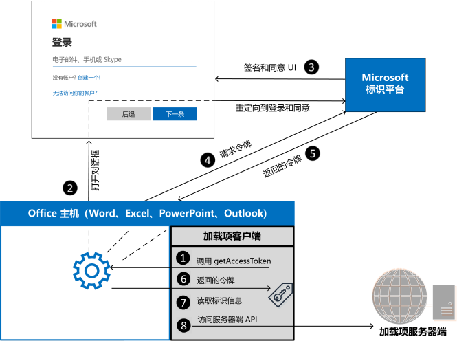

# <a name="enable-single-sign-on-sso-in-an-office-add-in"></a>在 Office 加载项中启用单一登录 (SSO)

用户可以使用自己的个人 Microsoft 帐户或 Microsoft 365 教育版或工作帐户登录 Office（在线、移动和桌面平台）。可以利用这一点，使用单点登录 (SSO) 进行身份验证并将用户授权给加载项，让用户无需登录第二次。


## <a name="how-sso-works-at-runtime"></a>运行时 SSO 的工作方式

以下关系图显示了 SSO 流程的工作方式。 蓝色元素表示 Office 或 Microsoft 标识平台。 灰色元素表示你编写的代码，包括客户端代码（任务窗格）和加载项的服务器端代码。



1. 在加载项中，JavaScript 代码调用 Office.js API [getAccessToken](/javascript/api/office-runtime/officeruntime.auth#office-runtime-officeruntime-auth-getaccesstoken-member(1))。 如果用户已登录到 Office，则 Office 主机将返回具有已登录用户声明的访问令牌。
2. 如果用户未登录，Office 主机应用程序会打开一个对话框供用户登录。 Office 重定向到 Microsoft 标识平台以完成登录过程。
3. 如果这是当前用户首次使用加载项，系统将提示他们同意。
4. Office 主机应用程序从当前用户的 Microsoft 标识平台请求 **访问令牌**。
5. Microsoft 标识平台将访问令牌返回到 Office。 Office 将代表你缓存令牌，以便将来对 **getAccessToken** 的调用仅返回缓存的令牌。
6. Office 主机应用程序将 **访问令牌** 作为 `getAccessToken` 调用返回的结果对象的一部分返回到加载项。
7. 令牌既是 **访问令牌** ，也是 **标识令牌**。可以将其用作标识令牌来分析和检查有关用户的声明，例如用户的姓名和电子邮件地址。
8. 或者，加载项可以使用令牌作为 **访问令牌**，以向服务器端上的 API 发出经过身份验证的 HTTPS 请求。 由于访问令牌包含身份声明，因此服务器可以存储与用户身份相关的信息；例如用户的首选项。

## <a name="requirements-and-best-practices"></a>要求和最佳做法

### <a name="dont-cache-the-access-token"></a>不缓存访问令牌

从不在客户端代码中缓存或存储访问令牌。 需要访问令牌时，始终调用 [getAccessToken](/javascript/api/office-runtime/officeruntime.auth#office-runtime-officeruntime-auth-getaccesstoken-member(1))。 Office 将缓存访问令牌（或在过期时请求新的访问令牌。）这将有助于避免意外从加载项中泄露令牌。

### <a name="enable-modern-authentication-for-outlook"></a>为 Outlook 启用新式身份验证

如果使用的是 **Outlook** 加载项，请务必为 Microsoft 365 租赁启用新式验证。 若要了解如何执行此操作，请参阅 [Exchange Online: How to enable your tenant for modern authentication](https://social.technet.microsoft.com/wiki/contents/articles/32711.exchange-online-how-to-enable-your-tenant-for-modern-authentication.aspx)（如何为租户启用新式体验）。

### <a name="implement-a-fallback-authentication-system"></a>实施回退身份验证系统

*不应* 依赖 SSO 作为加载项的唯一身份验证方法。 应实现备用身份验证系统，在某些错误情况下，加载项可以返回到该系统。 例如，如果在不支持 SSO 的旧版 Office 上加载加载项，则 `getAccessToken` 调用将失败。

对于 Excel、Word 和 PowerPoint 加载项，你通常希望回退到使用 Microsoft 标识平台。 有关详细信息，请参阅[使用 Microsoft 标识平台进行身份验证](overview-authn-authz.md#authenticate-with-the-microsoft-identity-platform)。

对于 Outlook 加载项，建议使用回退系统。 有关详细信息，请参阅[应用场景：在 Outlook 外接程序中对服务实现单一登录](../outlook/implement-sso-in-outlook-add-in.md)。

你还可以使用用户表和身份验证系统，或者可以利用其中一个社交登录提供程序。 有关如何使用 Office 插件进行此操作的详细信息，请参见[授权 Office 加载项中的外部服务](auth-external-add-ins.md)。

有关使用 Microsoft 标识平台作为回退系统的代码示例，请参阅 [Office 加载项 NodeJS SSO](https://github.com/OfficeDev/PnP-OfficeAddins/tree/main/Samples/auth/Office-Add-in-NodeJS-SSO) 和 [Office 加载项 ASP.NET SSO](https://github.com/OfficeDev/PnP-OfficeAddins/tree/main/Samples/auth/Office-Add-in-ASPNET-SSO)。

## <a name="develop-an-sso-add-in"></a>开发 SSO 加载项

此部分介绍了创建启用 SSO 的 Office 加载项所需完成的任务。 此处介绍的这些任务独立于语言或框架。 有关分步说明，请参阅：

- [创建使用单一登录的 Node.js Office 加载项](create-sso-office-add-ins-nodejs.md)
- [创建使用单一登录的 ASP.NET Office 加载项](create-sso-office-add-ins-aspnet.md)

> [!NOTE]
> 可使用 Yeoman 生成器创建启用了 SSO 的  Node.js Office 加载项。 Yeoman 生成器简化了启用了 SSO 的加载项创建流程，能够自动执行在 Azure 内配置所需的步骤，并生成加载项使用 SSO 所需的代码。 有关详细信息，请参阅“[单一登录（SSO）快速入门](../quickstarts/sso-quickstart.md)”。

### <a name="register-your-add-in-with-the-microsoft-identity-platform"></a>向 Microsoft 标识平台注册加载项

若要使用 SSO，需要向 Microsoft 标识平台注册加载项。 这将使 Microsoft 标识平台能够为加载项提供身份验证和授权服务。 创建应用注册包括以下任务。

- 获取应用程序 (客户端) ID，以识别 Microsoft 标识平台中的加载项。
- 生成客户端密码，以在请求令牌时用作加载项的密码。
- 指定加载项所需权限。 始终需要 Microsoft Graph“配置文件”和“OpenId”权限。 根据加载项需要执行的操作，你可能需要其他权限。
- 向加载项授予 Office 应用程序信任。
- 使用默认范围 *access_as_user* 将 Office 应用程序预授权给加载项。

有关此过程的更多详细信息，请参阅[向 Microsoft 标识平台注册使用 SSO 的 Office 加载项](register-sso-add-in-aad-v2.md)。

### <a name="configure-the-add-in"></a>配置加载项

向加载项清单添加新标记。

- **WebApplicationInfo** - 下列元素的父元素。
- **ID** - 向 Microsoft 标识平台注册加载项时收到的应用程序 (客户端) ID。 有关详细信息，请参阅[向 Microsoft 标识平台注册使用 SSO 的 Office 加载项](register-sso-add-in-aad-v2.md)。
- **资源** - 加载项的 URI。 这是你在向 Microsoft 标识平台注册加载项时使用的相同 URI（包括 `api:` 协议）。 此 URI 的域部分必须与加载项清单的 `<Resources>` 部分中的 URL 中使用的域（包括任何子域）匹配，并且该 URI 必须以 `<Id>` 元素中指定的客户端 ID 结尾。
- **Scopes** - 一个或多个“**Scope**”元素的父元素。
- **范围** - 指定加载项所需的权限。 始终需要 `profile` 和 `openID` 权限，并且可能是唯一需要的权限。 如果加载项需要访问 Microsoft Graph 或其他 Microsoft 365 资源，则将需要其他 **范围** 元素。 例如，对于 Microsoft Graph 权限，你可以请求 `User.Read` 和 `Mail.Read` 范围。 在代码中用于访问 Microsoft Graph 的库可能需要其他权限。 有关详细信息，请参阅[向 Office 加载项中的 Microsoft Graph 授权](authorize-to-microsoft-graph.md)。

对于 Word、Excel 和 PowerPoint 加载项，将标记添加到 `<VersionOverrides ... xsi:type="VersionOverridesV1_0">` 部分的末尾。 对于 Outlook 加载项，将标记添加到 `<VersionOverrides ... xsi:type="VersionOverridesV1_1">` 部分的末尾。

下面是一个标注示例。

```xml
<WebApplicationInfo>
    <Id>5661fed9-f33d-4e95-b6cf-624a34a2f51d</Id>
    <Resource>api://addin.contoso.com/5661fed9-f33d-4e95-b6cf-624a34a2f51d</Resource>
    <Scopes>
        <Scope>openid</Scope>
        <Scope>user.read</Scope>
        <Scope>files.read</Scope>
        <Scope>profile</Scope>
    </Scopes>
</WebApplicationInfo>
```

> [!NOTE]
> 如果不遵循 SSO 清单中的格式要求，则 AppSource 将拒绝加载项，直到其满足所需格式。

### <a name="include-the-identity-api-requirement-set"></a>包括标识 API 要求集

若要使用 SSO，加载项需要标识 API 1.3 要求集。有关详细信息，请参阅 [IdentityAPI](/javascript/api/requirement-sets/identity-api-requirement-sets)。

### <a name="add-client-side-code"></a>添加客户端代码

将 JavaScript 添加到加载项，以执行以下操作：

- 调用 [getAccessToken](/javascript/api/office-runtime/officeruntime.auth#office-runtime-officeruntime-auth-getaccesstoken-member(1))。
- 解析访问令牌或将其传递到加载项的服务器端代码。

以下代码显示了调用 `getAccessToken` 和分析用户名和其他凭据的令牌的简单示例。

> [!NOTE]
> 此示例只显式处理一种错误。 有关更详细的错误处理的示例，请参阅 [Office 加载项 NodeJS SSO](https://github.com/OfficeDev/Office-Add-in-samples/tree/main/Samples/auth/Office-Add-in-NodeJS-SSO) 和 [Office 加载项 ASP.NET SSO](https://github.com/OfficeDev/Office-Add-in-samples/tree/main/Samples/auth/Office-Add-in-ASPNET-SSO)。

```js
async function getUserData() {
    try {
        let userTokenEncoded = await OfficeRuntime.auth.getAccessToken();
        let userToken = jwt_decode(userTokenEncoded); // Using the https://www.npmjs.com/package/jwt-decode library.
        console.log(userToken.name); // user name
        console.log(userToken.preferred_username); // email
        console.log(userToken.oid); // user id     
    }
    catch (exception) {
        if (exception.code === 13003) {
            // SSO is not supported for domain user accounts, only
            // Microsoft 365 Education or work account, or a Microsoft account.
        } else {
            // Handle error
        }
    }
}
```


#### <a name="when-to-call-getaccesstoken"></a>何时调用 getAccessToken

如果加载项需要已登录用户，则应从 `Office.initialize` 内部调用 `getAccessToken`。 还应在 `getAccessToken` 的 `options` 参数中传递 `allowSignInPrompt: true`。 例如; `OfficeRuntime.auth.getAccessToken( { allowSignInPrompt: true });` 这将确保如果用户尚未登录，Office 会通过 UI 提示用户立即登录。

如果加载项具有不需要登录用户的某些功能，则你可在用户执行需要登录用户的操作时调用 `getAccessToken` **。 `getAccessToken` 的冗余调用不会导致性能严重降低，因为 Office 会缓存并重用访问令牌，直到其过期，而无需在调用 `getAccessToken` 时再次调用 [Microsoft 标识平台](/azure/active-directory/develop/)。 因此，可以将 `getAccessToken` 调用添加到所有在需要令牌时启动操作的函数和处理程序。

> [!IMPORTANT]
> 作为最佳安全做法，请始终在需要访问令牌时调用 `getAccessToken`。 Office 将为你缓存它。 请勿使用自己的代码缓存或存储访问令牌。

### <a name="pass-the-access-token-to-server-side-code"></a>将访问令牌传递到服务器端代码

如果需要访问服务器或其他服务 (例如 Microsoft Graph) 上的 Web API，则需要将访问令牌传递到服务器端代码。 访问令牌（为经过身份验证的用户）提供对 Web API 的访问权限。 如果需要，服务器端代码也可以分析令牌以获取身份信息。 （请参阅下面的 **使用访问令牌作为身份令牌**。）有许多可用于不同语言和平台的库可帮助简化你编写的代码。 有关详细信息，请参阅 [Microsoft 身份验证库 (MSAL) 概述](/azure/active-directory/develop/msal-overview)。

如果需要访问 Microsoft Graph 数据，服务器端代码应执行以下操作：

- 验证访问令牌（请参阅下文“**验证访问令牌**”）。
- 通过调用 Microsoft 标识平台来启动 [OAuth 2.0 代理流](/azure/active-directory/develop/v2-oauth2-on-behalf-of-flow)，该平台包括访问令牌、有关用户的一些元数据以及加载项的凭据 (其 ID 和密码)。 Microsoft 标识平台将返回可用于访问 Microsoft Graph 的新访问令牌。
- 使用新的令牌从 Microsoft Graph 获取数据。
- 如果需要为多个调用缓存新的访问令牌，我们建议使用 [MSAL.NET 中的令牌缓存序列化](/azure/active-directory/develop/msal-net-token-cache-serialization?tabs=aspnet)。

> [!IMPORTANT]
> 作为最佳安全做法，请始终使用服务器端代码进行 Microsoft Graph 调用或需要传递访问令牌的其他调用。 从不将 OBO 令牌返回到客户端，以允许客户端直接调用 Microsoft Graph。 这有助于保护令牌免受截获或泄露的侵害。 有关正确协议流的详细信息，请参阅 [OAuth 2.0 协议图](/azure/active-directory/develop/v2-oauth2-on-behalf-of-flow#protocol-diagram)

以下代码显示了将访问令牌传递到服务器端的示例。 向服务器端 Web API 发送请求时，令牌在 `Authorization` 标头中传递。 此示例发送 JSON 数据，因此它使用 `POST` 方法，但 `GET` 足以在未写入服务器时发送访问令牌。

```js
$.ajax({
    type: "POST",
    url: "/api/DoSomething",
    headers: {
        "Authorization": "Bearer " + accessToken
    },
    data: { /* some JSON payload */ },
    contentType: "application/json; charset=utf-8"
}).done(function (data) {
    // Handle success
}).fail(function (error) {
    // Handle error
}).always(function () {
    // Cleanup
});
```

如需深入了解如何获得对用户的 Microsoft Graph 数据的授权访问，请参阅[向 Office 加载项中的 Microsoft Graph 授权](authorize-to-microsoft-graph.md)。

#### <a name="validate-the-access-token"></a>验证访问令牌

如果访问令牌从客户端发送，则服务器上的 Web API 必须验证该访问令牌。 该令牌是 JSON Web 令牌 (JWT)，这意味着验证方式与大多数标准 OAuth 流中的令牌验证方式类似。 有许多可用于处理 JWT 验证的库，而它们的基本内容为：

- 检查令牌的格式是否正确
- 检查令牌是否由预期的颁发机构颁发
- 检查令牌是否是针对 Web API

验证令牌时，请牢记以下准则。

- 有效的 SSO 令牌是由 Azure 颁发机构 `https://login.microsoftonline.com` 的。 令牌中的 `iss` 声明应以此值开头。
- 令牌的 `aud` 参数将设置为加载项的 Azure 应用注册的应用程序 ID。
- 令牌的 `scp` 参数将被设置为 `access_as_user`。

有关令牌验证的详细信息，请参阅 [Microsoft 标识平台访问令牌](/azure/active-directory/develop/access-tokens#validating-tokens)。

#### <a name="use-the-access-token-as-an-identity-token"></a>使用访问令牌作为身份令牌

如果加载项需要验证用户标识，则 `getAccessToken()` 返回的 SSO 令牌包含的信息可用于创建此标识。令牌中的以下声明与标识相关。

- `name` - 用户的显示名称。
- `preferred_username` - 用户的电子邮件地址。
- `oid` - 表示 Microsoft 标识系统中用户 ID 的 GUID。
- `tid` - 表示用户正在登录的租户的 GUID。

有关这些声明和其他声明的更多详细信息，请参阅 [Microsoft 标识平台 ID 令牌](/azure/active-directory/develop/id-tokens)。 如果需要构建唯一 ID 来表示系统中的用户，请参阅“[使用声明可靠地识别用户](/azure/active-directory/develop/id-tokens#using-claims-to-reliably-identify-a-user-subject-and-object-id)”以获取详细信息。

### <a name="example-access-token"></a>示例访问令牌

以下是访问令牌的典型解码有效负载。 有关属性的信息，请参阅 [Microsoft 标识平台访问令牌](/azure/active-directory/develop/active-directory-v2-tokens)。

```js
{
    aud: "2c3caa80-93f9-425e-8b85-0745f50c0d24",
    iss: "https://login.microsoftonline.com/fec4f964-8bc9-4fac-b972-1c1da35adbcd/v2.0",
    iat: 1521143967,
    nbf: 1521143967,
    exp: 1521147867,
    aio: "ATQAy/8GAAAA0agfnU4DTJUlEqGLisMtBk5q6z+6DB+sgiRjB/Ni73q83y0B86yBHU/WFJnlMQJ8",
    azp: "e4590ed6-62b3-5102-beff-bad2292ab01c",
    azpacr: "0",
    e_exp: 262800,
    name: "Mila Nikolova",
    oid: "6467882c-fdfd-4354-a1ed-4e13f064be25",
    preferred_username: "milan@contoso.com",
    scp: "access_as_user",
    sub: "XkjgWjdmaZ-_xDmhgN1BMP2vL2YOfeVxfPT_o8GRWaw",
    tid: "fec4f964-8bc9-4fac-b972-1c1da35adbcd",
    uti: "MICAQyhrH02ov54bCtIDAA",
    ver: "2.0"
}
```

## <a name="using-sso-with-an-outlook-add-in"></a>将 SSO 与 Outlook 加载项一起使用

在 Outlook 加载项中使用 SSO 与在 Excel、PowerPoint 或 Word 加载项中使用 SSO 存在一些细微但却重要的差别。 请务必阅读[使用 Outlook 加载项的单一登录对用户进行身份验证](../outlook/authenticate-a-user-with-an-sso-token.md)和[：在 Outlook 加载项中为服务实现单一登录](../outlook/implement-sso-in-outlook-add-in.md)。

## <a name="see-also"></a>另请参阅

- [Microsoft 标识平台文档](/azure/active-directory/develop/)
- [要求集](specify-office-hosts-and-api-requirements.md)
- [IdentityAPI](/javascript/api/requirement-sets/identity-api-requirement-sets)