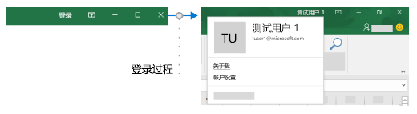
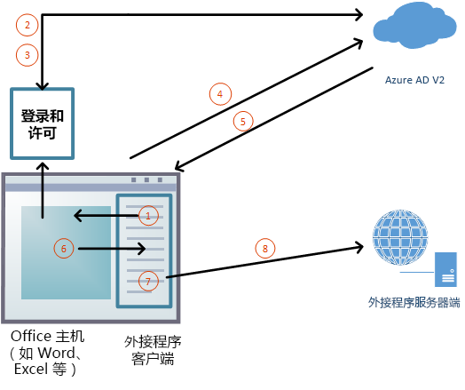

# <a name="enable-single-sign-on-for-office-add-ins-preview"></a><span data-ttu-id="290cb-103">为 Office 加载项启用单一登录（预览）</span><span class="sxs-lookup"><span data-stu-id="290cb-103">Enable single sign-on for Office Add-ins (preview)</span></span>

<span data-ttu-id="290cb-104">用户可以使用自己的个人 Microsoft 帐户/工作或学校 (Office 365) 帐户，登录 Office（在线、移动和桌面平台）。</span><span class="sxs-lookup"><span data-stu-id="290cb-104">Users sign in to Office (online, mobile, and desktop platforms) using either their personal Microsoft account or their work or school (Office 365) account.</span></span> <span data-ttu-id="290cb-105">可以利用此功能并使用单一登录 (SSO) 授权用户访问加载项（用户无需再次登录）。</span><span class="sxs-lookup"><span data-stu-id="290cb-105">You can take advantage of this and use single sign-on (SSO) to authorize the user to your add-in without requiring the user to sign in a second time.</span></span>



## <a name="preview-status"></a><span data-ttu-id="290cb-107">预览状态</span><span class="sxs-lookup"><span data-stu-id="290cb-107">Preview Status</span></span>

<span data-ttu-id="290cb-108">当前只在预览中支持单一登录 API。</span><span class="sxs-lookup"><span data-stu-id="290cb-108">The Single Sign-on API is currently supported in preview only.</span></span> <span data-ttu-id="290cb-109">它可供开发人员进行实验，但不应用于生产加载项。</span><span class="sxs-lookup"><span data-stu-id="290cb-109">It is available to developers for experimentation; but it should not be used in a production add-in.</span></span> <span data-ttu-id="290cb-110">此外，在 [AppSource](https://appsource.microsoft.com) 中不接受使用 SSO 的加载项。</span><span class="sxs-lookup"><span data-stu-id="290cb-110">In addition, add-ins that use SSO are not accepted in [AppSource](https://appsource.microsoft.com).</span></span>

<span data-ttu-id="290cb-111">SSO 要求使用 Office 365（Office 的订阅版本）。</span><span class="sxs-lookup"><span data-stu-id="290cb-111">SSO requires Office 365 (the subscription version of Office).</span></span> <span data-ttu-id="290cb-112">你应该使用来自预览体验成员频道的最新每月版本和内部版本。</span><span class="sxs-lookup"><span data-stu-id="290cb-112">You should use the latest monthly version and build from the Insiders channel.</span></span> <span data-ttu-id="290cb-113">你可能需要成为 Office 预览体验成员，才能获取此版本。</span><span class="sxs-lookup"><span data-stu-id="290cb-113">You need to be an Office Insider to get this version.</span></span> <span data-ttu-id="290cb-114">有关详细信息，请参阅[成为 Office 预览体验成员](https://insider.office.com)。</span><span class="sxs-lookup"><span data-stu-id="290cb-114">For more information, see [Be an Office Insider](https://insider.office.com).</span></span> <span data-ttu-id="290cb-115">请注意，当内部版本进入生产半年频道时，将关闭对该内部版本的预览功能（包括 SSO）的支持。</span><span class="sxs-lookup"><span data-stu-id="290cb-115">Please note that when a build graduates to the production semi-annual channel, support for preview features, including SSO, is turned off for that build.</span></span>

<span data-ttu-id="290cb-116">并非所有 Office 应用程序都支持 SSO 预览。</span><span class="sxs-lookup"><span data-stu-id="290cb-116">Not all Office applications support the SSO preview.</span></span> <span data-ttu-id="290cb-117">可以在 Word、Excel、Outlook 和 PowerPoint 中使用此加载项。</span><span class="sxs-lookup"><span data-stu-id="290cb-117">It is available in Word, Excel, Outlook, and PowerPoint.</span></span> <span data-ttu-id="290cb-118">若要详细了解目前支持单一登录 API 的平台，请参阅 [IdentityAPI 要求集](../reference/requirement-sets/identity-api-requirement-sets.md)。</span><span class="sxs-lookup"><span data-stu-id="290cb-118">For more information about where the Single Sign-on API is currently supported, see [IdentityAPI requirement sets](../reference/requirement-sets/identity-api-requirement-sets.md).</span></span>

## <a name="requirements-and-best-practices"></a><span data-ttu-id="290cb-119">要求和最佳做法</span><span class="sxs-lookup"><span data-stu-id="290cb-119">Requirements and Best Practices</span></span>

> [!NOTE]
> [!INCLUDE [Information about using preview APIs](../includes/using-preview-apis.md)]

<span data-ttu-id="290cb-120">如果使用的是 **Outlook** 加载项，请务必为 Office 365 租赁启用新式验证。</span><span class="sxs-lookup"><span data-stu-id="290cb-120">If you are working with an **Outlook** add-in, be sure to enable Modern Authentication for the Office 365 tenancy.</span></span> <span data-ttu-id="290cb-121">若要了解如何执行此操作，请参阅 [Exchange Online: How to enable your tenant for modern authentication](https://social.technet.microsoft.com/wiki/contents/articles/32711.exchange-online-how-to-enable-your-tenant-for-modern-authentication.aspx)（如何为租户启用新式体验）。</span><span class="sxs-lookup"><span data-stu-id="290cb-121">For information about how to do this, see [Exchange Online: How to enable your tenant for modern authentication](https://social.technet.microsoft.com/wiki/contents/articles/32711.exchange-online-how-to-enable-your-tenant-for-modern-authentication.aspx).</span></span>

<span data-ttu-id="290cb-122">*不应*依赖 SSO 作为加载项的唯一身份验证方法。</span><span class="sxs-lookup"><span data-stu-id="290cb-122">You should *not* rely on SSO as your add-in's only method of authentication.</span></span> <span data-ttu-id="290cb-123">应实现备用身份验证系统，在某些错误情况下，加载项可以返回到该系统。</span><span class="sxs-lookup"><span data-stu-id="290cb-123">You should implement an alternate authentication system that your add-in can fall back to in certain error situations.</span></span> <span data-ttu-id="290cb-124">可以使用包含用户表和身份验证的系统，也可以利用其中某个社交登录提供者。</span><span class="sxs-lookup"><span data-stu-id="290cb-124">You can use a system of user tables and authentication, or you can leverage one of the social login providers.</span></span> <span data-ttu-id="290cb-125">有关如何使用 Office 加载项执行此操作的详细信息，请参阅 [Authorize external services in your Office Add-in](auth-external-add-ins.md)（对 Office 加载项中的外部服务授权）。</span><span class="sxs-lookup"><span data-stu-id="290cb-125">For more information about how to do this with an Office add-in, see [Authorize external services in your Office Add-in](auth-external-add-ins.md).</span></span> <span data-ttu-id="290cb-126">对于 *Outlook*，建议使用回退系统。</span><span class="sxs-lookup"><span data-stu-id="290cb-126">For *Outlook*, there is a recommended fallback system.</span></span> <span data-ttu-id="290cb-127">有关详细信息，请参阅[应用场景：在 Outlook 外接程序中对服务实现单一登录](../outlook/implement-sso-in-outlook-add-in.md)。</span><span class="sxs-lookup"><span data-stu-id="290cb-127">For more information, see [Scenario: Implement single sign-on to your service in an Outlook add-in](../outlook/implement-sso-in-outlook-add-in.md).</span></span> <span data-ttu-id="290cb-128">有关使用 Azure Active Directory 作为回退系统的示例，请参阅 [Office 加载项 NodeJS SSO](https://github.com/OfficeDev/Office-Add-in-NodeJS-SSO) 和 [Office 加载项 ASP.NET SSO](https://github.com/OfficeDev/Office-Add-in-ASPNET-SSO)。</span><span class="sxs-lookup"><span data-stu-id="290cb-128">For samples that use Azure Active Directory as the fallback system, see [Office Add-in NodeJS SSO](https://github.com/OfficeDev/Office-Add-in-NodeJS-SSO) and [Office Add-in ASP.NET SSO](https://github.com/OfficeDev/Office-Add-in-ASPNET-SSO).</span></span>

## <a name="how-sso-works-at-runtime"></a><span data-ttu-id="290cb-129">运行时 SSO 的工作方式</span><span class="sxs-lookup"><span data-stu-id="290cb-129">How SSO works at runtime</span></span>

<span data-ttu-id="290cb-130">以下关系图显示了 SSO 流程的工作方式。</span><span class="sxs-lookup"><span data-stu-id="290cb-130">The following diagram shows how the SSO process works.</span></span>



1. <span data-ttu-id="290cb-132">在加载项中，JavaScript 调用新的 Office.js API [getAccessToken](/javascript/api/office-runtime/officeruntime.auth#getaccesstoken-options-)。</span><span class="sxs-lookup"><span data-stu-id="290cb-132">In the add-in, JavaScript calls a new Office.js API [getAccessToken](/javascript/api/office-runtime/officeruntime.auth#getaccesstoken-options-).</span></span> <span data-ttu-id="290cb-133">该操作告诉 Office 主机应用程序获取加载项的访问令牌。</span><span class="sxs-lookup"><span data-stu-id="290cb-133">This tells the Office host application to obtain an access token to the add-in.</span></span> <span data-ttu-id="290cb-134">请参阅[示例访问令牌](#example-access-token)。</span><span class="sxs-lookup"><span data-stu-id="290cb-134">See [Example access token](#example-access-token).</span></span>
2. <span data-ttu-id="290cb-135">如果用户未登录，Office 主机应用会打开弹出窗口，以供用户登录。</span><span class="sxs-lookup"><span data-stu-id="290cb-135">If the user is not signed in, the Office host application opens a pop-up window for the user to sign in.</span></span>
3. <span data-ttu-id="290cb-136">如果当前用户是首次使用加载项，则会看到同意提示。</span><span class="sxs-lookup"><span data-stu-id="290cb-136">If this is the first time the current user has used your add-in, he or she is prompted to consent.</span></span>
4. <span data-ttu-id="290cb-137">Office 主机应用程序从当前用户的 Azure AD v2.0 终结点请求获取**加载项令牌**。</span><span class="sxs-lookup"><span data-stu-id="290cb-137">The Office host application requests the **add-in token** from the Azure AD v2.0 endpoint for the current user.</span></span>
5. <span data-ttu-id="290cb-138">Azure AD 将加载项令牌发送给 Office 主机应用程序。</span><span class="sxs-lookup"><span data-stu-id="290cb-138">Azure AD sends the add-in token to the Office host application.</span></span>
6. <span data-ttu-id="290cb-139">Office 主机应用程序在 `getAccessToken` 调用返回的结果对象中，将“**加载项令牌**”发送给加载项。</span><span class="sxs-lookup"><span data-stu-id="290cb-139">The Office host application sends the **add-in token** to the add-in as part of the result object returned by the `getAccessToken` call.</span></span>
7. <span data-ttu-id="290cb-140">加载项中的 JavaScript 可以解析令牌并提取所需信息，如用户的电子邮件地址。</span><span class="sxs-lookup"><span data-stu-id="290cb-140">JavaScript in the add-in can parse the token and extract the information it needs, such as the user's email address.</span></span>
8. <span data-ttu-id="290cb-141">（可选）加载项可以向其服务器端发送 HTTP 请求以获取关于用户的更多数据，如用户的偏好。</span><span class="sxs-lookup"><span data-stu-id="290cb-141">Optionally, the add-in can send HTTP request to its server-side for more data about the user; such as the user's preferences.</span></span> <span data-ttu-id="290cb-142">此外，访问令牌本身也可发送到服务器端以进行解析和验证。</span><span class="sxs-lookup"><span data-stu-id="290cb-142">Alternatively, the access token itself could be sent to the server-side for parsing and validation there.</span></span>

## <a name="develop-an-sso-add-in"></a><span data-ttu-id="290cb-143">开发 SSO 加载项</span><span class="sxs-lookup"><span data-stu-id="290cb-143">Develop an SSO add-in</span></span>

<span data-ttu-id="290cb-144">此部分介绍了创建启用 SSO 的 Office 加载项所需完成的任务。</span><span class="sxs-lookup"><span data-stu-id="290cb-144">This section describes the tasks involved in creating an Office Add-in that uses SSO.</span></span> <span data-ttu-id="290cb-145">其中介绍的这些任务与语言和框架无关。</span><span class="sxs-lookup"><span data-stu-id="290cb-145">These tasks are described here in a language- and framework-agnostic way.</span></span> <span data-ttu-id="290cb-146">有关详细的演练，请参阅：</span><span class="sxs-lookup"><span data-stu-id="290cb-146">For detailed walkthroughs, see:</span></span>

* [<span data-ttu-id="290cb-147">创建使用单一登录的 Node.js Office 加载项</span><span class="sxs-lookup"><span data-stu-id="290cb-147">Create a Node.js Office Add-in that uses single sign-on</span></span>](create-sso-office-add-ins-nodejs.md)
* [<span data-ttu-id="290cb-148">创建使用单一登录的 ASP.NET Office 加载项</span><span class="sxs-lookup"><span data-stu-id="290cb-148">Create an ASP.NET Office Add-in that uses single sign-on</span></span>](create-sso-office-add-ins-aspnet.md)

> [!NOTE]
> <span data-ttu-id="290cb-149">可使用 Yeoman 生成器创建启用了 SSO 的  Node.js Office 加载项。</span><span class="sxs-lookup"><span data-stu-id="290cb-149">You can use the Yeoman generator to create an SSO-enabled, Node.js Office Add-in.</span></span> <span data-ttu-id="290cb-150">Yeoman 生成器简化了启用了 SSO 的加载项创建流程，能够自动执行在 Azure 内配置所需的步骤，并生成加载项使用 SSO 所需的代码。</span><span class="sxs-lookup"><span data-stu-id="290cb-150">The Yeoman generator simplifies the process of creating an SSO-enabled add-in, by automating the steps required to configure SSO within Azure and generating the code that's necessary for an add-in to use SSO.</span></span> <span data-ttu-id="290cb-151">有关详细信息，请参阅“[单一登录（SSO）快速入门](../quickstarts/sso-quickstart.md)”。</span><span class="sxs-lookup"><span data-stu-id="290cb-151">For more information, see the [Single sign-on (SSO) quick start](../quickstarts/sso-quickstart.md).</span></span>

### <a name="create-the-service-application"></a><span data-ttu-id="290cb-152">创建服务应用程序</span><span class="sxs-lookup"><span data-stu-id="290cb-152">Create the service application</span></span>

<span data-ttu-id="290cb-p111">在 Azure v2.0 终结点的注册门户注册外接程序。该流程用时 5-10 分钟，包括以下任务：</span><span class="sxs-lookup"><span data-stu-id="290cb-p111">Register the add-in at the registration portal for the Azure v2.0 endpoint. This is a 5–10 minute process that includes the following tasks:</span></span>

* <span data-ttu-id="290cb-155">获取加载项的客户端 ID 和机密。</span><span class="sxs-lookup"><span data-stu-id="290cb-155">Get a client ID and secret for the add-in.</span></span>
* <span data-ttu-id="290cb-156">指定加载项访问 AAD v 所需的权限。</span><span class="sxs-lookup"><span data-stu-id="290cb-156">Specify the permissions that your add-in needs to AAD v.</span></span> <span data-ttu-id="290cb-157">2.0 端点（可选 Microsoft Graph）。</span><span class="sxs-lookup"><span data-stu-id="290cb-157">2.0 endpoint (and optionally to Microsoft Graph).</span></span> <span data-ttu-id="290cb-158">始终需要“profile”权限。</span><span class="sxs-lookup"><span data-stu-id="290cb-158">The "profile" permission is always needed.</span></span>
* <span data-ttu-id="290cb-159">授予 Office 主机应用程序信任加载项。</span><span class="sxs-lookup"><span data-stu-id="290cb-159">Grant the Office host application trust to the add-in.</span></span>
* <span data-ttu-id="290cb-160">将 Office 主机应用程序预授权给具有 *access_as_user* 默认权限的加载项。</span><span class="sxs-lookup"><span data-stu-id="290cb-160">Preauthorize the Office host application to the add-in with the default permission *access_as_user*.</span></span>

<span data-ttu-id="290cb-161">有关此过程的详细信息，请参阅[向 Azure AD v2.0 端点注册使用 SSO 的 Office 加载项](register-sso-add-in-aad-v2.md)。</span><span class="sxs-lookup"><span data-stu-id="290cb-161">For more details about this process, see [Register an Office Add-in that uses SSO with the Azure AD v2.0 endpoint](register-sso-add-in-aad-v2.md).</span></span>

### <a name="configure-the-add-in"></a><span data-ttu-id="290cb-162">配置加载项</span><span class="sxs-lookup"><span data-stu-id="290cb-162">Configure the add-in</span></span>

<span data-ttu-id="290cb-163">向外接程序清单添加新标记：</span><span class="sxs-lookup"><span data-stu-id="290cb-163">Add new markup to the add-in manifest:</span></span>

* <span data-ttu-id="290cb-164">**WebApplicationInfo** - 下列元素的父元素。</span><span class="sxs-lookup"><span data-stu-id="290cb-164">**WebApplicationInfo** - The parent of the following elements.</span></span>
* <span data-ttu-id="290cb-165">**ID** - 加载项的客户端 ID。这是在注册加载项时获得的应用程序 ID。</span><span class="sxs-lookup"><span data-stu-id="290cb-165">**Id** - The client ID of the add-in This is an application ID that you obtain as part of registering the add-in.</span></span> <span data-ttu-id="290cb-166">请参阅[向 Azure AD v2.0 端点注册使用 SSO 的 Office 加载项](register-sso-add-in-aad-v2.md)。</span><span class="sxs-lookup"><span data-stu-id="290cb-166">See [Register an Office Add-in that uses SSO with the Azure AD v2.0 endpoint](register-sso-add-in-aad-v2.md).</span></span>
* <span data-ttu-id="290cb-167">**Resource** - 加载项 URL。</span><span class="sxs-lookup"><span data-stu-id="290cb-167">**Resource** - The URL of the add-in.</span></span> <span data-ttu-id="290cb-168">这是在 AAD 中注册加载项时使用的相同 URI（包括 `api:` 协议）。</span><span class="sxs-lookup"><span data-stu-id="290cb-168">This is the same URI (including the `api:` protocol) that you used when registering the add-in in AAD.</span></span> <span data-ttu-id="290cb-169">此 URI 的域部分应与加载项清单的 `<Resources>` 部分中的 URL 中使用的域（包括任何子域）匹配。</span><span class="sxs-lookup"><span data-stu-id="290cb-169">The domain part of this URI should match the domain, including any subdomains, used in the URLs in the `<Resources>` section of the add-in's manifest.</span></span>
* <span data-ttu-id="290cb-170">**Scopes** - 一个或多个“**Scope**”元素的父元素。</span><span class="sxs-lookup"><span data-stu-id="290cb-170">**Scopes** - The parent of one or more **Scope** elements.</span></span>
* <span data-ttu-id="290cb-171">**Scope** - 指定加载项访问 AAD 所需的权限。</span><span class="sxs-lookup"><span data-stu-id="290cb-171">**Scope** - Specifies a permission that the add-in needs to AAD.</span></span> <span data-ttu-id="290cb-172">如果加载项无法访问 Microsoft Graph，则始终需要 `profile` 权限，并且它可能是唯一需要的权限。</span><span class="sxs-lookup"><span data-stu-id="290cb-172">The `profile` permission is always needed and it may be the only permission needed, if your add-in does not access Microsoft Graph.</span></span> <span data-ttu-id="290cb-173">如果可以访问，则还需要“**Scope**”元素来获取所需的 Microsoft Graph 权限（如 `User.Read``Mail.Read`）。</span><span class="sxs-lookup"><span data-stu-id="290cb-173">If it does, you also need **Scope** elements for the required Microsoft Graph permissions; for example, `User.Read`, `Mail.Read`.</span></span> <span data-ttu-id="290cb-174">在代码中用于访问 Microsoft Graph 的库可能需要其他权限。</span><span class="sxs-lookup"><span data-stu-id="290cb-174">Libraries that you use in your code to access Microsoft Graph may need additional permissions.</span></span> <span data-ttu-id="290cb-175">例如，用于 .NET 的 Microsoft 身份验证库 (MSAL) 需要 `offline_access` 权限。</span><span class="sxs-lookup"><span data-stu-id="290cb-175">For example, Microsoft Authentication Library (MSAL) for .NET requires `offline_access` permission.</span></span> <span data-ttu-id="290cb-176">有关详细信息，请参阅[向 Office 加载项中的 Microsoft Graph 授权](authorize-to-microsoft-graph.md)。</span><span class="sxs-lookup"><span data-stu-id="290cb-176">For more information, see [Authorize to Microsoft Graph from an Office Add-in](authorize-to-microsoft-graph.md).</span></span>

<span data-ttu-id="290cb-p116">对于除 Outlook 之外的 Office 主机，请将此标记添加到 `<VersionOverrides ... xsi:type="VersionOverridesV1_0">` 部分的末尾。对 Outlook，请将此标记添加到 `<VersionOverrides ... xsi:type="VersionOverridesV1_1">` 部分的末尾。</span><span class="sxs-lookup"><span data-stu-id="290cb-p116">For Office hosts other than Outlook, add the markup to the end of the `<VersionOverrides ... xsi:type="VersionOverridesV1_0">` section. For Outlook, add the markup to the end of the `<VersionOverrides ... xsi:type="VersionOverridesV1_1">` section.</span></span>

<span data-ttu-id="290cb-179">下面的示例展示了标记：</span><span class="sxs-lookup"><span data-stu-id="290cb-179">The following is an example of the markup:</span></span>

```xml
<WebApplicationInfo>
    <Id>5661fed9-f33d-4e95-b6cf-624a34a2f51d</Id>
    <Resource>api://addin.contoso.com/5661fed9-f33d-4e95-b6cf-624a34a2f51d</Resource>
    <Scopes>
        <Scope>user.read</Scope>
        <Scope>files.read</Scope>
        <Scope>profile</Scope>
    </Scopes>
</WebApplicationInfo>
```

### <a name="add-client-side-code"></a><span data-ttu-id="290cb-180">添加客户端代码</span><span class="sxs-lookup"><span data-stu-id="290cb-180">Add client-side code</span></span>

<span data-ttu-id="290cb-181">将 JavaScript 添加到加载项，以执行以下操作：</span><span class="sxs-lookup"><span data-stu-id="290cb-181">Add JavaScript to the add-in to:</span></span>

* <span data-ttu-id="290cb-182">调用 [getAccessToken](/javascript/api/office-runtime/officeruntime.auth#getaccesstoken-options-)。</span><span class="sxs-lookup"><span data-stu-id="290cb-182">Call [getAccessToken](/javascript/api/office-runtime/officeruntime.auth#getaccesstoken-options-).</span></span>

* <span data-ttu-id="290cb-183">解析访问令牌或将其传递到加载项的服务器端代码。</span><span class="sxs-lookup"><span data-stu-id="290cb-183">Parse the access token or pass it to the add-in’s server-side code.</span></span>

<span data-ttu-id="290cb-184">下面是调用 `getAccessToken` 的简单示例。</span><span class="sxs-lookup"><span data-stu-id="290cb-184">Here's a simple example of a call to `getAccessToken`.</span></span>

> [!NOTE]
> <span data-ttu-id="290cb-185">此示例只显式处理一种错误。</span><span class="sxs-lookup"><span data-stu-id="290cb-185">This example handles only one kind of error explicitly.</span></span> <span data-ttu-id="290cb-186">有关更详细的错误处理的示例，请参阅 [Office 加载项 NodeJS SSO](https://github.com/OfficeDev/Office-Add-in-NodeJS-SSO) 和 [Office 加载项 ASP.NET SSO](https://github.com/OfficeDev/Office-Add-in-ASPNET-SSO)。</span><span class="sxs-lookup"><span data-stu-id="290cb-186">For examples of more elaborate error handling, see [Office Add-in NodeJS SSO](https://github.com/OfficeDev/Office-Add-in-NodeJS-SSO) and [Office Add-in ASP.NET SSO](https://github.com/OfficeDev/Office-Add-in-ASPNET-SSO).</span></span>


```js
async function getGraphData() {
    try {
        let bootstrapToken = await OfficeRuntime.auth.getAccessToken({ allowSignInPrompt: true, forMSGraphAccess: true });

        // The /api/values controller will make the token exchange and use the
        // access token it gets back to make the call to MS Graph.
        getData("/api/DoSomething", bootstrapToken);
    }
    catch (exception) {
        if (exception.code === 13003) {
            // SSO is not supported for domain user accounts, only
            // work or school (Office 365) or Microsoft Account IDs.
        } else {
            // Handle error
        }
    }
}
```

<span data-ttu-id="290cb-187">下面是一个将加载项令牌传递到服务器端的简单示例。</span><span class="sxs-lookup"><span data-stu-id="290cb-187">Here's a simple example of passing the add-in token to the server-side.</span></span> <span data-ttu-id="290cb-188">将请求发送回服务器端时，令牌作为 `Authorization` 标头包含在内。</span><span class="sxs-lookup"><span data-stu-id="290cb-188">The token is included as an `Authorization` header when sending a request back to the server-side.</span></span> <span data-ttu-id="290cb-189">此示例设想发送 JSON 数据，因此它使用 `POST` 方法，但使用 `GET` 就足以在未写入服务器时发送访问令牌。</span><span class="sxs-lookup"><span data-stu-id="290cb-189">This example envisions sending JSON data, so it uses the `POST` method, but `GET` is sufficient to send the access token when you are not writing to the server.</span></span>

```js
$.ajax({
    type: "POST",
    url: "/api/DoSomething",
    headers: {
        "Authorization": "Bearer " + bootstrapToken
    },
    data: { /* some JSON payload */ },
    contentType: "application/json; charset=utf-8"
}).done(function (data) {
    // Handle success
}).fail(function (error) {
    // Handle error
}).always(function () {
    // Cleanup
});
```

#### <a name="when-to-call-the-method"></a><span data-ttu-id="290cb-190">何时调用方法</span><span class="sxs-lookup"><span data-stu-id="290cb-190">When to call the method</span></span>

<span data-ttu-id="290cb-191">如果因没有用户登录 Office 而无法使用加载项，则应*在加载项启动时*调用 `getAccessToken`，并在 `getAccessToken` 的 `options` 参数中传递 `allowSignInPrompt: true`。</span><span class="sxs-lookup"><span data-stu-id="290cb-191">If your add-in cannot be used when no user is logged into Office, then you should call `getAccessToken` *when the add-in launches* and pass `allowSignInPrompt: true` in the `options` parameter of `getAccessToken`.</span></span>

<span data-ttu-id="290cb-192">如果加载项具有一些无需用户登录的功能，那么*当用户执行需要用户登录的操作时*，请调用 `getAccessToken`。</span><span class="sxs-lookup"><span data-stu-id="290cb-192">If the add-in has some functionality that doesn't require a logged in user, then you call `getAccessToken` *when the user takes an action that requires a logged in user*.</span></span> <span data-ttu-id="290cb-193">`getAccessToken` 的冗余调用不会导致性能严重下降，因为 Office 缓存并重用启动没有过期的令牌，无需每次调用 AAD v。</span><span class="sxs-lookup"><span data-stu-id="290cb-193">There is no significant performance degradation with redundant calls of `getAccessToken` because Office caches the bootstrap token and will reuse it, until it expires, without making another call to the AAD v.</span></span> <span data-ttu-id="290cb-194">`getAccessToken` 都重新调用 AAD V 2.0 端点。</span><span class="sxs-lookup"><span data-stu-id="290cb-194">2.0 endpoint whenever `getAccessToken` is called.</span></span> <span data-ttu-id="290cb-195">因此，可以将 `getAccessToken` 调用添加到所有在需要令牌时启动操作的函数和处理程序。</span><span class="sxs-lookup"><span data-stu-id="290cb-195">So you can add calls of `getAccessToken` to all functions and handlers that initiate an action where the token is needed.</span></span>

### <a name="add-server-side-code"></a><span data-ttu-id="290cb-196">添加服务器端代码</span><span class="sxs-lookup"><span data-stu-id="290cb-196">Add server-side code</span></span>

<span data-ttu-id="290cb-197">大多数情况下，如果加载项没有将访问令牌传递到服务器端并在其中使用它，那么获取访问令牌的意义就不大。</span><span class="sxs-lookup"><span data-stu-id="290cb-197">In most scenarios, there would be little point to obtaining the access token, if your add-in does not pass it on to a server-side and use it there.</span></span> <span data-ttu-id="290cb-198">加载项可以执行的一些服务器端任务：</span><span class="sxs-lookup"><span data-stu-id="290cb-198">Some server-side tasks your add-in could do:</span></span>

* <span data-ttu-id="290cb-199">创建一种或多种 Web API 方法（例如，一种在托管数据库中查找用户首选项的方法），使用有关从令牌中提取的用户的信息。</span><span class="sxs-lookup"><span data-stu-id="290cb-199">Create one or more Web API methods that use information about the user that is extracted from the token; for example, a method that looks up the user's preferences in your hosted data base.</span></span> <span data-ttu-id="290cb-200">（请参阅下文“**使用 SSO 令牌作为标识**”。）可以使用一些库简化需要编写的代码，具体视语言和框架而定。</span><span class="sxs-lookup"><span data-stu-id="290cb-200">(See **Using the SSO token as an identity** below.) Depending on your language and framework, libraries might be available that will simplify the code you have to write.</span></span>
* <span data-ttu-id="290cb-201">获取 Microsoft Graph 数据。</span><span class="sxs-lookup"><span data-stu-id="290cb-201">Get Microsoft Graph data.</span></span> <span data-ttu-id="290cb-202">服务器端代码应执行以下操作：</span><span class="sxs-lookup"><span data-stu-id="290cb-202">Your server-side code should do the following:</span></span>

    * <span data-ttu-id="290cb-203">通过调用 Azure AD v2.0 端点启动“代表”流，该端点包括访问令牌、关于用户的一些元数据以及加载项的凭据（其 ID 和机密）。</span><span class="sxs-lookup"><span data-stu-id="290cb-203">Initiate the “on behalf of” flow with a call to the Azure AD v2.0 endpoint that includes the access token, some metadata about the user, and the credentials of the add-in (its ID and secret).</span></span> <span data-ttu-id="290cb-204">在此上下文中，访问令牌称为启动令牌。</span><span class="sxs-lookup"><span data-stu-id="290cb-204">In this context, the access token is called the bootstrap token.</span></span>
    * <span data-ttu-id="290cb-205">使用新的令牌从 Microsoft Graph 获取数据。</span><span class="sxs-lookup"><span data-stu-id="290cb-205">Get data from Microsoft Graph by using the new token.</span></span>
    * <span data-ttu-id="290cb-206">或者，在启动流之前，验证访问令牌（请参阅下文**验证访问令牌**）。</span><span class="sxs-lookup"><span data-stu-id="290cb-206">Optionally, before initiating the flow, validate the access token (see **Validate the access token** below).</span></span>
    * <span data-ttu-id="290cb-207">或者，在代表流完成后，缓存从流返回的新访问令牌，以便在对 Microsoft Graph 的其他调用中重复使用它，直到过期为止。</span><span class="sxs-lookup"><span data-stu-id="290cb-207">Optionally, after the on-behalf-of flow completes, cache the new access token that is returned from the flow so that it an be reused in other calls to Microsoft Graph until it expires.</span></span>

 <span data-ttu-id="290cb-208">如需深入了解如何获得对用户的 Microsoft Graph 数据的授权访问，请参阅[向 Office 加载项中的 Microsoft Graph 授权](authorize-to-microsoft-graph.md)。</span><span class="sxs-lookup"><span data-stu-id="290cb-208">For more details about getting authorized access to the user's Microsoft Graph data, see [Authorize to Microsoft Graph in your Office Add-in](authorize-to-microsoft-graph.md).</span></span>

#### <a name="validate-the-access-token"></a><span data-ttu-id="290cb-209">验证访问令牌</span><span class="sxs-lookup"><span data-stu-id="290cb-209">Validate the access token</span></span>

<span data-ttu-id="290cb-210">Web API 收到访问令牌后，可以在使用该令牌前对其进行验证。</span><span class="sxs-lookup"><span data-stu-id="290cb-210">Once the Web API receives the access token, it can validate it before using it.</span></span> <span data-ttu-id="290cb-211">该令牌是 JSON Web 令牌 (JWT)，这意味着验证方式与大多数标准 OAuth 流中的令牌验证方式类似。</span><span class="sxs-lookup"><span data-stu-id="290cb-211">The token is a JSON Web Token (JWT), which means that validation works just like token validation in most standard OAuth flows.</span></span> <span data-ttu-id="290cb-212">有许多可用于处理 JWT 验证的库，而它们的基本内容为：</span><span class="sxs-lookup"><span data-stu-id="290cb-212">There are a number of libraries available that can handle JWT validation, but the basics include:</span></span>

- <span data-ttu-id="290cb-213">检查令牌的格式是否正确</span><span class="sxs-lookup"><span data-stu-id="290cb-213">Checking that the token is well-formed</span></span>
- <span data-ttu-id="290cb-214">检查令牌是否由预期的颁发机构颁发</span><span class="sxs-lookup"><span data-stu-id="290cb-214">Checking that the token was issued by the intended authority</span></span>
- <span data-ttu-id="290cb-215">检查令牌是否是针对 Web API</span><span class="sxs-lookup"><span data-stu-id="290cb-215">Checking that the token is targeted to the Web API</span></span>

<span data-ttu-id="290cb-216">验证令牌时，请牢记以下准则：</span><span class="sxs-lookup"><span data-stu-id="290cb-216">Keep in mind the following guidelines when validating the token:</span></span>

- <span data-ttu-id="290cb-217">有效的 SSO 令牌是由 Azure 颁发机构 `https://login.microsoftonline.com` 的。</span><span class="sxs-lookup"><span data-stu-id="290cb-217">Valid SSO tokens will be issued by the Azure authority, `https://login.microsoftonline.com`.</span></span> <span data-ttu-id="290cb-218">令牌中的 `iss` 声明应以此值开头。</span><span class="sxs-lookup"><span data-stu-id="290cb-218">The `iss` claim in the token should start with this value.</span></span>
- <span data-ttu-id="290cb-219">令牌的 `aud` 参数将被设置为加载项注册的应用程序 ID。</span><span class="sxs-lookup"><span data-stu-id="290cb-219">The token's `aud` parameter will be set to the application ID of the add-in's registration.</span></span>
- <span data-ttu-id="290cb-220">令牌的 `scp` 参数将被设置为 `access_as_user`。</span><span class="sxs-lookup"><span data-stu-id="290cb-220">The token's `scp` parameter will be set to `access_as_user`.</span></span>

#### <a name="using-the-sso-token-as-an-identity"></a><span data-ttu-id="290cb-221">将 SSO 令牌用作标识</span><span class="sxs-lookup"><span data-stu-id="290cb-221">Using the SSO token as an identity</span></span>

<span data-ttu-id="290cb-222">如果加载项需要验证用户标识，则 SSO 令牌包含的信息可用于创建此标识。</span><span class="sxs-lookup"><span data-stu-id="290cb-222">If your add-in needs to verify the user's identity, the SSO token contains information that can be used to establish the identity.</span></span> <span data-ttu-id="290cb-223">令牌中的以下声明与标识相关。</span><span class="sxs-lookup"><span data-stu-id="290cb-223">The following claims in the token relate to identity.</span></span>

- <span data-ttu-id="290cb-224">`name` - 用户的显示名称。</span><span class="sxs-lookup"><span data-stu-id="290cb-224">`name` - The user's display name.</span></span>
- <span data-ttu-id="290cb-225">`preferred_username` - 用户的电子邮件地址。</span><span class="sxs-lookup"><span data-stu-id="290cb-225">`preferred_username` - The user's email address.</span></span>
- <span data-ttu-id="290cb-226">`oid` - 表示 Azure Active Directory 中的用户 ID 的 GUID。</span><span class="sxs-lookup"><span data-stu-id="290cb-226">`oid` - A GUID representing the ID of the user in the Azure Active Directory.</span></span>
- <span data-ttu-id="290cb-227">`tid` - 表示 Azure Active Directory 中的用户组织 ID 的 GUID。</span><span class="sxs-lookup"><span data-stu-id="290cb-227">`tid` - A GUID representing the ID of the user's organization in the Azure Active Directory.</span></span>

<span data-ttu-id="290cb-228">由于 `name` 和 `preferred_username` 值可以更改，因此建议使用 `oid` 和 `tid` 值将标识与后端的授权服务关联。</span><span class="sxs-lookup"><span data-stu-id="290cb-228">Since the `name` and `preferred_username` values could change, we recommend that the `oid` and `tid` values be used to correlate the identity with your back-end's authorization service.</span></span>

<span data-ttu-id="290cb-229">例如，你的服务可以将这些值组合在一起，并设置为类似 `{oid-value}@{tid-value}` 的格式，然后将其存储为内部用户数据库中的用户记录值。</span><span class="sxs-lookup"><span data-stu-id="290cb-229">For example, your service could format those values together like `{oid-value}@{tid-value}`, then store that as a value on the user's record in your internal user database.</span></span> <span data-ttu-id="290cb-230">然后，在后续的请求中，可以使用同一值检索此用户，并可基于现有访问控制机制确定对特定资源的访问。</span><span class="sxs-lookup"><span data-stu-id="290cb-230">Then on subsequent requests, the user could be retrieved by using the same value, and access to specific resources could be determined based on your existing access control mechanisms.</span></span>

### <a name="example-access-token"></a><span data-ttu-id="290cb-231">示例访问令牌</span><span class="sxs-lookup"><span data-stu-id="290cb-231">Example access token</span></span>

<span data-ttu-id="290cb-232">以下是访问令牌的典型解码有效负载。</span><span class="sxs-lookup"><span data-stu-id="290cb-232">The following is a typical decoded payload of an access token.</span></span> <span data-ttu-id="290cb-233">有关属性的详细信息，请参阅 [Azure Active Directory v2.0 令牌参考](/azure/active-directory/develop/active-directory-v2-tokens)。</span><span class="sxs-lookup"><span data-stu-id="290cb-233">For information about the properties, see [Azure Active Directory v2.0 tokens reference](/azure/active-directory/develop/active-directory-v2-tokens).</span></span>

```js
{
    aud: "2c3caa80-93f9-425e-8b85-0745f50c0d24",
    iss: "https://login.microsoftonline.com/fec4f964-8bc9-4fac-b972-1c1da35adbcd/v2.0",
    iat: 1521143967,
    nbf: 1521143967,
    exp: 1521147867,
    aio: "ATQAy/8GAAAA0agfnU4DTJUlEqGLisMtBk5q6z+6DB+sgiRjB/Ni73q83y0B86yBHU/WFJnlMQJ8",
    azp: "e4590ed6-62b3-5102-beff-bad2292ab01c",
    azpacr: "0",
    e_exp: 262800,
    name: "Mila Nikolova",
    oid: "6467882c-fdfd-4354-a1ed-4e13f064be25",
    preferred_username: "milan@contoso.com",
    scp: "access_as_user",
    sub: "XkjgWjdmaZ-_xDmhgN1BMP2vL2YOfeVxfPT_o8GRWaw",
    tid: "fec4f964-8bc9-4fac-b972-1c1da35adbcd",
    uti: "MICAQyhrH02ov54bCtIDAA",
    ver: "2.0"
}
```

## <a name="using-sso-with-an-outlook-add-in"></a><span data-ttu-id="290cb-234">将 SSO 与 Outlook 加载项一起使用</span><span class="sxs-lookup"><span data-stu-id="290cb-234">Using SSO with an Outlook add-in</span></span>

<span data-ttu-id="290cb-235">在 Outlook 加载项中使用 SSO 与在 Excel、PowerPoint 或 Word 加载项中使用 SSO 存在一些细微但却重要的差别。</span><span class="sxs-lookup"><span data-stu-id="290cb-235">There are some small, but important differences in using SSO in an Outlook add-in from using it in an Excel, PowerPoint, or Word add-in.</span></span> <span data-ttu-id="290cb-236">请务必阅读[使用 Outlook 加载项的单一登录对用户进行身份验证](../outlook/authenticate-a-user-with-an-sso-token.md)和[：在 Outlook 加载项中为服务实现单一登录](../outlook/implement-sso-in-outlook-add-in.md)。</span><span class="sxs-lookup"><span data-stu-id="290cb-236">Be sure to read [Authenticate a user with a single sign-on token in an Outlook add-in](../outlook/authenticate-a-user-with-an-sso-token.md) and [Scenario: Implement single sign-on to your service in an Outlook add-in](../outlook/implement-sso-in-outlook-add-in.md).</span></span>

## <a name="sso-api-reference"></a><span data-ttu-id="290cb-237">SSO API 参考</span><span class="sxs-lookup"><span data-stu-id="290cb-237">SSO API reference</span></span>

### <a name="getaccesstoken"></a><span data-ttu-id="290cb-238">getAccessToken</span><span class="sxs-lookup"><span data-stu-id="290cb-238">getAccessToken</span></span>

<span data-ttu-id="290cb-239">OfficeRuntime [Auth](/javascript/api/office-runtime/officeruntime.auth) 命令空间 `OfficeRuntime.Auth` 提供了方法 `getAccessToken`，它使 Office 主机能够获取加载项的 Web 应用程序的访问令牌。</span><span class="sxs-lookup"><span data-stu-id="290cb-239">The OfficeRuntime [Auth](/javascript/api/office-runtime/officeruntime.auth) namespace, `OfficeRuntime.Auth`, provides a method, `getAccessToken` that enables the Office host to obtain an access token to the add-in's web application.</span></span> <span data-ttu-id="290cb-240">这也使加载项能够间接访问已登录用户的 Microsoft Graph 数据，而不需要用户第二次登录。</span><span class="sxs-lookup"><span data-stu-id="290cb-240">Indirectly, this also enables the add-in to access the signed-in user's Microsoft Graph data without requiring the user to sign in a second time.</span></span>

```typescript
getAccessToken(options?: AuthOptions: (result: AsyncResult<string>) => void): void;
```

<span data-ttu-id="290cb-241">该方法调用 Azure Active Directory V 2.0 端点以获取令牌来访问加载项的 Web 应用程序。</span><span class="sxs-lookup"><span data-stu-id="290cb-241">The method calls the Azure Active Directory V 2.0 endpoint to get an access token to your add-in's web application.</span></span> <span data-ttu-id="290cb-242">这样可以使加载项识别用户。</span><span class="sxs-lookup"><span data-stu-id="290cb-242">This enables add-ins to identify users.</span></span> <span data-ttu-id="290cb-243">通过[“代表”OAuth 流](/azure/active-directory/develop/active-directory-v2-protocols-oauth-on-behalf-of)，服务器端代码可以使用此令牌访问加载项 Web 应用程序的 Microsoft Graph。</span><span class="sxs-lookup"><span data-stu-id="290cb-243">Server side code can use this token to access Microsoft Graph for the add-in's web application by using the ["on behalf of" OAuth flow](/azure/active-directory/develop/active-directory-v2-protocols-oauth-on-behalf-of).</span></span>

> [!NOTE]
> <span data-ttu-id="290cb-244">在 Outlook 中，如果加载项加载到 Outlook.com 或 Gmail 邮箱中，则此 API 不受支持。</span><span class="sxs-lookup"><span data-stu-id="290cb-244">In Outlook, this API is not supported if the add-in is loaded in an Outlook.com or Gmail mailbox.</span></span>

|<span data-ttu-id="290cb-245">主机</span><span class="sxs-lookup"><span data-stu-id="290cb-245">Hosts</span></span>|<span data-ttu-id="290cb-246">Excel, OneNote, Outlook, PowerPoint, Word</span><span class="sxs-lookup"><span data-stu-id="290cb-246">Excel, OneNote, Outlook, PowerPoint, Word</span></span>|
|---|---|
|[<span data-ttu-id="290cb-247">要求集</span><span class="sxs-lookup"><span data-stu-id="290cb-247">Requirement sets</span></span>](specify-office-hosts-and-api-requirements.md)|[<span data-ttu-id="290cb-248">IdentityAPI</span><span class="sxs-lookup"><span data-stu-id="290cb-248">IdentityAPI</span></span>](../reference/requirement-sets/identity-api-requirement-sets.md)|

#### <a name="parameters"></a><span data-ttu-id="290cb-249">参数</span><span class="sxs-lookup"><span data-stu-id="290cb-249">Parameters</span></span>

<span data-ttu-id="290cb-250">`options` - 可选。</span><span class="sxs-lookup"><span data-stu-id="290cb-250">`options` - Optional.</span></span> <span data-ttu-id="290cb-251">接受 [AuthOptions](/javascript/api/office-runtime/officeruntime.authoptions) 对象（参见下文）以定义登录行为。</span><span class="sxs-lookup"><span data-stu-id="290cb-251">Accepts an [AuthOptions](/javascript/api/office-runtime/officeruntime.authoptions) object (see below) to define sign-on behaviors.</span></span>

<span data-ttu-id="290cb-252">`callback` - 可选。</span><span class="sxs-lookup"><span data-stu-id="290cb-252">`callback` - Optional.</span></span> <span data-ttu-id="290cb-253">接受可以解析用户 ID 的令牌或使用“代表”流中的令牌来访问 Microsoft Graph 的回调方法。</span><span class="sxs-lookup"><span data-stu-id="290cb-253">Accepts a callback method that can parse the token for the user's ID or use the token in the "on behalf of" flow to get access to Microsoft Graph.</span></span> <span data-ttu-id="290cb-254">如果 [AsyncResult](/javascript/api/office/office.asyncresult) `.status`为“成功”，则 `AsyncResult.value` 是原始 AAD v。</span><span class="sxs-lookup"><span data-stu-id="290cb-254">If [AsyncResult](/javascript/api/office/office.asyncresult)`.status` is "succeeded", then `AsyncResult.value` is the raw AAD v.</span></span> <span data-ttu-id="290cb-255">2.0 格式的访问令牌。</span><span class="sxs-lookup"><span data-stu-id="290cb-255">2.0-formatted access token.</span></span>

<span data-ttu-id="290cb-256">当 Office 从 AAD v 获取加载项的访问令牌时，[AuthOptions](/javascript/api/office-runtime/officeruntime.authoptions) 接口会提供用户体验选项。</span><span class="sxs-lookup"><span data-stu-id="290cb-256">The [AuthOptions](/javascript/api/office-runtime/officeruntime.authoptions) interface provides options for the user experience when Office obtains an access token to the add-in from AAD v.</span></span> <span data-ttu-id="290cb-257">2.0 使用 `getAccessToken` 方法。</span><span class="sxs-lookup"><span data-stu-id="290cb-257">2.0 with the `getAccessToken` method.</span></span>
