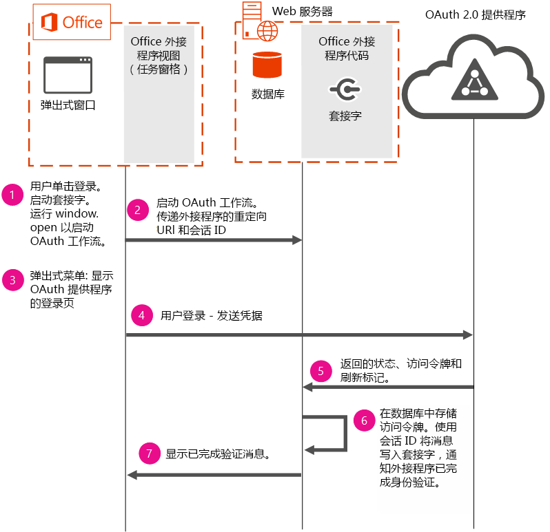

# <a name="use-the-oauth-authorization-framework-in-an-office-add-in"></a><span data-ttu-id="2e8c5-102">在 Office 外接程序中使用 OAuth 授权框架</span><span class="sxs-lookup"><span data-stu-id="2e8c5-102">Use the OAuth authorization framework in an Office Add-in</span></span>

<span data-ttu-id="2e8c5-p101">OAuth 是授权的开放式标准，Office 365、Facebook、Google、SalesForce、LinkedIn 等联机服务提供商用其执行用户身份验证。OAuth 授权框架是 Azure 和 Office 365 中所用的默认授权协议。OAuth 授权框架用于企业（公司）和消费者方案。</span><span class="sxs-lookup"><span data-stu-id="2e8c5-p101">OAuth is the open standard for authorization that online service providers such as Office 365, Facebook, Google, SalesForce, LinkedIn and others use to perform user authentication. The OAuth authorization framework is the default authorization protocol used in Azure and Office 365. The OAuth authorization framework is used in both enterprise (corporate) and consumer scenarios.</span></span>

<span data-ttu-id="2e8c5-106">联机服务提供商可通过 REST 提供公开的公用 API。</span><span class="sxs-lookup"><span data-stu-id="2e8c5-106">Online service providers may provide public APIs exposed via REST.</span></span> <span data-ttu-id="2e8c5-107">开发人员可以使用这些公用 API 在其 Office 外接程序中读取数据或写入数据到联机服务提供商。</span><span class="sxs-lookup"><span data-stu-id="2e8c5-107">Developers can use these public APIs in their Office Add-ins to read or write data to the online service provider.</span></span> <span data-ttu-id="2e8c5-108">将来自联机服务提供商的数据集成在外接程序中会增加它的价值，从而被更多的用户采用。</span><span class="sxs-lookup"><span data-stu-id="2e8c5-108">Integrating data from online service providers in an add-in increases its value, which leads to greater user adoption.</span></span> <span data-ttu-id="2e8c5-109">在外接程序中使用这些 API 时，会要求用户使用 OAuth 授权框架进行身份验证。</span><span class="sxs-lookup"><span data-stu-id="2e8c5-109">When using these APIs in your add-in, users will be required to authenticate using the OAuth authorization framework.</span></span>

<span data-ttu-id="2e8c5-p103">本主题介绍如何在您的外接程序中实施身份验证流程以执行用户身份验证。本主题中包括的代码段采用的是 [Office-Add-in-NodeJS-ServerAuth](https://github.com/OfficeDev/Office-Add-in-NodeJS-ServerAuth) 代码示例。</span><span class="sxs-lookup"><span data-stu-id="2e8c5-p103">This topic describes how to implement an authentication flow in your add-in to perform user authentication. Code segments included in this topic are taken from the [Office-Add-in-NodeJS-ServerAuth](https://github.com/OfficeDev/Office-Add-in-NodeJS-ServerAuth) code sample.</span></span>

> [!NOTE]
> <span data-ttu-id="2e8c5-p104">出于安全考虑，不允许浏览器在 IFrame 中显示登录页。根据您的客户所采用的 Office 版本，特别是基于 Web 的版本，您的外接程序将显示在 IFrame 中。这样需要考虑如何管理身份验证流程。 </span><span class="sxs-lookup"><span data-stu-id="2e8c5-p104">For security reasons, browsers are not allowed to display sign-in pages in an IFrame. Depending on the version of Office that your customers use, most notably web-based versions, your add-in is displayed in an IFrame. This imposes some considerations on how to manage the authentication flow.</span></span> 

<span data-ttu-id="2e8c5-115">下图显示了所需的组件和在您的外接程序中实施身份验证时所发生的事件流。</span><span class="sxs-lookup"><span data-stu-id="2e8c5-115">The following diagram shows the required components and the flow of events that occur when implementing authentication in your add-in.</span></span>



<span data-ttu-id="2e8c5-117">该图显示了如何使用以下所需的组件：</span><span class="sxs-lookup"><span data-stu-id="2e8c5-117">The diagram shows how the following required components are used:</span></span>


- <span data-ttu-id="2e8c5-p105">Office 在用户的计算机上运行任务窗格外接程序。您的外接程序将打开一个可启动身份验证流程的弹出窗口。外接程序不能直接启动身份验证流程，因为根据所使用的平台这些外接程序可能在 IFRAME 中运行。出于安全考虑，OAuth 登录页不显示在 IFRAME 中。</span><span class="sxs-lookup"><span data-stu-id="2e8c5-p105">Office runs a task pane add-in on the user's computer. Your add-in opens a pop-up window to start the authentication flow. Add-ins cannot start authentication flows directly because add-ins, depending on the platform used, may run in an IFRAME. For security reasons, OAuth sign-in pages can't be displayed in an IFRAME.</span></span> 
    
- <span data-ttu-id="2e8c5-p106">Web 服务器托管外接程序的代码。此代码示例使用在 Web 服务器上运行的数据库服务器来存储用户的访问令牌。有必要保持该访问令牌，以便使用弹出窗口完成身份验证后，主要外接程序的页面可以使用相同的令牌访问联机服务中的数据。通过使用服务器端选项保存令牌是必要的，因为您不能依赖于从外接程序或弹出窗口传递的信息。</span><span class="sxs-lookup"><span data-stu-id="2e8c5-p106">A web server hosts your add-in's code. This code sample uses a database server running on the web server to store the user's access token. Persisting the access token is necessary so that after authentication completes using the pop-up window, the main add-in's pages can use the same tokens to access data from the online service. Saving the tokens by using server-side options is necessary because you can't rely on information passed from the add-in or the pop-up.</span></span>
    
- <span data-ttu-id="2e8c5-126">OAuth 2.0 提供程序执行用户身份验证。</span><span class="sxs-lookup"><span data-stu-id="2e8c5-126">The OAuth 2.0 provider performs user authentication.</span></span>
    

    
> [!IMPORTANT]
> <span data-ttu-id="2e8c5-p107">无法将访问令牌返回到任务窗格，但可以在服务器上使用它们。在此代码示例中，访问令牌在数据库中存储时长为 2 分钟。2 分钟之后，数据库中的令牌会被清除，并且系统会提示用户重新进行身份验证。在自身实现中更改此时间段之前，请考虑将访问令牌存储在数据库中的时长超过 2 分钟会带来的相关安全风险。</span><span class="sxs-lookup"><span data-stu-id="2e8c5-p107">Access tokens can't be returned to the task pane, but they can be used on the server. In this code sample, the access tokens are stored in the database for 2 minutes. After 2 minutes, tokens are purged from the database and users are prompted to re-authenticate. Before changing this time period in your own implementation, consider the security risks associated with storing access tokens in a database for a time period that is longer than 2 minutes.</span></span>


## <a name="step-1---start-socket-and-open-a-pop-up-window"></a><span data-ttu-id="2e8c5-131">第 1 步 - 启动套接字并打开弹出窗口</span><span class="sxs-lookup"><span data-stu-id="2e8c5-131">Step 1 - Start socket and open a pop-up window</span></span>

<span data-ttu-id="2e8c5-p108">当您运行此代码示例时，任务窗格外接程序显示在 Office 中。当用户选择要登录到的 OAuth 提供程序时，外接程序首先创建套接字。此示例使用套接字提供良好的外接程序用户体验。外接程序使用套接字与用户沟通身份验证的成功或失败。通过使用套接字，外接程序的主页可轻松地更新身份验证状态，并不需要用户交互或轮询。下面的代码段来自 routes/connect.js，显示了如何启动套接字。套接字使用 **decodedNodeCookie**（外接程序的会话 ID）命名。此代码示例通过使用 [socket.io](https://socket.io/) 创建套接字。</span><span class="sxs-lookup"><span data-stu-id="2e8c5-p108">When you run this code sample, a task pane add-in displays in Office. When the user chooses an OAuth provider to log into, the add-in first creates a socket. This sample uses a socket to provide a good user experience in the add-in. The add-in uses the socket to communicate the success or failure of the authentication to the user. By using a socket, the add-in's main page is easily updated with the authentication status, and doesn't require user interaction or polling. The following code segment, taken from routes/connect.js, shows how to start the socket. The socket is named using  **decodedNodeCookie**, which is the add-in's session ID. This code sample creates the socket by using [socket.io](https://socket.io/).</span></span>


```js
io.on('connection', function (socket) {
  console.log('Socket connection established');
  var jsonCookie =
    cookie.parse(socket
      .handshake
      .headers
      .cookie);
  var decodedNodeCookie =
    cookieParser
      .signedCookie(jsonCookie.nodecookie, '<Insert a random string>');
  console.log('Decoded cookie: ' + decodedNodeCookie);
  // The session ID becomes the room name for this session.
  socket.join(decodedNodeCookie);
  io.to(decodedNodeCookie).emit('init', 'Private socket session established');
});

```

<span data-ttu-id="2e8c5-p109">然后，外接程序连接到套接字。下面的代码可以在 /public/javascripts/client.js 中找到。</span><span class="sxs-lookup"><span data-stu-id="2e8c5-p109">Next, the add-in connects to the socket. The following code can be found in /public/javascripts/client.js.</span></span>


```js
var socket = io.connect('https://localhost:3001', { secure: true });
```

<span data-ttu-id="2e8c5-p110">然后，外接程序使用 **window.open** 打开用户计算机上的弹出窗口。在运行 **window.open** 时，请确保外接程序的重定向 URI 和会话 ID 在 URL 中进行传递。外接程序的会话 ID 用于标识在将身份验证的状态信息发送至外接程序的 UI 时所使用的套接字。可以在 views/index.jade 中找到以下代码段。</span><span class="sxs-lookup"><span data-stu-id="2e8c5-p110">Next, the add-in opens a pop-up window on the user's computer using  **window.open**. When running  **window.open**, ensure the redirect URI and session ID of the add-in is passed in the URL. The session ID of the add-in is used to identify the socket to use when sending authentication status information to the add-in's UI. The following code segment can be found in views/index.jade.</span></span>


```js
onclick="window.open('/connect/azure/#{sessionID}', 'AuthPopup', 'width=500,height=500,centerscreen=1,menubar=0,toolbar=0,location=0,personalbar=0,status=0,titlebar=0,dialog=1')")
```


## <a name="steps-2-amp-3---start-the-authentication-flow-and-show-the-sign-in-page"></a><span data-ttu-id="2e8c5-146">步骤 2 &amp; 3 - 启动身份验证流程和显示登录页</span><span class="sxs-lookup"><span data-stu-id="2e8c5-146">Steps 2 &amp; 3 - Start the authentication flow and show the sign-in page</span></span>

<span data-ttu-id="2e8c5-p111">外接程序必须启动身份验证流程。下面的代码段使用了 Passport OAuth 库。在启动身份验证流程时，请确保传递 OAuth 提供程序的授权 URL 和外接程序的会话 ID。必须将外接程序的会话 ID 传递到状态参数中。弹出窗口现在将显示 OAuth 提供程序的登录页供用户进行登录。</span><span class="sxs-lookup"><span data-stu-id="2e8c5-p111">The add-in must start the authentication flow. The code segment below uses the Passport OAuth library. When starting the authentication flow, ensure that you pass the authorization URL of the OAuth provider, and the session ID of the add-in. The session ID of the add-in must be passed in the state parameter. The pop-up window now displays the OAuth provider's sign-in page so that users can sign in.</span></span>


```js
router.get('/azure/:sessionID', function(req, res, next) { 
   passport.authenticate( 
     'azure',  
     { state: req.params.sessionID }, 

```


## <a name="steps-4-5-amp-6---user-signs-in-and-web-server-receives-tokens"></a><span data-ttu-id="2e8c5-152">步骤 4、5 &amp; 6 - 用户登录和 Web 服务器接收令牌</span><span class="sxs-lookup"><span data-stu-id="2e8c5-152">Steps 4, 5 &amp; 6 - User signs in and web server receives tokens</span></span>

 <span data-ttu-id="2e8c5-p112">成功登录后，访问令牌、刷新令牌和状态参数将被返回到外接程序。状态参数包含会话 ID，用于将身份验证的状态信息发送到步骤 7 中的套接字。以下提取自 app.js 的代码段将访问令牌存储在数据库中。</span><span class="sxs-lookup"><span data-stu-id="2e8c5-p112">After a successful sign-in, an access token, refresh token, and state parameter are returned to the add-in. The state parameter contains the session ID, which is used to send authentication status information to the socket in step 7. The following code segment, taken from app.js, stores the access token in the database.</span></span>


```js
  dbHelperInstance.insertDoc(userData, null, 
         function (err, body) { 
           if (!err) { 
             console.log("Inserted session entry [" + userData.sessid + "] id: " + body.id); 
           } 
           done(err, userData); 
         }); 

```


## <a name="step-7---show-authentication-information-in-the-add-ins-ui"></a><span data-ttu-id="2e8c5-156">步骤 7 - 将身份验证信息显示在外接程序的 UI 中</span><span class="sxs-lookup"><span data-stu-id="2e8c5-156">Step 7 - Show authentication information in the add-in's UI</span></span>

<span data-ttu-id="2e8c5-p113">以下提取自 connect.js 的代码段利用身份验证状态信息更新外接程序的 UI。外接程序的 UI 使用步骤 1 中创建的套接字进行了更新。</span><span class="sxs-lookup"><span data-stu-id="2e8c5-p113">The following code segment, taken from connect.js, updates the add-in's UI with the authentication status information. The add-in's UI is updated by using the socket that was created in step 1.</span></span>


```js
  
       io.to(user.sessid).emit('auth_success', providers); 
       next(); 

```


## <a name="see-also"></a><span data-ttu-id="2e8c5-159">另请参阅</span><span class="sxs-lookup"><span data-stu-id="2e8c5-159">See also</span></span>

- [<span data-ttu-id="2e8c5-160">Node.js 的 Office 加载项服务器身份验证示例</span><span class="sxs-lookup"><span data-stu-id="2e8c5-160">Office Add-in Server Authentication Sample for Node.js</span></span>](https://github.com/OfficeDev/Office-Add-in-Nodejs-ServerAuth/blob/master/README.md)
    
