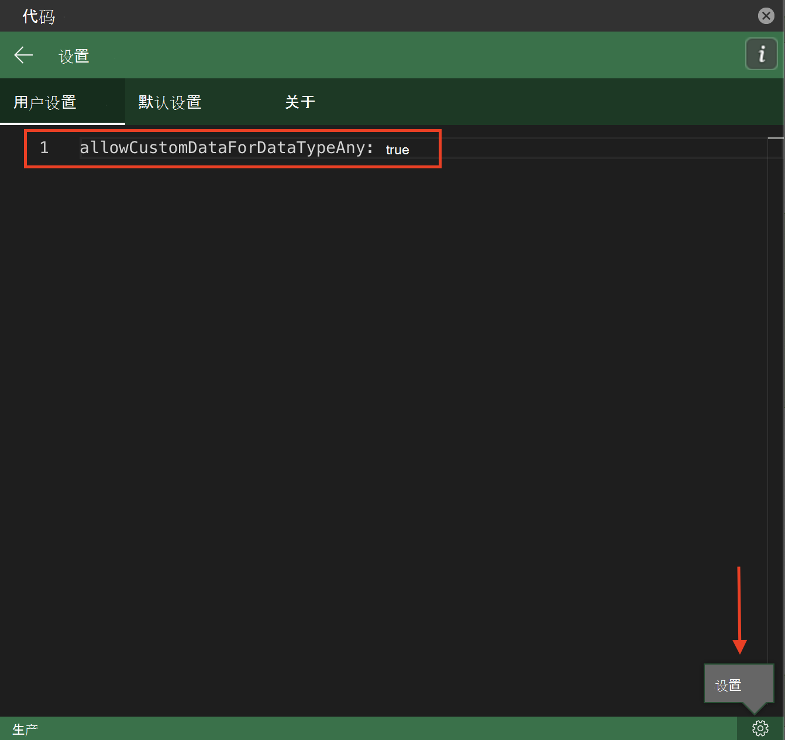

# <a name="use-data-types-with-custom-functions-in-excel-preview"></a>在 Excel 中将数据类型与自定义函数配合使用（预览版）

[!include[Custom functions and data types availability note](../includes/excel-custom-functions-data-types-note.md)]

数据类型扩展了 Excel JavaScript API，以支持原始的四个单元格值类型（字符串、数字、布尔值和错误）以外的数据类型。 数据类型包括支持 Web 图像、带格式数字值、实体值和实体值中的数组。

这些数据类型放大了自定义函数的功能，因为自定义函数接受数据类型作为输入值和输出值。 可以通过自定义函数生成数据类型，或将现有数据类型作为函数参数引入计算。 设置数据类型的 JSON 架构后，将在整个计算中维护此架构。

若要详细了解如何将数据类型与 Excel 外接程序配合使用，请参阅 [Excel 外接程序中的数据类型的概述](excel-data-types-overview.md)。

## <a name="how-custom-functions-handle-data-types"></a>自定义函数如何处理数据类型

自定义函数可以识别数据类型并将它们接受为参数值。 自定义函数可以为返回值创建新的数据类型。 自定义函数对数据类型使用与 Excel JavaScript API 相同的 JSON 架构，此 JSON 架构保留为自定义函数计算和评估。

> [!NOTE]
> 自定义函数不支持数据类型提供的增强型错误对象的完整功能。 自定义函数可以接受数据类型错误对象，但不会在整个计算过程中维护它。 目前，自定义函数仅支持 [CustomFunctions.Error 对象](custom-functions-errors.md)中包含的错误。

## <a name="enable-data-types-for-custom-functions"></a>为自定义函数启用数据类型

若要使用此功能，需要手动更新 JSON 元数据。 若要进行更多临时测试，可以自定义 Script Lab 设置，而不是手动更新 JSON 元数据。 以下各部分更详细地概述了这些步骤。

### <a name="manually-update-json-metadata"></a>手动更新 JSON 元数据

自定义函数项目包括 JSON 元数据文件。 此 JSON 元数据文件不同于数据类型 API 使用的 JSON 架构。 若要将数据类型与自定义函数集成，必须手动更新自定义函数 JSON 元数据文件，以包括属性 `allowCustomDataForDataTypeAny`。 将此属性设置为 `true`。

有关手动 JSON 创建过程的完整说明，请参阅 [为自定义函数手动创建 JSON 元数据](custom-functions-json.md)。有关此属性的其他详细信息，请参阅 [allowCustomDataForDataTypeAny](custom-functions-json.md#allowcustomdatafordatatypeany-preview)。

### <a name="script-lab-option"></a>脚本实验室选项

除了前面部分中所述的手动 JSON 元数据更新外，还可使用脚本实验室测试自定义函数与数据类型的集成。 若要了解详细信息，请参阅[使用 Script Lab 探索 Office JavaScript API](../overview/explore-with-script-lab.md)。 若要使用 Script Lab 测试此功能，请使用以下步骤更新设置。

1. 打开 Script Lab 的 **代码** 任务窗格。
1. 在右下角，选择 **设置** 按钮。
1. 转到 **用户设置** 选项卡，然后输入 `allowCustomDataForDataTypeAny: true`。



## <a name="output-a-formatted-number-value"></a>输出格式化的数字值

下面的代码示例演示如何使用自定义函数创建 [FormattedNumberCellValue](/javascript/api/excel/excel.formattednumbercellvalue) 数据类型。 该函数采用基本数字和格式设置作为输入参数，并返回格式化的数字值数据类型作为输出。

```js
/**
 * Take a number as the input value and return a formatted number value as the output.
 * @customfunction
 * @param {number} value
 * @param {string} format (e.g. "0.00%")
 * @returns A formatted number value.
 */
function createFormattedNumber(value, format) {
    return {
        type: "FormattedNumber",
        basicValue: value,
        numberFormat: format
    }
}
```

## <a name="input-an-entity-value"></a>输入实体值

下面的代码示例演示一个自定义函数，该函数采用 [EntityCellValue](/javascript/api/excel/excel.entitycellvalue) 数据类型作为输入。 如果 `attribute` 参数设置为 `text`，则该函数返回实体值的 `text` 属性。 否则，该函数返回实体值的 `basicValue` 属性。

```js
/**
 * Accept an entity value data type as a function input.
 * @customfunction
 * @param {any} value
 * @param {string} attribute
 * @returns {any} The text value of the entity.
 */
function getEntityAttribute(value, attribute) {
    if (value.type == "Entity") {
        if (attribute == "text") {
            return value.text;
        } else {
            return value.properties[attribute].basicValue;
        }
    } else {
        return JSON.stringify(value);
    }
}
```

## <a name="see-also"></a>另请参阅

* [ Excel 加载项中的数据类型的概述](excel-data-types-overview.md)
* [Excel 数据类型核心概念](excel-data-types-concepts.md)
* [将 Office 外接程序配置为使用共享运行时](../develop/configure-your-add-in-to-use-a-shared-runtime.md)
