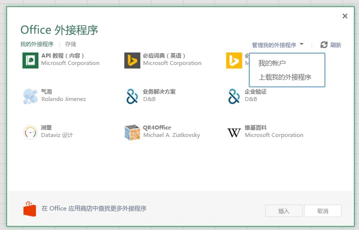
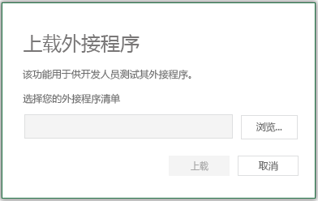

# 自定义函数调试 (预览)

自定义函数的调试可以通过多种方式来完成, 具体取决于您使用的平台。

在 Windows 上:
- [Excel Desktop 和 Visual Studio Code (VS Code) 调试器](#use-the-vs-code-debugger-for-excel-desktop)
- [Excel Online 和 VS 代码调试器](#use-the-vs-code-debugger-for-excel-online-in-microsoft-edge)
- [Excel Online 和浏览器工具](#use-the-browser-developer-tools-to-debug-custom-functions-in-excel-online)
- [命令行](#use-the-command-line-tools-to-debug)

在 Mac 上:
- [Excel Online 和浏览器工具](#use-the-browser-developer-tools-to-debug-custom-functions-in-excel-online)
- [命令行](#use-the-command-line-tools-to-debug)

[!include[Excel custom functions note](../includes/excel-custom-functions-note.md)]

> [!NOTE]
> 为简单起见, 本文介绍了如何在使用 Visual Studio Code 编辑、运行任务以及某些情况下使用调试视图的上下文中进行调试。 如果使用的是其他编辑器或命令行工具, 请参阅本文末尾的[命令行说明](#Use-the-command-line-tools-to-debug)。

## Requirements

开始调试之前, 应使用 Yo Office 生成器创建自定义函数外接程序项目, 并确保您的项目具有受信任的自签名证书。 有关创建项目的说明, 请参阅[自定义函数教程](https://review.docs.microsoft.com/office/dev/add-ins/tutorials/excel-tutorial-create-custom-functions)。 有关信任证书的说明, 请参阅[将自签名证书添加为受信任的根证书](https://github.com/OfficeDev/generator-office/blob/master/src/docs/ssl.md)。

## 对 Excel 桌面使用 VS 代码调试器

您可以使用 VS 代码在桌面上调试 Office Excel 中的自定义函数。

> [!NOTE]
> 对 Mac 的桌面调试不可用, 但可通过[使用浏览器工具来调试 Excel Online](#debug-in-excel-online-by-using-the-browser-developer-tools)来实现。

### 从 VS 代码运行外接程序

1. 打开[VS 代码](https://code.visualstudio.com/)中的自定义函数根项目文件夹。
2. 选择 "**终端 > 运行任务**", 然后键入或选择 "**监视**"。 这将监视和重建任何文件更改。
3. 选择 "**终端 > 运行任务**", 然后键入或选择 " **Dev Server**"。 

### 启动 VS 代码调试器

4. 选择 "**查看 > 调试**" 或输入**Ctrl + Shift + D**以切换到 "调试" 视图。
5. 从 "调试" 选项中, 选择 " **Excel 桌面**"。
6. 选择**F5** (或从菜单中选择 **> 启动调试**) 以开始调试。 将打开一个新的 Excel 工作簿, 您的外接程序已旁加载并可供使用。

### 开始调试

1. 在 VS 代码中, 打开源代码脚本文件 (函数 .js 或函数)。
2. 在自定义函数源代码中[设置断点](https://code.visualstudio.com/Docs/editor/debugging#_breakpoints)。
3. 在 Excel 工作簿中, 输入使用自定义函数的公式。

此时执行将在您设置断点的代码行处停止。 现在, 您可以逐步完成您的代码、设置监视和使用所需的任何与代码调试功能。

## 在 Microsoft Edge 中将 VS 代码调试程序与 Excel Online 一起使用

您可以使用 VS 代码在 Microsoft Edge 浏览器的 Excel Online 中调试自定义函数。 若要将 VS 代码与 microsoft edge 结合使用, 必须[为 microsoft edge](https://marketplace.visualstudio.com/items?itemName=msjsdiag.debugger-for-edge)扩展安装调试器。

### 从 VS 代码运行外接程序

1. 打开[VS 代码](https://code.visualstudio.com/)中的自定义函数根项目文件夹。
2. 选择 "**终端 > 运行任务**", 然后键入或选择 "**监视**"。 这将监视和重建任何文件更改。
3. 选择 "**终端 > 运行任务**", 然后键入或选择 " **Dev Server**"。 

### 启动 VS 代码调试器

4. 选择 "**查看 > 调试**" 或输入**Ctrl + Shift + D**以切换到 "调试" 视图。
5. 从 "调试" 选项中, 选择 " **Office Online (边缘)**"。
6. 使用 Microsoft Edge 浏览器打开 excel online, 打开 excel Online, 并创建新的工作簿。
7. 在功能区中选择 "**共享**", 然后复制此新工作簿的 URL 的链接。
8. 选择**F5** (或从菜单中选择 "**调试" > "启动调试**") 开始调试。 将显示提示, 询问您的文档的 URL。
9. 粘贴到工作簿的 URL 中, 然后按 enter。

### 旁加载加载项   

1. 选择功能区上的 "**插入**" 选项卡, 然后在 "**外接程序**" 部分, 选择 " **Office 外接程序**"。
2. 在“Office 加载项”**** 对话框中，依次选择“我的加载项”**** 选项卡、“管理我的加载项”**** 和“上传我的加载项”****。
    
    

3.  **浏览**到加载项清单文件, 然后选择 "**上传**"。
    
    

### 设置断点
1. 在 VS 代码中, 打开源代码脚本文件 (函数 .js 或函数)。
2. 在自定义函数源代码中[设置断点](https://code.visualstudio.com/Docs/editor/debugging#_breakpoints)。
3. 在 Excel 工作簿中, 输入使用自定义函数的公式。

## 使用浏览器开发人员工具在 Excel Online 中调试自定义函数

您可以使用浏览器开发人员工具在 Excel Online 中调试自定义函数。 以下步骤适用于 Windows 和 macOS。

### 从 Visual Studio Code 运行外接程序

1. 在[Visual Studio Code (VS code)](https://code.visualstudio.com/)中打开您的自定义函数根项目文件夹。
2. 选择 "**终端 > 运行任务**", 然后键入或选择 "**监视**"。 这将监视和重建任何文件更改。
3. 选择 "**终端 > 运行任务**", 然后键入或选择 " **Dev Server**"。 

### 旁加载加载项   

1. 打开 [Microsoft Office Online](https://office.live.com/)。
2. 打开一个新的 Excel 工作簿。
3. 打开功能区上的“**插入**”选项卡，然后在“**外接程序**”部分中，选择“**Office 外接程序**”。
4. 在“Office 加载项”**** 对话框中，依次选择“我的加载项”**** 选项卡、“管理我的加载项”**** 和“上传我的加载项”****。
    
    

5.  **转到**加载项清单文件，再选择“上传”****。
    
    

> [!NOTE]
> 在旁加载文档后, 每次打开文档时它都将保留旁加载。

### 开始调试

1. 在浏览器中打开开发人员工具。 对于 Chrome 和大多数浏览器 F12 将打开开发人员工具。
2. 在开发人员工具中, 使用**Cmd + p**或**Ctrl + p**打开源代码脚本文件 (函数 .js 或函数)。
3. 在自定义函数源代码中[设置断点](https://code.visualstudio.com/Docs/editor/debugging#_breakpoints)。 

如果您需要更改代码, 您可以在 VS 代码中进行编辑并保存所做的更改。 刷新浏览器以查看加载的更改。

## 使用命令行工具进行调试

如果未使用 VS 代码, 则可以使用命令行 (如 bash 或 PowerShell) 运行外接程序。 您需要使用浏览器开发人员工具在 Excel Online 中调试代码。 无法使用命令行调试桌面版本的 Excel。

1. 在命令行中运行`npm run watch` , 以便在发生代码更改时监视和重建。
2. 打开第二个命令行窗口 (运行监视时将阻止第一个命令行窗口。)

3. 如果要在 Excel 的桌面版本中启动外接程序, 请运行以下命令
    
    `npm run start desktop`
    
    或者, 如果您更愿意在 Excel Online 中启动加载项, 请运行以下命令
    
    `npm run start web`
    
    对于 Excel Online, 还需要旁加载您的外接程序。 按照[旁加载您的外接程序](#Sideload-your-add-in)中的步骤, 旁加载你的外接程序。 然后继续转到下一节以开始调试。
    
4. 在浏览器中打开开发人员工具。 对于 Chrome 和大多数浏览器 F12 将打开开发人员工具。
5. 在开发人员工具中, 打开源代码脚本文件 (函数 .js 或函数)。 您的自定义函数代码可能位于文件末尾附近。
6. 在自定义函数源代码中, 通过选择一行代码来应用断点。

如果您需要更改代码, 您可以在 Visual Studio 中进行编辑并保存所做的更改。 刷新浏览器以查看加载的更改。

### 用于生成和运行外接程序的命令

有几个可用的生成任务:
- `npm run watch`: 用于开发的构建, 在保存源文件时自动重建
- `npm run build-dev`: 开发一次开发版本
- `npm run build`: 生产的内部版本
- `npm run dev-server`: 运行用于开发的 web 服务器

您可以使用以下任务在桌面或联机时开始调试。
- `npm run start desktop`: 在桌面上启动 Excel 并将您的外接程序。
- `npm run start web`: 启动 Excel Online 并将您的外接程序。
- `npm run stop`: 停止 Excel 和调试。

## 另请参阅

* [自定义函数元数据](custom-functions-json.md)
* [Excel 自定义函数的运行时](custom-functions-runtime.md)
* [自定义函数最佳实践](custom-functions-best-practices.md)
* [自定义函数更改日志](custom-functions-changelog.md)
* [Excel 自定义函数教程](../tutorials/excel-tutorial-create-custom-functions.md)
