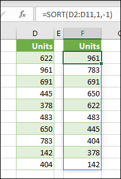

# <a name="return-multiple-results-from-your-custom-function"></a>从自定义函数返回多个结果

可以从自定义函数返回多个结果，这些结果将返回到相邻单元格。 此行为称为溢出。 当自定义函数返回结果数组时，它称为动态数组公式。 有关动态数组公式中Excel，请参阅动态[数组和溢出的数组行为](https://support.microsoft.com/office/205c6b06-03ba-4151-89a1-87a7eb36e531)。

下图显示了函数如何 `SORT` 溢出到相邻单元格。 自定义函数也可以返回如下所示的多个结果。



若要创建作为动态数组公式的自定义函数，它必须返回值的二维数组。 如果结果溢出到已有值的相邻单元格中，则公式将显示 `#SPILL!` 错误。

以下示例演示如何返回向下溢出的动态数组。

```javascript
/**
 * Get text values that spill down.
 * @customfunction
 * @returns {string[][]} A dynamic array with multiple results.
 */
function spillDown() {
  return [['first'], ['second'], ['third']];
}
```

以下示例演示如何返回向右溢出的动态数组。 

```javascript
/**
 * Get text values that spill to the right.
 * @customfunction
 * @returns {string[][]} A dynamic array with multiple results.
 */
function spillRight() {
  return [['first', 'second', 'third']];
}
```

以下示例演示如何返回向下和向右溢出的动态数组。

```javascript
/**
 * Get text values that spill both right and down.
 * @customfunction
 * @returns {string[][]} A dynamic array with multiple results.
 */
function spillRectangle() {
  return [
    ['apples', 1, 'pounds'],
    ['oranges', 3, 'pounds'],
    ['pears', 5, 'crates']
  ];
}
```

## <a name="see-also"></a>另请参阅

- [动态数组和溢出的数组行为](https://support.microsoft.com/office/205c6b06-03ba-4151-89a1-87a7eb36e531)
- [自定义Excel选项](custom-functions-parameter-options.md)