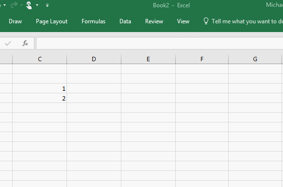

# <a name="create-custom-functions-in-excel-preview"></a>在 Excel 中创建自定义函数（预览）

借助自定义函数（类似于用户定义的函数 (UDF)），开发人员可以使用加载项向 Excel 添加任何 JavaScript 函数。 然后，用户可以在 Excel 中像访问任何其他本机函数（如 =SUM()）那样访问自定义函数。 本文介绍了如何在 Excel 中创建自定义函数。

下面展示了 Excel 中的自定义函数：



下面是将 42 添加到一对数字的自定义函数示例的代码。

```js
function add42 (a, b) {
    return a + b + 42;
}
```

自定义函数（预览）现已可用。 若要试用，请按照以下步骤操作：

1.  加入 [Office 预览体验成员](https://products.office.com/zh-cn/office-insider)计划，在计算机上安装自定义函数所需的 Excel 2016 版本（版本 16.8711 或更高版本）。 必须选择“预览体验成员”渠道，才能使用自定义函数（预览）。
2.  克隆 [Excel-Custom-Functions](https://github.com/OfficeDev/Excel-Custom-Functions) 存储库，并按照 *README.md* 中的说明操作，在 Excel 中启动加载项。
3.  在任意单元格中键入“`=CONTOSO.ADD42(1,2)`”，再按 **Enter** 运行自定义函数。
4.  若有任何疑问，请在 Stack Overflow 上使用 [office-js](https://stackoverflow.com/questions/tagged/office-js) 标签进行提问。

请参阅本文结尾处的“已知问题”部分（随时间推移进行更新），其中介绍了自定义函数的当前限制。

## <a name="learn-the-basics"></a>学习基础知识


在克隆的示例存储库中，将看到以下文件：

-   *customfunctions.js*，其中包含：

    -   要添加到 Excel 的自定义函数代码。
    -   用于将自定义函数连接到 Excel 的注册代码。 注册后，当用户在单元格中进行键入时，自定义函数即可出现在显示的可用函数列表中。
-   *customfunctions.html*，它提供对 *customfunctions.js* 的&lt;脚本&gt;引用。 该文件不在 Excel 中显示 UI。
-   *manifest.xml*，它向 Excel 提供 HTML 的位置以及运行自定义函数所需的 JS 文件。

### <a name="javascript-file-customfunctionsjs"></a>JavaScript 文件 (*customfunctions.js*)

customfunctions.js 中的以下代码声明自定义函数 `add42`，然后在 Excel 中注册此函数。

```js
function add42 (a, b) {
    return a + b + 42;
}

Excel.Script.customFunctions["CONTOSO"]["ADD42"] = {
    call: add42,
    description: "Adds 42 to the sum of two numbers",
    helpUrl: "https://www.contoso.com/help.html",
    result: {
        resultType: Excel.CustomFunctionValueType.number,
        resultDimensionality: Excel.CustomFunctionDimensionality.scalar,
    },
    parameters: [{
        name: "num 1",
        description: "The first number",
        valueType: Excel.CustomFunctionValueType.number,
        valueDimensionality: Excel.CustomFunctionDimensionality.scalar,
    },
    {
        name: "num 2",
        description: "The second number",
        valueType: Excel.CustomFunctionValueType.number,
        valueDimensionality: Excel.CustomFunctionDimensionality.scalar,
    }],
    options:{ batch: false, stream: false }
};

Excel.run(function(ctx) {
    ctx.workbook.customFunctions.addAll();
});
```

**注册**此自定义函数时将使用 `Excel.Script.customFunctions["CONTOSO"]["ADD42"]` 代码块。 在 Excel 中注册此函数时，需要使用以下参数：

-   前缀和函数名称：`Excel.Script.customFunctions` 中的第一个值是前缀（在本示例中，CONTOSO 是前缀）。 `Excel.Script.customFunctions` 中的第二个值是函数名称（在本示例中，ADD42 是函数名称）。 在 Excel 中，前缀和函数名称使用句点分隔：若要使用该自定义函数，请将此函数的前缀 (CONTOSO) 与函数的名称 (ADD42) 组合在一起，然后在单元格中输入 `=CONTOSO.ADD42`。 按照惯例，前缀和函数名称使用大写字母。 前缀将用作加载项的标识符。
-   `call`：定义要调用的 JavaScript 函数（例如，`add42`）。 JavaScript 函数的名称无需与在 Excel 中注册的名称一致。
-   `description`：说明将在 Excel 的自动完成菜单中显示。
-   `helpUrl`：当用户针对某个函数请求帮助时，Excel 将打开任务窗格并显示位于此 URL 的网页。
-   `result`：定义该函数向 Excel 返回的信息的类型。

    -   `resultType`：函数可以返回 `"string"` 或 `"number"`（也适用于日期和币种）。 有关详细信息，请参阅[自定义函数枚举](https://dev.office.com/reference/add-ins/excel/customfunctionsenumerations)。
    -   `resultDimensionality`：函数可以返回单个（`"scalar"`）值或值的`"matrix"`。 返回值的矩阵时，函数返回一个数组，其中每个数组元素均是表示一组值的另一个数组。 有关详细信息，请参阅[自定义函数枚举](https://dev.office.com/reference/add-ins/excel/customfunctionsenumerations) 下面的示例通过自定义函数返回 3 行 2 列的值矩阵。

        ```js
        return [["first","row"],["second","row"],["third","row"]];
        ```

-   自定义函数可以将参数用作输入。 传递到自定义函数的实参在*形参*属性中指定。 定义中的参数顺序必须与 JavaScript 函数中的顺序一致。 每个参数将定义以下属性：

    -   `name`：在 Excel 中显示的字符串，用于表示参数。
    -   `description`：该字符串用于显示参数的详细信息。
    -   `valueType`：`"number"` 或 `"string"`，类似于之前所述的 resultType 属性。
    -   `valueDimensionality`：`"scalar"`值或值的`"matrix"`，类似于之前所述的 resultDimensionality 属性。 借助矩阵类型参数，用户可以选择大于一个单元格的区域。

-   `options`：可启用特殊类型的自定义函数（稍后将在本文进行详细介绍）。

若要使用 `Excel.Script.customFunctions` 完成所有定义的函数的注册，请务必调用 `CustomFunctions.addAll()`。

注册后，用户即可在所有工作簿（不仅是最初运行加载项的工作簿）中使用自定义函数。 当用户开始键入时，这些函数显示在自动完成菜单中。 开发和测试期间，可以删除文件夹 `<user>\AppData\Local\Microsoft\Office\16.0\Wef\CustomFunctions`，从而手动清除计算机的注册元数据缓存。


### <a name="manifest-file-manifestxml"></a>清单文件 (*manifest.xml*)

借助 manifest.xml 中的以下示例，Excel 可以查找函数的代码。

```xml
<VersionOverrides xmlns="http://schemas.microsoft.com/office/taskpaneappversionoverrides" xsi:type="VersionOverridesV1\_0">

    <Hosts>
        <Host xsi:type="Workbook">
            <AllFormFactors>
                <ExtensionPoint xsi:type="CustomFunctions">
                    <Script>
                        <SourceLocation resid="scriptURL" />
                        <!— Required. The Developer Preview does not use the Script element.-->
                    </Script>
                    <Page>
                        <SourceLocation resid="pageURL"/>
                    </Page>
                </ExtensionPoint>
            </AllFormFactors>
        </Host>
    </Hosts>

    <Resources>
        <bt:Urls>
            <bt:Url id="scriptURL" DefaultValue="https://www.contoso.com/addin/customfunctions.js" />
            <bt:Url id="pageURL" DefaultValue="https://www.contoso.com/addin/customfunctions.html" />
        </bt:Urls>
    </Resources>

</VersionOverrides>

```

上述代码指定：

-   `<Script>` 元素，虽然此为必需元素，但开发人员预览版中未使用它。
-   `<Page>` 元素，用于链接到加载项的 HTML 页面。 HTML 页面包含对 JavaScript 文件 (*customfunctions.js*) 的 &lt;Script&gt; 引用，其中包含自定义函数和注册代码。 HTML 页面是一个隐藏页面，始终不会在 UI 中显示。

## <a name="asynchronous-functions"></a>异步函数

如果自定义函数从 Web 检索数据，则需要进行异步调用以进行提取。 调用外部 Web 服务时，自定义函数必须：

1.   将 JavaScript 承诺返回到 Excel。
2.   发出 HTTP 请求，以调用外部服务。
3.   使用 `setResult` 回调解析此承诺。 `setResult` 将值发送给 Excel。

下面的代码显示用于检索温度计温度的自定义函数示例。

```js
function getTemperature(thermometerID){
    return new OfficeExtension.Promise(function(setResult, setError){
        sendWebRequestExample(thermometerID, function(data){
            setResult(data.temperature);
        });
    });
}
```

## <a name="streamed-functions"></a>流式处理函数

借助流式处理自定义函数，可以随时间推移将数据重复输出到单元格，而无需等待 Excel 或用户请求重新计算。 例如，以下代码中的 `incrementValue` 自定义函数会在每一秒内将一个数值添加到结果中，且 Excel 会使用 `setResult` 回调自动显示每个新值。 若要查看与 `incrementValue` 一起使用的注册代码，请阅读 *customfunctions.js* 文件。

```js
function incrementValue(increment, caller){ 
    var result = 0;
    setInterval(function(){
         result += increment;
         caller.setResult(result);
    }, 1000);
}
```

对于流式处理函数，始终不会在注册代码中指定最后一个参数 `caller`，且当用户输入此函数时，该参数不会在 Excel 用户的自动完成菜单中显示。 它是包含`setResult` 回调函数的对象，用于将数据从函数传递到 Excel，以更新单元格值。 若要让 Excel 在 `caller` 对象中传递 `setResult` 函数，必须在函数注册期间将参数 `stream` 设置为 `true`，以声明流式处理支持。

## <a name="cancellation"></a>取消

可以取消流式处理函数和异步函数。 对于减少带宽消耗、工作内存和 CPU 负载，取消函数调用非常重要。 Excel 在以下情况下取消函数调用：
- 用户编辑或删除引用函数的单元格。
- 函数的参数（输入）之一发生变化。 在这种情况下，除了取消之外，还会触发新的函数调用。
- 用户手动触发重新计算。 与上述情况一样，除了取消之外，还会触发新的函数调用。

下面的代码展示了已实现取消的上一个示例。 在此代码中，`caller` 对象包含应为每个自定义函数定义的 `onCanceled` 函数。

```js
function incrementValue(increment, caller){ 
    var result = 0;
    var timer = setInterval(function(){
         result += increment;
         caller.setResult(result);
    }, 1000);

    caller.onCanceled = function(){
        clearInterval(timer);
    }
}
```

## <a name="saving-state"></a>保存状态

自定义函数可以将数据保存在全局 JavaScript 变量中。 在后续调用中，自定义函数可以使用保存在这些变量中的值。 当用户输入同一个自定义函数的多个实例，并且需要与彼此共享数据时，保存状态很有用。 例如，可以保存调用某个 Web 资源时返回的数据，以避免再次调用同一个 Web 资源。

下面的代码展示了使用 `savedTemperatures` 变量保存状态的上一个温度流式处理函数的实现。此代码展示了以下概念：

-   **保存数据。** `refreshTemperature` 是一个流式处理函数，它会在每一秒内读取特定温度计的温度。 新温度将被保存在 savedTemperatures 变量中。

-   **使用保存的数据。** `streamTemperature` 会在每一秒内更新 Excel UI 中显示的温度值。 将从 `savedTemperature` 中读取温度，然后使用 `setResult` 将其发送到 Excel UI。 用户可以从 Excel UI 的多个单元格中调用 `streamTemperature`。 每次调用 `streamTemperature` 时都将读取 `savedTemperatures` 中的数据。

> 在本示例中，我们将 `streamTemperature` 注册为 Excel 中的自定义函数。

```js
var savedTemperatures{};

function streamTemperature(thermometerID, caller){ 
     if(!savedTemperatures[thermometerID]){
         refreshTemperatures(thermometerID);
     }

     function getNextTemperature(){
         caller.setResult(savedTemperatures[thermometerID]); // setResult sends the saved temperature value to Excel.
         setTimeout(getNextTemperature, 1000); // Wait 1 second before updating Excel again.
     }
     getNextTemperature();
}

function refreshTemperature(thermometerID){
     sendWebRequestExample(thermometerID, function(data){
         savedTemperatures[thermometerID] = data.temperature;
     });
     setTimeout(function(){
         refreshTemperature(thermometerID);
     }, 1000); // Wait 1 second before reading the thermometer again, and then update the saved temperature of thermometerID.
}
```

## <a name="working-with-ranges-of-data"></a>使用数据区域

自定义函数可以将数据区域用作参数，或者可以从自定义函数返回数据区域。

例如，假设函数从 Excel 中存储的温度值区域返回第二个最高温度。 以下函数需要使用参数 `temperatures`，即 `Excel.CustomFunctionDimensionality.matrix` 参数类型。

```js
function secondHighestTemp(temperatures){ 
     var highest = -273, secondHighest = -273;
     for(var i = 0; i < temperatures.length; i++){
         for(var j = 0; j < temperatures[i].length; j++){
             if(temperatures[i][j] <= highest){
                 secondHighest = highest;
                 highest = temperatures[i][j];
             }
             else if(temperatures[i][j] <= secondHighest){
                 secondHighest = temperatures[i][j];
             }
         }
     }
     return secondHighest;
 }
```

如果创建返回数据范围的函数，需要在 Excel 中输入数组公式，以查看整个值范围。 有关详细信息，请参阅[数组公式准则和示例](https://support.office.com/zh-cn/article/Guidelines-and-examples-of-array-formulas-7d94a64e-3ff3-4686-9372-ecfd5caa57c7)。

## <a name="known-issues"></a>已知问题

开发者预览版中尚不支持以下功能。

-   为提升性能，支持聚合对相同函数的多次调用的批处理。

-   Excel 暂未使用帮助 URL 和参数说明。

-   将使用自定义函数的加载项发布到 AppSource，或通过 Office 365 进行集中部署。

-   自定义函数不适用于 Mac 上的 Excel、Excel for iOS 和 Excel Online。

-   目前，加载项依赖隐藏的浏览器进程来运行自定义函数。 将来，JavaScript 将直接在某些平台上运行，以确保自定义函数运行速度更快并占用更少的内存。 此外，大多数平台将不再需要清单的 &lt;Page&gt; 元素所引用的 HTML 页面，因为 Excel 将直接运行 JavaScript。 若要为这一更改做准备，请确保自定义函数未使用网页 DOM。

## <a name="changelog"></a>更改日志

- **2017 年 11 月 7 日**：发布了自定义函数（预览）和示例
- **2017 年 11 月 20 日**：修复了使用内部版本 8801 及更高版本的函数的兼容性问题
- **2017 年 11 月 28 日**：发布了对取消异步函数的支持（需要对流式处理函数进行相应更改）
