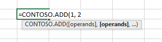

# <a name="custom-functions-parameter-options"></a><span data-ttu-id="9ef77-103">自定义函数参数选项</span><span class="sxs-lookup"><span data-stu-id="9ef77-103">Custom functions parameter options</span></span>

<span data-ttu-id="9ef77-104">可以使用许多不同的参数选项配置自定义函数。</span><span class="sxs-lookup"><span data-stu-id="9ef77-104">Custom functions are configurable with many different parameter options.</span></span>

[!include[Excel custom functions note](../includes/excel-custom-functions-note.md)]

## <a name="optional-parameters"></a><span data-ttu-id="9ef77-105">可选参数</span><span class="sxs-lookup"><span data-stu-id="9ef77-105">Optional parameters</span></span>

<span data-ttu-id="9ef77-106">当用户在 Excel 中调用函数时，可选参数将显示在括号中。</span><span class="sxs-lookup"><span data-stu-id="9ef77-106">When a user invokes a function in Excel, optional parameters appear in brackets.</span></span> <span data-ttu-id="9ef77-107">在下面的示例中，add 函数可以选择添加第三个数字。</span><span class="sxs-lookup"><span data-stu-id="9ef77-107">In the following sample, the add function can optionally add a third number.</span></span> <span data-ttu-id="9ef77-108">在 Excel 中，此函数显示为 `=CONTOSO.ADD(first, second, [third])` 。</span><span class="sxs-lookup"><span data-stu-id="9ef77-108">This function appears as `=CONTOSO.ADD(first, second, [third])` in Excel.</span></span>

#### <a name="javascript"></a>[<span data-ttu-id="9ef77-109">JavaScript</span><span class="sxs-lookup"><span data-stu-id="9ef77-109">JavaScript</span></span>](#tab/javascript)

```js
/**
 * Calculates the sum of the specified numbers
 * @customfunction
 * @param {number} first First number.
 * @param {number} second Second number.
 * @param {number} [third] Third number to add. If omitted, third = 0.
 * @returns {number} The sum of the numbers.
 */
function add(first, second, third) {
  if (third === null) {
    third = 0;
  }
  return first + second + third;
}
```

#### <a name="typescript"></a>[<span data-ttu-id="9ef77-110">TypeScript</span><span class="sxs-lookup"><span data-stu-id="9ef77-110">TypeScript</span></span>](#tab/typescript)

```typescript
/**
 * Calculates the sum of the specified numbers
 * @customfunction
 * @param first First number.
 * @param second Second number.
 * @param [third] Third number to add. If omitted, third = 0.
 * @returns The sum of the numbers.
 */
function add(first: number, second: number, third?: number): number {
  if (third === null) {
    third = 0;
  }
  return first + second + third;
}
```

---

> [!NOTE]
> <span data-ttu-id="9ef77-111">如果没有为可选参数指定任何值，则 Excel 会为其分配值 `null` 。</span><span class="sxs-lookup"><span data-stu-id="9ef77-111">When no value is specified for an optional parameter, Excel assigns it the value `null`.</span></span> <span data-ttu-id="9ef77-112">这意味着 TypeScript 中的默认初始化参数不会按预期工作。</span><span class="sxs-lookup"><span data-stu-id="9ef77-112">This means default-initialized parameters in TypeScript will not work as expected.</span></span> <span data-ttu-id="9ef77-113">请勿使用语法， `function add(first:number, second:number, third=0):number` 因为它不会初始化 `third` 为0。</span><span class="sxs-lookup"><span data-stu-id="9ef77-113">Don't use the syntax `function add(first:number, second:number, third=0):number` because it will not initialize `third` to 0.</span></span> <span data-ttu-id="9ef77-114">而是使用上一示例中所示的 TypeScript 语法。</span><span class="sxs-lookup"><span data-stu-id="9ef77-114">Instead use the TypeScript syntax as shown in the previous example.</span></span>

<span data-ttu-id="9ef77-115">在定义包含一个或多个可选参数的函数时，请指定可选参数为 null 时将发生的情况。</span><span class="sxs-lookup"><span data-stu-id="9ef77-115">When you define a function that contains one or more optional parameters, specify what happens when the optional parameters are null.</span></span> <span data-ttu-id="9ef77-116">在以下示例中，`zipCode` 和 `dayOfWeek` 都是 `getWeatherReport` 函数的可选参数。</span><span class="sxs-lookup"><span data-stu-id="9ef77-116">In the following example, `zipCode` and `dayOfWeek` are both optional parameters for the `getWeatherReport` function.</span></span> <span data-ttu-id="9ef77-117">如果 `zipCode` 参数为 null，则默认值设置为 `98052` 。</span><span class="sxs-lookup"><span data-stu-id="9ef77-117">If the `zipCode` parameter is null, the default value is set to `98052`.</span></span> <span data-ttu-id="9ef77-118">如果 `dayOfWeek` 参数为 null，则将其设置为星期三。</span><span class="sxs-lookup"><span data-stu-id="9ef77-118">If the `dayOfWeek` parameter is null, it's set to Wednesday.</span></span>

#### <a name="javascript"></a>[<span data-ttu-id="9ef77-119">JavaScript</span><span class="sxs-lookup"><span data-stu-id="9ef77-119">JavaScript</span></span>](#tab/javascript)

```js
/**
 * Gets a weather report for a specified zipCode and dayOfWeek
 * @customfunction
 * @param {number} [zipCode] Zip code. If omitted, zipCode = 98052.
 * @param {string} [dayOfWeek] Day of the week. If omitted, dayOfWeek = Wednesday.
 * @returns {string} Weather report for the day of the week in that zip code.
 */
function getWeatherReport(zipCode, dayOfWeek) {
  if (zipCode === null) {
    zipCode = 98052;
  }

  if (dayOfWeek === null) {
    dayOfWeek = "Wednesday";
  }

  // Get weather report for specified zipCode and dayOfWeek.
  // ...
}
```

#### <a name="typescript"></a>[<span data-ttu-id="9ef77-120">TypeScript</span><span class="sxs-lookup"><span data-stu-id="9ef77-120">TypeScript</span></span>](#tab/typescript)

```typescript
/**
 * Gets a weather report for a specified zipCode and dayOfWeek
 * @customfunction
 * @param zipCode Zip code. If omitted, zipCode = 98052.
 * @param [dayOfWeek] Day of the week. If omitted, dayOfWeek = Wednesday.
 * @returns Weather report for the day of the week in that zip code.
 */
function getWeatherReport(zipCode?: number, dayOfWeek?: string): string {
  if (zipCode === null) {
    zipCode = 98052;
  }

  if (dayOfWeek === null) {
    dayOfWeek = "Wednesday";
  }

  // Get weather report for specified zipCode and dayOfWeek.
  // ...
}
```

---

## <a name="range-parameters"></a><span data-ttu-id="9ef77-121">范围参数</span><span class="sxs-lookup"><span data-stu-id="9ef77-121">Range parameters</span></span>

<span data-ttu-id="9ef77-122">您的自定义函数可能接受作为输入参数的单元格数据的范围。</span><span class="sxs-lookup"><span data-stu-id="9ef77-122">Your custom function may accept a range of cell data as an input parameter.</span></span> <span data-ttu-id="9ef77-123">函数还可以返回数据区域。</span><span class="sxs-lookup"><span data-stu-id="9ef77-123">A function can also return a range of data.</span></span> <span data-ttu-id="9ef77-124">Excel 将一个区域的单元格数据作为二维数组进行传递。</span><span class="sxs-lookup"><span data-stu-id="9ef77-124">Excel will pass a range of cell data as a two-dimensional array.</span></span>

<span data-ttu-id="9ef77-125">例如，假设函数从 Excel 中存储的数字区域返回第二个最高值。</span><span class="sxs-lookup"><span data-stu-id="9ef77-125">For example, suppose that your function returns the second highest value from a range of numbers stored in Excel.</span></span> <span data-ttu-id="9ef77-126">下面的函数接受参数 `values`，即 `Excel.CustomFunctionDimensionality.matrix` 类型。</span><span class="sxs-lookup"><span data-stu-id="9ef77-126">The following function accepts the parameter `values`, which is of type `Excel.CustomFunctionDimensionality.matrix`.</span></span> <span data-ttu-id="9ef77-127">请注意，在此函数的 JSON 元数据中，该参数的 `type` 属性设置为 `matrix` 。</span><span class="sxs-lookup"><span data-stu-id="9ef77-127">Note that in the JSON metadata for this function, the parameter's `type` property is set to `matrix`.</span></span>

```js
/**
 * Returns the second highest value in a matrixed range of values.
 * @customfunction
 * @param {number[][]} values Multiple ranges of values.
 */
function secondHighest(values) {
  let highest = values[0][0],
    secondHighest = values[0][0];
  for (var i = 0; i < values.length; i++) {
    for (var j = 0; j < values[i].length; j++) {
      if (values[i][j] >= highest) {
        secondHighest = highest;
        highest = values[i][j];
      } else if (values[i][j] >= secondHighest) {
        secondHighest = values[i][j];
      }
    }
  }
  return secondHighest;
}
```

## <a name="repeating-parameters"></a><span data-ttu-id="9ef77-128">重复参数</span><span class="sxs-lookup"><span data-stu-id="9ef77-128">Repeating parameters</span></span>

<span data-ttu-id="9ef77-129">重复参数允许用户输入函数的一系列可选参数。</span><span class="sxs-lookup"><span data-stu-id="9ef77-129">A repeating parameter allows a user to enter a series of optional arguments to a function.</span></span> <span data-ttu-id="9ef77-130">调用函数时，将在参数的数组中提供值。</span><span class="sxs-lookup"><span data-stu-id="9ef77-130">When the function is called, the values are provided in an array for the parameter.</span></span> <span data-ttu-id="9ef77-131">如果参数名称以数字结尾，则每个参数的数目都将以增量方式增加，例如 `ADD(number1, [number2], [number3],…)` 。</span><span class="sxs-lookup"><span data-stu-id="9ef77-131">If the parameter name ends with a number, each argument's number will increase incrementally, such as `ADD(number1, [number2], [number3],…)`.</span></span> <span data-ttu-id="9ef77-132">这与用于内置 Excel 函数的约定相匹配。</span><span class="sxs-lookup"><span data-stu-id="9ef77-132">This matches the convention used for built-in Excel functions.</span></span>

<span data-ttu-id="9ef77-133">下面的函数汇总了数字、单元格地址和区域的总和（如果已输入）。</span><span class="sxs-lookup"><span data-stu-id="9ef77-133">The following function sums the total of numbers, cell addresses, as well as ranges, if entered.</span></span>

```TS
/**
* The sum of all of the numbers.
* @customfunction
* @param operands A number (such as 1 or 3.1415), a cell address (such as A1 or $E$11), or a range of cell addresses (such as B3:F12)
*/

function ADD(operands: number[][][]): number {
  let total: number = 0;

  operands.forEach(range => {
    range.forEach(row => {
      row.forEach(num => {
        total += num;
      });
    });
  });

  return total;
}
```

<span data-ttu-id="9ef77-134">此函数显示 `=CONTOSO.ADD([operands], [operands]...)` 在 Excel 工作簿中。</span><span class="sxs-lookup"><span data-stu-id="9ef77-134">This function shows `=CONTOSO.ADD([operands], [operands]...)` in the Excel workbook.</span></span>



### <a name="repeating-single-value-parameter"></a><span data-ttu-id="9ef77-135">重复单个值参数</span><span class="sxs-lookup"><span data-stu-id="9ef77-135">Repeating single value parameter</span></span>

<span data-ttu-id="9ef77-136">一个重复的单值参数允许传递多个单个值。</span><span class="sxs-lookup"><span data-stu-id="9ef77-136">A repeating single value parameter allows multiple single values to be passed.</span></span> <span data-ttu-id="9ef77-137">例如，用户可以输入 ADD (1，B2，3) 。</span><span class="sxs-lookup"><span data-stu-id="9ef77-137">For example, the user could enter ADD(1,B2,3).</span></span> <span data-ttu-id="9ef77-138">下面的示例演示如何声明单个值参数。</span><span class="sxs-lookup"><span data-stu-id="9ef77-138">The following sample shows how to declare a single value parameter.</span></span>

```JS
/**
 * @customfunction
 * @param {number[]} singleValue An array of numbers that are repeating parameters.
 */
function addSingleValue(singleValue) {
  let total = 0;
  singleValue.forEach(value => {
    total += value;
  })

  return total;
}
```

### <a name="single-range-parameter"></a><span data-ttu-id="9ef77-139">单个范围参数</span><span class="sxs-lookup"><span data-stu-id="9ef77-139">Single range parameter</span></span>

<span data-ttu-id="9ef77-140">从技术上讲，单个 range 参数不是重复参数，但此处包含此参数，这是因为声明与重复参数非常相似。</span><span class="sxs-lookup"><span data-stu-id="9ef77-140">A single range parameter isn't technically a repeating parameter, but is included here because the declaration is very similar to repeating parameters.</span></span> <span data-ttu-id="9ef77-141">在从 Excel 中传递单个范围的情况下，会向用户显示 "添加 (A2： B3) "。</span><span class="sxs-lookup"><span data-stu-id="9ef77-141">It would appear to the user as ADD(A2:B3) where a single range is passed from Excel.</span></span> <span data-ttu-id="9ef77-142">下面的示例展示了如何声明一个 range 参数。</span><span class="sxs-lookup"><span data-stu-id="9ef77-142">The following sample shows how to declare a single range parameter.</span></span>

```JS
/**
 * @customfunction
 * @param {number[][]} singleRange
 */
function addSingleRange(singleRange) {
  let total = 0;
  singleRange.forEach(setOfSingleValues => {
    setOfSingleValues.forEach(value => {
      total += value;
    })
  })
  return total;
}
```

### <a name="repeating-range-parameter"></a><span data-ttu-id="9ef77-143">重复区域参数</span><span class="sxs-lookup"><span data-stu-id="9ef77-143">Repeating range parameter</span></span>

<span data-ttu-id="9ef77-144">重复区域参数允许传递多个区域或数字。</span><span class="sxs-lookup"><span data-stu-id="9ef77-144">A repeating range parameter allows multiple ranges or numbers to be passed.</span></span> <span data-ttu-id="9ef77-145">例如，用户可以输入 ADD (5，B2，C3，8，E5： E8) 。</span><span class="sxs-lookup"><span data-stu-id="9ef77-145">For example, the user could enter ADD(5,B2,C3,8,E5:E8).</span></span> <span data-ttu-id="9ef77-146">重复区域通常是使用类型为三维矩阵的类型指定的 `number[][][]` 。</span><span class="sxs-lookup"><span data-stu-id="9ef77-146">Repeating ranges are usually specified with the type `number[][][]` as they are three-dimensional matrices.</span></span> <span data-ttu-id="9ef77-147">有关示例，请参阅为重复参数列出的主要示例 ( # # 重复参数) 。</span><span class="sxs-lookup"><span data-stu-id="9ef77-147">For a sample, see the main sample listed for repeating parameters(#repeating-parameters).</span></span>


### <a name="declaring-repeating-parameters"></a><span data-ttu-id="9ef77-148">声明重复参数</span><span class="sxs-lookup"><span data-stu-id="9ef77-148">Declaring repeating parameters</span></span>
<span data-ttu-id="9ef77-149">在 Typescript 中，指示参数是多维的。</span><span class="sxs-lookup"><span data-stu-id="9ef77-149">In Typescript, indicate that the parameter is multi-dimensional.</span></span> <span data-ttu-id="9ef77-150">例如，  `ADD(values: number[])` 将指示一维数组， `ADD(values:number[][])` 指示二维数组，依此类推。</span><span class="sxs-lookup"><span data-stu-id="9ef77-150">For example,  `ADD(values: number[])` would indicate a one-dimensional array, `ADD(values:number[][])` would indicate a two-dimensional array, and so on.</span></span>

<span data-ttu-id="9ef77-151">在 JavaScript 中，对于二维数组使用 `@param values {number[]}` 一维数组，对 `@param <name> {number[][]}` 更多维度使用。</span><span class="sxs-lookup"><span data-stu-id="9ef77-151">In JavaScript, use `@param values {number[]}` for one-dimensional arrays, `@param <name> {number[][]}` for two-dimensional arrays, and so on for more dimensions.</span></span>

<span data-ttu-id="9ef77-152">对于 "手动创作的 JSON"，请确保 `"repeating": true` 在 json 文件中将参数指定为，并检查参数是否标记为 `"dimensionality": matrix` 。</span><span class="sxs-lookup"><span data-stu-id="9ef77-152">For hand-authored JSON, ensure your parameter is specified as `"repeating": true` in your JSON file, as well as check that your parameters are marked as `"dimensionality": matrix`.</span></span>

## <a name="invocation-parameter"></a><span data-ttu-id="9ef77-153">调用参数</span><span class="sxs-lookup"><span data-stu-id="9ef77-153">Invocation parameter</span></span>

<span data-ttu-id="9ef77-154">每个自定义函数自动传递一个 `invocation` 参数作为最后一个参数。</span><span class="sxs-lookup"><span data-stu-id="9ef77-154">Every custom function is automatically passed an `invocation` argument as the last argument.</span></span> <span data-ttu-id="9ef77-155">此参数可用于检索其他上下文，如调用单元格的地址。</span><span class="sxs-lookup"><span data-stu-id="9ef77-155">This argument can be used to retrieve additional context, such as the address of the calling cell.</span></span> <span data-ttu-id="9ef77-156">也可以用于向 Excel 发送信息，例如用于 [取消函数](custom-functions-web-reqs.md#make-a-streaming-function)的函数处理程序。</span><span class="sxs-lookup"><span data-stu-id="9ef77-156">Or it can be used to send information to Excel, such as a function handler for [canceling a function](custom-functions-web-reqs.md#make-a-streaming-function).</span></span> <span data-ttu-id="9ef77-157">即使不声明参数，您的自定义函数也有此参数。</span><span class="sxs-lookup"><span data-stu-id="9ef77-157">Even if you declare no parameters, your custom function has this parameter.</span></span> <span data-ttu-id="9ef77-158">在 Excel 中，用户不会看到此参数。</span><span class="sxs-lookup"><span data-stu-id="9ef77-158">This argument doesn't appear for a user in Excel.</span></span> <span data-ttu-id="9ef77-159">如果要 `invocation` 在自定义函数中使用，则将其声明为最后一个参数。</span><span class="sxs-lookup"><span data-stu-id="9ef77-159">If you want to use `invocation` in your custom function, declare it as the last parameter.</span></span>

<span data-ttu-id="9ef77-160">在下面的代码示例中，将 `invocation` 显式声明上下文以供参考。</span><span class="sxs-lookup"><span data-stu-id="9ef77-160">In the following code sample, the `invocation` context is explicitly stated for your reference.</span></span>

```js
/**
 * Add two numbers.
 * @customfunction
 * @param {number} first First number.
 * @param {number} second Second number.
 * @returns {number} The sum of the two (or optionally three) numbers.
 */
function add(first, second, invocation) {
  return first + second;
}
```

## <a name="next-steps"></a><span data-ttu-id="9ef77-161">后续步骤</span><span class="sxs-lookup"><span data-stu-id="9ef77-161">Next steps</span></span>

<span data-ttu-id="9ef77-162">了解如何 [在自定义函数中使用可变值](custom-functions-volatile.md)。</span><span class="sxs-lookup"><span data-stu-id="9ef77-162">Learn how to use [volatile values in your custom functions](custom-functions-volatile.md).</span></span>

## <a name="see-also"></a><span data-ttu-id="9ef77-163">另请参阅</span><span class="sxs-lookup"><span data-stu-id="9ef77-163">See also</span></span>

* [<span data-ttu-id="9ef77-164">使用自定义函数接收和处理数据</span><span class="sxs-lookup"><span data-stu-id="9ef77-164">Receive and handle data with custom functions</span></span>](custom-functions-web-reqs.md)
* [<span data-ttu-id="9ef77-165">为自定义函数自动生成 JSON 元数据</span><span class="sxs-lookup"><span data-stu-id="9ef77-165">Autogenerate JSON metadata for custom functions</span></span>](custom-functions-json-autogeneration.md)
* [<span data-ttu-id="9ef77-166">手动创建自定义函数的 JSON 元数据</span><span class="sxs-lookup"><span data-stu-id="9ef77-166">Manually create JSON metadata for custom functions</span></span>](custom-functions-json.md)
* [<span data-ttu-id="9ef77-167">在 Excel 中创建自定义函数</span><span class="sxs-lookup"><span data-stu-id="9ef77-167">Create custom functions in Excel</span></span>](custom-functions-overview.md)
* [<span data-ttu-id="9ef77-168">Excel 自定义函数教程</span><span class="sxs-lookup"><span data-stu-id="9ef77-168">Excel custom functions tutorial</span></span>](../tutorials/excel-tutorial-create-custom-functions.md)
