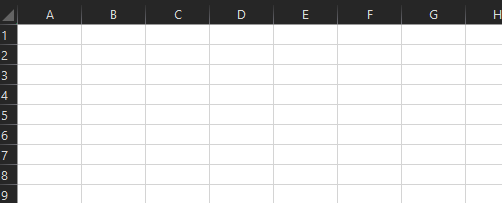

# <a name="volatile-values-in-functions"></a>函数中的可变值

可变函数是每次计算单元格时值更改的函数。 即使函数的参数都未更改，值也可以更改。 每当 Excel 重新计算时，这些函数即会重新计算。 例如，假设某个单元格调用函数 `NOW`。 每当调用 `NOW` 时，它将自动返回当前的日期和时间。

[!include[Excel custom functions note](../includes/excel-custom-functions-note.md)]

Excel 包含多个内置可变函数，例如 `RAND` 和 `TODAY`。 有关 Excel 可变函数的完整列表，请参阅[可变函数和非可变函数](/office/client-developer/excel/excel-recalculation#volatile-and-non-volatile-functions)。

自定义函数允许您创建自己的可变函数，在处理日期、时间、随机数字和建模时，这些函数可能很有用。 例如， [为确定最佳解决方案，将要求](https://en.wikipedia.org/wiki/Monte_Carlo_method) 生成随机输入。

如果选择自动生成 JSON 文件，请声明具有 JSDoc 注释标记的可变函数 `@volatile` 。 有关自动生成的信息，请参阅自动生成 [自定义函数的 JSON 元数据](custom-functions-json-autogeneration.md)。

以下是一个可变自定义函数的示例，该函数模拟滚动六面切纸。



```JS
/**
 * Simulates rolling a 6-sided dice.
 * @customfunction
 * @volatile
 */
function roll6sided() {
  return Math.floor(Math.random() * 6) + 1;
}
```

## <a name="next-steps"></a>后续步骤
* 了解自定义 [函数参数选项](custom-functions-parameter-options.md)。

## <a name="see-also"></a>另请参阅

* [手动为自定义函数创建 JSON 元数据](custom-functions-json.md)
* [在 Excel 中创建自定义函数](custom-functions-overview.md)
