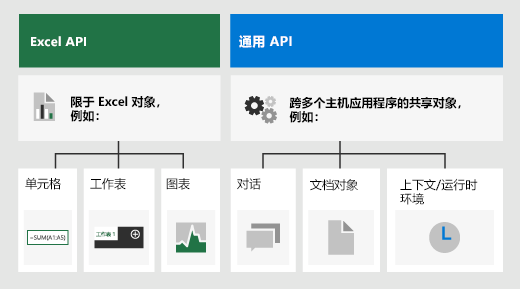

# <a name="advanced-programming-concepts-with-the-excel-javascript-api"></a>Excel JavaScript API 高级编程概念

本文构建于 [Excel JavaScript API 基本编程概念](excel-add-ins-core-concepts.md)中的信息之上，介绍了生成适用于 Excel 2016 或更高版本的复杂加载项所必需的一些更高级的概念。

## <a name="officejs-apis-for-excel"></a>适用于 Excel 的 Office.js API

Excel 加载项通过使用适 Office JavaScript API 与 Excel 中的对象进行交互，JavaScript API包括两个 JavaScript 对象模型：

* **Excel JavaScript API**：[Excel JavaScript API](../reference/overview/excel-add-ins-reference-overview.md) 随 Office 2016 一起引入，提供了强类型的对象，可用于访问工作表、区域、表格、图表等。

* **通用 API**：[通用 API](/javascript/api/office) 随 Office 2013 引入，可用于访问多种类型的 Office 应用程序中常见的 UI、对话框和客户端设置等功能。

你可能会使用 Excel JavaScript API 开发面向 Excel 2016 或更高版本的加载项中的大部分功能，同时还可以使用通用 API 中的对象。 例如：

- [Context](/javascript/api/office/office.context): The `Context` object represents the runtime environment of the add-in and provides access to key objects of the API. It consists of workbook configuration details such as `contentLanguage` and `officeTheme` and also provides information about the add-in's runtime environment such as `host` and `platform`. Additionally, it provides the `requirements.isSetSupported()` method, which you can use to check whether the specified requirement set is supported by the Excel application where the add-in is running.

- [Document](/javascript/api/office/office.document)：`Document` 对象提供 `getFileAsync()` 方法，用于下载运行加载项的 Excel 文件。

下图说明了可能使用 Excel JavaScript API 或公共 API 的情况。



## <a name="requirement-sets"></a>要求集

Requirement sets are named groups of API members. An Office Add-in can perform a runtime check or use requirement sets specified in the manifest to determine whether an Office host supports the APIs that the add-in needs. To identify the specific requirement sets that are available on each supported platform, see [Excel JavaScript API requirement sets](../reference/requirement-sets/excel-api-requirement-sets.md).

### <a name="checking-for-requirement-set-support-at-runtime"></a>在运行时检查要求集支持

以下代码示例显示如何确定运行加载项的主机应用程序是否支持指定的 API 要求集。

```js
if (Office.context.requirements.isSetSupported('ExcelApi', '1.3')) {
  /// perform actions
}
else {
  /// provide alternate flow/logic
}
```

### <a name="defining-requirement-set-support-in-the-manifest"></a>在清单中定义要求集支持

可以在加载项清单中使用[要求元素](../reference/manifest/requirements.md)指定加载项要求激活的最小要求集和/或 API 方法。 如果 Office 主机或平台不支持清单的 `Requirements` 元素中指定的要求集或 API 方法，该加载项不会在该主机或平台中运行，而且不会显示在“我的加载项”**** 中显示的加载项列表中。

以下代码示例显示加载项清单中的 `Requirements` 元素，该元素指定应在支持 ExcelApi 要求集版本 1.3 或更高版本的所有 Office 主机应用程序中加载该加载项。

```xml
<Requirements>
   <Sets DefaultMinVersion="1.3">
      <Set Name="ExcelApi" MinVersion="1.3"/>
   </Sets>
</Requirements>
```

> [!NOTE]
> 为了让加载项适用于 Office 主机的所有平台（如 Excel 网页版、Windows 版 Excel 和 iPad 版 Excel），建议在运行时检查是否有要求支持，而不是在清单中定义要求集支持。

### <a name="requirement-sets-for-the-officejs-common-api"></a>Office.js 通用 API 的要求集

若要了解通用 API 要求集，请参阅 [Office 通用 API 要求集](../reference/requirement-sets/office-add-in-requirement-sets.md)。

## <a name="loading-the-properties-of-an-object"></a>加载对象的属性

Calling the `load()` method on an Excel JavaScript object instructs the API to load the object into JavaScript memory when the `sync()` method runs. The `load()` method accepts a string that contains comma-delimited names of properties to load or an object that specifies properties to load, pagination options, etc.

### <a name="method-details"></a>方法的详细信息

#### `load(propertyNames?: string | string[])`

将命令加入队列以加载对象的指定属性。 阅读属性前必须先调用 `context.sync()`。

#### <a name="syntax"></a>语法

```js
object.load(param);
```

#### <a name="parameters"></a>参数

|**参数**|**类型**|**说明**|
|:------------|:-------|:----------|
|`propertyNames`|object|可选。 接受用逗号分隔的字符串或数组形式的属性名称。|

#### <a name="returns"></a>返回

void

#### <a name="example"></a>示例

The following code sample sets the properties of one Excel range by copying the properties of another range. Note that the source object must be loaded first, before its property values can be accessed and written to the target range. This example assumes that there is data the two ranges (**B2:E2** and **B7:E7**) and that the two ranges are initially formatted differently.

```js
Excel.run(function (ctx) {
    var sheet = ctx.workbook.worksheets.getItem("Sample");
    var sourceRange = sheet.getRange("B2:E2");
    sourceRange.load("format/fill/color, format/font/name, format/font/color");

    return ctx.sync()
        .then(function () {
            var targetRange = sheet.getRange("B7:E7");
            targetRange.set(sourceRange);
            targetRange.format.autofitColumns();

            return ctx.sync();
        });
}).catch(function(error) {
    console.log("Error: " + error);
    if (error instanceof OfficeExtension.Error) {
        console.log("Debug info: " + JSON.stringify(error.debugInfo));
    }
});
```

### <a name="load-option-properties"></a>加载选项属性

作为调用 `load()` 方法时传递逗号分隔的字符串或数组的替代方法，可以传递一个包含以下属性的对象。

|**属性**|**类型**|**说明**|
|:-----------|:-------|:----------|
|`select`|object|Contains a comma-delimited list or an array of scalar property names. Optional.|
|`expand`|object|Contains a comma-delimited list or an array of navigational property names. Optional.|
|`top`|int| Specifies the maximum number of collection items that can be included in the result. Optional. You can only use this option when you use the object notation option.|
|`skip`|int|Specify the number of items in the collection that are to be skipped and not included in the result. If `top` is specified, the result set will start after skipping the specified number of items. Optional. You can only use this option when you use the object notation option.|

以下代码示例通过为集合中的每个工作表的所用区域选择 `name` 属性和 `address` 来加载工作表集合。 它还指定只能加载集合中的前五个工作表。 可以通过将 `top: 10` 和 `skip: 5` 指定为属性值来处理下一组五个工作表。

```js
myWorksheets.load({
    select: 'name, userRange/address',
    expand: 'tables',
    top: 5,
    skip: 0
});
```

### <a name="calling-load-without-parameters"></a>不带参数调用 `load`

If you call the `load()` method on an object (or collection) without specifying any parameters, all scalar properties of the object (or all scalar properties of all objects in the collection) will be loaded. To reduce the amount of data transfer between the Excel host application and the add-in, you should avoid calling the `load()` method without explicitly specifying which properties to load.

> [!IMPORTANT]
> 无参数 `load` 语句返回的数据量可能超过该服务的大小限制。 为了降低较旧加载项的风险，`load` 不会在明确请求它们之前返回某些属性。 此类加载操作中排除了以下属性：
>
> * `Excel.Range.numberFormatCategories`

## <a name="scalar-and-navigation-properties"></a>标量和导航属性

属性分为两种类别：**标量**和**导航**。 标量属性是可分配的类型，如字符串、整数和 JSON 结构。 导航属性是只读对象和已分配字段的对象的集合，而不是直接分配属性。 例如，[Worksheet](/javascript/api/excel/excel.worksheet) 对象上的 `name`和 `position` 成员是标量属性，而 `protection` 和 `tables` 是导航属性。 [DataValidation](/javascript/api/excel/excel.datavalidation) 对象上的 `prompt` 是必须使用 JSON 对象 (`dv.prompt = { title: "MyPrompt"}`) 设置的标量属性的示例，而不是设置子属性 (`dv.prompt.title = "MyPrompt" // will not set the title`)。

### <a name="scalar-properties-and-navigation-properties-with-objectload"></a>使用 `object.load()` 的标量属性和导航属性

Calling the `object.load()` method with no parameters specified will load all scalar properties of the object; navigation properties of the object will not be loaded. Additionally, navigation properties cannot be loaded directly. Instead, you should use the `load()` method to reference individual scalar properties within the desired navigation property. For example, to load the font name for a range, you must specify the `format` and `font` navigation properties as the path to the `name` property:

```js
someRange.load("format/font/name")
```

> [!NOTE]
> With the Excel JavaScript API, you can set scalar properties of a navigation property by traversing the path. For example, you could set the font size for a range by using `someRange.format.font.size = 10;`. You do not need to load the property before you set it. 

## <a name="setting-properties-of-an-object"></a>设置对象的属性

Setting properties on an object with nested navigation properties can be cumbersome. As an alternative to setting individual properties using navigation paths as described above, you can use the `object.set()` method that is available on all objects in the Excel JavaScript API. With this method, you can set multiple properties of an object at once by passing either another object of the same Office.js type or a JavaScript object with properties that are structured like the properties of the object on which the method is called.

> [!NOTE]
> The `set()` method is implemented only for objects within the host-specific Office JavaScript APIs, such as the Excel JavaScript API. The common (shared) APIs do not support this method. 

### <a name="set-properties-object-options-object"></a>set (properties: object, options: object)

Properties of the object on which the method is called are set to the values that are specified by the corresponding properties of the passed-in object. If the `properties` parameter is a JavaScript object, any property of the passed-in object that corresponds to a read-only property in the object on which the method is called will either be ignored or cause an exception to be thrown, depending on the value of the `options` parameter.

#### <a name="syntax"></a>语法

```js
object.set(properties[, options]);
```

#### <a name="parameters"></a>参数

|**参数**|**类型**|**说明**|
|:------------|:--------|:----------|
|`properties`|object|与在其上调用方法的对象相同的 Office.js 类型的对象，或属性名称及类型反映在其上调用方法的对象结构的 JavaScript 对象。|
|`options`|object|Optional. Can only be passed when the first parameter is a JavaScript object. The object can contain the following property: `throwOnReadOnly?: boolean` (Default is `true`: throw an error if the passed in JavaScript object includes read-only properties.)|

#### <a name="returns"></a>返回

void

#### <a name="example"></a>示例

The following code sample sets several format properties of a range by calling the `set()` method and passing in a JavaScript object with property names and types that mirror the structure of properties in the `Range` object. This example assumes that there is data in range **B2:E2**.

```js
Excel.run(function (ctx) {
    var sheet = ctx.workbook.worksheets.getItem("Sample");
    var range = sheet.getRange("B2:E2");
    range.set({
        format: {
            fill: {
                color: '#4472C4'
            },
            font: {
                name: 'Verdana',
                color: 'white'
            }
        }
    });
    range.format.autofitColumns();

    return ctx.sync();
}).catch(function(error) {
    console.log("Error: " + error);
    if (error instanceof OfficeExtension.Error) {
        console.log("Debug info: " + JSON.stringify(error.debugInfo));
    }
});
```

## <a name="42ornullobject-methods"></a>&#42;OrNullObject 方法

Many Excel JavaScript API methods will return an exception when the condition of the API is not met. For example, if you attempt to get a worksheet by specifying a worksheet name that doesn't exist in the workbook, the `getItem()` method will return an `ItemNotFound` exception. 

Instead of implementing complex exception handling logic for scenarios like this, you can use the `*OrNullObject` method variant that's available for several methods in the Excel JavaScript API. An `*OrNullObject` method will return a null object (not the JavaScript `null`) rather than throwing an exception if the specified item doesn't exist. For example, you can call the `getItemOrNullObject()` method on a collection such as **Worksheets** to attempt to retrieve an item from the collection. The `getItemOrNullObject()` method returns the specified item if it exists; otherwise, it returns a null object. The null object that is returned contains the boolean property `isNullObject` that you can evaluate to determine whether the object exists.

The following code sample attempts to retrieve a worksheet named "Data" by using the `getItemOrNullObject()` method. If the method returns a null object, a new sheet needs to be created before actions can taken on the sheet.

```js
var dataSheet = context.workbook.worksheets.getItemOrNullObject("Data");

return context.sync()
  .then(function() {
    if (dataSheet.isNullObject) {
        // Create the sheet
    }

    dataSheet.position = 1;
    //...
  })
```

## <a name="see-also"></a>另请参阅

* [Excel JavaScript API 基本编程概念](excel-add-ins-core-concepts.md)
* [Excel 加载项代码示例](https://developer.microsoft.com/office/gallery/?filterBy=Samples,Excel)
* [Excel JavaScript API 性能优化](performance.md)
* [Excel JavaScript API 参考](../reference/overview/excel-add-ins-reference-overview.md)
