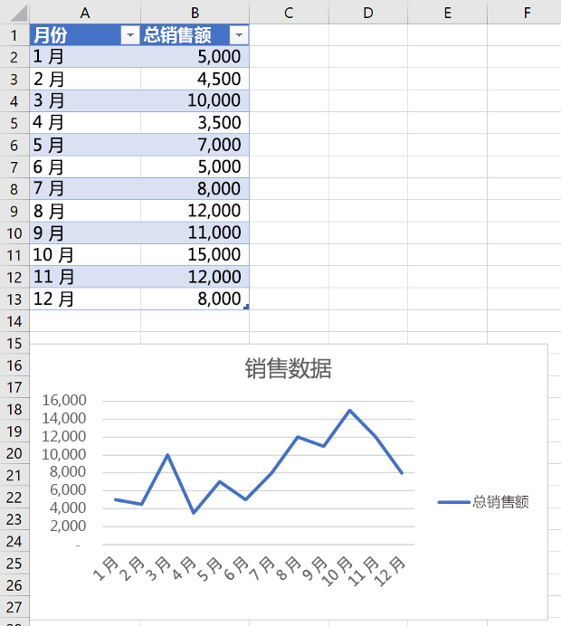
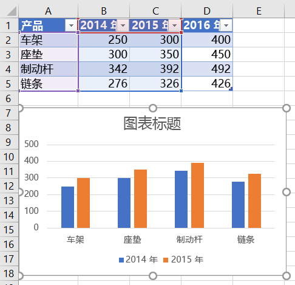
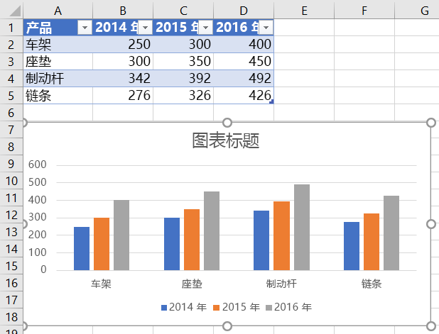
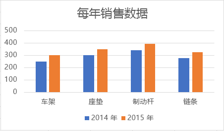
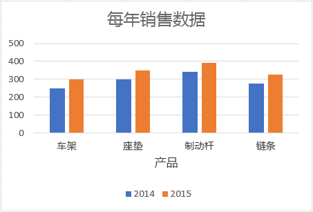
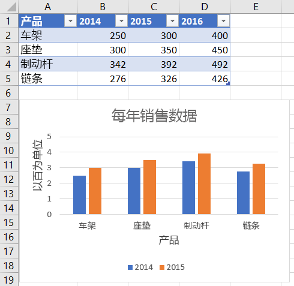
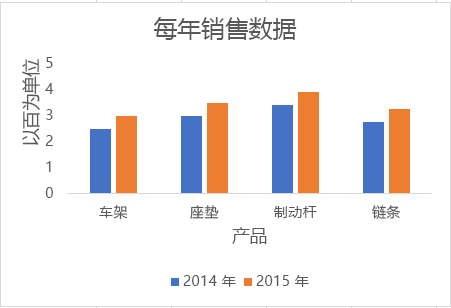
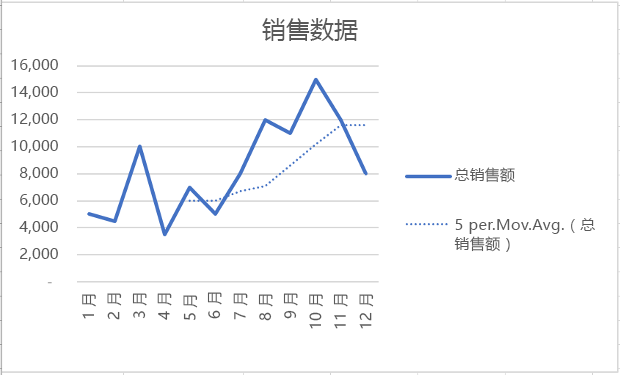
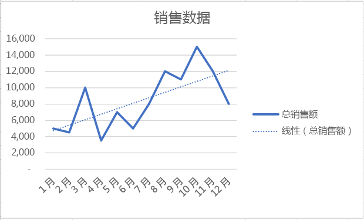

# <a name="work-with-charts-using-the-excel-javascript-api"></a><span data-ttu-id="1d96f-102">使用 Excel JavaScript API 处理图表</span><span class="sxs-lookup"><span data-stu-id="1d96f-102">Work with Charts using the Excel JavaScript API</span></span>

<span data-ttu-id="1d96f-p101">本文提供了代码示例，介绍如何使用 Excel JavaScript API 对图表执行常见任务。 有关 **Chart** 和 **ChartCollection** 对象支持的属性和方法的完整列表，请参阅 [Chart 对象 (Excel JavaScript API)](/javascript/api/excel/excel.chart) 和 [Chart Collection 对象 (Excel JavaScript API)](/javascript/api/excel/excel.chartcollection)。</span><span class="sxs-lookup"><span data-stu-id="1d96f-p101">This article provides code samples that show how to perform common tasks with charts using the Excel JavaScript API. For the complete list of properties and methods that the **Chart** and **ChartCollection** objects support, see [Chart Object (JavaScript API for Excel)](/javascript/api/excel/excel.chart) and [Chart Collection Object (JavaScript API for Excel)](/javascript/api/excel/excel.chartcollection).</span></span>

## <a name="create-a-chart"></a><span data-ttu-id="1d96f-105">创建图表</span><span class="sxs-lookup"><span data-stu-id="1d96f-105">Create a chart</span></span>

<span data-ttu-id="1d96f-p102">下面的代码示例在名为 **Sample** 的工作表中创建一个图表。 该图表是基于区域 **A1:B13** 的数据的**折线**图。</span><span class="sxs-lookup"><span data-stu-id="1d96f-p102">The following code sample creates a chart in the worksheet named **Sample**. The chart is a **Line** chart that is based upon data in the range **A1:B13**.</span></span>

```js
Excel.run(function (context) {
    var sheet = context.workbook.worksheets.getItem("Sample");
    var dataRange = sheet.getRange("A1:B13");
    var chart = sheet.charts.add("Line", dataRange, "auto");

    chart.title.text = "Sales Data";
    chart.legend.position = "right"
    chart.legend.format.fill.setSolidColor("white");
    chart.dataLabels.format.font.size = 15;
    chart.dataLabels.format.font.color = "black";

    return context.sync();
}).catch(errorHandlerFunction);
```

<span data-ttu-id="1d96f-108">**新建折线图**</span><span class="sxs-lookup"><span data-stu-id="1d96f-108">**New line chart**</span></span>




## <a name="add-a-data-series-to-a-chart"></a><span data-ttu-id="1d96f-110">向图表添加数据系列</span><span class="sxs-lookup"><span data-stu-id="1d96f-110">Add a data series to a chart</span></span>

<span data-ttu-id="1d96f-111">下面的代码示例向工作表中的第一个图表添加数据系列。</span><span class="sxs-lookup"><span data-stu-id="1d96f-111">The following code sample adds a data series to the first chart in the worksheet.</span></span> <span data-ttu-id="1d96f-112">新的数据系列对应于“2016 年”\*\*\*\* 列，并以区域 **D2:D5** 中的数据为依据。</span><span class="sxs-lookup"><span data-stu-id="1d96f-112">The new data series corresponds to the column named **2016** and is based upon data in the range **D2:D5**.</span></span>

```js
Excel.run(function (context) {
    var sheet = context.workbook.worksheets.getItem("Sample");
    var chart = sheet.charts.getItemAt(0);
    var dataRange = sheet.getRange("D2:D5");

    var newSeries = chart.series.add("2016");
    newSeries.setValues(dataRange);

    return context.sync();
}).catch(errorHandlerFunction);
```

<span data-ttu-id="1d96f-113">**添加 2016 数据系列之前的图表**</span><span class="sxs-lookup"><span data-stu-id="1d96f-113">**Chart before the 2016 data series is added**</span></span>



<span data-ttu-id="1d96f-115">**添加 2016 数据系列之后的图表**</span><span class="sxs-lookup"><span data-stu-id="1d96f-115">**Chart after the 2016 data series is added**</span></span>



## <a name="set-chart-title"></a><span data-ttu-id="1d96f-117">设置图表标题</span><span class="sxs-lookup"><span data-stu-id="1d96f-117">Set chart title</span></span>

<span data-ttu-id="1d96f-118">下面的代码示例将工作表中的第一个图表标题设置为**年度销售数据**。</span><span class="sxs-lookup"><span data-stu-id="1d96f-118">The following code sample sets the title of the first chart in the worksheet to **Sales Data by Year**.</span></span>

```js
Excel.run(function (context) {
    var sheet = context.workbook.worksheets.getItem("Sample");

    var chart = sheet.charts.getItemAt(0);
    chart.title.text = "Sales Data by Year";

    return context.sync();
}).catch(errorHandlerFunction);
```

<span data-ttu-id="1d96f-119">**设置标题后的图表**</span><span class="sxs-lookup"><span data-stu-id="1d96f-119">**Chart after title is set**</span></span>



## <a name="set-properties-of-an-axis-in-a-chart"></a><span data-ttu-id="1d96f-121">在图表中设置轴属性</span><span class="sxs-lookup"><span data-stu-id="1d96f-121">Set properties of an axis in a chart</span></span>

<span data-ttu-id="1d96f-p104">使用[笛卡儿坐标系统](https://en.wikipedia.org/wiki/Cartesian_coordinate_system)的图表（如柱形图、条形图和散点图）包含分类轴和数值轴。 以下示例介绍如何设置图表中轴的标题和显示单位。</span><span class="sxs-lookup"><span data-stu-id="1d96f-p104">Charts that use the [Cartesian coordinate system](https://en.wikipedia.org/wiki/Cartesian_coordinate_system) such as column charts, bar charts, and scatter charts contain a category axis and a value axis. These examples show how to set the title and display unit of an axis in a chart.</span></span>

### <a name="set-axis-title"></a><span data-ttu-id="1d96f-124">设置轴标题</span><span class="sxs-lookup"><span data-stu-id="1d96f-124">Set axis title</span></span>

<span data-ttu-id="1d96f-125">下面的代码示例将工作表中第一个图表的分类轴标题设置为**产品**。</span><span class="sxs-lookup"><span data-stu-id="1d96f-125">The following code sample sets the title of the category axis for the first chart in the worksheet to **Product**.</span></span>

```js
Excel.run(function (context) {
    var sheet = context.workbook.worksheets.getItem("Sample");

    var chart = sheet.charts.getItemAt(0);
    chart.axes.categoryAxis.title.text = "Product";

    return context.sync();
}).catch(errorHandlerFunction);
```

<span data-ttu-id="1d96f-126">**设置分类轴标题后的图表**</span><span class="sxs-lookup"><span data-stu-id="1d96f-126">**Chart after title of category axis is set**</span></span>



### <a name="set-axis-display-unit"></a><span data-ttu-id="1d96f-128">设置轴的显示单位</span><span class="sxs-lookup"><span data-stu-id="1d96f-128">Set axis display unit</span></span>

<span data-ttu-id="1d96f-129">下面的代码示例将工作表中首个图表的数值轴显示单位设置为“百”\*\*\*\*。</span><span class="sxs-lookup"><span data-stu-id="1d96f-129">The following code sample sets the display unit of the value axis for the first chart in the worksheet to **Hundreds**.</span></span>

```js
Excel.run(function (context) {
    var sheet = context.workbook.worksheets.getItem("Sample");

    var chart = sheet.charts.getItemAt(0);
    chart.axes.valueAxis.displayUnit = "Hundreds";

    return context.sync();
}).catch(errorHandlerFunction);
```

<span data-ttu-id="1d96f-130">**设置数值轴显示单位后的图表**</span><span class="sxs-lookup"><span data-stu-id="1d96f-130">**Chart after display unit of value axis is set**</span></span>



## <a name="set-visibility-of-gridlines-in-a-chart"></a><span data-ttu-id="1d96f-132">在图表中设置网格线的可见性</span><span class="sxs-lookup"><span data-stu-id="1d96f-132">Set visibility of gridlines in a chart</span></span>

<span data-ttu-id="1d96f-p105">以下代码示例隐藏工作表中第一个图表数值轴的主要网格线。 可以通过将 `chart.axes.valueAxis.majorGridlines.visible` 设置为 **true**，显示图表数值轴的主要网格线。</span><span class="sxs-lookup"><span data-stu-id="1d96f-p105">The following code sample hides the major gridlines for the value axis of the first chart in the worksheet. You can show the major gridlines for the value axis of the chart, by setting `chart.axes.valueAxis.majorGridlines.visible` to **true**.</span></span>

```js
Excel.run(function (context) {
    var sheet = context.workbook.worksheets.getItem("Sample");

    var chart = sheet.charts.getItemAt(0);
    chart.axes.valueAxis.majorGridlines.visible = false;

    return context.sync();
}).catch(errorHandlerFunction);
```

<span data-ttu-id="1d96f-135">**隐藏了网格线的图表**</span><span class="sxs-lookup"><span data-stu-id="1d96f-135">**Chart with gridlines hidden**</span></span>



## <a name="chart-trendlines"></a><span data-ttu-id="1d96f-137">图表趋势线</span><span class="sxs-lookup"><span data-stu-id="1d96f-137">Chart trendlines</span></span>

### <a name="add-a-trendline"></a><span data-ttu-id="1d96f-138">添加趋势线</span><span class="sxs-lookup"><span data-stu-id="1d96f-138">Add a trendline</span></span>

<span data-ttu-id="1d96f-p106">下面的代码示例向 **Sample** 工作表中首个图表的第一个系列添加移动均线。趋势线显示超过 5 个周期的移动平均。</span><span class="sxs-lookup"><span data-stu-id="1d96f-p106">The following code sample adds a moving average trendline to the first series in the first chart in the worksheet named **Sample**. The trendline shows a moving average over 5 periods.</span></span>

```js
Excel.run(function (context) {
    var sheet = context.workbook.worksheets.getItem("Sample");

    var chart = sheet.charts.getItemAt(0);
    var seriesCollection = chart.series;
    seriesCollection.getItemAt(0).trendlines.add("MovingAverage").movingAveragePeriod = 5;

    return context.sync();
}).catch(errorHandlerFunction);
```

<span data-ttu-id="1d96f-141">**带移动均线的图表**</span><span class="sxs-lookup"><span data-stu-id="1d96f-141">**Chart with moving average trendline**</span></span>



### <a name="update-a-trendline"></a><span data-ttu-id="1d96f-143">更新趋势线</span><span class="sxs-lookup"><span data-stu-id="1d96f-143">Update a trendline</span></span>

<span data-ttu-id="1d96f-144">下面的代码示例将 **Sample** 工作表中首个图表的第一个系列的趋势线设置为“线性”\*\*\*\* 类型。</span><span class="sxs-lookup"><span data-stu-id="1d96f-144">The following code sample sets the trendline to type **Linear** for the first series in the first chart in the worksheet named **Sample**.</span></span>

```js
Excel.run(function (context) {
    var sheet = context.workbook.worksheets.getItem("Sample");

    var chart = sheet.charts.getItemAt(0);
    var seriesCollection = chart.series;
    var series = seriesCollection.getItemAt(0);
    series.trendlines.getItem(0).type = "Linear";

    return context.sync();
}).catch(errorHandlerFunction);
```

<span data-ttu-id="1d96f-145">**带线性趋势线的图表**</span><span class="sxs-lookup"><span data-stu-id="1d96f-145">**Chart with linear trendline**</span></span>



## <a name="export-a-chart-as-an-image"></a><span data-ttu-id="1d96f-147">将图表导出为图像</span><span class="sxs-lookup"><span data-stu-id="1d96f-147">Export a chart as an image</span></span>

<span data-ttu-id="1d96f-148">图表可以呈现为 Excel 之外的图像。</span><span class="sxs-lookup"><span data-stu-id="1d96f-148">Charts can be rendered as images outside of Excel.</span></span> <span data-ttu-id="1d96f-149">`Chart.getImage` 将图表作为 base64 编码的字符串返回，将图表表示为 JPEG 图像。</span><span class="sxs-lookup"><span data-stu-id="1d96f-149">`Chart.getImage` returns the chart as a base64-encoded string representing the chart as a JPEG image.</span></span> <span data-ttu-id="1d96f-150">以下代码显示如何获取图像字符串并将其记录到控制台。</span><span class="sxs-lookup"><span data-stu-id="1d96f-150">The following code shows how to get the image string and log it to the console.</span></span>

```js
Excel.run(function (ctx) {
    var chart = ctx.workbook.worksheets.getItem("Sheet1").charts.getItem("Chart1");
    var imageAsString = chart.getImage();
    return context.sync().then(function () {
        console.log(imageAsString.value);
        // Instead of logging, your add-in may use the base64-encoded string to save the image as a file or insert it in HTML.
    });
}).catch(errorHandlerFunction);
```

<span data-ttu-id="1d96f-151">`Chart.getImage` 采用三个可选参数：宽度、高度和调整模式。</span><span class="sxs-lookup"><span data-stu-id="1d96f-151">`Chart.getImage` takes three optional parameters: width, height, and the fitting mode.</span></span>

```typescript
getImage(width?: number, height?: number, fittingMode?: Excel.ImageFittingMode): OfficeExtension.ClientResult<string>;
```

<span data-ttu-id="1d96f-152">这些参数决定图像的大小。</span><span class="sxs-lookup"><span data-stu-id="1d96f-152">These parameters determine the size of the image.</span></span> <span data-ttu-id="1d96f-153">图像始终按比例缩放。</span><span class="sxs-lookup"><span data-stu-id="1d96f-153">Images are always proportionally scaled.</span></span> <span data-ttu-id="1d96f-154">宽度和高度参数在缩放图像上设置上限或下限。</span><span class="sxs-lookup"><span data-stu-id="1d96f-154">The width and height parameters put upper or lower bounds on the scaled image.</span></span> <span data-ttu-id="1d96f-155">`ImageFittingMode` 具有三个值和以下行为：</span><span class="sxs-lookup"><span data-stu-id="1d96f-155">`ImageFittingMode` has three values with the following behaviors:</span></span>

- <span data-ttu-id="1d96f-156">`Fill`：图像的最小高度或宽度是指定的高度或宽度（缩放图像时首先达到的值）。</span><span class="sxs-lookup"><span data-stu-id="1d96f-156">`Fill`: The image’s minimum height or width is the specified height or width (whichever is reached first when scaling the image).</span></span> <span data-ttu-id="1d96f-157">这是未指定调整模式时的默认行为。</span><span class="sxs-lookup"><span data-stu-id="1d96f-157">This is the default behavior when no fitting mode is specified.</span></span>
- <span data-ttu-id="1d96f-158">`Fit`：图像的最大高度或宽度是指定的高度或宽度（缩放图像时首先达到的值）。</span><span class="sxs-lookup"><span data-stu-id="1d96f-158">`Fit`: The image’s maximum height or width is the specified height or width (whichever is reached first when scaling the image).</span></span>
- <span data-ttu-id="1d96f-159">`FitAndCenter`：图像的最大高度或宽度是指定的高度或宽度（缩放图像时首先达到的值）。</span><span class="sxs-lookup"><span data-stu-id="1d96f-159">`FitAndCenter`: The image’s maximum height or width is the specified height or width (whichever is reached first when scaling the image).</span></span> <span data-ttu-id="1d96f-160">生成的图像相对于另一个维度居中。</span><span class="sxs-lookup"><span data-stu-id="1d96f-160">The resulting image is centered relative to the other dimension.</span></span>

## <a name="see-also"></a><span data-ttu-id="1d96f-161">另请参阅</span><span class="sxs-lookup"><span data-stu-id="1d96f-161">See also</span></span>

- [<span data-ttu-id="1d96f-162">Excel JavaScript API 基本编程概念</span><span class="sxs-lookup"><span data-stu-id="1d96f-162">Fundamental programming concepts with the Excel JavaScript API</span></span>](excel-add-ins-core-concepts.md)
