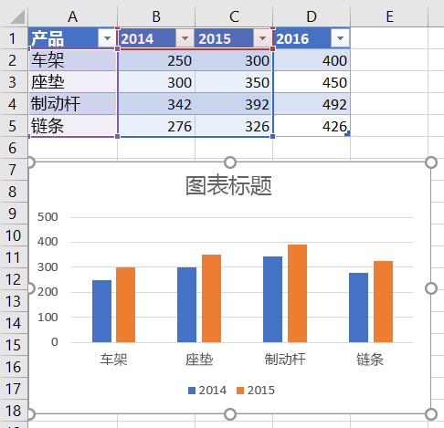

# <a name="work-with-charts-using-the-excel-javascript-api"></a>使用 Excel JavaScript API 处理图表

本文提供了代码示例，介绍如何使用 Excel JavaScript API 对图表执行常见任务。
有关 和 对象支持的属性和方法的完整列表，请参阅 `Chart` `ChartCollection` Chart [Object (JavaScript API for Excel) ](/javascript/api/excel/excel.chart)和[Chart Collection Object (JavaScript API for Excel) 。 ](/javascript/api/excel/excel.chartcollection)

## <a name="create-a-chart"></a>创建图表

下面的代码示例在名为 **Sample** 的工作表中创建一个图表。 该图表是基于区域 **A1:B13** 的数据的 **折线** 图。

```js
Excel.run(function (context) {
    var sheet = context.workbook.worksheets.getItem("Sample");
    var dataRange = sheet.getRange("A1:B13");
    var chart = sheet.charts.add("Line", dataRange, "auto");

    chart.title.text = "Sales Data";
    chart.legend.position = "right"
    chart.legend.format.fill.setSolidColor("white");
    chart.dataLabels.format.font.size = 15;
    chart.dataLabels.format.font.color = "black";

    return context.sync();
}).catch(errorHandlerFunction);
```

**新建折线图**


## <a name="add-a-data-series-to-a-chart"></a>向图表添加数据系列

下面的代码示例向工作表中的第一个图表添加数据系列。 新的数据系列对应于“2016 年”列，并以区域 **D2:D5** 中的数据为依据。

```js
Excel.run(function (context) {
    var sheet = context.workbook.worksheets.getItem("Sample");
    var chart = sheet.charts.getItemAt(0);
    var dataRange = sheet.getRange("D2:D5");

    var newSeries = chart.series.add("2016");
    newSeries.setValues(dataRange);

    return context.sync();
}).catch(errorHandlerFunction);
```

**添加 2016 数据系列之前的图表**



**添加 2016 数据系列之后的图表**


## <a name="set-chart-title"></a>设置图表标题

下面的代码示例将工作表中的第一个图表标题设置为 **年度销售数据**。

```js
Excel.run(function (context) {
    var sheet = context.workbook.worksheets.getItem("Sample");

    var chart = sheet.charts.getItemAt(0);
    chart.title.text = "Sales Data by Year";

    return context.sync();
}).catch(errorHandlerFunction);
```

**设置标题后的图表**


## <a name="set-properties-of-an-axis-in-a-chart"></a>在图表中设置轴属性

使用[笛卡儿坐标系统](https://en.wikipedia.org/wiki/Cartesian_coordinate_system)的图表（如柱形图、条形图和散点图）包含分类轴和数值轴。 以下示例介绍如何设置图表中轴的标题和显示单位。

### <a name="set-axis-title"></a>设置轴标题

下面的代码示例将工作表中第一个图表的分类轴标题设置为 **产品**。

```js
Excel.run(function (context) {
    var sheet = context.workbook.worksheets.getItem("Sample");

    var chart = sheet.charts.getItemAt(0);
    chart.axes.categoryAxis.title.text = "Product";

    return context.sync();
}).catch(errorHandlerFunction);
```

**设置分类轴标题后的图表**


### <a name="set-axis-display-unit"></a>设置轴的显示单位

下面的代码示例将工作表中首个图表的数值轴显示单位设置为“百”。

```js
Excel.run(function (context) {
    var sheet = context.workbook.worksheets.getItem("Sample");

    var chart = sheet.charts.getItemAt(0);
    chart.axes.valueAxis.displayUnit = "Hundreds";

    return context.sync();
}).catch(errorHandlerFunction);
```

**设置数值轴显示单位后的图表**


## <a name="set-visibility-of-gridlines-in-a-chart"></a>在图表中设置网格线的可见性

以下代码示例隐藏工作表中第一个图表数值轴的主要网格线。 可以通过将 设置为 来显示图表数值轴的主要网格 `chart.axes.valueAxis.majorGridlines.visible` 线 `true` 。

```js
Excel.run(function (context) {
    var sheet = context.workbook.worksheets.getItem("Sample");

    var chart = sheet.charts.getItemAt(0);
    chart.axes.valueAxis.majorGridlines.visible = false;

    return context.sync();
}).catch(errorHandlerFunction);
```

**隐藏了网格线的图表**


## <a name="chart-trendlines"></a>图表趋势线

### <a name="add-a-trendline"></a>添加趋势线

下面的代码示例向 **Sample** 工作表中首个图表的第一个系列添加移动均线。趋势线显示超过 5 个周期的移动平均。

```js
Excel.run(function (context) {
    var sheet = context.workbook.worksheets.getItem("Sample");

    var chart = sheet.charts.getItemAt(0);
    var seriesCollection = chart.series;
    seriesCollection.getItemAt(0).trendlines.add("MovingAverage").movingAveragePeriod = 5;

    return context.sync();
}).catch(errorHandlerFunction);
```

**带移动均线的图表**


### <a name="update-a-trendline"></a>更新趋势线

下面的代码示例将设置趋势线以键入名为 Sample 的工作表中第一个 `Linear` 图表的第一 **个系列**。

```js
Excel.run(function (context) {
    var sheet = context.workbook.worksheets.getItem("Sample");

    var chart = sheet.charts.getItemAt(0);
    var seriesCollection = chart.series;
    var series = seriesCollection.getItemAt(0);
    series.trendlines.getItem(0).type = "Linear";

    return context.sync();
}).catch(errorHandlerFunction);
```

**带线性趋势线的图表**


## <a name="export-a-chart-as-an-image"></a>将图表导出为图像

图表可以呈现为 Excel 之外的图像。 `Chart.getImage` 将图表作为 base64 编码的字符串返回，将图表表示为 JPEG 图像。 以下代码显示如何获取图像字符串并将其记录到控制台。

```js
Excel.run(function (ctx) {
    var chart = ctx.workbook.worksheets.getItem("Sheet1").charts.getItem("Chart1");
    var imageAsString = chart.getImage();
    return context.sync().then(function () {
        console.log(imageAsString.value);
        // Instead of logging, your add-in may use the base64-encoded string to save the image as a file or insert it in HTML.
    });
}).catch(errorHandlerFunction);
```

`Chart.getImage` 采用三个可选参数：宽度、高度和调整模式。

```typescript
getImage(width?: number, height?: number, fittingMode?: Excel.ImageFittingMode): OfficeExtension.ClientResult<string>;
```

这些参数决定图像的大小。 图像始终按比例缩放。 宽度和高度参数在缩放图像上设置上限或下限。 `ImageFittingMode` 具有以下行为的三个值。

- `Fill`：图像的最小高度或宽度是指定的高度或宽度 (缩放图像缩放时首先达到) 。 这是未指定调整模式时的默认行为。
- `Fit`：图像的最大高度或宽度是指定的高度或宽度 (缩放图像缩放时首先到达) 。
- `FitAndCenter`：图像的最大高度或宽度是指定的高度或宽度 (缩放图像缩放时首先到达) 。 生成的图像相对于另一个维度居中。

## <a name="see-also"></a>另请参阅

- [Excel 加载项中的 Word JavaScript 对象模型](excel-add-ins-core-concepts.md)
