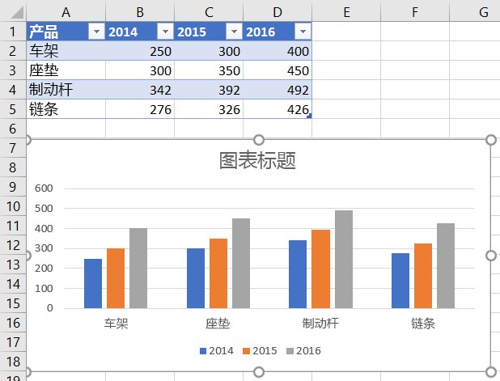
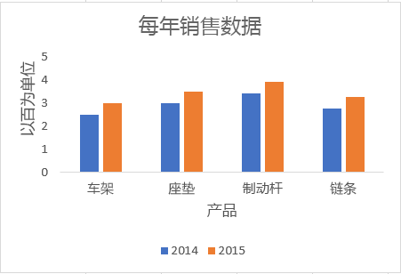

# <a name="work-with-charts-using-the-excel-javascript-api"></a>使用 Excel JavaScript API 处理图表

本文提供了代码示例，介绍如何使用 Excel JavaScript API 对图表执行常见任务。
有关 和 对象支持的属性和方法的完整列表，请参阅 [Chart Object (JavaScript API for Excel) ](/javascript/api/excel/excel.chart)和 [Chart Collection Object (JavaScript API for Excel) ](/javascript/api/excel/excel.chartcollection)。`Chart` `ChartCollection`

## <a name="create-a-chart"></a>创建图表

下面的代码示例在名为 **Sample** 的工作表中创建一个图表。 该图表是基于区域 **A1:B13** 的数据的 **折线** 图。

```js
await Excel.run(async (context) => {
    let sheet = context.workbook.worksheets.getItem("Sample");
    let dataRange = sheet.getRange("A1:B13");
    let chart = sheet.charts.add(
      Excel.ChartType.line, 
      dataRange, 
      Excel.ChartSeriesBy.auto);

    chart.title.text = "Sales Data";
    chart.legend.position = Excel.ChartLegendPosition.right;
    chart.legend.format.fill.setSolidColor("white");
    chart.dataLabels.format.font.size = 15;
    chart.dataLabels.format.font.color = "black";

    await context.sync();
});
```

### <a name="new-line-chart"></a>新建折线图


## <a name="add-a-data-series-to-a-chart"></a>向图表添加数据系列

下面的代码示例向工作表中的第一个图表添加数据系列。 新的数据系列对应于“2016 年”列，并以区域 **D2:D5** 中的数据为依据。

```js
await Excel.run(async (context) => {
    let sheet = context.workbook.worksheets.getItem("Sample");
    let chart = sheet.charts.getItemAt(0);
    let dataRange = sheet.getRange("D2:D5");

    let newSeries = chart.series.add("2016");
    newSeries.setValues(dataRange);

    await context.sync();
});
```

### <a name="chart-before-the-2016-data-series-is-added"></a>添加 2016 数据系列之前的图表


### <a name="chart-after-the-2016-data-series-is-added"></a>添加 2016 数据系列之后的图表



## <a name="set-chart-title"></a>设置图表标题

下面的代码示例将工作表中的第一个图表标题设置为 **年度销售数据**。

```js
await Excel.run(async (context) => {
    let sheet = context.workbook.worksheets.getItem("Sample");

    let chart = sheet.charts.getItemAt(0);
    chart.title.text = "Sales Data by Year";

    await context.sync();
});
```

### <a name="chart-after-title-is-set"></a>设置标题后的图表


## <a name="set-properties-of-an-axis-in-a-chart"></a>在图表中设置轴属性

使用[笛卡儿坐标系统](https://en.wikipedia.org/wiki/Cartesian_coordinate_system)的图表（如柱形图、条形图和散点图）包含分类轴和数值轴。 以下示例介绍如何设置图表中轴的标题和显示单位。

### <a name="set-axis-title"></a>设置轴标题

下面的代码示例将工作表中第一个图表的分类轴标题设置为 **产品**。

```js
await Excel.run(async (context) => {
    let sheet = context.workbook.worksheets.getItem("Sample");

    let chart = sheet.charts.getItemAt(0);
    chart.axes.categoryAxis.title.text = "Product";

    await context.sync();
});
```

### <a name="chart-after-title-of-category-axis-is-set"></a>设置分类轴标题后的图表


### <a name="set-axis-display-unit"></a>设置轴的显示单位

下面的代码示例将工作表中首个图表的数值轴显示单位设置为“百”。

```js
await Excel.run(async (context) => {
    let sheet = context.workbook.worksheets.getItem("Sample");

    let chart = sheet.charts.getItemAt(0);
    chart.axes.valueAxis.displayUnit = "Hundreds";

    await context.sync();
});
```

### <a name="chart-after-display-unit-of-value-axis-is-set"></a>设置数值轴显示单位后的图表


## <a name="set-visibility-of-gridlines-in-a-chart"></a>在图表中设置网格线的可见性

以下代码示例隐藏工作表中第一个图表数值轴的主要网格线。 可以通过将 设置为 来显示图表数值轴的主要网格 `chart.axes.valueAxis.majorGridlines.visible` 线 `true`。

```js
await Excel.run(async (context) => {
    let sheet = context.workbook.worksheets.getItem("Sample");

    let chart = sheet.charts.getItemAt(0);
    chart.axes.valueAxis.majorGridlines.visible = false;

    await context.sync();
});
```

### <a name="chart-with-gridlines-hidden"></a>隐藏了网格线的图表



## <a name="chart-trendlines"></a>图表趋势线

### <a name="add-a-trendline"></a>添加趋势线

下面的代码示例向 **Sample** 工作表中首个图表的第一个系列添加移动均线。趋势线显示超过 5 个周期的移动平均。

```js
await Excel.run(async (context) => {
    let sheet = context.workbook.worksheets.getItem("Sample");

    let chart = sheet.charts.getItemAt(0);
    let seriesCollection = chart.series;
    seriesCollection.getItemAt(0).trendlines.add("MovingAverage").movingAveragePeriod = 5;

    await context.sync();
});
```

#### <a name="chart-with-moving-average-trendline"></a>带移动均线的图表


### <a name="update-a-trendline"></a>更新趋势线

下面的代码示例将 Sample `Linear` 工作表中第一个图表的第一个系列的趋势线设置为 **键入。**

```js
await Excel.run(async (context) => {
    let sheet = context.workbook.worksheets.getItem("Sample");

    let chart = sheet.charts.getItemAt(0);
    let seriesCollection = chart.series;
    let series = seriesCollection.getItemAt(0);
    series.trendlines.getItem(0).type = "Linear";

    await context.sync();
});
```

#### <a name="chart-with-linear-trendline"></a>带线性趋势线的图表


## <a name="add-and-format-a-chart-data-table"></a>添加图表数据表并设置其格式

可以使用 方法访问图表的 data [`Chart.getDataTableOrNullObject`](/javascript/api/excel/excel.chart#excel-excel-chart-getdatatableornullobject-member(1)) table 元素。 此方法返回对象 [`ChartDataTable`](/javascript/api/excel/excel.chartdatatable) 。 对象 `ChartDataTable` 具有布尔格式属性，如 `visible`、 `showLegendKey`和 `showHorizontalBorder`。

属性 `ChartDataTable.format` 返回 对象 [`ChartDataTableFormat`](/javascript/api/excel/excel.chartdatatableformat) ，这允许您进一步设置数据表的格式和样式。 对象 `ChartDataTableFormat` 提供 `border`、 `fill`和 `font` 属性。

下面的代码示例演示如何将一个数据表添加到图表中，然后使用 和 对象设置 `ChartDataTable` 该数据表 `ChartDataTableFormat` 的格式。

```js
// This code sample adds a data table to a chart that already exists on the worksheet, 
// and then adjusts the display and format of that data table.
await Excel.run(async (context) => {
    // Retrieve the chart on the "Sample" worksheet.
    let chart = context.workbook.worksheets.getItem("Sample").charts.getItemAt(0);

    // Get the chart data table object and load its properties.
    let chartDataTable = chart.getDataTableOrNullObject();
    chartDataTable.load();

    // Set the display properties of the chart data table.
    chartDataTable.visible = true;
    chartDataTable.showLegendKey = true;
    chartDataTable.showHorizontalBorder = false;
    chartDataTable.showVerticalBorder = true;
    chartDataTable.showOutlineBorder = true;

    // Retrieve the chart data table format object and set font and border properties. 
    let chartDataTableFormat = chartDataTable.format;
    chartDataTableFormat.font.color = "#B76E79";
    chartDataTableFormat.font.name = "Comic Sans";
    chartDataTableFormat.border.color = "blue";

    await context.sync();
});
```

以下屏幕截图显示了上述代码示例创建的数据表。


## <a name="export-a-chart-as-an-image"></a>将图表导出为图像

图表可以呈现为 Excel 之外的图像。 `Chart.getImage` 将图表作为 base64 编码的字符串返回，将图表表示为 JPEG 图像。 以下代码显示如何获取图像字符串并将其记录到控制台。

```js
await Excel.run(async (context) => {
    let chart = context.workbook.worksheets.getItem("Sheet1").charts.getItem("Chart1");
    let imageAsString = chart.getImage();
    await context.sync();
    
    console.log(imageAsString.value);
    // Instead of logging, your add-in may use the base64-encoded string to save the image as a file or insert it in HTML.
});
```

`Chart.getImage` 采用三个可选参数：宽度、高度和调整模式。

```typescript
getImage(width?: number, height?: number, fittingMode?: Excel.ImageFittingMode): OfficeExtension.ClientResult<string>;
```

这些参数决定图像的大小。 图像始终按比例缩放。 宽度和高度参数在缩放图像上设置上限或下限。 `ImageFittingMode` 具有以下行为的三个值。

- `Fill`：图像的最小高度或宽度是指定的高度或宽度， (缩放图像时先到达) 。 这是未指定调整模式时的默认行为。
- `Fit`：图像的最大高度或宽度是指定的高度或宽度 (缩放图像时首先到达) 。
- `FitAndCenter`：图像的最大高度或宽度是指定的高度或宽度 (缩放图像时首先到达) 。 生成的图像相对于另一个维度居中。

## <a name="see-also"></a>另请参阅

- [Excel 加载项中的 Word JavaScript 对象模型](excel-add-ins-core-concepts.md)
