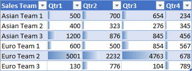

# <a name="apply-conditional-formatting-to-excel-ranges"></a><span data-ttu-id="5d7f1-103">将条件格式应用于特定 Excel 范围</span><span class="sxs-lookup"><span data-stu-id="5d7f1-103">Apply conditional formatting to Excel ranges</span></span>

<span data-ttu-id="5d7f1-104">Excel JavaScript 库提供了用于将条件格式应用于工作表中的特定数据范围的 API。</span><span class="sxs-lookup"><span data-stu-id="5d7f1-104">The Excel JavaScript Library provides APIs to apply conditional formatting to data ranges in your worksheets.</span></span> <span data-ttu-id="5d7f1-105">借助此功能，可以轻松直观地解析大型数据集。</span><span class="sxs-lookup"><span data-stu-id="5d7f1-105">This functionality makes large sets of data easy to visually parse.</span></span> <span data-ttu-id="5d7f1-106">该格式还会基于相应范围内的更改进行动态更新。</span><span class="sxs-lookup"><span data-stu-id="5d7f1-106">The formatting also dynamically updates based on changes within the range.</span></span> 

> [!NOTE]
> <span data-ttu-id="5d7f1-107">本文介绍了 Excel JavaScript 外接程序上下文中的条件格式。下面的文章提供了有关在 Excel 中实现完整条件格式功能的详细信息。</span><span class="sxs-lookup"><span data-stu-id="5d7f1-107">This article covers conditional formatting in the context of Excel JavaScript add-ins. The following articles provide detailed information about the full conditional formatting capabilities within Excel.</span></span>
> -  [<span data-ttu-id="5d7f1-108">添加、更改或清除条件格式</span><span class="sxs-lookup"><span data-stu-id="5d7f1-108">Add, change, or clear conditional formats</span></span>](https://support.office.com/article/add-change-or-clear-conditional-formats-8a1cc355-b113-41b7-a483-58460332a1af)
> -  [<span data-ttu-id="5d7f1-109">将公式用于条件格式</span><span class="sxs-lookup"><span data-stu-id="5d7f1-109">Use formulas with conditional formatting</span></span>](https://support.office.com/article/Use-formulas-with-conditional-formatting-FED60DFA-1D3F-4E13-9ECB-F1951FF89D7F)

## <a name="programmatic-control-of-conditional-formatting"></a><span data-ttu-id="5d7f1-110">条件格式的编程控制</span><span class="sxs-lookup"><span data-stu-id="5d7f1-110">Programmatic control of conditional formatting</span></span>

<span data-ttu-id="5d7f1-111">`Range.conditionalFormats` 属性是一个应用于相应范围的 [ConditionalFormat](/javascript/api/excel/excel.conditionalformat) 对象的集合。</span><span class="sxs-lookup"><span data-stu-id="5d7f1-111">The `Range.conditionalFormats` property is a collection of [ConditionalFormat](/javascript/api/excel/excel.conditionalformat) objects that apply to the range.</span></span>  <span data-ttu-id="5d7f1-112">`ConditionalFormat` 对象包含多个属性，这些属性基于 [ConditionalFormatType](/javascript/api/excel/excel.conditionalformattype) 定义要应用的格式。</span><span class="sxs-lookup"><span data-stu-id="5d7f1-112">The `ConditionalFormat` object contains several properties that define the format to be applied based on the [ConditionalFormatType](/javascript/api/excel/excel.conditionalformattype).</span></span> 

-    `cellValue`
-    `colorScale`
-    `custom`
-    `dataBar`
-    `iconSet`
-    `preset`
-    `textComparison`
-    `topBottom`

> [!NOTE]
> <span data-ttu-id="5d7f1-113">每个格式属性都有相应的 `*OrNullObject` 变体。</span><span class="sxs-lookup"><span data-stu-id="5d7f1-113">Each of these formatting properties has a corresponding `*OrNullObject` variant.</span></span> <span data-ttu-id="5d7f1-114">在 [\*OrNullObject 方法](../excel/excel-add-ins-advanced-concepts.md#ornullobject-methods)部分中了解有关该模式的更多信息。</span><span class="sxs-lookup"><span data-stu-id="5d7f1-114">Learn more about that pattern in the [\*OrNullObject methods](../excel/excel-add-ins-advanced-concepts.md#ornullobject-methods) section.</span></span>

<span data-ttu-id="5d7f1-115">仅可为 ConditionalFormat 对象设置一种格式类型。</span><span class="sxs-lookup"><span data-stu-id="5d7f1-115">Only one format type can be set for the ConditionalFormat object.</span></span> <span data-ttu-id="5d7f1-116">该格式类型由 `type` 属性确定，该属性是 [ConditionalFormatType](/javascript/api/excel/excel.conditionalformattype) 枚举值。</span><span class="sxs-lookup"><span data-stu-id="5d7f1-116">This is determined by the `type` property, which is a [ConditionalFormatType](/javascript/api/excel/excel.conditionalformattype) enum value.</span></span> <span data-ttu-id="5d7f1-117">`type` 是在向某一范围添加条件格式时设置的。</span><span class="sxs-lookup"><span data-stu-id="5d7f1-117">`type` is set when adding a conditional format to a range.</span></span> 

## <a name="creating-conditional-formatting-rules"></a><span data-ttu-id="5d7f1-118">创建条件格式规则</span><span class="sxs-lookup"><span data-stu-id="5d7f1-118">Creating conditional formatting rules</span></span>

<span data-ttu-id="5d7f1-119">条件格式可通过使用 `conditionalFormats.add` 添加到某一范围。</span><span class="sxs-lookup"><span data-stu-id="5d7f1-119">Conditional formats are added to a range by using `conditionalFormats.add`.</span></span> <span data-ttu-id="5d7f1-120">添加后，可以设置特定于条件格式的属性。</span><span class="sxs-lookup"><span data-stu-id="5d7f1-120">Once added, the properties specific to the conditional format can be set.</span></span> <span data-ttu-id="5d7f1-121">以下示例展示了如何创建不同的格式类型。</span><span class="sxs-lookup"><span data-stu-id="5d7f1-121">The following examples show the creation of different formatting types.</span></span>

### <a name="cell-value"></a>[<span data-ttu-id="5d7f1-122">单元格值</span><span class="sxs-lookup"><span data-stu-id="5d7f1-122">Cell value</span></span>](/javascript/api/excel/excel.cellvalueconditionalformat)

<span data-ttu-id="5d7f1-123">单元格值条件格式将基于 [ConditionalCellValueRule](/javascript/api/excel/excel.conditionalcellvaluerule) 中的一个或两个公式的结果应用用户定义的格式。</span><span class="sxs-lookup"><span data-stu-id="5d7f1-123">Cell value conditional formatting applies a user-defined format based on the results of one or two formulas in the [ConditionalCellValueRule](/javascript/api/excel/excel.conditionalcellvaluerule).</span></span> <span data-ttu-id="5d7f1-124">`operator` 属性是一个 [ConditionalCellValueOperator](/javascript/api/excel/excel.conditionalcellvalueoperator)，用于定义结果表达式与格式设置的关系。</span><span class="sxs-lookup"><span data-stu-id="5d7f1-124">The `operator` property is a [ConditionalCellValueOperator](/javascript/api/excel/excel.conditionalcellvalueoperator) defining how the resulting expressions relate to the formatting.</span></span>

<span data-ttu-id="5d7f1-125">以下示例展示的是将红色字体颜色设置应用于相应范围内小于零的任何值。</span><span class="sxs-lookup"><span data-stu-id="5d7f1-125">The following example shows red font coloring applied to any value in the range less than zero.</span></span>


```typescript
const sheet = context.workbook.worksheets.getItem("Sample");
const range = sheet.getRange("B21:E23");
const conditionalFormat = range.conditionalFormats.add(
    Excel.ConditionalFormatType.cellValue
);

// set the font of negative numbers to red
conditionalFormat.cellValue.format.font.color = "red";
conditionalFormat.cellValue.rule = { formula1: "=0", operator: "LessThan" };

await context.sync();
```

### <a name="color-scale"></a>[<span data-ttu-id="5d7f1-127">色阶</span><span class="sxs-lookup"><span data-stu-id="5d7f1-127">Color scale</span></span>](/javascript/api/excel/excel.colorscaleconditionalformat)

<span data-ttu-id="5d7f1-128">色阶条件格式可将颜色渐变应用到相应数据范围。</span><span class="sxs-lookup"><span data-stu-id="5d7f1-128">Color scale conditional formatting applies a color gradient across the data range.</span></span> <span data-ttu-id="5d7f1-129">`ColorScaleConditionalFormat` 上的 `criteria` 属性定义了三个 [ConditionalColorScaleCriterion](/javascript/api/excel/excel.conditionalcolorscalecriterion)：`minimum`、`maximum` 以及可选的 `midpoint`。</span><span class="sxs-lookup"><span data-stu-id="5d7f1-129">The `criteria` property on the `ColorScaleConditionalFormat` defines three [ConditionalColorScaleCriterion](/javascript/api/excel/excel.conditionalcolorscalecriterion): `minimum`, `maximum`, and, optionally, `midpoint`.</span></span> <span data-ttu-id="5d7f1-130">每个条件色阶点都具有三个属性：</span><span class="sxs-lookup"><span data-stu-id="5d7f1-130">Each of the criterion scale points have three properties:</span></span>

-    <span data-ttu-id="5d7f1-131">`color` - 端点的 HTML 颜色代码。</span><span class="sxs-lookup"><span data-stu-id="5d7f1-131">`color` - The HTML color code for the endpoint.</span></span>
-    <span data-ttu-id="5d7f1-132">`formula` - 表示端点的数字或公式。</span><span class="sxs-lookup"><span data-stu-id="5d7f1-132">`formula` - A number or formula representing the endpoint.</span></span> <span data-ttu-id="5d7f1-133">如果 `type` 是 `lowestValue` 或 `highestValue`，该属性将为 `null`。</span><span class="sxs-lookup"><span data-stu-id="5d7f1-133">This will be `null` if `type` is `lowestValue` or `highestValue`.</span></span>
-    <span data-ttu-id="5d7f1-134">`type` - 应如何评估公式。</span><span class="sxs-lookup"><span data-stu-id="5d7f1-134">`type` - How the formula should be evaluated.</span></span> <span data-ttu-id="5d7f1-135">`highestValue` 和 `lowestValue` 是指将要应用格式的范围中的值。</span><span class="sxs-lookup"><span data-stu-id="5d7f1-135">`highestValue` and `lowestValue` refer to values in the range being formatted.</span></span>

<span data-ttu-id="5d7f1-136">下面的示例展示了一个使用蓝色、黄色和红色颜色渐变的范围。</span><span class="sxs-lookup"><span data-stu-id="5d7f1-136">The following example shows a range being colored blue to yellow to red.</span></span> <span data-ttu-id="5d7f1-137">请注意，`minimum` 和 `maximum` 分别是最低值和最高值，并使用了 `null` 公式。</span><span class="sxs-lookup"><span data-stu-id="5d7f1-137">Note that `minimum` and `maximum` are the lowest and highest values respectively and use `null` formulas.</span></span> <span data-ttu-id="5d7f1-138">`midpoint` 使用的类型为 `percentage`，公式为 `"=50"`，因此颜色最黄的单元格是平均值。</span><span class="sxs-lookup"><span data-stu-id="5d7f1-138">`midpoint` is using the `percentage` type with a formula of `"=50"` so the yellowest cell is the mean value.</span></span>


```typescript
const sheet = context.workbook.worksheets.getItem("Sample");
const range = sheet.getRange("B2:M5");
const conditionalFormat = range.conditionalFormats.add(
      Excel.ConditionalFormatType.colorScale
);

// color the backgrounds of the cells from blue to yellow to red based on value
const criteria = {
      minimum: {
           formula: null,
           type: Excel.ConditionalFormatColorCriterionType.lowestValue,
           color: "blue"
      },
      midpoint: {
           formula: "50",
           type: Excel.ConditionalFormatColorCriterionType.percent,
           color: "yellow"
      },
      maximum: {
           formula: null,
           type: Excel.ConditionalFormatColorCriterionType.highestValue,
           color: "red"
      }
};
conditionalFormat.colorScale.criteria = criteria;

await context.sync();
```

### <a name="custom"></a>[<span data-ttu-id="5d7f1-140">自定义</span><span class="sxs-lookup"><span data-stu-id="5d7f1-140">Custom</span></span>](/javascript/api/excel/excel.customconditionalformat)

<span data-ttu-id="5d7f1-141">自定义条件格式根据任意复杂度的公式将用户定义的格式应用于单元格。</span><span class="sxs-lookup"><span data-stu-id="5d7f1-141">Custom conditional formatting applies a user-defined format to the cells based on a formula of arbitrary complexity.</span></span> <span data-ttu-id="5d7f1-142">[ConditionalFormatRule](/javascript/api/excel/excel.conditionalformatrule) 对象允许使用不同表示法定义公式：</span><span class="sxs-lookup"><span data-stu-id="5d7f1-142">The [ConditionalFormatRule](/javascript/api/excel/excel.conditionalformatrule) object lets you define the formula in different notations:</span></span>

-    <span data-ttu-id="5d7f1-143">`formula` - 标准表示法。</span><span class="sxs-lookup"><span data-stu-id="5d7f1-143">`formula` - Standard notation.</span></span>
-    <span data-ttu-id="5d7f1-144">`formulaLocal`-根据用户的语言进行本地化。</span><span class="sxs-lookup"><span data-stu-id="5d7f1-144">`formulaLocal` - Localized based on the user's language.</span></span>
-    <span data-ttu-id="5d7f1-145">`formulaR1C1` - R1C1 样式表示法。</span><span class="sxs-lookup"><span data-stu-id="5d7f1-145">`formulaR1C1` - R1C1-style notation.</span></span>

<span data-ttu-id="5d7f1-146">在下面的示例中，将数值大于其左侧单元格数值的单元格的字体颜色设置成了绿色。</span><span class="sxs-lookup"><span data-stu-id="5d7f1-146">The following example colors the fonts green of cells with higher values than the cell to their left.</span></span>


```typescript
const sheet = context.workbook.worksheets.getItem("Sample");
const range = sheet.getRange("B8:E13");
const conditionalFormat = range.conditionalFormats.add(
     Excel.ConditionalFormatType.custom
);

// if a cell has a higher value than the one to its left, set that cell's font to green
conditionalFormat.custom.rule.formula = '=IF(B8>INDIRECT("RC[-1]",0),TRUE)';
conditionalFormat.custom.format.font.color = "green";

await context.sync();

```
### <a name="data-bar"></a>[<span data-ttu-id="5d7f1-148">数据栏</span><span class="sxs-lookup"><span data-stu-id="5d7f1-148">Data bar</span></span>](/javascript/api/excel/excel.databarconditionalformat)

<span data-ttu-id="5d7f1-149">数据栏条件格式可将数据栏添加到单元格。</span><span class="sxs-lookup"><span data-stu-id="5d7f1-149">Data bar conditional formatting adds data bars to the cells.</span></span> <span data-ttu-id="5d7f1-150">默认情况下，相应范围内的最小和最大值形成数据栏的边界和比例大小。</span><span class="sxs-lookup"><span data-stu-id="5d7f1-150">By default, the minimum and maximum values in the Range form the bounds and proportional sizes of the data bars.</span></span> <span data-ttu-id="5d7f1-151">`DataBarConditionalFormat`对象具有几个属性来控制条形图的外观。</span><span class="sxs-lookup"><span data-stu-id="5d7f1-151">The `DataBarConditionalFormat` object has several properties to control the bar's appearance.</span></span> 

<span data-ttu-id="5d7f1-152">下面的示例对相应范围应用了从左到右填充的数据栏格式。</span><span class="sxs-lookup"><span data-stu-id="5d7f1-152">The following example formats the range with data bars filling left-to-right.</span></span>



```typescript
const sheet = context.workbook.worksheets.getItem("Sample");
const range = sheet.getRange("B8:E13");
const conditionalFormat = range.conditionalFormats.add(
     Excel.ConditionalFormatType.dataBar
);

// give left-to-right, default-appearance data bars to all the cells
conditionalFormat.dataBar.barDirection = Excel.ConditionalDataBarDirection.leftToRight;
await context.sync();
```

### <a name="icon-set"></a>[<span data-ttu-id="5d7f1-154">图标集</span><span class="sxs-lookup"><span data-stu-id="5d7f1-154">Icon set</span></span>](/javascript/api/excel/excel.iconsetconditionalformat)

<span data-ttu-id="5d7f1-155">图标集条件格式使用 Excel [图标](/javascript/api/excel/excel.icon)来突出显示单元格。</span><span class="sxs-lookup"><span data-stu-id="5d7f1-155">Icon set conditional formatting uses Excel [Icons](/javascript/api/excel/excel.icon) to highlight cells.</span></span> <span data-ttu-id="5d7f1-156">`criteria` 属性是一个 [ConditionalIconCriterion](/javascript/api/excel/excel.ConditionalIconCriterion) 数组，它定义要插入的符号以及插入该符号的条件。</span><span class="sxs-lookup"><span data-stu-id="5d7f1-156">The `criteria` property is an array of [ConditionalIconCriterion](/javascript/api/excel/excel.ConditionalIconCriterion), which define the symbol to be inserted and the condition under which it is inserted.</span></span> <span data-ttu-id="5d7f1-157">此数组将使用具有默认属性的条件元素自动预填充。</span><span class="sxs-lookup"><span data-stu-id="5d7f1-157">This array is automatically prepopulated with criterion elements with default properties.</span></span> <span data-ttu-id="5d7f1-158">个别属性不能被覆盖。</span><span class="sxs-lookup"><span data-stu-id="5d7f1-158">Individual properties cannot be overwritten.</span></span> <span data-ttu-id="5d7f1-159">相反，必须替换整个条件对象。</span><span class="sxs-lookup"><span data-stu-id="5d7f1-159">Instead, the whole criteria object must be replaced.</span></span> 

<span data-ttu-id="5d7f1-160">下面的示例展示了应用于相应范围的三元素图标集。</span><span class="sxs-lookup"><span data-stu-id="5d7f1-160">The following example shows a three-triangle icon set applied across the range.</span></span>


```typescript
const sheet = context.workbook.worksheets.getItem("Sample");
const range = sheet.getRange("B8:E13");
const conditionalFormat = range.conditionalFormats.add(
     Excel.ConditionalFormatType.iconSet
);

const iconSetCF = conditionalFormat.iconSet;
iconSetCF.style = Excel.IconSet.threeTriangles;

/*
   With a "three*" icon set style, such as "threeTriangles", the third
    element in the criteria array (criteria[2]) defines the "top" icon;
    e.g., a green triangle. The second (criteria[1]) defines the "middle"
    icon, The first (criteria[0]) defines the "low" icon, but it can often 
    be left empty as this method does below, because every cell that
   does not match the other two criteria always gets the low icon.
*/
iconSetCF.criteria = [
    {} as any,
      {
        type: Excel.ConditionalFormatIconRuleType.number,
        operator: Excel.ConditionalIconCriterionOperator.greaterThanOrEqual,
        formula: "=700"
      },
      {
        type: Excel.ConditionalFormatIconRuleType.number,
        operator: Excel.ConditionalIconCriterionOperator.greaterThanOrEqual,
        formula: "=1000"
      }
];

await context.sync();
```

### <a name="preset-criteria"></a>[<span data-ttu-id="5d7f1-162">预设条件</span><span class="sxs-lookup"><span data-stu-id="5d7f1-162">Preset criteria</span></span>](/javascript/api/excel/excel.presetcriteriaconditionalformat)

<span data-ttu-id="5d7f1-163">预设条件格式会基于所选标准规则将用户定义的格式应用于相应范围。</span><span class="sxs-lookup"><span data-stu-id="5d7f1-163">Preset conditional formatting applies a user-defined format to the range based on a selected standard rule.</span></span> <span data-ttu-id="5d7f1-164">这些规则由 [ConditionalPresetCriteriaRule](/javascript/api/excel/excel.conditionalpresetcriteriarule) 中的 [ConditionalFormatPresetCriterion](/javascript/api/excel/excel.ConditionalFormatPresetCriterion) 定义。</span><span class="sxs-lookup"><span data-stu-id="5d7f1-164">These rules are defined by the [ConditionalFormatPresetCriterion](/javascript/api/excel/excel.ConditionalFormatPresetCriterion) in the [ConditionalPresetCriteriaRule](/javascript/api/excel/excel.conditionalpresetcriteriarule).</span></span> 

<span data-ttu-id="5d7f1-165">下面的示例在某个单元格的值与该范围的平均值之上至少有一个标准偏差的地方为白色着色。</span><span class="sxs-lookup"><span data-stu-id="5d7f1-165">The following example colors the font white wherever a cell's value is at least one standard deviation above the range's average.</span></span>


```typescript
const sheet = context.workbook.worksheets.getItem("Sample");
const range = sheet.getRange("B2:M5");
const conditionalFormat = range.conditionalFormats.add(
     Excel.ConditionalFormatType.presetCriteria
);

// color every cell's font white that is one standard deviation above average relative to the range
conditionalFormat.preset.format.font.color = "white";
conditionalFormat.preset.rule = {
     criterion: Excel.ConditionalFormatPresetCriterion.oneStdDevAboveAverage
};

await context.sync();
```

### <a name="text-comparison"></a>[<span data-ttu-id="5d7f1-167">文本比较</span><span class="sxs-lookup"><span data-stu-id="5d7f1-167">Text comparison</span></span>](/javascript/api/excel/excel.textconditionalformat)

<span data-ttu-id="5d7f1-168">文本比较条件格式将字符串比较作为条件。</span><span class="sxs-lookup"><span data-stu-id="5d7f1-168">Text comparison conditional formatting uses string comparisons as the condition.</span></span> <span data-ttu-id="5d7f1-169">`rule` 属性是一个 [ConditionalTextComparisonRule](/javascript/api/excel/excel.conditionaltextcomparisonrule)，用于定义要与单元格进行比较的字符串，以及用于指定比较类型的运算符。</span><span class="sxs-lookup"><span data-stu-id="5d7f1-169">The `rule` property is a [ConditionalTextComparisonRule](/javascript/api/excel/excel.conditionaltextcomparisonrule) defining a string to compare with the cell and an operator to specify the type of comparison.</span></span> 

<span data-ttu-id="5d7f1-170">当单元格的文本包含 "延迟" 时，下面的示例将字体颜色设置为红色。</span><span class="sxs-lookup"><span data-stu-id="5d7f1-170">The following example formats the font color red when a cell's text contains "Delayed".</span></span>


```typescript
const sheet = context.workbook.worksheets.getItem("Sample");
const range = sheet.getRange("B16:D18");
const conditionalFormat = range.conditionalFormats.add(
     Excel.ConditionalFormatType.containsText
);

// color the font of every cell containing "Delayed"
conditionalFormat.textComparison.format.font.color = "red";
conditionalFormat.textComparison.rule = {
     operator: Excel.ConditionalTextOperator.contains,
     text: "Delayed"
};

await context.sync();
```

### <a name="topbottom"></a>[<span data-ttu-id="5d7f1-172">顶/底</span><span class="sxs-lookup"><span data-stu-id="5d7f1-172">Top/bottom</span></span>](/javascript/api/excel/excel.TopBottomconditionalformat)

<span data-ttu-id="5d7f1-173">顶/底条件格式将格式应用于相应范围中的最高值或最低值。</span><span class="sxs-lookup"><span data-stu-id="5d7f1-173">Top/bottom conditional formatting applies a format to the highest or lowest values in a range.</span></span> <span data-ttu-id="5d7f1-174">`rule` 属性的类型为 [ConditionalTopBottomRule](/javascript/api/excel/excel.conditionaltopbottomrule)，用于设置条件是基于最高还是最低，以及评估是基于排名还是基于百分比。</span><span class="sxs-lookup"><span data-stu-id="5d7f1-174">The `rule` property, which is of type [ConditionalTopBottomRule](/javascript/api/excel/excel.conditionaltopbottomrule), sets whether the condition is based on the highest or lowest, as well as whether the evaluation is ranked or percentage-based.</span></span> 

<span data-ttu-id="5d7f1-175">在下面的示例中，向相应范围中的最高值单元格应用了绿色突出显示。</span><span class="sxs-lookup"><span data-stu-id="5d7f1-175">The following example applies a green highlight to the highest value cell in the range.</span></span>


```typescript
const sheet = context.workbook.worksheets.getItem("Sample");
const range = sheet.getRange("B21:E23");
const conditionalFormat = range.conditionalFormats.add(
     Excel.ConditionalFormatType.topBottom
);

// for the highest valued cell in the range, make the background green
conditionalFormat.topBottom.format.fill.color = "green"
conditionalFormat.topBottom.rule = { rank: 1, type: "TopItems"}

await context.sync();
```

## <a name="multiple-formats-and-priority"></a><span data-ttu-id="5d7f1-177">多种格式和优先级</span><span class="sxs-lookup"><span data-stu-id="5d7f1-177">Multiple formats and priority</span></span>

<span data-ttu-id="5d7f1-178">你可以将多个条件格式应用于某一范围。</span><span class="sxs-lookup"><span data-stu-id="5d7f1-178">You can apply multiple conditional formats to a range.</span></span> <span data-ttu-id="5d7f1-179">如果这些格式具有冲突的元素，例如不同的字体颜色，则只有一种格式会应用该特定元素。</span><span class="sxs-lookup"><span data-stu-id="5d7f1-179">If the formats have conflicting elements, such as differing font colors, only one format applies that particular element.</span></span> <span data-ttu-id="5d7f1-180">优先级由 `ConditionalFormat.priority` 属性定义。</span><span class="sxs-lookup"><span data-stu-id="5d7f1-180">Precedence is defined by the `ConditionalFormat.priority` property.</span></span> <span data-ttu-id="5d7f1-181">优先级是一个数字（等于 `ConditionalFormatCollection` 中的索引），可在创建格式时设置。</span><span class="sxs-lookup"><span data-stu-id="5d7f1-181">Priority is a number (equal to the index in the `ConditionalFormatCollection`) and can be set when creating the format.</span></span> <span data-ttu-id="5d7f1-182">`priority` 值越低，格式的优先级则越高。</span><span class="sxs-lookup"><span data-stu-id="5d7f1-182">The lowerer the `priority` value, the higher the priority of the format is.</span></span>

<span data-ttu-id="5d7f1-183">以下示例展示了两种格式之间存在冲突时的字体颜色选择。</span><span class="sxs-lookup"><span data-stu-id="5d7f1-183">The following example shows a conflicting font color choice between the two formats.</span></span> <span data-ttu-id="5d7f1-184">负数将被设置为粗体字体，但不会被设置为红色字体，因为将其设置为蓝色字体的格式具有更高的优先级。</span><span class="sxs-lookup"><span data-stu-id="5d7f1-184">Negative numbers will get a bold font, but NOT a red font, because priority goes to the format that gives them a blue font.</span></span>


```typescript
const sheet = context.workbook.worksheets.getItem("Sample");
const temperatureDataRange = sheet.tables.getItem("TemperatureTable").getDataBodyRange();


// Set low numbers to bold, dark red font and assign priority 1.
const presetFormat = temperatureDataRange.conditionalFormats
    .add(Excel.ConditionalFormatType.presetCriteria);
presetFormat.preset.format.font.color = "red";
presetFormat.preset.format.font.bold = true;
presetFormat.preset.rule = { criterion: Excel.ConditionalFormatPresetCriterion.oneStdDevBelowAverage };
presetFormat.priority = 1;

// Set negative numbers to blue font with green background and set priority 0.
const cellValueFormat = temperatureDataRange.conditionalFormats
    .add(Excel.ConditionalFormatType.cellValue);
cellValueFormat.cellValue.format.font.color = "blue";
cellValueFormat.cellValue.format.fill.color = "lightgreen";
cellValueFormat.cellValue.rule = { formula1: "=0", operator: "LessThan" };
cellValueFormat.priority = 0;

await context.sync();

```

### <a name="mutually-exclusive-conditional-formats"></a><span data-ttu-id="5d7f1-186">互斥条件格式</span><span class="sxs-lookup"><span data-stu-id="5d7f1-186">Mutually exclusive conditional formats</span></span>

<span data-ttu-id="5d7f1-187">`ConditionalFormat` 的 `stopIfTrue` 属性可防止将较低优先级条件格式应用于相应范围。</span><span class="sxs-lookup"><span data-stu-id="5d7f1-187">The `stopIfTrue` property of `ConditionalFormat` prevents lower priority conditional formats from being applied to the range.</span></span> <span data-ttu-id="5d7f1-188">如果与条件格式匹配的范围应用了 `stopIfTrue === true`，则不会再应用后续的条件格式，即使它们的格式细节不冲突。</span><span class="sxs-lookup"><span data-stu-id="5d7f1-188">When a range matching the conditional format with `stopIfTrue === true` is applied, no subsequent conditional formats are applied, even if their formatting details are not contradictory.</span></span>

<span data-ttu-id="5d7f1-189">以下示例展示了正被添加到某一范围的两种条件格式。</span><span class="sxs-lookup"><span data-stu-id="5d7f1-189">The following example shows two conditional formats being added to a range.</span></span> <span data-ttu-id="5d7f1-190">无论其他格式条件是否为真，负数都将被设置为具有浅绿色背景的蓝色字体。</span><span class="sxs-lookup"><span data-stu-id="5d7f1-190">Negative numbers will have a blue font with a light green background, regardless of whether the other format condition is true.</span></span>


```typescript
const sheet = context.workbook.worksheets.getItem("Sample");
const temperatureDataRange = sheet.tables.getItem("TemperatureTable").getDataBodyRange();

// Set low numbers to bold, dark red font and assign priority 1.
const presetFormat = temperatureDataRange.conditionalFormats
    .add(Excel.ConditionalFormatType.presetCriteria);
presetFormat.preset.format.font.color = "red";
presetFormat.preset.format.font.bold = true;
presetFormat.preset.rule = { criterion: Excel.ConditionalFormatPresetCriterion.oneStdDevBelowAverage };
presetFormat.priority = 1;

// Set negative numbers to blue font with green background and 
// set priority 0, but set stopIfTrue to true, so none of the 
// formatting of the conditional format with the higher priority
// value will apply, not even the bolding of the font.
const cellValueFormat = temperatureDataRange.conditionalFormats
    .add(Excel.ConditionalFormatType.cellValue);
cellValueFormat.cellValue.format.font.color = "blue";
cellValueFormat.cellValue.format.fill.color = "lightgreen";
cellValueFormat.cellValue.rule = { formula1: "=0", operator: "LessThan" };
cellValueFormat.priority = 0;
cellValueFormat.stopIfTrue = true;

await context.sync();
```

## <a name="see-also"></a><span data-ttu-id="5d7f1-192">另请参阅</span><span class="sxs-lookup"><span data-stu-id="5d7f1-192">See also</span></span>

- [<span data-ttu-id="5d7f1-193">Excel JavaScript API 基本编程概念</span><span class="sxs-lookup"><span data-stu-id="5d7f1-193">Fundamental programming concepts with the Excel JavaScript API</span></span>](../excel/excel-add-ins-core-concepts.md)
- [<span data-ttu-id="5d7f1-194">使用 Excel JavaScript API 处理特定范围</span><span class="sxs-lookup"><span data-stu-id="5d7f1-194">Work with ranges using the Excel JavaScript API</span></span>](../excel/excel-add-ins-ranges.md)
- [<span data-ttu-id="5d7f1-195">ConditionalFormat 对象（适用于 Excel 的 JavaScript API）</span><span class="sxs-lookup"><span data-stu-id="5d7f1-195">ConditionalFormat Object (JavaScript API for Excel)</span></span>](/javascript/api/excel/excel.conditionalformat)
- [<span data-ttu-id="5d7f1-196">添加、更改或清除条件格式</span><span class="sxs-lookup"><span data-stu-id="5d7f1-196">Add, change, or clear conditional formats</span></span>](https://support.office.com/article/add-change-or-clear-conditional-formats-8a1cc355-b113-41b7-a483-58460332a1af)
- [<span data-ttu-id="5d7f1-197">将公式用于条件格式</span><span class="sxs-lookup"><span data-stu-id="5d7f1-197">Use formulas with conditional formatting</span></span>](https://support.office.com/article/Use-formulas-with-conditional-formatting-FED60DFA-1D3F-4E13-9ECB-F1951FF89D7F)
