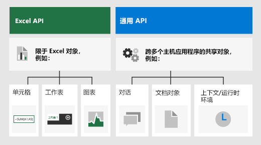
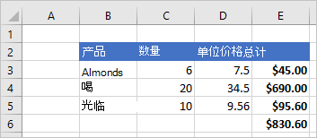
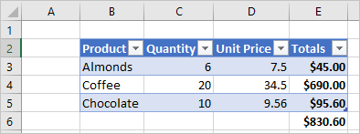
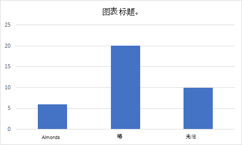

# <a name="excel-javascript-object-model-in-office-add-ins"></a>Excel 加载项中的 Word JavaScript 对象模型

本文介绍了如何使用 [Excel JavaScript API](../reference/overview/excel-add-ins-reference-overview.md) 生成 Excel 2016 或更高版本的加载项。 它引入了一些核心概念，这些概念是使用 API 的基础，并为执行特定任务提供指导，如读取或写入较大区域、更新区域内的所有单元格等等。

> [!IMPORTANT]
> 请参阅[使用特定于应用程序的 API 模型](../develop/application-specific-api-model.md)，以了解 Excel API 的异步性质以及它们如何与工作簿协同工作。  

## <a name="officejs-apis-for-excel"></a>适用于 Excel 的 Office.js API

Excel 加载项通过使用适 Office JavaScript API 与 Excel 中的对象进行交互，JavaScript API包括两个 JavaScript 对象模型：

* **Excel JavaScript API**：[Excel JavaScript API](../reference/overview/excel-add-ins-reference-overview.md) 随 Office 2016 一起引入，提供了强类型的对象，可用于访问工作表、区域、表格、图表等。

* **通用 API**：[通用 API](/javascript/api/office) 随 Office 2013 引入，可用于访问多种类型的 Office 应用程序中常见的 UI、对话框和客户端设置等功能。

你可能会使用 Excel JavaScript API 开发面向 Excel 2016 或更高版本的加载项中的大部分功能，同时还可以使用通用 API 中的对象。 例如：

* [Context](/javascript/api/office/office.context)：`Context` 对象表示加载项的运行时环境，并提供对 API 关键对象的访问权限。 它由工作簿配置详细信息（如 `contentLanguage` 和 `officeTheme`）组成，并提供有关加载项的运行时环境（如 `host` 和 `platform`）的信息。 此外，它还提供了 `requirements.isSetSupported()` 方法，可用于检查运行加载项的 Excel 应用程序是否支持指定的要求集。
* [Document](/javascript/api/office/office.document)：`Document` 对象提供 `getFileAsync()` 方法，用于下载运行加载项的 Excel 文件。

下图说明了可能使用 Excel JavaScript API 或公共 API 的情况。



## <a name="excel-specific-object-model"></a>特定于 Excel 的对象模型

若要了解 Excel API，则必须了解工作簿的各个组件之间如何相互关联。

* 一个 **Workbook** 包含一个或多个 **Worksheet**。
* **Worksheet** 包含单个工作表中存在的那些数据对象的集合，并通过 **Range** 对象访问单元格。
* **Range** 代表一组连续的单元格。
* **Range** 用于创建和放置 **Table**、**Chart** 和 **Shape** 以及其他数据可视化或组织对象。
* **Workbook** 包含整个 **Workbook** 的某些数据对象（例如，**Table**）的集合。

[!include[Excel cells and ranges note](../includes/note-excel-cells-and-ranges.md)]

### <a name="ranges"></a>Range

Range 是工作簿中的一组连续单元格。 加载项通常使用 A1 样式表示法（例如，对于 **B** 列和第 **3** 行中单个单元格，即 **B3** 或从 **C** 列至 **F** 列和第 **2** 行至第 **4** 行的单元格，即 **C2:F4**）来定义范围。

Range 具有三个核心属性：`values`、`formulas` 和 `format`。 这些属性获取或设置单元格值、要计算的公式以及单元格的视觉对象格式设置。

#### <a name="range-sample"></a>Range 示例

以下示例显示了如何创建销售记录。 此函数使用 `Range` 对象来设置值、公式和格式。

```js
Excel.run(function (context) {
    var sheet = context.workbook.worksheets.getActiveWorksheet();

    // Create the headers and format them to stand out.
    var headers = [
      ["Product", "Quantity", "Unit Price", "Totals"]
    ];
    var headerRange = sheet.getRange("B2:E2");
    headerRange.values = headers;
    headerRange.format.fill.color = "#4472C4";
    headerRange.format.font.color = "white";

    // Create the product data rows.
    var productData = [
      ["Almonds", 6, 7.5],
      ["Coffee", 20, 34.5],
      ["Chocolate", 10, 9.56],
    ];
    var dataRange = sheet.getRange("B3:D5");
    dataRange.values = productData;

    // Create the formulas to total the amounts sold.
    var totalFormulas = [
      ["=C3 * D3"],
      ["=C4 * D4"],
      ["=C5 * D5"],
      ["=SUM(E3:E5)"]
    ];
    var totalRange = sheet.getRange("E3:E6");
    totalRange.formulas = totalFormulas;
    totalRange.format.font.bold = true;

    // Display the totals as US dollar amounts.
    totalRange.numberFormat = [["$0.00"]];

    return context.sync();
});
```

此示例将在当前工作表中创建以下数据：



有关详细信息，请参阅[使用 Excel JavaScript API 设置和获取范围值、文本或公式](excel-add-ins-ranges-set-get-values.md)。

### <a name="charts-tables-and-other-data-objects"></a>Chart、Table 和其他数据对象

Excel JavaScript API 可以在 Excel 中创建和设置数据结构和可视化效果。 Table 和 Chart 是最常用的两个对象，但是 API 支持数据透视表、形状和图像等。

#### <a name="creating-a-table"></a>创建表

通过使用数据填充范围创建表。 会将格式设置和表控件（如筛选器）自动应用到该范围。

以下示例使用上一个示例中的范围创建了一个表。

```js
Excel.run(function (context) {
    var sheet = context.workbook.worksheets.getActiveWorksheet();
    sheet.tables.add("B2:E5", true);
    return context.sync();
});
```

在包含之前数据的工作表上使用此示例代码将创建下表：



有关详细信息，请参阅[使用 Excel JavaScript API 处理表格](excel-add-ins-tables.md)。

#### <a name="creating-a-chart"></a>创建图表

创建图表以直观显示某个范围内的数据。 该 API 支持数十种图表类型，每种都可以根据需要进行自定义。

下面的示例为三个项目创建一个简单的柱形图，并将其置于工作表顶部下方 100 像素处。

```js
Excel.run(function (context) {
    var sheet = context.workbook.worksheets.getActiveWorksheet();
    var chart = sheet.charts.add(Excel.ChartType.columnStacked, sheet.getRange("B3:C5"));
    chart.top = 100;
    return context.sync();
});
```

在工作表上使用上一个表运行此示例将创建以下图表：



有关详细信息，请参阅[使用 Excel JavaScript API 处理图表](excel-add-ins-charts.md)。

## <a name="see-also"></a>另请参阅

* [生成首个 Excel 加载项](../quickstarts/excel-quickstart-jquery.md)
* [Excel 加载项代码示例](https://developer.microsoft.com/office/gallery/?filterBy=Samples,Excel)
* [Excel JavaScript API 性能优化](../excel/performance.md)
* [Excel JavaScript API 参考](../reference/overview/excel-add-ins-reference-overview.md)
