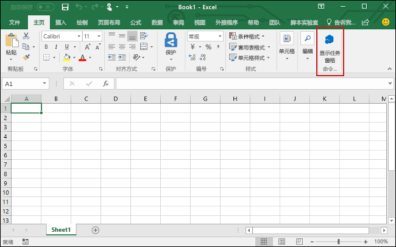

# <a name="build-an-excel-add-in-using-react"></a>使用 React 生成 Excel 加载项

在本文中，你将完成使用 React 和 Excel JavaScript API 生成 Excel 加载项的过程。

## <a name="prerequisites"></a>先决条件

如果尚未执行此操作，将需要安装以下工具：

1. 全局安装 [Create React App](https://github.com/facebookincubator/create-react-app)。

    ```bash
    npm install -g create-react-app
    ```

2. 全局安装 [Yeoman](https://github.com/yeoman/yo) 和 [Office 加载项的 Yeoman 生成器](https://github.com/OfficeDev/generator-office)。

    ```bash
    npm install -g yo generator-office
    ```

## <a name="generate-a-new-react-app"></a>生成新的 React 应用

使用 Create React App 生成 React 应用。 在终端运行以下命令：

```bash
create-react-app my-addin
```

## <a name="generate-the-manifest-file-and-sideload-the-add-in"></a>生成清单文件并旁加载加载项

每个加载项都需要用于定义其设置和功能的清单文件。

1. 转到应用程序文件夹。

    ```bash
    cd my-addin
    ```

2. 使用 Yeoman 生成器生成加载项的清单文件。 运行下面的命令，再回答提示问题，如以下屏幕截图所示：

    ```bash
    yo office
    ```
    
    >**注意**：如果提示覆盖 **package.json**，则回答 **No**（不覆盖）。

3. 打开清单文件（即应用程序根目录中名称以“manifest.xml”结尾的文件）。 将所有 `https://localhost:3000` 都替换为 `http://localhost:3000`，再保存此文件。

4. 遵循将用于运行并在 Excel 中旁加载加载项的平台所适用的说明。

    - Windows：[在 Windows 上旁加载 Office 加载项进行测试](../testing/create-a-network-shared-folder-catalog-for-task-pane-and-content-add-ins.md)
    - Excel Online：[在 Office Online 中旁加载 Office 加载项](../testing/sideload-office-add-ins-for-testing.md#sideload-an-office-add-in-on-office-online)
    - iPad 和 Mac：[在 iPad 和 Mac 上旁加载 Office 加载项](../testing/sideload-an-office-add-in-on-ipad-and-mac.md)

## <a name="update-the-app"></a>更新应用

1. 打开“public/index.html”****，紧靠 `</head>` 标记前面添加以下 `<script>` 标记，再保存此文件。

    ```html
    <script src="https://appsforoffice.microsoft.com/lib/1/hosted/office.js"></script>
    ```

2. 打开“src/index.js”****，将 `ReactDOM.render(<App />, document.getElementById('root'));` 替换为以下代码，再保存此文件。 

    ```typescript
    const Office = window.Office;
    
    Office.initialize = () => {
      ReactDOM.render(<App />, document.getElementById('root'));
    };
    ```

3. 打开“src/App.js”****，将文件内容替换为以下代码，再保存此文件。 

    ```js
    import React, { Component } from 'react';
    import './App.css';

    class App extends Component {
      constructor(props) {
        super(props);

        this.onColorMe = this.onColorMe.bind(this);
      }

      onColorMe() {
        window.Excel.run(async (context) => {
          const range = context.workbook.getSelectedRange();
          range.format.fill.color = 'green';
          await context.sync();
        });
      }

      render() {
        return (
          <div id="content">
            <div id="content-header">
              <div className="padding">
                  <h1>Welcome</h1>
              </div>
            </div>
            <div id="content-main">
              <div className="padding">
                  <p>Choose the button below to set the color of the selected range to green.</p>
                  <br />
                  <h3>Try it out</h3>
                  <button onClick={this.onColorMe}>Color Me</button>
              </div>
            </div>
          </div>
        );
      }
    }

    export default App;
    ```

4. 打开“src/App.css”****，将文件内容替换为以下 CSS 代码，再保存此文件。 

    ```css
    #content-header {
        background: #2a8dd4;
        color: #fff;
        position: absolute;
        top: 0;
        left: 0;
        width: 100%;
        height: 80px; 
        overflow: hidden;
    }

    #content-main {
        background: #fff;
        position: fixed;
        top: 80px;
        left: 0;
        right: 0;
        bottom: 0;
        overflow: auto; 
    }

    .padding {
        padding: 15px;
    }
    ```

## <a name="try-it-out"></a>试用

1. 通过终端运行以下命令，启动开发服务器。

    ```bash
    npm start
    ```

2. 在 Excel 中，依次选择“开始”****选项卡和功能区中的“显示任务窗格”****按钮，打开加载项任务窗格。

    

3. 在此任务窗格中，选择“为我设置颜色”****窗格按钮，将选定区域的颜色设置为绿色。

    

## <a name="next-steps"></a>后续步骤

祝贺你，你已使用 React 成功创建了 Excel 加载项！ 接下来，详细了解关于生成 Excel 加载项的[核心概念](excel-add-ins-core-concepts.md)。

## <a name="additional-resources"></a>其他资源

* [Excel JavaScript API 核心概念](excel-add-ins-core-concepts.md)
* [Excel 加载项代码示例](http://dev.office.com/code-samples#?filters=excel,office%20add-ins)
* [Excel JavaScript API 参考](http://dev.office.com/reference/add-ins/excel/excel-add-ins-reference-overview)
