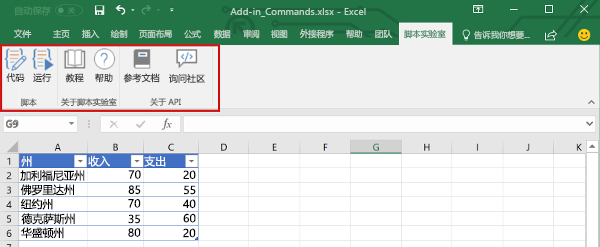
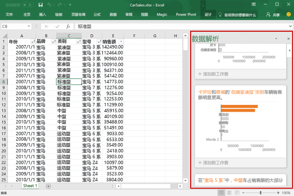
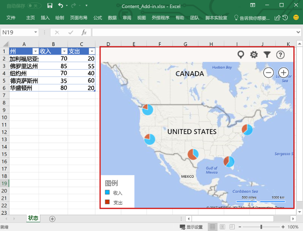

# Excel 加载项概述

使用 Excel 加载项，可以跨多个平台扩展 Excel 应用程序功能，包括 Office for Windows、Office Online、Office for Mac 和 Office for iPad。 在工作簿中使用 Excel 加载项以执行以下操作：

- 与 Excel 对象交互、读取和写入 Excel 数据。 
- 使用基于 Web 的任务窗格或内容窗格扩展功能 
- 添加自定义功能区按钮或上下文菜单项
- 使用对话框窗口提供更丰富的交互 

Office 加载项平台提供框架和 Office.js JavaScript API，使你能够创建和运行 Excel 加载项。通过使用 Office 加载项平台创建 Excel 加载项，可以获得以下好处：

* **跨平台支持**：在 Office for Windows、Mac、iOS 和 Office Online 中运行 Excel 加载项。
* **集中式部署**：管理员可以在整个组织内为用户快速而轻松地部署 Excel 加载项。
* **单一登录 (SSO)**：轻松地将 Excel 加载项与 Microsoft Graph 集成。
* **使用标准的 Web 技术**：使用熟悉的 Web 技术（如 HTML、CSS 和 JavaScript）创建 Excel 加载项。
* **通过 Office 应用商店分发**：通过将 Excel 加载项发布到 [Office 应用商店](https://store.office.com/en-us/appshome.aspx)，与广大读者共享。

> **注意**：Excel 加载项不同于 COM 和 VSTO 加载项，后者是早期的 Office 集成解决方案，仅在 Office for Windows 上运行。 与 COM 加载项不同的是，Excel 加载项不需要你在用户设备上，或在 Excel 中安装任何代码。 

## Excel 加载项的组件 

Excel 加载项包括两个基本组件：Web 应用程序和称为“清单文件”的配置文件。 

Web 应用程序使用 [Office JavaScript API](../../reference/javascript-api-for-office.md) 与 Excel 中的对象进行交互，并且还有助于与在线资源进行交互。 例如，加载项可以执行下列任意任务：

* 创建、读取、更新和删除工作簿中的数据（工作表、区域、表、图表、已命名项等）。
* 使用标准 OAuth 2.0 流通过在线服务执行用户身份验证。
* 向 Microsoft Graph 或任何其他 API 发出 API 请求。

Web 应用程序可以托管在任何 Web 服务器上，并且可以使用客户端框架（如 Angular、React、jQuery）或服务器端技术（如 ASP.NET、Node.js、PHP）进行构建。

[清单](../overview/add-in-manifests.md)是 XML 配置文件，它定义加载项如何通过指定以下设置和功能与 Office 客户端集成： 

* 加载项 Web 应用程序的 URL。
* 加载项的显示名称、说明、ID、版本和默认区域设置。
* 如何将加载项与 Excel 集成，其中包括加载项创建的任何自定义 UI（功能区按钮、上下文菜单等）。
* 加载项所需的权限，例如读取和写入文档。

若要使最终用户安装和使用 Excel 加载项，必须将其清单发布到 Office 应用商店或加载项目录。 

## Excel 加载项的功能

除了与工作簿中的内容进行交互，Excel 加载项还可以添加自定义功能区按钮或菜单命令、插入任务窗格、打开对话框，甚至在工作表中嵌入基于 Web 的丰富对象（如图表或交互式可视化效果），如下面的屏幕截图所示。 有关每个功能的详细信息，请参阅[扩展 Excel 功能](excel-add-ins-extend-excel.md)。

**自定义功能区按钮**

**任务窗格**

**对话框**

**内容加载项**

## JavaScript API 与工作簿内容交互

Excel 加载项通过使用 [Office JavaScript API](../../reference/javascript-api-for-office.md) 与 Excel 中的对象进行交互，其中包括两个 JavaScript 对象模型：

* **Excel JavaScript API**：[Excel JavaScript API](../../reference/excel/excel-add-ins-reference-overview.md) 随 Office 2016 引入，提供强类型的 Excel 对象，可用于访问工作表、区域、表、图表等。 

* **共享 API**：共享 API 随 Office 2013 引入，使用它可以访问多种类型的主机应用程序（如 Word、Excel 和 PowerPoint ）中常见的 UI、对话框和客户端设置等功能。 由于共享 API 确实为 Excel 交互提供了有限的功能，因此，如果加载项需要在 Excel 2013 上运行，则可以使用它。

## 后续步骤

通过[创建第一个 Excel 加载项](excel-add-ins-get-started-overview.md)开始使用。 接下来，了解有关生成 Excel 加载项的[核心概念](excel-add-ins-core-concepts.md)。

## 其他资源

- [Office 加载项平台概述](../overview/office-add-ins.md)
- [开发 Office 加载项的最佳做法](../overview/add-in-development-best-practices.md)
- [Office 加载项的设计准则](../design/add-in-design.md)
- [Excel JavaScript API 核心概念](excel-add-ins-core-concepts.md)
- [Excel JavaScript API 参考](../../reference/excel/excel-add-ins-reference-overview.md)
