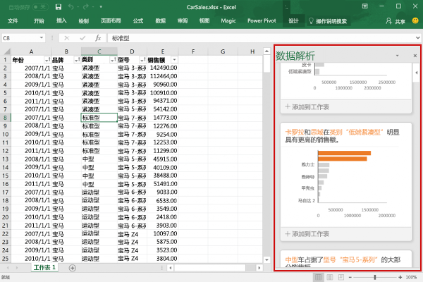
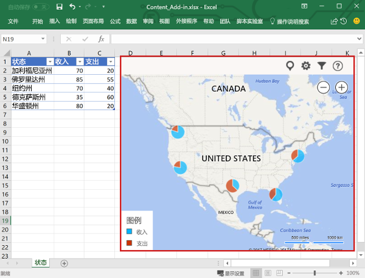

# Excel 加载项概述Excel add-ins overview

使用 Excel 加载项，可以跨多个平台（包括 Windows、Mac、iPad 和浏览器）扩展 Excel 应用程序功能。在工作簿内使用 Excel 加载项，可以：An Excel add-in allows you to extend Excel application functionality across multiple platforms including Windows, Mac, iPad, and in a browser. Use Excel add-ins within a workbook to:

- 与 Excel 对象交互、读取和写入 Excel 数据。Interact with Excel objects, read and write Excel data.
- 使用基于 Web 的任务窗格或内容窗格扩展功能Extend functionality using web based task pane or content pane
- 添加自定义功能区按钮或上下文菜单项Add custom ribbon buttons or contextual menu items
- 添加自定义函数Add custom functions
- 使用对话框窗口提供更丰富的交互Provide richer interaction using dialog window

Office 加载项平台提供框架和 Office.js JavaScript API，使你能够创建和运行 Excel 加载项。通过使用 Office 加载项平台创建 Excel 加载项，可以获得以下好处：The Office Add-ins platform provides the framework and Office.js JavaScript APIs that enable you to create and run Excel add-ins. By using the Office Add-ins platform to create your Excel add-in, you'll get the following benefits:

* **跨平台支持**：Excel 加载项在 Office 网页版、Windows 版 Office、Mac 版 Office 和 iPad 版 Office中运行。**Cross-platform support**: Excel add-ins run in Office on the web, Windows, Mac, and iPad.
* **集中式部署**：管理员可以在整个组织内为用户快速而轻松地部署 Excel 加载项。**Centralized deployment**: Admins can quickly and easily deploy Excel add-ins to users throughout an organization.
* **使用标准 Web 技术**：使用熟悉的 Web 技术（如 HTML、CSS 和 JavaScript）创建 Excel 加载项。**Use of standard web technology**: Create your Excel add-in using familiar web technologies such as HTML, CSS, and JavaScript.
* **通过 AppSource 分发**：将 Excel 加载项发布到 [AppSource](https://appsource.microsoft.com/marketplace/apps?product=office&page=1&src=office&corrid=53245fad-fcbe-41f8-9f97-b0840264f97c&omexanonuid=4a0102fb-b31a-4b9f-9bb0-39d4cc6b789d)，供广大受众使用。**Distribution via AppSource**: Share your Excel add-in with a broad audience by publishing it to [AppSource](https://appsource.microsoft.com/marketplace/apps?product=office&page=1&src=office&corrid=53245fad-fcbe-41f8-9f97-b0840264f97c&omexanonuid=4a0102fb-b31a-4b9f-9bb0-39d4cc6b789d).

> [!NOTE]
> Excel 加载项不同于 COM 和 VSTO 加载项，后者是旧 Office 集成解决方案，只能在 Windows 版 Office 上运行。与 COM 加载项不同的是，Excel 加载项不需要你在用户设备上，或在 Excel 中安装任何代码。Excel add-ins are different from COM and VSTO add-ins, which are earlier Office integration solutions that run only in Office on Windows. Unlike COM add-ins, Excel add-ins do not require you to install any code on a user's device, or within Excel.

## Excel 加载项的组件Components of an Excel add-in

Excel 加载项包括两个基本组件：Web 应用程序和称为“清单文件”的配置文件。An Excel add-in includes two basic components: a web application and a configuration file, called a manifest file. 

Web 应用程序使用 [Office JavaScript API](../reference/javascript-api-for-office.md) 与 Excel 中的对象进行交互，并且还有助于与在线资源进行交互。例如，加载项可以执行下列任意任务：The web application uses the [Office JavaScript API](../reference/javascript-api-for-office.md) to interact with objects in Excel, and can also facilitate interaction with online resources. For example, an add-in can perform any of the following tasks:

* 创建、读取、更新和删除工作簿中的数据（工作表、区域、表、图表、已命名项等）。Create, read, update, and delete data in the workbook (worksheets, ranges, tables, charts, named items, and more).
* 使用标准 OAuth 2.0 流通过在线服务执行用户身份验证。Perform user authorization with an online service by using the standard OAuth 2.0 flow.
* 向 Microsoft Graph 或任何其他 API 发出 API 请求。Issue API requests to Microsoft Graph or any other API.

Web 应用程序可以托管在任何 Web 服务器上，并且可以使用客户端框架（如 Angular、React、jQuery）或服务器端技术（如 ASP.NET、Node.js、PHP）进行构建。The web application can be hosted on any web server, and can be built using client-side frameworks (such as Angular, React, jQuery) or server-side technologies (such as ASP.NET, Node.js, PHP).

[清单](../develop/add-in-manifests.md)是 XML 配置文件，它定义加载项如何通过指定以下设置和功能与 Office 客户端集成：The [manifest](../develop/add-in-manifests.md) is an XML configuration file that defines how the add-in integrates with Office clients by specifying settings and capabilities such as:

* 加载项 Web 应用程序的 URL。The URL of the add-in's web application.
* 加载项的显示名称、说明、ID、版本和默认区域设置。The add-in's display name, description, ID, version, and default locale.
* 如何将加载项与 Excel 集成，其中包括加载项创建的任何自定义 UI（功能区按钮、上下文菜单等）。How the add-in integrates with Excel, including any custom UI that the add-in creates (ribbon buttons, context menus, and so on).
* 加载项所需的权限，如对文档执行读取和写入操作。Permissions that the add-in requires, such as reading and writing to the document.

若要让最终用户能够安装和使用 Excel 加载项，必须将它的清单发布到 AppSource 或加载项目录。To enable end users to install and use an Excel add-in, you must publish its manifest either to AppSource or to an add-ins catalog. 要详细了解如何发布到 AppSource，请参阅[将解决方案发布到 AppSource 和 Office 中](/office/dev/store/submit-to-appsource-via-partner-center)。For details about publishing to AppSource, see [Make your solutions available in AppSource and within Office](/office/dev/store/submit-to-appsource-via-partner-center).

## Excel 加载项的功能Capabilities of an Excel add-in

除了能够与工作簿内容进行交互外，Excel 加载项还可以添加自定义功能区按钮或菜单命令、插入任务窗格、添加自定义函数、打开对话框，甚至还能在工作表中嵌入基于 Web 的丰富对象（如图表或交互式可视化效果）。In addition to interacting with the content in the workbook, Excel add-ins can add custom ribbon buttons or menu commands, insert task panes, add custom functions, open dialog boxes, and even embed rich, web-based objects such as charts or interactive visualizations within a worksheet.

### 加载项命令Add-in commands

加载项命令是能够扩展 Excel UI，并在加载项中启动操作的 UI 元素。加载项命令可用于在功能区中添加按钮，也可用于向 Excel 上下文菜单中添加项。选择加载项命令后，用户便启动操作，如运行 JavaScript 代码，或在任务窗格中显示加载项页面。Add-in commands are UI elements that extend the Excel UI and start actions in your add-in. You can use add-in commands to add a button on the ribbon or an item to a context menu in Excel. When users select an add-in command, they initiate actions such as running JavaScript code, or showing a page of the add-in in a task pane. 

**加载项命令****Add-in commands**

有关命令功能、受支持的平台和开发加载项命令第最佳做法的详细信息，请参阅[适用于 Excel、Word 和 Powerpoint 的加载项命令](../design/add-in-commands.md)。For more information about command capabilities, supported platforms, and best practices for developing add-in commands, see [Add-in commands for Excel, Word, and PowerPoint](../design/add-in-commands.md).

### 任务窗格Task panes

任务窗格是接口图面，通常出现在 Excel 中窗口的右侧。使用任务窗格，用户可以访问接口控件，以运行代码来修改 Excel 文档，或显示数据源中的数据。Task panes are interface surfaces that typically appear on the right side of the window within Excel. Task panes give users access to interface controls that run code to modify the Excel document or display data from a data source. 

**任务窗格****Task pane**

有关任务窗格的详细信息，请参阅 [Office 加载项中的任务窗格](../design/task-pane-add-ins.md)。有关在 Excel 中实现任务窗格的示例，请参阅 [Excel 加载项 JS WoodGrove Expense Trends](https://github.com/OfficeDev/Excel-Add-in-WoodGrove-Expense-Trends)。For more information about task panes, see [Task panes in Office Add-ins](../design/task-pane-add-ins.md). For a sample that implements a task pane in Excel, see [Excel Add-in JS WoodGrove Expense Trends](https://github.com/OfficeDev/Excel-Add-in-WoodGrove-Expense-Trends).

### 自定义函数Custom functions

开发人员可以借助自定义函数向 Excel 添加新函数，方法是在 JavaScript 中将这些函数定义为加载项的一部分。Custom functions enable developers to add new functions to Excel by defining those functions in JavaScript as part of an add-in. Excel 中的用户可以访问自定义函数，就像他们访问 Excel 中的任何本机函数一样，比如 `SUM()`。Users within Excel can access custom functions just as they would any native function in Excel, such as `SUM()`. 

**自定义函数****Custom function**

有关自定义函数的详细信息，请参阅[在 Excel 中创建自定义函数](custom-functions-overview.md)。For more information about custom functions, see [Create custom functions in Excel](custom-functions-overview.md).

### 对话框Dialog boxes

对话框是浮动在活动的 Excel 应用程序窗口之上的界面。 可以将对话框用于以下任务，如显示无法直接在任务窗格中打开的登录页、请求用户确认操作，或托管如果局限在任务窗格中可能过小的视频。 若要在 Excel 加载项中打开对话框，请使用[对话框 API](/javascript/api/office/office.ui)。Dialog boxes are surfaces that float above the active Excel application window. You can use dialog boxes for tasks such as displaying sign-in pages that can't be opened directly in a task pane, requesting that the user confirm an action, or hosting videos that might be too small if confined to a task pane. To open dialog boxes in your Excel add-in, use the [Dialog API](/javascript/api/office/office.ui).

**对话框****Dialog box**

有关对话框和对话框 API 的详细信息，请参阅 [Office 加载项中的对话框](../design/dialog-boxes.md)和[在 Office 加载项中使用对话框 API](../develop/dialog-api-in-office-add-ins.md)。For more information about dialog boxes and the Dialog API, see [Dialog boxes in Office Add-ins](../design/dialog-boxes.md) and [Use the Dialog API in your Office Add-ins](../develop/dialog-api-in-office-add-ins.md).

### 内容加载项Content add-ins

内容加载项是可以直接嵌入到 Excel 文档中的图面。 可以使用内容加载项在工作表中嵌入基于 Web 的丰富对象，如图表、数据可视化效果或媒体，或为用户提供对界面控件的访问权限，这些控件运行代码以修改 Excel 文档，或显示来自数据源的数据。 在你要将功能直接嵌入文档时，请使用内容加载项。Content add-ins are surfaces that you can embed directly into Excel documents. You can use content add-ins to embed rich, web-based objects such as charts, data visualizations, or media into a worksheet or to give users access to interface controls that run code to modify the Excel document or display data from a data source. Use content add-ins when you want to embed functionality directly into the document.

**内容加载项****Content add-in**

有关内容加载项的详细信息，请参阅 [Office 内容加载项](../design/content-add-ins.md)。有关在 Excel 中实现内容加载项的示例，请参阅 GitHub 中的 [ Excel 内容加载项 Humongous Insurance](https://github.com/OfficeDev/Excel-Content-Add-in-Humongous-Insurance)。For more information about content add-ins, see [Content Office Add-ins](../design/content-add-ins.md). For a sample that implements a content add-in in Excel, see [Excel Content Add-in Humongous Insurance](https://github.com/OfficeDev/Excel-Content-Add-in-Humongous-Insurance) in GitHub.

## 要与工作簿内容交互的 JavaScript APIJavaScript APIs to interact with workbook content

Excel 加载项通过使用 [Office JavaScript API](../reference/javascript-api-for-office.md) 与 Excel 中的对象进行交互，JavaScript API 包括两个 JavaScript 对象模型：An Excel add-in interacts with objects in Excel by using the [Office JavaScript API](../reference/javascript-api-for-office.md), which includes two JavaScript object models:

* **Excel JavaScript API**：[Excel JavaScript API](../reference/overview/excel-add-ins-reference-overview.md) 随 Office 2016 引入，提供强类型的 Excel 对象，可用于访问工作表、区域、表、图表等。**Excel JavaScript API**: Introduced with Office 2016, the [Excel JavaScript API](../reference/overview/excel-add-ins-reference-overview.md) provides strongly-typed Excel objects that you can use to access worksheets, ranges, tables, charts, and more. 

* **通用 API**：通用 API 随 Office 2013 引入，可用于访问多种类型的 Office 应用程序中常见的 UI、对话框和客户端设置等功能。**Common API**: Introduced with Office 2013, the Common API enables you to access features such as UI, dialogs, and client settings that are common across multiple types of Office applications. 由于通用 API 确实为 Excel 交互提供了有限的功能，因此，如果加载项需要在 Excel 2013 上运行，则可以使用它。Because the Common API does provide limited functionality for Excel interaction, you can use it if your add-in needs to run on Excel 2013.

## 后续步骤Next steps

通过[创建第一个 Excel 加载项](../quickstarts/excel-quickstart-jquery.md)开始使用。Get started by [creating your first Excel add-in](../quickstarts/excel-quickstart-jquery.md). 接下来，请详细了解与生成 Excel 加载项有关的[核心概念](excel-add-ins-core-concepts.md)。Then, learn about the [core concepts](excel-add-ins-core-concepts.md) of building Excel add-ins.

## 另请参阅See also

- [Office 加载项平台概述Office Add-ins platform overview](../overview/office-add-ins.md)
- [构建 Office 加载项Building Office Add-ins](../overview/office-add-ins-fundamentals.md)
- [Excel JavaScript API 基本编程概念Fundamental programming concepts with the Excel JavaScript API](excel-add-ins-core-concepts.md)
- [Excel JavaScript API 参考Excel JavaScript API reference](../reference/overview/excel-add-ins-reference-overview.md)