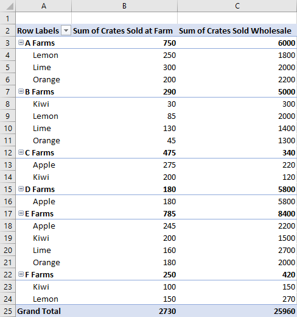

# <a name="work-with-pivottables-using-the-excel-javascript-api"></a>使用 Excel JavaScript API 处理数据透视表

数据透视表简化更大的数据集。 它们允许分组数据的快速操作。 Excel JavaScript API 允许加载项创建数据透视表并与其组件交互。 

如果不熟悉数据透视表的功能，尝试以最终用户的身份了解它们的功能。 请参阅[创建数据透视表分析工作表数据](https://support.office.com/en-us/article/Import-and-analyze-data-ccd3c4a6-272f-4c97-afbb-d3f27407fcde#ID0EAABAAA=PivotTables)，了解这些工具的入门指导。 

本文提供了常见方案的代码示例。  [Excel OpenSpec](https://github.com/OfficeDev/office-js-docs/tree/ExcelJs_OpenSpec/reference/excel)提供了此预览功能的完整参考文档。 

参阅[**数据透视表**](https://github.com/OfficeDev/office-js-docs/blob/ExcelJs_OpenSpec/reference/excel/pivottable.md)和[**PivotTableCollection**](https://github.com/OfficeDev/office-js-docs/blob/ExcelJs_OpenSpec/reference/excel/pivottablecollection.md)，加深对 PivotTable API 的理解。

> [!NOTE]
> 这些示例使用了当前仅在公开预览版（beta 版）中适用的 API 。 这些示例需要预览版本运行。 使用[Office.js CDN](https://appsforoffice.microsoft.com/lib/beta/hosted/office.js)的 beta 版库或者参加[Office 预览体验计划](https://products.office.com/office-insider)。 当前 16.0.10801.20004 版提供数据透视表功能。

## <a name="hierarchies"></a>层次结构

数据透视表基于四种层次结构类别构成：行、列、数据和筛选器。 本文将通篇使用以下描述各农场水果销售情况的数据。


此数据具有五个层次结构：**农场**、**类型**、**分类**、 **农场销售箱数**，和**批发箱数**。 每个层次结构只能存在于四个类别中的一个类别。 如果**类型**添加到列层次结构，然后又添加到行层次结构，则其仅保留至后者。

行和列的层次结构定义如何分组数据。 例如，**农场**的行层次结构会将来自同一农场的所有数据集归集在一起。 选择行和列层次结构来定义数据透视表的方向。

数据层次结构是基于行和列层次结构进行聚合的值。 具有**农场**的行层次结构和**批发箱数**的数据层次结构的数据透视表显示每个农场所有不同水果的总和（默认）。

筛选器层次结构基于已筛选类型中的值包含或排除来自透视的数据。 选择了**有机**类型的**分类**筛选器层次结构仅显示有机水果的数据。

这还是农场数据，一旁是数据透视表。 数据透视表使用 **农场**和**类型**作为行层次结构，**农场销售箱数**和**批发箱数**作为数据层次结构 （默认总和的聚合函数），**分类**作为筛选器层次结构（选中**有机**）。 


可通过 JavaScript API 或通过 Excel UI 生成这个数据透视表。 两个选项均可通过加载项实现进一步的操作。

## <a name="create-a-pivottable"></a>创建数据透视表

数据透视表需要有名称、源和目标。 源可以是范围地址或表名（作为`Range`、`string`或`Table`类型传递）。 目标是某一范围地址（作为`Range` 或 `string`给定）。 以下示例显示各种数据透视表的创建技术。

### <a name="create-a-pivottable-with-range-addresses"></a>创建带范围地址的数据透视表

```typescript
await Excel.run(async (context) => {
    // creating a PivotTable named "Farm Sales" created on the current worksheet at cell A22 with data from the range A1:E21
    context.workbook.worksheets.getActiveWorksheet()
        .pivotTables.add("Farm Sales", "A1:E21", "A22");

    await context.sync();
});
```

### <a name="create-a-pivottable-with-range-objects"></a>创建带范围对象的数据透视表

```typescript
await Excel.run(async (context) => {    
    // creating a PivotTable named "Farm Sales" on a worksheet called "PivotWorksheet" at cell A2
    // the data comes from the worksheet "DataWorksheet" across the range A1:E21
    const rangeToAnalyze = context.workbook.worksheets.getItem("DataWorksheet").getRange("A1:E21");
    const rangeToPlacePivot = context.workbook.worksheets.getItem("PivotWorksheet").getRange("A2");
    context.workbook.worksheets.getItem("PivotWorksheet").pivotTables.add("Farm Sales", rangeToAnalyze, rangeToPlacePivot);
    
    await context.sync();
});
```

### <a name="create-a-pivottable-at-the-workbook-level"></a>在工作簿级别创建数据透视表

```typescript
await Excel.run(async (context) => {
    // creating a PivotTable named "Farm Sales" on a worksheet called "PivotWorksheet" at cell A2
    // the data is from the worksheet "DataWorksheet" across the range A1:E21
    context.workbook.pivotTables.add("Farm Sales", "DataWorksheet!A1:E21", "PivotWorksheet!A2");

    await context.sync();
});
```

## <a name="use-an-existing-pivottable"></a>使用现有数据透视表

手动创建的数据透视表亦可通过工作簿或者单个工作表的数据透视表集合进行访问。 

以下代码获取工作簿中的第一个数据透视表。 然后给出了表的名称，便于以后参考。

```typescript
await Excel.run(async (context) => {
    const pivotTable = context.workbook.pivotTables.getItem("My Pivot");
    await context.sync();
});
```

## <a name="add-rows-and-columns-to-a-pivottable"></a>向数据透视表添加行和列

行和列透视与那些字段值相关的数据。

添加 **农场**列透视每个农场的所有销售情况。 添加**类型**和**分类**行，可基于销售的水果以及该水果是否为有机等条件而将数据作进一步的分解。


```typescript
await Excel.run(async (context) => {
    const pivotTable = context.workbook.worksheets.getActiveWorksheet().pivotTables.getItem("Farm Sales");

    pivotTable.rowHierarchies.add(pivotTable.hierarchies.getItem("Type"));
    pivotTable.rowHierarchies.add(pivotTable.hierarchies.getItem("Classification"));
    
    pivotTable.columnHierarchies.add(pivotTable.hierarchies.getItem("Farm"));

    await context.sync();
});
```

还可拥有仅带行或列的数据透视表。

```typescript
await Excel.run(async (context) => {
    const pivotTable = context.workbook.worksheets.getActiveWorksheet().pivotTables.getItem("Farm Sales");
    pivotTable.rowHierarchies.add(pivotTable.hierarchies.getItem("Farm"));
    pivotTable.rowHierarchies.add(pivotTable.hierarchies.getItem("Type"));
    pivotTable.rowHierarchies.add(pivotTable.hierarchies.getItem("Classification"));
    
    await context.sync();
});
```

## <a name="add-data-hierarchies-to-the-pivottable"></a>向数据透视表添加数据层次结构

基于行和列，数据层次结构结合信息填充数据透视表。 添加**农场销售箱数**和**批发箱数**的数据层次结构给出每行和每列数字的总和。 

在示例中，**农场**和**类型**都是行，销售箱数作为数据。 



```typescript
await Excel.run(async (context) => {
    const pivotTable = context.workbook.worksheets.getActiveWorksheet().pivotTables.getItem("Farm Sales");

    // "Farm" and "Type" are the hierarchies on which the aggregation is based
    pivotTable.rowHierarchies.add(pivotTable.hierarchies.getItem("Farm"));
    pivotTable.rowHierarchies.add(pivotTable.hierarchies.getItem("Type"));

    // "Crates Sold at Farm" and "Crates Sold Wholesale" are the heirarchies that will have their data aggregated (summed in this case)
    pivotTable.dataHierarchies.add(pivotTable.hierarchies.getItem("Crates Sold at Farm"));
    pivotTable.dataHierarchies.add(pivotTable.hierarchies.getItem("Crates Sold Wholesale"));

    await context.sync();
});
```

## <a name="change-aggregation-function"></a>更改聚合函数

数据层次结构将其数值聚合。 对于数字的数据集，默认情况下，这是总和。  `summarizeBy` 属性基于类型定义此行为 `AggregrationFunction`。 

当前支持的聚合函数类型为`Sum`、`Count`、`Average`、`Max` `Min`、`Product`、`CountNumbers`、`StandardDeviation`、`StandardDeviationP`、`Variance`、`VarianceP`和`Automatic` （默认）。

以下代码示例更改了数据平均值的聚合。

```typescript
    await Excel.run(async (context) => {
        const pivotTable = context.workbook.worksheets.getActiveWorksheet().pivotTables.getItem("Farm Sales");
        pivotTable.dataHierarchies.load("no-properties-needed");
        await context.sync();

        // changing the aggregation from the default sum to an average of all the values in the hierarchy
        pivotTable.dataHierarchies.items[0].summarizeBy = Excel.AggregationFunction.average;
        pivotTable.dataHierarchies.items[1].summarizeBy = Excel.AggregationFunction.average;
        await context.sync();
    });
```

## <a name="pivottable-layouts"></a>数据透视表布局

数据透视表布局定义层次结构及其数据的位置。 访问布局来确定存储数据区域的范围。 

下图显示了哪个布局函数调用对应哪个数据透视表范围。


下面的代码演示了如何通过布局获取数据透视表数据的最后一行。 然后对这些值求和获得总计。


```typescript
    await Excel.run(async (context) => {
        const pivotTable = context.workbook.worksheets.getActiveWorksheet().pivotTables.getItem("Farm Sales");
        
        // get the totals for each data hierarchy from the layout
        const range = pivotTable.layout.getDataBodyRange();
        const grandTotalRange = range.getLastRow();
        grandTotalRange.load("address");
        await context.sync();
        
        // sum the totals from the PivotTable data hierarchies and place them in a new range
        const masterTotalRange = context.workbook.worksheets.getActiveWorksheet().getRange("B27:C27");
        masterTotalRange.formulas = [["All Crates", "=SUM(" + grandTotalRange.address + ")"]];
        await context.sync();
    });
```

数据透视表有三种布局样式：压缩、大纲和表格。 在上面的示例中我们看到过压缩样式。 

下面的示例分别使用大纲和表格样式。 代码示例显示如何在不同的布局之间转换。

### <a name="outline-layout"></a>大纲版式


### <a name="tabular-layout"></a>表格版式


```typescript
await Excel.run(async (context) => {
    const pivotTable = context.workbook.worksheets.getActiveWorksheet().pivotTables.getItem("Farm Sales");
    pivotTable.layout.load("layoutType");
    await context.sync();
    
    // cycling through layout styles
    if (pivotTable.layout.layoutType === "Compact") {
        pivotTable.layout.layoutType = "Outline";
    } else if (pivotTable.layout.layoutType === "Outline") {
        pivotTable.layout.layoutType = "Tabular";
    } else {
        pivotTable.layout.layoutType = "Compact";
    }
    
    await context.sync();
});
```

## <a name="change-hierarchy-names"></a>更改层次结构名称

层次结构字段为可编辑。 下面的代码演示如何交换两个数据层次结构的显示名称。

```typescript
await Excel.run(async (context) => {
    const dataHierarchies = context.workbook.worksheets.getActiveWorksheet()
        .pivotTables.getItem("Farm Sales").dataHierarchies;
    dataHierarchies.load("no-properties-needed");
    await context.sync();
    
    // changing the displayed names of these entries
    dataHierarchies.items[0].name = "Farm Sales";
    dataHierarchies.items[1].name = "Wholesale";
    await context.sync();
});
```

## <a name="delete-a-pivottable"></a>删除数据透视表

使用数据透视表的名称删除数据透视表。

```typescript
await Excel.run(async (context) => {
    context.workbook.worksheets.getItem("Pivot").pivotTables.getItem("Farm Sales").delete();

    await context.sync();
});
```

> [!NOTE]
> 欢迎对我们的预览设计提出反馈意见。 如果对新的数据透视表 API 有评论、建议或问题，请在 [UserVoice](https://officespdev.uservoice.com/forums/224641-feature-requests-and-feedback?category_id=163563) 或 [OpenSpec GitHub repo](https://github.com/OfficeDev/office-js-docs/tree/ExcelJs_OpenSpec)上留下评论。
