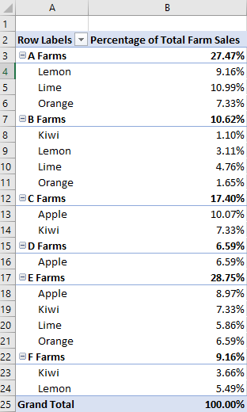

# <a name="work-with-pivottables-using-the-excel-javascript-api"></a>使用 Excel JavaScript API 处理数据透视表

数据透视表精简了较大的数据集。 它们允许快速操作分组数据。 Excel JavaScript API 允许你的外接程序创建数据透视表并与其组件进行交互。 本文介绍了 Office JavaScript API 如何表示数据透视表，并提供了主要方案的代码示例。

如果您对数据透视表的功能不熟悉，请考虑将其作为最终用户来浏览。
有关这些工具的最佳入门知识，请参阅[创建数据透视表以分析工作表数据](https://support.office.com/article/Import-and-analyze-data-ccd3c4a6-272f-4c97-afbb-d3f27407fcde#ID0EAABAAA=PivotTables)。

> [!IMPORTANT]
> 目前不支持使用 OLAP 创建的数据透视表。 此外，也不支持 Power Pivot。

## <a name="object-model"></a>对象模型

[数据透视表](/javascript/api/excel/excel.pivottable)是 OFFICE JavaScript API 中数据透视表的中心对象。

- `Workbook.pivotTables`并且 `Worksheet.pivotTables` 是分别在工作簿和工作表中包含[数据透视](/javascript/api/excel/excel.pivottable)表的[PivotTableCollections](/javascript/api/excel/excel.pivottablecollection) 。
- [数据透视表](/javascript/api/excel/excel.pivottable)包含具有多个[PivotHierarchies](/javascript/api/excel/excel.pivothierarchy)的[PivotHierarchyCollection](/javascript/api/excel/excel.pivothierarchycollection) 。
- 可以将这些[PivotHierarchies](/javascript/api/excel/excel.pivothierarchy)添加到特定的层次结构集合，以定义数据透视表透视数据的方式（如[以下部分](#hierarchies)所述）。
- [PivotHierarchy](/javascript/api/excel/excel.pivothierarchy)包含一个仅具有一个[透视字段](/javascript/api/excel/excel.pivotfield)的[PivotFieldCollection](/javascript/api/excel/excel.pivotfieldcollection) 。 如果设计扩展以包含 OLAP 数据透视表，则可能会发生更改。
- [透视字段](/javascript/api/excel/excel.pivotfield)包含具有多个[PivotItems](/javascript/api/excel/excel.pivotitem)的[PivotItemCollection](/javascript/api/excel/excel.pivotitemcollection) 。
- [数据透视表](/javascript/api/excel/excel.pivottable)包含一个[PivotLayout](/javascript/api/excel/excel.pivotlayout) ，用于定义在工作表中显示[透视字段](/javascript/api/excel/excel.pivotfield)和[PivotItems](/javascript/api/excel/excel.pivotitem)的位置。

让我们来看看这些关系如何应用于一些示例数据。 以下数据介绍了来自不同服务器场的水果销售。 本主题将是本文中的示例。


此水果可使用的销售数据将用于制作数据透视表。 每个列（例如 "**类型**"）是 `PivotHierarchy` 。 "**类型**" 层次结构包含 "**类型**" 字段。 "**类型**" 字段包含**苹果**、 **Kiwi**、**柠檬**、**酸**橙色和**橙色**的项。

### <a name="hierarchies"></a>Hierarchies

数据透视表基于四种层次结构类别进行组织：[行](/javascript/api/excel/excel.rowcolumnpivothierarchy)、[列](/javascript/api/excel/excel.rowcolumnpivothierarchy)、[数据](/javascript/api/excel/excel.datapivothierarchy)和[筛选器](/javascript/api/excel/excel.filterpivothierarchy)。

前面显示的服务器场数据具有五个层次**结构：服务器场、****类型**、**分类**、**服务器场中销售的 Crates**和**Crates 销售批发**。 每个层次结构只能存在于四个类别之一中。 如果**Type**添加到列层次结构，则它不能也在行、数据或筛选器层次结构中。 如果**类型**随后添加到行层次结构中，则会将其从列层次结构中删除。 无论是通过 Excel UI 还是 Excel JavaScript Api 执行层次结构分配，此行为都相同。

行和列层次结构定义数据的分组方式。 例如，**服务器场**的行层次结构将把来自同一个服务器场的所有数据集组合在一起。 在行和列层次结构之间进行选择，以定义数据透视表的方向。

数据层次结构是要根据行和列层次结构聚合的值。 具有**服务器场**的行层次结构和**Crates 销售**的数据层次结构的数据透视表显示每个服务器场的所有不同 fruits 的总和总计（默认值）。

筛选器层次结构基于该筛选类型中的值包括或排除数据透视表中的数据。 选定类型为 "**有机**" 的**分类**筛选器层次结构仅显示用于随机水果的数据。

下面是数据透视表旁边的服务器场数据。 数据透视表使用**服务器场**和**类型**作为行层次结构， **Crates 在服务器场**和**Crates 销售批发**作为数据层次结构（具有 sum 的默认聚合函数）和**分类**作为筛选器层次结构（带有**随机**选择的）。


此数据透视表可通过 JavaScript API 或 Excel UI 生成。 这两个选项都允许通过外接程序进行进一步操作。

## <a name="create-a-pivottable"></a>创建数据透视表

数据透视表需要名称、源和目标。 源可以是区域地址或表名称（作为 `Range` 、 `string` 或 `Table` 类型传递）。 目标是区域地址（指定为 `Range` 或 `string` ）。
下面的示例展示了各种数据透视表创建技术。

### <a name="create-a-pivottable-with-range-addresses"></a>创建包含区域地址的数据透视表

```js
Excel.run(function (context) {
    // Create a PivotTable named "Farm Sales" on the current worksheet at cell
    // A22 with data from the range A1:E21.
    context.workbook.worksheets.getActiveWorksheet().pivotTables.add(
      "Farm Sales", "A1:E21", "A22");

    return context.sync();
});
```

### <a name="create-a-pivottable-with-range-objects"></a>创建包含 Range 对象的数据透视表

```js
Excel.run(function (context) {
    // Create a PivotTable named "Farm Sales" on a worksheet called "PivotWorksheet" at cell A2
    // the data comes from the worksheet "DataWorksheet" across the range A1:E21.
    var rangeToAnalyze = context.workbook.worksheets.getItem("DataWorksheet").getRange("A1:E21");
    var rangeToPlacePivot = context.workbook.worksheets.getItem("PivotWorksheet").getRange("A2");
    context.workbook.worksheets.getItem("PivotWorksheet").pivotTables.add(
      "Farm Sales", rangeToAnalyze, rangeToPlacePivot);

    return context.sync();
});
```

### <a name="create-a-pivottable-at-the-workbook-level"></a>在工作簿级别创建数据透视表

```js
Excel.run(function (context) {
    // Create a PivotTable named "Farm Sales" on a worksheet called "PivotWorksheet" at cell A2
    // the data is from the worksheet "DataWorksheet" across the range A1:E21.
    context.workbook.pivotTables.add(
        "Farm Sales", "DataWorksheet!A1:E21", "PivotWorksheet!A2");

    return context.sync();
});
```

## <a name="use-an-existing-pivottable"></a>使用现有数据透视表

手动创建的数据透视表也可通过工作簿或单个工作表的数据透视表集合进行访问。 下面的代码从工作簿中获取名为 **"我的透视**表" 的数据透视表。

```js
Excel.run(function (context) {
    var pivotTable = context.workbook.pivotTables.getItem("My Pivot");
    return context.sync();
});
```

## <a name="add-rows-and-columns-to-a-pivottable"></a>向数据透视表添加行和列

数据透视这些字段的值周围的行和列。

添加 "**服务器场**" 列将每个服务器场的所有销售额枢轴分布。 添加 "**类型**" 和 "**分类**" 行会根据所售的水果和是否为 "有随机" 来进一步细分数据。


```js
Excel.run(function (context) {
    var pivotTable = context.workbook.worksheets.getActiveWorksheet().pivotTables.getItem("Farm Sales");

    pivotTable.rowHierarchies.add(pivotTable.hierarchies.getItem("Type"));
    pivotTable.rowHierarchies.add(pivotTable.hierarchies.getItem("Classification"));

    pivotTable.columnHierarchies.add(pivotTable.hierarchies.getItem("Farm"));

    return context.sync();
});
```

您还可以拥有仅包含行或列的数据透视表。

```js
Excel.run(function (context) {
    var pivotTable = context.workbook.worksheets.getActiveWorksheet().pivotTables.getItem("Farm Sales");
    pivotTable.rowHierarchies.add(pivotTable.hierarchies.getItem("Farm"));
    pivotTable.rowHierarchies.add(pivotTable.hierarchies.getItem("Type"));
    pivotTable.rowHierarchies.add(pivotTable.hierarchies.getItem("Classification"));

    return context.sync();
});
```

## <a name="add-data-hierarchies-to-the-pivottable"></a>向数据透视表中添加数据层次结构

数据层次结构使用要基于行和列进行组合的信息填充数据透视表。 添加 Crates 的数据层次结构**在服务器场**和**Crates**售出销售批发为每个行和列提供这些数字的总和。

在示例中，"**服务器场**" 和 "**类型**" 都是行，而 "发货箱销售额" 作为数据。


```js
Excel.run(function (context) {
    var pivotTable = context.workbook.worksheets.getActiveWorksheet().pivotTables.getItem("Farm Sales");

    // "Farm" and "Type" are the hierarchies on which the aggregation is based.
    pivotTable.rowHierarchies.add(pivotTable.hierarchies.getItem("Farm"));
    pivotTable.rowHierarchies.add(pivotTable.hierarchies.getItem("Type"));

    // "Crates Sold at Farm" and "Crates Sold Wholesale" are the hierarchies
    // that will have their data aggregated (summed in this case).
    pivotTable.dataHierarchies.add(pivotTable.hierarchies.getItem("Crates Sold at Farm"));
    pivotTable.dataHierarchies.add(pivotTable.hierarchies.getItem("Crates Sold Wholesale"));

    return context.sync();
});
```

## <a name="pivottable-layouts-and-getting-pivoted-data"></a>数据透视表布局和获取透视数据

[PivotLayout](/javascript/api/excel/excel.pivotlayout)定义层次结构及其数据的位置。 您可以访问布局以确定存储数据的区域。

下图显示了哪些布局函数调用对应于数据透视表的区域。


### <a name="get-data-from-the-pivottable"></a>从数据透视表中获取数据

布局定义了数据透视表在工作表中的显示方式。 这意味着 `PivotLayout` 对象控制用于数据透视表元素的区域。 使用由布局提供的区域来获取由数据透视表收集和聚合的数据。 尤其是，使用 `PivotLayout.getDataBodyRange` 可访问数据透视表所生成的内容。

下面的代码演示如何通过布局来获取数据透视表数据的最后一行（**在服务器场中售出的 Crates 总和**和在前面的示例中**销售**的**Crates**的总和）。 然后，将这些值汇总到一起，以得到最终总计，显示在单元格**E30** （数据透视表外部）中。

```js
Excel.run(function (context) {
    var pivotTable = context.workbook.worksheets.getActiveWorksheet().pivotTables.getItem("Farm Sales");

    // Get the totals for each data hierarchy from the layout.
    var range = pivotTable.layout.getDataBodyRange();
    var grandTotalRange = range.getLastRow();
    grandTotalRange.load("address");
    return context.sync().then(function () {
        // Sum the totals from the PivotTable data hierarchies and place them in a new range, outside of the PivotTable.
        var masterTotalRange = context.workbook.worksheets.getActiveWorksheet().getRange("E30");
        masterTotalRange.formulas = [["=SUM(" + grandTotalRange.address + ")"]];
    });
});
```

### <a name="layout-types"></a>布局类型

数据透视表具有三种布局样式：紧凑、大纲和表格。 我们在前面的示例中看到了压缩样式。

下面的示例分别使用大纲样式和表格样式。 此代码示例演示如何在不同的布局之间循环。

#### <a name="outline-layout"></a>大纲布局


#### <a name="tabular-layout"></a>表格布局


## <a name="delete-a-pivottable"></a>删除数据透视表

使用它们的名称删除数据透视表。

```js
Excel.run(function (context) {
    context.workbook.worksheets.getItem("Pivot").pivotTables.getItem("Farm Sales").delete();
    return context.sync();
});
```

## <a name="slicers"></a>切片器

[切片](/javascript/api/excel/excel.slicer)器允许从 Excel 数据透视表或表中筛选数据。 切片器使用指定的列或透视字段中的值筛选相应的行。 这些值存储为中的[SlicerItem](/javascript/api/excel/excel.sliceritem)对象 `Slicer` 。 你的外接程序可以按照用户（[通过 EXCEL UI](https://support.office.com/article/Use-slicers-to-filter-data-249f966b-a9d5-4b0f-b31a-12651785d29d)）的方式调整这些筛选器。 切片器位于绘图层中的工作表的顶部，如以下屏幕截图所示。


> [!NOTE]
> 本节中介绍的技术重点介绍如何使用连接到数据透视表的切片器。 同样的技术也适用于使用连接到表的切片器。

### <a name="create-a-slicer"></a>创建切片器

您可以使用方法或方法在工作簿或工作表中创建切片器 `Workbook.slicers.add` `Worksheet.slicers.add` 。 这样做会将切片器添加[SlicerCollection](/javascript/api/excel/excel.slicercollection)到指定 `Workbook` 对象或对象的 SlicerCollection `Worksheet` 。 该 `SlicerCollection.add` 方法具有三个参数：

- `slicerSource`：新切片器所基于的数据源。 它可以是 `PivotTable` 、或 `Table` 字符串，代表或的名称或 ID `PivotTable` `Table` 。
- `sourceField`：要作为筛选依据的数据源中的字段。 它可以是 `PivotField` 、或 `TableColumn` 字符串，代表或的名称或 ID `PivotField` `TableColumn` 。
- `slicerDestination`：将在其中创建新切片器的工作表。 它可以是一个对象，也可以是的 `Worksheet` 名称或 ID `Worksheet` 。 通过访问时，此参数是不必要的 `SlicerCollection` `Worksheet.slicers` 。 在这种情况下，集合的工作表将用作目标。

下面的代码示例向**数据透视**表中添加一个新的切片器。 切片器的源是**服务器场销售**数据透视表和使用**类型**数据的筛选器。 切片器也称为**水果切片器**，以供将来参考。

```js
Excel.run(function (context) {
    var sheet = context.workbook.worksheets.getItem("Pivot");
    var slicer = sheet.slicers.add(
        "Farm Sales" /* The slicer data source. For PivotTables, this can be the PivotTable object reference or name. */,
        "Type" /* The field in the data to filter by. For PivotTables, this can be a PivotField object reference or ID. */
    );
    slicer.name = "Fruit Slicer";
    return context.sync();
});
```

### <a name="filter-items-with-a-slicer"></a>使用切片器筛选项目

切片器使用中的项筛选数据透视表 `sourceField` 。 该 `Slicer.selectItems` 方法将设置切片器中保留的项。 这些项作为 a 传递给方法 `string[]` ，表示项的键。 包含这些项目的任何行仍保留在数据透视表的聚合中。 随后调用 `selectItems` 将列表设置为在这些调用中指定的键。

> [!NOTE]
> 如果 `Slicer.selectItems` 向传递的项不在数据源中，则 `InvalidArgument` 会引发错误。 可以通过属性来验证内容 `Slicer.slicerItems` ，这是[SlicerItemCollection](/javascript/api/excel/excel.sliceritemcollection)。

下面的代码示例显示为切片器选择了三个项目：**柠檬**、**酸橙色**和**橙色**。

```js
Excel.run(function (context) {
    var slicer = context.workbook.slicers.getItem("Fruit Slicer");
    // Anything other than the following three values will be filtered out of the PivotTable for display and aggregation.
    slicer.selectItems(["Lemon", "Lime", "Orange"]);
    return context.sync();
});
```

若要从切片器中删除所有筛选器，请使用 `Slicer.clearFilters` 方法，如下面的示例所示。

```js
Excel.run(function (context) {
    var slicer = context.workbook.slicers.getItem("Fruit Slicer");
    slicer.clearFilters();
    return context.sync();
});
```

### <a name="style-and-format-a-slicer"></a>为切片器设置样式和格式

您的外接可以通过属性调整切片器的显示设置 `Slicer` 。 下面的代码示例将样式设置为**SlicerStyleLight6**，将切片器顶部的文本设置为**水果类型**，将切片器放置在绘图层上的位置 **（395，15）** ，并将切片器的大小设置为**135x150**像素。

```js
Excel.run(function (context) {
    var slicer = context.workbook.slicers.getItem("Fruit Slicer");
    slicer.caption = "Fruit Types";
    slicer.left = 395;
    slicer.top = 15;
    slicer.height = 135;
    slicer.width = 150;
    slicer.style = "SlicerStyleLight6";
    return context.sync();
});
```

### <a name="delete-a-slicer"></a>删除切片器

若要删除切片器，请调用 `Slicer.delete` 方法。 下面的代码示例从当前工作表中删除第一个切片器。

```js
Excel.run(function (context) {
    var sheet = context.workbook.worksheets.getActiveWorksheet();
    sheet.slicers.getItemAt(0).delete();
    return context.sync();
});
```

## <a name="change-aggregation-function"></a>更改聚合函数

数据层次结构的值已聚合。 对于数字的数据集，默认情况下，这是一个总和。 该 `summarizeBy` 属性基于[AggregationFunction](/javascript/api/excel/excel.aggregationfunction)类型定义此行为。

当前支持的聚合函数类型为、、、、、、、、、、 `Sum` `Count` `Average` `Max` `Min` `Product` `CountNumbers` `StandardDeviation` `StandardDeviationP` `Variance` `VarianceP` 和 `Automatic` （默认值）。

下面的代码示例将聚合更改为数据的平均值。

```js
Excel.run(function (context) {
    var pivotTable = context.workbook.worksheets.getActiveWorksheet().pivotTables.getItem("Farm Sales");
    pivotTable.dataHierarchies.load("no-properties-needed");
    return context.sync().then(function() {

        // Change the aggregation from the default sum to an average of all the values in the hierarchy.
        pivotTable.dataHierarchies.items[0].summarizeBy = Excel.AggregationFunction.average;
        pivotTable.dataHierarchies.items[1].summarizeBy = Excel.AggregationFunction.average;
        return context.sync();
    });
});
```

## <a name="change-calculations-with-a-showasrule"></a>使用 ShowAsRule 更改计算

默认情况下，数据透视表将单独聚合其行和列层次结构的数据。 [ShowAsRule](/javascript/api/excel/excel.showasrule)将数据层次结构更改为基于数据透视表中的其他项的输出值。

`ShowAsRule`对象具有三个属性：

- `calculation`：要应用于数据层次结构的相对计算的类型（默认值为 `none` ）。
- `baseField`：在应用计算之前包含基础数据的层次结构中的[透视字段](/javascript/api/excel/excel.pivotfield)。 由于 Excel 数据透视表的层次结构与字段的一对一映射，因此将使用相同的名称来访问层次结构和字段。
- `baseItem`：个人[PivotItem](/javascript/api/excel/excel.pivotitem)根据计算类型与基本字段的值进行比较。 并非所有计算都需要此字段。

以下示例将场数据层次结构中的 " **Crates**总数" 的计算设置为列总计的百分比。
我们仍希望将粒度扩展到水果类型级别，因此我们将使用**类型**行层次结构及其基础字段。
该示例还将**服务器场**作为第一个行的层次结构，因此服务器场总数将显示每个服务器场也负责生成的百分比。



```js
Excel.run(function (context) {
    var pivotTable = context.workbook.worksheets.getActiveWorksheet().pivotTables.getItem("Farm Sales");
    var farmDataHierarchy = pivotTable.dataHierarchies.getItem("Sum of Crates Sold at Farm");

    farmDataHierarchy.load("showAs");
    return context.sync().then(function () {

        // Show the crates of each fruit type sold at the farm as a percentage of the column's total.
        var farmShowAs = farmDataHierarchy.showAs;
        farmShowAs.calculation = Excel.ShowAsCalculation.percentOfColumnTotal;
        farmShowAs.baseField = pivotTable.rowHierarchies.getItem("Type").fields.getItem("Type");
        farmDataHierarchy.showAs = farmShowAs;
        farmDataHierarchy.name = "Percentage of Total Farm Sales";
    });
});
```

上面的示例将计算设置为相对于单个行层次结构的字段的列。 当计算与单个项目相关时，请使用 `baseItem` 属性。

下面的示例演示了 `differenceFrom` 计算。 它显示场中相对于**服务器场**中的销售数据层次结构条目的不同之处。
`baseField`是**服务器场**，因此我们看到其他服务器场之间的差异，以及每种类型的类似水果（在此示例中**类型**也是行层次结构）的细目。


```js
Excel.run(function (context) {
    var pivotTable = context.workbook.worksheets.getActiveWorksheet().pivotTables.getItem("Farm Sales");
    var farmDataHierarchy = pivotTable.dataHierarchies.getItem("Sum of Crates Sold at Farm");

    farmDataHierarchy.load("showAs");
    return context.sync().then(function () {
        // Show the difference between crate sales of the "A Farms" and the other farms.
        // This difference is both aggregated and shown for individual fruit types (where applicable).
        var farmShowAs = farmDataHierarchy.showAs;
        farmShowAs.calculation = Excel.ShowAsCalculation.differenceFrom;
        farmShowAs.baseField = pivotTable.rowHierarchies.getItem("Farm").fields.getItem("Farm");
        farmShowAs.baseItem = pivotTable.rowHierarchies.getItem("Farm").fields.getItem("Farm").items.getItem("A Farms");
        farmDataHierarchy.showAs = farmShowAs;
        farmDataHierarchy.name = "Difference from A Farms";
    });
});
```

## <a name="change-hierarchy-names"></a>更改层次结构名称

层次结构字段是可编辑的。 下面的代码演示如何更改两个数据层次结构的显示名称。

```js
Excel.run(function (context) {
    var dataHierarchies = context.workbook.worksheets.getActiveWorksheet()
        .pivotTables.getItem("Farm Sales").dataHierarchies;
    dataHierarchies.load("no-properties-needed");
    return context.sync().then(function () {
        // changing the displayed names of these entries
        dataHierarchies.items[0].name = "Farm Sales";
        dataHierarchies.items[1].name = "Wholesale";
    });
});
```

## <a name="see-also"></a>另请参阅

- [Excel JavaScript API 基本编程概念](excel-add-ins-core-concepts.md)
- [Excel JavaScript API 参考](/javascript/api/excel)
