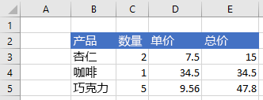

# <a name="clear-or-delete-ranges-using-the-excel-javascript-api"></a><span data-ttu-id="dbc67-103">使用 JavaScript API 清除或删除Excel区域</span><span class="sxs-lookup"><span data-stu-id="dbc67-103">Clear or delete ranges using the Excel JavaScript API</span></span>

<span data-ttu-id="dbc67-104">本文提供的代码示例使用 JavaScript API 清除和删除Excel区域。</span><span class="sxs-lookup"><span data-stu-id="dbc67-104">This article provides code samples that clear and delete ranges with the Excel JavaScript API.</span></span> <span data-ttu-id="dbc67-105">有关对象支持的属性和方法的完整 `Range` 列表，请参阅[Excel。Range 类](/javascript/api/excel/excel.range)。</span><span class="sxs-lookup"><span data-stu-id="dbc67-105">For the complete list of properties and methods supported by the `Range` object, see [Excel.Range class](/javascript/api/excel/excel.range).</span></span>

[!include[Excel cells and ranges note](../includes/note-excel-cells-and-ranges.md)]

## <a name="clear-a-range-of-cells"></a><span data-ttu-id="dbc67-106">清除多个单元格内容</span><span class="sxs-lookup"><span data-stu-id="dbc67-106">Clear a range of cells</span></span>

<span data-ttu-id="dbc67-107">下面的代码示例清除区域 **E2:E5** 中的所有内容和单元格格式设置。</span><span class="sxs-lookup"><span data-stu-id="dbc67-107">The following code sample clears all contents and formatting of cells in the range **E2:E5**.</span></span>  

```js
Excel.run(function (context) {
    var sheet = context.workbook.worksheets.getItem("Sample");
    var range = sheet.getRange("E2:E5");

    range.clear();

    return context.sync();
}).catch(errorHandlerFunction);
```

### <a name="data-before-range-is-cleared"></a><span data-ttu-id="dbc67-108">清除区域之前的数据</span><span class="sxs-lookup"><span data-stu-id="dbc67-108">Data before range is cleared</span></span>



### <a name="data-after-range-is-cleared"></a><span data-ttu-id="dbc67-110">清除区域之后的数据</span><span class="sxs-lookup"><span data-stu-id="dbc67-110">Data after range is cleared</span></span>


## <a name="delete-a-range-of-cells"></a><span data-ttu-id="dbc67-112">删除多个单元格</span><span class="sxs-lookup"><span data-stu-id="dbc67-112">Delete a range of cells</span></span>

<span data-ttu-id="dbc67-113">下面的代码示例删除 **区域 B4：E4** 中的单元格，并上移其他单元格以填充已删除单元格空出的空间。</span><span class="sxs-lookup"><span data-stu-id="dbc67-113">The following code sample deletes the cells in the range **B4:E4** and shifts other cells up to fill the space that was vacated by the deleted cells.</span></span>

```js
Excel.run(function (context) {
    var sheet = context.workbook.worksheets.getItem("Sample");
    var range = sheet.getRange("B4:E4");

    range.delete(Excel.DeleteShiftDirection.up);

    return context.sync();
}).catch(errorHandlerFunction);
```

### <a name="data-before-range-is-deleted"></a><span data-ttu-id="dbc67-114">删除区域之前的数据</span><span class="sxs-lookup"><span data-stu-id="dbc67-114">Data before range is deleted</span></span>


### <a name="data-after-range-is-deleted"></a><span data-ttu-id="dbc67-116">删除区域之后的数据</span><span class="sxs-lookup"><span data-stu-id="dbc67-116">Data after range is deleted</span></span>


## <a name="see-also"></a><span data-ttu-id="dbc67-118">另请参阅</span><span class="sxs-lookup"><span data-stu-id="dbc67-118">See also</span></span>

- [<span data-ttu-id="dbc67-119">使用 JavaScript API Excel单元格</span><span class="sxs-lookup"><span data-stu-id="dbc67-119">Work with cells using the Excel JavaScript API</span></span>](excel-add-ins-cells.md)
- [<span data-ttu-id="dbc67-120">使用 JavaScript API Excel和获取范围</span><span class="sxs-lookup"><span data-stu-id="dbc67-120">Set and get ranges using the Excel JavaScript API</span></span>](excel-add-ins-ranges-set-get.md)
- [<span data-ttu-id="dbc67-121">Excel 加载项中的 Word JavaScript 对象模型</span><span class="sxs-lookup"><span data-stu-id="dbc67-121">Excel JavaScript object model in Office Add-ins</span></span>](excel-add-ins-core-concepts.md)
