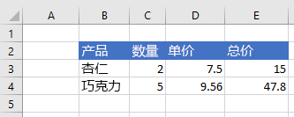

# <a name="clear-or-delete-ranges-using-the-excel-javascript-api"></a>使用 JavaScript API 清除或删除Excel区域

本文提供的代码示例使用 JavaScript API 清除和Excel区域。 有关对象支持的属性和方法`Range`的完整列表，请参阅Excel[。Range 类](/javascript/api/excel/excel.range)。

[!include[Excel cells and ranges note](../includes/note-excel-cells-and-ranges.md)]

## <a name="clear-a-range-of-cells"></a>清除多个单元格内容

下面的代码示例清除区域 **E2:E5** 中的所有内容和单元格格式设置。  

```js
await Excel.run(async (context) => {
    let sheet = context.workbook.worksheets.getItem("Sample");
    let range = sheet.getRange("E2:E5");

    range.clear();

    await context.sync();
});
```

### <a name="data-before-range-is-cleared"></a>清除区域之前的数据


### <a name="data-after-range-is-cleared"></a>清除区域之后的数据


## <a name="delete-a-range-of-cells"></a>删除多个单元格

下面的代码示例删除 **区域 B4：E4** 中的单元格，并上移其他单元格以填充已删除单元格空出的空间。

```js
await Excel.run(async (context) => {
    let sheet = context.workbook.worksheets.getItem("Sample");
    let range = sheet.getRange("B4:E4");

    range.delete(Excel.DeleteShiftDirection.up);

    await context.sync();
});
```

### <a name="data-before-range-is-deleted"></a>删除区域之前的数据


### <a name="data-after-range-is-deleted"></a>删除区域之后的数据



## <a name="see-also"></a>另请参阅

- [使用 JavaScript API Excel单元格](excel-add-ins-cells.md)
- [使用 JavaScript API Excel和获取范围](excel-add-ins-ranges-set-get.md)
- [Excel 加载项中的 Word JavaScript 对象模型](excel-add-ins-core-concepts.md)
