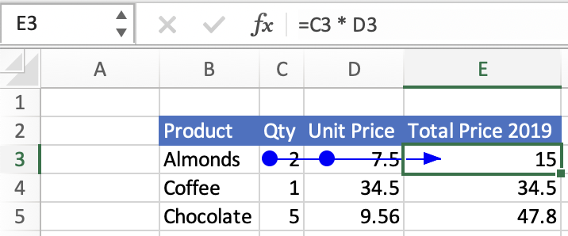
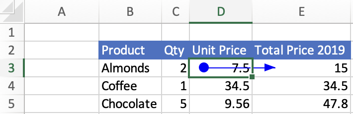

# <a name="get-formula-precedents-and-dependents-using-the-excel-javascript-api"></a>使用 JavaScript API 获取公式引用Excel依赖项

Excel公式通常引用其他单元格。 这些跨单元格引用称为"引用单元格"和"从属单元格"。 引用单元格是向公式提供数据的单元格。 从属单元格是包含引用其他单元格的公式的单元格。 若要了解有关与Excel关系相关的功能，请参阅显示[公式和单元格之间的关系](https://support.microsoft.com/office/display-the-relationships-between-formulas-and-cells-a59bef2b-3701-46bf-8ff1-d3518771d507)。

单元格可以有引用单元格，并且该引用单元格可能有自己的引用单元格。 "直接引用单元格"是此序列中前面的第一组单元格，类似于父子关系中父级的概念。 "直接从属"是序列中第一个从属单元格组，类似于父子关系中的子级。 引用工作簿中其他单元格，但其关系不是父子关系的单元格不是直接从属单元格或直接引用单元格。

本文提供的代码示例使用 JavaScript API 检索公式的直接引用Excel从属单元格。 有关对象支持的属性和方法的完整列表，请参阅 `Range` Range Object [ (JavaScript API for Excel) 。 ](/javascript/api/excel/excel.range)

## <a name="get-the-direct-precedents-of-a-formula"></a>获取公式的直接引用单元格

使用 [Range.getDirectPrecedents](/javascript/api/excel/excel.range#getDirectPrecedents__)查找公式的直接引用单元格。 `Range.getDirectPrecedents` 返回 `WorkbookRangeAreas` 一个对象。 此对象包含工作簿中所有直接引用单元格的地址。 对于每个包含 `RangeAreas` 至少一个公式引用单元格的工作表，它都有一个单独的对象。 有关使用对象的信息，请参阅在加载项中同时Excel `RangeAreas` [多个区域](excel-add-ins-multiple-ranges.md)。

以下屏幕截图显示了在"跟踪引用单元格"UI 中选择"追踪引用Excel的结果。  此按钮绘制从引用单元格到选定单元格的箭头。 选定的单元格 **E3** 包含公式"=C3 * D3"，因此 **C3** 和 **D3 都是** 引用单元格。 与 Excel UI 按钮不同， `getDirectPrecedents` 该方法不绘制箭头。



> [!IMPORTANT]
> `getDirectPrecedents`方法无法跨工作簿检索引用单元格。

下面的代码示例获取活动区域的直接引用单元格，然后将这些引用单元格的背景色更改为黄色。

```js
Excel.run(function (context) {
    // Precedents are cells that provide data to the selected formula.
    var range = context.workbook.getActiveCell();
    var directPrecedents = range.getDirectPrecedents();
    range.load("address");
    directPrecedents.areas.load("address");
    
    return context.sync()
        .then(function () {
            console.log(`Direct precedent cells of ${range.address}:`);

            // Use the direct precedents API to loop through precedents of the active cell.
            for (var i = 0; i < directPrecedents.areas.items.length; i++) {
              // Highlight and print out the address of each precedent cell.
              directPrecedents.areas.items[i].format.fill.color = "Yellow";
              console.log(`  ${directPrecedents.areas.items[i].address}`);
            }
        });
}).catch(errorHandlerFunction);
```

## <a name="get-the-direct-dependents-of-a-formula"></a>获取公式的直接依赖项

使用 [Range.getDirectDependents 查找公式的直接从属单元格](/javascript/api/excel/excel.range#getDirectDependents__)。 与 `Range.getDirectPrecedents` 类似 `Range.getDirectDependents` ，也返回 `WorkbookRangeAreas` 对象。 此对象包含工作簿中所有直接依赖项的地址。 对于每个包含至少一个依赖公式的工作表，它都有 `RangeAreas` 一个单独的对象。 有关使用对象的信息，请参阅在加载项中同时Excel `RangeAreas` [多个区域](excel-add-ins-multiple-ranges.md)。

以下屏幕截图显示了在自定义 UI 中选择"跟踪从属 **项**"Excel的结果。 此按钮绘制从从属单元格到选定单元格的箭头。 选定的单元格 **D3** 将单元格 **E3** 作为从属单元格。 **E3** 包含公式"=C3 * D3"。 与 Excel UI 按钮不同， `getDirectDependents` 该方法不绘制箭头。



> [!IMPORTANT]
> `getDirectDependents`方法无法跨工作簿检索从属单元格。

下面的代码示例获取活动区域的直接从属单元格，然后将这些从属单元格的背景色更改为黄色。

```js
Excel.run(function (context) {
    // Direct dependents are cells that contain formulas that refer to other cells.
    var range = context.workbook.getActiveCell();
    var directDependents = range.getDirectDependents();
    range.load("address");
    directDependents.areas.load("address");
    
    return context.sync()
        .then(function () {
            console.log(`Direct dependent cells of ${range.address}:`);
    
            // Use the direct dependents API to loop through direct dependents of the active cell.
            for (var i = 0; i < directDependents.areas.items.length; i++) {
              // Highlight and print the address of each dependent cell.
              directDependents.areas.items[i].format.fill.color = "Yellow";
              console.log(`  ${directDependents.areas.items[i].address}`);
            }
        });
}).catch(errorHandlerFunction);
```

## <a name="see-also"></a>另请参阅

- [Excel 加载项中的 Word JavaScript 对象模型](excel-add-ins-core-concepts.md)
- [使用 JavaScript API Excel单元格](excel-add-ins-cells.md)
- [ 同时在 Excel 加载项中处理多个区域 ](excel-add-ins-multiple-ranges.md)
