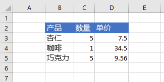
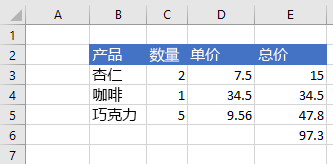

# <a name="set-and-get-range-values-text-or-formulas-using-the-excel-javascript-api"></a><span data-ttu-id="bea26-103">使用 Excel JavaScript API 设置和获取区域值、文本或公式</span><span class="sxs-lookup"><span data-stu-id="bea26-103">Set and get range values, text, or formulas using the Excel JavaScript API</span></span>

<span data-ttu-id="bea26-104">本文提供的代码示例使用 Excel JavaScript API 设置和获取区域值、文本或公式。</span><span class="sxs-lookup"><span data-stu-id="bea26-104">This article provides code samples that set and get range values, text, or formulas with the Excel JavaScript API.</span></span> <span data-ttu-id="bea26-105">有关对象支持的属性和方法的完整列表，请参阅 `Range` [Excel.Range 类](/javascript/api/excel/excel.range)。</span><span class="sxs-lookup"><span data-stu-id="bea26-105">For the complete list of properties and methods that the `Range` object supports, see [Excel.Range class](/javascript/api/excel/excel.range).</span></span>

[!include[Excel cells and ranges note](../includes/note-excel-cells-and-ranges.md)]

## <a name="set-values-or-formulas"></a><span data-ttu-id="bea26-106">设置值或公式</span><span class="sxs-lookup"><span data-stu-id="bea26-106">Set values or formulas</span></span>

<span data-ttu-id="bea26-107">下面的代码示例为单个单元格或单元格区域设置值和公式。</span><span class="sxs-lookup"><span data-stu-id="bea26-107">The following code samples set values and formulas for a single cell or a range of cells.</span></span>

### <a name="set-value-for-a-single-cell"></a><span data-ttu-id="bea26-108">设置单个单元格的值</span><span class="sxs-lookup"><span data-stu-id="bea26-108">Set value for a single cell</span></span>

<span data-ttu-id="bea26-109">下面的代码示例将单元格 **C3** 的值设置为“5”，然后设置适合数据的最佳列宽。</span><span class="sxs-lookup"><span data-stu-id="bea26-109">The following code sample sets the value of cell **C3** to "5" and then sets the width of the columns to best fit the data.</span></span>

```js
Excel.run(function (context) {
    var sheet = context.workbook.worksheets.getItem("Sample");

    var range = sheet.getRange("C3");
    range.values = [[ 5 ]];
    range.format.autofitColumns();

    return context.sync();
}).catch(errorHandlerFunction);
```

#### <a name="data-before-cell-value-is-updated"></a><span data-ttu-id="bea26-110">更新单元格值之前的数据</span><span class="sxs-lookup"><span data-stu-id="bea26-110">Data before cell value is updated</span></span>


#### <a name="data-after-cell-value-is-updated"></a><span data-ttu-id="bea26-112">更新单元格值之后的数据</span><span class="sxs-lookup"><span data-stu-id="bea26-112">Data after cell value is updated</span></span>



### <a name="set-values-for-a-range-of-cells"></a><span data-ttu-id="bea26-114">设置多个单元格的值</span><span class="sxs-lookup"><span data-stu-id="bea26-114">Set values for a range of cells</span></span>

<span data-ttu-id="bea26-115">下面的代码示例为区域 **B5:D5** 中的单元格设置值，然后设置适合数据的最佳列宽。</span><span class="sxs-lookup"><span data-stu-id="bea26-115">The following code sample sets values for the cells in the range **B5:D5** and then sets the width of the columns to best fit the data.</span></span>

```js
Excel.run(function (context) {
    var sheet = context.workbook.worksheets.getItem("Sample");

    var data = [
        ["Potato Chips", 10, 1.80],
    ];

    var range = sheet.getRange("B5:D5");
    range.values = data;
    range.format.autofitColumns();

    return context.sync();
}).catch(errorHandlerFunction);
```

#### <a name="data-before-cell-values-are-updated"></a><span data-ttu-id="bea26-116">更新多个单元格值之前的数据</span><span class="sxs-lookup"><span data-stu-id="bea26-116">Data before cell values are updated</span></span>


#### <a name="data-after-cell-values-are-updated"></a><span data-ttu-id="bea26-118">更新多个单元格值之后的数据</span><span class="sxs-lookup"><span data-stu-id="bea26-118">Data after cell values are updated</span></span>


### <a name="set-formula-for-a-single-cell"></a><span data-ttu-id="bea26-120">设置单个单元格的公式</span><span class="sxs-lookup"><span data-stu-id="bea26-120">Set formula for a single cell</span></span>

<span data-ttu-id="bea26-121">下面的代码示例为单元格 **E3** 设置公式，然后设置适合数据的最佳列宽。</span><span class="sxs-lookup"><span data-stu-id="bea26-121">The following code sample sets a formula for cell **E3** and then sets the width of the columns to best fit the data.</span></span>

```js
Excel.run(function (context) {
    var sheet = context.workbook.worksheets.getItem("Sample");

    var range = sheet.getRange("E3");
    range.formulas = [[ "=C3 * D3" ]];
    range.format.autofitColumns();

    return context.sync();
}).catch(errorHandlerFunction);
```

#### <a name="data-before-cell-formula-is-set"></a><span data-ttu-id="bea26-122">设置单元格公式之前的数据</span><span class="sxs-lookup"><span data-stu-id="bea26-122">Data before cell formula is set</span></span>


#### <a name="data-after-cell-formula-is-set"></a><span data-ttu-id="bea26-124">设置单元格公式之后的数据</span><span class="sxs-lookup"><span data-stu-id="bea26-124">Data after cell formula is set</span></span>


### <a name="set-formulas-for-a-range-of-cells"></a><span data-ttu-id="bea26-126">设置多个单元格的公式</span><span class="sxs-lookup"><span data-stu-id="bea26-126">Set formulas for a range of cells</span></span>

<span data-ttu-id="bea26-127">下面的代码示例为区域 **E2:E6** 中的单元格设置公式，然后设置适合数据的最佳列宽。</span><span class="sxs-lookup"><span data-stu-id="bea26-127">The following code sample sets formulas for cells in the range **E2:E6** and then sets the width of the columns to best fit the data.</span></span>

```js
Excel.run(function (context) {
    var sheet = context.workbook.worksheets.getItem("Sample");

    var data = [
        ["=C3 * D3"],
        ["=C4 * D4"],
        ["=C5 * D5"],
        ["=SUM(E3:E5)"]
    ];

    var range = sheet.getRange("E3:E6");
    range.formulas = data;
    range.format.autofitColumns();

    return context.sync();
}).catch(errorHandlerFunction);
```

#### <a name="data-before-cell-formulas-are-set"></a><span data-ttu-id="bea26-128">设置多个单元格公式之前的数据</span><span class="sxs-lookup"><span data-stu-id="bea26-128">Data before cell formulas are set</span></span>


#### <a name="data-after-cell-formulas-are-set"></a><span data-ttu-id="bea26-130">设置多个单元格公式之后的数据</span><span class="sxs-lookup"><span data-stu-id="bea26-130">Data after cell formulas are set</span></span>



## <a name="get-values-text-or-formulas"></a><span data-ttu-id="bea26-132">获取值、文本或公式</span><span class="sxs-lookup"><span data-stu-id="bea26-132">Get values, text, or formulas</span></span>

<span data-ttu-id="bea26-133">这些代码示例从一系列单元格获取值、文本和公式。</span><span class="sxs-lookup"><span data-stu-id="bea26-133">These code samples get values, text, and formulas from a range of cells.</span></span>

### <a name="get-values-from-a-range-of-cells"></a><span data-ttu-id="bea26-134">从多个单元格获取值</span><span class="sxs-lookup"><span data-stu-id="bea26-134">Get values from a range of cells</span></span>

<span data-ttu-id="bea26-135">下面的代码示例获取 **区域 B2：E6，** 加载其 `values` 属性，将值写入控制台。</span><span class="sxs-lookup"><span data-stu-id="bea26-135">The following code sample gets the range **B2:E6**, loads its `values` property, and writes the values to the console.</span></span> <span data-ttu-id="bea26-136">`values`区域的属性指定单元格包含的原始值。</span><span class="sxs-lookup"><span data-stu-id="bea26-136">The `values` property of a range specifies the raw values that the cells contain.</span></span> <span data-ttu-id="bea26-137">即使某一区域中的某些单元格包含公式，该范围的 属性也指定这些单元格的原始值， `values` 而不是任何公式。</span><span class="sxs-lookup"><span data-stu-id="bea26-137">Even if some cells in a range contain formulas, the `values` property of the range specifies the raw values for those cells, not any of the formulas.</span></span>

```js
Excel.run(function (context) {
    var sheet = context.workbook.worksheets.getItem("Sample");
    var range = sheet.getRange("B2:E6");
    range.load("values");

    return context.sync()
        .then(function () {
            console.log(JSON.stringify(range.values, null, 4));
        });
}).catch(errorHandlerFunction);
```

#### <a name="data-in-range-values-in-column-e-are-a-result-of-formulas"></a><span data-ttu-id="bea26-138">区域中的数据（E 列中的值为公式的结果）</span><span class="sxs-lookup"><span data-stu-id="bea26-138">Data in range (values in column E are a result of formulas)</span></span>


#### <a name="rangevalues-as-logged-to-the-console-by-the-code-sample-above"></a><span data-ttu-id="bea26-140">range.values（通过上面的代码示例记录到控制台）</span><span class="sxs-lookup"><span data-stu-id="bea26-140">range.values (as logged to the console by the code sample above)</span></span>

```json
[
    [
        "Product",
        "Qty",
        "Unit Price",
        "Total Price"
    ],
    [
        "Almonds",
        2,
        7.5,
        15
    ],
    [
        "Coffee",
        1,
        34.5,
        34.5
    ],
    [
        "Chocolate",
        5,
        9.56,
        47.8
    ],
    [
        "",
        "",
        "",
        97.3
    ]
]
```

### <a name="get-text-from-a-range-of-cells"></a><span data-ttu-id="bea26-141">从多个单元格获取文本</span><span class="sxs-lookup"><span data-stu-id="bea26-141">Get text from a range of cells</span></span>

<span data-ttu-id="bea26-142">下面的代码示例获取区域 **B2：E6，** 加载其 `text` 属性，并写入控制台。</span><span class="sxs-lookup"><span data-stu-id="bea26-142">The following code sample gets the range **B2:E6**, loads its `text` property, and writes it to the console.</span></span> <span data-ttu-id="bea26-143">`text`区域的属性指定该范围中单元格的显示值。</span><span class="sxs-lookup"><span data-stu-id="bea26-143">The `text` property of a range specifies the display values for cells in the range.</span></span> <span data-ttu-id="bea26-144">即使某一区域中的某些单元格包含公式，该范围的 属性也指定这些单元格的显示值， `text` 而不是任何公式。</span><span class="sxs-lookup"><span data-stu-id="bea26-144">Even if some cells in a range contain formulas, the `text` property of the range specifies the display values for those cells, not any of the formulas.</span></span>

```js
Excel.run(function (context) {
    var sheet = context.workbook.worksheets.getItem("Sample");
    var range = sheet.getRange("B2:E6");
    range.load("text");

    return context.sync()
        .then(function () {
            console.log(JSON.stringify(range.text, null, 4));
        });
}).catch(errorHandlerFunction);
```

#### <a name="data-in-range-values-in-column-e-are-a-result-of-formulas"></a><span data-ttu-id="bea26-145">区域中的数据（E 列中的值为公式的结果）</span><span class="sxs-lookup"><span data-stu-id="bea26-145">Data in range (values in column E are a result of formulas)</span></span>


#### <a name="rangetext-as-logged-to-the-console-by-the-code-sample-above"></a><span data-ttu-id="bea26-147">range.text（通过上面的代码示例记录到控制台）</span><span class="sxs-lookup"><span data-stu-id="bea26-147">range.text (as logged to the console by the code sample above)</span></span>

```json
[
    [
        "Product",
        "Qty",
        "Unit Price",
        "Total Price"
    ],
    [
        "Almonds",
        "2",
        "7.5",
        "15"
    ],
    [
        "Coffee",
        "1",
        "34.5",
        "34.5"
    ],
    [
        "Chocolate",
        "5",
        "9.56",
        "47.8"
    ],
    [
        "",
        "",
        "",
        "97.3"
    ]
]
```

### <a name="get-formulas-from-a-range-of-cells"></a><span data-ttu-id="bea26-148">从多个单元格获取公式</span><span class="sxs-lookup"><span data-stu-id="bea26-148">Get formulas from a range of cells</span></span>

<span data-ttu-id="bea26-149">下面的代码示例获取区域 **B2：E6，** 加载其 `formulas` 属性，并写入控制台。</span><span class="sxs-lookup"><span data-stu-id="bea26-149">The following code sample gets the range **B2:E6**, loads its `formulas` property, and writes it to the console.</span></span> <span data-ttu-id="bea26-150">区域的属性指定包含公式的单元格的公式和不包含公式的单元格区域 `formulas` 的原始值。</span><span class="sxs-lookup"><span data-stu-id="bea26-150">The `formulas` property of a range specifies the formulas for cells in the range that contain formulas and the raw values for cells in the range that do not contain formulas.</span></span>

```js
Excel.run(function (context) {
    var sheet = context.workbook.worksheets.getItem("Sample");
    var range = sheet.getRange("B2:E6");
    range.load("formulas");

    return context.sync()
        .then(function () {
            console.log(JSON.stringify(range.formulas, null, 4));
        });
}).catch(errorHandlerFunction);
```

#### <a name="data-in-range-values-in-column-e-are-a-result-of-formulas"></a><span data-ttu-id="bea26-151">区域中的数据（E 列中的值为公式的结果）</span><span class="sxs-lookup"><span data-stu-id="bea26-151">Data in range (values in column E are a result of formulas)</span></span>


#### <a name="rangeformulas-as-logged-to-the-console-by-the-code-sample-above"></a><span data-ttu-id="bea26-153">range.formulas（通过上面的代码示例记录到控制台）</span><span class="sxs-lookup"><span data-stu-id="bea26-153">range.formulas (as logged to the console by the code sample above)</span></span>

```json
[
    [
        "Product",
        "Qty",
        "Unit Price",
        "Total Price"
    ],
    [
        "Almonds",
        2,
        7.5,
        "=C3 * D3"
    ],
    [
        "Coffee",
        1,
        34.5,
        "=C4 * D4"
    ],
    [
        "Chocolate",
        5,
        9.56,
        "=C5 * D5"
    ],
    [
        "",
        "",
        "",
        "=SUM(E3:E5)"
    ]
]
```

## <a name="see-also"></a><span data-ttu-id="bea26-154">另请参阅</span><span class="sxs-lookup"><span data-stu-id="bea26-154">See also</span></span>

- [<span data-ttu-id="bea26-155">Excel 加载项中的 Word JavaScript 对象模型</span><span class="sxs-lookup"><span data-stu-id="bea26-155">Excel JavaScript object model in Office Add-ins</span></span>](excel-add-ins-core-concepts.md)
- [<span data-ttu-id="bea26-156">使用 Excel JavaScript API 处理单元格</span><span class="sxs-lookup"><span data-stu-id="bea26-156">Work with cells using the Excel JavaScript API</span></span>](excel-add-ins-cells.md)
- [<span data-ttu-id="bea26-157">使用 Excel JavaScript API 设置和获取区域</span><span class="sxs-lookup"><span data-stu-id="bea26-157">Set and get ranges using the Excel JavaScript API</span></span>](excel-add-ins-ranges-set-get.md)
- [<span data-ttu-id="bea26-158">使用 Excel JavaScript API 设置区域格式</span><span class="sxs-lookup"><span data-stu-id="bea26-158">Set range format using the Excel JavaScript API</span></span>](excel-add-ins-ranges-set-format.md)
