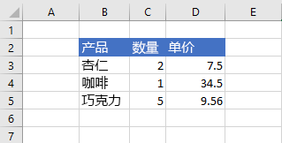

# <a name="set-and-get-range-values-text-or-formulas-using-the-excel-javascript-api"></a>使用 JavaScript API 设置和获取区域Excel文本或公式

本文提供使用 JavaScript API 设置和获取区域值、文本或公式Excel示例。 有关对象支持的属性和方法的完整 `Range` 列表，请参阅[Excel。Range 类](/javascript/api/excel/excel.range)。

[!include[Excel cells and ranges note](../includes/note-excel-cells-and-ranges.md)]

## <a name="set-values-or-formulas"></a>设置值或公式

下面的代码示例为单个单元格或单元格区域设置值和公式。

### <a name="set-value-for-a-single-cell"></a>设置单个单元格的值

下面的代码示例将单元格 **C3** 的值设置为“5”，然后设置适合数据的最佳列宽。

```js
Excel.run(function (context) {
    var sheet = context.workbook.worksheets.getItem("Sample");

    var range = sheet.getRange("C3");
    range.values = [[ 5 ]];
    range.format.autofitColumns();

    return context.sync();
}).catch(errorHandlerFunction);
```

#### <a name="data-before-cell-value-is-updated"></a>更新单元格值之前的数据



#### <a name="data-after-cell-value-is-updated"></a>更新单元格值之后的数据


### <a name="set-values-for-a-range-of-cells"></a>设置多个单元格的值

下面的代码示例为区域 **B5:D5** 中的单元格设置值，然后设置适合数据的最佳列宽。

```js
Excel.run(function (context) {
    var sheet = context.workbook.worksheets.getItem("Sample");

    var data = [
        ["Potato Chips", 10, 1.80],
    ];

    var range = sheet.getRange("B5:D5");
    range.values = data;
    range.format.autofitColumns();

    return context.sync();
}).catch(errorHandlerFunction);
```

#### <a name="data-before-cell-values-are-updated"></a>更新多个单元格值之前的数据


#### <a name="data-after-cell-values-are-updated"></a>更新多个单元格值之后的数据


### <a name="set-formula-for-a-single-cell"></a>设置单个单元格的公式

下面的代码示例为单元格 **E3** 设置公式，然后设置适合数据的最佳列宽。

```js
Excel.run(function (context) {
    var sheet = context.workbook.worksheets.getItem("Sample");

    var range = sheet.getRange("E3");
    range.formulas = [[ "=C3 * D3" ]];
    range.format.autofitColumns();

    return context.sync();
}).catch(errorHandlerFunction);
```

#### <a name="data-before-cell-formula-is-set"></a>设置单元格公式之前的数据


#### <a name="data-after-cell-formula-is-set"></a>设置单元格公式之后的数据


### <a name="set-formulas-for-a-range-of-cells"></a>设置多个单元格的公式

下面的代码示例为区域 **E2:E6** 中的单元格设置公式，然后设置适合数据的最佳列宽。

```js
Excel.run(function (context) {
    var sheet = context.workbook.worksheets.getItem("Sample");

    var data = [
        ["=C3 * D3"],
        ["=C4 * D4"],
        ["=C5 * D5"],
        ["=SUM(E3:E5)"]
    ];

    var range = sheet.getRange("E3:E6");
    range.formulas = data;
    range.format.autofitColumns();

    return context.sync();
}).catch(errorHandlerFunction);
```

#### <a name="data-before-cell-formulas-are-set"></a>设置多个单元格公式之前的数据


#### <a name="data-after-cell-formulas-are-set"></a>设置多个单元格公式之后的数据


## <a name="get-values-text-or-formulas"></a>获取值、文本或公式

这些代码示例从一系列单元格获取值、文本和公式。

### <a name="get-values-from-a-range-of-cells"></a>从多个单元格获取值

下面的代码示例获取 **区域 B2：E6，** 加载其 `values` 属性，将值写入控制台。 `values`区域的属性指定单元格包含的原始值。 即使某一区域中的某些单元格包含公式，该范围的 属性也指定这些单元格的原始值， `values` 而不是任何公式。

```js
Excel.run(function (context) {
    var sheet = context.workbook.worksheets.getItem("Sample");
    var range = sheet.getRange("B2:E6");
    range.load("values");

    return context.sync()
        .then(function () {
            console.log(JSON.stringify(range.values, null, 4));
        });
}).catch(errorHandlerFunction);
```

#### <a name="data-in-range-values-in-column-e-are-a-result-of-formulas"></a>区域中的数据（E 列中的值为公式的结果）


#### <a name="rangevalues-as-logged-to-the-console-by-the-code-sample-above"></a>range.values（通过上面的代码示例记录到控制台）

```json
[
    [
        "Product",
        "Qty",
        "Unit Price",
        "Total Price"
    ],
    [
        "Almonds",
        2,
        7.5,
        15
    ],
    [
        "Coffee",
        1,
        34.5,
        34.5
    ],
    [
        "Chocolate",
        5,
        9.56,
        47.8
    ],
    [
        "",
        "",
        "",
        97.3
    ]
]
```

### <a name="get-text-from-a-range-of-cells"></a>从多个单元格获取文本

下面的代码示例获取区域 **B2：E6，** 加载其 `text` 属性，并写入控制台。 `text`区域的属性指定该范围中单元格的显示值。 即使某一区域中的某些单元格包含公式，该范围的 属性也指定这些单元格的显示值， `text` 而不是任何公式。

```js
Excel.run(function (context) {
    var sheet = context.workbook.worksheets.getItem("Sample");
    var range = sheet.getRange("B2:E6");
    range.load("text");

    return context.sync()
        .then(function () {
            console.log(JSON.stringify(range.text, null, 4));
        });
}).catch(errorHandlerFunction);
```

#### <a name="data-in-range-values-in-column-e-are-a-result-of-formulas"></a>区域中的数据（E 列中的值为公式的结果）


#### <a name="rangetext-as-logged-to-the-console-by-the-code-sample-above"></a>range.text（通过上面的代码示例记录到控制台）

```json
[
    [
        "Product",
        "Qty",
        "Unit Price",
        "Total Price"
    ],
    [
        "Almonds",
        "2",
        "7.5",
        "15"
    ],
    [
        "Coffee",
        "1",
        "34.5",
        "34.5"
    ],
    [
        "Chocolate",
        "5",
        "9.56",
        "47.8"
    ],
    [
        "",
        "",
        "",
        "97.3"
    ]
]
```

### <a name="get-formulas-from-a-range-of-cells"></a>从多个单元格获取公式

下面的代码示例获取区域 **B2：E6，** 加载其 `formulas` 属性，并写入控制台。 区域的属性指定包含公式的单元格的公式和不包含公式的单元格区域 `formulas` 的原始值。

```js
Excel.run(function (context) {
    var sheet = context.workbook.worksheets.getItem("Sample");
    var range = sheet.getRange("B2:E6");
    range.load("formulas");

    return context.sync()
        .then(function () {
            console.log(JSON.stringify(range.formulas, null, 4));
        });
}).catch(errorHandlerFunction);
```

#### <a name="data-in-range-values-in-column-e-are-a-result-of-formulas"></a>区域中的数据（E 列中的值为公式的结果）


#### <a name="rangeformulas-as-logged-to-the-console-by-the-code-sample-above"></a>range.formulas（通过上面的代码示例记录到控制台）

```json
[
    [
        "Product",
        "Qty",
        "Unit Price",
        "Total Price"
    ],
    [
        "Almonds",
        2,
        7.5,
        "=C3 * D3"
    ],
    [
        "Coffee",
        1,
        34.5,
        "=C4 * D4"
    ],
    [
        "Chocolate",
        5,
        9.56,
        "=C5 * D5"
    ],
    [
        "",
        "",
        "",
        "=SUM(E3:E5)"
    ]
]
```

## <a name="see-also"></a>另请参阅

- [Excel 加载项中的 Word JavaScript 对象模型](excel-add-ins-core-concepts.md)
- [使用 JavaScript API Excel单元格](excel-add-ins-cells.md)
- [使用 JavaScript API Excel和获取范围](excel-add-ins-ranges-set-get.md)
- [使用 JavaScript API Excel区域格式](excel-add-ins-ranges-set-format.md)
