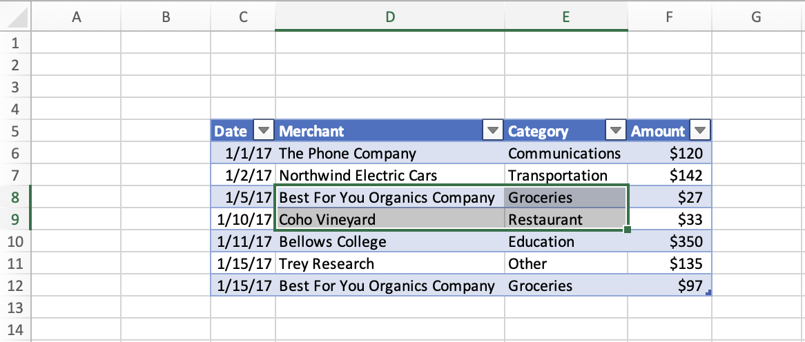

# <a name="set-and-get-the-selected-range-using-the-excel-javascript-api"></a>使用 JavaScript API 设置并Excel区域

本文提供了使用 JavaScript API 设置和获取选定区域Excel示例。 有关对象支持的属性和方法`Range`的完整列表，请参阅Excel[。Range 类](/javascript/api/excel/excel.range)。

[!include[Excel cells and ranges note](../includes/note-excel-cells-and-ranges.md)]

## <a name="set-the-selected-range"></a>设置所选区域

下面的代码示例选择活动工作表中的区域 **B2:E6**。

```js
await Excel.run(async (context) => {
    let sheet = context.workbook.worksheets.getActiveWorksheet();
    let range = sheet.getRange("B2:E6");

    range.select();

    await context.sync();
});
```

### <a name="selected-range-b2e6"></a>选定的区域 B2:E6


## <a name="get-the-selected-range"></a>获取所选区域

下面的代码示例获取所选区域、加载其属性 `address` ，然后向控制台写入一条消息。

```js
await Excel.run(async (context) => {
    let range = context.workbook.getSelectedRange();
    range.load("address");

    await context.sync();
    
    console.log(`The address of the selected range is "${range.address}"`);
});
```

## <a name="select-the-edge-of-a-used-range"></a>选择已用区域的边缘

[Range.getRangeEdge](/javascript/api/excel/excel.range#excel-excel-range-getrangeedge-member(1)) 和 [Range.getExtendedRange](/javascript/api/excel/excel.range#excel-excel-range-getextendedrange-member(1)) 方法允许外接程序复制键盘选择快捷方式的行为，并基于当前所选区域选择已用区域的边缘。 若要详细了解已用区域，请参阅 [获取已用区域](excel-add-ins-ranges-get.md#get-used-range)。

在下面的屏幕截图中，使用的范围是每个单元格中具有值的表 **C5：F12**。 此表外部的空单元格位于已用区域之外。


### <a name="select-the-cell-at-the-edge-of-the-current-used-range"></a>选择当前使用区域边缘的单元格

下面的代码示例演示如何 `Range.getRangeEdge` 使用 方法按向上方向选择当前使用区域最远边缘的单元格。 此操作与选择范围时使用 Ctrl+向上箭头键键盘快捷方式的结果匹配。

```js
await Excel.run(async (context) => {
    // Get the selected range.
    let range = context.workbook.getSelectedRange();

    // Specify the direction with the `KeyboardDirection` enum.
    let direction = Excel.KeyboardDirection.up;

    // Get the active cell in the workbook.
    let activeCell = context.workbook.getActiveCell();

    // Get the top-most cell of the current used range.
    // This method acts like the Ctrl+Up arrow key keyboard shortcut while a range is selected.
    let rangeEdge = range.getRangeEdge(
      direction,
      activeCell
    );
    rangeEdge.select();

    await context.sync();
});
```

#### <a name="before-selecting-the-cell-at-the-edge-of-the-used-range"></a>选择已用区域边缘的单元格之前

以下屏幕截图显示了已用区域以及已用区域内的选定区域。 使用的范围是包含 **C5：F12 数据的表**。 在此表中，选择 **区域 D8：E9** 。 此选择 *是运行 方法* 之前的状态 `Range.getRangeEdge` 。



#### <a name="after-selecting-the-cell-at-the-edge-of-the-used-range"></a>选择已用区域边缘的单元格后

以下屏幕截图显示与上一屏幕截图相同的表，包含 **C5：F12 范围内的数据**。 在此表中，选择了 **区域 D5** 。 此选择 *位于状态* 之后 `Range.getRangeEdge` ，运行方法以在向上方向选择已用区域边缘的单元格。


### <a name="select-all-cells-from-current-range-to-furthest-edge-of-used-range"></a>选择从当前区域到已用区域最远边缘的所有单元格

下面的代码示例 `Range.getExtendedRange` 演示如何使用 方法按向下方向选择从当前所选区域到已用区域最远边缘的所有单元格。 此操作与选中区域时使用 Ctrl+Shift+向下箭头键键盘快捷方式的结果匹配。

```js
await Excel.run(async (context) => {
    // Get the selected range.
    let range = context.workbook.getSelectedRange();

    // Specify the direction with the `KeyboardDirection` enum.
    let direction = Excel.KeyboardDirection.down;

    // Get the active cell in the workbook.
    let activeCell = context.workbook.getActiveCell();

    // Get all the cells from the currently selected range to the bottom-most edge of the used range.
    // This method acts like the Ctrl+Shift+Down arrow key keyboard shortcut while a range is selected.
    let extendedRange = range.getExtendedRange(
      direction,
      activeCell
    );
    extendedRange.select();

    await context.sync();
});
```

#### <a name="before-selecting-all-the-cells-from-the-current-range-to-the-edge-of-the-used-range"></a>选择当前区域到已用区域边缘的所有单元格之前

以下屏幕截图显示了已用区域以及已用区域内的选定区域。 使用的范围是包含 **C5：F12 数据的表**。 在此表中，选择 **区域 D8：E9** 。 此选择 *是运行 方法* 之前的状态 `Range.getExtendedRange` 。


#### <a name="after-selecting-all-the-cells-from-the-current-range-to-the-edge-of-the-used-range"></a>选择从当前区域到已用区域边缘的所有单元格后

以下屏幕截图显示与上一屏幕截图相同的表，包含 **C5：F12 范围内的数据**。 在此表中，选择了 **区域 D8：E12** 。 此选择位于 *状态* 之后 `Range.getExtendedRange` ，运行该方法以从当前区域到已用区域的边缘沿向下方向选择所有单元格。


## <a name="see-also"></a>另请参阅

- [Excel 加载项中的 Word JavaScript 对象模型](excel-add-ins-core-concepts.md)
- [使用 JavaScript API Excel单元格](excel-add-ins-cells.md)
- [使用 JavaScript API 设置和获取区域Excel文本或公式](excel-add-ins-ranges-set-get-values.md)
- [使用 JavaScript API Excel区域格式](excel-add-ins-ranges-set-format.md)
