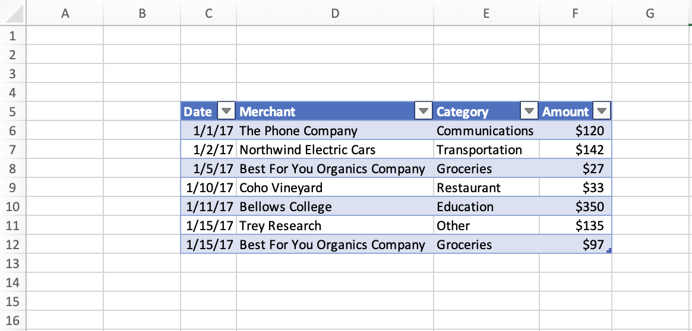

# <a name="set-and-get-the-selected-range-using-the-excel-javascript-api"></a>使用 JavaScript API 设置并Excel区域

本文提供了使用 JavaScript API 设置和获取选定区域Excel示例。 有关对象支持的属性和方法的完整列表， `Range` 请参阅[Excel。Range 类](/javascript/api/excel/excel.range)。

[!include[Excel cells and ranges note](../includes/note-excel-cells-and-ranges.md)]

## <a name="set-the-selected-range"></a>设置所选区域

下面的代码示例选择活动工作表中的区域 **B2:E6**。

```js
Excel.run(function (context) {
    var sheet = context.workbook.worksheets.getActiveWorksheet();
    var range = sheet.getRange("B2:E6");

    range.select();

    return context.sync();
}).catch(errorHandlerFunction);
```

### <a name="selected-range-b2e6"></a>选定的区域 B2:E6


## <a name="get-the-selected-range"></a>获取所选区域

下面的代码示例获取所选区域、加载其 `address` 属性，然后向控制台写入一条消息。

```js
Excel.run(function (context) {
    var range = context.workbook.getSelectedRange();
    range.load("address");

    return context.sync()
        .then(function () {
            console.log(`The address of the selected range is "${range.address}"`);
        });
}).catch(errorHandlerFunction);
```

## <a name="select-the-edge-of-a-used-range"></a>选择已用区域的边缘

[Range.getRangeEdge](/javascript/api/excel/excel.range#getRangeEdge_direction__activeCell_)和[Range.getExtendedRange](/javascript/api/excel/excel.range#getExtendedRange_directionString__activeCell_)方法允许外接程序复制键盘选择快捷方式的行为，并基于当前所选区域选择已用区域的边缘。 若要了解有关已用区域有关详细信息，请参阅 [获取已用区域](excel-add-ins-ranges-get.md#get-used-range)。

在下面的屏幕截图中，使用的范围是每个单元格中具有值的表 **C5：F12**。 此表外部的空单元格位于已用区域之外。



### <a name="select-the-cell-at-the-edge-of-the-current-used-range"></a>选择当前使用区域边缘的单元格

下面的代码示例演示如何使用 方法按向上方向选择当前使用区域最远边缘 `Range.getRangeEdge` 的单元格。 此操作与选择范围时使用 Ctrl+向上箭头键键盘快捷方式的结果匹配。

```js
Excel.run(function (context) {
    // Get the selected range.
    var range = context.workbook.getSelectedRange();

    // Specify the direction with the `KeyboardDirection` enum.
    var direction = Excel.KeyboardDirection.up;

    // Get the active cell in the workbook.
    var activeCell = context.workbook.getActiveCell();

    // Get the top-most cell of the current used range.
    // This method acts like the Ctrl+Up arrow key keyboard shortcut while a range is selected.
    var rangeEdge = range.getRangeEdge(
      direction,
      activeCell
    );
    rangeEdge.select();

    return context.sync();
}).catch(errorHandlerFunction);
```

#### <a name="before-selecting-the-cell-at-the-edge-of-the-used-range"></a>选择已用区域边缘的单元格之前

以下屏幕截图显示了已用区域以及已用区域内的选定区域。 使用的范围是一个表，其数据位于 **C5：F12。** 在此表中，选择区域 **D8：E9。** 此选择 *是运行 方法* 之前的状态 `Range.getRangeEdge` 。


#### <a name="after-selecting-the-cell-at-the-edge-of-the-used-range"></a>选择已用区域边缘的单元格后

以下屏幕截图显示与上一屏幕截图相同的表，包含 **C5：F12 范围的数据**。 在此表中，选择了区域 **D5。** 此选择 *位于状态* 之后，运行方法以在向上方向选择已用区域边缘 `Range.getRangeEdge` 的单元格。


### <a name="select-all-cells-from-current-range-to-furthest-edge-of-used-range"></a>选择从当前区域到已用区域最远边缘的所有单元格

下面的代码示例演示如何使用 方法按向下方向选择从当前所选区域到已用区域最远边缘 `Range.getExtendedRange` 的所有单元格。 此操作与选中区域时使用 Ctrl+Shift+向下箭头键键盘快捷方式的结果匹配。

```js
Excel.run(function (context) {
    // Get the selected range.
    var range = context.workbook.getSelectedRange();

    // Specify the direction with the `KeyboardDirection` enum.
    var direction = Excel.KeyboardDirection.down;

    // Get the active cell in the workbook.
    var activeCell = context.workbook.getActiveCell();

    // Get all the cells from the currently selected range to the bottom-most edge of the used range.
    // This method acts like the Ctrl+Shift+Down arrow key keyboard shortcut while a range is selected.
    var extendedRange = range.getExtendedRange(
      direction,
      activeCell
    );
    extendedRange.select();

    return context.sync();
}).catch(errorHandlerFunction);
```

#### <a name="before-selecting-all-the-cells-from-the-current-range-to-the-edge-of-the-used-range"></a>选择当前区域到已用区域边缘的所有单元格之前

以下屏幕截图显示了已用区域以及已用区域内的选定区域。 使用的范围是一个表，其数据位于 **C5：F12。** 在此表中，选择区域 **D8：E9。** 此选择 *是运行 方法* 之前的状态 `Range.getExtendedRange` 。


#### <a name="after-selecting-all-the-cells-from-the-current-range-to-the-edge-of-the-used-range"></a>选择从当前区域到已用区域边缘的所有单元格后

以下屏幕截图显示与上一屏幕截图相同的表，包含 **C5：F12 范围的数据**。 在此表中，选择了区域 **D8：E12。** 此选择位于 *状态* 之后，运行该方法以从当前区域到已用区域的边缘沿向下 `Range.getExtendedRange` 方向选择所有单元格。


## <a name="see-also"></a>另请参阅

- [Excel 加载项中的 Word JavaScript 对象模型](excel-add-ins-core-concepts.md)
- [使用 JavaScript API Excel单元格](excel-add-ins-cells.md)
- [使用 JavaScript API 设置和获取Excel值、文本或公式](excel-add-ins-ranges-set-get-values.md)
- [使用 JavaScript API Excel区域格式](excel-add-ins-ranges-set-format.md)
