# <a name="work-with-ranges-using-the-excel-javascript-api"></a>使用 Excel JavaScript API 处理区域

本文中的代码示例展示了如何使用 Excel JavaScript API 对区域执行常见任务。 有关 **Range** 对象支持的属性和方法的完整列表，请参阅 [Range 对象 (Excel JavaScript API)](https://docs.microsoft.com/javascript/api/excel/excel.range)。

## <a name="get-a-range"></a>获取区域

下面的示例介绍了在工作表中获取对区域的引用的不同方法。

### <a name="get-range-by-address"></a>按地址获取区域

下面的代码示例从名为 **Sample** 的工作表中获取地址为 **B2:B5** 的区域，加载其 **address** 属性，并向控制台写入一条消息。

```js
Excel.run(function (context) {
    var sheet = context.workbook.worksheets.getItem("Sample");
    var range = sheet.getRange("B2:C5");
    range.load("address");

    return context.sync()
        .then(function () {
            console.log(`The address of the range B2:C5 is "${range.address}"`);
        });
}).catch(errorHandlerFunction);
```

### <a name="get-range-by-name"></a>按名称获取区域

下面的代码示例从名为 **Sample** 的工作表中获取名为 **MyRange** 的区域，加载其 **address** 属性，并向控制台写入一条消息。

```js
Excel.run(function (context) {
    var sheet = context.workbook.worksheets.getItem("Sample");
    var range = sheet.getRange("MyRange");
    range.load("address");

    return context.sync()
        .then(function () {
            console.log(`The address of the range "MyRange" is "${range.address}"`);
        });
}).catch(errorHandlerFunction);
```

### <a name="get-used-range"></a>获取使用的区域

下面的代码示例从名为 **Sample** 的工作表中获取使用的区域，加载其 **address** 属性，并向控制台写入一条消息。 使用的区域是包含工作表中分配了值或格式的任意单元格的最小区域。 如果整个工作表为空，则 **getUsedRange()** 方法返回仅由工作表左上角单元格组成的区域。

```js
Excel.run(function (context) {
    var sheet = context.workbook.worksheets.getItem("Sample");
    var range = sheet.getUsedRange();
    range.load("address");

    return context.sync()
        .then(function () {
            console.log(`The address of the used range in the worksheet is "${range.address}"`);
        });
}).catch(errorHandlerFunction);
```

### <a name="get-entire-range"></a>获取整个区域

下面的代码示例从名为 **Sample** 的工作表中获取整个工作表区域，加载其 **address** 属性，并向控制台写入一条消息。

```js
Excel.run(function (context) {
    var sheet = context.workbook.worksheets.getItem("Sample");
    var range = sheet.getRange();
    range.load("address");

    return context.sync()
        .then(function () {
            console.log(`The address of the entire worksheet range is "${range.address}"`);
        });
}).catch(errorHandlerFunction);
```

## <a name="insert-a-range-of-cells"></a>插入多个单元格

下面的代码示例将多个单元格插入位置 **B4:E4**，并将其他单元格下移，以便为新的单元格提供空间。

```js
Excel.run(function (context) {
    var sheet = context.workbook.worksheets.getItem("Sample");
    var range = sheet.getRange("B4:E4");

    range.insert(Excel.InsertShiftDirection.down);
    
    return context.sync();
}).catch(errorHandlerFunction);
```

**插入区域之前的数据**

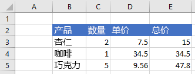

**插入区域之后的数据**


## <a name="clear-a-range-of-cells"></a>清除多个单元格内容

下面的代码示例清除区域 **E2:E5** 中的所有内容和单元格格式设置。  

```js
Excel.run(function (context) {
    var sheet = context.workbook.worksheets.getItem("Sample");
    var range = sheet.getRange("E2:E5");

    range.clear();

    return context.sync();
}).catch(errorHandlerFunction);
```

**清除区域之前的数据**


**清除区域之后的数据**

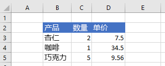

## <a name="delete-a-range-of-cells"></a>删除多个单元格

下面的代码示例删除区域 **B4:E4** 中的单元格，并将其他单元格上移以填充删除的单元格空出的空间。

```js
Excel.run(function (context) {
    var sheet = context.workbook.worksheets.getItem("Sample");
    var range = sheet.getRange("B4:E4");

    range.delete(Excel.DeleteShiftDirection.up);

    return context.sync();
}).catch(errorHandlerFunction);
```

**删除区域之前的数据**


**删除区域之后的数据**

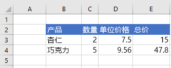

## <a name="set-the-selected-range"></a>设置所选区域

下面的代码示例选择活动工作表中的区域 **B2:E6**。

```js
Excel.run(function (context) {
    var sheet = context.workbook.worksheets.getActiveWorksheet();
    var range = sheet.getRange("B2:E6");

    range.select();

    return context.sync();
}).catch(errorHandlerFunction);
```

**选定的区域 B2:E6**


## <a name="get-the-selected-range"></a>获取所选区域

下面的代码示例获取所选区域，加载其 **address** 属性，并向控制台写入一条消息。 

```js
Excel.run(function (context) {
    var range = context.workbook.getSelectedRange();
    range.load("address");

    return context.sync()
        .then(function () {
            console.log(`The address of the selected range is "${range.address}"`);
        });
}).catch(errorHandlerFunction);
```

## <a name="set-values-or-formulas"></a>设置值或公式

下面的示例演示如何为单个单元格或多个单元格设置值和公式。

### <a name="set-value-for-a-single-cell"></a>设置单个单元格的值

下面的代码示例将单元格 **C3** 的值设置为“5”，然后设置适合数据的最佳列宽。

```js
Excel.run(function (context) {
    var sheet = context.workbook.worksheets.getItem("Sample");

    var range = sheet.getRange("C3");
    range.values = [[ 5 ]];
    range.format.autofitColumns();

    return context.sync();
}).catch(errorHandlerFunction);
```

**更新单元格值之前的数据**

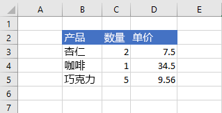

**更新单元格值之后的数据**

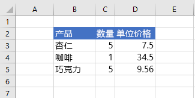

### <a name="set-values-for-a-range-of-cells"></a>设置多个单元格的值

下面的代码示例为区域 **B5:D5** 中的单元格设置值，然后设置适合数据的最佳列宽。

```js
Excel.run(function (context) {
    var sheet = context.workbook.worksheets.getItem("Sample");

    var data = [
        ["Potato Chips", 10, 1.80],
    ];
    
    var range = sheet.getRange("B5:D5");
    range.values = data;
    range.format.autofitColumns();

    return context.sync();
}).catch(errorHandlerFunction);
```

**更新多个单元格值之前的数据**


**更新多个单元格值之后的数据**

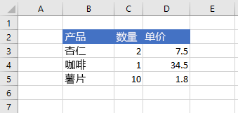

### <a name="set-formula-for-a-single-cell"></a>设置单个单元格的公式

下面的代码示例为单元格 **E3** 设置公式，然后设置适合数据的最佳列宽。

```js
Excel.run(function (context) {
    var sheet = context.workbook.worksheets.getItem("Sample");

    var range = sheet.getRange("E3");
    range.formulas = [[ "=C3 * D3" ]];
    range.format.autofitColumns();

    return context.sync();
}).catch(errorHandlerFunction);
```

**设置单元格公式之前的数据**

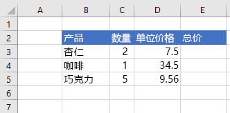

**设置单元格公式之后的数据**

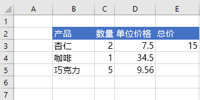

### <a name="set-formulas-for-a-range-of-cells"></a>设置多个单元格的公式

下面的代码示例为区域 **E2:E6** 中的单元格设置公式，然后设置适合数据的最佳列宽。

```js
Excel.run(function (context) {
    var sheet = context.workbook.worksheets.getItem("Sample");

    var data = [
        ["=C3 * D3"],
        ["=C4 * D4"],
        ["=C5 * D5"],
        ["=SUM(E3:E5)"]
    ];
    
    var range = sheet.getRange("E3:E6");
    range.formulas = data;
    range.format.autofitColumns();

    return context.sync();
}).catch(errorHandlerFunction);
```

**设置多个单元格公式之前的数据**


**设置多个单元格公式之后的数据**

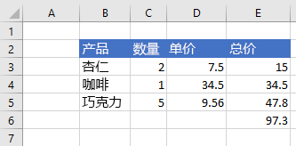

## <a name="get-values-text-or-formulas"></a>获取值、文本或公式

以下示例演示如何从多个单元格获取值、文本和公式。

### <a name="get-values-from-a-range-of-cells"></a>从多个单元格获取值

下面的代码示例获取区域 **B2:E6**，加载其 **values** 属性，并向控制台写入值。 某个区域的 **values** 属性指定单元格包含的原始值。 即使某个区域中的某些单元格包含公式，该区域的 **values** 属性仍会指定这些单元格的原始值，而不是任何公式。

```js
Excel.run(function (context) {
    var sheet = context.workbook.worksheets.getItem("Sample");
    var range = sheet.getRange("B2:E6");
    range.load("values");

    return context.sync()
        .then(function () {
            console.log(JSON.stringify(range.values, null, 4));
        });
}).catch(errorHandlerFunction);
```

**区域中的数据（E 列中的值为公式的结果）**


**range.values（通过上面的代码示例记录到控制台）**

```json
[
    [
        "Product",
        "Qty",
        "Unit Price",
        "Total Price"
    ],
    [
        "Almonds",
        2,
        7.5,
        15
    ],
    [
        "Coffee",
        1,
        34.5,
        34.5
    ],
    [
        "Chocolate",
        5,
        9.56,
        47.8
    ],
    [
        "",
        "",
        "",
        97.3
    ]
]
```

### <a name="get-text-from-a-range-of-cells"></a>从多个单元格获取文本

下面的代码示例获取区域 **B2:E6**，加载其 **text** 属性，并向控制台写入该文本。  区域的 **text** 属性指定该区域单元格的显示值。 即使某个区域中的某些单元格包含公式，该区域的 **text** 属性仍会指定这些单元格的显示值，而不是任何公式。

```js
Excel.run(function (context) {
    var sheet = context.workbook.worksheets.getItem("Sample");
    var range = sheet.getRange("B2:E6");
    range.load("text");

    return context.sync()
        .then(function () {
            console.log(JSON.stringify(range.text, null, 4));
        });
}).catch(errorHandlerFunction);
```

**区域中的数据（E 列中的值为公式的结果）**


**range.text（通过上面的代码示例记录到控制台）**

```json
[
    [
        "Product",
        "Qty",
        "Unit Price",
        "Total Price"
    ],
    [
        "Almonds",
        "2",
        "7.5",
        "15"
    ],
    [
        "Coffee",
        "1",
        "34.5",
        "34.5"
    ],
    [
        "Chocolate",
        "5",
        "9.56",
        "47.8"
    ],
    [
        "",
        "",
        "",
        "97.3"
    ]
]
```

### <a name="get-formulas-from-a-range-of-cells"></a>从多个单元格获取公式

下面的代码示例获取区域 **B2:E6**，加载其 **formulas** 属性，并向控制台写入该公式。  区域的 **formulas** 属性为包含公式的区域单元格指定公式，并为不包含公式的区域单元格指定原始值。

```js
Excel.run(function (context) {
    var sheet = context.workbook.worksheets.getItem("Sample");
    var range = sheet.getRange("B2:E6");
    range.load("formulas");

    return context.sync()
        .then(function () {
            console.log(JSON.stringify(range.formulas, null, 4));
        });
}).catch(errorHandlerFunction);
```

**区域中的数据（E 列中的值为公式的结果）**


**range.formulas（通过上面的代码示例记录到控制台）**

```json
[
    [
        "Product",
        "Qty",
        "Unit Price",
        "Total Price"
    ],
    [
        "Almonds",
        2,
        7.5,
        "=C3 * D3"
    ],
    [
        "Coffee",
        1,
        34.5,
        "=C4 * D4"
    ],
    [
        "Chocolate",
        5,
        9.56,
        "=C5 * D5"
    ],
    [
        "",
        "",
        "",
        "=SUM(E3:E5)"
    ]
]
```

## <a name="set-range-format"></a>设置区域格式

下面的示例演示如何为区域中的单元格设置字体颜色、填充颜色和数字格式。

### <a name="set-font-color-and-fill-color"></a>设置字体颜色和填充颜色

下面的代码示例为区域 **B2:E2** 中的单元格设置字体颜色和填充颜色。

```js
Excel.run(function (context) {
    var sheet = context.workbook.worksheets.getItem("Sample");

    var range = sheet.getRange("B2:E2");
    range.format.fill.color = "#4472C4";;
    range.format.font.color = "white";

    return context.sync();
}).catch(errorHandlerFunction);
```

**区域中设置字体颜色和填充颜色之前的数据**

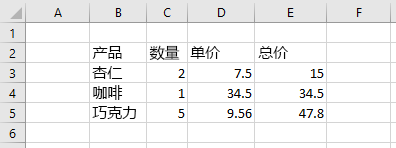

**区域中设置字体颜色和填充颜色之后的数据**

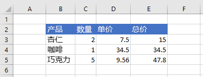

### <a name="set-number-format"></a>设置数字格式

下面的代码示例为区域 **D3:E5** 中的单元格设置数字格式。

```js
Excel.run(function (context) {
    var sheet = context.workbook.worksheets.getItem("Sample");

    var formats = [
        ["0.00", "0.00"],
        ["0.00", "0.00"],
        ["0.00", "0.00"]
    ];

    var range = sheet.getRange("D3:E5");
    range.numberFormat = formats;

    return context.sync();
}).catch(errorHandlerFunction);
```

**区域中设置数字格式之前的数据**


**区域中设置数字格式之后的数据**

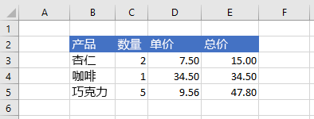

### <a name="conditional-formatting-of-ranges"></a>范围的条件格式

范围可以根据条件将格式应用于个别单元格。 有关此操作的详细信息，请参阅[将条件格式应用于 Excel 范围](excel-add-ins-conditional-formatting.md)。

## <a name="work-with-dates-using-the-moment-msdate-plug-in"></a>使用 Moment-MSDate 插件处理日期

[时刻 JavaScript 库](https://momentjs.com/)提供了使用日期和时间戳的便捷方式。 [Moment-MSDate 插件](https://www.npmjs.com/package/moment-msdate)可将时刻格式转换为 Excel 所需的格式。 这是 [NOW 函数](https://support.office.com/article/now-function-3337fd29-145a-4347-b2e6-20c904739c46)返回的相同格式。

以下代码显示如何将 **B4** 处的范围设置为时刻的时间戳：

```js
Excel.run(function (context) {
    var sheet = context.workbook.worksheets.getItem("Sample");
    
    var now = Date.now();
    var nowMoment = moment(now);
    var nowMS = nowMoment.toOADate();
    
    var dateRange = sheet.getRange("B4");
    dateRange.values = [[nowMS]];
    
    dateRange.numberFormat = [["[$-409]m/d/yy h:mm AM/PM;@"]];
    
    return context.sync();
}).catch(errorHandlerFunction);
```

这是一项类似于在单元格之外获取日期并将其转换为时刻或其他格式的技术，如以下代码中所示：

```js
Excel.run(function (context) {
    var sheet = context.workbook.worksheets.getItem("Sample");

    var dateRange = sheet.getRange("B4");
    dateRange.load("values");
        
    return context.sync().then(function () {
        var nowMS = dateRange.values[0][0];

        // log the date as a moment
        var nowMoment = moment.fromOADate(nowMS);
        console.log(`get (moment): ${JSON.stringify(nowMoment)}`);

        // log the date as a UNIX-style timestamp 
        var now = nowMoment.unix();
        console.log(`get (timestamp): ${now}`);
    });
}).catch(errorHandlerFunction);
```

你的加载项将必须对范围进行格式化才能以更可读的形式显示日期。 `"[$-409]m/d/yy h:mm AM/PM;@"` 的示例显示类似“12/3/18 3:57 PM”的时间。 有关日期和时间数字格式的详细信息，请参阅[查看自定义数字格式的准则](https://support.office.com/article/review-guidelines-for-customizing-a-number-format-c0a1d1fa-d3f4-4018-96b7-9c9354dd99f5)一文中的“日期和时间格式的准则”。

## <a name="copy-and-paste"></a>复制和粘贴

> [!NOTE]
> copyFrom 函数当前仅适用于公共预览版（beta 版本）。 若要使用此功能，必须使用 Office.js CDN 的 beta 版库：https://appsforoffice.microsoft.com/lib/beta/hosted/office.js。
> 如果使用的是 TypeScript 或代码编辑器将 TypeScript 类型定义文件用于 IntelliSense，则使用 https://appsforoffice.microsoft.com/lib/beta/hosted/office.d.ts。

范围的 copyFrom 函数将复制 Excel UI 的“复制和粘贴”行为。 调用 copyFrom 的范围对象是目标。 将要复制的源作为一个范围或一个表示范围的字符串地址进行传递。 以下代码示例将数据从“A1:E1”**** 复制到“G1”**** 开始的范围（粘贴到“G1:K1”**** 结束）。

```js
Excel.run(function (context) {
    var sheet = context.workbook.worksheets.getItem("Sample");
    // copy a range starting at a single cell destination
    sheet.getRange("G1").copyFrom("A1:E1");
    return context.sync();
}).catch(errorHandlerFunction);
```

Range.copyFrom 有三个可选参数。

```ts
copyFrom(sourceRange: Range | string, copyType?: "All" | "Formulas" | "Values" | "Formats", skipBlanks?: boolean, transpose?: boolean): void;
``` 

`copyType` 指定将哪些数据从源复制到目标。 
`“Formulas”` 转换源单元格中的公式，并保留这些公式范围的相对位置。 将原样复制任何非公式条目。 
`“Values”` 复制数据值，如果是公式，则复制公式的结果。 
`“Formats”` 复制范围的格式设置（包括字体、颜色和其他格式），但不会复制任何值。 
`”All”`（默认选项）复制数据和格式设置，保留单元格的公式（如果找到）。

`skipBlanks` 设置是否将空白单元格复制到目标。 如果为 true，`copyFrom` 将跳过源范围中的空白单元格。 跳过的单元格不会覆盖目标范围中其对应单元格的现有数据。 默认值为 false。

以下代码示例和图像在一个简单的方案中演示此行为。 

```js
Excel.run(function (context) {
    var sheet = context.workbook.worksheets.getItem("Sample");
    // copy a range, omitting the blank cells so existing data is not overwritten in those cells
    sheet.getRange("D1").copyFrom("A1:C1",
        Excel.RangeCopyType.all,
        true, // skipBlanks
        false); // transpose
    // copy a range, including the blank cells which will overwrite existing data in the target cells
    sheet.getRange("D2").copyFrom("A2:C2",
        Excel.RangeCopyType.all,
        false, // skipBlanks
        false); // transpose
    return context.sync();
}).catch(errorHandlerFunction);
```

*在上一个函数已运行之前。*


*在上一个函数已运行之后。*


`transpose` 确定是否将数据转置（即切换其行和列）到源位置。 转置范围沿主对角线翻转，因此，行“1”****、“2”**** 和“3”**** 将成为列“A”****、“B”**** 和“C”****。 


## <a name="see-also"></a>另请参阅

- [Excel JavaScript API 基本编程概念](excel-add-ins-core-concepts.md)

