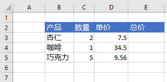

# <a name="work-with-ranges-using-the-excel-javascript-api"></a><span data-ttu-id="fac87-102">使用 Excel JavaScript API 处理区间</span><span class="sxs-lookup"><span data-stu-id="fac87-102">Work with ranges using the Excel JavaScript API</span></span>

<span data-ttu-id="fac87-p101">本文中的代码示例展示了如何使用 Excel JavaScript API 对区间执行常见任务。有关  **Range** 对象支持的属性和方法的完整列表，请参阅 [Range 对象 (Excel JavaScript API)](https://docs.microsoft.com/javascript/api/excel/excel.range)。</span><span class="sxs-lookup"><span data-stu-id="fac87-p101">This article provides code samples that show how to perform common tasks with ranges using the Excel JavaScript API. For the complete list of properties and methods that the **Range** object supports, see [Range Object (JavaScript API for Excel)](https://docs.microsoft.com/javascript/api/excel/excel.range).</span></span>

## <a name="get-a-range"></a><span data-ttu-id="fac87-105">获取区间</span><span class="sxs-lookup"><span data-stu-id="fac87-105">Get a range</span></span>

<span data-ttu-id="fac87-106">下面的示例介绍了在工作表中获取对区间的引用的不同方法。</span><span class="sxs-lookup"><span data-stu-id="fac87-106">The following examples show different ways to get a reference to a range within a worksheet.</span></span>

### <a name="get-range-by-address"></a><span data-ttu-id="fac87-107">按地址获取区间</span><span class="sxs-lookup"><span data-stu-id="fac87-107">Get range by address</span></span>

<span data-ttu-id="fac87-108">下面的代码示例从名为 **Sample** 的工作表中获取地址为 **B2:B5** 的区间，加载其 **address** 属性，并向控制台写入一条消息。</span><span class="sxs-lookup"><span data-stu-id="fac87-108">The following code sample gets the range with address **B2:B5** from the worksheet named **Sample**, loads its **address** property, and writes a message to the console.</span></span>

```js
Excel.run(function (context) {
    var sheet = context.workbook.worksheets.getItem("Sample");
    var range = sheet.getRange("B2:C5");
    range.load("address");

    return context.sync()
        .then(function () {
            console.log(`The address of the range B2:C5 is "${range.address}"`);
        });
}).catch(errorHandlerFunction);
```

### <a name="get-range-by-name"></a><span data-ttu-id="fac87-109">按名称获取区间</span><span class="sxs-lookup"><span data-stu-id="fac87-109">Get range by name</span></span>

<span data-ttu-id="fac87-110">下面的代码示例从名为 **Sample** 的工作表中获取名为 **MyRange** 的区间，加载其 **address** 属性，并向控制台写入一条消息。</span><span class="sxs-lookup"><span data-stu-id="fac87-110">The following code sample gets the range named **MyRange** from the worksheet named **Sample**, loads its **address** property, and writes a message to the console.</span></span>

```js
Excel.run(function (context) {
    var sheet = context.workbook.worksheets.getItem("Sample");
    var range = sheet.getRange("MyRange");
    range.load("address");

    return context.sync()
        .then(function () {
            console.log(`The address of the range "MyRange" is "${range.address}"`);
        });
}).catch(errorHandlerFunction);
```

### <a name="get-used-range"></a><span data-ttu-id="fac87-111">获取使用的区间</span><span class="sxs-lookup"><span data-stu-id="fac87-111">Get used range</span></span>

<span data-ttu-id="fac87-p102">下面的代码示例从名为 **Sample** 的工作表中获取使用的区间，加载其 **address** 属性，并向控制台写入一条消息。使用的区间是包含工作表中分配了值或格式的任意单元格的最小区间。如果整个工作表为空，则 **getUsedRange()** 方法返回仅由工作表左上角单元格组成的区间。</span><span class="sxs-lookup"><span data-stu-id="fac87-p102">The following code sample gets the used range from the worksheet named **Sample**, loads its **address** property, and writes a message to the console. The used range is the smallest range that encompasses any cells in the worksheet that have a value or formatting assigned to them. If the entire worksheet is blank, the **getUsedRange()** method returns a range that consists of only the top-left cell in the worksheet.</span></span>

```js
Excel.run(function (context) {
    var sheet = context.workbook.worksheets.getItem("Sample");
    var range = sheet.getUsedRange();
    range.load("address");

    return context.sync()
        .then(function () {
            console.log(`The address of the used range in the worksheet is "${range.address}"`);
        });
}).catch(errorHandlerFunction);
```

### <a name="get-entire-range"></a><span data-ttu-id="fac87-115">获取整个区间</span><span class="sxs-lookup"><span data-stu-id="fac87-115">Get entire range</span></span>

<span data-ttu-id="fac87-116">下面的代码示例从名为 **Sample** 的工作表中获取整个工作表区间，加载其 **address** 属性，并向控制台写入一条消息。</span><span class="sxs-lookup"><span data-stu-id="fac87-116">The following code sample gets the entire worksheet range from the worksheet named **Sample**, loads its **address** property, and writes a message to the console.</span></span>

```js
Excel.run(function (context) {
    var sheet = context.workbook.worksheets.getItem("Sample");
    var range = sheet.getRange();
    range.load("address");

    return context.sync()
        .then(function () {
            console.log(`The address of the entire worksheet range is "${range.address}"`);
        });
}).catch(errorHandlerFunction);
```

## <a name="insert-a-range-of-cells"></a><span data-ttu-id="fac87-117">插入多个单元格</span><span class="sxs-lookup"><span data-stu-id="fac87-117">Insert a range of cells</span></span>

<span data-ttu-id="fac87-118">下面的代码示例将多个单元格插入位置 **B4:E4**，并将其他单元格下移，以便为新的单元格提供空间。</span><span class="sxs-lookup"><span data-stu-id="fac87-118">The following code sample inserts a range of cells in location **B4:E4** and shifts other cells down to provide space for the new cells.</span></span>

```js
Excel.run(function (context) {
    var sheet = context.workbook.worksheets.getItem("Sample");
    var range = sheet.getRange("B4:E4");

    range.insert(Excel.InsertShiftDirection.down);
    
    return context.sync();
}).catch(errorHandlerFunction);
```

<span data-ttu-id="fac87-119">**插入区间之前的数据**</span><span class="sxs-lookup"><span data-stu-id="fac87-119">**Data before range is inserted**</span></span>


<span data-ttu-id="fac87-121">**插入区间之后的数据**</span><span class="sxs-lookup"><span data-stu-id="fac87-121">**Data after range is inserted**</span></span>


## <a name="clear-a-range-of-cells"></a><span data-ttu-id="fac87-123">清除多个单元格内容</span><span class="sxs-lookup"><span data-stu-id="fac87-123">Clear a range of cells</span></span>

<span data-ttu-id="fac87-124">下面的代码示例清除区间 **E2:E5** 中的所有内容和单元格格式设置。</span><span class="sxs-lookup"><span data-stu-id="fac87-124">The following code sample clears all contents and formatting of cells in the range **E2:E5**.</span></span>  

```js
Excel.run(function (context) {
    var sheet = context.workbook.worksheets.getItem("Sample");
    var range = sheet.getRange("E2:E5");

    range.clear();

    return context.sync();
}).catch(errorHandlerFunction);
```

<span data-ttu-id="fac87-125">**清除区间之前的数据**</span><span class="sxs-lookup"><span data-stu-id="fac87-125">**Data before range is cleared**</span></span>


<span data-ttu-id="fac87-127">**清除区间之后的数据**</span><span class="sxs-lookup"><span data-stu-id="fac87-127">**Data after range is cleared**</span></span>


## <a name="delete-a-range-of-cells"></a><span data-ttu-id="fac87-129">删除多个单元格</span><span class="sxs-lookup"><span data-stu-id="fac87-129">Delete a range of cells</span></span>

<span data-ttu-id="fac87-130">下面的代码示例删除区间 **B4:E4** 中的单元格，并将其他单元格上移以填充删除的单元格空出的空间。</span><span class="sxs-lookup"><span data-stu-id="fac87-130">The following code sample deletes the cells in the range **B4:E4** and shift other cells up to fill the space that was vacated by the deleted cells.</span></span>

```js
Excel.run(function (context) {
    var sheet = context.workbook.worksheets.getItem("Sample");
    var range = sheet.getRange("B4:E4");

    range.delete(Excel.DeleteShiftDirection.up);

    return context.sync();
}).catch(errorHandlerFunction);
```

<span data-ttu-id="fac87-131">**删除区间之前的数据**</span><span class="sxs-lookup"><span data-stu-id="fac87-131">**Data before range is deleted**</span></span>


<span data-ttu-id="fac87-133">**删除区间之后的数据**</span><span class="sxs-lookup"><span data-stu-id="fac87-133">**Data after range is deleted**</span></span>


## <a name="set-the-selected-range"></a><span data-ttu-id="fac87-135">设置所选区间</span><span class="sxs-lookup"><span data-stu-id="fac87-135">Set the selected range</span></span>

<span data-ttu-id="fac87-136">下面的代码示例选择活动工作表中的区间 **B2:E6**。</span><span class="sxs-lookup"><span data-stu-id="fac87-136">The following code sample selects the range **B2:E6** in the active worksheet.</span></span>

```js
Excel.run(function (context) {
    var sheet = context.workbook.worksheets.getActiveWorksheet();
    var range = sheet.getRange("B2:E6");

    range.select();

    return context.sync();
}).catch(errorHandlerFunction);
```

<span data-ttu-id="fac87-137">**选定的区间 B2:E6**</span><span class="sxs-lookup"><span data-stu-id="fac87-137">**Selected range B2:E6**</span></span>


## <a name="get-the-selected-range"></a><span data-ttu-id="fac87-139">获取所选区间</span><span class="sxs-lookup"><span data-stu-id="fac87-139">Get the selected range</span></span>

<span data-ttu-id="fac87-140">下面的代码示例获取所选区间，加载其 **address** 属性，并向控制台写入一条消息。</span><span class="sxs-lookup"><span data-stu-id="fac87-140">The following code sample gets the selected range, loads its **address** property, and writes a message to the console.</span></span> 

```js
Excel.run(function (context) {
    var range = context.workbook.getSelectedRange();
    range.load("address");

    return context.sync()
        .then(function () {
            console.log(`The address of the selected range is "${range.address}"`);
        });
}).catch(errorHandlerFunction);
```

## <a name="set-values-or-formulas"></a><span data-ttu-id="fac87-141">设置值或公式</span><span class="sxs-lookup"><span data-stu-id="fac87-141">Set values or formulas</span></span>

<span data-ttu-id="fac87-142">下面的示例演示如何为单个单元格或多个单元格设置值和公式。</span><span class="sxs-lookup"><span data-stu-id="fac87-142">The following examples show how to set values and formulas for a single cell or a range of cells.</span></span>

### <a name="set-value-for-a-single-cell"></a><span data-ttu-id="fac87-143">设置单个单元格的值</span><span class="sxs-lookup"><span data-stu-id="fac87-143">Set value for a single cell</span></span>

<span data-ttu-id="fac87-144">下面的代码示例将单元格 **C3** 的值设置为“5”，然后设置最适合数据的列宽。</span><span class="sxs-lookup"><span data-stu-id="fac87-144">The following code sample sets the value of cell **C3** to "5" and then sets the width of the columns to best fit the data.</span></span>

```js
Excel.run(function (context) {
    var sheet = context.workbook.worksheets.getItem("Sample");

    var range = sheet.getRange("C3");
    range.values = [[ 5 ]];
    range.format.autofitColumns();

    return context.sync();
}).catch(errorHandlerFunction);
```

<span data-ttu-id="fac87-145">**更新单元格值之前的数据**</span><span class="sxs-lookup"><span data-stu-id="fac87-145">**Data before cell value is updated**</span></span>


<span data-ttu-id="fac87-147">**更新单元格值之后的数据**</span><span class="sxs-lookup"><span data-stu-id="fac87-147">**Data after cell value is updated**</span></span>


### <a name="set-values-for-a-range-of-cells"></a><span data-ttu-id="fac87-149">设置多个单元格的值</span><span class="sxs-lookup"><span data-stu-id="fac87-149">Set values for a range of cells</span></span>

<span data-ttu-id="fac87-150">下面的代码示例为区间 **B5:D5** 中的单元格设置值，然后设置最适合数据的列宽。</span><span class="sxs-lookup"><span data-stu-id="fac87-150">The following code sample sets values for the cells in the range **B5:D5** and then sets the width of the columns to best fit the data.</span></span>

```js
Excel.run(function (context) {
    var sheet = context.workbook.worksheets.getItem("Sample");

    var data = [
        ["Potato Chips", 10, 1.80],
    ];
    
    var range = sheet.getRange("B5:D5");
    range.values = data;
    range.format.autofitColumns();

    return context.sync();
}).catch(errorHandlerFunction);
```

<span data-ttu-id="fac87-151">**更新多个单元格值之前的数据**</span><span class="sxs-lookup"><span data-stu-id="fac87-151">**Data before cell values are updated**</span></span>


<span data-ttu-id="fac87-153">**更新多个单元格值之后的数据**</span><span class="sxs-lookup"><span data-stu-id="fac87-153">**Data after cell values are updated**</span></span>


### <a name="set-formula-for-a-single-cell"></a><span data-ttu-id="fac87-155">设置单个单元格的公式</span><span class="sxs-lookup"><span data-stu-id="fac87-155">Set formula for a single cell</span></span>

<span data-ttu-id="fac87-156">下面的代码示例为单元格 **E3** 设置公式，然后最适合数据的列宽。</span><span class="sxs-lookup"><span data-stu-id="fac87-156">The following code sample sets a formula for cell **E3** and then sets the width of the columns to best fit the data.</span></span>

```js
Excel.run(function (context) {
    var sheet = context.workbook.worksheets.getItem("Sample");

    var range = sheet.getRange("E3");
    range.formulas = [[ "=C3 * D3" ]];
    range.format.autofitColumns();

    return context.sync();
}).catch(errorHandlerFunction);
```

<span data-ttu-id="fac87-157">**设置单元格公式之前的数据**</span><span class="sxs-lookup"><span data-stu-id="fac87-157">**Data before cell formula is set**</span></span>



<span data-ttu-id="fac87-159">**设置单元格公式之后的数据**</span><span class="sxs-lookup"><span data-stu-id="fac87-159">**Data after cell formula is set**</span></span>


### <a name="set-formulas-for-a-range-of-cells"></a><span data-ttu-id="fac87-161">设置多个单元格的公式</span><span class="sxs-lookup"><span data-stu-id="fac87-161">Set formulas for a range of cells</span></span>

<span data-ttu-id="fac87-162">下面的代码示例为区间 **E2:E6** 中的单元格设置公式，然后设置最适合的列宽。</span><span class="sxs-lookup"><span data-stu-id="fac87-162">The following code sample sets formulas for cells in the range **E2:E6** and then sets the width of the columns to best fit the data.</span></span>

```js
Excel.run(function (context) {
    var sheet = context.workbook.worksheets.getItem("Sample");

    var data = [
        ["=C3 * D3"],
        ["=C4 * D4"],
        ["=C5 * D5"],
        ["=SUM(E3:E5)"]
    ];
    
    var range = sheet.getRange("E3:E6");
    range.formulas = data;
    range.format.autofitColumns();

    return context.sync();
}).catch(errorHandlerFunction);
```

<span data-ttu-id="fac87-163">**设置多个单元格公式之前的数据**</span><span class="sxs-lookup"><span data-stu-id="fac87-163">**Data before cell formulas are set**</span></span>


<span data-ttu-id="fac87-165">**设置多个单元格公式之后的数据**</span><span class="sxs-lookup"><span data-stu-id="fac87-165">**Data after cell formulas are set**</span></span>


## <a name="get-values-text-or-formulas"></a><span data-ttu-id="fac87-167">获取值、文本或公式</span><span class="sxs-lookup"><span data-stu-id="fac87-167">Get values, text, or formulas</span></span>

<span data-ttu-id="fac87-168">以下示例演示如何从多个单元格获取值、文本和公式。</span><span class="sxs-lookup"><span data-stu-id="fac87-168">These examples show how to get values, text, and formulas from a range of cells.</span></span>

### <a name="get-values-from-a-range-of-cells"></a><span data-ttu-id="fac87-169">从多个单元格获取值</span><span class="sxs-lookup"><span data-stu-id="fac87-169">Get values from a range of cells</span></span>

<span data-ttu-id="fac87-p103">下面的代码示例获取区间 **B2:E6**，加载其 **values** 属性，并将其写入到控制台。区间的 **values** 属性指定单元格包含的原始值。即使某个区间中的某些单元格包含公式，该区间的 **values** 属性仍会指定这些单元格的原始值，而不是任何公式。</span><span class="sxs-lookup"><span data-stu-id="fac87-p103">The following code sample gets the range **B2:E6**, loads its **values** property, and writes the values to the console. The **values** property of a range specifies the raw values that the cells contain. Even if some cells in a range contain formulas, the **values** property of the range specifies the raw values for those cells, not any of the formulas.</span></span>

```js
Excel.run(function (context) {
    var sheet = context.workbook.worksheets.getItem("Sample");
    var range = sheet.getRange("B2:E6");
    range.load("values");

    return context.sync()
        .then(function () {
            console.log(JSON.stringify(range.values, null, 4));
        });
}).catch(errorHandlerFunction);
```

<span data-ttu-id="fac87-173">**区间中的数据（E 列中的值为公式的结果）**</span><span class="sxs-lookup"><span data-stu-id="fac87-173">**Data in range (values in column E are a result of formulas)**</span></span>


<span data-ttu-id="fac87-175">**range.values（通过上面的代码示例记录到控制台）**</span><span class="sxs-lookup"><span data-stu-id="fac87-175">**range.values (as logged to the console by the code sample above)**</span></span>

```json
[
    [
        "Product",
        "Qty",
        "Unit Price",
        "Total Price"
    ],
    [
        "Almonds",
        2,
        7.5,
        15
    ],
    [
        "Coffee",
        1,
        34.5,
        34.5
    ],
    [
        "Chocolate",
        5,
        9.56,
        47.8
    ],
    [
        "",
        "",
        "",
        97.3
    ]
]
```

### <a name="get-text-from-a-range-of-cells"></a><span data-ttu-id="fac87-176">从多个单元格获取文本</span><span class="sxs-lookup"><span data-stu-id="fac87-176">Get text from a range of cells</span></span>

<span data-ttu-id="fac87-p104">下面的代码示例获取区间 **B2:E6**，加载其 **text** 属性，并将其写入到控制台。区间的 **text** 属性指定该区间单元格的显示值。即使某个区间中的某些单元格包含公式，该区间的 **text** 属性仍会指定这些单元格的显示值，而不是任何公式。</span><span class="sxs-lookup"><span data-stu-id="fac87-p104">The following code sample gets the range **B2:E6**, loads its **text** property, and writes it to the console.  The **text** property of a range specifies the display values for cells in the range. Even if some cells in a range contain formulas, the **text** property of the range specifies the display values for those cells, not any of the formulas.</span></span>

```js
Excel.run(function (context) {
    var sheet = context.workbook.worksheets.getItem("Sample");
    var range = sheet.getRange("B2:E6");
    range.load("text");

    return context.sync()
        .then(function () {
            console.log(JSON.stringify(range.text, null, 4));
        });
}).catch(errorHandlerFunction);
```

<span data-ttu-id="fac87-180">**区间中的数据（E 列中的值为公式的结果）**</span><span class="sxs-lookup"><span data-stu-id="fac87-180">**Data in range (values in column E are a result of formulas)**</span></span>


<span data-ttu-id="fac87-182">**range.text（通过上面的代码示例记录到控制台）**</span><span class="sxs-lookup"><span data-stu-id="fac87-182">**range.text (as logged to the console by the code sample above)**</span></span>

```json
[
    [
        "Product",
        "Qty",
        "Unit Price",
        "Total Price"
    ],
    [
        "Almonds",
        "2",
        "7.5",
        "15"
    ],
    [
        "Coffee",
        "1",
        "34.5",
        "34.5"
    ],
    [
        "Chocolate",
        "5",
        "9.56",
        "47.8"
    ],
    [
        "",
        "",
        "",
        "97.3"
    ]
]
```

### <a name="get-formulas-from-a-range-of-cells"></a><span data-ttu-id="fac87-183">从多个单元格获取公式</span><span class="sxs-lookup"><span data-stu-id="fac87-183">Get formulas from a range of cells</span></span>

<span data-ttu-id="fac87-p105">下面的代码示例获取区间 **B2:E6**，加载其 **formulas** 属性，并将其写入控制台。区间的 **formulas** 属性指定该区间包含公式的单元格的公式以及该区间不包含公式的单元格的原始值。</span><span class="sxs-lookup"><span data-stu-id="fac87-p105">The following code sample gets the range **B2:E6**, loads its **formulas** property, and writes it to the console.  The **formulas** property of a range specifies the formulas for cells in the range that contain formulas and the raw values for cells in the range that do not contain formulas.</span></span>

```js
Excel.run(function (context) {
    var sheet = context.workbook.worksheets.getItem("Sample");
    var range = sheet.getRange("B2:E6");
    range.load("formulas");

    return context.sync()
        .then(function () {
            console.log(JSON.stringify(range.formulas, null, 4));
        });
}).catch(errorHandlerFunction);
```

<span data-ttu-id="fac87-186">**区间中的数据（E 列中的值为公式的结果）**</span><span class="sxs-lookup"><span data-stu-id="fac87-186">**Data in range (values in column E are a result of formulas)**</span></span>


<span data-ttu-id="fac87-188">**range.formulas（通过上面的代码示例记录到控制台）**</span><span class="sxs-lookup"><span data-stu-id="fac87-188">**range.formulas (as logged to the console by the code sample above)**</span></span>

```json
[
    [
        "Product",
        "Qty",
        "Unit Price",
        "Total Price"
    ],
    [
        "Almonds",
        2,
        7.5,
        "=C3 * D3"
    ],
    [
        "Coffee",
        1,
        34.5,
        "=C4 * D4"
    ],
    [
        "Chocolate",
        5,
        9.56,
        "=C5 * D5"
    ],
    [
        "",
        "",
        "",
        "=SUM(E3:E5)"
    ]
]
```

## <a name="set-range-format"></a><span data-ttu-id="fac87-189">设置区间格式</span><span class="sxs-lookup"><span data-stu-id="fac87-189">Set range format</span></span>

<span data-ttu-id="fac87-190">下面的示例演示如何为区间中的单元格设置字体颜色、填充颜色和数字格式。</span><span class="sxs-lookup"><span data-stu-id="fac87-190">The following examples show how to set font color, fill color, and number format for cells in a range.</span></span>

### <a name="set-font-color-and-fill-color"></a><span data-ttu-id="fac87-191">设置字体颜色和填充颜色</span><span class="sxs-lookup"><span data-stu-id="fac87-191">Set font color and fill color</span></span>

<span data-ttu-id="fac87-192">下面的代码示例为区间 **B2:E2** 中的单元格设置字体颜色和填充颜色。</span><span class="sxs-lookup"><span data-stu-id="fac87-192">The following code sample sets the font color and fill color for cells in range **B2:E2**.</span></span>

```js
Excel.run(function (context) {
    var sheet = context.workbook.worksheets.getItem("Sample");

    var range = sheet.getRange("B2:E2");
    range.format.fill.color = "#4472C4";;
    range.format.font.color = "white";

    return context.sync();
}).catch(errorHandlerFunction);
```

<span data-ttu-id="fac87-193">**区间中设置字体颜色和填充颜色之前的数据**</span><span class="sxs-lookup"><span data-stu-id="fac87-193">**Data in range before font color and fill color are set**</span></span>


<span data-ttu-id="fac87-195">**区间中设置字体颜色和填充颜色之后的数据**</span><span class="sxs-lookup"><span data-stu-id="fac87-195">**Data in range after font color and fill color are set**</span></span>


### <a name="set-number-format"></a><span data-ttu-id="fac87-197">设置数字格式</span><span class="sxs-lookup"><span data-stu-id="fac87-197">Set number format</span></span>

<span data-ttu-id="fac87-198">下面的代码示例为区间 **D3:E5** 中的单元格设置数字格式。</span><span class="sxs-lookup"><span data-stu-id="fac87-198">The following code sample sets the number format for the cells in range **D3:E5**.</span></span>

```js
Excel.run(function (context) {
    var sheet = context.workbook.worksheets.getItem("Sample");

    var formats = [
        ["0.00", "0.00"],
        ["0.00", "0.00"],
        ["0.00", "0.00"]
    ];

    var range = sheet.getRange("D3:E5");
    range.numberFormat = formats;

    return context.sync();
}).catch(errorHandlerFunction);
```

<span data-ttu-id="fac87-199">**区间中设置数字格式之前的数据**</span><span class="sxs-lookup"><span data-stu-id="fac87-199">**Data in range before number format is set**</span></span>


<span data-ttu-id="fac87-201">**区间中设置数字格式之后的数据**</span><span class="sxs-lookup"><span data-stu-id="fac87-201">**Data in range after number format is set**</span></span>


## <a name="copy-and-paste"></a><span data-ttu-id="fac87-203">复制和粘贴</span><span class="sxs-lookup"><span data-stu-id="fac87-203">Copy and Paste</span></span>

> [!NOTE]
> <span data-ttu-id="fac87-p106">目前，只有公共预览版 （测试版）才有 copyFrom 函数。若要使用此功能，你必须使用 Office.js CDN 的 beta 库：https://appsforoffice.microsoft.com/lib/beta/hosted/office.js。如果你正在使用 TypeScript，或者你的代码编辑器使用 TypeScript 类型定义文件实现 IntelliSense，请使用 https://appsforoffice.microsoft.com/lib/beta/hosted/office.d.ts。</span><span class="sxs-lookup"><span data-stu-id="fac87-p106">The copyFrom function is currently available only in public preview (beta). To use this feature, you must use the beta library of the Office.js CDN: https://appsforoffice.microsoft.com/lib/beta/hosted/office.js. If you are using TypeScript or your code editor uses TypeScript type definition files for IntelliSense, use https://appsforoffice.microsoft.com/lib/beta/hosted/office.d.ts.</span></span>

<span data-ttu-id="fac87-p107">区间的 copyFrom 函数将复制 Excel UI 的复制和粘贴行为。目标是调用该 copyFrom 的区间对象。将需要拷贝的源作为区间或代表区间的字符串地址进行传递。下面的代码示例中，将数据从 **A1:E1** 复制到以 **G1** 开头（最终粘贴到 **G1:K1** 之中） 的区间。</span><span class="sxs-lookup"><span data-stu-id="fac87-p107">Range’s copyFrom function replicates the copy-and-paste behavior of the Excel UI. The range object that copyFrom is called on is the destination. The source to be copied is passed as a range or a string address representing a range. The following code sample copies the data from **A1:E1** into the range starting at **G1** (which ends up pasting into **G1:K1**).</span></span>

```js
Excel.run(function (context) {
    var sheet = context.workbook.worksheets.getItem("Sample");
    // copy a range starting at a single cell destination
    sheet.getRange("G1").copyFrom("A1:E1");
    return context.sync();
}).catch(errorHandlerFunction);
```

<span data-ttu-id="fac87-211">Range.copyFrom 具有三个可选参数。</span><span class="sxs-lookup"><span data-stu-id="fac87-211">Range.copyFrom has three optional parameters.</span></span>

```ts
copyFrom(sourceRange: Range | string, copyType?: "All" | "Formulas" | "Values" | "Formats", skipBlanks?: boolean, transpose?: boolean): void;
``` 

<span data-ttu-id="fac87-p108">`copyType` 指定从源复制哪些数据到目标。`“Formulas”` 传输源单元格中的公式，并且保留这些公式的区间的相对位置。`“Values”` 复制数据值，如果为公式，则复制公式的结果。`“Formats”` 复制该区间的格式，包括字体、颜色和其他格式设置，但不包括数值。`”All”`（默认选项）复制数据和格式，保留单元格的公式（如有）。</span><span class="sxs-lookup"><span data-stu-id="fac87-p108">`copyType` specifies what data gets copied from the source to the destination. `“Formulas”` transfers the formulas in the source cells and preserves the relative positioning of those formulas’ ranges. Any non-formula entries are copied as-is. `“Values”` copies the data values and, in the case of formulas, the result of the formula. `“Formats”` copies the formatting of the range, including font, color, and other format settings, but no values. `”All”` (the default option) copies both data and formatting, preserving cells’ formulas if found.</span></span>

<span data-ttu-id="fac87-p109">`skipBlanks` 设置是否将空白单元格复制到目标。如果为 true，则 `copyFrom` 跳过源区间中的空白单元格。已跳过的单元格不会覆盖目标区间对应单元格的现有数据。默认值为 false。</span><span class="sxs-lookup"><span data-stu-id="fac87-p109">`skipBlanks` sets whether blank cells are copied into the destination. When true, `copyFrom` skips blank cells in the source range. Skipped cells will not overwrite the existing data of their corresponding cells in the destination range. The default is false.</span></span>

<span data-ttu-id="fac87-222">下面的代码示例和图片采用简单的方案，对上述行为进行了演示。</span><span class="sxs-lookup"><span data-stu-id="fac87-222">The following code sample and images demonstrate this behavior in a simple scenario.</span></span> 

```js
Excel.run(function (context) {
    var sheet = context.workbook.worksheets.getItem("Sample");
    // copy a range, omitting the blank cells so existing data is not overwritten in those cells
    sheet.getRange("D1").copyFrom("A1:C1",
        Excel.RangeCopyType.all,
        true, // skipBlanks
        false); // transpose
    // copy a range, including the blank cells which will overwrite existing data in the target cells
    sheet.getRange("D2").copyFrom("A2:C2",
        Excel.RangeCopyType.all,
        false, // skipBlanks
        false); // transpose
    return context.sync();
}).catch(errorHandlerFunction);
```

<span data-ttu-id="fac87-223">*在上述函数运行之前。*</span><span class="sxs-lookup"><span data-stu-id="fac87-223">*Before the preceeding function has been run.*</span></span>


<span data-ttu-id="fac87-225">*上述函数运行之后。*</span><span class="sxs-lookup"><span data-stu-id="fac87-225">*After the preceeding function has been run.*</span></span>


<span data-ttu-id="fac87-p110">`transpose` 确定是否将数据转置到源位置，这意味着切换数据的行和列。因此行 **1**、**2** 和 **3** 将成为列 **A**、**B** 和 **C**。</span><span class="sxs-lookup"><span data-stu-id="fac87-p110">`transpose` determines whether or not the data is transposed, meaning its rows and columns are switched, into the source location. A transposed range is flipped along the main diagonal, so rows **1**, **2**, and **3** will become columns **A**, **B**, and **C**.</span></span> 


## <a name="see-also"></a><span data-ttu-id="fac87-229">另请参阅</span><span class="sxs-lookup"><span data-stu-id="fac87-229">See also</span></span>

- [<span data-ttu-id="fac87-230">使用 Excel JavaScript API 的基本编程概念</span><span class="sxs-lookup"><span data-stu-id="fac87-230">Fundamental programming concepts with the Excel JavaScript API</span></span>](excel-add-ins-core-concepts.md)

