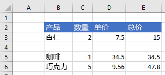

# <a name="work-with-ranges-using-the-excel-javascript-api"></a><span data-ttu-id="cf4f5-103">使用 Excel JavaScript API 处理区域</span><span class="sxs-lookup"><span data-stu-id="cf4f5-103">Work with ranges using the Excel JavaScript API</span></span>

<span data-ttu-id="cf4f5-104">本文中的代码示例展示了如何使用 Excel JavaScript API 对区域执行常见任务。</span><span class="sxs-lookup"><span data-stu-id="cf4f5-104">This article provides code samples that show how to perform common tasks with ranges using the Excel JavaScript API.</span></span> <span data-ttu-id="cf4f5-105">有关该对象支持的属性和方法的完整列表 `Range` ，请参阅 [Range 对象 (适用于 Excel 的 JavaScript API) ](/javascript/api/excel/excel.range)。</span><span class="sxs-lookup"><span data-stu-id="cf4f5-105">For the complete list of properties and methods that the `Range` object supports, see [Range Object (JavaScript API for Excel)](/javascript/api/excel/excel.range).</span></span>

> [!NOTE]
> <span data-ttu-id="cf4f5-106">有关如何使用区域执行更高级任务的代码示例，请参阅 [使用 Excel JavaScript API 对区域执行操作（高级）](excel-add-ins-ranges-advanced.md)。</span><span class="sxs-lookup"><span data-stu-id="cf4f5-106">For code samples that show how to perform more advanced tasks with ranges, see [Work with ranges using the Excel JavaScript API (advanced)](excel-add-ins-ranges-advanced.md).</span></span>

## <a name="get-a-range"></a><span data-ttu-id="cf4f5-107">获取区域</span><span class="sxs-lookup"><span data-stu-id="cf4f5-107">Get a range</span></span>

<span data-ttu-id="cf4f5-108">下面的示例介绍了在工作表中获取对区域的引用的不同方法。</span><span class="sxs-lookup"><span data-stu-id="cf4f5-108">The following examples show different ways to get a reference to a range within a worksheet.</span></span>

### <a name="get-range-by-address"></a><span data-ttu-id="cf4f5-109">按地址获取区域</span><span class="sxs-lookup"><span data-stu-id="cf4f5-109">Get range by address</span></span>

<span data-ttu-id="cf4f5-110">下面的代码示例从名为**sample**的工作表中获取地址为**B2： C5**的范围，加载其 `address` 属性，并向控制台写入一条消息。</span><span class="sxs-lookup"><span data-stu-id="cf4f5-110">The following code sample gets the range with address **B2:C5** from the worksheet named **Sample**, loads its `address` property, and writes a message to the console.</span></span>

```js
Excel.run(function (context) {
    var sheet = context.workbook.worksheets.getItem("Sample");
    var range = sheet.getRange("B2:C5");
    range.load("address");

    return context.sync()
        .then(function () {
            console.log(`The address of the range B2:C5 is "${range.address}"`);
        });
}).catch(errorHandlerFunction);
```

### <a name="get-range-by-name"></a><span data-ttu-id="cf4f5-111">按名称获取区域</span><span class="sxs-lookup"><span data-stu-id="cf4f5-111">Get range by name</span></span>

<span data-ttu-id="cf4f5-112">下面的代码示例 `MyRange` 从名为 **sample**的工作表中获取名为 sample 的区域，加载其 `address` 属性，并向控制台写入一条消息。</span><span class="sxs-lookup"><span data-stu-id="cf4f5-112">The following code sample gets the range named `MyRange` from the worksheet named **Sample**, loads its `address` property, and writes a message to the console.</span></span>

```js
Excel.run(function (context) {
    var sheet = context.workbook.worksheets.getItem("Sample");
    var range = sheet.getRange("MyRange");
    range.load("address");

    return context.sync()
        .then(function () {
            console.log(`The address of the range "MyRange" is "${range.address}"`);
        });
}).catch(errorHandlerFunction);
```

### <a name="get-used-range"></a><span data-ttu-id="cf4f5-113">获取使用的区域</span><span class="sxs-lookup"><span data-stu-id="cf4f5-113">Get used range</span></span>

<span data-ttu-id="cf4f5-114">下面的代码示例从名为 **sample**的工作表中获取所使用的范围，加载其 `address` 属性，并向控制台写入一条消息。</span><span class="sxs-lookup"><span data-stu-id="cf4f5-114">The following code sample gets the used range from the worksheet named **Sample**, loads its `address` property, and writes a message to the console.</span></span> <span data-ttu-id="cf4f5-115">使用的区域是包含工作表中分配了值或格式的任意单元格的最小区域。</span><span class="sxs-lookup"><span data-stu-id="cf4f5-115">The used range is the smallest range that encompasses any cells in the worksheet that have a value or formatting assigned to them.</span></span> <span data-ttu-id="cf4f5-116">如果整个工作表为空，则该 `getUsedRange()` 方法返回一个区域，该区域仅包含工作表中左上角的单元格。</span><span class="sxs-lookup"><span data-stu-id="cf4f5-116">If the entire worksheet is blank, the `getUsedRange()` method returns a range that consists of only the top-left cell in the worksheet.</span></span>

```js
Excel.run(function (context) {
    var sheet = context.workbook.worksheets.getItem("Sample");
    var range = sheet.getUsedRange();
    range.load("address");

    return context.sync()
        .then(function () {
            console.log(`The address of the used range in the worksheet is "${range.address}"`);
        });
}).catch(errorHandlerFunction);
```

### <a name="get-entire-range"></a><span data-ttu-id="cf4f5-117">获取整个区域</span><span class="sxs-lookup"><span data-stu-id="cf4f5-117">Get entire range</span></span>

<span data-ttu-id="cf4f5-118">下面的代码示例从名为 **sample**的工作表中获取整个工作表区域，加载其 `address` 属性，并向控制台写入一条消息。</span><span class="sxs-lookup"><span data-stu-id="cf4f5-118">The following code sample gets the entire worksheet range from the worksheet named **Sample**, loads its `address` property, and writes a message to the console.</span></span>

```js
Excel.run(function (context) {
    var sheet = context.workbook.worksheets.getItem("Sample");
    var range = sheet.getRange();
    range.load("address");

    return context.sync()
        .then(function () {
            console.log(`The address of the entire worksheet range is "${range.address}"`);
        });
}).catch(errorHandlerFunction);
```

## <a name="insert-a-range-of-cells"></a><span data-ttu-id="cf4f5-119">插入多个单元格</span><span class="sxs-lookup"><span data-stu-id="cf4f5-119">Insert a range of cells</span></span>

<span data-ttu-id="cf4f5-120">下面的代码示例将多个单元格插入位置 **B4:E4**，并将其他单元格下移，以便为新的单元格提供空间。</span><span class="sxs-lookup"><span data-stu-id="cf4f5-120">The following code sample inserts a range of cells in location **B4:E4** and shifts other cells down to provide space for the new cells.</span></span>

```js
Excel.run(function (context) {
    var sheet = context.workbook.worksheets.getItem("Sample");
    var range = sheet.getRange("B4:E4");

    range.insert(Excel.InsertShiftDirection.down);

    return context.sync();
}).catch(errorHandlerFunction);
```

### <a name="data-before-range-is-inserted"></a><span data-ttu-id="cf4f5-121">插入区域之前的数据</span><span class="sxs-lookup"><span data-stu-id="cf4f5-121">Data before range is inserted</span></span>


### <a name="data-after-range-is-inserted"></a><span data-ttu-id="cf4f5-123">插入区域之后的数据</span><span class="sxs-lookup"><span data-stu-id="cf4f5-123">Data after range is inserted</span></span>



## <a name="clear-a-range-of-cells"></a><span data-ttu-id="cf4f5-125">清除多个单元格内容</span><span class="sxs-lookup"><span data-stu-id="cf4f5-125">Clear a range of cells</span></span>

<span data-ttu-id="cf4f5-126">下面的代码示例清除区域 **E2:E5** 中的所有内容和单元格格式设置。</span><span class="sxs-lookup"><span data-stu-id="cf4f5-126">The following code sample clears all contents and formatting of cells in the range **E2:E5**.</span></span>  

```js
Excel.run(function (context) {
    var sheet = context.workbook.worksheets.getItem("Sample");
    var range = sheet.getRange("E2:E5");

    range.clear();

    return context.sync();
}).catch(errorHandlerFunction);
```

### <a name="data-before-range-is-cleared"></a><span data-ttu-id="cf4f5-127">清除区域之前的数据</span><span class="sxs-lookup"><span data-stu-id="cf4f5-127">Data before range is cleared</span></span>


### <a name="data-after-range-is-cleared"></a><span data-ttu-id="cf4f5-129">清除区域之后的数据</span><span class="sxs-lookup"><span data-stu-id="cf4f5-129">Data after range is cleared</span></span>


## <a name="delete-a-range-of-cells"></a><span data-ttu-id="cf4f5-131">删除多个单元格</span><span class="sxs-lookup"><span data-stu-id="cf4f5-131">Delete a range of cells</span></span>

<span data-ttu-id="cf4f5-132">下面的代码示例删除区域 **B4:E4** 中的单元格，并将其他单元格上移以填充删除的单元格空出的空间。</span><span class="sxs-lookup"><span data-stu-id="cf4f5-132">The following code sample deletes the cells in the range **B4:E4** and shift other cells up to fill the space that was vacated by the deleted cells.</span></span>

```js
Excel.run(function (context) {
    var sheet = context.workbook.worksheets.getItem("Sample");
    var range = sheet.getRange("B4:E4");

    range.delete(Excel.DeleteShiftDirection.up);

    return context.sync();
}).catch(errorHandlerFunction);
```

### <a name="data-before-range-is-deleted"></a><span data-ttu-id="cf4f5-133">删除区域之前的数据</span><span class="sxs-lookup"><span data-stu-id="cf4f5-133">Data before range is deleted</span></span>


### <a name="data-after-range-is-deleted"></a><span data-ttu-id="cf4f5-135">删除区域之后的数据</span><span class="sxs-lookup"><span data-stu-id="cf4f5-135">Data after range is deleted</span></span>


## <a name="set-the-selected-range"></a><span data-ttu-id="cf4f5-137">设置所选区域</span><span class="sxs-lookup"><span data-stu-id="cf4f5-137">Set the selected range</span></span>

<span data-ttu-id="cf4f5-138">下面的代码示例选择活动工作表中的区域 **B2:E6**。</span><span class="sxs-lookup"><span data-stu-id="cf4f5-138">The following code sample selects the range **B2:E6** in the active worksheet.</span></span>

```js
Excel.run(function (context) {
    var sheet = context.workbook.worksheets.getActiveWorksheet();
    var range = sheet.getRange("B2:E6");

    range.select();

    return context.sync();
}).catch(errorHandlerFunction);
```

### <a name="selected-range-b2e6"></a><span data-ttu-id="cf4f5-139">选定的区域 B2:E6</span><span class="sxs-lookup"><span data-stu-id="cf4f5-139">Selected range B2:E6</span></span>


## <a name="get-the-selected-range"></a><span data-ttu-id="cf4f5-141">获取所选区域</span><span class="sxs-lookup"><span data-stu-id="cf4f5-141">Get the selected range</span></span>

<span data-ttu-id="cf4f5-142">下面的代码示例获取所选区域，加载其 `address` 属性，并向控制台写入一条消息。</span><span class="sxs-lookup"><span data-stu-id="cf4f5-142">The following code sample gets the selected range, loads its `address` property, and writes a message to the console.</span></span>

```js
Excel.run(function (context) {
    var range = context.workbook.getSelectedRange();
    range.load("address");

    return context.sync()
        .then(function () {
            console.log(`The address of the selected range is "${range.address}"`);
        });
}).catch(errorHandlerFunction);
```

## <a name="set-values-or-formulas"></a><span data-ttu-id="cf4f5-143">设置值或公式</span><span class="sxs-lookup"><span data-stu-id="cf4f5-143">Set values or formulas</span></span>

<span data-ttu-id="cf4f5-144">下面的示例演示如何为单个单元格或多个单元格设置值和公式。</span><span class="sxs-lookup"><span data-stu-id="cf4f5-144">The following examples show how to set values and formulas for a single cell or a range of cells.</span></span>

### <a name="set-value-for-a-single-cell"></a><span data-ttu-id="cf4f5-145">设置单个单元格的值</span><span class="sxs-lookup"><span data-stu-id="cf4f5-145">Set value for a single cell</span></span>

<span data-ttu-id="cf4f5-146">下面的代码示例将单元格 **C3** 的值设置为“5”，然后设置适合数据的最佳列宽。</span><span class="sxs-lookup"><span data-stu-id="cf4f5-146">The following code sample sets the value of cell **C3** to "5" and then sets the width of the columns to best fit the data.</span></span>

```js
Excel.run(function (context) {
    var sheet = context.workbook.worksheets.getItem("Sample");

    var range = sheet.getRange("C3");
    range.values = [[ 5 ]];
    range.format.autofitColumns();

    return context.sync();
}).catch(errorHandlerFunction);
```

#### <a name="data-before-cell-value-is-updated"></a><span data-ttu-id="cf4f5-147">更新单元格值之前的数据</span><span class="sxs-lookup"><span data-stu-id="cf4f5-147">Data before cell value is updated</span></span>


#### <a name="data-after-cell-value-is-updated"></a><span data-ttu-id="cf4f5-149">更新单元格值之后的数据</span><span class="sxs-lookup"><span data-stu-id="cf4f5-149">Data after cell value is updated</span></span>


### <a name="set-values-for-a-range-of-cells"></a><span data-ttu-id="cf4f5-151">设置多个单元格的值</span><span class="sxs-lookup"><span data-stu-id="cf4f5-151">Set values for a range of cells</span></span>

<span data-ttu-id="cf4f5-152">下面的代码示例为区域 **B5:D5** 中的单元格设置值，然后设置适合数据的最佳列宽。</span><span class="sxs-lookup"><span data-stu-id="cf4f5-152">The following code sample sets values for the cells in the range **B5:D5** and then sets the width of the columns to best fit the data.</span></span>

```js
Excel.run(function (context) {
    var sheet = context.workbook.worksheets.getItem("Sample");

    var data = [
        ["Potato Chips", 10, 1.80],
    ];

    var range = sheet.getRange("B5:D5");
    range.values = data;
    range.format.autofitColumns();

    return context.sync();
}).catch(errorHandlerFunction);
```

#### <a name="data-before-cell-values-are-updated"></a><span data-ttu-id="cf4f5-153">更新多个单元格值之前的数据</span><span class="sxs-lookup"><span data-stu-id="cf4f5-153">Data before cell values are updated</span></span>


#### <a name="data-after-cell-values-are-updated"></a><span data-ttu-id="cf4f5-155">更新多个单元格值之后的数据</span><span class="sxs-lookup"><span data-stu-id="cf4f5-155">Data after cell values are updated</span></span>


### <a name="set-formula-for-a-single-cell"></a><span data-ttu-id="cf4f5-157">设置单个单元格的公式</span><span class="sxs-lookup"><span data-stu-id="cf4f5-157">Set formula for a single cell</span></span>

<span data-ttu-id="cf4f5-158">下面的代码示例为单元格 **E3** 设置公式，然后设置适合数据的最佳列宽。</span><span class="sxs-lookup"><span data-stu-id="cf4f5-158">The following code sample sets a formula for cell **E3** and then sets the width of the columns to best fit the data.</span></span>

```js
Excel.run(function (context) {
    var sheet = context.workbook.worksheets.getItem("Sample");

    var range = sheet.getRange("E3");
    range.formulas = [[ "=C3 * D3" ]];
    range.format.autofitColumns();

    return context.sync();
}).catch(errorHandlerFunction);
```

#### <a name="data-before-cell-formula-is-set"></a><span data-ttu-id="cf4f5-159">设置单元格公式之前的数据</span><span class="sxs-lookup"><span data-stu-id="cf4f5-159">Data before cell formula is set</span></span>


#### <a name="data-after-cell-formula-is-set"></a><span data-ttu-id="cf4f5-161">设置单元格公式之后的数据</span><span class="sxs-lookup"><span data-stu-id="cf4f5-161">Data after cell formula is set</span></span>


### <a name="set-formulas-for-a-range-of-cells"></a><span data-ttu-id="cf4f5-163">设置多个单元格的公式</span><span class="sxs-lookup"><span data-stu-id="cf4f5-163">Set formulas for a range of cells</span></span>

<span data-ttu-id="cf4f5-164">下面的代码示例为区域 **E2:E6** 中的单元格设置公式，然后设置适合数据的最佳列宽。</span><span class="sxs-lookup"><span data-stu-id="cf4f5-164">The following code sample sets formulas for cells in the range **E2:E6** and then sets the width of the columns to best fit the data.</span></span>

```js
Excel.run(function (context) {
    var sheet = context.workbook.worksheets.getItem("Sample");

    var data = [
        ["=C3 * D3"],
        ["=C4 * D4"],
        ["=C5 * D5"],
        ["=SUM(E3:E5)"]
    ];

    var range = sheet.getRange("E3:E6");
    range.formulas = data;
    range.format.autofitColumns();

    return context.sync();
}).catch(errorHandlerFunction);
```

#### <a name="data-before-cell-formulas-are-set"></a><span data-ttu-id="cf4f5-165">设置多个单元格公式之前的数据</span><span class="sxs-lookup"><span data-stu-id="cf4f5-165">Data before cell formulas are set</span></span>


#### <a name="data-after-cell-formulas-are-set"></a><span data-ttu-id="cf4f5-167">设置多个单元格公式之后的数据</span><span class="sxs-lookup"><span data-stu-id="cf4f5-167">Data after cell formulas are set</span></span>


## <a name="get-values-text-or-formulas"></a><span data-ttu-id="cf4f5-169">获取值、文本或公式</span><span class="sxs-lookup"><span data-stu-id="cf4f5-169">Get values, text, or formulas</span></span>

<span data-ttu-id="cf4f5-170">以下示例演示如何从多个单元格获取值、文本和公式。</span><span class="sxs-lookup"><span data-stu-id="cf4f5-170">These examples show how to get values, text, and formulas from a range of cells.</span></span>

### <a name="get-values-from-a-range-of-cells"></a><span data-ttu-id="cf4f5-171">从多个单元格获取值</span><span class="sxs-lookup"><span data-stu-id="cf4f5-171">Get values from a range of cells</span></span>

<span data-ttu-id="cf4f5-172">下面的代码示例获取区域 **B2： E6**，加载其 `values` 属性，并将这些值写入控制台。</span><span class="sxs-lookup"><span data-stu-id="cf4f5-172">The following code sample gets the range **B2:E6**, loads its `values` property, and writes the values to the console.</span></span> <span data-ttu-id="cf4f5-173">`values`区域的属性指定单元格包含的原始值。</span><span class="sxs-lookup"><span data-stu-id="cf4f5-173">The `values` property of a range specifies the raw values that the cells contain.</span></span> <span data-ttu-id="cf4f5-174">即使某个区域中的某些单元格包含公式，该 `values` 区域的属性也会指定这些单元格的原始值，而不是任何公式。</span><span class="sxs-lookup"><span data-stu-id="cf4f5-174">Even if some cells in a range contain formulas, the `values` property of the range specifies the raw values for those cells, not any of the formulas.</span></span>

```js
Excel.run(function (context) {
    var sheet = context.workbook.worksheets.getItem("Sample");
    var range = sheet.getRange("B2:E6");
    range.load("values");

    return context.sync()
        .then(function () {
            console.log(JSON.stringify(range.values, null, 4));
        });
}).catch(errorHandlerFunction);
```

#### <a name="data-in-range-values-in-column-e-are-a-result-of-formulas"></a><span data-ttu-id="cf4f5-175">区域中的数据（E 列中的值为公式的结果）</span><span class="sxs-lookup"><span data-stu-id="cf4f5-175">Data in range (values in column E are a result of formulas)</span></span>


#### <a name="rangevalues-as-logged-to-the-console-by-the-code-sample-above"></a><span data-ttu-id="cf4f5-177">range.values（通过上面的代码示例记录到控制台）</span><span class="sxs-lookup"><span data-stu-id="cf4f5-177">range.values (as logged to the console by the code sample above)</span></span>

```json
[
    [
        "Product",
        "Qty",
        "Unit Price",
        "Total Price"
    ],
    [
        "Almonds",
        2,
        7.5,
        15
    ],
    [
        "Coffee",
        1,
        34.5,
        34.5
    ],
    [
        "Chocolate",
        5,
        9.56,
        47.8
    ],
    [
        "",
        "",
        "",
        97.3
    ]
]
```

### <a name="get-text-from-a-range-of-cells"></a><span data-ttu-id="cf4f5-178">从多个单元格获取文本</span><span class="sxs-lookup"><span data-stu-id="cf4f5-178">Get text from a range of cells</span></span>

<span data-ttu-id="cf4f5-179">下面的代码示例获取区域 **B2： E6**，加载其 `text` 属性，并将其写入控制台。</span><span class="sxs-lookup"><span data-stu-id="cf4f5-179">The following code sample gets the range **B2:E6**, loads its `text` property, and writes it to the console.</span></span> <span data-ttu-id="cf4f5-180">`text`区域的属性指定区域中的单元格的显示值。</span><span class="sxs-lookup"><span data-stu-id="cf4f5-180">The `text` property of a range specifies the display values for cells in the range.</span></span> <span data-ttu-id="cf4f5-181">即使区域中的某些单元格包含公式，该 `text` 区域的属性也指定这些单元格的显示值，而不是任何公式的显示值。</span><span class="sxs-lookup"><span data-stu-id="cf4f5-181">Even if some cells in a range contain formulas, the `text` property of the range specifies the display values for those cells, not any of the formulas.</span></span>

```js
Excel.run(function (context) {
    var sheet = context.workbook.worksheets.getItem("Sample");
    var range = sheet.getRange("B2:E6");
    range.load("text");

    return context.sync()
        .then(function () {
            console.log(JSON.stringify(range.text, null, 4));
        });
}).catch(errorHandlerFunction);
```

#### <a name="data-in-range-values-in-column-e-are-a-result-of-formulas"></a><span data-ttu-id="cf4f5-182">区域中的数据（E 列中的值为公式的结果）</span><span class="sxs-lookup"><span data-stu-id="cf4f5-182">Data in range (values in column E are a result of formulas)</span></span>


#### <a name="rangetext-as-logged-to-the-console-by-the-code-sample-above"></a><span data-ttu-id="cf4f5-184">range.text（通过上面的代码示例记录到控制台）</span><span class="sxs-lookup"><span data-stu-id="cf4f5-184">range.text (as logged to the console by the code sample above)</span></span>

```json
[
    [
        "Product",
        "Qty",
        "Unit Price",
        "Total Price"
    ],
    [
        "Almonds",
        "2",
        "7.5",
        "15"
    ],
    [
        "Coffee",
        "1",
        "34.5",
        "34.5"
    ],
    [
        "Chocolate",
        "5",
        "9.56",
        "47.8"
    ],
    [
        "",
        "",
        "",
        "97.3"
    ]
]
```

### <a name="get-formulas-from-a-range-of-cells"></a><span data-ttu-id="cf4f5-185">从多个单元格获取公式</span><span class="sxs-lookup"><span data-stu-id="cf4f5-185">Get formulas from a range of cells</span></span>

<span data-ttu-id="cf4f5-186">下面的代码示例获取区域 **B2： E6**，加载其 `formulas` 属性，并将其写入控制台。</span><span class="sxs-lookup"><span data-stu-id="cf4f5-186">The following code sample gets the range **B2:E6**, loads its `formulas` property, and writes it to the console.</span></span> <span data-ttu-id="cf4f5-187">`formulas`Range 的属性指定区域中包含公式的单元格的公式，以及区域中不包含公式的单元格的原始值。</span><span class="sxs-lookup"><span data-stu-id="cf4f5-187">The `formulas` property of a range specifies the formulas for cells in the range that contain formulas and the raw values for cells in the range that do not contain formulas.</span></span>

```js
Excel.run(function (context) {
    var sheet = context.workbook.worksheets.getItem("Sample");
    var range = sheet.getRange("B2:E6");
    range.load("formulas");

    return context.sync()
        .then(function () {
            console.log(JSON.stringify(range.formulas, null, 4));
        });
}).catch(errorHandlerFunction);
```

#### <a name="data-in-range-values-in-column-e-are-a-result-of-formulas"></a><span data-ttu-id="cf4f5-188">区域中的数据（E 列中的值为公式的结果）</span><span class="sxs-lookup"><span data-stu-id="cf4f5-188">Data in range (values in column E are a result of formulas)</span></span>


#### <a name="rangeformulas-as-logged-to-the-console-by-the-code-sample-above"></a><span data-ttu-id="cf4f5-190">range.formulas（通过上面的代码示例记录到控制台）</span><span class="sxs-lookup"><span data-stu-id="cf4f5-190">range.formulas (as logged to the console by the code sample above)</span></span>

```json
[
    [
        "Product",
        "Qty",
        "Unit Price",
        "Total Price"
    ],
    [
        "Almonds",
        2,
        7.5,
        "=C3 * D3"
    ],
    [
        "Coffee",
        1,
        34.5,
        "=C4 * D4"
    ],
    [
        "Chocolate",
        5,
        9.56,
        "=C5 * D5"
    ],
    [
        "",
        "",
        "",
        "=SUM(E3:E5)"
    ]
]
```

## <a name="set-range-format"></a><span data-ttu-id="cf4f5-191">设置区域格式</span><span class="sxs-lookup"><span data-stu-id="cf4f5-191">Set range format</span></span>

<span data-ttu-id="cf4f5-192">下面的示例演示如何为区域中的单元格设置字体颜色、填充颜色和数字格式。</span><span class="sxs-lookup"><span data-stu-id="cf4f5-192">The following examples show how to set font color, fill color, and number format for cells in a range.</span></span>

### <a name="set-font-color-and-fill-color"></a><span data-ttu-id="cf4f5-193">设置字体颜色和填充颜色</span><span class="sxs-lookup"><span data-stu-id="cf4f5-193">Set font color and fill color</span></span>

<span data-ttu-id="cf4f5-194">下面的代码示例为区域 **B2:E2** 中的单元格设置字体颜色和填充颜色。</span><span class="sxs-lookup"><span data-stu-id="cf4f5-194">The following code sample sets the font color and fill color for cells in range **B2:E2**.</span></span>

```js
Excel.run(function (context) {
    var sheet = context.workbook.worksheets.getItem("Sample");

    var range = sheet.getRange("B2:E2");
    range.format.fill.color = "#4472C4";
    range.format.font.color = "white";

    return context.sync();
}).catch(errorHandlerFunction);
```

#### <a name="data-in-range-before-font-color-and-fill-color-are-set"></a><span data-ttu-id="cf4f5-195">区域中设置字体颜色和填充颜色之前的数据</span><span class="sxs-lookup"><span data-stu-id="cf4f5-195">Data in range before font color and fill color are set</span></span>


#### <a name="data-in-range-after-font-color-and-fill-color-are-set"></a><span data-ttu-id="cf4f5-197">区域中设置字体颜色和填充颜色之后的数据</span><span class="sxs-lookup"><span data-stu-id="cf4f5-197">Data in range after font color and fill color are set</span></span>


### <a name="set-number-format"></a><span data-ttu-id="cf4f5-199">设置数字格式</span><span class="sxs-lookup"><span data-stu-id="cf4f5-199">Set number format</span></span>

<span data-ttu-id="cf4f5-200">下面的代码示例为区域 **D3:E5** 中的单元格设置数字格式。</span><span class="sxs-lookup"><span data-stu-id="cf4f5-200">The following code sample sets the number format for the cells in range **D3:E5**.</span></span>

```js
Excel.run(function (context) {
    var sheet = context.workbook.worksheets.getItem("Sample");

    var formats = [
        ["0.00", "0.00"],
        ["0.00", "0.00"],
        ["0.00", "0.00"]
    ];

    var range = sheet.getRange("D3:E5");
    range.numberFormat = formats;

    return context.sync();
}).catch(errorHandlerFunction);
```

#### <a name="data-in-range-before-number-format-is-set"></a><span data-ttu-id="cf4f5-201">区域中设置数字格式之前的数据</span><span class="sxs-lookup"><span data-stu-id="cf4f5-201">Data in range before number format is set</span></span>


#### <a name="data-in-range-after-number-format-is-set"></a><span data-ttu-id="cf4f5-203">区域中设置数字格式之后的数据</span><span class="sxs-lookup"><span data-stu-id="cf4f5-203">Data in range after number format is set</span></span>


## <a name="read-or-write-to-an-unbounded-range"></a><span data-ttu-id="cf4f5-205">读取或写入无限区域</span><span class="sxs-lookup"><span data-stu-id="cf4f5-205">Read or write to an unbounded range</span></span>

### <a name="read-an-unbounded-range"></a><span data-ttu-id="cf4f5-206">读取无限区域</span><span class="sxs-lookup"><span data-stu-id="cf4f5-206">Read an unbounded range</span></span>

<span data-ttu-id="cf4f5-207">无限区域地址是指定整个列或整个行的区域地址。</span><span class="sxs-lookup"><span data-stu-id="cf4f5-207">An unbounded range address is a range address that specifies either entire columns or entire rows.</span></span> <span data-ttu-id="cf4f5-208">例如：</span><span class="sxs-lookup"><span data-stu-id="cf4f5-208">For example:</span></span>

- <span data-ttu-id="cf4f5-209">由整个列组成的区域地址：</span><span class="sxs-lookup"><span data-stu-id="cf4f5-209">Range addresses comprised of entire columns:</span></span><ul><li>`C:C`</li><li>`A:F`</li></ul>
- <span data-ttu-id="cf4f5-210">由整行组成的区域地址：</span><span class="sxs-lookup"><span data-stu-id="cf4f5-210">Range addresses comprised of entire rows:</span></span><ul><li>`2:2`</li><li>`1:4`</li></ul>

<span data-ttu-id="cf4f5-p107">API 发出请求以检索无限区域时（例如，`getRange('C:C')`），该响应将包含单元格级别属性（如 `null`、`values`、`text` 和 `numberFormat`）的 `formula` 值。 其他区域属性（如 `address` 和 `cellCount`）将包含无限区域的有效值。</span><span class="sxs-lookup"><span data-stu-id="cf4f5-p107">When the API makes a request to retrieve an unbounded range (for example, `getRange('C:C')`), the response will contain `null` values for cell-level properties such as `values`, `text`, `numberFormat`, and `formula`. Other properties of the range, such as `address` and `cellCount`, will contain valid values for the unbounded range.</span></span>

### <a name="write-to-an-unbounded-range"></a><span data-ttu-id="cf4f5-213">写入一个无限区域</span><span class="sxs-lookup"><span data-stu-id="cf4f5-213">Write to an unbounded range</span></span>

<span data-ttu-id="cf4f5-214">您无法在无限区域上设置单元格级别的属性，如 `values` 、 `numberFormat` 和， `formula` 因为输入请求过大。</span><span class="sxs-lookup"><span data-stu-id="cf4f5-214">You cannot set cell-level properties such as `values`, `numberFormat`, and `formula` on an unbounded range because the input request is too large.</span></span> <span data-ttu-id="cf4f5-215">例如，下面的代码段无效，因为它尝试为无限区域指定 `values`。</span><span class="sxs-lookup"><span data-stu-id="cf4f5-215">For example, the following code snippet is not valid because it attempts to specify `values` for an unbounded range.</span></span> <span data-ttu-id="cf4f5-216">如果您尝试为无限区域设置单元格级别的属性，API 将返回错误。</span><span class="sxs-lookup"><span data-stu-id="cf4f5-216">The API returns an error if you attempt to set cell-level properties for an unbounded range.</span></span>

```js
var range = context.workbook.worksheets.getActiveWorksheet().getRange('A:B');
range.values = 'Due Date';
```

## <a name="read-or-write-to-a-large-range"></a><span data-ttu-id="cf4f5-217">读取或写入较大区域</span><span class="sxs-lookup"><span data-stu-id="cf4f5-217">Read or write to a large range</span></span>

<span data-ttu-id="cf4f5-p109">如果区域中包含大量单元格、值、数字格式和/或公式，它可能无法在该区域运行 API 操作。 API 将始终尽量尝试在区域内运行所请求的操作（即检索或写入指定的数据），但尝试对较大区域执行读取或写入操作可能会因资源利用率过高而导致 API 错误。 为避免此类错误，建议为较大区域的较小子集运行单独的读取或写入操作，而不是尝试在较大区域内运行单个读取或写入操作。</span><span class="sxs-lookup"><span data-stu-id="cf4f5-p109">If a range contains a large number of cells, values, number formats, and/or formulas, it may not be possible to run API operations on that range. The API will always make a best attempt to run the requested operation on a range (i.e., to retrieve or write the specified data), but attempting to perform read or write operations for a large range may result in an API error due to excessive resource utilization. To avoid such errors, we recommend that you run separate read or write operations for smaller subsets of a large range, instead of attempting to run a single read or write operation on a large range.</span></span>

<span data-ttu-id="cf4f5-221">有关系统限制的详细信息，请参阅 [适用于 Office 外接程序的资源限制和性能优化](../concepts/resource-limits-and-performance-optimization.md#excel-add-ins)的 "Excel 外接程序" 部分。</span><span class="sxs-lookup"><span data-stu-id="cf4f5-221">For details on the system limitations, see the "Excel add-ins" section of [Resource limits and performance optimization for Office Add-ins](../concepts/resource-limits-and-performance-optimization.md#excel-add-ins).</span></span>

### <a name="conditional-formatting-of-ranges"></a><span data-ttu-id="cf4f5-222">范围的条件格式</span><span class="sxs-lookup"><span data-stu-id="cf4f5-222">Conditional formatting of ranges</span></span>

<span data-ttu-id="cf4f5-223">范围可以根据条件将格式应用于个别单元格。</span><span class="sxs-lookup"><span data-stu-id="cf4f5-223">Ranges can have formats applied to individual cells based on conditions.</span></span> <span data-ttu-id="cf4f5-224">有关此操作的详细信息，请参阅[将条件格式应用于 Excel 范围](excel-add-ins-conditional-formatting.md)。</span><span class="sxs-lookup"><span data-stu-id="cf4f5-224">For more information about this, see [Apply conditional formatting to Excel ranges](excel-add-ins-conditional-formatting.md).</span></span>

## <a name="find-a-cell-using-string-matching"></a><span data-ttu-id="cf4f5-225">使用字符串匹配查找单元格</span><span class="sxs-lookup"><span data-stu-id="cf4f5-225">Find a cell using string matching</span></span>

<span data-ttu-id="cf4f5-226">`Range` 对象具有 `find` 方法在区域内搜索指定字符串。</span><span class="sxs-lookup"><span data-stu-id="cf4f5-226">The `Range` object has a `find` method to search for a specified string within the range.</span></span> <span data-ttu-id="cf4f5-227">返回有匹配文本的第一个单元格区域。</span><span class="sxs-lookup"><span data-stu-id="cf4f5-227">It returns the range of the first cell with matching text.</span></span> <span data-ttu-id="cf4f5-228">以下代码示例查找值等于字符串 **食品** 的第一个单元格，并将其地址记录到控制台。</span><span class="sxs-lookup"><span data-stu-id="cf4f5-228">The following code sample finds the first cell with a value equal to the string **Food** and logs its address to the console.</span></span> <span data-ttu-id="cf4f5-229">请注意，若指定的字符串不存在于区域中，`find` 将引发 `ItemNotFound` 错误。</span><span class="sxs-lookup"><span data-stu-id="cf4f5-229">Note that `find` throws an `ItemNotFound` error if the specified string doesn't exist in the range.</span></span> <span data-ttu-id="cf4f5-230">若您预计到指定的字符串可能不存在区域中，则可使用 [findOrNullObject](../develop/application-specific-api-model.md#ornullobject-methods-and-properties) 方法，以便您的代码可正常处理该情况。</span><span class="sxs-lookup"><span data-stu-id="cf4f5-230">If you expect that the specified string may not exist in the range, use the [findOrNullObject](../develop/application-specific-api-model.md#ornullobject-methods-and-properties) method instead, so your code gracefully handles that scenario.</span></span>

```js
Excel.run(function (context) {
    var sheet = context.workbook.worksheets.getItem("Sample");
    var table = sheet.tables.getItem("ExpensesTable");
    var searchRange = table.getRange();
    var foundRange = searchRange.find("Food", {
        completeMatch: true, // find will match the whole cell value
        matchCase: false, // find will not match case
        searchDirection: Excel.SearchDirection.forward // find will start searching at the beginning of the range
    });

    foundRange.load("address");
    return context.sync()
        .then(function() {
            console.log(foundRange.address);
    });
}).catch(errorHandlerFunction);
```

<span data-ttu-id="cf4f5-231">在表示一个单元格的区域调用 `find` 方法时，将在整个工作表进行搜索。</span><span class="sxs-lookup"><span data-stu-id="cf4f5-231">When the `find` method is called on a range representing a single cell, the entire worksheet is searched.</span></span> <span data-ttu-id="cf4f5-232">搜索开始于该单元格，并按照 `SearchCriteria.searchDirection` 指定的方向进行，如有需要在工作表结束的地方换行。</span><span class="sxs-lookup"><span data-stu-id="cf4f5-232">The search begins at that cell and goes in the direction specified by `SearchCriteria.searchDirection`, wrapping around the ends of the worksheet if needed.</span></span>

## <a name="see-also"></a><span data-ttu-id="cf4f5-233">另请参阅</span><span class="sxs-lookup"><span data-stu-id="cf4f5-233">See also</span></span>

- [<span data-ttu-id="cf4f5-234">使用 Excel JavaScript API 对区域执行操作（高级）</span><span class="sxs-lookup"><span data-stu-id="cf4f5-234">Work with ranges using the Excel JavaScript API (advanced)</span></span>](excel-add-ins-ranges-advanced.md)
- [<span data-ttu-id="cf4f5-235">Excel JavaScript API 基本编程概念</span><span class="sxs-lookup"><span data-stu-id="cf4f5-235">Fundamental programming concepts with the Excel JavaScript API</span></span>](excel-add-ins-core-concepts.md)
