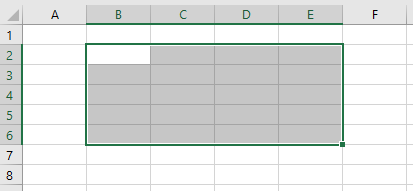

# <a name="work-with-ranges-using-the-excel-javascript-api"></a><span data-ttu-id="e510c-102">使用 Excel JavaScript API 处理区域</span><span class="sxs-lookup"><span data-stu-id="e510c-102">Work with ranges using the Excel JavaScript API</span></span>

<span data-ttu-id="e510c-103">本文中的代码示例展示了如何使用 Excel JavaScript API 对区域执行常见任务。</span><span class="sxs-lookup"><span data-stu-id="e510c-103">This article provides code samples that show how to perform common tasks with ranges using the Excel JavaScript API.</span></span> <span data-ttu-id="e510c-104">有关 **Range** 对象支持的属性和方法的完整列表，请参阅 [Range 对象 (Excel JavaScript API)](https://docs.microsoft.com/javascript/api/excel/excel.range)。</span><span class="sxs-lookup"><span data-stu-id="e510c-104">For the complete list of properties and methods that the **Range** object supports, see [Range Object (JavaScript API for Excel)](https://docs.microsoft.com/javascript/api/excel/excel.range).</span></span>

## <a name="get-a-range"></a><span data-ttu-id="e510c-105">获取区域</span><span class="sxs-lookup"><span data-stu-id="e510c-105">Get a range</span></span>

<span data-ttu-id="e510c-106">下面的示例介绍了在工作表中获取对区域的引用的不同方法。</span><span class="sxs-lookup"><span data-stu-id="e510c-106">The following examples show different ways to get a reference to a range within a worksheet.</span></span>

### <a name="get-range-by-address"></a><span data-ttu-id="e510c-107">按地址获取区域</span><span class="sxs-lookup"><span data-stu-id="e510c-107">Get range by address</span></span>

<span data-ttu-id="e510c-108">下面的代码示例从名为 **Sample** 的工作表中获取地址为 **B2:B5** 的区域，加载其 **address** 属性，并向控制台写入一条消息。</span><span class="sxs-lookup"><span data-stu-id="e510c-108">The following code sample gets the range with address **B2:B5** from the worksheet named **Sample**, loads its **address** property, and writes a message to the console.</span></span>

```js
Excel.run(function (context) {
    var sheet = context.workbook.worksheets.getItem("Sample");
    var range = sheet.getRange("B2:C5");
    range.load("address");

    return context.sync()
        .then(function () {
            console.log(`The address of the range B2:C5 is "${range.address}"`);
        });
}).catch(errorHandlerFunction);
```

### <a name="get-range-by-name"></a><span data-ttu-id="e510c-109">按名称获取区域</span><span class="sxs-lookup"><span data-stu-id="e510c-109">Get range by name</span></span>

<span data-ttu-id="e510c-110">下面的代码示例从名为 **Sample** 的工作表中获取名为 **MyRange** 的区域，加载其 **address** 属性，并向控制台写入一条消息。</span><span class="sxs-lookup"><span data-stu-id="e510c-110">The following code sample gets the range named **MyRange** from the worksheet named **Sample**, loads its **address** property, and writes a message to the console.</span></span>

```js
Excel.run(function (context) {
    var sheet = context.workbook.worksheets.getItem("Sample");
    var range = sheet.getRange("MyRange");
    range.load("address");

    return context.sync()
        .then(function () {
            console.log(`The address of the range "MyRange" is "${range.address}"`);
        });
}).catch(errorHandlerFunction);
```

### <a name="get-used-range"></a><span data-ttu-id="e510c-111">获取使用的区域</span><span class="sxs-lookup"><span data-stu-id="e510c-111">Get used range</span></span>

<span data-ttu-id="e510c-112">下面的代码示例从名为 **Sample** 的工作表中获取使用的区域，加载其 **address** 属性，并向控制台写入一条消息。</span><span class="sxs-lookup"><span data-stu-id="e510c-112">The following code sample gets the used range from the worksheet named **Sample**, loads its **address** property, and writes a message to the console.</span></span> <span data-ttu-id="e510c-113">使用的区域是包含工作表中分配了值或格式的任意单元格的最小区域。</span><span class="sxs-lookup"><span data-stu-id="e510c-113">The used range is the smallest range that encompasses any cells in the worksheet that have a value or formatting assigned to them.</span></span> <span data-ttu-id="e510c-114">如果整个工作表为空，则 **getUsedRange()** 方法返回仅由工作表左上角单元格组成的区域。</span><span class="sxs-lookup"><span data-stu-id="e510c-114">If the entire worksheet is blank, the **getUsedRange()** method returns a range that consists of only the top-left cell in the worksheet.</span></span>

```js
Excel.run(function (context) {
    var sheet = context.workbook.worksheets.getItem("Sample");
    var range = sheet.getUsedRange();
    range.load("address");

    return context.sync()
        .then(function () {
            console.log(`The address of the used range in the worksheet is "${range.address}"`);
        });
}).catch(errorHandlerFunction);
```

### <a name="get-entire-range"></a><span data-ttu-id="e510c-115">获取整个区域</span><span class="sxs-lookup"><span data-stu-id="e510c-115">Get entire range</span></span>

<span data-ttu-id="e510c-116">下面的代码示例从名为 **Sample** 的工作表中获取整个工作表区域，加载其 **address** 属性，并向控制台写入一条消息。</span><span class="sxs-lookup"><span data-stu-id="e510c-116">The following code sample gets the entire worksheet range from the worksheet named **Sample**, loads its **address** property, and writes a message to the console.</span></span>

```js
Excel.run(function (context) {
    var sheet = context.workbook.worksheets.getItem("Sample");
    var range = sheet.getRange();
    range.load("address");

    return context.sync()
        .then(function () {
            console.log(`The address of the entire worksheet range is "${range.address}"`);
        });
}).catch(errorHandlerFunction);
```

## <a name="insert-a-range-of-cells"></a><span data-ttu-id="e510c-117">插入多个单元格</span><span class="sxs-lookup"><span data-stu-id="e510c-117">Insert a range of cells</span></span>

<span data-ttu-id="e510c-118">下面的代码示例将多个单元格插入位置 **B4:E4**，并将其他单元格下移，以便为新的单元格提供空间。</span><span class="sxs-lookup"><span data-stu-id="e510c-118">The following code sample inserts a range of cells in location **B4:E4** and shifts other cells down to provide space for the new cells.</span></span>

```js
Excel.run(function (context) {
    var sheet = context.workbook.worksheets.getItem("Sample");
    var range = sheet.getRange("B4:E4");

    range.insert(Excel.InsertShiftDirection.down);
    
    return context.sync();
}).catch(errorHandlerFunction);
```

<span data-ttu-id="e510c-119">**插入区域之前的数据**</span><span class="sxs-lookup"><span data-stu-id="e510c-119">**Data before range is inserted**</span></span>


<span data-ttu-id="e510c-121">**插入区域之后的数据**</span><span class="sxs-lookup"><span data-stu-id="e510c-121">**Data after range is inserted**</span></span>


## <a name="clear-a-range-of-cells"></a><span data-ttu-id="e510c-123">清除多个单元格内容</span><span class="sxs-lookup"><span data-stu-id="e510c-123">Clear a range of cells</span></span>

<span data-ttu-id="e510c-124">下面的代码示例清除区域 **E2:E5** 中的所有内容和单元格格式设置。</span><span class="sxs-lookup"><span data-stu-id="e510c-124">The following code sample clears all contents and formatting of cells in the range **E2:E5**.</span></span>  

```js
Excel.run(function (context) {
    var sheet = context.workbook.worksheets.getItem("Sample");
    var range = sheet.getRange("E2:E5");

    range.clear();

    return context.sync();
}).catch(errorHandlerFunction);
```

<span data-ttu-id="e510c-125">**清除区域之前的数据**</span><span class="sxs-lookup"><span data-stu-id="e510c-125">**Data before range is cleared**</span></span>


<span data-ttu-id="e510c-127">**清除区域之后的数据**</span><span class="sxs-lookup"><span data-stu-id="e510c-127">**Data after range is cleared**</span></span>


## <a name="delete-a-range-of-cells"></a><span data-ttu-id="e510c-129">删除多个单元格</span><span class="sxs-lookup"><span data-stu-id="e510c-129">Delete a range of cells</span></span>

<span data-ttu-id="e510c-130">下面的代码示例删除区域 **B4:E4** 中的单元格，并将其他单元格上移以填充删除的单元格空出的空间。</span><span class="sxs-lookup"><span data-stu-id="e510c-130">The following code sample deletes the cells in the range **B4:E4** and shift other cells up to fill the space that was vacated by the deleted cells.</span></span>

```js
Excel.run(function (context) {
    var sheet = context.workbook.worksheets.getItem("Sample");
    var range = sheet.getRange("B4:E4");

    range.delete(Excel.DeleteShiftDirection.up);

    return context.sync();
}).catch(errorHandlerFunction);
```

<span data-ttu-id="e510c-131">**删除区域之前的数据**</span><span class="sxs-lookup"><span data-stu-id="e510c-131">**Data before range is deleted**</span></span>


<span data-ttu-id="e510c-133">**删除区域之后的数据**</span><span class="sxs-lookup"><span data-stu-id="e510c-133">**Data after range is deleted**</span></span>


## <a name="set-the-selected-range"></a><span data-ttu-id="e510c-135">设置所选区域</span><span class="sxs-lookup"><span data-stu-id="e510c-135">Set the selected range</span></span>

<span data-ttu-id="e510c-136">下面的代码示例选择活动工作表中的区域 **B2:E6**。</span><span class="sxs-lookup"><span data-stu-id="e510c-136">The following code sample selects the range **B2:E6** in the active worksheet.</span></span>

```js
Excel.run(function (context) {
    var sheet = context.workbook.worksheets.getActiveWorksheet();
    var range = sheet.getRange("B2:E6");

    range.select();

    return context.sync();
}).catch(errorHandlerFunction);
```

<span data-ttu-id="e510c-137">**选定的区域 B2:E6**</span><span class="sxs-lookup"><span data-stu-id="e510c-137">**Selected range B2:E6**</span></span>



## <a name="get-the-selected-range"></a><span data-ttu-id="e510c-139">获取所选区域</span><span class="sxs-lookup"><span data-stu-id="e510c-139">Get the selected range</span></span>

<span data-ttu-id="e510c-140">下面的代码示例获取所选区域，加载其 **address** 属性，并向控制台写入一条消息。</span><span class="sxs-lookup"><span data-stu-id="e510c-140">The following code sample gets the selected range, loads its **address** property, and writes a message to the console.</span></span> 

```js
Excel.run(function (context) {
    var range = context.workbook.getSelectedRange();
    range.load("address");

    return context.sync()
        .then(function () {
            console.log(`The address of the selected range is "${range.address}"`);
        });
}).catch(errorHandlerFunction);
```

## <a name="set-values-or-formulas"></a><span data-ttu-id="e510c-141">设置值或公式</span><span class="sxs-lookup"><span data-stu-id="e510c-141">Set values or formulas</span></span>

<span data-ttu-id="e510c-142">下面的示例演示如何为单个单元格或多个单元格设置值和公式。</span><span class="sxs-lookup"><span data-stu-id="e510c-142">The following examples show how to set values and formulas for a single cell or a range of cells.</span></span>

### <a name="set-value-for-a-single-cell"></a><span data-ttu-id="e510c-143">设置单个单元格的值</span><span class="sxs-lookup"><span data-stu-id="e510c-143">Set value for a single cell</span></span>

<span data-ttu-id="e510c-144">下面的代码示例将单元格 **C3** 的值设置为“5”，然后设置适合数据的最佳列宽。</span><span class="sxs-lookup"><span data-stu-id="e510c-144">The following code sample sets the value of cell **C3** to "5" and then sets the width of the columns to best fit the data.</span></span>

```js
Excel.run(function (context) {
    var sheet = context.workbook.worksheets.getItem("Sample");

    var range = sheet.getRange("C3");
    range.values = [[ 5 ]];
    range.format.autofitColumns();

    return context.sync();
}).catch(errorHandlerFunction);
```

<span data-ttu-id="e510c-145">**更新单元格值之前的数据**</span><span class="sxs-lookup"><span data-stu-id="e510c-145">**Data before cell value is updated**</span></span>


<span data-ttu-id="e510c-147">**更新单元格值之后的数据**</span><span class="sxs-lookup"><span data-stu-id="e510c-147">**Data after cell value is updated**</span></span>


### <a name="set-values-for-a-range-of-cells"></a><span data-ttu-id="e510c-149">设置多个单元格的值</span><span class="sxs-lookup"><span data-stu-id="e510c-149">Set values for a range of cells</span></span>

<span data-ttu-id="e510c-150">下面的代码示例为区域 **B5:D5** 中的单元格设置值，然后设置适合数据的最佳列宽。</span><span class="sxs-lookup"><span data-stu-id="e510c-150">The following code sample sets values for the cells in the range **B5:D5** and then sets the width of the columns to best fit the data.</span></span>

```js
Excel.run(function (context) {
    var sheet = context.workbook.worksheets.getItem("Sample");

    var data = [
        ["Potato Chips", 10, 1.80],
    ];
    
    var range = sheet.getRange("B5:D5");
    range.values = data;
    range.format.autofitColumns();

    return context.sync();
}).catch(errorHandlerFunction);
```

<span data-ttu-id="e510c-151">**更新多个单元格值之前的数据**</span><span class="sxs-lookup"><span data-stu-id="e510c-151">**Data before cell values are updated**</span></span>


<span data-ttu-id="e510c-153">**更新多个单元格值之后的数据**</span><span class="sxs-lookup"><span data-stu-id="e510c-153">**Data after cell values are updated**</span></span>


### <a name="set-formula-for-a-single-cell"></a><span data-ttu-id="e510c-155">设置单个单元格的公式</span><span class="sxs-lookup"><span data-stu-id="e510c-155">Set formula for a single cell</span></span>

<span data-ttu-id="e510c-156">下面的代码示例为单元格 **E3** 设置公式，然后设置适合数据的最佳列宽。</span><span class="sxs-lookup"><span data-stu-id="e510c-156">The following code sample sets a formula for cell **E3** and then sets the width of the columns to best fit the data.</span></span>

```js
Excel.run(function (context) {
    var sheet = context.workbook.worksheets.getItem("Sample");

    var range = sheet.getRange("E3");
    range.formulas = [[ "=C3 * D3" ]];
    range.format.autofitColumns();

    return context.sync();
}).catch(errorHandlerFunction);
```

<span data-ttu-id="e510c-157">**设置单元格公式之前的数据**</span><span class="sxs-lookup"><span data-stu-id="e510c-157">**Data before cell formula is set**</span></span>


<span data-ttu-id="e510c-159">**设置单元格公式之后的数据**</span><span class="sxs-lookup"><span data-stu-id="e510c-159">**Data after cell formula is set**</span></span>


### <a name="set-formulas-for-a-range-of-cells"></a><span data-ttu-id="e510c-161">设置多个单元格的公式</span><span class="sxs-lookup"><span data-stu-id="e510c-161">Set formulas for a range of cells</span></span>

<span data-ttu-id="e510c-162">下面的代码示例为区域 **E2:E6** 中的单元格设置公式，然后设置适合数据的最佳列宽。</span><span class="sxs-lookup"><span data-stu-id="e510c-162">The following code sample sets formulas for cells in the range **E2:E6** and then sets the width of the columns to best fit the data.</span></span>

```js
Excel.run(function (context) {
    var sheet = context.workbook.worksheets.getItem("Sample");

    var data = [
        ["=C3 * D3"],
        ["=C4 * D4"],
        ["=C5 * D5"],
        ["=SUM(E3:E5)"]
    ];
    
    var range = sheet.getRange("E3:E6");
    range.formulas = data;
    range.format.autofitColumns();

    return context.sync();
}).catch(errorHandlerFunction);
```

<span data-ttu-id="e510c-163">**设置多个单元格公式之前的数据**</span><span class="sxs-lookup"><span data-stu-id="e510c-163">**Data before cell formulas are set**</span></span>


<span data-ttu-id="e510c-165">**设置多个单元格公式之后的数据**</span><span class="sxs-lookup"><span data-stu-id="e510c-165">**Data after cell formulas are set**</span></span>


## <a name="get-values-text-or-formulas"></a><span data-ttu-id="e510c-167">获取值、文本或公式</span><span class="sxs-lookup"><span data-stu-id="e510c-167">Get values, text, or formulas</span></span>

<span data-ttu-id="e510c-168">以下示例演示如何从多个单元格获取值、文本和公式。</span><span class="sxs-lookup"><span data-stu-id="e510c-168">These examples show how to get values, text, and formulas from a range of cells.</span></span>

### <a name="get-values-from-a-range-of-cells"></a><span data-ttu-id="e510c-169">从多个单元格获取值</span><span class="sxs-lookup"><span data-stu-id="e510c-169">Get values from a range of cells</span></span>

<span data-ttu-id="e510c-170">下面的代码示例获取区域 **B2:E6**，加载其 **values** 属性，并向控制台写入值。</span><span class="sxs-lookup"><span data-stu-id="e510c-170">The following code sample gets the range **B2:E6**, loads its **values** property, and writes the values to the console.</span></span> <span data-ttu-id="e510c-171">某个区域的 **values** 属性指定单元格包含的原始值。</span><span class="sxs-lookup"><span data-stu-id="e510c-171">The **values** property of a range specifies the raw values that the cells contain.</span></span> <span data-ttu-id="e510c-172">即使某个区域中的某些单元格包含公式，该区域的 **values** 属性仍会指定这些单元格的原始值，而不是任何公式。</span><span class="sxs-lookup"><span data-stu-id="e510c-172">Even if some cells in a range contain formulas, the **values** property of the range specifies the raw values for those cells, not any of the formulas.</span></span>

```js
Excel.run(function (context) {
    var sheet = context.workbook.worksheets.getItem("Sample");
    var range = sheet.getRange("B2:E6");
    range.load("values");

    return context.sync()
        .then(function () {
            console.log(JSON.stringify(range.values, null, 4));
        });
}).catch(errorHandlerFunction);
```

<span data-ttu-id="e510c-173">**区域中的数据（E 列中的值为公式的结果）**</span><span class="sxs-lookup"><span data-stu-id="e510c-173">**Data in range (values in column E are a result of formulas)**</span></span>


<span data-ttu-id="e510c-175">**range.values（通过上面的代码示例记录到控制台）**</span><span class="sxs-lookup"><span data-stu-id="e510c-175">**range.values (as logged to the console by the code sample above)**</span></span>

```json
[
    [
        "Product",
        "Qty",
        "Unit Price",
        "Total Price"
    ],
    [
        "Almonds",
        2,
        7.5,
        15
    ],
    [
        "Coffee",
        1,
        34.5,
        34.5
    ],
    [
        "Chocolate",
        5,
        9.56,
        47.8
    ],
    [
        "",
        "",
        "",
        97.3
    ]
]
```

### <a name="get-text-from-a-range-of-cells"></a><span data-ttu-id="e510c-176">从多个单元格获取文本</span><span class="sxs-lookup"><span data-stu-id="e510c-176">Get text from a range of cells</span></span>

<span data-ttu-id="e510c-177">下面的代码示例获取区域 **B2:E6**，加载其 **text** 属性，并向控制台写入该文本。</span><span class="sxs-lookup"><span data-stu-id="e510c-177">The following code sample gets the range **B2:E6**, loads its **text** property, and writes it to the console.</span></span>  <span data-ttu-id="e510c-178">区域的 **text** 属性指定该区域单元格的显示值。</span><span class="sxs-lookup"><span data-stu-id="e510c-178">The **text** property of a range specifies the display values for cells in the range.</span></span> <span data-ttu-id="e510c-179">即使某个区域中的某些单元格包含公式，该区域的 **text** 属性仍会指定这些单元格的显示值，而不是任何公式。</span><span class="sxs-lookup"><span data-stu-id="e510c-179">Even if some cells in a range contain formulas, the **text** property of the range specifies the display values for those cells, not any of the formulas.</span></span>

```js
Excel.run(function (context) {
    var sheet = context.workbook.worksheets.getItem("Sample");
    var range = sheet.getRange("B2:E6");
    range.load("text");

    return context.sync()
        .then(function () {
            console.log(JSON.stringify(range.text, null, 4));
        });
}).catch(errorHandlerFunction);
```

<span data-ttu-id="e510c-180">**区域中的数据（E 列中的值为公式的结果）**</span><span class="sxs-lookup"><span data-stu-id="e510c-180">**Data in range (values in column E are a result of formulas)**</span></span>


<span data-ttu-id="e510c-182">**range.text（通过上面的代码示例记录到控制台）**</span><span class="sxs-lookup"><span data-stu-id="e510c-182">**range.text (as logged to the console by the code sample above)**</span></span>

```json
[
    [
        "Product",
        "Qty",
        "Unit Price",
        "Total Price"
    ],
    [
        "Almonds",
        "2",
        "7.5",
        "15"
    ],
    [
        "Coffee",
        "1",
        "34.5",
        "34.5"
    ],
    [
        "Chocolate",
        "5",
        "9.56",
        "47.8"
    ],
    [
        "",
        "",
        "",
        "97.3"
    ]
]
```

### <a name="get-formulas-from-a-range-of-cells"></a><span data-ttu-id="e510c-183">从多个单元格获取公式</span><span class="sxs-lookup"><span data-stu-id="e510c-183">Get formulas from a range of cells</span></span>

<span data-ttu-id="e510c-184">下面的代码示例获取区域 **B2:E6**，加载其 **formulas** 属性，并向控制台写入该公式。</span><span class="sxs-lookup"><span data-stu-id="e510c-184">The following code sample gets the range **B2:E6**, loads its **formulas** property, and writes it to the console.</span></span>  <span data-ttu-id="e510c-185">区域的 **formulas** 属性为包含公式的区域单元格指定公式，并为不包含公式的区域单元格指定原始值。</span><span class="sxs-lookup"><span data-stu-id="e510c-185">The **formulas** property of a range specifies the formulas for cells in the range that contain formulas and the raw values for cells in the range that do not contain formulas.</span></span>

```js
Excel.run(function (context) {
    var sheet = context.workbook.worksheets.getItem("Sample");
    var range = sheet.getRange("B2:E6");
    range.load("formulas");

    return context.sync()
        .then(function () {
            console.log(JSON.stringify(range.formulas, null, 4));
        });
}).catch(errorHandlerFunction);
```

<span data-ttu-id="e510c-186">**区域中的数据（E 列中的值为公式的结果）**</span><span class="sxs-lookup"><span data-stu-id="e510c-186">**Data in range (values in column E are a result of formulas)**</span></span>


<span data-ttu-id="e510c-188">**range.formulas（通过上面的代码示例记录到控制台）**</span><span class="sxs-lookup"><span data-stu-id="e510c-188">**range.formulas (as logged to the console by the code sample above)**</span></span>

```json
[
    [
        "Product",
        "Qty",
        "Unit Price",
        "Total Price"
    ],
    [
        "Almonds",
        2,
        7.5,
        "=C3 * D3"
    ],
    [
        "Coffee",
        1,
        34.5,
        "=C4 * D4"
    ],
    [
        "Chocolate",
        5,
        9.56,
        "=C5 * D5"
    ],
    [
        "",
        "",
        "",
        "=SUM(E3:E5)"
    ]
]
```

## <a name="set-range-format"></a><span data-ttu-id="e510c-189">设置区域格式</span><span class="sxs-lookup"><span data-stu-id="e510c-189">Set range format</span></span>

<span data-ttu-id="e510c-190">下面的示例演示如何为区域中的单元格设置字体颜色、填充颜色和数字格式。</span><span class="sxs-lookup"><span data-stu-id="e510c-190">The following examples show how to set font color, fill color, and number format for cells in a range.</span></span>

### <a name="set-font-color-and-fill-color"></a><span data-ttu-id="e510c-191">设置字体颜色和填充颜色</span><span class="sxs-lookup"><span data-stu-id="e510c-191">Set font color and fill color</span></span>

<span data-ttu-id="e510c-192">下面的代码示例为区域 **B2:E2** 中的单元格设置字体颜色和填充颜色。</span><span class="sxs-lookup"><span data-stu-id="e510c-192">The following code sample sets the font color and fill color for cells in range **B2:E2**.</span></span>

```js
Excel.run(function (context) {
    var sheet = context.workbook.worksheets.getItem("Sample");

    var range = sheet.getRange("B2:E2");
    range.format.fill.color = "#4472C4";;
    range.format.font.color = "white";

    return context.sync();
}).catch(errorHandlerFunction);
```

<span data-ttu-id="e510c-193">**区域中设置字体颜色和填充颜色之前的数据**</span><span class="sxs-lookup"><span data-stu-id="e510c-193">**Data in range before font color and fill color are set**</span></span>


<span data-ttu-id="e510c-195">**区域中设置字体颜色和填充颜色之后的数据**</span><span class="sxs-lookup"><span data-stu-id="e510c-195">**Data in range after font color and fill color are set**</span></span>


### <a name="set-number-format"></a><span data-ttu-id="e510c-197">设置数字格式</span><span class="sxs-lookup"><span data-stu-id="e510c-197">Set number format</span></span>

<span data-ttu-id="e510c-198">下面的代码示例为区域 **D3:E5** 中的单元格设置数字格式。</span><span class="sxs-lookup"><span data-stu-id="e510c-198">The following code sample sets the number format for the cells in range **D3:E5**.</span></span>

```js
Excel.run(function (context) {
    var sheet = context.workbook.worksheets.getItem("Sample");

    var formats = [
        ["0.00", "0.00"],
        ["0.00", "0.00"],
        ["0.00", "0.00"]
    ];

    var range = sheet.getRange("D3:E5");
    range.numberFormat = formats;

    return context.sync();
}).catch(errorHandlerFunction);
```

<span data-ttu-id="e510c-199">**区域中设置数字格式之前的数据**</span><span class="sxs-lookup"><span data-stu-id="e510c-199">**Data in range before number format is set**</span></span>


<span data-ttu-id="e510c-201">**区域中设置数字格式之后的数据**</span><span class="sxs-lookup"><span data-stu-id="e510c-201">**Data in range after number format is set**</span></span>


### <a name="conditional-formatting-of-ranges"></a><span data-ttu-id="e510c-203">范围的条件格式</span><span class="sxs-lookup"><span data-stu-id="e510c-203">Conditional formatting of ranges</span></span>

<span data-ttu-id="e510c-204">范围可以根据条件将格式应用于个别单元格。</span><span class="sxs-lookup"><span data-stu-id="e510c-204">Ranges can have formats applied to individual cells based on conditions.</span></span> <span data-ttu-id="e510c-205">有关此操作的详细信息，请参阅[将条件格式应用于 Excel 范围](excel-add-ins-conditional-formatting.md)。</span><span class="sxs-lookup"><span data-stu-id="e510c-205">For more information about this, see [Apply conditional formatting to Excel ranges](excel-add-ins-conditional-formatting.md).</span></span>

## <a name="work-with-dates-using-the-moment-msdate-plug-in"></a><span data-ttu-id="e510c-206">使用 Moment-MSDate 插件处理日期</span><span class="sxs-lookup"><span data-stu-id="e510c-206">Work with dates using the Moment-MSDate plug-in</span></span>

<span data-ttu-id="e510c-207">[时刻 JavaScript 库](https://momentjs.com/)提供了使用日期和时间戳的便捷方式。</span><span class="sxs-lookup"><span data-stu-id="e510c-207">The [Moment JavaScript library](https://momentjs.com/) provides a convenient way to use dates and timestamps.</span></span> <span data-ttu-id="e510c-208">[Moment-MSDate 插件](https://www.npmjs.com/package/moment-msdate)可将时刻格式转换为 Excel 所需的格式。</span><span class="sxs-lookup"><span data-stu-id="e510c-208">The [Moment-MSDate plug-in](https://www.npmjs.com/package/moment-msdate) converts the format of moments into one preferable for Excel.</span></span> <span data-ttu-id="e510c-209">这是 [NOW 函数](https://support.office.com/article/now-function-3337fd29-145a-4347-b2e6-20c904739c46)返回的相同格式。</span><span class="sxs-lookup"><span data-stu-id="e510c-209">This is the same format the [NOW function](https://support.office.com/article/now-function-3337fd29-145a-4347-b2e6-20c904739c46) returns.</span></span>

<span data-ttu-id="e510c-210">以下代码显示如何将 **B4** 处的范围设置为时刻的时间戳：</span><span class="sxs-lookup"><span data-stu-id="e510c-210">The following code shows how to set the range at **B4** to a moment's timestamp:</span></span>

```js
Excel.run(function (context) {
    var sheet = context.workbook.worksheets.getItem("Sample");
    
    var now = Date.now();
    var nowMoment = moment(now);
    var nowMS = nowMoment.toOADate();
    
    var dateRange = sheet.getRange("B4");
    dateRange.values = [[nowMS]];
    
    dateRange.numberFormat = [["[$-409]m/d/yy h:mm AM/PM;@"]];
    
    return context.sync();
}).catch(errorHandlerFunction);
```

<span data-ttu-id="e510c-211">这是一项类似于在单元格之外获取日期并将其转换为时刻或其他格式的技术，如以下代码中所示：</span><span class="sxs-lookup"><span data-stu-id="e510c-211">It is a similar technique to get the date back out of the cell and convert it to a moment or other format, as demonstrated in the following code:</span></span>

```js
Excel.run(function (context) {
    var sheet = context.workbook.worksheets.getItem("Sample");

    var dateRange = sheet.getRange("B4");
    dateRange.load("values");
        
    return context.sync().then(function () {
        var nowMS = dateRange.values[0][0];

        // log the date as a moment
        var nowMoment = moment.fromOADate(nowMS);
        console.log(`get (moment): ${JSON.stringify(nowMoment)}`);

        // log the date as a UNIX-style timestamp 
        var now = nowMoment.unix();
        console.log(`get (timestamp): ${now}`);
    });
}).catch(errorHandlerFunction);
```

<span data-ttu-id="e510c-212">你的加载项将必须对范围进行格式化才能以更可读的形式显示日期。</span><span class="sxs-lookup"><span data-stu-id="e510c-212">Your add-in will have to format the ranges to display the dates in a more human-readable form.</span></span> <span data-ttu-id="e510c-213">`"[$-409]m/d/yy h:mm AM/PM;@"` 的示例显示类似“12/3/18 3:57 PM”的时间。</span><span class="sxs-lookup"><span data-stu-id="e510c-213">The example of `"[$-409]m/d/yy h:mm AM/PM;@"` displays a time like "12/3/18 3:57 PM".</span></span> <span data-ttu-id="e510c-214">有关日期和时间数字格式的详细信息，请参阅[查看自定义数字格式的准则](https://support.office.com/article/review-guidelines-for-customizing-a-number-format-c0a1d1fa-d3f4-4018-96b7-9c9354dd99f5)一文中的“日期和时间格式的准则”。</span><span class="sxs-lookup"><span data-stu-id="e510c-214">For more information about date and time number formats, please see the "Guidelines for date and time formats" in the [Review guidelines for customizing a number format](https://support.office.com/article/review-guidelines-for-customizing-a-number-format-c0a1d1fa-d3f4-4018-96b7-9c9354dd99f5) article.</span></span>

## <a name="copy-and-paste"></a><span data-ttu-id="e510c-215">复制和粘贴</span><span class="sxs-lookup"><span data-stu-id="e510c-215">Copy and Paste</span></span>

> [!NOTE]
> <span data-ttu-id="e510c-216">copyFrom 函数当前仅适用于公共预览版（beta 版本）。</span><span class="sxs-lookup"><span data-stu-id="e510c-216">The copyFrom function is currently available only in public preview (beta).</span></span> <span data-ttu-id="e510c-217">若要使用此功能，必须使用 Office.js CDN 的 beta 版库：https://appsforoffice.microsoft.com/lib/beta/hosted/office.js。</span><span class="sxs-lookup"><span data-stu-id="e510c-217">To use this feature, you must use the beta library of the Office.js CDN: https://appsforoffice.microsoft.com/lib/beta/hosted/office.js.</span></span>
> <span data-ttu-id="e510c-218">如果使用的是 TypeScript 或代码编辑器将 TypeScript 类型定义文件用于 IntelliSense，则使用 https://appsforoffice.microsoft.com/lib/beta/hosted/office.d.ts。</span><span class="sxs-lookup"><span data-stu-id="e510c-218">If you are using TypeScript or your code editor uses TypeScript type definition files for IntelliSense, use https://appsforoffice.microsoft.com/lib/beta/hosted/office.d.ts.</span></span>

<span data-ttu-id="e510c-219">范围的 copyFrom 函数将复制 Excel UI 的“复制和粘贴”行为。</span><span class="sxs-lookup"><span data-stu-id="e510c-219">Range’s copyFrom function replicates the copy-and-paste behavior of the Excel UI.</span></span> <span data-ttu-id="e510c-220">调用 copyFrom 的范围对象是目标。</span><span class="sxs-lookup"><span data-stu-id="e510c-220">The range object that copyFrom is called on is the destination.</span></span> <span data-ttu-id="e510c-221">将要复制的源作为一个范围或一个表示范围的字符串地址进行传递。</span><span class="sxs-lookup"><span data-stu-id="e510c-221">The source to be copied is passed as a range or a string address representing a range.</span></span> <span data-ttu-id="e510c-222">以下代码示例将数据从“A1:E1”\*\*\*\* 复制到“G1”\*\*\*\* 开始的范围（粘贴到“G1:K1”\*\*\*\* 结束）。</span><span class="sxs-lookup"><span data-stu-id="e510c-222">The following code sample copies the data from **A1:E1** into the range starting at **G1** (which ends up pasting into **G1:K1**).</span></span>

```js
Excel.run(function (context) {
    var sheet = context.workbook.worksheets.getItem("Sample");
    // copy a range starting at a single cell destination
    sheet.getRange("G1").copyFrom("A1:E1");
    return context.sync();
}).catch(errorHandlerFunction);
```

<span data-ttu-id="e510c-223">Range.copyFrom 有三个可选参数。</span><span class="sxs-lookup"><span data-stu-id="e510c-223">Range.copyFrom has three optional parameters.</span></span>

```ts
copyFrom(sourceRange: Range | string, copyType?: "All" | "Formulas" | "Values" | "Formats", skipBlanks?: boolean, transpose?: boolean): void;
``` 

<span data-ttu-id="e510c-224">`copyType` 指定将哪些数据从源复制到目标。</span><span class="sxs-lookup"><span data-stu-id="e510c-224">`copyType` specifies what data gets copied from the source to the destination.</span></span> 
<span data-ttu-id="e510c-225">`“Formulas”` 转换源单元格中的公式，并保留这些公式范围的相对位置。</span><span class="sxs-lookup"><span data-stu-id="e510c-225">`“Formulas”` transfers the formulas in the source cells and preserves the relative positioning of those formulas’ ranges.</span></span> <span data-ttu-id="e510c-226">将原样复制任何非公式条目。</span><span class="sxs-lookup"><span data-stu-id="e510c-226">Any non-formula entries are copied as-is.</span></span> 
<span data-ttu-id="e510c-227">`“Values”` 复制数据值，如果是公式，则复制公式的结果。</span><span class="sxs-lookup"><span data-stu-id="e510c-227">`“Values”` copies the data values and, in the case of formulas, the result of the formula.</span></span> 
<span data-ttu-id="e510c-228">`“Formats”` 复制范围的格式设置（包括字体、颜色和其他格式），但不会复制任何值。</span><span class="sxs-lookup"><span data-stu-id="e510c-228">`“Formats”` copies the formatting of the range, including font, color, and other format settings, but no values.</span></span> 
<span data-ttu-id="e510c-229">`”All”`（默认选项）复制数据和格式设置，保留单元格的公式（如果找到）。</span><span class="sxs-lookup"><span data-stu-id="e510c-229">`”All”` (the default option) copies both data and formatting, preserving cells’ formulas if found.</span></span>

<span data-ttu-id="e510c-230">`skipBlanks` 设置是否将空白单元格复制到目标。</span><span class="sxs-lookup"><span data-stu-id="e510c-230">`skipBlanks` sets whether blank cells are copied into the destination.</span></span> <span data-ttu-id="e510c-231">如果为 true，`copyFrom` 将跳过源范围中的空白单元格。</span><span class="sxs-lookup"><span data-stu-id="e510c-231">When true, `copyFrom` skips blank cells in the source range.</span></span> <span data-ttu-id="e510c-232">跳过的单元格不会覆盖目标范围中其对应单元格的现有数据。</span><span class="sxs-lookup"><span data-stu-id="e510c-232">Skipped cells will not overwrite the existing data of their corresponding cells in the destination range.</span></span> <span data-ttu-id="e510c-233">默认值为 false。</span><span class="sxs-lookup"><span data-stu-id="e510c-233">The default is false.</span></span>

<span data-ttu-id="e510c-234">以下代码示例和图像在一个简单的方案中演示此行为。</span><span class="sxs-lookup"><span data-stu-id="e510c-234">The following code sample and images demonstrate this behavior in a simple scenario.</span></span> 

```js
Excel.run(function (context) {
    var sheet = context.workbook.worksheets.getItem("Sample");
    // copy a range, omitting the blank cells so existing data is not overwritten in those cells
    sheet.getRange("D1").copyFrom("A1:C1",
        Excel.RangeCopyType.all,
        true, // skipBlanks
        false); // transpose
    // copy a range, including the blank cells which will overwrite existing data in the target cells
    sheet.getRange("D2").copyFrom("A2:C2",
        Excel.RangeCopyType.all,
        false, // skipBlanks
        false); // transpose
    return context.sync();
}).catch(errorHandlerFunction);
```

<span data-ttu-id="e510c-235">*在上一个函数已运行之前。*</span><span class="sxs-lookup"><span data-stu-id="e510c-235">*Before the preceeding function has been run.*</span></span>


<span data-ttu-id="e510c-237">*在上一个函数已运行之后。*</span><span class="sxs-lookup"><span data-stu-id="e510c-237">*After the preceeding function has been run.*</span></span>


<span data-ttu-id="e510c-239">`transpose` 确定是否将数据转置（即切换其行和列）到源位置。</span><span class="sxs-lookup"><span data-stu-id="e510c-239">`transpose` determines whether or not the data is transposed, meaning its rows and columns are switched, into the source location.</span></span> <span data-ttu-id="e510c-240">转置范围沿主对角线翻转，因此，行“1”\*\*\*\*、“2”\*\*\*\* 和“3”\*\*\*\* 将成为列“A”\*\*\*\*、“B”\*\*\*\* 和“C”\*\*\*\*。</span><span class="sxs-lookup"><span data-stu-id="e510c-240">A transposed range is flipped along the main diagonal, so rows **1**, **2**, and **3** will become columns **A**, **B**, and **C**.</span></span> 


## <a name="see-also"></a><span data-ttu-id="e510c-241">另请参阅</span><span class="sxs-lookup"><span data-stu-id="e510c-241">See also</span></span>

- [<span data-ttu-id="e510c-242">Excel JavaScript API 基本编程概念</span><span class="sxs-lookup"><span data-stu-id="e510c-242">Fundamental programming concepts with the Excel JavaScript API</span></span>](excel-add-ins-core-concepts.md)

