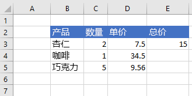

# <a name="work-with-ranges-using-the-excel-javascript-api"></a>使用 Excel JavaScript API 处理区域

本文中的代码示例展示了如何使用 Excel JavaScript API 对区域执行常见任务。 有关 **Range** 对象支持的属性和方法的完整列表，请参阅 [Range 对象 (Excel JavaScript API)](https://docs.microsoft.com/javascript/api/excel/excel.range)。

> [!NOTE]
> 有关如何使用区域执行更高级任务的代码示例，请参阅 [使用 Excel JavaScript API 对区域执行操作（高级）](excel-add-ins-ranges-advanced.md)。

## <a name="get-a-range"></a>获取区域

下面的示例介绍了在工作表中获取对区域的引用的不同方法。

### <a name="get-range-by-address"></a>按地址获取区域

下面的代码示例从名为 **Sample** 的工作表中获取地址为 **B2:B5** 的区域，加载其 **address** 属性，并向控制台写入一条消息。

```js
Excel.run(function (context) {
    var sheet = context.workbook.worksheets.getItem("Sample");
    var range = sheet.getRange("B2:C5");
    range.load("address");

    return context.sync()
        .then(function () {
            console.log(`The address of the range B2:C5 is "${range.address}"`);
        });
}).catch(errorHandlerFunction);
```

### <a name="get-range-by-name"></a>按名称获取区域

下面的代码示例从名为 **Sample** 的工作表中获取名为 **MyRange** 的区域，加载其 **address** 属性，并向控制台写入一条消息。

```js
Excel.run(function (context) {
    var sheet = context.workbook.worksheets.getItem("Sample");
    var range = sheet.getRange("MyRange");
    range.load("address");

    return context.sync()
        .then(function () {
            console.log(`The address of the range "MyRange" is "${range.address}"`);
        });
}).catch(errorHandlerFunction);
```

### <a name="get-used-range"></a>获取使用的区域

下面的代码示例从名为 **Sample** 的工作表中获取使用的区域，加载其 **address** 属性，并向控制台写入一条消息。 使用的区域是包含工作表中分配了值或格式的任意单元格的最小区域。 如果整个工作表为空，则 **getUsedRange()** 方法返回仅由工作表左上角单元格组成的区域。

```js
Excel.run(function (context) {
    var sheet = context.workbook.worksheets.getItem("Sample");
    var range = sheet.getUsedRange();
    range.load("address");

    return context.sync()
        .then(function () {
            console.log(`The address of the used range in the worksheet is "${range.address}"`);
        });
}).catch(errorHandlerFunction);
```

### <a name="get-entire-range"></a>获取整个区域

下面的代码示例从名为 **Sample** 的工作表中获取整个工作表区域，加载其 **address** 属性，并向控制台写入一条消息。

```js
Excel.run(function (context) {
    var sheet = context.workbook.worksheets.getItem("Sample");
    var range = sheet.getRange();
    range.load("address");

    return context.sync()
        .then(function () {
            console.log(`The address of the entire worksheet range is "${range.address}"`);
        });
}).catch(errorHandlerFunction);
```

## <a name="insert-a-range-of-cells"></a>插入多个单元格

下面的代码示例将多个单元格插入位置 **B4:E4**，并将其他单元格下移，以便为新的单元格提供空间。

```js
Excel.run(function (context) {
    var sheet = context.workbook.worksheets.getItem("Sample");
    var range = sheet.getRange("B4:E4");

    range.insert(Excel.InsertShiftDirection.down);
    
    return context.sync();
}).catch(errorHandlerFunction);
```

**插入区域之前的数据**


**插入区域之后的数据**


## <a name="clear-a-range-of-cells"></a>清除多个单元格内容

下面的代码示例清除区域 **E2:E5** 中的所有内容和单元格格式设置。  

```js
Excel.run(function (context) {
    var sheet = context.workbook.worksheets.getItem("Sample");
    var range = sheet.getRange("E2:E5");

    range.clear();

    return context.sync();
}).catch(errorHandlerFunction);
```

**清除区域之前的数据**


**清除区域之后的数据**


## <a name="delete-a-range-of-cells"></a>删除多个单元格

下面的代码示例删除区域 **B4:E4** 中的单元格，并将其他单元格上移以填充删除的单元格空出的空间。

```js
Excel.run(function (context) {
    var sheet = context.workbook.worksheets.getItem("Sample");
    var range = sheet.getRange("B4:E4");

    range.delete(Excel.DeleteShiftDirection.up);

    return context.sync();
}).catch(errorHandlerFunction);
```

**删除区域之前的数据**


**删除区域之后的数据**


## <a name="set-the-selected-range"></a>设置所选区域

下面的代码示例选择活动工作表中的区域 **B2:E6**。

```js
Excel.run(function (context) {
    var sheet = context.workbook.worksheets.getActiveWorksheet();
    var range = sheet.getRange("B2:E6");

    range.select();

    return context.sync();
}).catch(errorHandlerFunction);
```

**选定的区域 B2:E6**


## <a name="get-the-selected-range"></a>获取所选区域

下面的代码示例获取所选区域，加载其 **address** 属性，并向控制台写入一条消息。 

```js
Excel.run(function (context) {
    var range = context.workbook.getSelectedRange();
    range.load("address");

    return context.sync()
        .then(function () {
            console.log(`The address of the selected range is "${range.address}"`);
        });
}).catch(errorHandlerFunction);
```

## <a name="set-values-or-formulas"></a>设置值或公式

下面的示例演示如何为单个单元格或多个单元格设置值和公式。

### <a name="set-value-for-a-single-cell"></a>设置单个单元格的值

下面的代码示例将单元格 **C3** 的值设置为“5”，然后设置适合数据的最佳列宽。

```js
Excel.run(function (context) {
    var sheet = context.workbook.worksheets.getItem("Sample");

    var range = sheet.getRange("C3");
    range.values = [[ 5 ]];
    range.format.autofitColumns();

    return context.sync();
}).catch(errorHandlerFunction);
```

**更新单元格值之前的数据**


**更新单元格值之后的数据**


### <a name="set-values-for-a-range-of-cells"></a>设置多个单元格的值

下面的代码示例为区域 **B5:D5** 中的单元格设置值，然后设置适合数据的最佳列宽。

```js
Excel.run(function (context) {
    var sheet = context.workbook.worksheets.getItem("Sample");

    var data = [
        ["Potato Chips", 10, 1.80],
    ];
    
    var range = sheet.getRange("B5:D5");
    range.values = data;
    range.format.autofitColumns();

    return context.sync();
}).catch(errorHandlerFunction);
```

**更新多个单元格值之前的数据**


**更新多个单元格值之后的数据**


### <a name="set-formula-for-a-single-cell"></a>设置单个单元格的公式

下面的代码示例为单元格 **E3** 设置公式，然后设置适合数据的最佳列宽。

```js
Excel.run(function (context) {
    var sheet = context.workbook.worksheets.getItem("Sample");

    var range = sheet.getRange("E3");
    range.formulas = [[ "=C3 * D3" ]];
    range.format.autofitColumns();

    return context.sync();
}).catch(errorHandlerFunction);
```

**设置单元格公式之前的数据**


**设置单元格公式之后的数据**



### <a name="set-formulas-for-a-range-of-cells"></a>设置多个单元格的公式

下面的代码示例为区域 **E2:E6** 中的单元格设置公式，然后设置适合数据的最佳列宽。

```js
Excel.run(function (context) {
    var sheet = context.workbook.worksheets.getItem("Sample");

    var data = [
        ["=C3 * D3"],
        ["=C4 * D4"],
        ["=C5 * D5"],
        ["=SUM(E3:E5)"]
    ];
    
    var range = sheet.getRange("E3:E6");
    range.formulas = data;
    range.format.autofitColumns();

    return context.sync();
}).catch(errorHandlerFunction);
```

**设置多个单元格公式之前的数据**


**设置多个单元格公式之后的数据**


## <a name="get-values-text-or-formulas"></a>获取值、文本或公式

以下示例演示如何从多个单元格获取值、文本和公式。

### <a name="get-values-from-a-range-of-cells"></a>从多个单元格获取值

下面的代码示例获取区域 **B2:E6**，加载其 **values** 属性，并向控制台写入值。 某个区域的 **values** 属性指定单元格包含的原始值。 即使某个区域中的某些单元格包含公式，该区域的 **values** 属性仍会指定这些单元格的原始值，而不是任何公式。

```js
Excel.run(function (context) {
    var sheet = context.workbook.worksheets.getItem("Sample");
    var range = sheet.getRange("B2:E6");
    range.load("values");

    return context.sync()
        .then(function () {
            console.log(JSON.stringify(range.values, null, 4));
        });
}).catch(errorHandlerFunction);
```

**区域中的数据（E 列中的值为公式的结果）**


**range.values（通过上面的代码示例记录到控制台）**

```json
[
    [
        "Product",
        "Qty",
        "Unit Price",
        "Total Price"
    ],
    [
        "Almonds",
        2,
        7.5,
        15
    ],
    [
        "Coffee",
        1,
        34.5,
        34.5
    ],
    [
        "Chocolate",
        5,
        9.56,
        47.8
    ],
    [
        "",
        "",
        "",
        97.3
    ]
]
```

### <a name="get-text-from-a-range-of-cells"></a>从多个单元格获取文本

下面的代码示例获取区域 **B2:E6**，加载其 **text** 属性，并向控制台写入该文本。  区域的 **text** 属性指定该区域单元格的显示值。 即使某个区域中的某些单元格包含公式，该区域的 **text** 属性仍会指定这些单元格的显示值，而不是任何公式。

```js
Excel.run(function (context) {
    var sheet = context.workbook.worksheets.getItem("Sample");
    var range = sheet.getRange("B2:E6");
    range.load("text");

    return context.sync()
        .then(function () {
            console.log(JSON.stringify(range.text, null, 4));
        });
}).catch(errorHandlerFunction);
```

**区域中的数据（E 列中的值为公式的结果）**


**range.text（通过上面的代码示例记录到控制台）**

```json
[
    [
        "Product",
        "Qty",
        "Unit Price",
        "Total Price"
    ],
    [
        "Almonds",
        "2",
        "7.5",
        "15"
    ],
    [
        "Coffee",
        "1",
        "34.5",
        "34.5"
    ],
    [
        "Chocolate",
        "5",
        "9.56",
        "47.8"
    ],
    [
        "",
        "",
        "",
        "97.3"
    ]
]
```

### <a name="get-formulas-from-a-range-of-cells"></a>从多个单元格获取公式

下面的代码示例获取区域 **B2:E6**，加载其 **formulas** 属性，并向控制台写入该公式。  区域的 **formulas** 属性为包含公式的区域单元格指定公式，并为不包含公式的区域单元格指定原始值。

```js
Excel.run(function (context) {
    var sheet = context.workbook.worksheets.getItem("Sample");
    var range = sheet.getRange("B2:E6");
    range.load("formulas");

    return context.sync()
        .then(function () {
            console.log(JSON.stringify(range.formulas, null, 4));
        });
}).catch(errorHandlerFunction);
```

**区域中的数据（E 列中的值为公式的结果）**


**range.formulas（通过上面的代码示例记录到控制台）**

```json
[
    [
        "Product",
        "Qty",
        "Unit Price",
        "Total Price"
    ],
    [
        "Almonds",
        2,
        7.5,
        "=C3 * D3"
    ],
    [
        "Coffee",
        1,
        34.5,
        "=C4 * D4"
    ],
    [
        "Chocolate",
        5,
        9.56,
        "=C5 * D5"
    ],
    [
        "",
        "",
        "",
        "=SUM(E3:E5)"
    ]
]
```

## <a name="set-range-format"></a>设置区域格式

下面的示例演示如何为区域中的单元格设置字体颜色、填充颜色和数字格式。

### <a name="set-font-color-and-fill-color"></a>设置字体颜色和填充颜色

下面的代码示例为区域 **B2:E2** 中的单元格设置字体颜色和填充颜色。

```js
Excel.run(function (context) {
    var sheet = context.workbook.worksheets.getItem("Sample");

    var range = sheet.getRange("B2:E2");
    range.format.fill.color = "#4472C4";;
    range.format.font.color = "white";

    return context.sync();
}).catch(errorHandlerFunction);
```

**区域中设置字体颜色和填充颜色之前的数据**


**区域中设置字体颜色和填充颜色之后的数据**


### <a name="set-number-format"></a>设置数字格式

下面的代码示例为区域 **D3:E5** 中的单元格设置数字格式。

```js
Excel.run(function (context) {
    var sheet = context.workbook.worksheets.getItem("Sample");

    var formats = [
        ["0.00", "0.00"],
        ["0.00", "0.00"],
        ["0.00", "0.00"]
    ];

    var range = sheet.getRange("D3:E5");
    range.numberFormat = formats;

    return context.sync();
}).catch(errorHandlerFunction);
```

**区域中设置数字格式之前的数据**


**区域中设置数字格式之后的数据**


### <a name="conditional-formatting-of-ranges"></a>范围的条件格式

范围可以根据条件将格式应用于个别单元格。 有关此操作的详细信息，请参阅[将条件格式应用于 Excel 范围](excel-add-ins-conditional-formatting.md)。

## <a name="find-a-cell-using-string-matching-preview"></a>查找使用字符串匹配 （预览） 的单元格

> [!NOTE]
> 区域对象的 `find` 函数当前仅适用于公共预览版（beta 版本）。 若要使用此功能，必须使用 Office.js CDN 的 beta 版库：https://appsforoffice.microsoft.com/lib/beta/hosted/office.js。
> 如果使用的是 TypeScript 或代码编辑器将 TypeScript 类型定义文件用于 IntelliSense，则使用 https://appsforoffice.microsoft.com/lib/beta/hosted/office.d.ts。

`Range` 对象具有 `find` 方法在区域内搜索指定字符串。 返回有匹配文本的第一个单元格区域。 以下代码示例查找值等于字符串 **食品** 的第一个单元格，并将其地址记录到控制台。 请注意，若指定的字符串不存在于区域中，`find` 将引发 `ItemNotFound` 错误。 若您预计到指定的字符串可能不存在区域中，则可使用 [findOrNullObject](excel-add-ins-advanced-concepts.md#42ornullobject-methods) 方法，以便您的代码可正常处理该情况。

```js
Excel.run(function (context) {
    var sheet = context.workbook.worksheets.getItem("Sample");
    var table = sheet.tables.getItem("ExpensesTable");
    var searchRange = table.getRange();
    var foundRange = searchRange.find("Food", {
        completeMatch: true, // find will match the whole cell value
        matchCase: false, // find will not match case
        searchDirection: Excel.SearchDirection.forward // find will start searching at the beginning of the range
    });

    foundRange.load("address");
    return context.sync()
        .then(function() {
            console.log(foundRange.address);
    });
}).catch(errorHandlerFunction);
```

在表示一个单元格的区域调用 `find` 方法时，将在整个工作表进行搜索。 搜索开始于该单元格，并按照 `SearchCriteria.searchDirection` 指定的方向进行，如有需要在工作表结束的地方换行。

## <a name="see-also"></a>另请参阅

- [使用 Excel JavaScript API 对区域执行操作（高级）](excel-add-ins-ranges-advanced.md)
- [Excel JavaScript API 基本编程概念](excel-add-ins-core-concepts.md)