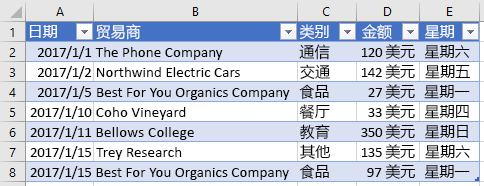
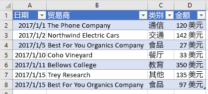

# <a name="work-with-tables-using-the-excel-javascript-api"></a>使用 Excel JavaScript API 处理表格

本文中的代码示例展示了如何使用 Excel JavaScript API 对表格执行常见任务。 有关 **Table** 和 **TableCollection** 对象支持的属性和方法的完整列表，请参阅 [Table 对象 (Excel JavaScript API)](https://dev.office.com/reference/add-ins/excel/table) 和 [TableCollection 对象 (Excel JavaScript API)](https://dev.office.com/reference/add-ins/excel/tablecollection)。

## <a name="create-a-table"></a>创建表

下面的代码示例在名为 **Sample** 的工作表中创建一个表。 此表包含标题，并且包含四列和七行数据。 如果在其中运行代码的 Excel 主机应用程序支持[要求集](https://dev.office.com/reference/add-ins/requirement-sets/excel-api-requirement-sets) **ExcelApi 1.2**，则为表中的当前数据设置最佳列宽和行高。

> [!NOTE]
> 若要指定表格名称，必须先创建表格，再设置它的 **name** 属性，如下面的示例所示。

```js
Excel.run(function (context) {
    var sheet = context.workbook.worksheets.getItem("Sample");
    var expensesTable = sheet.tables.add("A1:D1", true /*hasHeaders*/);
    expensesTable.name = "ExpensesTable";

    expensesTable.getHeaderRowRange().values = [["Date", "Merchant", "Category", "Amount"]];

    expensesTable.rows.add(null /*add rows to the end of the table*/, [
        ["1/1/2017", "The Phone Company", "Communications", "$120"],
        ["1/2/2017", "Northwind Electric Cars", "Transportation", "$142"],
        ["1/5/2017", "Best For You Organics Company", "Groceries", "$27"],
        ["1/10/2017", "Coho Vineyard", "Restaurant", "$33"],
        ["1/11/2017", "Bellows College", "Education", "$350"],
        ["1/15/2017", "Trey Research", "Other", "$135"],
        ["1/15/2017", "Best For You Organics Company", "Groceries", "$97"]
    ]);

    if (Office.context.requirements.isSetSupported("ExcelApi", 1.2)) {
        sheet.getUsedRange().format.autofitColumns();
        sheet.getUsedRange().format.autofitRows();
    }

    sheet.activate();

    return context.sync();
}).catch(errorHandlerFunction);
```

**新建表格**


## <a name="add-rows-to-a-table"></a>向表添加行

下面的代码示例将七个新行添加到名为 **Sample** 的工作表内的 **ExpensesTable** 表中。 新行被添加到表的末尾。 如果在其中运行代码的 Excel 主机应用程序支持[要求集](https://dev.office.com/reference/add-ins/requirement-sets/excel-api-requirement-sets) **ExcelApi 1.2**，则为表中的当前数据设置最佳列宽和行高。

> [!NOTE]
> [TableRow](https://dev.office.com/reference/add-ins/excel/tablerow) 对象的 **index** 属性表示表格行集合内行的索引编号。 **TableRow** 对象不包含可用作标识行的唯一键的 **id** 属性。

```js
Excel.run(function (context) {
    var sheet = context.workbook.worksheets.getItem("Sample");       
    var expensesTable = sheet.tables.getItem("ExpensesTable");

    expensesTable.rows.add(null /*add rows to the end of the table*/, [
        ["1/16/2017", "THE PHONE COMPANY", "Communications", "$120"],
        ["1/20/2017", "NORTHWIND ELECTRIC CARS", "Transportation", "$142"],
        ["1/20/2017", "BEST FOR YOU ORGANICS COMPANY", "Groceries", "$27"],
        ["1/21/2017", "COHO VINEYARD", "Restaurant", "$33"],
        ["1/25/2017", "BELLOWS COLLEGE", "Education", "$350"],
        ["1/28/2017", "TREY RESEARCH", "Other", "$135"],
        ["1/31/2017", "BEST FOR YOU ORGANICS COMPANY", "Groceries", "$97"]
    ]);

    if (Office.context.requirements.isSetSupported("ExcelApi", 1.2)) {
        sheet.getUsedRange().format.autofitColumns();
        sheet.getUsedRange().format.autofitRows();
    }

    return context.sync();
}).catch(errorHandlerFunction);
```

**包含新行的表**


## <a name="add-a-column-to-a-table"></a>向表添加列

下面的示例演示如何向表添加列。 第一个示例使用静态值填充新列；第二个示例使用公式填充新列。

> [!NOTE]
> [TableColumn](https://dev.office.com/reference/add-ins/excel/tablecolumn) 对象的 **index** 属性表示表格列集合内列的索引编号。 **TableColumn** 对象的 **id** 属性包含用于标识列的唯一键。

### <a name="add-a-column-that-contains-static-values"></a>添加包含静态值的列

下面的代码示例将一个新列添加到名为 **Sample** 的工作表内的 **ExpensesTable** 表中。 新列添加到表中所有现有列后面，并且包含一个标题（“星期几”），以及用于填充列中单元格的数据。 如果在其中运行代码的 Excel 主机应用程序支持[要求集](https://dev.office.com/reference/add-ins/requirement-sets/excel-api-requirement-sets) **ExcelApi 1.2**，则为表中的当前数据设置最佳列宽和行高。

```js
Excel.run(function (context) {
    var sheet = context.workbook.worksheets.getItem("Sample");       
    var expensesTable = sheet.tables.getItem("ExpensesTable");

    expensesTable.columns.add(null /*add columns to the end of the table*/, [
        ["Day of the Week"],
        ["Saturday"],
        ["Friday"],
        ["Monday"],
        ["Thursday"],
        ["Sunday"],
        ["Saturday"],
        ["Monday"]
    ]);

    if (Office.context.requirements.isSetSupported("ExcelApi", 1.2)) {
        sheet.getUsedRange().format.autofitColumns();
        sheet.getUsedRange().format.autofitRows();
    }

    return context.sync();
}).catch(errorHandlerFunction);
```

**包含新列的表**



### <a name="add-a-column-that-contains-formulas"></a>添加包含公式的列

下面的代码示例将一个新列添加到名为 **Sample** 的工作表内的 **ExpensesTable** 表中。 新列添加到表的末尾，包含标题（“日期类型”），并使用一个公式来填充列中的每个数据单元格。 如果在其中运行代码的 Excel 主机应用程序支持[要求集](https://dev.office.com/reference/add-ins/requirement-sets/excel-api-requirement-sets) **ExcelApi 1.2**，则为表中的当前数据设置最佳列宽和行高。

```js
Excel.run(function (context) {
    var sheet = context.workbook.worksheets.getItem("Sample");
    var expensesTable = sheet.tables.getItem("ExpensesTable");

    expensesTable.columns.add(null /*add columns to the end of the table*/, [
        ["Type of the Day"],
        ['=IF(OR((TEXT([DATE], "dddd") = "Saturday"), (TEXT([DATE], "dddd") = "Sunday")), "Weekend", "Weekday")'],
        ['=IF(OR((TEXT([DATE], "dddd") = "Saturday"), (TEXT([DATE], "dddd") = "Sunday")), "Weekend", "Weekday")'],
        ['=IF(OR((TEXT([DATE], "dddd") = "Saturday"), (TEXT([DATE], "dddd") = "Sunday")), "Weekend", "Weekday")'],
        ['=IF(OR((TEXT([DATE], "dddd") = "Saturday"), (TEXT([DATE], "dddd") = "Sunday")), "Weekend", "Weekday")'],
        ['=IF(OR((TEXT([DATE], "dddd") = "Saturday"), (TEXT([DATE], "dddd") = "Sunday")), "Weekend", "Weekday")'],
        ['=IF(OR((TEXT([DATE], "dddd") = "Saturday"), (TEXT([DATE], "dddd") = "Sunday")), "Weekend", "Weekday")'],
        ['=IF(OR((TEXT([DATE], "dddd") = "Saturday"), (TEXT([DATE], "dddd") = "Sunday")), "Weekend", "Weekday")']
    ]);

    if (Office.context.requirements.isSetSupported("ExcelApi", 1.2)) {
        sheet.getUsedRange().format.autofitColumns();
        sheet.getUsedRange().format.autofitRows();
    }

    return context.sync();
}).catch(errorHandlerFunction);
```

**包含新的计算列的表**


## <a name="update-column-name"></a>更新列名称

下面的代码示例将表格中第一列的名称更新为“购买日期”。如果运行代码的 Excel 主机应用支持[要求集](https://dev.office.com/reference/add-ins/requirement-sets/excel-api-requirement-sets) **ExcelApi 1.2**，那么列宽和行高会设置为最适应表格中的当前数据。

```js
Excel.run(function (context) {
    var sheet = context.workbook.worksheets.getItem("Sample");

    var expensesTable = sheet.tables.getItem("ExpensesTable");
    expensesTable.columns.load("items");

    return context.sync()
        .then(function () {
            expensesTable.columns.items[0].name = "Purchase date";

            if (Office.context.requirements.isSetSupported("ExcelApi", 1.2)) {
                sheet.getUsedRange().format.autofitColumns();
                sheet.getUsedRange().format.autofitRows();
            }

            return context.sync();
        });
}).catch(errorHandlerFunction);
```

**包含新列名称的表格**


## <a name="get-data-from-a-table"></a>从表中获取数据

下面的代码示例从名为 **Sample** 的工作表内的 **ExpensesTable** 表中读取数据，然后在同一工作表中的表下输出该数据。

```js
Excel.run(function (context) {
    var sheet = context.workbook.worksheets.getItem("Sample");
    var expensesTable = sheet.tables.getItem("ExpensesTable");

    // Get data from the header row
    var headerRange = expensesTable.getHeaderRowRange().load("values");

    // Get data from the table
    var bodyRange = expensesTable.getDataBodyRange().load("values");

    // Get data from a single column
    var columnRange = expensesTable.columns.getItem("Merchant").getDataBodyRange().load("values");

    // Get data from a single row
    var rowRange = expensesTable.rows.getItemAt(1).load("values");

    // Sync to populate proxy objects with data from Excel
    return context.sync()
        .then(function () {
            var headerValues = headerRange.values;
            var bodyValues = bodyRange.values;
            var merchantColumnValues = columnRange.values;
            var secondRowValues = rowRange.values;

            // Write data from table back to the sheet
            sheet.getRange("A11:A11").values = [["Results"]];
            sheet.getRange("A13:D13").values = headerValues;
            sheet.getRange("A14:D20").values = bodyValues;
            sheet.getRange("B23:B29").values = merchantColumnValues;
            sheet.getRange("A32:D32").values = secondRowValues;

            // Sync to update the sheet in Excel
            return context.sync();
        });
}).catch(errorHandlerFunction);
```

**表和数据输出**


## <a name="sort-data-in-a-table"></a>在表中对数据进行排序

下面的代码示例根据表中第四列的值，对表数据按降序进行排序。

```js
Excel.run(function (context) {
    var sheet = context.workbook.worksheets.getItem("Sample");
    var expensesTable = sheet.tables.getItem("ExpensesTable");

    // Queue a command to sort data by the fourth column of the table (descending)
    var sortRange = expensesTable.getDataBodyRange();
    sortRange.sort.apply([
        {
            key: 3,
            ascending: false,
        },
    ]);

    // Sync to run the queued command in Excel
    return context.sync();
}).catch(errorHandlerFunction);
```

**按金额排序的表数据（降序）**


## <a name="apply-filters-to-a-table"></a>将筛选器应用于表

下面的代码示例将筛选器应用到表中的**金额**列和**类别**列。 筛选器筛选的结果是，仅显示符合以下条件的行：**类别**为其中一个指定值且**金额**低于所有行的平均值。

```js
Excel.run(function (context) {
    var sheet = context.workbook.worksheets.getItem("Sample");
    var expensesTable = sheet.tables.getItem("ExpensesTable");

    // Queue a command to apply a filter on the Category column
    filter = expensesTable.columns.getItem("Category").filter;
    filter.apply({
        filterOn: Excel.FilterOn.values,
        values: ["Restaurant", "Groceries"]
    });

    // Queue a command to apply a filter on the Amount column
    var filter = expensesTable.columns.getItem("Amount").filter;
    filter.apply({
        filterOn: Excel.FilterOn.dynamic,
        dynamicCriteria: Excel.DynamicFilterCriteria.belowAverage
    });

    // Sync to run the queued commands in Excel
    return context.sync();
}).catch(errorHandlerFunction);
```

**将筛选器应用于类别和金额的表数据**


## <a name="clear-table-filters"></a>清除表筛选器

下面的代码示例清除当前应用于表的所有筛选器。

```js
Excel.run(function (context) {
    var sheet = context.workbook.worksheets.getItem("Sample");
    var expensesTable = sheet.tables.getItem("ExpensesTable");

    expensesTable.clearFilters();

    return context.sync();
}).catch(errorHandlerFunction);
```

**没有应用任何筛选器的表数据**



## <a name="get-the-visible-range-from-a-filtered-table"></a>从筛选表中获取可见区域

下面的代码示例获取一个区域，其中只包含当前在指定表中可见的单元格数据，然后将该区域的值写入控制台。 可以使用如下所示的 **getVisibleView()** 方法，在应用列筛选器时，都能获取表的可见内容。

```js
Excel.run(function (context) {
    var sheet = context.workbook.worksheets.getItem("Sample");
    var expensesTable = sheet.tables.getItem("ExpensesTable");

    var visibleRange = expensesTable.getDataBodyRange().getVisibleView();
    visibleRange.load("values");

    return context.sync()
        .then(function() {
            console.log(visibleRange.values);
        });
}).catch(errorHandlerFunction);
```

## <a name="format-a-table"></a>设置表格式

下面的代码示例将格式应用于表。 它为表的标题行、正文、第二行以及第一列指定不同的填充颜色。 有关可以用来指定格式的属性的信息，请参阅 [RangeFormat 对象 (Excel JavaScript API)](https://dev.office.com/reference/add-ins/excel/rangeformat)。

```js
Excel.run(function (context) {
    var sheet = context.workbook.worksheets.getItem("Sample");
    var expensesTable = sheet.tables.getItem("ExpensesTable");

    expensesTable.getHeaderRowRange().format.fill.color = "#C70039";
    expensesTable.getDataBodyRange().format.fill.color = "#DAF7A6";
    expensesTable.rows.getItemAt(1).getRange().format.fill.color = "#FFC300";
    expensesTable.columns.getItemAt(0).getDataBodyRange().format.fill.color = "#FFA07A";

    return context.sync();
}).catch(errorHandlerFunction);
```

**应用格式设置的表**


## <a name="convert-a-range-to-a-table"></a>将区域转换为表

下面的代码示例创建一个数据区域，然后将该区域转换为表。

```js
Excel.run(function (context) {
    var sheet = context.workbook.worksheets.getItem("Sample");

    // Define values for the range
    var values = [["Product", "Qtr1", "Qtr2", "Qtr3", "Qtr4"],
    ["Frames", 5000, 7000, 6544, 4377],
    ["Saddles", 400, 323, 276, 651],
    ["Brake levers", 12000, 8766, 8456, 9812],
    ["Chains", 1550, 1088, 692, 853],
    ["Mirrors", 225, 600, 923, 544],
    ["Spokes", 6005, 7634, 4589, 8765]];

    // Create the range
    var range = sheet.getRange("A1:E7");
    range.values = values;

    if (Office.context.requirements.isSetSupported("ExcelApi", 1.2)) {
        sheet.getUsedRange().format.autofitColumns();
        sheet.getUsedRange().format.autofitRows();
    }

    sheet.activate();

    // Convert the range to a table
    var expensesTable = sheet.tables.add('A1:E7', true);
    expensesTable.name = "ExpensesTable";

    return context.sync();
}).catch(errorHandlerFunction);
```

**内的数据（在区域转换为表之前）**


**表中的数据（在区域转换为表之后）**


## <a name="import-json-data-into-a-table"></a>将 JSON 数据导入表

下面的代码示例在名为 **Sample** 的工作表中创建一个表，然后使用定义了两行数据的 JSON 对象来填充表。 如果在其中运行代码的 Excel 主机应用程序支持[要求集](https://dev.office.com/reference/add-ins/requirement-sets/excel-api-requirement-sets) **ExcelApi 1.2**，则为表中的当前数据设置最佳列宽和行高。

```js
Excel.run(function (context) {
    var sheet = context.workbook.worksheets.getItem("Sample");

    var expensesTable = sheet.tables.add("A1:D1", true /*hasHeaders*/);
    expensesTable.name = "ExpensesTable";
    expensesTable.getHeaderRowRange().values = [["Date", "Merchant", "Category", "Amount"]];

    var transactions = [
      {
        "DATE": "1/1/2017",
        "MERCHANT": "The Phone Company",
        "CATEGORY": "Communications",
        "AMOUNT": "$120"
      },
      {
        "DATE": "1/1/2017",
        "MERCHANT": "Southridge Video",
        "CATEGORY": "Entertainment",
        "AMOUNT": "$40"
      }
    ];

    var newData = transactions.map(item =>
        [item.DATE, item.MERCHANT, item.CATEGORY, item.AMOUNT]);

    expensesTable.rows.add(null, newData);

    if (Office.context.requirements.isSetSupported("ExcelApi", 1.2)) {
        sheet.getUsedRange().format.autofitColumns();
        sheet.getUsedRange().format.autofitRows();
    }

    sheet.activate();

    return context.sync();
}).catch(errorHandlerFunction);
```

**新建表**


## <a name="see-also"></a>另请参阅

- [Excel JavaScript API 核心概念](excel-add-ins-core-concepts.md)
- [Table 对象 (Excel JavaScript API)](https://dev.office.com/reference/add-ins/excel/table)
- [TableCollection 对象 (Excel JavaScript API)](https://dev.office.com/reference/add-ins/excel/tablecollection)
