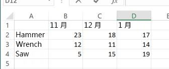

# <a name="call-built-in-excel-worksheet-functions"></a><span data-ttu-id="ba782-102">调用内置 Excel 工作表函数</span><span class="sxs-lookup"><span data-stu-id="ba782-102">Call built-in Excel worksheet functions</span></span>

<span data-ttu-id="ba782-103">本文介绍了如何使用 Excel JavaScript API 调用内置 Excel 工作表函数（如 `VLOOKUP` 和 `SUM`）。</span><span class="sxs-lookup"><span data-stu-id="ba782-103">This article explains how to call built-in Excel worksheet functions such as `VLOOKUP` and `SUM` using the Excel JavaScript API.</span></span> <span data-ttu-id="ba782-104">其中还收录了可以使用 Excel JavaScript API 调用的内置 Excel 工作表函数的完整列表。</span><span class="sxs-lookup"><span data-stu-id="ba782-104">It also provides the full list of built-in Excel worksheet functions that can be called using the Excel JavaScript API.</span></span>

> [!NOTE]
> <span data-ttu-id="ba782-105">若要了解如何使用 Excel JavaScript API 在 Excel 中创建*自定义函数*，请参阅[在 Excel 中创建自定义函数](custom-functions-overview.md)。</span><span class="sxs-lookup"><span data-stu-id="ba782-105">For information about how to create *custom functions* in Excel using the Excel JavaScript API, see [Create custom functions in Excel](custom-functions-overview.md).</span></span>

## <a name="calling-a-worksheet-function"></a><span data-ttu-id="ba782-106">创建工作表函数</span><span class="sxs-lookup"><span data-stu-id="ba782-106">Calling a worksheet function</span></span>

<span data-ttu-id="ba782-107">下面的代码片段展示了如何调用工作表函数，其中 `sampleFunction()` 是占位符，应将它替换为要调用的函数名称和函数需要使用的输入参数。</span><span class="sxs-lookup"><span data-stu-id="ba782-107">The following code snippet shows how to call a worksheet function, where `sampleFunction()` is a placeholder that should be replaced with the name of the function to call and the input parameters that the function requires.</span></span> <span data-ttu-id="ba782-108">工作表函数返回的 **FunctionResult** 对象的 **value** 属性包含指定函数的结果。</span><span class="sxs-lookup"><span data-stu-id="ba782-108">The **value** property of the **FunctionResult** object that's returned by a worksheet function contains the result of the specified function.</span></span> <span data-ttu-id="ba782-109">如此示例所示，必须先对 **FunctionResult** 对象的 **value** 属性执行 `load` 操作，然后才能读取它。</span><span class="sxs-lookup"><span data-stu-id="ba782-109">As this example shows, you must `load` the **value** property of the **FunctionResult** object before you can read it.</span></span> <span data-ttu-id="ba782-110">在此示例中，函数结果被直接写入控制台。</span><span class="sxs-lookup"><span data-stu-id="ba782-110">In this example, the result of the function is simply being written to the console.</span></span> 

```js
var functionResult = context.workbook.functions.sampleFunction(); 
functionResult.load('value');
return context.sync()
    .then(function () {
        console.log('Result of the function: ' + functionResult.value);
    });
```

> [!TIP]
> <span data-ttu-id="ba782-111">有关可以使用 Excel JavaScript API 调用的函数列表，请参阅本文的[支持的工作表函数](#supported-worksheet-functions)部分。</span><span class="sxs-lookup"><span data-stu-id="ba782-111">See the [Supported worksheet functions](#supported-worksheet-functions) section of this article for a list of functions that can be called using the Excel JavaScript API.</span></span>

## <a name="sample-data"></a><span data-ttu-id="ba782-112">示例数据</span><span class="sxs-lookup"><span data-stu-id="ba782-112">Sample data</span></span>

<span data-ttu-id="ba782-113">下图展示了 Excel 工作表中的表格，其中包含三个月内各种工具的销售数据。</span><span class="sxs-lookup"><span data-stu-id="ba782-113">The following image shows a table in an Excel worksheet that contains sales data for various types of tools over a three month period.</span></span> <span data-ttu-id="ba782-114">表格中的每个数字均表示具体工具在特定月份中的销售件数。</span><span class="sxs-lookup"><span data-stu-id="ba782-114">Each number in the table represents the number of units sold for a specific tool in a specific month.</span></span> <span data-ttu-id="ba782-115">接下来的两个示例展示了如何向此类数据应用内置工作表函数。</span><span class="sxs-lookup"><span data-stu-id="ba782-115">The examples that follow will show how to apply built-in worksheet functions to this data.</span></span>



## <a name="example-1-single-function"></a><span data-ttu-id="ba782-117">示例 1：单函数</span><span class="sxs-lookup"><span data-stu-id="ba782-117">Example 1: Single function</span></span>

<span data-ttu-id="ba782-118">下面的代码示例向前述示例数据应用 `VLOOKUP` 函数，以确定 11 月售出的扳手数。</span><span class="sxs-lookup"><span data-stu-id="ba782-118">The following code sample applies the `VLOOKUP` function to the sample data described previously to identify the number of wrenches sold in November.</span></span>

```js
Excel.run(function (context) {
    var range = context.workbook.worksheets.getItem("Sheet1").getRange("A1:D4");
    var unitSoldInNov = context.workbook.functions.vlookup("Wrench", range, 2, false);
    unitSoldInNov.load('value');

    return context.sync()
        .then(function () {
            console.log(' Number of wrenches sold in November = ' + unitSoldInNov.value);
        });
}).catch(errorHandlerFunction);
```

## <a name="example-2-nested-functions"></a><span data-ttu-id="ba782-119">示例 2：嵌套函数</span><span class="sxs-lookup"><span data-stu-id="ba782-119">Example 2: Nested functions</span></span>

<span data-ttu-id="ba782-120">下面的代码示例向前述示例数据应用 `VLOOKUP` 函数，以分别确定 11 月和 12 月售出的扳手数。然后，应用 `SUM` 函数，以计算这两个月售出的扳手总数。</span><span class="sxs-lookup"><span data-stu-id="ba782-120">The following code sample applies the `VLOOKUP` function to the sample data described previously to identify the number of wrenches sold in November and the number of wrenches sold in December, and then applies the `SUM` function to calculate the total number of wrenches sold during those two months.</span></span> 

<span data-ttu-id="ba782-121">如此示例所示，如果一个或多个函数调用嵌套在另一个函数调用中，只需对随后要读取的最终结果（在此示例中为 `sumOfTwoLookups`）执行 `load` 操作即可。</span><span class="sxs-lookup"><span data-stu-id="ba782-121">As this example shows, when one or more function calls are nested within another function call, you only need to `load` the final result that you subsequently want to read (in this example, `sumOfTwoLookups`).</span></span> <span data-ttu-id="ba782-122">系统会计算所有中间结果（在此示例中，为每个 `VLOOKUP` 函数的结果），并根据这些中间结果计算最终结果。</span><span class="sxs-lookup"><span data-stu-id="ba782-122">Any intermediate results (in this example, the result of each `VLOOKUP` function) will be calculated and used to calculate the final result.</span></span>

```js
Excel.run(function (context) {
    var range = context.workbook.worksheets.getItem("Sheet1").getRange("A1:D4");
    var sumOfTwoLookups = context.workbook.functions.sum(
        context.workbook.functions.vlookup("Wrench", range, 2, false), 
        context.workbook.functions.vlookup("Wrench", range, 3, false)
    );
    sumOfTwoLookups.load('value');

    return context.sync()
        .then(function () {
            console.log(' Number of wrenches sold in November and December = ' + sumOfTwoLookups.value);
        });
}).catch(errorHandlerFunction);
```

## <a name="supported-worksheet-functions"></a><span data-ttu-id="ba782-123">支持的工作表函数</span><span class="sxs-lookup"><span data-stu-id="ba782-123">Supported worksheet functions</span></span>

<span data-ttu-id="ba782-124">可以使用 Excel JavaScript API 调用以下内置 Excel 工作表函数。</span><span class="sxs-lookup"><span data-stu-id="ba782-124">The following built-in Excel worksheet functions can be called using the Excel JavaScript API.</span></span>

| <span data-ttu-id="ba782-125">函数</span><span class="sxs-lookup"><span data-stu-id="ba782-125">Function</span></span> | <span data-ttu-id="ba782-126">返回类型</span><span class="sxs-lookup"><span data-stu-id="ba782-126">Return type</span></span> | <span data-ttu-id="ba782-127">说明</span><span class="sxs-lookup"><span data-stu-id="ba782-127">Description</span></span> |
|:---------------|:-------------|:-----------|
| <span data-ttu-id="ba782-128"><a href="https://support.office.com/article/ABS-function-3420200f-5628-4e8c-99da-c99d7c87713c" target="_blank">ABS 函数</a></span><span class="sxs-lookup"><span data-stu-id="ba782-128"><a href="https://support.office.com/article/ABS-function-3420200f-5628-4e8c-99da-c99d7c87713c" target="_blank">ABS function</a></span></span> | <span data-ttu-id="ba782-129">FunctionResult</span><span class="sxs-lookup"><span data-stu-id="ba782-129">FunctionResult</span></span> | <span data-ttu-id="ba782-130">返回数字的绝对值</span><span class="sxs-lookup"><span data-stu-id="ba782-130">Returns the absolute value of a number</span></span> |
| <span data-ttu-id="ba782-131"><a href="https://support.office.com/article/ACCRINT-function-fe45d089-6722-4fb3-9379-e1f911d8dc74" target="_blank">ACCRINT 函数</a></span><span class="sxs-lookup"><span data-stu-id="ba782-131"><a href="https://support.office.com/article/ACCRINT-function-fe45d089-6722-4fb3-9379-e1f911d8dc74" target="_blank">ACCRINT function</a></span></span> | <span data-ttu-id="ba782-132">FunctionResult</span><span class="sxs-lookup"><span data-stu-id="ba782-132">FunctionResult</span></span> | <span data-ttu-id="ba782-133">返回定期支付利息的债券的应计利息</span><span class="sxs-lookup"><span data-stu-id="ba782-133">Returns the accrued interest for a security that pays periodic interest</span></span> |
| <span data-ttu-id="ba782-134"><a href="https://support.office.com/article/ACCRINTM-function-f62f01f9-5754-4cc4-805b-0e70199328a7" target="_blank">ACCRINTM 函数</a></span><span class="sxs-lookup"><span data-stu-id="ba782-134"><a href="https://support.office.com/article/ACCRINTM-function-f62f01f9-5754-4cc4-805b-0e70199328a7" target="_blank">ACCRINTM function</a></span></span> | <span data-ttu-id="ba782-135">FunctionResult</span><span class="sxs-lookup"><span data-stu-id="ba782-135">FunctionResult</span></span> | <span data-ttu-id="ba782-136">返回在到期日支付利息的债券的应计利息</span><span class="sxs-lookup"><span data-stu-id="ba782-136">Returns the accrued interest for a security that pays interest at maturity</span></span> |
| <span data-ttu-id="ba782-137"><a href="https://support.office.com/article/ACOS-function-cb73173f-d089-4582-afa1-76e5524b5d5b" target="_blank">ACOS 函数</a></span><span class="sxs-lookup"><span data-stu-id="ba782-137"><a href="https://support.office.com/article/ACOS-function-cb73173f-d089-4582-afa1-76e5524b5d5b" target="_blank">ACOS function</a></span></span> | <span data-ttu-id="ba782-138">FunctionResult</span><span class="sxs-lookup"><span data-stu-id="ba782-138">FunctionResult</span></span> | <span data-ttu-id="ba782-139">返回一个数的反余弦值</span><span class="sxs-lookup"><span data-stu-id="ba782-139">Returns the arccosine of a number</span></span> |
| <span data-ttu-id="ba782-140"><a href="https://support.office.com/article/ACOSH-function-e3992cc1-103f-4e72-9f04-624b9ef5ebfe" target="_blank">ACOSH 函数</a></span><span class="sxs-lookup"><span data-stu-id="ba782-140"><a href="https://support.office.com/article/ACOSH-function-e3992cc1-103f-4e72-9f04-624b9ef5ebfe" target="_blank">ACOSH function</a></span></span> | <span data-ttu-id="ba782-141">FunctionResult</span><span class="sxs-lookup"><span data-stu-id="ba782-141">FunctionResult</span></span> | <span data-ttu-id="ba782-142">返回一个数的反双曲余弦值</span><span class="sxs-lookup"><span data-stu-id="ba782-142">Returns the inverse hyperbolic cosine of a number</span></span> |
| <span data-ttu-id="ba782-143"><a href="https://support.office.com/article/ACOT-function-dc7e5008-fe6b-402e-bdd6-2eea8383d905" target="_blank">ACOT 函数</a></span><span class="sxs-lookup"><span data-stu-id="ba782-143"><a href="https://support.office.com/article/ACOT-function-dc7e5008-fe6b-402e-bdd6-2eea8383d905" target="_blank">ACOT function</a></span></span> | <span data-ttu-id="ba782-144">FunctionResult</span><span class="sxs-lookup"><span data-stu-id="ba782-144">FunctionResult</span></span> | <span data-ttu-id="ba782-145">返回一个数的反余切值</span><span class="sxs-lookup"><span data-stu-id="ba782-145">Returns the arccotangent of a number</span></span> |
| <span data-ttu-id="ba782-146"><a href="https://support.office.com/article/ACOTH-function-cc49480f-f684-4171-9fc5-73e4e852300f" target="_blank">ACOTH 函数</a></span><span class="sxs-lookup"><span data-stu-id="ba782-146"><a href="https://support.office.com/article/ACOTH-function-cc49480f-f684-4171-9fc5-73e4e852300f" target="_blank">ACOTH function</a></span></span> | <span data-ttu-id="ba782-147">FunctionResult</span><span class="sxs-lookup"><span data-stu-id="ba782-147">FunctionResult</span></span> | <span data-ttu-id="ba782-148">返回一个数的双曲反余切值</span><span class="sxs-lookup"><span data-stu-id="ba782-148">Returns the hyperbolic arccotangent of a number</span></span> |
| <span data-ttu-id="ba782-149"><a href="https://support.office.com/article/AMORDEGRC-function-a14d0ca1-64a4-42eb-9b3d-b0dededf9e51" target="_blank">AMORDEGRC 函数</a></span><span class="sxs-lookup"><span data-stu-id="ba782-149"><a href="https://support.office.com/article/AMORDEGRC-function-a14d0ca1-64a4-42eb-9b3d-b0dededf9e51" target="_blank">AMORDEGRC function</a></span></span> | <span data-ttu-id="ba782-150">FunctionResult</span><span class="sxs-lookup"><span data-stu-id="ba782-150">FunctionResult</span></span> | <span data-ttu-id="ba782-151">通过使用折旧系数，返回每个会计期间的折旧值</span><span class="sxs-lookup"><span data-stu-id="ba782-151">Returns the depreciation for each accounting period by using a depreciation coefficient</span></span> |
| <span data-ttu-id="ba782-152"><a href="https://support.office.com/article/AMORLINC-function-7d417b45-f7f5-4dba-a0a5-3451a81079a8" target="_blank">AMORLINC 函数</a></span><span class="sxs-lookup"><span data-stu-id="ba782-152"><a href="https://support.office.com/article/AMORLINC-function-7d417b45-f7f5-4dba-a0a5-3451a81079a8" target="_blank">AMORLINC function</a></span></span> | <span data-ttu-id="ba782-153">FunctionResult</span><span class="sxs-lookup"><span data-stu-id="ba782-153">FunctionResult</span></span> | <span data-ttu-id="ba782-154">返回每个会计期间的折旧值</span><span class="sxs-lookup"><span data-stu-id="ba782-154">Returns the depreciation for each accounting period</span></span> |
| <span data-ttu-id="ba782-155"><a href="https://support.office.com/article/AND-function-5f19b2e8-e1df-4408-897a-ce285a19e9d9" target="_blank">AND 函数</a></span><span class="sxs-lookup"><span data-stu-id="ba782-155"><a href="https://support.office.com/article/AND-function-5f19b2e8-e1df-4408-897a-ce285a19e9d9" target="_blank">AND function</a></span></span> | <span data-ttu-id="ba782-156">FunctionResult</span><span class="sxs-lookup"><span data-stu-id="ba782-156">FunctionResult</span></span> | <span data-ttu-id="ba782-157">如果所有参数都为 true，返回`TRUE`</span><span class="sxs-lookup"><span data-stu-id="ba782-157">Returns `TRUE` if all of its arguments are true</span></span> |
| <span data-ttu-id="ba782-158"><a href="https://support.office.com/article/ARABIC-function-9a8da418-c17b-4ef9-a657-9370a30a674f" target="_blank">ARABIC 函数</a></span><span class="sxs-lookup"><span data-stu-id="ba782-158"><a href="https://support.office.com/article/ARABIC-function-9a8da418-c17b-4ef9-a657-9370a30a674f" target="_blank">ARABIC function</a></span></span> | <span data-ttu-id="ba782-159">FunctionResult</span><span class="sxs-lookup"><span data-stu-id="ba782-159">FunctionResult</span></span> | <span data-ttu-id="ba782-160">将罗马数字转换为阿拉伯数字</span><span class="sxs-lookup"><span data-stu-id="ba782-160">Converts a Roman number to Arabic, as a number</span></span> |
| <span data-ttu-id="ba782-161"><a href="https://support.office.com/article/AREAS-function-8392ba32-7a41-43b3-96b0-3695d2ec6152" target="_blank">AREAS 函数</a></span><span class="sxs-lookup"><span data-stu-id="ba782-161"><a href="https://support.office.com/article/AREAS-function-8392ba32-7a41-43b3-96b0-3695d2ec6152" target="_blank">AREAS function</a></span></span> | <span data-ttu-id="ba782-162">FunctionResult</span><span class="sxs-lookup"><span data-stu-id="ba782-162">FunctionResult</span></span> | <span data-ttu-id="ba782-163">返回引用中包含的区域个数</span><span class="sxs-lookup"><span data-stu-id="ba782-163">Returns the number of areas in a reference</span></span> |
| <span data-ttu-id="ba782-164"><a href="https://support.office.com/article/ASC-function-0b6abf1c-c663-4004-a964-ebc00b723266" target="_blank">ASC 函数</a></span><span class="sxs-lookup"><span data-stu-id="ba782-164"><a href="https://support.office.com/article/ASC-function-0b6abf1c-c663-4004-a964-ebc00b723266" target="_blank">ASC function</a></span></span> | <span data-ttu-id="ba782-165">FunctionResult</span><span class="sxs-lookup"><span data-stu-id="ba782-165">FunctionResult</span></span> | <span data-ttu-id="ba782-166">将字符串中的全角（双字节）英文字母或片假名更改为半角（单字节）字符</span><span class="sxs-lookup"><span data-stu-id="ba782-166">Changes full-width (double-byte) English letters or katakana within a character string to half-width (single-byte) characters</span></span> |
| <span data-ttu-id="ba782-167"><a href="https://support.office.com/article/ASIN-function-81fb95e5-6d6f-48c4-bc45-58f955c6d347" target="_blank">ASIN 函数</a></span><span class="sxs-lookup"><span data-stu-id="ba782-167"><a href="https://support.office.com/article/ASIN-function-81fb95e5-6d6f-48c4-bc45-58f955c6d347" target="_blank">ASIN function</a></span></span> | <span data-ttu-id="ba782-168">FunctionResult</span><span class="sxs-lookup"><span data-stu-id="ba782-168">FunctionResult</span></span> | <span data-ttu-id="ba782-169">返回一个数的反正弦值</span><span class="sxs-lookup"><span data-stu-id="ba782-169">Returns the arcsine of a number</span></span> |
| <span data-ttu-id="ba782-170"><a href="https://support.office.com/article/ASINH-function-4e00475a-067a-43cf-926a-765b0249717c" target="_blank">ASINH 函数</a></span><span class="sxs-lookup"><span data-stu-id="ba782-170"><a href="https://support.office.com/article/ASINH-function-4e00475a-067a-43cf-926a-765b0249717c" target="_blank">ASINH function</a></span></span> | <span data-ttu-id="ba782-171">FunctionResult</span><span class="sxs-lookup"><span data-stu-id="ba782-171">FunctionResult</span></span> | <span data-ttu-id="ba782-172">返回一个数的反双曲正弦值</span><span class="sxs-lookup"><span data-stu-id="ba782-172">Returns the inverse hyperbolic sine of a number</span></span> |
| <span data-ttu-id="ba782-173"><a href="https://support.office.com/article/ATAN-function-50746fa8-630a-406b-81d0-4a2aed395543" target="_blank">ATAN 函数</a></span><span class="sxs-lookup"><span data-stu-id="ba782-173"><a href="https://support.office.com/article/ATAN-function-50746fa8-630a-406b-81d0-4a2aed395543" target="_blank">ATAN function</a></span></span> | <span data-ttu-id="ba782-174">FunctionResult</span><span class="sxs-lookup"><span data-stu-id="ba782-174">FunctionResult</span></span> | <span data-ttu-id="ba782-175">返回一个数的反正切值</span><span class="sxs-lookup"><span data-stu-id="ba782-175">Returns the arctangent of a number</span></span> |
| <span data-ttu-id="ba782-176"><a href="https://support.office.com/article/ATAN2-function-c04592ab-b9e3-4908-b428-c96b3a565033" target="_blank">ATAN2 函数</a></span><span class="sxs-lookup"><span data-stu-id="ba782-176"><a href="https://support.office.com/article/ATAN2-function-c04592ab-b9e3-4908-b428-c96b3a565033" target="_blank">ATAN2 function</a></span></span> | <span data-ttu-id="ba782-177">FunctionResult</span><span class="sxs-lookup"><span data-stu-id="ba782-177">FunctionResult</span></span> | <span data-ttu-id="ba782-178">返回从 x 坐标和 y 坐标的反正切值</span><span class="sxs-lookup"><span data-stu-id="ba782-178">Returns the arctangent from x- and y-coordinates</span></span> |
| <span data-ttu-id="ba782-179"><a href="https://support.office.com/article/ATANH-function-3cd65768-0de7-4f1d-b312-d01c8c930d90" target="_blank">ATANH 函数</a></span><span class="sxs-lookup"><span data-stu-id="ba782-179"><a href="https://support.office.com/article/ATANH-function-3cd65768-0de7-4f1d-b312-d01c8c930d90" target="_blank">ATANH function</a></span></span> | <span data-ttu-id="ba782-180">FunctionResult</span><span class="sxs-lookup"><span data-stu-id="ba782-180">FunctionResult</span></span> | <span data-ttu-id="ba782-181">返回某一数字的反双曲正切值</span><span class="sxs-lookup"><span data-stu-id="ba782-181">Returns the inverse hyperbolic tangent of a number</span></span> |
| <span data-ttu-id="ba782-182"><a href="https://support.office.com/article/AVEDEV-function-58fe8d65-2a84-4dc7-8052-f3f87b5c6639" target="_blank">AVEDEV 函数</a></span><span class="sxs-lookup"><span data-stu-id="ba782-182"><a href="https://support.office.com/article/AVEDEV-function-58fe8d65-2a84-4dc7-8052-f3f87b5c6639" target="_blank">AVEDEV function</a></span></span> | <span data-ttu-id="ba782-183">FunctionResult</span><span class="sxs-lookup"><span data-stu-id="ba782-183">FunctionResult</span></span> | <span data-ttu-id="ba782-184">返回一组数据点到其算术平均值的绝对偏差的平均值</span><span class="sxs-lookup"><span data-stu-id="ba782-184">Returns the average of the absolute deviations of data points from their mean</span></span> |
| <span data-ttu-id="ba782-185"><a href="https://support.office.com/article/AVERAGE-function-047bac88-d466-426c-a32b-8f33eb960cf6" target="_blank">AVERAGE 函数</a></span><span class="sxs-lookup"><span data-stu-id="ba782-185"><a href="https://support.office.com/article/AVERAGE-function-047bac88-d466-426c-a32b-8f33eb960cf6" target="_blank">AVERAGE function</a></span></span> | <span data-ttu-id="ba782-186">FunctionResult</span><span class="sxs-lookup"><span data-stu-id="ba782-186">FunctionResult</span></span> | <span data-ttu-id="ba782-187">返回其参数的平均值</span><span class="sxs-lookup"><span data-stu-id="ba782-187">Returns the average of its arguments</span></span> |
| <span data-ttu-id="ba782-188"><a href="https://support.office.com/article/AVERAGEA-function-f5f84098-d453-4f4c-bbba-3d2c66356091" target="_blank">AVERAGEA 函数</a></span><span class="sxs-lookup"><span data-stu-id="ba782-188"><a href="https://support.office.com/article/AVERAGEA-function-f5f84098-d453-4f4c-bbba-3d2c66356091" target="_blank">AVERAGEA function</a></span></span> | <span data-ttu-id="ba782-189">FunctionResult</span><span class="sxs-lookup"><span data-stu-id="ba782-189">FunctionResult</span></span> | <span data-ttu-id="ba782-190">返回其参数的平均值，包括数字、文本和逻辑值</span><span class="sxs-lookup"><span data-stu-id="ba782-190">Returns the average of its arguments, including numbers, text, and logical values</span></span> |
| <span data-ttu-id="ba782-191"><a href="https://support.office.com/article/AVERAGEIF-function-faec8e2e-0dec-4308-af69-f5576d8ac642" target="_blank">AVERAGEIF 函数</a></span><span class="sxs-lookup"><span data-stu-id="ba782-191"><a href="https://support.office.com/article/AVERAGEIF-function-faec8e2e-0dec-4308-af69-f5576d8ac642" target="_blank">AVERAGEIF function</a></span></span> | <span data-ttu-id="ba782-192">FunctionResult</span><span class="sxs-lookup"><span data-stu-id="ba782-192">FunctionResult</span></span> | <span data-ttu-id="ba782-193">返回区域内满足给定条件的所有单元格的平均值（算术平均值）</span><span class="sxs-lookup"><span data-stu-id="ba782-193">Returns the average (arithmetic mean) of all the cells in a range that meet a given criteria</span></span> |
| <span data-ttu-id="ba782-194"><a href="https://support.office.com/article/AVERAGEIFS-function-48910c45-1fc0-4389-a028-f7c5c3001690" target="_blank">AVERAGEIFS 函数</a></span><span class="sxs-lookup"><span data-stu-id="ba782-194"><a href="https://support.office.com/article/AVERAGEIFS-function-48910c45-1fc0-4389-a028-f7c5c3001690" target="_blank">AVERAGEIFS function</a></span></span> | <span data-ttu-id="ba782-195">FunctionResult</span><span class="sxs-lookup"><span data-stu-id="ba782-195">FunctionResult</span></span> | <span data-ttu-id="ba782-196">返回满足多个条件的所有单元格的平均值（算术平均值）</span><span class="sxs-lookup"><span data-stu-id="ba782-196">Returns the average (arithmetic mean) of all cells that meet multiple criteria</span></span> |
| <span data-ttu-id="ba782-197"><a href="https://support.office.com/article/BAHTTEXT-function-5ba4d0b4-abd3-4325-8d22-7a92d59aab9c" target="_blank">BAHTTEXT 函数</a></span><span class="sxs-lookup"><span data-stu-id="ba782-197"><a href="https://support.office.com/article/BAHTTEXT-function-5ba4d0b4-abd3-4325-8d22-7a92d59aab9c" target="_blank">BAHTTEXT function</a></span></span> | <span data-ttu-id="ba782-198">FunctionResult</span><span class="sxs-lookup"><span data-stu-id="ba782-198">FunctionResult</span></span> | <span data-ttu-id="ba782-199">使用 ß（铢）货币格式将数字转换为文本</span><span class="sxs-lookup"><span data-stu-id="ba782-199">Converts a number to text, using the ß (baht) currency format</span></span> |
| <span data-ttu-id="ba782-200"><a href="https://support.office.com/article/BASE-function-2ef61411-aee9-4f29-a811-1c42456c6342" target="_blank">BASE 函数</a></span><span class="sxs-lookup"><span data-stu-id="ba782-200"><a href="https://support.office.com/article/BASE-function-2ef61411-aee9-4f29-a811-1c42456c6342" target="_blank">BASE function</a></span></span> | <span data-ttu-id="ba782-201">FunctionResult</span><span class="sxs-lookup"><span data-stu-id="ba782-201">FunctionResult</span></span> | <span data-ttu-id="ba782-202">将数字转换成具有给定基数的文本表示形式</span><span class="sxs-lookup"><span data-stu-id="ba782-202">Converts a number into a text representation with the given radix (base)</span></span> |
| <span data-ttu-id="ba782-203"><a href="https://support.office.com/article/BESSELI-function-8d33855c-9a8d-444b-98e0-852267b1c0df" target="_blank">BESSELI 函数</a></span><span class="sxs-lookup"><span data-stu-id="ba782-203"><a href="https://support.office.com/article/BESSELI-function-8d33855c-9a8d-444b-98e0-852267b1c0df" target="_blank">BESSELI function</a></span></span> | <span data-ttu-id="ba782-204">FunctionResult</span><span class="sxs-lookup"><span data-stu-id="ba782-204">FunctionResult</span></span> | <span data-ttu-id="ba782-205">返回修正的贝塞耳函数 In(x)</span><span class="sxs-lookup"><span data-stu-id="ba782-205">Returns the modified Bessel function In(x)</span></span> |
| <span data-ttu-id="ba782-206"><a href="https://support.office.com/article/BESSELJ-function-839cb181-48de-408b-9d80-bd02982d94f7" target="_blank">BESSELJ 函数</a></span><span class="sxs-lookup"><span data-stu-id="ba782-206"><a href="https://support.office.com/article/BESSELJ-function-839cb181-48de-408b-9d80-bd02982d94f7" target="_blank">BESSELJ function</a></span></span> | <span data-ttu-id="ba782-207">FunctionResult</span><span class="sxs-lookup"><span data-stu-id="ba782-207">FunctionResult</span></span> | <span data-ttu-id="ba782-208">返回贝塞耳函数 Jn(x)</span><span class="sxs-lookup"><span data-stu-id="ba782-208">Returns the Bessel function Jn(x)</span></span> |
| <span data-ttu-id="ba782-209"><a href="https://support.office.com/article/BESSELK-function-606d11bc-06d3-4d53-9ecb-2803e2b90b70" target="_blank">BESSELK 函数</a></span><span class="sxs-lookup"><span data-stu-id="ba782-209"><a href="https://support.office.com/article/BESSELK-function-606d11bc-06d3-4d53-9ecb-2803e2b90b70" target="_blank">BESSELK function</a></span></span> | <span data-ttu-id="ba782-210">FunctionResult</span><span class="sxs-lookup"><span data-stu-id="ba782-210">FunctionResult</span></span> | <span data-ttu-id="ba782-211">返回修正的贝塞耳函数 Kn(x)</span><span class="sxs-lookup"><span data-stu-id="ba782-211">Returns the modified Bessel function Kn(x)</span></span> |
| <span data-ttu-id="ba782-212"><a href="https://support.office.com/article/BESSELY-function-f3a356b3-da89-42c3-8974-2da54d6353a2" target="_blank">BESSELY 函数</a></span><span class="sxs-lookup"><span data-stu-id="ba782-212"><a href="https://support.office.com/article/BESSELY-function-f3a356b3-da89-42c3-8974-2da54d6353a2" target="_blank">BESSELY function</a></span></span> | <span data-ttu-id="ba782-213">FunctionResult</span><span class="sxs-lookup"><span data-stu-id="ba782-213">FunctionResult</span></span> | <span data-ttu-id="ba782-214">返回贝赛耳函数 Yn(x)</span><span class="sxs-lookup"><span data-stu-id="ba782-214">Returns the Bessel function Yn(x)</span></span> |
| <span data-ttu-id="ba782-215"><a href="https://support.office.com/article/BETADIST-function-11188c9c-780a-42c7-ba43-9ecb5a878d31" target="_blank">BETA.DIST 函数</a></span><span class="sxs-lookup"><span data-stu-id="ba782-215"><a href="https://support.office.com/article/BETADIST-function-11188c9c-780a-42c7-ba43-9ecb5a878d31" target="_blank">BETA.DIST function</a></span></span> | <span data-ttu-id="ba782-216">FunctionResult</span><span class="sxs-lookup"><span data-stu-id="ba782-216">FunctionResult</span></span> | <span data-ttu-id="ba782-217">返回 beta 累积分布函数</span><span class="sxs-lookup"><span data-stu-id="ba782-217">Returns the beta cumulative distribution function</span></span> |
| <span data-ttu-id="ba782-218"><a href="https://support.office.com/article/BETAINV-function-e84cb8aa-8df0-4cf6-9892-83a341d252eb" target="_blank">BETA.INV 函数</a></span><span class="sxs-lookup"><span data-stu-id="ba782-218"><a href="https://support.office.com/article/BETAINV-function-e84cb8aa-8df0-4cf6-9892-83a341d252eb" target="_blank">BETA.INV function</a></span></span> | <span data-ttu-id="ba782-219">FunctionResult</span><span class="sxs-lookup"><span data-stu-id="ba782-219">FunctionResult</span></span> | <span data-ttu-id="ba782-220">返回指定的 beta 分布累积分布函数的反函数</span><span class="sxs-lookup"><span data-stu-id="ba782-220">Returns the inverse of the cumulative distribution function for a specified beta distribution</span></span> |
| <span data-ttu-id="ba782-221"><a href="https://support.office.com/article/BIN2DEC-function-63905b57-b3a0-453d-99f4-647bb519cd6c" target="_blank">BIN2DEC 函数</a></span><span class="sxs-lookup"><span data-stu-id="ba782-221"><a href="https://support.office.com/article/BIN2DEC-function-63905b57-b3a0-453d-99f4-647bb519cd6c" target="_blank">BIN2DEC function</a></span></span> | <span data-ttu-id="ba782-222">FunctionResult</span><span class="sxs-lookup"><span data-stu-id="ba782-222">FunctionResult</span></span> | <span data-ttu-id="ba782-223">将二进制数转换为十进制</span><span class="sxs-lookup"><span data-stu-id="ba782-223">Converts a binary number to decimal</span></span> |
| <span data-ttu-id="ba782-224"><a href="https://support.office.com/article/BIN2HEX-function-0375e507-f5e5-4077-9af8-28d84f9f41cc" target="_blank">BIN2HEX 函数</a></span><span class="sxs-lookup"><span data-stu-id="ba782-224"><a href="https://support.office.com/article/BIN2HEX-function-0375e507-f5e5-4077-9af8-28d84f9f41cc" target="_blank">BIN2HEX function</a></span></span> | <span data-ttu-id="ba782-225">FunctionResult</span><span class="sxs-lookup"><span data-stu-id="ba782-225">FunctionResult</span></span> | <span data-ttu-id="ba782-226">将二进制数转换为十六进制</span><span class="sxs-lookup"><span data-stu-id="ba782-226">Converts a binary number to hexadecimal</span></span> |
| <span data-ttu-id="ba782-227"><a href="https://support.office.com/article/BIN2OCT-function-0a4e01ba-ac8d-4158-9b29-16c25c4c23fd" target="_blank">BIN2OCT 函数</a></span><span class="sxs-lookup"><span data-stu-id="ba782-227"><a href="https://support.office.com/article/BIN2OCT-function-0a4e01ba-ac8d-4158-9b29-16c25c4c23fd" target="_blank">BIN2OCT function</a></span></span> | <span data-ttu-id="ba782-228">FunctionResult</span><span class="sxs-lookup"><span data-stu-id="ba782-228">FunctionResult</span></span> | <span data-ttu-id="ba782-229">将二进制数转换为八进制</span><span class="sxs-lookup"><span data-stu-id="ba782-229">Converts a binary number to octal</span></span> |
| <span data-ttu-id="ba782-230"><a href="https://support.office.com/article/BINOMDIST-function-c5ae37b6-f39c-4be2-94c2-509a1480770c" target="_blank">BINOM.DIST 函数</a></span><span class="sxs-lookup"><span data-stu-id="ba782-230"><a href="https://support.office.com/article/BINOMDIST-function-c5ae37b6-f39c-4be2-94c2-509a1480770c" target="_blank">BINOM.DIST function</a></span></span> | <span data-ttu-id="ba782-231">FunctionResult</span><span class="sxs-lookup"><span data-stu-id="ba782-231">FunctionResult</span></span> | <span data-ttu-id="ba782-232">返回一元二项式分布的概率</span><span class="sxs-lookup"><span data-stu-id="ba782-232">Returns the individual term binomial distribution probability</span></span> |
| <span data-ttu-id="ba782-233"><a href="https://support.office.com/article/BINOMDISTRANGE-function-17331329-74c7-4053-bb4c-6653a7421595" target="_blank">BINOM.DIST.RANGE 函数</a></span><span class="sxs-lookup"><span data-stu-id="ba782-233"><a href="https://support.office.com/article/BINOMDISTRANGE-function-17331329-74c7-4053-bb4c-6653a7421595" target="_blank">BINOM.DIST.RANGE function</a></span></span> | <span data-ttu-id="ba782-234">FunctionResult</span><span class="sxs-lookup"><span data-stu-id="ba782-234">FunctionResult</span></span> | <span data-ttu-id="ba782-235">返回使用二项式分布的试验结果的概率</span><span class="sxs-lookup"><span data-stu-id="ba782-235">Returns the probability of a trial result using a binomial distribution</span></span> |
| <span data-ttu-id="ba782-236"><a href="https://support.office.com/article/BINOMINV-function-80a0370c-ada6-49b4-83e7-05a91ba77ac9" target="_blank">BINOM.INV 函数</a></span><span class="sxs-lookup"><span data-stu-id="ba782-236"><a href="https://support.office.com/article/BINOMINV-function-80a0370c-ada6-49b4-83e7-05a91ba77ac9" target="_blank">BINOM.INV function</a></span></span> | <span data-ttu-id="ba782-237">FunctionResult</span><span class="sxs-lookup"><span data-stu-id="ba782-237">FunctionResult</span></span> | <span data-ttu-id="ba782-238">返回一个数值，它是使得累积二项式分布的函数值小于或等于临界值的最小整数</span><span class="sxs-lookup"><span data-stu-id="ba782-238">Returns the smallest value for which the cumulative binomial distribution is less than or equal to a criterion value</span></span> |
| <span data-ttu-id="ba782-239"><a href="https://support.office.com/article/BITAND-function-8a2be3d7-91c3-4b48-9517-64548008563a" target="_blank">BITAND 函数</a></span><span class="sxs-lookup"><span data-stu-id="ba782-239"><a href="https://support.office.com/article/BITAND-function-8a2be3d7-91c3-4b48-9517-64548008563a" target="_blank">BITAND function</a></span></span> | <span data-ttu-id="ba782-240">FunctionResult</span><span class="sxs-lookup"><span data-stu-id="ba782-240">FunctionResult</span></span> | <span data-ttu-id="ba782-241">返回两个数字的“按位与”</span><span class="sxs-lookup"><span data-stu-id="ba782-241">Returns a 'Bitwise And' of two numbers</span></span> |
| <span data-ttu-id="ba782-242"><a href="https://support.office.com/article/BITLSHIFT-function-c55bb27e-cacd-4c7c-b258-d80861a03c9c" target="_blank">BITLSHIFT 函数</a></span><span class="sxs-lookup"><span data-stu-id="ba782-242"><a href="https://support.office.com/article/BITLSHIFT-function-c55bb27e-cacd-4c7c-b258-d80861a03c9c" target="_blank">BITLSHIFT function</a></span></span> | <span data-ttu-id="ba782-243">FunctionResult</span><span class="sxs-lookup"><span data-stu-id="ba782-243">FunctionResult</span></span> | <span data-ttu-id="ba782-244">返回按照 shift_amount 位数左移后得到的数值</span><span class="sxs-lookup"><span data-stu-id="ba782-244">Returns a value number shifted left by shift_amount bits</span></span> |
| <span data-ttu-id="ba782-245"><a href="https://support.office.com/article/BITOR-function-f6ead5c8-5b98-4c9e-9053-8ad5234919b2" target="_blank">BITOR 函数</a></span><span class="sxs-lookup"><span data-stu-id="ba782-245"><a href="https://support.office.com/article/BITOR-function-f6ead5c8-5b98-4c9e-9053-8ad5234919b2" target="_blank">BITOR function</a></span></span> | <span data-ttu-id="ba782-246">FunctionResult</span><span class="sxs-lookup"><span data-stu-id="ba782-246">FunctionResult</span></span> | <span data-ttu-id="ba782-247">返回 2 个数字的按位“或”</span><span class="sxs-lookup"><span data-stu-id="ba782-247">Returns a bitwise OR of 2 numbers</span></span> |
| <span data-ttu-id="ba782-248"><a href="https://support.office.com/article/BITRSHIFT-function-274d6996-f42c-4743-abdb-4ff95351222c" target="_blank">BITRSHIFT 函数</a></span><span class="sxs-lookup"><span data-stu-id="ba782-248"><a href="https://support.office.com/article/BITRSHIFT-function-274d6996-f42c-4743-abdb-4ff95351222c" target="_blank">BITRSHIFT function</a></span></span> | <span data-ttu-id="ba782-249">FunctionResult</span><span class="sxs-lookup"><span data-stu-id="ba782-249">FunctionResult</span></span> | <span data-ttu-id="ba782-250">返回按照 shift_amount 位数右移后得到的数值</span><span class="sxs-lookup"><span data-stu-id="ba782-250">Returns a value number shifted right by shift_amount bits</span></span> |
| <span data-ttu-id="ba782-251"><a href="https://support.office.com/article/BITXOR-function-c81306a1-03f9-4e89-85ac-b86c3cba10e4" target="_blank">BITXOR 函数</a></span><span class="sxs-lookup"><span data-stu-id="ba782-251"><a href="https://support.office.com/article/BITXOR-function-c81306a1-03f9-4e89-85ac-b86c3cba10e4" target="_blank">BITXOR function</a></span></span> | <span data-ttu-id="ba782-252">FunctionResult</span><span class="sxs-lookup"><span data-stu-id="ba782-252">FunctionResult</span></span> | <span data-ttu-id="ba782-253">返回两个数字的按位“异或”值</span><span class="sxs-lookup"><span data-stu-id="ba782-253">Returns a bitwise 'Exclusive Or' of two numbers</span></span> |
| <span data-ttu-id="ba782-254"><a href="https://support.office.com/article/CEILINGMATH-function-80f95d2f-b499-4eee-9f16-f795a8e306c8" target="_blank">CEILING.MATH 函数</a></span><span class="sxs-lookup"><span data-stu-id="ba782-254"><a href="https://support.office.com/article/CEILINGMATH-function-80f95d2f-b499-4eee-9f16-f795a8e306c8" target="_blank">CEILING.MATH function</a></span></span> | <span data-ttu-id="ba782-255">FunctionResult</span><span class="sxs-lookup"><span data-stu-id="ba782-255">FunctionResult</span></span> | <span data-ttu-id="ba782-256">将数值向上舍入为最接近的整数或最接近的基数的倍数</span><span class="sxs-lookup"><span data-stu-id="ba782-256">Rounds a number up, to the nearest integer or to the nearest multiple of significance</span></span> |
| <span data-ttu-id="ba782-257"><a href="https://support.office.com/article/CEILINGPRECISE-function-f366a774-527a-4c92-ba49-af0a196e66cb" target="_blank">CEILING.PRECISE 函数</a></span><span class="sxs-lookup"><span data-stu-id="ba782-257"><a href="https://support.office.com/article/CEILINGPRECISE-function-f366a774-527a-4c92-ba49-af0a196e66cb" target="_blank">CEILING.PRECISE function</a></span></span> | <span data-ttu-id="ba782-258">FunctionResult</span><span class="sxs-lookup"><span data-stu-id="ba782-258">FunctionResult</span></span> | <span data-ttu-id="ba782-p105">将数值四舍五入到最接近的整数或最接近的基数的倍数。不论数字是否带有符号，都将数字向上舍入。</span><span class="sxs-lookup"><span data-stu-id="ba782-p105">Rounds a number the nearest integer or to the nearest multiple of significance. Regardless of the sign of the number, the number is rounded up.</span></span> |
| <span data-ttu-id="ba782-261"><a href="https://support.office.com/article/CHAR-function-bbd249c8-b36e-4a91-8017-1c133f9b837a" target="_blank">CHAR 函数</a></span><span class="sxs-lookup"><span data-stu-id="ba782-261"><a href="https://support.office.com/article/CHAR-function-bbd249c8-b36e-4a91-8017-1c133f9b837a" target="_blank">CHAR function</a></span></span> | <span data-ttu-id="ba782-262">FunctionResult</span><span class="sxs-lookup"><span data-stu-id="ba782-262">FunctionResult</span></span> | <span data-ttu-id="ba782-263">返回由代码数字指定的字符</span><span class="sxs-lookup"><span data-stu-id="ba782-263">Returns the character specified by the code number</span></span> |
| <span data-ttu-id="ba782-264"><a href="https://support.office.com/article/CHISQDIST-function-8486b05e-5c05-4942-a9ea-f6b341518732" target="_blank">CHISQ.DIST 函数</a></span><span class="sxs-lookup"><span data-stu-id="ba782-264"><a href="https://support.office.com/article/CHISQDIST-function-8486b05e-5c05-4942-a9ea-f6b341518732" target="_blank">CHISQ.DIST function</a></span></span> | <span data-ttu-id="ba782-265">FunctionResult</span><span class="sxs-lookup"><span data-stu-id="ba782-265">FunctionResult</span></span> | <span data-ttu-id="ba782-266">返回累积 beta 分布的概率密度函数</span><span class="sxs-lookup"><span data-stu-id="ba782-266">Returns the cumulative beta probability density function</span></span> |
| <span data-ttu-id="ba782-267"><a href="https://support.office.com/article/CHISQDISTRT-function-dc4832e8-ed2b-49ae-8d7c-b28d5804c0f2" target="_blank">CHISQ.DIST.RT 函数</a></span><span class="sxs-lookup"><span data-stu-id="ba782-267"><a href="https://support.office.com/article/CHISQDISTRT-function-dc4832e8-ed2b-49ae-8d7c-b28d5804c0f2" target="_blank">CHISQ.DIST.RT function</a></span></span> | <span data-ttu-id="ba782-268">FunctionResult</span><span class="sxs-lookup"><span data-stu-id="ba782-268">FunctionResult</span></span> | <span data-ttu-id="ba782-269">返回 χ2 分布的收尾概率</span><span class="sxs-lookup"><span data-stu-id="ba782-269">Returns the one-tailed probability of the chi-squared distribution</span></span> |
| <span data-ttu-id="ba782-270"><a href="https://support.office.com/article/CHISQINV-function-400db556-62b3-472d-80b3-254723e7092f" target="_blank">CHISQ.INV 函数</a></span><span class="sxs-lookup"><span data-stu-id="ba782-270"><a href="https://support.office.com/article/CHISQINV-function-400db556-62b3-472d-80b3-254723e7092f" target="_blank">CHISQ.INV function</a></span></span> | <span data-ttu-id="ba782-271">FunctionResult</span><span class="sxs-lookup"><span data-stu-id="ba782-271">FunctionResult</span></span> | <span data-ttu-id="ba782-272">返回累积 beta 分布的概率密度函数</span><span class="sxs-lookup"><span data-stu-id="ba782-272">Returns the cumulative beta probability density function</span></span> |
| <span data-ttu-id="ba782-273"><a href="https://support.office.com/article/CHISQINVRT-function-435b5ed8-98d5-4da6-823f-293e2cbc94fe" target="_blank">CHISQ.INV.RT 函数</a></span><span class="sxs-lookup"><span data-stu-id="ba782-273"><a href="https://support.office.com/article/CHISQINVRT-function-435b5ed8-98d5-4da6-823f-293e2cbc94fe" target="_blank">CHISQ.INV.RT function</a></span></span> | <span data-ttu-id="ba782-274">FunctionResult</span><span class="sxs-lookup"><span data-stu-id="ba782-274">FunctionResult</span></span> | <span data-ttu-id="ba782-275">返回 χ2 分布的收尾概率的反函数</span><span class="sxs-lookup"><span data-stu-id="ba782-275">Returns the inverse of the one-tailed probability of the chi-squared distribution</span></span> |
| <span data-ttu-id="ba782-276"><a href="https://support.office.com/article/CHOOSE-function-fc5c184f-cb62-4ec7-a46e-38653b98f5bc" target="_blank">CHOOSE 函数</a></span><span class="sxs-lookup"><span data-stu-id="ba782-276"><a href="https://support.office.com/article/CHOOSE-function-fc5c184f-cb62-4ec7-a46e-38653b98f5bc" target="_blank">CHOOSE function</a></span></span> | <span data-ttu-id="ba782-277">FunctionResult</span><span class="sxs-lookup"><span data-stu-id="ba782-277">FunctionResult</span></span> | <span data-ttu-id="ba782-278">从值列表中选择一个值</span><span class="sxs-lookup"><span data-stu-id="ba782-278">Chooses a value from a list of values</span></span> |
| <span data-ttu-id="ba782-279"><a href="https://support.office.com/article/CLEAN-function-26f3d7c5-475f-4a9c-90e5-4b8ba987ba41" target="_blank">CLEAN 函数</a></span><span class="sxs-lookup"><span data-stu-id="ba782-279"><a href="https://support.office.com/article/CLEAN-function-26f3d7c5-475f-4a9c-90e5-4b8ba987ba41" target="_blank">CLEAN function</a></span></span> | <span data-ttu-id="ba782-280">FunctionResult</span><span class="sxs-lookup"><span data-stu-id="ba782-280">FunctionResult</span></span> | <span data-ttu-id="ba782-281">删除文本中的所有非打印字符</span><span class="sxs-lookup"><span data-stu-id="ba782-281">Removes all nonprintable characters from text</span></span> |
| <span data-ttu-id="ba782-282"><a href="https://support.office.com/article/CODE-function-c32b692b-2ed0-4a04-bdd9-75640144b928" target="_blank">CODE 函数</a></span><span class="sxs-lookup"><span data-stu-id="ba782-282"><a href="https://support.office.com/article/CODE-function-c32b692b-2ed0-4a04-bdd9-75640144b928" target="_blank">CODE function</a></span></span> | <span data-ttu-id="ba782-283">FunctionResult</span><span class="sxs-lookup"><span data-stu-id="ba782-283">FunctionResult</span></span> | <span data-ttu-id="ba782-284">返回文本字符串中第一个字符的数字代码</span><span class="sxs-lookup"><span data-stu-id="ba782-284">Returns a numeric code for the first character in a text string</span></span> |
| <span data-ttu-id="ba782-285"><a href="https://support.office.com/article/COLUMNS-function-4e8e7b4e-e603-43e8-b177-956088fa48ca" target="_blank">COLUMNS 函数</a></span><span class="sxs-lookup"><span data-stu-id="ba782-285"><a href="https://support.office.com/article/COLUMNS-function-4e8e7b4e-e603-43e8-b177-956088fa48ca" target="_blank">COLUMNS function</a></span></span> | <span data-ttu-id="ba782-286">FunctionResult</span><span class="sxs-lookup"><span data-stu-id="ba782-286">FunctionResult</span></span> | <span data-ttu-id="ba782-287">返回引用中的列数</span><span class="sxs-lookup"><span data-stu-id="ba782-287">Returns the number of columns in a reference</span></span> |
| <span data-ttu-id="ba782-288"><a href="https://support.office.com/article/COMBIN-function-12a3f276-0a21-423a-8de6-06990aaf638a" target="_blank">COMBIN 函数</a></span><span class="sxs-lookup"><span data-stu-id="ba782-288"><a href="https://support.office.com/article/COMBIN-function-12a3f276-0a21-423a-8de6-06990aaf638a" target="_blank">COMBIN function</a></span></span> | <span data-ttu-id="ba782-289">FunctionResult</span><span class="sxs-lookup"><span data-stu-id="ba782-289">FunctionResult</span></span> | <span data-ttu-id="ba782-290">返回给定数目对象的组合数</span><span class="sxs-lookup"><span data-stu-id="ba782-290">Returns the number of combinations for a given number of objects</span></span> |
| <span data-ttu-id="ba782-291"><a href="https://support.office.com/article/COMBINA-function-efb49eaa-4f4c-4cd2-8179-0ddfcf9d035d" target="_blank">COMBINA 函数</a></span><span class="sxs-lookup"><span data-stu-id="ba782-291"><a href="https://support.office.com/article/COMBINA-function-efb49eaa-4f4c-4cd2-8179-0ddfcf9d035d" target="_blank">COMBINA function</a></span></span> | <span data-ttu-id="ba782-292">FunctionResult</span><span class="sxs-lookup"><span data-stu-id="ba782-292">FunctionResult</span></span> | <span data-ttu-id="ba782-293">返回给定项数的组合数（包含重复项）</span><span class="sxs-lookup"><span data-stu-id="ba782-293">Returns the number of combinations with repetitions for a given number of items</span></span> |
| <span data-ttu-id="ba782-294"><a href="https://support.office.com/article/COMPLEX-function-f0b8f3a9-51cc-4d6d-86fb-3a9362fa4128" target="_blank">COMPLEX 函数</a></span><span class="sxs-lookup"><span data-stu-id="ba782-294"><a href="https://support.office.com/article/COMPLEX-function-f0b8f3a9-51cc-4d6d-86fb-3a9362fa4128" target="_blank">COMPLEX function</a></span></span> | <span data-ttu-id="ba782-295">FunctionResult</span><span class="sxs-lookup"><span data-stu-id="ba782-295">FunctionResult</span></span> | <span data-ttu-id="ba782-296">将实部系数和虚部系数转换为复数</span><span class="sxs-lookup"><span data-stu-id="ba782-296">Converts real and imaginary coefficients into a complex number</span></span> |
| <span data-ttu-id="ba782-297"><a href="https://support.office.com/article/CONCATENATE-function-8f8ae884-2ca8-4f7a-b093-75d702bea31d" target="_blank">CONCATENATE 函数</a></span><span class="sxs-lookup"><span data-stu-id="ba782-297"><a href="https://support.office.com/article/CONCATENATE-function-8f8ae884-2ca8-4f7a-b093-75d702bea31d" target="_blank">CONCATENATE function</a></span></span> | <span data-ttu-id="ba782-298">FunctionResult</span><span class="sxs-lookup"><span data-stu-id="ba782-298">FunctionResult</span></span> | <span data-ttu-id="ba782-299">将几个文本项合并为一个文本项</span><span class="sxs-lookup"><span data-stu-id="ba782-299">Joins several text items into one text item</span></span> |
| <span data-ttu-id="ba782-300"><a href="https://support.office.com/article/CONFIDENCENORM-function-7cec58a6-85bb-488d-91c3-63828d4fbfd4" target="_blank">CONFIDENCE.NORM 函数</a></span><span class="sxs-lookup"><span data-stu-id="ba782-300"><a href="https://support.office.com/article/CONFIDENCENORM-function-7cec58a6-85bb-488d-91c3-63828d4fbfd4" target="_blank">CONFIDENCE.NORM function</a></span></span> | <span data-ttu-id="ba782-301">FunctionResult</span><span class="sxs-lookup"><span data-stu-id="ba782-301">FunctionResult</span></span> | <span data-ttu-id="ba782-302">返回总体平均数的置信区间</span><span class="sxs-lookup"><span data-stu-id="ba782-302">Returns the confidence interval for a population mean</span></span> |
| <span data-ttu-id="ba782-303"><a href="https://support.office.com/article/CONFIDENCET-function-e8eca395-6c3a-4ba9-9003-79ccc61d3c53" target="_blank">CONFIDENCE.T 函数</a></span><span class="sxs-lookup"><span data-stu-id="ba782-303"><a href="https://support.office.com/article/CONFIDENCET-function-e8eca395-6c3a-4ba9-9003-79ccc61d3c53" target="_blank">CONFIDENCE.T function</a></span></span> | <span data-ttu-id="ba782-304">FunctionResult</span><span class="sxs-lookup"><span data-stu-id="ba782-304">FunctionResult</span></span> | <span data-ttu-id="ba782-305">使用学生 t 分布返回总体平均数的置信区间</span><span class="sxs-lookup"><span data-stu-id="ba782-305">Returns the confidence interval for a population mean, using a Student's t distribution</span></span> |
| <span data-ttu-id="ba782-306"><a href="https://support.office.com/article/CONVERT-function-d785bef1-808e-4aac-bdcd-666c810f9af2" target="_blank">CONVERT 函数</a></span><span class="sxs-lookup"><span data-stu-id="ba782-306"><a href="https://support.office.com/article/CONVERT-function-d785bef1-808e-4aac-bdcd-666c810f9af2" target="_blank">CONVERT function</a></span></span> | <span data-ttu-id="ba782-307">FunctionResult</span><span class="sxs-lookup"><span data-stu-id="ba782-307">FunctionResult</span></span> | <span data-ttu-id="ba782-308">将数字从一种度量体系转换为另一种度量体系</span><span class="sxs-lookup"><span data-stu-id="ba782-308">Converts a number from one measurement system to another</span></span> |
| <span data-ttu-id="ba782-309"><a href="https://support.office.com/article/COS-function-0fb808a5-95d6-4553-8148-22aebdce5f05" target="_blank">COS 函数</a></span><span class="sxs-lookup"><span data-stu-id="ba782-309"><a href="https://support.office.com/article/COS-function-0fb808a5-95d6-4553-8148-22aebdce5f05" target="_blank">COS function</a></span></span> | <span data-ttu-id="ba782-310">FunctionResult</span><span class="sxs-lookup"><span data-stu-id="ba782-310">FunctionResult</span></span> | <span data-ttu-id="ba782-311">返回一个数的余弦值</span><span class="sxs-lookup"><span data-stu-id="ba782-311">Returns the cosine of a number</span></span> |
| <span data-ttu-id="ba782-312"><a href="https://support.office.com/article/COSH-function-e460d426-c471-43e8-9540-a57ff3b70555" target="_blank">COSH 函数</a></span><span class="sxs-lookup"><span data-stu-id="ba782-312"><a href="https://support.office.com/article/COSH-function-e460d426-c471-43e8-9540-a57ff3b70555" target="_blank">COSH function</a></span></span> | <span data-ttu-id="ba782-313">FunctionResult</span><span class="sxs-lookup"><span data-stu-id="ba782-313">FunctionResult</span></span> | <span data-ttu-id="ba782-314">返回一个数字的双曲余弦值</span><span class="sxs-lookup"><span data-stu-id="ba782-314">Returns the hyperbolic cosine of a number</span></span> |
| <span data-ttu-id="ba782-315"><a href="https://support.office.com/article/COT-function-c446f34d-6fe4-40dc-84f8-cf59e5f5e31a" target="_blank">COT 函数</a></span><span class="sxs-lookup"><span data-stu-id="ba782-315"><a href="https://support.office.com/article/COT-function-c446f34d-6fe4-40dc-84f8-cf59e5f5e31a" target="_blank">COT function</a></span></span> | <span data-ttu-id="ba782-316">FunctionResult</span><span class="sxs-lookup"><span data-stu-id="ba782-316">FunctionResult</span></span> | <span data-ttu-id="ba782-317">返回一个角度的余切值</span><span class="sxs-lookup"><span data-stu-id="ba782-317">Returns the cotangent of an angle</span></span> |
| <span data-ttu-id="ba782-318"><a href="https://support.office.com/article/COTH-function-2e0b4cb6-0ba0-403e-aed4-deaa71b49df5" target="_blank">COTH 函数</a></span><span class="sxs-lookup"><span data-stu-id="ba782-318"><a href="https://support.office.com/article/COTH-function-2e0b4cb6-0ba0-403e-aed4-deaa71b49df5" target="_blank">COTH function</a></span></span> | <span data-ttu-id="ba782-319">FunctionResult</span><span class="sxs-lookup"><span data-stu-id="ba782-319">FunctionResult</span></span> | <span data-ttu-id="ba782-320">返回一个数字的双曲余切值</span><span class="sxs-lookup"><span data-stu-id="ba782-320">Returns the hyperbolic cotangent of a number</span></span> |
| <span data-ttu-id="ba782-321"><a href="https://support.office.com/article/COUNT-function-a59cd7fc-b623-4d93-87a4-d23bf411294c" target="_blank">COUNT 函数</a></span><span class="sxs-lookup"><span data-stu-id="ba782-321"><a href="https://support.office.com/article/COUNT-function-a59cd7fc-b623-4d93-87a4-d23bf411294c" target="_blank">COUNT function</a></span></span> | <span data-ttu-id="ba782-322">FunctionResult</span><span class="sxs-lookup"><span data-stu-id="ba782-322">FunctionResult</span></span> | <span data-ttu-id="ba782-323">计算参数表中的数字个数</span><span class="sxs-lookup"><span data-stu-id="ba782-323">Counts how many numbers are in the list of arguments</span></span> |
| <span data-ttu-id="ba782-324"><a href="https://support.office.com/article/COUNTA-function-7dc98875-d5c1-46f1-9a82-53f3219e2509" target="_blank">COUNTA 函数</a></span><span class="sxs-lookup"><span data-stu-id="ba782-324"><a href="https://support.office.com/article/COUNTA-function-7dc98875-d5c1-46f1-9a82-53f3219e2509" target="_blank">COUNTA function</a></span></span> | <span data-ttu-id="ba782-325">FunctionResult</span><span class="sxs-lookup"><span data-stu-id="ba782-325">FunctionResult</span></span> | <span data-ttu-id="ba782-326">计算参数列表中值的数量</span><span class="sxs-lookup"><span data-stu-id="ba782-326">Counts how many values are in the list of arguments</span></span> |
| <span data-ttu-id="ba782-327"><a href="https://support.office.com/article/COUNTBLANK-function-6a92d772-675c-4bee-b346-24af6bd3ac22" target="_blank">COUNTBLANK 函数</a></span><span class="sxs-lookup"><span data-stu-id="ba782-327"><a href="https://support.office.com/article/COUNTBLANK-function-6a92d772-675c-4bee-b346-24af6bd3ac22" target="_blank">COUNTBLANK function</a></span></span> | <span data-ttu-id="ba782-328">FunctionResult</span><span class="sxs-lookup"><span data-stu-id="ba782-328">FunctionResult</span></span> | <span data-ttu-id="ba782-329">计算在一定范围内的空单元格数量</span><span class="sxs-lookup"><span data-stu-id="ba782-329">Counts the number of blank cells within a range</span></span> |
| <span data-ttu-id="ba782-330"><a href="https://support.office.com/article/COUNTIF-function-e0de10c6-f885-4e71-abb4-1f464816df34" target="_blank">COUNTIF 函数</a></span><span class="sxs-lookup"><span data-stu-id="ba782-330"><a href="https://support.office.com/article/COUNTIF-function-e0de10c6-f885-4e71-abb4-1f464816df34" target="_blank">COUNTIF function</a></span></span> | <span data-ttu-id="ba782-331">FunctionResult</span><span class="sxs-lookup"><span data-stu-id="ba782-331">FunctionResult</span></span> | <span data-ttu-id="ba782-332">计算某个区域中满足给定条件的单元格数目</span><span class="sxs-lookup"><span data-stu-id="ba782-332">Counts the number of cells within a range that meet the given criteria</span></span> |
| <span data-ttu-id="ba782-333"><a href="https://support.office.com/article/COUNTIFS-function-dda3dc6e-f74e-4aee-88bc-aa8c2a866842" target="_blank">COUNTIFS 函数</a></span><span class="sxs-lookup"><span data-stu-id="ba782-333"><a href="https://support.office.com/article/COUNTIFS-function-dda3dc6e-f74e-4aee-88bc-aa8c2a866842" target="_blank">COUNTIFS function</a></span></span> | <span data-ttu-id="ba782-334">FunctionResult</span><span class="sxs-lookup"><span data-stu-id="ba782-334">FunctionResult</span></span> | <span data-ttu-id="ba782-335">计算某个区域中满足多个条件的单元格数目</span><span class="sxs-lookup"><span data-stu-id="ba782-335">Counts the number of cells within a range that meet multiple criteria</span></span> |
| <span data-ttu-id="ba782-336"><a href="https://support.office.com/article/COUPDAYBS-function-eb9a8dfb-2fb2-4c61-8e5d-690b320cf872" target="_blank">COUPDAYBS 函数</a></span><span class="sxs-lookup"><span data-stu-id="ba782-336"><a href="https://support.office.com/article/COUPDAYBS-function-eb9a8dfb-2fb2-4c61-8e5d-690b320cf872" target="_blank">COUPDAYBS function</a></span></span> | <span data-ttu-id="ba782-337">FunctionResult</span><span class="sxs-lookup"><span data-stu-id="ba782-337">FunctionResult</span></span> | <span data-ttu-id="ba782-338">返回从票息期开始到结算日之间的天数</span><span class="sxs-lookup"><span data-stu-id="ba782-338">Returns the number of days from the beginning of the coupon period to the settlement date</span></span> |
| <span data-ttu-id="ba782-339"><a href="https://support.office.com/article/COUPDAYS-function-cc64380b-315b-4e7b-950c-b30b0a76f671" target="_blank">COUPDAYS 函数</a></span><span class="sxs-lookup"><span data-stu-id="ba782-339"><a href="https://support.office.com/article/COUPDAYS-function-cc64380b-315b-4e7b-950c-b30b0a76f671" target="_blank">COUPDAYS function</a></span></span> | <span data-ttu-id="ba782-340">FunctionResult</span><span class="sxs-lookup"><span data-stu-id="ba782-340">FunctionResult</span></span> | <span data-ttu-id="ba782-341">返回包含结算日的票息期的天数</span><span class="sxs-lookup"><span data-stu-id="ba782-341">Returns the number of days in the coupon period that contains the settlement date</span></span> |
| <span data-ttu-id="ba782-342"><a href="https://support.office.com/article/COUPDAYSNC-function-5ab3f0b2-029f-4a8b-bb65-47d525eea547" target="_blank">COUPDAYSNC 函数</a></span><span class="sxs-lookup"><span data-stu-id="ba782-342"><a href="https://support.office.com/article/COUPDAYSNC-function-5ab3f0b2-029f-4a8b-bb65-47d525eea547" target="_blank">COUPDAYSNC function</a></span></span> | <span data-ttu-id="ba782-343">FunctionResult</span><span class="sxs-lookup"><span data-stu-id="ba782-343">FunctionResult</span></span> | <span data-ttu-id="ba782-344">返回从结算日到下一票息支付日之间的天数</span><span class="sxs-lookup"><span data-stu-id="ba782-344">Returns the number of days from the settlement date to the next coupon date</span></span> |
| <span data-ttu-id="ba782-345"><a href="https://support.office.com/article/COUPNCD-function-fd962fef-506b-4d9d-8590-16df5393691f" target="_blank">COUPNCD 函数</a></span><span class="sxs-lookup"><span data-stu-id="ba782-345"><a href="https://support.office.com/article/COUPNCD-function-fd962fef-506b-4d9d-8590-16df5393691f" target="_blank">COUPNCD function</a></span></span> | <span data-ttu-id="ba782-346">FunctionResult</span><span class="sxs-lookup"><span data-stu-id="ba782-346">FunctionResult</span></span> | <span data-ttu-id="ba782-347">返回结算日后的下一票息支付日</span><span class="sxs-lookup"><span data-stu-id="ba782-347">Returns the next coupon date after the settlement date</span></span> |
| <span data-ttu-id="ba782-348"><a href="https://support.office.com/article/COUPNUM-function-a90af57b-de53-4969-9c99-dd6139db2522" target="_blank">COUPNUM 函数</a></span><span class="sxs-lookup"><span data-stu-id="ba782-348"><a href="https://support.office.com/article/COUPNUM-function-a90af57b-de53-4969-9c99-dd6139db2522" target="_blank">COUPNUM function</a></span></span> | <span data-ttu-id="ba782-349">FunctionResult</span><span class="sxs-lookup"><span data-stu-id="ba782-349">FunctionResult</span></span> | <span data-ttu-id="ba782-350">返回结算日与到期日之间可支付的票息数</span><span class="sxs-lookup"><span data-stu-id="ba782-350">Returns the number of coupons payable between the settlement date and maturity date</span></span> |
| <span data-ttu-id="ba782-351"><a href="https://support.office.com/article/COUPPCD-function-2eb50473-6ee9-4052-a206-77a9a385d5b3" target="_blank">COUPPCD 函数</a></span><span class="sxs-lookup"><span data-stu-id="ba782-351"><a href="https://support.office.com/article/COUPPCD-function-2eb50473-6ee9-4052-a206-77a9a385d5b3" target="_blank">COUPPCD function</a></span></span> | <span data-ttu-id="ba782-352">FunctionResult</span><span class="sxs-lookup"><span data-stu-id="ba782-352">FunctionResult</span></span> | <span data-ttu-id="ba782-353">返回结算日前的上一票息支付日</span><span class="sxs-lookup"><span data-stu-id="ba782-353">Returns the previous coupon date before the settlement date</span></span> |
| <span data-ttu-id="ba782-354"><a href="https://support.office.com/article/CSC-function-07379361-219a-4398-8675-07ddc4f135c1" target="_blank">CSC 函数</a></span><span class="sxs-lookup"><span data-stu-id="ba782-354"><a href="https://support.office.com/article/CSC-function-07379361-219a-4398-8675-07ddc4f135c1" target="_blank">CSC function</a></span></span> | <span data-ttu-id="ba782-355">FunctionResult</span><span class="sxs-lookup"><span data-stu-id="ba782-355">FunctionResult</span></span> | <span data-ttu-id="ba782-356">返回一个角度的余割值</span><span class="sxs-lookup"><span data-stu-id="ba782-356">Returns the cosecant of an angle</span></span> |
| <span data-ttu-id="ba782-357"><a href="https://support.office.com/article/CSCH-function-f58f2c22-eb75-4dd6-84f4-a503527f8eeb" target="_blank">CSCH 函数</a></span><span class="sxs-lookup"><span data-stu-id="ba782-357"><a href="https://support.office.com/article/CSCH-function-f58f2c22-eb75-4dd6-84f4-a503527f8eeb" target="_blank">CSCH function</a></span></span> | <span data-ttu-id="ba782-358">FunctionResult</span><span class="sxs-lookup"><span data-stu-id="ba782-358">FunctionResult</span></span> | <span data-ttu-id="ba782-359">返回一个角度的双曲余割值</span><span class="sxs-lookup"><span data-stu-id="ba782-359">Returns the hyperbolic cosecant of an angle</span></span> |
| <span data-ttu-id="ba782-360"><a href="https://support.office.com/article/CUMIPMT-function-61067bb0-9016-427d-b95b-1a752af0e606" target="_blank">CUMIPMT 函数</a></span><span class="sxs-lookup"><span data-stu-id="ba782-360"><a href="https://support.office.com/article/CUMIPMT-function-61067bb0-9016-427d-b95b-1a752af0e606" target="_blank">CUMIPMT function</a></span></span> | <span data-ttu-id="ba782-361">FunctionResult</span><span class="sxs-lookup"><span data-stu-id="ba782-361">FunctionResult</span></span> | <span data-ttu-id="ba782-362">返回两个付款期之间为贷款累积支付的利息</span><span class="sxs-lookup"><span data-stu-id="ba782-362">Returns the cumulative interest paid between two periods</span></span> |
| <span data-ttu-id="ba782-363"><a href="https://support.office.com/article/CUMPRINC-function-94a4516d-bd65-41a1-bc16-053a6af4c04d" target="_blank">CUMPRINC 函数</a></span><span class="sxs-lookup"><span data-stu-id="ba782-363"><a href="https://support.office.com/article/CUMPRINC-function-94a4516d-bd65-41a1-bc16-053a6af4c04d" target="_blank">CUMPRINC function</a></span></span> | <span data-ttu-id="ba782-364">FunctionResult</span><span class="sxs-lookup"><span data-stu-id="ba782-364">FunctionResult</span></span> | <span data-ttu-id="ba782-365">返回两个付款期之间为贷款累积支付的本金</span><span class="sxs-lookup"><span data-stu-id="ba782-365">Returns the cumulative principal paid on a loan between two periods</span></span> |
| <span data-ttu-id="ba782-366"><a href="https://support.office.com/article/DATE-function-e36c0c8c-4104-49da-ab83-82328b832349" target="_blank">DATE 函数</a></span><span class="sxs-lookup"><span data-stu-id="ba782-366"><a href="https://support.office.com/article/DATE-function-e36c0c8c-4104-49da-ab83-82328b832349" target="_blank">DATE function</a></span></span> | <span data-ttu-id="ba782-367">FunctionResult</span><span class="sxs-lookup"><span data-stu-id="ba782-367">FunctionResult</span></span> | <span data-ttu-id="ba782-368">返回特定日期的序列号</span><span class="sxs-lookup"><span data-stu-id="ba782-368">Returns the serial number of a particular date</span></span> |
| <span data-ttu-id="ba782-369"><a href="https://support.office.com/article/DATEVALUE-function-df8b07d4-7761-4a93-bc33-b7471bbff252" target="_blank">DATEVALUE 函数</a></span><span class="sxs-lookup"><span data-stu-id="ba782-369"><a href="https://support.office.com/article/DATEVALUE-function-df8b07d4-7761-4a93-bc33-b7471bbff252" target="_blank">DATEVALUE function</a></span></span> | <span data-ttu-id="ba782-370">FunctionResult</span><span class="sxs-lookup"><span data-stu-id="ba782-370">FunctionResult</span></span> | <span data-ttu-id="ba782-371">将以文本表达的日期转换为序列号</span><span class="sxs-lookup"><span data-stu-id="ba782-371">Converts a date in the form of text to a serial number</span></span> |
| <span data-ttu-id="ba782-372"><a href="https://support.office.com/article/DAVERAGE-function-a6a2d5ac-4b4b-48cd-a1d8-7b37834e5aee" target="_blank">DAVERAGE 函数</a></span><span class="sxs-lookup"><span data-stu-id="ba782-372"><a href="https://support.office.com/article/DAVERAGE-function-a6a2d5ac-4b4b-48cd-a1d8-7b37834e5aee" target="_blank">DAVERAGE function</a></span></span> | <span data-ttu-id="ba782-373">FunctionResult</span><span class="sxs-lookup"><span data-stu-id="ba782-373">FunctionResult</span></span> | <span data-ttu-id="ba782-374">返回所选数据库条目的平均值</span><span class="sxs-lookup"><span data-stu-id="ba782-374">Returns the average of selected database entries</span></span> |
| <span data-ttu-id="ba782-375"><a href="https://support.office.com/article/DAY-function-8a7d1cbb-6c7d-4ba1-8aea-25c134d03101" target="_blank">DAY 函数</a></span><span class="sxs-lookup"><span data-stu-id="ba782-375"><a href="https://support.office.com/article/DAY-function-8a7d1cbb-6c7d-4ba1-8aea-25c134d03101" target="_blank">DAY function</a></span></span> | <span data-ttu-id="ba782-376">FunctionResult</span><span class="sxs-lookup"><span data-stu-id="ba782-376">FunctionResult</span></span> | <span data-ttu-id="ba782-377">将序列号转换为月份中的某一天</span><span class="sxs-lookup"><span data-stu-id="ba782-377">Converts a serial number to a day of the month</span></span> |
| <span data-ttu-id="ba782-378"><a href="https://support.office.com/article/DAYS-function-57740535-d549-4395-8728-0f07bff0b9df" target="_blank">DAYS 函数</a></span><span class="sxs-lookup"><span data-stu-id="ba782-378"><a href="https://support.office.com/article/DAYS-function-57740535-d549-4395-8728-0f07bff0b9df" target="_blank">DAYS function</a></span></span> | <span data-ttu-id="ba782-379">FunctionResult</span><span class="sxs-lookup"><span data-stu-id="ba782-379">FunctionResult</span></span> | <span data-ttu-id="ba782-380">返回两个日期间相差的天数</span><span class="sxs-lookup"><span data-stu-id="ba782-380">Returns the number of days between two dates</span></span> |
| <span data-ttu-id="ba782-381"><a href="https://support.office.com/article/DAYS360-function-b9a509fd-49ef-407e-94df-0cbda5718c2a" target="_blank">DAYS360 函数</a></span><span class="sxs-lookup"><span data-stu-id="ba782-381"><a href="https://support.office.com/article/DAYS360-function-b9a509fd-49ef-407e-94df-0cbda5718c2a" target="_blank">DAYS360 function</a></span></span> | <span data-ttu-id="ba782-382">FunctionResult</span><span class="sxs-lookup"><span data-stu-id="ba782-382">FunctionResult</span></span> | <span data-ttu-id="ba782-383">按每年 360 天计算两个日期间相差的天数</span><span class="sxs-lookup"><span data-stu-id="ba782-383">Calculates the number of days between two dates based on a 360-day year</span></span> |
| <span data-ttu-id="ba782-384"><a href="https://support.office.com/article/DB-function-354e7d28-5f93-4ff1-8a52-eb4ee549d9d7" target="_blank">DB 函数</a></span><span class="sxs-lookup"><span data-stu-id="ba782-384"><a href="https://support.office.com/article/DB-function-354e7d28-5f93-4ff1-8a52-eb4ee549d9d7" target="_blank">DB function</a></span></span> | <span data-ttu-id="ba782-385">FunctionResult</span><span class="sxs-lookup"><span data-stu-id="ba782-385">FunctionResult</span></span> | <span data-ttu-id="ba782-386">使用固定余额递减法返回指定周期内某项资产的折旧值</span><span class="sxs-lookup"><span data-stu-id="ba782-386">Returns the depreciation of an asset for a specified period by using the fixed-declining balance method</span></span> |
| <span data-ttu-id="ba782-387"><a href="https://support.office.com/article/DBCS-function-a4025e73-63d2-4958-9423-21a24794c9e5" target="_blank">DBCS 函数</a></span><span class="sxs-lookup"><span data-stu-id="ba782-387"><a href="https://support.office.com/article/DBCS-function-a4025e73-63d2-4958-9423-21a24794c9e5" target="_blank">DBCS function</a></span></span> | <span data-ttu-id="ba782-388">FunctionResult</span><span class="sxs-lookup"><span data-stu-id="ba782-388">FunctionResult</span></span> | <span data-ttu-id="ba782-389">将字符串中的半角（单字节）英文字母或片假名更改为全角（双字节）字符</span><span class="sxs-lookup"><span data-stu-id="ba782-389">Changes half-width (single-byte) English letters or katakana within a character string to full-width (double-byte) characters</span></span> |
| <span data-ttu-id="ba782-390"><a href="https://support.office.com/article/DCOUNT-function-c1fc7b93-fb0d-4d8d-97db-8d5f076eaeb1" target="_blank">DCOUNT 函数</a></span><span class="sxs-lookup"><span data-stu-id="ba782-390"><a href="https://support.office.com/article/DCOUNT-function-c1fc7b93-fb0d-4d8d-97db-8d5f076eaeb1" target="_blank">DCOUNT function</a></span></span> | <span data-ttu-id="ba782-391">FunctionResult</span><span class="sxs-lookup"><span data-stu-id="ba782-391">FunctionResult</span></span> | <span data-ttu-id="ba782-392">计算数据库中包含数字的单元格数量</span><span class="sxs-lookup"><span data-stu-id="ba782-392">Counts the cells that contain numbers in a database</span></span> |
| <span data-ttu-id="ba782-393"><a href="https://support.office.com/article/DCOUNTA-function-00232a6d-5a66-4a01-a25b-c1653fda1244" target="_blank">DCOUNTA 函数</a></span><span class="sxs-lookup"><span data-stu-id="ba782-393"><a href="https://support.office.com/article/DCOUNTA-function-00232a6d-5a66-4a01-a25b-c1653fda1244" target="_blank">DCOUNTA function</a></span></span> | <span data-ttu-id="ba782-394">FunctionResult</span><span class="sxs-lookup"><span data-stu-id="ba782-394">FunctionResult</span></span> | <span data-ttu-id="ba782-395">计算数据库中的非空单元格的数量</span><span class="sxs-lookup"><span data-stu-id="ba782-395">Counts nonblank cells in a database</span></span> |
| <span data-ttu-id="ba782-396"><a href="https://support.office.com/article/DDB-function-519a7a37-8772-4c96-85c0-ed2c209717a5" target="_blank">DDB 函数</a></span><span class="sxs-lookup"><span data-stu-id="ba782-396"><a href="https://support.office.com/article/DDB-function-519a7a37-8772-4c96-85c0-ed2c209717a5" target="_blank">DDB function</a></span></span> | <span data-ttu-id="ba782-397">FunctionResult</span><span class="sxs-lookup"><span data-stu-id="ba782-397">FunctionResult</span></span> | <span data-ttu-id="ba782-398">使用双倍余额递减法或其他指定方法返回某项资产在指定周期内的折旧值</span><span class="sxs-lookup"><span data-stu-id="ba782-398">Returns the depreciation of an asset for a specified period by using the double-declining balance method or some other method that you specify</span></span> |
| <span data-ttu-id="ba782-399"><a href="https://support.office.com/article/DEC2BIN-function-0f63dd0e-5d1a-42d8-b511-5bf5c6d43838" target="_blank">DEC2BIN 函数</a></span><span class="sxs-lookup"><span data-stu-id="ba782-399"><a href="https://support.office.com/article/DEC2BIN-function-0f63dd0e-5d1a-42d8-b511-5bf5c6d43838" target="_blank">DEC2BIN function</a></span></span> | <span data-ttu-id="ba782-400">FunctionResult</span><span class="sxs-lookup"><span data-stu-id="ba782-400">FunctionResult</span></span> | <span data-ttu-id="ba782-401">将十进制数转换为二进制</span><span class="sxs-lookup"><span data-stu-id="ba782-401">Converts a decimal number to binary</span></span> |
| <span data-ttu-id="ba782-402"><a href="https://support.office.com/article/DEC2HEX-function-6344ee8b-b6b5-4c6a-a672-f64666704619" target="_blank">DEC2HEX 函数</a></span><span class="sxs-lookup"><span data-stu-id="ba782-402"><a href="https://support.office.com/article/DEC2HEX-function-6344ee8b-b6b5-4c6a-a672-f64666704619" target="_blank">DEC2HEX function</a></span></span> | <span data-ttu-id="ba782-403">FunctionResult</span><span class="sxs-lookup"><span data-stu-id="ba782-403">FunctionResult</span></span> | <span data-ttu-id="ba782-404">将十进制数转换为十六进制</span><span class="sxs-lookup"><span data-stu-id="ba782-404">Converts a decimal number to hexadecimal</span></span> |
| <span data-ttu-id="ba782-405"><a href="https://support.office.com/article/DEC2OCT-function-c9d835ca-20b7-40c4-8a9e-d3be351ce00f" target="_blank">DEC2OCT 函数</a></span><span class="sxs-lookup"><span data-stu-id="ba782-405"><a href="https://support.office.com/article/DEC2OCT-function-c9d835ca-20b7-40c4-8a9e-d3be351ce00f" target="_blank">DEC2OCT function</a></span></span> | <span data-ttu-id="ba782-406">FunctionResult</span><span class="sxs-lookup"><span data-stu-id="ba782-406">FunctionResult</span></span> | <span data-ttu-id="ba782-407">将十进制数转换为八进制</span><span class="sxs-lookup"><span data-stu-id="ba782-407">Converts a decimal number to octal</span></span> |
| <span data-ttu-id="ba782-408"><a href="https://support.office.com/article/DECIMAL-function-ee554665-6176-46ef-82de-0a283658da2e" target="_blank">DECIMAL 函数</a></span><span class="sxs-lookup"><span data-stu-id="ba782-408"><a href="https://support.office.com/article/DECIMAL-function-ee554665-6176-46ef-82de-0a283658da2e" target="_blank">DECIMAL function</a></span></span> | <span data-ttu-id="ba782-409">FunctionResult</span><span class="sxs-lookup"><span data-stu-id="ba782-409">FunctionResult</span></span> | <span data-ttu-id="ba782-410">按给定基数将数字的文本表示形式转换成十进制数</span><span class="sxs-lookup"><span data-stu-id="ba782-410">Converts a text representation of a number in a given base into a decimal number</span></span> |
| <span data-ttu-id="ba782-411"><a href="https://support.office.com/article/DEGREES-function-4d6ec4db-e694-4b94-ace0-1cc3f61f9ba1" target="_blank">DEGREES 函数</a></span><span class="sxs-lookup"><span data-stu-id="ba782-411"><a href="https://support.office.com/article/DEGREES-function-4d6ec4db-e694-4b94-ace0-1cc3f61f9ba1" target="_blank">DEGREES function</a></span></span> | <span data-ttu-id="ba782-412">FunctionResult</span><span class="sxs-lookup"><span data-stu-id="ba782-412">FunctionResult</span></span> | <span data-ttu-id="ba782-413">将弧度转换为角度</span><span class="sxs-lookup"><span data-stu-id="ba782-413">Converts radians to degrees</span></span> |
| <span data-ttu-id="ba782-414"><a href="https://support.office.com/article/DELTA-function-2f763672-c959-4e07-ac33-fe03220ba432" target="_blank">DELTA 函数</a></span><span class="sxs-lookup"><span data-stu-id="ba782-414"><a href="https://support.office.com/article/DELTA-function-2f763672-c959-4e07-ac33-fe03220ba432" target="_blank">DELTA function</a></span></span> | <span data-ttu-id="ba782-415">FunctionResult</span><span class="sxs-lookup"><span data-stu-id="ba782-415">FunctionResult</span></span> | <span data-ttu-id="ba782-416">测试两个值是否相等</span><span class="sxs-lookup"><span data-stu-id="ba782-416">Tests whether two values are equal</span></span> |
| <span data-ttu-id="ba782-417"><a href="https://support.office.com/article/DEVSQ-function-8b739616-8376-4df5-8bd0-cfe0a6caf444" target="_blank">DEVSQ 函数</a></span><span class="sxs-lookup"><span data-stu-id="ba782-417"><a href="https://support.office.com/article/DEVSQ-function-8b739616-8376-4df5-8bd0-cfe0a6caf444" target="_blank">DEVSQ function</a></span></span> | <span data-ttu-id="ba782-418">FunctionResult</span><span class="sxs-lookup"><span data-stu-id="ba782-418">FunctionResult</span></span> | <span data-ttu-id="ba782-419">返回偏差平方和</span><span class="sxs-lookup"><span data-stu-id="ba782-419">Returns the sum of squares of deviations</span></span> |
| <span data-ttu-id="ba782-420"><a href="https://support.office.com/article/DGET-function-455568bf-4eef-45f7-90f0-ec250d00892e" target="_blank">DGET 函数</a></span><span class="sxs-lookup"><span data-stu-id="ba782-420"><a href="https://support.office.com/article/DGET-function-455568bf-4eef-45f7-90f0-ec250d00892e" target="_blank">DGET function</a></span></span> | <span data-ttu-id="ba782-421">FunctionResult</span><span class="sxs-lookup"><span data-stu-id="ba782-421">FunctionResult</span></span> | <span data-ttu-id="ba782-422">从数据库中提取符合指定条件的单个记录</span><span class="sxs-lookup"><span data-stu-id="ba782-422">Extracts from a database a single record that matches the specified criteria</span></span> |
| <span data-ttu-id="ba782-423"><a href="https://support.office.com/article/DISC-function-71fce9f3-3f05-4acf-a5a3-eac6ef4daa53" target="_blank">DISC 函数</a></span><span class="sxs-lookup"><span data-stu-id="ba782-423"><a href="https://support.office.com/article/DISC-function-71fce9f3-3f05-4acf-a5a3-eac6ef4daa53" target="_blank">DISC function</a></span></span> | <span data-ttu-id="ba782-424">FunctionResult</span><span class="sxs-lookup"><span data-stu-id="ba782-424">FunctionResult</span></span> | <span data-ttu-id="ba782-425">返回债券的贴现率</span><span class="sxs-lookup"><span data-stu-id="ba782-425">Returns the discount rate for a security</span></span> |
| <span data-ttu-id="ba782-426"><a href="https://support.office.com/article/DMAX-function-f4e8209d-8958-4c3d-a1ee-6351665d41c2" target="_blank">DMAX 函数</a></span><span class="sxs-lookup"><span data-stu-id="ba782-426"><a href="https://support.office.com/article/DMAX-function-f4e8209d-8958-4c3d-a1ee-6351665d41c2" target="_blank">DMAX function</a></span></span> | <span data-ttu-id="ba782-427">FunctionResult</span><span class="sxs-lookup"><span data-stu-id="ba782-427">FunctionResult</span></span> | <span data-ttu-id="ba782-428">返回所选数据库条目中的最大值</span><span class="sxs-lookup"><span data-stu-id="ba782-428">Returns the maximum value from selected database entries</span></span> |
| <span data-ttu-id="ba782-429"><a href="https://support.office.com/article/DMIN-function-4ae6f1d9-1f26-40f1-a783-6dc3680192a3" target="_blank">DMIN 函数</a></span><span class="sxs-lookup"><span data-stu-id="ba782-429"><a href="https://support.office.com/article/DMIN-function-4ae6f1d9-1f26-40f1-a783-6dc3680192a3" target="_blank">DMIN function</a></span></span> | <span data-ttu-id="ba782-430">FunctionResult</span><span class="sxs-lookup"><span data-stu-id="ba782-430">FunctionResult</span></span> | <span data-ttu-id="ba782-431">返回所选数据库条目中的最小值</span><span class="sxs-lookup"><span data-stu-id="ba782-431">Returns the minimum value from selected database entries</span></span> |
| <span data-ttu-id="ba782-432"><a href="https://support.office.com/article/DOLLAR-function-a6cd05d9-9740-4ad3-a469-8109d18ff611" target="_blank">DOLLAR 函数</a></span><span class="sxs-lookup"><span data-stu-id="ba782-432"><a href="https://support.office.com/article/DOLLAR-function-a6cd05d9-9740-4ad3-a469-8109d18ff611" target="_blank">DOLLAR function</a></span></span> | <span data-ttu-id="ba782-433">FunctionResult</span><span class="sxs-lookup"><span data-stu-id="ba782-433">FunctionResult</span></span> | <span data-ttu-id="ba782-434">使用 $（美元）货币格式将数字转换为文本</span><span class="sxs-lookup"><span data-stu-id="ba782-434">Converts a number to text, using the $ (dollar) currency format</span></span> |
| <span data-ttu-id="ba782-435"><a href="https://support.office.com/article/DOLLARDE-function-db85aab0-1677-428a-9dfd-a38476693427" target="_blank">DOLLARDE 函数</a></span><span class="sxs-lookup"><span data-stu-id="ba782-435"><a href="https://support.office.com/article/DOLLARDE-function-db85aab0-1677-428a-9dfd-a38476693427" target="_blank">DOLLARDE function</a></span></span> | <span data-ttu-id="ba782-436">FunctionResult</span><span class="sxs-lookup"><span data-stu-id="ba782-436">FunctionResult</span></span> | <span data-ttu-id="ba782-437">将以分数表示的货币值转换为以小数表示的货币值</span><span class="sxs-lookup"><span data-stu-id="ba782-437">Converts a dollar price, expressed as a fraction, into a dollar price, expressed as a decimal number</span></span> |
| <span data-ttu-id="ba782-438"><a href="https://support.office.com/article/DOLLARFR-function-0835d163-3023-4a33-9824-3042c5d4f495" target="_blank">DOLLARFR 函数</a></span><span class="sxs-lookup"><span data-stu-id="ba782-438"><a href="https://support.office.com/article/DOLLARFR-function-0835d163-3023-4a33-9824-3042c5d4f495" target="_blank">DOLLARFR function</a></span></span> | <span data-ttu-id="ba782-439">FunctionResult</span><span class="sxs-lookup"><span data-stu-id="ba782-439">FunctionResult</span></span> | <span data-ttu-id="ba782-440">将以小数表示的货币值转换为以分数表示的货币值</span><span class="sxs-lookup"><span data-stu-id="ba782-440">Converts a dollar price, expressed as a decimal number, into a dollar price, expressed as a fraction</span></span> |
| <span data-ttu-id="ba782-441"><a href="https://support.office.com/article/DPRODUCT-function-4f96b13e-d49c-47a7-b769-22f6d017cb31" target="_blank">DPRODUCT 函数</a></span><span class="sxs-lookup"><span data-stu-id="ba782-441"><a href="https://support.office.com/article/DPRODUCT-function-4f96b13e-d49c-47a7-b769-22f6d017cb31" target="_blank">DPRODUCT function</a></span></span> | <span data-ttu-id="ba782-442">FunctionResult</span><span class="sxs-lookup"><span data-stu-id="ba782-442">FunctionResult</span></span> | <span data-ttu-id="ba782-443">将与数据库中的条件匹配的记录的特定字段中的值相乘</span><span class="sxs-lookup"><span data-stu-id="ba782-443">Multiplies the values in a particular field of records that match the criteria in a database</span></span> |
| <span data-ttu-id="ba782-444"><a href="https://support.office.com/article/DSTDEV-function-026b8c73-616d-4b5e-b072-241871c4ab96" target="_blank">DSTDEV 函数</a></span><span class="sxs-lookup"><span data-stu-id="ba782-444"><a href="https://support.office.com/article/DSTDEV-function-026b8c73-616d-4b5e-b072-241871c4ab96" target="_blank">DSTDEV function</a></span></span> | <span data-ttu-id="ba782-445">FunctionResult</span><span class="sxs-lookup"><span data-stu-id="ba782-445">FunctionResult</span></span> | <span data-ttu-id="ba782-446">根据所选数据库条目中的样本估算数据的标准偏差</span><span class="sxs-lookup"><span data-stu-id="ba782-446">Estimates the standard deviation based on a sample of selected database entries</span></span> |
| <span data-ttu-id="ba782-447"><a href="https://support.office.com/article/DSTDEVP-function-04b78995-da03-4813-bbd9-d74fd0f5d94b" target="_blank">DSTDEVP 函数</a></span><span class="sxs-lookup"><span data-stu-id="ba782-447"><a href="https://support.office.com/article/DSTDEVP-function-04b78995-da03-4813-bbd9-d74fd0f5d94b" target="_blank">DSTDEVP function</a></span></span> | <span data-ttu-id="ba782-448">FunctionResult</span><span class="sxs-lookup"><span data-stu-id="ba782-448">FunctionResult</span></span> | <span data-ttu-id="ba782-449">以数据库选定项作为样本总体，计算数据的标准偏差</span><span class="sxs-lookup"><span data-stu-id="ba782-449">Calculates the standard deviation based on the entire population of selected database entries</span></span> |
| <span data-ttu-id="ba782-450"><a href="https://support.office.com/article/DSUM-function-53181285-0c4b-4f5a-aaa3-529a322be41b" target="_blank">DSUM 函数</a></span><span class="sxs-lookup"><span data-stu-id="ba782-450"><a href="https://support.office.com/article/DSUM-function-53181285-0c4b-4f5a-aaa3-529a322be41b" target="_blank">DSUM function</a></span></span> | <span data-ttu-id="ba782-451">FunctionResult</span><span class="sxs-lookup"><span data-stu-id="ba782-451">FunctionResult</span></span> | <span data-ttu-id="ba782-452">将数据库中与条件匹配的记录字段列中的数字进行求和</span><span class="sxs-lookup"><span data-stu-id="ba782-452">Adds the numbers in the field column of records in the database that match the criteria</span></span> |
| <span data-ttu-id="ba782-453"><a href="https://support.office.com/article/DURATION-function-b254ea57-eadc-4602-a86a-c8e369334038" target="_blank">DURATION 函数</a></span><span class="sxs-lookup"><span data-stu-id="ba782-453"><a href="https://support.office.com/article/DURATION-function-b254ea57-eadc-4602-a86a-c8e369334038" target="_blank">DURATION function</a></span></span> | <span data-ttu-id="ba782-454">FunctionResult</span><span class="sxs-lookup"><span data-stu-id="ba782-454">FunctionResult</span></span> | <span data-ttu-id="ba782-455">返回定期支付利息的债券的年持续时间</span><span class="sxs-lookup"><span data-stu-id="ba782-455">Returns the annual duration of a security with periodic interest payments</span></span> |
| <span data-ttu-id="ba782-456"><a href="https://support.office.com/article/DVAR-function-d6747ca9-99c7-48bb-996e-9d7af00f3ed1" target="_blank">DVAR 函数</a></span><span class="sxs-lookup"><span data-stu-id="ba782-456"><a href="https://support.office.com/article/DVAR-function-d6747ca9-99c7-48bb-996e-9d7af00f3ed1" target="_blank">DVAR function</a></span></span> | <span data-ttu-id="ba782-457">FunctionResult</span><span class="sxs-lookup"><span data-stu-id="ba782-457">FunctionResult</span></span> | <span data-ttu-id="ba782-458">根据所选数据库条目中的样本估算数据的方差</span><span class="sxs-lookup"><span data-stu-id="ba782-458">Estimates variance based on a sample from selected database entries</span></span> |
| <span data-ttu-id="ba782-459"><a href="https://support.office.com/article/DVARP-function-eb0ba387-9cb7-45c8-81e9-0394912502fc" target="_blank">DVARP 函数</a></span><span class="sxs-lookup"><span data-stu-id="ba782-459"><a href="https://support.office.com/article/DVARP-function-eb0ba387-9cb7-45c8-81e9-0394912502fc" target="_blank">DVARP function</a></span></span> | <span data-ttu-id="ba782-460">FunctionResult</span><span class="sxs-lookup"><span data-stu-id="ba782-460">FunctionResult</span></span> | <span data-ttu-id="ba782-461">以数据库选定项作为样本总体，计算数据的总体方差</span><span class="sxs-lookup"><span data-stu-id="ba782-461">Calculates variance based on the entire population of selected database entries</span></span> |
| <span data-ttu-id="ba782-462"><a href="https://support.office.com/article/EDATE-function-3c920eb2-6e66-44e7-a1f5-753ae47ee4f5" target="_blank">EDATE 函数</a></span><span class="sxs-lookup"><span data-stu-id="ba782-462"><a href="https://support.office.com/article/EDATE-function-3c920eb2-6e66-44e7-a1f5-753ae47ee4f5" target="_blank">EDATE function</a></span></span> | <span data-ttu-id="ba782-463">FunctionResult</span><span class="sxs-lookup"><span data-stu-id="ba782-463">FunctionResult</span></span> | <span data-ttu-id="ba782-464">返回一串日期，指示起始日期之前/之后的月数</span><span class="sxs-lookup"><span data-stu-id="ba782-464">Returns the serial number of the date that is the indicated number of months before or after the start date</span></span> |
| <span data-ttu-id="ba782-465"><a href="https://support.office.com/article/EFFECT-function-910d4e4c-79e2-4009-95e6-507e04f11bc4" target="_blank">EFFECT 函数</a></span><span class="sxs-lookup"><span data-stu-id="ba782-465"><a href="https://support.office.com/article/EFFECT-function-910d4e4c-79e2-4009-95e6-507e04f11bc4" target="_blank">EFFECT function</a></span></span> | <span data-ttu-id="ba782-466">FunctionResult</span><span class="sxs-lookup"><span data-stu-id="ba782-466">FunctionResult</span></span> | <span data-ttu-id="ba782-467">返回年有效利率</span><span class="sxs-lookup"><span data-stu-id="ba782-467">Returns the effective annual interest rate</span></span> |
| <span data-ttu-id="ba782-468"><a href="https://support.office.com/article/EOMONTH-function-7314ffa1-2bc9-4005-9d66-f49db127d628" target="_blank">EOMONTH 函数</a></span><span class="sxs-lookup"><span data-stu-id="ba782-468"><a href="https://support.office.com/article/EOMONTH-function-7314ffa1-2bc9-4005-9d66-f49db127d628" target="_blank">EOMONTH function</a></span></span> | <span data-ttu-id="ba782-469">FunctionResult</span><span class="sxs-lookup"><span data-stu-id="ba782-469">FunctionResult</span></span> | <span data-ttu-id="ba782-470">返回一串日期，表示指定月数之前或之后的月份的最后一天</span><span class="sxs-lookup"><span data-stu-id="ba782-470">Returns the serial number of the last day of the month before or after a specified number of months</span></span> |
| <span data-ttu-id="ba782-471"><a href="https://support.office.com/article/ERF-function-c53c7e7b-5482-4b6c-883e-56df3c9af349" target="_blank">ERF 函数</a></span><span class="sxs-lookup"><span data-stu-id="ba782-471"><a href="https://support.office.com/article/ERF-function-c53c7e7b-5482-4b6c-883e-56df3c9af349" target="_blank">ERF function</a></span></span> | <span data-ttu-id="ba782-472">FunctionResult</span><span class="sxs-lookup"><span data-stu-id="ba782-472">FunctionResult</span></span> | <span data-ttu-id="ba782-473">返回误差函数</span><span class="sxs-lookup"><span data-stu-id="ba782-473">Returns the error function</span></span> |
| <span data-ttu-id="ba782-474"><a href="https://support.office.com/article/ERFPRECISE-function-9a349593-705c-4278-9a98-e4122831a8e0" target="_blank">ERF.PRECISE 函数</a></span><span class="sxs-lookup"><span data-stu-id="ba782-474"><a href="https://support.office.com/article/ERFPRECISE-function-9a349593-705c-4278-9a98-e4122831a8e0" target="_blank">ERF.PRECISE function</a></span></span> | <span data-ttu-id="ba782-475">FunctionResult</span><span class="sxs-lookup"><span data-stu-id="ba782-475">FunctionResult</span></span> | <span data-ttu-id="ba782-476">返回误差函数</span><span class="sxs-lookup"><span data-stu-id="ba782-476">Returns the error function</span></span> |
| <span data-ttu-id="ba782-477"><a href="https://support.office.com/article/ERFC-function-736e0318-70ba-4e8b-8d08-461fe68b71b3" target="_blank">ERFC 函数</a></span><span class="sxs-lookup"><span data-stu-id="ba782-477"><a href="https://support.office.com/article/ERFC-function-736e0318-70ba-4e8b-8d08-461fe68b71b3" target="_blank">ERFC function</a></span></span> | <span data-ttu-id="ba782-478">FunctionResult</span><span class="sxs-lookup"><span data-stu-id="ba782-478">FunctionResult</span></span> | <span data-ttu-id="ba782-479">返回补余误差函数</span><span class="sxs-lookup"><span data-stu-id="ba782-479">Returns the complementary error function</span></span> |
| <span data-ttu-id="ba782-480"><a href="https://support.office.com/article/ERFCPRECISE-function-e90e6bab-f45e-45df-b2ac-cd2eb4d4a273" target="_blank">ERFC.PRECISE 函数</a></span><span class="sxs-lookup"><span data-stu-id="ba782-480"><a href="https://support.office.com/article/ERFCPRECISE-function-e90e6bab-f45e-45df-b2ac-cd2eb4d4a273" target="_blank">ERFC.PRECISE function</a></span></span> | <span data-ttu-id="ba782-481">FunctionResult</span><span class="sxs-lookup"><span data-stu-id="ba782-481">FunctionResult</span></span> | <span data-ttu-id="ba782-482">返回在 x 和无穷大之间集成的补余 ERF 函数</span><span class="sxs-lookup"><span data-stu-id="ba782-482">Returns the complementary ERF function integrated between x and infinity</span></span> |
| <span data-ttu-id="ba782-483"><a href="https://support.office.com/article/ERRORTYPE-function-10958677-7c8d-44f7-ae77-b9a9ee6eefaa" target="_blank">ERROR.TYPE 函数</a></span><span class="sxs-lookup"><span data-stu-id="ba782-483"><a href="https://support.office.com/article/ERRORTYPE-function-10958677-7c8d-44f7-ae77-b9a9ee6eefaa" target="_blank">ERROR.TYPE function</a></span></span> | <span data-ttu-id="ba782-484">FunctionResult</span><span class="sxs-lookup"><span data-stu-id="ba782-484">FunctionResult</span></span> | <span data-ttu-id="ba782-485">返回对应于一种错误类型的数字</span><span class="sxs-lookup"><span data-stu-id="ba782-485">Returns a number corresponding to an error type</span></span> |
| <span data-ttu-id="ba782-486"><a href="https://support.office.com/article/EVEN-function-197b5f06-c795-4c1e-8696-3c3b8a646cf9" target="_blank">EVEN 函数</a></span><span class="sxs-lookup"><span data-stu-id="ba782-486"><a href="https://support.office.com/article/EVEN-function-197b5f06-c795-4c1e-8696-3c3b8a646cf9" target="_blank">EVEN function</a></span></span> | <span data-ttu-id="ba782-487">FunctionResult</span><span class="sxs-lookup"><span data-stu-id="ba782-487">FunctionResult</span></span> | <span data-ttu-id="ba782-488">将数字向上舍入到最近的偶数</span><span class="sxs-lookup"><span data-stu-id="ba782-488">Rounds a number up to the nearest even integer</span></span> |
| <span data-ttu-id="ba782-489"><a href="https://support.office.com/article/EXACT-function-d3087698-fc15-4a15-9631-12575cf29926" target="_blank">EXACT 函数</a></span><span class="sxs-lookup"><span data-stu-id="ba782-489"><a href="https://support.office.com/article/EXACT-function-d3087698-fc15-4a15-9631-12575cf29926" target="_blank">EXACT function</a></span></span> | <span data-ttu-id="ba782-490">FunctionResult</span><span class="sxs-lookup"><span data-stu-id="ba782-490">FunctionResult</span></span> | <span data-ttu-id="ba782-491">检查两个文本值是否相同</span><span class="sxs-lookup"><span data-stu-id="ba782-491">Checks to see if two text values are identical</span></span> |
| <span data-ttu-id="ba782-492"><a href="https://support.office.com/article/EXP-function-c578f034-2c45-4c37-bc8c-329660a63abe" target="_blank">EXP 函数</a></span><span class="sxs-lookup"><span data-stu-id="ba782-492"><a href="https://support.office.com/article/EXP-function-c578f034-2c45-4c37-bc8c-329660a63abe" target="_blank">EXP function</a></span></span> | <span data-ttu-id="ba782-493">FunctionResult</span><span class="sxs-lookup"><span data-stu-id="ba782-493">FunctionResult</span></span> | <span data-ttu-id="ba782-494">返回 e 的 n 次方</span><span class="sxs-lookup"><span data-stu-id="ba782-494">Returns e raised to the power of a given number</span></span> |
| <span data-ttu-id="ba782-495"><a href="https://support.office.com/article/EXPONDIST-function-4c12ae24-e563-4155-bf3e-8b78b6ae140e" target="_blank">EXPON.DIST 函数</a></span><span class="sxs-lookup"><span data-stu-id="ba782-495"><a href="https://support.office.com/article/EXPONDIST-function-4c12ae24-e563-4155-bf3e-8b78b6ae140e" target="_blank">EXPON.DIST function</a></span></span> | <span data-ttu-id="ba782-496">FunctionResult</span><span class="sxs-lookup"><span data-stu-id="ba782-496">FunctionResult</span></span> | <span data-ttu-id="ba782-497">返回指数分布</span><span class="sxs-lookup"><span data-stu-id="ba782-497">Returns the exponential distribution</span></span> |
| <span data-ttu-id="ba782-498"><a href="https://support.office.com/article/FDIST-function-a887efdc-7c8e-46cb-a74a-f884cd29b25d" target="_blank">F.DIST 函数</a></span><span class="sxs-lookup"><span data-stu-id="ba782-498"><a href="https://support.office.com/article/FDIST-function-a887efdc-7c8e-46cb-a74a-f884cd29b25d" target="_blank">F.DIST function</a></span></span> | <span data-ttu-id="ba782-499">FunctionResult</span><span class="sxs-lookup"><span data-stu-id="ba782-499">FunctionResult</span></span> | <span data-ttu-id="ba782-500">返回 F 概率分布</span><span class="sxs-lookup"><span data-stu-id="ba782-500">Returns the F probability distribution</span></span> |
| <span data-ttu-id="ba782-501"><a href="https://support.office.com/article/FDISTRT-function-d74cbb00-6017-4ac9-b7d7-6049badc0520" target="_blank">F.DIST.RT 函数</a></span><span class="sxs-lookup"><span data-stu-id="ba782-501"><a href="https://support.office.com/article/FDISTRT-function-d74cbb00-6017-4ac9-b7d7-6049badc0520" target="_blank">F.DIST.RT function</a></span></span> | <span data-ttu-id="ba782-502">FunctionResult</span><span class="sxs-lookup"><span data-stu-id="ba782-502">FunctionResult</span></span> | <span data-ttu-id="ba782-503">返回 F 概率分布</span><span class="sxs-lookup"><span data-stu-id="ba782-503">Returns the F probability distribution</span></span> |
| <span data-ttu-id="ba782-504"><a href="https://support.office.com/article/FINV-function-0dda0cf9-4ea0-42fd-8c3c-417a1ff30dbe" target="_blank">F.INV 函数</a></span><span class="sxs-lookup"><span data-stu-id="ba782-504"><a href="https://support.office.com/article/FINV-function-0dda0cf9-4ea0-42fd-8c3c-417a1ff30dbe" target="_blank">F.INV function</a></span></span> | <span data-ttu-id="ba782-505">FunctionResult</span><span class="sxs-lookup"><span data-stu-id="ba782-505">FunctionResult</span></span> | <span data-ttu-id="ba782-506">返回 F 概率分布的逆函数值</span><span class="sxs-lookup"><span data-stu-id="ba782-506">Returns the inverse of the F probability distribution</span></span> |
| <span data-ttu-id="ba782-507"><a href="https://support.office.com/article/FINVRT-function-d371aa8f-b0b1-40ef-9cc2-496f0693ac00" target="_blank">F.INV.RT 函数</a></span><span class="sxs-lookup"><span data-stu-id="ba782-507"><a href="https://support.office.com/article/FINVRT-function-d371aa8f-b0b1-40ef-9cc2-496f0693ac00" target="_blank">F.INV.RT function</a></span></span> | <span data-ttu-id="ba782-508">FunctionResult</span><span class="sxs-lookup"><span data-stu-id="ba782-508">FunctionResult</span></span> | <span data-ttu-id="ba782-509">返回 F 概率分布的逆函数值</span><span class="sxs-lookup"><span data-stu-id="ba782-509">Returns the inverse of the F probability distribution</span></span> |
| <span data-ttu-id="ba782-510"><a href="https://support.office.com/article/FACT-function-ca8588c2-15f2-41c0-8e8c-c11bd471a4f3" target="_blank">FACT 函数</a></span><span class="sxs-lookup"><span data-stu-id="ba782-510"><a href="https://support.office.com/article/FACT-function-ca8588c2-15f2-41c0-8e8c-c11bd471a4f3" target="_blank">FACT function</a></span></span> | <span data-ttu-id="ba782-511">FunctionResult</span><span class="sxs-lookup"><span data-stu-id="ba782-511">FunctionResult</span></span> | <span data-ttu-id="ba782-512">返回某数的阶乘</span><span class="sxs-lookup"><span data-stu-id="ba782-512">Returns the factorial of a number</span></span> |
| <span data-ttu-id="ba782-513"><a href="https://support.office.com/article/FACTDOUBLE-function-e67697ac-d214-48eb-b7b7-cce2589ecac8" target="_blank">FACTDOUBLE 函数</a></span><span class="sxs-lookup"><span data-stu-id="ba782-513"><a href="https://support.office.com/article/FACTDOUBLE-function-e67697ac-d214-48eb-b7b7-cce2589ecac8" target="_blank">FACTDOUBLE function</a></span></span> | <span data-ttu-id="ba782-514">FunctionResult</span><span class="sxs-lookup"><span data-stu-id="ba782-514">FunctionResult</span></span> | <span data-ttu-id="ba782-515">返回数字的双阶乘</span><span class="sxs-lookup"><span data-stu-id="ba782-515">Returns the double factorial of a number</span></span> |
| <span data-ttu-id="ba782-516"><a href="https://support.office.com/article/FALSE-function-2d58dfa5-9c03-4259-bf8f-f0ae14346904" target="_blank">FALSE 函数</a></span><span class="sxs-lookup"><span data-stu-id="ba782-516"><a href="https://support.office.com/article/FALSE-function-2d58dfa5-9c03-4259-bf8f-f0ae14346904" target="_blank">FALSE function</a></span></span> | <span data-ttu-id="ba782-517">FunctionResult</span><span class="sxs-lookup"><span data-stu-id="ba782-517">FunctionResult</span></span> | <span data-ttu-id="ba782-518">返回逻辑值 `FALSE`</span><span class="sxs-lookup"><span data-stu-id="ba782-518">Returns the logical value `FALSE`</span></span> |
| <span data-ttu-id="ba782-519"><a href="https://support.office.com/article/FIND-FINDB-functions-c7912941-af2a-4bdf-a553-d0d89b0a0628" target="_blank">FIND、FINDB 函数</a></span><span class="sxs-lookup"><span data-stu-id="ba782-519"><a href="https://support.office.com/article/FIND-FINDB-functions-c7912941-af2a-4bdf-a553-d0d89b0a0628" target="_blank">FIND, FINDB functions</a></span></span> | <span data-ttu-id="ba782-520">FunctionResult</span><span class="sxs-lookup"><span data-stu-id="ba782-520">FunctionResult</span></span> | <span data-ttu-id="ba782-521">在一个文本值中查找另一个（区分大小写）</span><span class="sxs-lookup"><span data-stu-id="ba782-521">Finds one text value within another (case-sensitive)</span></span> |
| <span data-ttu-id="ba782-522"><a href="https://support.office.com/article/FISHER-function-d656523c-5076-4f95-b87b-7741bf236c69" target="_blank">FISHER 函数</a></span><span class="sxs-lookup"><span data-stu-id="ba782-522"><a href="https://support.office.com/article/FISHER-function-d656523c-5076-4f95-b87b-7741bf236c69" target="_blank">FISHER function</a></span></span> | <span data-ttu-id="ba782-523">FunctionResult</span><span class="sxs-lookup"><span data-stu-id="ba782-523">FunctionResult</span></span> | <span data-ttu-id="ba782-524">返回 Fisher 变换值</span><span class="sxs-lookup"><span data-stu-id="ba782-524">Returns the Fisher transformation</span></span> |
| <span data-ttu-id="ba782-525"><a href="https://support.office.com/article/FISHERINV-function-62504b39-415a-4284-a285-19c8e82f86bb" target="_blank">FISHERINV 函数</a></span><span class="sxs-lookup"><span data-stu-id="ba782-525"><a href="https://support.office.com/article/FISHERINV-function-62504b39-415a-4284-a285-19c8e82f86bb" target="_blank">FISHERINV function</a></span></span> | <span data-ttu-id="ba782-526">FunctionResult</span><span class="sxs-lookup"><span data-stu-id="ba782-526">FunctionResult</span></span> | <span data-ttu-id="ba782-527">返回 Fisher 逆变换值</span><span class="sxs-lookup"><span data-stu-id="ba782-527">Returns the inverse of the Fisher transformation</span></span> |
| <span data-ttu-id="ba782-528"><a href="https://support.office.com/article/FIXED-function-ffd5723c-324c-45e9-8b96-e41be2a8274a" target="_blank">FIXED 函数</a></span><span class="sxs-lookup"><span data-stu-id="ba782-528"><a href="https://support.office.com/article/FIXED-function-ffd5723c-324c-45e9-8b96-e41be2a8274a" target="_blank">FIXED function</a></span></span> | <span data-ttu-id="ba782-529">FunctionResult</span><span class="sxs-lookup"><span data-stu-id="ba782-529">FunctionResult</span></span> | <span data-ttu-id="ba782-530">将数字格式化为具有固定数量的小数的文本</span><span class="sxs-lookup"><span data-stu-id="ba782-530">Formats a number as text with a fixed number of decimals</span></span> |
| <span data-ttu-id="ba782-531"><a href="https://support.office.com/article/FLOOR-function-14bb497c-24f2-4e04-b327-b0b4de5a8886" target="_blank">FLOOR 函数</a></span><span class="sxs-lookup"><span data-stu-id="ba782-531"><a href="https://support.office.com/article/FLOOR-function-14bb497c-24f2-4e04-b327-b0b4de5a8886" target="_blank">FLOOR function</a></span></span> | <span data-ttu-id="ba782-532">FunctionResult</span><span class="sxs-lookup"><span data-stu-id="ba782-532">FunctionResult</span></span> | <span data-ttu-id="ba782-533">将数字向零的方向向下舍入</span><span class="sxs-lookup"><span data-stu-id="ba782-533">Rounds a number down, toward zero</span></span> |
| <span data-ttu-id="ba782-534"><a href="https://support.office.com/article/FLOORMATH-function-c302b599-fbdb-4177-ba19-2c2b1249a2f5" target="_blank">FLOOR.MATH 函数</a></span><span class="sxs-lookup"><span data-stu-id="ba782-534"><a href="https://support.office.com/article/FLOORMATH-function-c302b599-fbdb-4177-ba19-2c2b1249a2f5" target="_blank">FLOOR.MATH function</a></span></span> | <span data-ttu-id="ba782-535">FunctionResult</span><span class="sxs-lookup"><span data-stu-id="ba782-535">FunctionResult</span></span> | <span data-ttu-id="ba782-536">将数字向下舍入为最接近的整数或最接近的基数的倍数</span><span class="sxs-lookup"><span data-stu-id="ba782-536">Rounds a number down, to the nearest integer or to the nearest multiple of significance</span></span> |
| <span data-ttu-id="ba782-537"><a href="https://support.office.com/article/FLOORPRECISE-function-f769b468-1452-4617-8dc3-02f842a0702e" target="_blank">FLOOR.PRECISE 函数</a></span><span class="sxs-lookup"><span data-stu-id="ba782-537"><a href="https://support.office.com/article/FLOORPRECISE-function-f769b468-1452-4617-8dc3-02f842a0702e" target="_blank">FLOOR.PRECISE function</a></span></span> | <span data-ttu-id="ba782-538">FunctionResult</span><span class="sxs-lookup"><span data-stu-id="ba782-538">FunctionResult</span></span> | <span data-ttu-id="ba782-p106">将数字向下舍入为最接近的整数或最接近的基数的倍数。不论数字是否带有符号，都将数字向下舍入。</span><span class="sxs-lookup"><span data-stu-id="ba782-p106">Rounds a number down to the nearest integer or to the nearest multiple of significance. Regardless of the sign of the number, the number is rounded down.</span></span> |
| <span data-ttu-id="ba782-541"><a href="https://support.office.com/article/FORECAST-function-50ca49c9-7b40-4892-94e4-7ad38bbeda99" target="_blank">FORECAST 函数</a></span><span class="sxs-lookup"><span data-stu-id="ba782-541"><a href="https://support.office.com/article/FORECAST-function-50ca49c9-7b40-4892-94e4-7ad38bbeda99" target="_blank">FORECAST function</a></span></span> | <span data-ttu-id="ba782-542">FunctionResult</span><span class="sxs-lookup"><span data-stu-id="ba782-542">FunctionResult</span></span> | <span data-ttu-id="ba782-543">返回一个值和线性趋势</span><span class="sxs-lookup"><span data-stu-id="ba782-543">Returns a value along a linear trend</span></span> |
| <span data-ttu-id="ba782-544"><a href="https://support.office.com/article/FORECASTETS-function-897a2fe9-6595-4680-a0b0-93e0308d5f6e" target="_blank">FORECAST.ETS 函数</a></span><span class="sxs-lookup"><span data-stu-id="ba782-544"><a href="https://support.office.com/article/FORECASTETS-function-897a2fe9-6595-4680-a0b0-93e0308d5f6e" target="_blank">FORECAST.ETS function</a></span></span> | <span data-ttu-id="ba782-545">FunctionResult</span><span class="sxs-lookup"><span data-stu-id="ba782-545">FunctionResult</span></span> | <span data-ttu-id="ba782-546">通过使用指数平滑 (ETS) 算法的 AAA 版本返回基于现有的（历史）值得出的未来值</span><span class="sxs-lookup"><span data-stu-id="ba782-546">Returns a future value based on existing (historical) values by using the AAA version of the Exponential Smoothing (ETS) algorithm</span></span> |
| <span data-ttu-id="ba782-547"><a href="https://support.office.com/article/FORECASTETSCONFINT-function-897a2fe9-6595-4680-a0b0-93e0308d5f6e" target="_blank">FORECAST.ETS.CONFINT 函数</a></span><span class="sxs-lookup"><span data-stu-id="ba782-547"><a href="https://support.office.com/article/FORECASTETSCONFINT-function-897a2fe9-6595-4680-a0b0-93e0308d5f6e" target="_blank">FORECAST.ETS.CONFINT function</a></span></span> | <span data-ttu-id="ba782-548">FunctionResult</span><span class="sxs-lookup"><span data-stu-id="ba782-548">FunctionResult</span></span> | <span data-ttu-id="ba782-549">返回指定目标日期预测值的置信区间</span><span class="sxs-lookup"><span data-stu-id="ba782-549">Returns a confidence interval for the forecast value at the specified target date</span></span> |
| <span data-ttu-id="ba782-550"><a href="https://support.office.com/article/FORECASTETSSEASONALITY-function-897a2fe9-6595-4680-a0b0-93e0308d5f6e" target="_blank">FORECAST.ETS.SEASONALITY 函数</a></span><span class="sxs-lookup"><span data-stu-id="ba782-550"><a href="https://support.office.com/article/FORECASTETSSEASONALITY-function-897a2fe9-6595-4680-a0b0-93e0308d5f6e" target="_blank">FORECAST.ETS.SEASONALITY function</a></span></span> | <span data-ttu-id="ba782-551">FunctionResult</span><span class="sxs-lookup"><span data-stu-id="ba782-551">FunctionResult</span></span> | <span data-ttu-id="ba782-552">返回在一系列指定时间里 Excel 检测的重复模式的长度</span><span class="sxs-lookup"><span data-stu-id="ba782-552">Returns the length of the repetitive pattern Excel detects for the specified time series</span></span> |
| <span data-ttu-id="ba782-553"><a href="https://support.office.com/article/FORECASTETSSTAT-function-897a2fe9-6595-4680-a0b0-93e0308d5f6e" target="_blank">FORECAST.ETS.STAT 函数</a></span><span class="sxs-lookup"><span data-stu-id="ba782-553"><a href="https://support.office.com/article/FORECASTETSSTAT-function-897a2fe9-6595-4680-a0b0-93e0308d5f6e" target="_blank">FORECAST.ETS.STAT function</a></span></span> | <span data-ttu-id="ba782-554">FunctionResult</span><span class="sxs-lookup"><span data-stu-id="ba782-554">FunctionResult</span></span> | <span data-ttu-id="ba782-555">返回作为时间序列预报结果的统计值</span><span class="sxs-lookup"><span data-stu-id="ba782-555">Returns a statistical value as a result of time series forecasting</span></span> |
| <span data-ttu-id="ba782-556"><a href="https://support.office.com/article/FORECASTLINEAR-function-897a2fe9-6595-4680-a0b0-93e0308d5f6e" target="_blank">FORECAST.LINEAR 函数</a></span><span class="sxs-lookup"><span data-stu-id="ba782-556"><a href="https://support.office.com/article/FORECASTLINEAR-function-897a2fe9-6595-4680-a0b0-93e0308d5f6e" target="_blank">FORECAST.LINEAR function</a></span></span> | <span data-ttu-id="ba782-557">FunctionResult</span><span class="sxs-lookup"><span data-stu-id="ba782-557">FunctionResult</span></span> | <span data-ttu-id="ba782-558">返回基于现有值的未来值</span><span class="sxs-lookup"><span data-stu-id="ba782-558">Returns a future value based on existing values</span></span> |
| <span data-ttu-id="ba782-559"><a href="https://support.office.com/article/FV-function-2eef9f44-a084-4c61-bdd8-4fe4bb1b71b3" target="_blank">FV 函数</a></span><span class="sxs-lookup"><span data-stu-id="ba782-559"><a href="https://support.office.com/article/FV-function-2eef9f44-a084-4c61-bdd8-4fe4bb1b71b3" target="_blank">FV function</a></span></span> | <span data-ttu-id="ba782-560">FunctionResult</span><span class="sxs-lookup"><span data-stu-id="ba782-560">FunctionResult</span></span> | <span data-ttu-id="ba782-561">返回一项投资的未来值</span><span class="sxs-lookup"><span data-stu-id="ba782-561">Returns the future value of an investment</span></span> |
| <span data-ttu-id="ba782-562"><a href="https://support.office.com/article/FVSCHEDULE-function-bec29522-bd87-4082-bab9-a241f3fb251d" target="_blank">FVSCHEDULE 函数</a></span><span class="sxs-lookup"><span data-stu-id="ba782-562"><a href="https://support.office.com/article/FVSCHEDULE-function-bec29522-bd87-4082-bab9-a241f3fb251d" target="_blank">FVSCHEDULE function</a></span></span> | <span data-ttu-id="ba782-563">FunctionResult</span><span class="sxs-lookup"><span data-stu-id="ba782-563">FunctionResult</span></span> | <span data-ttu-id="ba782-564">返回在应用一系列复利后，初始本金的终值</span><span class="sxs-lookup"><span data-stu-id="ba782-564">Returns the future value of an initial principal after applying a series of compound interest rates</span></span> |
| <span data-ttu-id="ba782-565"><a href="https://support.office.com/article/GAMMA-function-ce1702b1-cf55-471d-8307-f83be0fc5297" target="_blank">GAMMA 函数</a></span><span class="sxs-lookup"><span data-stu-id="ba782-565"><a href="https://support.office.com/article/GAMMA-function-ce1702b1-cf55-471d-8307-f83be0fc5297" target="_blank">GAMMA function</a></span></span> | <span data-ttu-id="ba782-566">FunctionResult</span><span class="sxs-lookup"><span data-stu-id="ba782-566">FunctionResult</span></span> | <span data-ttu-id="ba782-567">返回 Gamma 函数值</span><span class="sxs-lookup"><span data-stu-id="ba782-567">Returns the Gamma function value</span></span> |
| <span data-ttu-id="ba782-568"><a href="https://support.office.com/article/GAMMADIST-function-9b6f1538-d11c-4d5f-8966-21f6a2201def" target="_blank">GAMMA.DIST 函数</a></span><span class="sxs-lookup"><span data-stu-id="ba782-568"><a href="https://support.office.com/article/GAMMADIST-function-9b6f1538-d11c-4d5f-8966-21f6a2201def" target="_blank">GAMMA.DIST function</a></span></span> | <span data-ttu-id="ba782-569">FunctionResult</span><span class="sxs-lookup"><span data-stu-id="ba782-569">FunctionResult</span></span> | <span data-ttu-id="ba782-570">返回 γ 分布</span><span class="sxs-lookup"><span data-stu-id="ba782-570">Returns the gamma distribution</span></span> |
| <span data-ttu-id="ba782-571"><a href="https://support.office.com/article/GAMMAINV-function-74991443-c2b0-4be5-aaab-1aa4d71fbb18" target="_blank">GAMMA.INV 函数</a></span><span class="sxs-lookup"><span data-stu-id="ba782-571"><a href="https://support.office.com/article/GAMMAINV-function-74991443-c2b0-4be5-aaab-1aa4d71fbb18" target="_blank">GAMMA.INV function</a></span></span> | <span data-ttu-id="ba782-572">FunctionResult</span><span class="sxs-lookup"><span data-stu-id="ba782-572">FunctionResult</span></span> | <span data-ttu-id="ba782-573">返回 γ 累积分布的反函数</span><span class="sxs-lookup"><span data-stu-id="ba782-573">Returns the inverse of the gamma cumulative distribution</span></span> |
| <span data-ttu-id="ba782-574"><a href="https://support.office.com/article/GAMMALN-function-b838c48b-c65f-484f-9e1d-141c55470eb9" target="_blank">GAMMALN 函数</a></span><span class="sxs-lookup"><span data-stu-id="ba782-574"><a href="https://support.office.com/article/GAMMALN-function-b838c48b-c65f-484f-9e1d-141c55470eb9" target="_blank">GAMMALN function</a></span></span> | <span data-ttu-id="ba782-575">FunctionResult</span><span class="sxs-lookup"><span data-stu-id="ba782-575">FunctionResult</span></span> | <span data-ttu-id="ba782-576">返回 γ 函数的自然对数 Γ(x)</span><span class="sxs-lookup"><span data-stu-id="ba782-576">Returns the natural logarithm of the gamma function, Γ(x)</span></span> |
| <span data-ttu-id="ba782-577"><a href="https://support.office.com/article/GAMMALNPRECISE-function-5cdfe601-4e1e-4189-9d74-241ef1caa599" target="_blank">GAMMALN.PRECISE 函数</a></span><span class="sxs-lookup"><span data-stu-id="ba782-577"><a href="https://support.office.com/article/GAMMALNPRECISE-function-5cdfe601-4e1e-4189-9d74-241ef1caa599" target="_blank">GAMMALN.PRECISE function</a></span></span> | <span data-ttu-id="ba782-578">FunctionResult</span><span class="sxs-lookup"><span data-stu-id="ba782-578">FunctionResult</span></span> | <span data-ttu-id="ba782-579">返回 γ 函数的自然对数 Γ(x)</span><span class="sxs-lookup"><span data-stu-id="ba782-579">Returns the natural logarithm of the gamma function, Γ(x)</span></span> |
| <span data-ttu-id="ba782-580"><a href="https://support.office.com/article/GAUSS-function-069f1b4e-7dee-4d6a-a71f-4b69044a6b33" target="_blank">GAUSS 函数</a></span><span class="sxs-lookup"><span data-stu-id="ba782-580"><a href="https://support.office.com/article/GAUSS-function-069f1b4e-7dee-4d6a-a71f-4b69044a6b33" target="_blank">GAUSS function</a></span></span> | <span data-ttu-id="ba782-581">FunctionResult</span><span class="sxs-lookup"><span data-stu-id="ba782-581">FunctionResult</span></span> | <span data-ttu-id="ba782-582">返回比标准正态累积分布小 0.5 的值</span><span class="sxs-lookup"><span data-stu-id="ba782-582">Returns 0.5 less than the standard normal cumulative distribution</span></span> |
| <span data-ttu-id="ba782-583"><a href="https://support.office.com/article/GCD-function-d5107a51-69e3-461f-8e4c-ddfc21b5073a" target="_blank">GCD 函数</a></span><span class="sxs-lookup"><span data-stu-id="ba782-583"><a href="https://support.office.com/article/GCD-function-d5107a51-69e3-461f-8e4c-ddfc21b5073a" target="_blank">GCD function</a></span></span> | <span data-ttu-id="ba782-584">FunctionResult</span><span class="sxs-lookup"><span data-stu-id="ba782-584">FunctionResult</span></span> | <span data-ttu-id="ba782-585">返回最大公约数</span><span class="sxs-lookup"><span data-stu-id="ba782-585">Returns the greatest common divisor</span></span> |
| <span data-ttu-id="ba782-586"><a href="https://support.office.com/article/GEOMEAN-function-db1ac48d-25a5-40a0-ab83-0b38980e40d5" target="_blank">GEOMEAN 函数</a></span><span class="sxs-lookup"><span data-stu-id="ba782-586"><a href="https://support.office.com/article/GEOMEAN-function-db1ac48d-25a5-40a0-ab83-0b38980e40d5" target="_blank">GEOMEAN function</a></span></span> | <span data-ttu-id="ba782-587">FunctionResult</span><span class="sxs-lookup"><span data-stu-id="ba782-587">FunctionResult</span></span> | <span data-ttu-id="ba782-588">返回几何平均数</span><span class="sxs-lookup"><span data-stu-id="ba782-588">Returns the geometric mean</span></span> |
| <span data-ttu-id="ba782-589"><a href="https://support.office.com/article/GESTEP-function-f37e7d2a-41da-4129-be95-640883fca9df" target="_blank">GESTEP 函数</a></span><span class="sxs-lookup"><span data-stu-id="ba782-589"><a href="https://support.office.com/article/GESTEP-function-f37e7d2a-41da-4129-be95-640883fca9df" target="_blank">GESTEP function</a></span></span> | <span data-ttu-id="ba782-590">FunctionResult</span><span class="sxs-lookup"><span data-stu-id="ba782-590">FunctionResult</span></span> | <span data-ttu-id="ba782-591">测试某个数字是否大于阈值</span><span class="sxs-lookup"><span data-stu-id="ba782-591">Tests whether a number is greater than a threshold value</span></span> |
| <span data-ttu-id="ba782-592"><a href="https://support.office.com/article/HARMEAN-function-5efd9184-fab5-42f9-b1d3-57883a1d3bc6" target="_blank">HARMEAN 函数</a></span><span class="sxs-lookup"><span data-stu-id="ba782-592"><a href="https://support.office.com/article/HARMEAN-function-5efd9184-fab5-42f9-b1d3-57883a1d3bc6" target="_blank">HARMEAN function</a></span></span> | <span data-ttu-id="ba782-593">FunctionResult</span><span class="sxs-lookup"><span data-stu-id="ba782-593">FunctionResult</span></span> | <span data-ttu-id="ba782-594">返回调和平均值</span><span class="sxs-lookup"><span data-stu-id="ba782-594">Returns the harmonic mean</span></span> |
| <span data-ttu-id="ba782-595"><a href="https://support.office.com/article/HEX2BIN-function-a13aafaa-5737-4920-8424-643e581828c1" target="_blank">HEX2BIN 函数</a></span><span class="sxs-lookup"><span data-stu-id="ba782-595"><a href="https://support.office.com/article/HEX2BIN-function-a13aafaa-5737-4920-8424-643e581828c1" target="_blank">HEX2BIN function</a></span></span> | <span data-ttu-id="ba782-596">FunctionResult</span><span class="sxs-lookup"><span data-stu-id="ba782-596">FunctionResult</span></span> | <span data-ttu-id="ba782-597">将十六进制数转换为二进制</span><span class="sxs-lookup"><span data-stu-id="ba782-597">Converts a hexadecimal number to binary</span></span> |
| <span data-ttu-id="ba782-598"><a href="https://support.office.com/article/HEX2DEC-function-8c8c3155-9f37-45a5-a3ee-ee5379ef106e" target="_blank">HEX2DEC 函数</a></span><span class="sxs-lookup"><span data-stu-id="ba782-598"><a href="https://support.office.com/article/HEX2DEC-function-8c8c3155-9f37-45a5-a3ee-ee5379ef106e" target="_blank">HEX2DEC function</a></span></span> | <span data-ttu-id="ba782-599">FunctionResult</span><span class="sxs-lookup"><span data-stu-id="ba782-599">FunctionResult</span></span> | <span data-ttu-id="ba782-600">将十六进制数转换为十进制</span><span class="sxs-lookup"><span data-stu-id="ba782-600">Converts a hexadecimal number to decimal</span></span> |
| <span data-ttu-id="ba782-601"><a href="https://support.office.com/article/HEX2OCT-function-54d52808-5d19-4bd0-8a63-1096a5d11912" target="_blank">HEX2OCT 函数</a></span><span class="sxs-lookup"><span data-stu-id="ba782-601"><a href="https://support.office.com/article/HEX2OCT-function-54d52808-5d19-4bd0-8a63-1096a5d11912" target="_blank">HEX2OCT function</a></span></span> | <span data-ttu-id="ba782-602">FunctionResult</span><span class="sxs-lookup"><span data-stu-id="ba782-602">FunctionResult</span></span> | <span data-ttu-id="ba782-603">将十六进制数转换为八进制</span><span class="sxs-lookup"><span data-stu-id="ba782-603">Converts a hexadecimal number to octal</span></span> |
| <span data-ttu-id="ba782-604"><a href="https://support.office.com/article/HLOOKUP-function-a3034eec-b719-4ba3-bb65-e1ad662ed95f" target="_blank">HLOOKUP 函数</a></span><span class="sxs-lookup"><span data-stu-id="ba782-604"><a href="https://support.office.com/article/HLOOKUP-function-a3034eec-b719-4ba3-bb65-e1ad662ed95f" target="_blank">HLOOKUP function</a></span></span> | <span data-ttu-id="ba782-605">FunctionResult</span><span class="sxs-lookup"><span data-stu-id="ba782-605">FunctionResult</span></span> | <span data-ttu-id="ba782-606">在数组的顶行中查找并返回指定单元格的值</span><span class="sxs-lookup"><span data-stu-id="ba782-606">Looks in the top row of an array and returns the value of the indicated cell</span></span> |
| <span data-ttu-id="ba782-607"><a href="https://support.office.com/article/HOUR-function-a3afa879-86cb-4339-b1b5-2dd2d7310ac7" target="_blank">HOUR 函数</a></span><span class="sxs-lookup"><span data-stu-id="ba782-607"><a href="https://support.office.com/article/HOUR-function-a3afa879-86cb-4339-b1b5-2dd2d7310ac7" target="_blank">HOUR function</a></span></span> | <span data-ttu-id="ba782-608">FunctionResult</span><span class="sxs-lookup"><span data-stu-id="ba782-608">FunctionResult</span></span> | <span data-ttu-id="ba782-609">将序列号转换为小时</span><span class="sxs-lookup"><span data-stu-id="ba782-609">Converts a serial number to an hour</span></span> |
| <span data-ttu-id="ba782-610"><a href="https://support.office.com/article/HYPERLINK-function-333c7ce6-c5ae-4164-9c47-7de9b76f577f" target="_blank">HYPERLINK 函数</a></span><span class="sxs-lookup"><span data-stu-id="ba782-610"><a href="https://support.office.com/article/HYPERLINK-function-333c7ce6-c5ae-4164-9c47-7de9b76f577f" target="_blank">HYPERLINK function</a></span></span> | <span data-ttu-id="ba782-611">FunctionResult</span><span class="sxs-lookup"><span data-stu-id="ba782-611">FunctionResult</span></span> | <span data-ttu-id="ba782-612">创建一个快捷方式或链接，以便打开一个存储在网络服务器、内部网或 Internet 上的文档</span><span class="sxs-lookup"><span data-stu-id="ba782-612">Creates a shortcut or jump that opens a document stored on a network server, an intranet, or the Internet</span></span> |
| <span data-ttu-id="ba782-613"><a href="https://support.office.com/article/HYPGEOMDIST-function-6dbd547f-1d12-4b1f-8ae5-b0d9e3d22fbf" target="_blank">HYPGEOM.DIST 函数</a></span><span class="sxs-lookup"><span data-stu-id="ba782-613"><a href="https://support.office.com/article/HYPGEOMDIST-function-6dbd547f-1d12-4b1f-8ae5-b0d9e3d22fbf" target="_blank">HYPGEOM.DIST function</a></span></span> | <span data-ttu-id="ba782-614">FunctionResult</span><span class="sxs-lookup"><span data-stu-id="ba782-614">FunctionResult</span></span> | <span data-ttu-id="ba782-615">返回超几何分布</span><span class="sxs-lookup"><span data-stu-id="ba782-615">Returns the hypergeometric distribution</span></span> |
| <span data-ttu-id="ba782-616"><a href="https://support.office.com/article/IF-function-69aed7c9-4e8a-4755-a9bc-aa8bbff73be2" target="_blank">IF 函数</a></span><span class="sxs-lookup"><span data-stu-id="ba782-616"><a href="https://support.office.com/article/IF-function-69aed7c9-4e8a-4755-a9bc-aa8bbff73be2" target="_blank">IF function</a></span></span> | <span data-ttu-id="ba782-617">FunctionResult</span><span class="sxs-lookup"><span data-stu-id="ba782-617">FunctionResult</span></span> | <span data-ttu-id="ba782-618">指定要执行的逻辑测试</span><span class="sxs-lookup"><span data-stu-id="ba782-618">Specifies a logical test to perform</span></span> |
| <span data-ttu-id="ba782-619"><a href="https://support.office.com/article/IMABS-function-b31e73c6-d90c-4062-90bc-8eb351d765a1" target="_blank">IMABS 函数</a></span><span class="sxs-lookup"><span data-stu-id="ba782-619"><a href="https://support.office.com/article/IMABS-function-b31e73c6-d90c-4062-90bc-8eb351d765a1" target="_blank">IMABS function</a></span></span> | <span data-ttu-id="ba782-620">FunctionResult</span><span class="sxs-lookup"><span data-stu-id="ba782-620">FunctionResult</span></span> | <span data-ttu-id="ba782-621">返回复数的绝对值（模数）</span><span class="sxs-lookup"><span data-stu-id="ba782-621">Returns the absolute value (modulus) of a complex number</span></span> |
| <span data-ttu-id="ba782-622"><a href="https://support.office.com/article/IMAGINARY-function-dd5952fd-473d-44d9-95a1-9a17b23e428a" target="_blank">IMAGINARY 函数</a></span><span class="sxs-lookup"><span data-stu-id="ba782-622"><a href="https://support.office.com/article/IMAGINARY-function-dd5952fd-473d-44d9-95a1-9a17b23e428a" target="_blank">IMAGINARY function</a></span></span> | <span data-ttu-id="ba782-623">FunctionResult</span><span class="sxs-lookup"><span data-stu-id="ba782-623">FunctionResult</span></span> | <span data-ttu-id="ba782-624">返回复数的虚部系数</span><span class="sxs-lookup"><span data-stu-id="ba782-624">Returns the imaginary coefficient of a complex number</span></span> |
| <span data-ttu-id="ba782-625"><a href="https://support.office.com/article/IMARGUMENT-function-eed37ec1-23b3-4f59-b9f3-d340358a034a" target="_blank">IMARGUMENT 函数</a></span><span class="sxs-lookup"><span data-stu-id="ba782-625"><a href="https://support.office.com/article/IMARGUMENT-function-eed37ec1-23b3-4f59-b9f3-d340358a034a" target="_blank">IMARGUMENT function</a></span></span> | <span data-ttu-id="ba782-626">FunctionResult</span><span class="sxs-lookup"><span data-stu-id="ba782-626">FunctionResult</span></span> | <span data-ttu-id="ba782-627">返回以弧度表示的角 - 参数 θ</span><span class="sxs-lookup"><span data-stu-id="ba782-627">Returns the argument theta, an angle expressed in radians</span></span> |
| <span data-ttu-id="ba782-628"><a href="https://support.office.com/article/IMCONJUGATE-function-2e2fc1ea-f32b-4f9b-9de6-233853bafd42" target="_blank">IMCONJUGATE 函数</a></span><span class="sxs-lookup"><span data-stu-id="ba782-628"><a href="https://support.office.com/article/IMCONJUGATE-function-2e2fc1ea-f32b-4f9b-9de6-233853bafd42" target="_blank">IMCONJUGATE function</a></span></span> | <span data-ttu-id="ba782-629">FunctionResult</span><span class="sxs-lookup"><span data-stu-id="ba782-629">FunctionResult</span></span> | <span data-ttu-id="ba782-630">返回复数的共轭复数</span><span class="sxs-lookup"><span data-stu-id="ba782-630">Returns the complex conjugate of a complex number</span></span> |
| <span data-ttu-id="ba782-631"><a href="https://support.office.com/article/IMCOS-function-dad75277-f592-4a6b-ad6c-be93a808a53c" target="_blank">IMCOS 函数</a></span><span class="sxs-lookup"><span data-stu-id="ba782-631"><a href="https://support.office.com/article/IMCOS-function-dad75277-f592-4a6b-ad6c-be93a808a53c" target="_blank">IMCOS function</a></span></span> | <span data-ttu-id="ba782-632">FunctionResult</span><span class="sxs-lookup"><span data-stu-id="ba782-632">FunctionResult</span></span> | <span data-ttu-id="ba782-633">返回复数的余弦值</span><span class="sxs-lookup"><span data-stu-id="ba782-633">Returns the cosine of a complex number</span></span> |
| <span data-ttu-id="ba782-634"><a href="https://support.office.com/article/IMCOSH-function-053e4ddb-4122-458b-be9a-457c405e90ff" target="_blank">IMCOSH 函数</a></span><span class="sxs-lookup"><span data-stu-id="ba782-634"><a href="https://support.office.com/article/IMCOSH-function-053e4ddb-4122-458b-be9a-457c405e90ff" target="_blank">IMCOSH function</a></span></span> | <span data-ttu-id="ba782-635">FunctionResult</span><span class="sxs-lookup"><span data-stu-id="ba782-635">FunctionResult</span></span> | <span data-ttu-id="ba782-636">返回复数的双曲余弦值</span><span class="sxs-lookup"><span data-stu-id="ba782-636">Returns the hyperbolic cosine of a complex number</span></span> |
| <span data-ttu-id="ba782-637"><a href="https://support.office.com/article/IMCOT-function-dc6a3607-d26a-4d06-8b41-8931da36442c" target="_blank">IMCOT 函数</a></span><span class="sxs-lookup"><span data-stu-id="ba782-637"><a href="https://support.office.com/article/IMCOT-function-dc6a3607-d26a-4d06-8b41-8931da36442c" target="_blank">IMCOT function</a></span></span> | <span data-ttu-id="ba782-638">FunctionResult</span><span class="sxs-lookup"><span data-stu-id="ba782-638">FunctionResult</span></span> | <span data-ttu-id="ba782-639">返回复数的余切值</span><span class="sxs-lookup"><span data-stu-id="ba782-639">Returns the cotangent of a complex number</span></span> |
| <span data-ttu-id="ba782-640"><a href="https://support.office.com/article/IMCSC-function-9e158d8f-2ddf-46cd-9b1d-98e29904a323" target="_blank">IMCSC 函数</a></span><span class="sxs-lookup"><span data-stu-id="ba782-640"><a href="https://support.office.com/article/IMCSC-function-9e158d8f-2ddf-46cd-9b1d-98e29904a323" target="_blank">IMCSC function</a></span></span> | <span data-ttu-id="ba782-641">FunctionResult</span><span class="sxs-lookup"><span data-stu-id="ba782-641">FunctionResult</span></span> | <span data-ttu-id="ba782-642">返回复数的余割值</span><span class="sxs-lookup"><span data-stu-id="ba782-642">Returns the cosecant of a complex number</span></span> |
| <span data-ttu-id="ba782-643"><a href="https://support.office.com/article/IMCSCH-function-c0ae4f54-5f09-4fef-8da0-dc33ea2c5ca9" target="_blank">IMCSCH 函数</a></span><span class="sxs-lookup"><span data-stu-id="ba782-643"><a href="https://support.office.com/article/IMCSCH-function-c0ae4f54-5f09-4fef-8da0-dc33ea2c5ca9" target="_blank">IMCSCH function</a></span></span> | <span data-ttu-id="ba782-644">FunctionResult</span><span class="sxs-lookup"><span data-stu-id="ba782-644">FunctionResult</span></span> | <span data-ttu-id="ba782-645">返回复数的双曲余割值</span><span class="sxs-lookup"><span data-stu-id="ba782-645">Returns the hyperbolic cosecant of a complex number</span></span> |
| <span data-ttu-id="ba782-646"><a href="https://support.office.com/article/IMDIV-function-a505aff7-af8a-4451-8142-77ec3d74d83f" target="_blank">IMDIV 函数</a></span><span class="sxs-lookup"><span data-stu-id="ba782-646"><a href="https://support.office.com/article/IMDIV-function-a505aff7-af8a-4451-8142-77ec3d74d83f" target="_blank">IMDIV function</a></span></span> | <span data-ttu-id="ba782-647">FunctionResult</span><span class="sxs-lookup"><span data-stu-id="ba782-647">FunctionResult</span></span> | <span data-ttu-id="ba782-648">返回两个复数之商</span><span class="sxs-lookup"><span data-stu-id="ba782-648">Returns the quotient of two complex numbers</span></span> |
| <span data-ttu-id="ba782-649"><a href="https://support.office.com/article/IMEXP-function-c6f8da1f-e024-4c0c-b802-a60e7147a95f" target="_blank">IMEXP 函数</a></span><span class="sxs-lookup"><span data-stu-id="ba782-649"><a href="https://support.office.com/article/IMEXP-function-c6f8da1f-e024-4c0c-b802-a60e7147a95f" target="_blank">IMEXP function</a></span></span> | <span data-ttu-id="ba782-650">FunctionResult</span><span class="sxs-lookup"><span data-stu-id="ba782-650">FunctionResult</span></span> | <span data-ttu-id="ba782-651">返回复数的指数值</span><span class="sxs-lookup"><span data-stu-id="ba782-651">Returns the exponential of a complex number</span></span> |
| <span data-ttu-id="ba782-652"><a href="https://support.office.com/article/IMLN-function-32b98bcf-8b81-437c-a636-6fb3aad509d8" target="_blank">IMLN 函数</a></span><span class="sxs-lookup"><span data-stu-id="ba782-652"><a href="https://support.office.com/article/IMLN-function-32b98bcf-8b81-437c-a636-6fb3aad509d8" target="_blank">IMLN function</a></span></span> | <span data-ttu-id="ba782-653">FunctionResult</span><span class="sxs-lookup"><span data-stu-id="ba782-653">FunctionResult</span></span> | <span data-ttu-id="ba782-654">返回复数的自然对数</span><span class="sxs-lookup"><span data-stu-id="ba782-654">Returns the natural logarithm of a complex number</span></span> |
| <span data-ttu-id="ba782-655"><a href="https://support.office.com/article/IMLOG10-function-58200fca-e2a2-4271-8a98-ccd4360213a5" target="_blank">IMLOG10 函数</a></span><span class="sxs-lookup"><span data-stu-id="ba782-655"><a href="https://support.office.com/article/IMLOG10-function-58200fca-e2a2-4271-8a98-ccd4360213a5" target="_blank">IMLOG10 function</a></span></span> | <span data-ttu-id="ba782-656">FunctionResult</span><span class="sxs-lookup"><span data-stu-id="ba782-656">FunctionResult</span></span> | <span data-ttu-id="ba782-657">返回以 10 为底的复数的对数</span><span class="sxs-lookup"><span data-stu-id="ba782-657">Returns the base-10 logarithm of a complex number</span></span> |
| <span data-ttu-id="ba782-658"><a href="https://support.office.com/article/IMLOG2-function-152e13b4-bc79-486c-a243-e6a676878c51" target="_blank">IMLOG2 函数</a></span><span class="sxs-lookup"><span data-stu-id="ba782-658"><a href="https://support.office.com/article/IMLOG2-function-152e13b4-bc79-486c-a243-e6a676878c51" target="_blank">IMLOG2 function</a></span></span> | <span data-ttu-id="ba782-659">FunctionResult</span><span class="sxs-lookup"><span data-stu-id="ba782-659">FunctionResult</span></span> | <span data-ttu-id="ba782-660">返回以 2 为底的复数的对数</span><span class="sxs-lookup"><span data-stu-id="ba782-660">Returns the base-2 logarithm of a complex number</span></span> |
| <span data-ttu-id="ba782-661"><a href="https://support.office.com/article/IMPOWER-function-210fd2f5-f8ff-4c6a-9d60-30e34fbdef39" target="_blank">IMPOWER 函数</a></span><span class="sxs-lookup"><span data-stu-id="ba782-661"><a href="https://support.office.com/article/IMPOWER-function-210fd2f5-f8ff-4c6a-9d60-30e34fbdef39" target="_blank">IMPOWER function</a></span></span> | <span data-ttu-id="ba782-662">FunctionResult</span><span class="sxs-lookup"><span data-stu-id="ba782-662">FunctionResult</span></span> | <span data-ttu-id="ba782-663">返回复数的整数幂</span><span class="sxs-lookup"><span data-stu-id="ba782-663">Returns a complex number raised to an integer power</span></span> |
| <span data-ttu-id="ba782-664"><a href="https://support.office.com/article/IMPRODUCT-function-2fb8651a-a4f2-444f-975e-8ba7aab3a5ba" target="_blank">IMPRODUCT 函数</a></span><span class="sxs-lookup"><span data-stu-id="ba782-664"><a href="https://support.office.com/article/IMPRODUCT-function-2fb8651a-a4f2-444f-975e-8ba7aab3a5ba" target="_blank">IMPRODUCT function</a></span></span> | <span data-ttu-id="ba782-665">FunctionResult</span><span class="sxs-lookup"><span data-stu-id="ba782-665">FunctionResult</span></span> | <span data-ttu-id="ba782-666">返回从 2 到 255 个复数的乘积</span><span class="sxs-lookup"><span data-stu-id="ba782-666">Returns the product of from 2 to 255 complex numbers</span></span> |
| <span data-ttu-id="ba782-667"><a href="https://support.office.com/article/IMREAL-function-d12bc4c0-25d0-4bb3-a25f-ece1938bf366" target="_blank">IMREAL 函数</a></span><span class="sxs-lookup"><span data-stu-id="ba782-667"><a href="https://support.office.com/article/IMREAL-function-d12bc4c0-25d0-4bb3-a25f-ece1938bf366" target="_blank">IMREAL function</a></span></span> | <span data-ttu-id="ba782-668">FunctionResult</span><span class="sxs-lookup"><span data-stu-id="ba782-668">FunctionResult</span></span> | <span data-ttu-id="ba782-669">返回复数的实部系数</span><span class="sxs-lookup"><span data-stu-id="ba782-669">Returns the real coefficient of a complex number</span></span> |
| <span data-ttu-id="ba782-670"><a href="https://support.office.com/article/IMSEC-function-6df11132-4411-4df4-a3dc-1f17372459e0" target="_blank">IMSEC 函数</a></span><span class="sxs-lookup"><span data-stu-id="ba782-670"><a href="https://support.office.com/article/IMSEC-function-6df11132-4411-4df4-a3dc-1f17372459e0" target="_blank">IMSEC function</a></span></span> | <span data-ttu-id="ba782-671">FunctionResult</span><span class="sxs-lookup"><span data-stu-id="ba782-671">FunctionResult</span></span> | <span data-ttu-id="ba782-672">返回复数的正割值</span><span class="sxs-lookup"><span data-stu-id="ba782-672">Returns the secant of a complex number</span></span> |
| <span data-ttu-id="ba782-673"><a href="https://support.office.com/article/IMSECH-function-f250304f-788b-4505-954e-eb01fa50903b" target="_blank">IMSECH 函数</a></span><span class="sxs-lookup"><span data-stu-id="ba782-673"><a href="https://support.office.com/article/IMSECH-function-f250304f-788b-4505-954e-eb01fa50903b" target="_blank">IMSECH function</a></span></span> | <span data-ttu-id="ba782-674">FunctionResult</span><span class="sxs-lookup"><span data-stu-id="ba782-674">FunctionResult</span></span> | <span data-ttu-id="ba782-675">返回复数的双曲正割值</span><span class="sxs-lookup"><span data-stu-id="ba782-675">Returns the hyperbolic secant of a complex number</span></span> |
| <span data-ttu-id="ba782-676"><a href="https://support.office.com/article/IMSIN-function-1ab02a39-a721-48de-82ef-f52bf37859f6" target="_blank">IMSIN 函数</a></span><span class="sxs-lookup"><span data-stu-id="ba782-676"><a href="https://support.office.com/article/IMSIN-function-1ab02a39-a721-48de-82ef-f52bf37859f6" target="_blank">IMSIN function</a></span></span> | <span data-ttu-id="ba782-677">FunctionResult</span><span class="sxs-lookup"><span data-stu-id="ba782-677">FunctionResult</span></span> | <span data-ttu-id="ba782-678">返回复数的正弦值</span><span class="sxs-lookup"><span data-stu-id="ba782-678">Returns the sine of a complex number</span></span> |
| <span data-ttu-id="ba782-679"><a href="https://support.office.com/article/IMSINH-function-dfb9ec9e-8783-4985-8c42-b028e9e8da3d" target="_blank">IMSINH 函数</a></span><span class="sxs-lookup"><span data-stu-id="ba782-679"><a href="https://support.office.com/article/IMSINH-function-dfb9ec9e-8783-4985-8c42-b028e9e8da3d" target="_blank">IMSINH function</a></span></span> | <span data-ttu-id="ba782-680">FunctionResult</span><span class="sxs-lookup"><span data-stu-id="ba782-680">FunctionResult</span></span> | <span data-ttu-id="ba782-681">返回复数的双曲正弦值</span><span class="sxs-lookup"><span data-stu-id="ba782-681">Returns the hyperbolic sine of a complex number</span></span> |
| <span data-ttu-id="ba782-682"><a href="https://support.office.com/article/IMSQRT-function-e1753f80-ba11-4664-a10e-e17368396b70" target="_blank">IMSQRT 函数</a></span><span class="sxs-lookup"><span data-stu-id="ba782-682"><a href="https://support.office.com/article/IMSQRT-function-e1753f80-ba11-4664-a10e-e17368396b70" target="_blank">IMSQRT function</a></span></span> | <span data-ttu-id="ba782-683">FunctionResult</span><span class="sxs-lookup"><span data-stu-id="ba782-683">FunctionResult</span></span> | <span data-ttu-id="ba782-684">返回复数的平方根</span><span class="sxs-lookup"><span data-stu-id="ba782-684">Returns the square root of a complex number</span></span> |
| <span data-ttu-id="ba782-685"><a href="https://support.office.com/article/IMSUB-function-2e404b4d-4935-4e85-9f52-cb08b9a45054" target="_blank">IMSUB 函数</a></span><span class="sxs-lookup"><span data-stu-id="ba782-685"><a href="https://support.office.com/article/IMSUB-function-2e404b4d-4935-4e85-9f52-cb08b9a45054" target="_blank">IMSUB function</a></span></span> | <span data-ttu-id="ba782-686">FunctionResult</span><span class="sxs-lookup"><span data-stu-id="ba782-686">FunctionResult</span></span> | <span data-ttu-id="ba782-687">返回两个复数的差值</span><span class="sxs-lookup"><span data-stu-id="ba782-687">Returns the difference between two complex numbers</span></span> |
| <span data-ttu-id="ba782-688"><a href="https://support.office.com/article/IMSUM-function-81542999-5f1c-4da6-9ffe-f1d7aaa9457f" target="_blank">IMSUM 函数</a></span><span class="sxs-lookup"><span data-stu-id="ba782-688"><a href="https://support.office.com/article/IMSUM-function-81542999-5f1c-4da6-9ffe-f1d7aaa9457f" target="_blank">IMSUM function</a></span></span> | <span data-ttu-id="ba782-689">FunctionResult</span><span class="sxs-lookup"><span data-stu-id="ba782-689">FunctionResult</span></span> | <span data-ttu-id="ba782-690">返回复数的和</span><span class="sxs-lookup"><span data-stu-id="ba782-690">Returns the sum of complex numbers</span></span> |
| <span data-ttu-id="ba782-691"><a href="https://support.office.com/article/IMTAN-function-8478f45d-610a-43cf-8544-9fc0b553a132" target="_blank">IMTAN 函数</a></span><span class="sxs-lookup"><span data-stu-id="ba782-691"><a href="https://support.office.com/article/IMTAN-function-8478f45d-610a-43cf-8544-9fc0b553a132" target="_blank">IMTAN function</a></span></span> | <span data-ttu-id="ba782-692">FunctionResult</span><span class="sxs-lookup"><span data-stu-id="ba782-692">FunctionResult</span></span> | <span data-ttu-id="ba782-693">返回复数的正切值</span><span class="sxs-lookup"><span data-stu-id="ba782-693">Returns the tangent of a complex number</span></span> |
| <span data-ttu-id="ba782-694"><a href="https://support.office.com/article/INT-function-a6c4af9e-356d-4369-ab6a-cb1fd9d343ef" target="_blank">INT 函数</a></span><span class="sxs-lookup"><span data-stu-id="ba782-694"><a href="https://support.office.com/article/INT-function-a6c4af9e-356d-4369-ab6a-cb1fd9d343ef" target="_blank">INT function</a></span></span> | <span data-ttu-id="ba782-695">FunctionResult</span><span class="sxs-lookup"><span data-stu-id="ba782-695">FunctionResult</span></span> | <span data-ttu-id="ba782-696">将数值向下舍入到最接近的整数</span><span class="sxs-lookup"><span data-stu-id="ba782-696">Rounds a number down to the nearest integer</span></span> |
| <span data-ttu-id="ba782-697"><a href="https://support.office.com/article/INTRATE-function-5cb34dde-a221-4cb6-b3eb-0b9e55e1316f" target="_blank">INTRATE 函数</a></span><span class="sxs-lookup"><span data-stu-id="ba782-697"><a href="https://support.office.com/article/INTRATE-function-5cb34dde-a221-4cb6-b3eb-0b9e55e1316f" target="_blank">INTRATE function</a></span></span> | <span data-ttu-id="ba782-698">FunctionResult</span><span class="sxs-lookup"><span data-stu-id="ba782-698">FunctionResult</span></span> | <span data-ttu-id="ba782-699">返回完全投资型债券的利率</span><span class="sxs-lookup"><span data-stu-id="ba782-699">Returns the interest rate for a fully invested security</span></span> |
| <span data-ttu-id="ba782-700"><a href="https://support.office.com/article/IPMT-function-5cce0ad6-8402-4a41-8d29-61a0b054cb6f" target="_blank">IPMT 函数</a></span><span class="sxs-lookup"><span data-stu-id="ba782-700"><a href="https://support.office.com/article/IPMT-function-5cce0ad6-8402-4a41-8d29-61a0b054cb6f" target="_blank">IPMT function</a></span></span> | <span data-ttu-id="ba782-701">FunctionResult</span><span class="sxs-lookup"><span data-stu-id="ba782-701">FunctionResult</span></span> | <span data-ttu-id="ba782-702">返回给定期间内投资所支付的利息</span><span class="sxs-lookup"><span data-stu-id="ba782-702">Returns the interest payment for an investment for a given period</span></span> |
| <span data-ttu-id="ba782-703"><a href="https://support.office.com/article/IRR-function-64925eaa-9988-495b-b290-3ad0c163c1bc" target="_blank">IRR 函数</a></span><span class="sxs-lookup"><span data-stu-id="ba782-703"><a href="https://support.office.com/article/IRR-function-64925eaa-9988-495b-b290-3ad0c163c1bc" target="_blank">IRR function</a></span></span> | <span data-ttu-id="ba782-704">FunctionResult</span><span class="sxs-lookup"><span data-stu-id="ba782-704">FunctionResult</span></span> | <span data-ttu-id="ba782-705">返回一系列现金流的内部收益率</span><span class="sxs-lookup"><span data-stu-id="ba782-705">Returns the internal rate of return for a series of cash flows</span></span> |
| <span data-ttu-id="ba782-706"><a href="https://support.office.com/article/ISERR-function-0f2d7971-6019-40a0-a171-f2d869135665" target="_blank">ISERR 函数</a></span><span class="sxs-lookup"><span data-stu-id="ba782-706"><a href="https://support.office.com/article/ISERR-function-0f2d7971-6019-40a0-a171-f2d869135665" target="_blank">ISERR function</a></span></span> | <span data-ttu-id="ba782-707">FunctionResult</span><span class="sxs-lookup"><span data-stu-id="ba782-707">FunctionResult</span></span> | <span data-ttu-id="ba782-708">如果值是除 #N/A 之外的错误值，返回`TRUE`</span><span class="sxs-lookup"><span data-stu-id="ba782-708">Returns `TRUE` if the value is any error value except #N/A</span></span> |
| <span data-ttu-id="ba782-709"><a href="https://support.office.com/article/ISERROR-function-0f2d7971-6019-40a0-a171-f2d869135665" target="_blank">ISERROR 函数</a></span><span class="sxs-lookup"><span data-stu-id="ba782-709"><a href="https://support.office.com/article/ISERROR-function-0f2d7971-6019-40a0-a171-f2d869135665" target="_blank">ISERROR function</a></span></span> | <span data-ttu-id="ba782-710">FunctionResult</span><span class="sxs-lookup"><span data-stu-id="ba782-710">FunctionResult</span></span> | <span data-ttu-id="ba782-711">如果值是任何错误值，返回`TRUE`</span><span class="sxs-lookup"><span data-stu-id="ba782-711">Returns `TRUE` if the value is any error value</span></span> |
| <span data-ttu-id="ba782-712"><a href="https://support.office.com/article/ISEVEN-function-aa15929a-d77b-4fbb-92f4-2f479af55356" target="_blank">ISEVEN 函数</a></span><span class="sxs-lookup"><span data-stu-id="ba782-712"><a href="https://support.office.com/article/ISEVEN-function-aa15929a-d77b-4fbb-92f4-2f479af55356" target="_blank">ISEVEN function</a></span></span> | <span data-ttu-id="ba782-713">FunctionResult</span><span class="sxs-lookup"><span data-stu-id="ba782-713">FunctionResult</span></span> | <span data-ttu-id="ba782-714">如果值是偶数，返回`TRUE`</span><span class="sxs-lookup"><span data-stu-id="ba782-714">Returns `TRUE` if the number is even</span></span> |
| <span data-ttu-id="ba782-715"><a href="https://support.office.com/article/ISFORMULA-function-e4d1355f-7121-4ef2-801e-3839bfd6b1e5" target="_blank">ISFORMULA 函数</a></span><span class="sxs-lookup"><span data-stu-id="ba782-715"><a href="https://support.office.com/article/ISFORMULA-function-e4d1355f-7121-4ef2-801e-3839bfd6b1e5" target="_blank">ISFORMULA function</a></span></span> | <span data-ttu-id="ba782-716">FunctionResult</span><span class="sxs-lookup"><span data-stu-id="ba782-716">FunctionResult</span></span> | <span data-ttu-id="ba782-717">如果存在对包含公式的单元格的引用，返回`TRUE`</span><span class="sxs-lookup"><span data-stu-id="ba782-717">Returns `TRUE` if there is a reference to a cell that contains a formula</span></span> |
| <span data-ttu-id="ba782-718"><a href="https://support.office.com/article/ISLOGICAL-function-0f2d7971-6019-40a0-a171-f2d869135665" target="_blank">ISLOGICAL 函数</a></span><span class="sxs-lookup"><span data-stu-id="ba782-718"><a href="https://support.office.com/article/ISLOGICAL-function-0f2d7971-6019-40a0-a171-f2d869135665" target="_blank">ISLOGICAL function</a></span></span> | <span data-ttu-id="ba782-719">FunctionResult</span><span class="sxs-lookup"><span data-stu-id="ba782-719">FunctionResult</span></span> | <span data-ttu-id="ba782-720">如果值是逻辑值，返回`TRUE`</span><span class="sxs-lookup"><span data-stu-id="ba782-720">Returns `TRUE` if the value is a logical value</span></span> |
| <span data-ttu-id="ba782-721"><a href="https://support.office.com/article/ISNA-function-0f2d7971-6019-40a0-a171-f2d869135665" target="_blank">ISNA 函数</a></span><span class="sxs-lookup"><span data-stu-id="ba782-721"><a href="https://support.office.com/article/ISNA-function-0f2d7971-6019-40a0-a171-f2d869135665" target="_blank">ISNA function</a></span></span> | <span data-ttu-id="ba782-722">FunctionResult</span><span class="sxs-lookup"><span data-stu-id="ba782-722">FunctionResult</span></span> | <span data-ttu-id="ba782-723">如果值是 #N/A 错误值，返回`TRUE`</span><span class="sxs-lookup"><span data-stu-id="ba782-723">Returns `TRUE` if the value is the #N/A error value</span></span> |
| <span data-ttu-id="ba782-724"><a href="https://support.office.com/article/ISNONTEXT-function-0f2d7971-6019-40a0-a171-f2d869135665" target="_blank">ISNONTEXT 函数</a></span><span class="sxs-lookup"><span data-stu-id="ba782-724"><a href="https://support.office.com/article/ISNONTEXT-function-0f2d7971-6019-40a0-a171-f2d869135665" target="_blank">ISNONTEXT function</a></span></span> | <span data-ttu-id="ba782-725">FunctionResult</span><span class="sxs-lookup"><span data-stu-id="ba782-725">FunctionResult</span></span> | <span data-ttu-id="ba782-726">如果值不是文本，返回`TRUE`</span><span class="sxs-lookup"><span data-stu-id="ba782-726">Returns `TRUE` if the value is not text</span></span> |
| <span data-ttu-id="ba782-727"><a href="https://support.office.com/article/ISNUMBER-function-0f2d7971-6019-40a0-a171-f2d869135665" target="_blank">ISNUMBER 函数</a></span><span class="sxs-lookup"><span data-stu-id="ba782-727"><a href="https://support.office.com/article/ISNUMBER-function-0f2d7971-6019-40a0-a171-f2d869135665" target="_blank">ISNUMBER function</a></span></span> | <span data-ttu-id="ba782-728">FunctionResult</span><span class="sxs-lookup"><span data-stu-id="ba782-728">FunctionResult</span></span> | <span data-ttu-id="ba782-729">如果值是数字，返回`TRUE`</span><span class="sxs-lookup"><span data-stu-id="ba782-729">Returns `TRUE` if the value is a number</span></span> |
| <span data-ttu-id="ba782-730"><a href="https://support.office.com/article/ISOCEILING-function-e587bb73-6cc2-4113-b664-ff5b09859a83" target="_blank">ISO.CEILING 函数</a></span><span class="sxs-lookup"><span data-stu-id="ba782-730"><a href="https://support.office.com/article/ISOCEILING-function-e587bb73-6cc2-4113-b664-ff5b09859a83" target="_blank">ISO.CEILING function</a></span></span> | <span data-ttu-id="ba782-731">FunctionResult</span><span class="sxs-lookup"><span data-stu-id="ba782-731">FunctionResult</span></span> | <span data-ttu-id="ba782-732">将数字向上舍入到最接近的整数或最接近的基数的倍数</span><span class="sxs-lookup"><span data-stu-id="ba782-732">Returns a number that is rounded up to the nearest integer or to the nearest multiple of significance</span></span> |
| <span data-ttu-id="ba782-733"><a href="https://support.office.com/article/ISODD-function-0f2d7971-6019-40a0-a171-f2d869135665" target="_blank">ISODD 函数</a></span><span class="sxs-lookup"><span data-stu-id="ba782-733"><a href="https://support.office.com/article/ISODD-function-0f2d7971-6019-40a0-a171-f2d869135665" target="_blank">ISODD function</a></span></span> | <span data-ttu-id="ba782-734">FunctionResult</span><span class="sxs-lookup"><span data-stu-id="ba782-734">FunctionResult</span></span> | <span data-ttu-id="ba782-735">如果值是奇数，返回`TRUE`</span><span class="sxs-lookup"><span data-stu-id="ba782-735">Returns `TRUE` if the number is odd</span></span> |
| <span data-ttu-id="ba782-736"><a href="https://support.office.com/article/ISOWEEKNUM-function-1c2d0afe-d25b-4ab1-8894-8d0520e90e0e" target="_blank">ISOWEEKNUM 函数</a></span><span class="sxs-lookup"><span data-stu-id="ba782-736"><a href="https://support.office.com/article/ISOWEEKNUM-function-1c2d0afe-d25b-4ab1-8894-8d0520e90e0e" target="_blank">ISOWEEKNUM function</a></span></span> | <span data-ttu-id="ba782-737">FunctionResult</span><span class="sxs-lookup"><span data-stu-id="ba782-737">FunctionResult</span></span> | <span data-ttu-id="ba782-738">返回一年中给定日期的 ISO 周数的数目</span><span class="sxs-lookup"><span data-stu-id="ba782-738">Returns the number of the ISO week number of the year for a given date</span></span> |
| <span data-ttu-id="ba782-739"><a href="https://support.office.com/article/ISPMT-function-fa58adb6-9d39-4ce0-8f43-75399cea56cc" target="_blank">ISPMT 函数</a></span><span class="sxs-lookup"><span data-stu-id="ba782-739"><a href="https://support.office.com/article/ISPMT-function-fa58adb6-9d39-4ce0-8f43-75399cea56cc" target="_blank">ISPMT function</a></span></span> | <span data-ttu-id="ba782-740">FunctionResult</span><span class="sxs-lookup"><span data-stu-id="ba782-740">FunctionResult</span></span> | <span data-ttu-id="ba782-741">计算指定的投资期间支付的利息</span><span class="sxs-lookup"><span data-stu-id="ba782-741">Calculates the interest paid during a specific period of an investment</span></span> |
| <span data-ttu-id="ba782-742"><a href="https://support.office.com/article/ISREF-function-0f2d7971-6019-40a0-a171-f2d869135665" target="_blank">ISREF 函数</a></span><span class="sxs-lookup"><span data-stu-id="ba782-742"><a href="https://support.office.com/article/ISREF-function-0f2d7971-6019-40a0-a171-f2d869135665" target="_blank">ISREF function</a></span></span> | <span data-ttu-id="ba782-743">FunctionResult</span><span class="sxs-lookup"><span data-stu-id="ba782-743">FunctionResult</span></span> | <span data-ttu-id="ba782-744">如果值是引用，返回`TRUE`</span><span class="sxs-lookup"><span data-stu-id="ba782-744">Returns `TRUE` if the value is a reference</span></span> |
| <span data-ttu-id="ba782-745"><a href="https://support.office.com/article/ISTEXT-function-0f2d7971-6019-40a0-a171-f2d869135665" target="_blank">ISTEXT 函数</a></span><span class="sxs-lookup"><span data-stu-id="ba782-745"><a href="https://support.office.com/article/ISTEXT-function-0f2d7971-6019-40a0-a171-f2d869135665" target="_blank">ISTEXT function</a></span></span> | <span data-ttu-id="ba782-746">FunctionResult</span><span class="sxs-lookup"><span data-stu-id="ba782-746">FunctionResult</span></span> | <span data-ttu-id="ba782-747">如果值是文本，返回`TRUE`</span><span class="sxs-lookup"><span data-stu-id="ba782-747">Returns `TRUE` if the value is text</span></span> |
| <span data-ttu-id="ba782-748"><a href="https://support.office.com/article/KURT-function-bc3a265c-5da4-4dcb-b7fd-c237789095ab" target="_blank">KURT 函数</a></span><span class="sxs-lookup"><span data-stu-id="ba782-748"><a href="https://support.office.com/article/KURT-function-bc3a265c-5da4-4dcb-b7fd-c237789095ab" target="_blank">KURT function</a></span></span> | <span data-ttu-id="ba782-749">FunctionResult</span><span class="sxs-lookup"><span data-stu-id="ba782-749">FunctionResult</span></span> | <span data-ttu-id="ba782-750">返回一组数据的峰值</span><span class="sxs-lookup"><span data-stu-id="ba782-750">Returns the kurtosis of a data set</span></span> |
| <span data-ttu-id="ba782-751"><a href="https://support.office.com/article/LARGE-function-3af0af19-1190-42bb-bb8b-01672ec00a64" target="_blank">LARGE 函数</a></span><span class="sxs-lookup"><span data-stu-id="ba782-751"><a href="https://support.office.com/article/LARGE-function-3af0af19-1190-42bb-bb8b-01672ec00a64" target="_blank">LARGE function</a></span></span> | <span data-ttu-id="ba782-752">FunctionResult</span><span class="sxs-lookup"><span data-stu-id="ba782-752">FunctionResult</span></span> | <span data-ttu-id="ba782-753">返回数据集中第 k 个最大值</span><span class="sxs-lookup"><span data-stu-id="ba782-753">Returns the k-th largest value in a data set</span></span> |
| <span data-ttu-id="ba782-754"><a href="https://support.office.com/article/LCM-function-7152b67a-8bb5-4075-ae5c-06ede5563c94" target="_blank">LCM 函数</a></span><span class="sxs-lookup"><span data-stu-id="ba782-754"><a href="https://support.office.com/article/LCM-function-7152b67a-8bb5-4075-ae5c-06ede5563c94" target="_blank">LCM function</a></span></span> | <span data-ttu-id="ba782-755">FunctionResult</span><span class="sxs-lookup"><span data-stu-id="ba782-755">FunctionResult</span></span> | <span data-ttu-id="ba782-756">返回最小公倍数</span><span class="sxs-lookup"><span data-stu-id="ba782-756">Returns the least common multiple</span></span> |
| <span data-ttu-id="ba782-757"><a href="https://support.office.com/article/LEFT-LEFTB-functions-9203d2d2-7960-479b-84c6-1ea52b99640c" target="_blank">LEFT、LEFTB 函数</a></span><span class="sxs-lookup"><span data-stu-id="ba782-757"><a href="https://support.office.com/article/LEFT-LEFTB-functions-9203d2d2-7960-479b-84c6-1ea52b99640c" target="_blank">LEFT, LEFTB functions</a></span></span> | <span data-ttu-id="ba782-758">FunctionResult</span><span class="sxs-lookup"><span data-stu-id="ba782-758">FunctionResult</span></span> | <span data-ttu-id="ba782-759">返回一个文本值的最左端字符</span><span class="sxs-lookup"><span data-stu-id="ba782-759">Returns the leftmost characters from a text value</span></span> |
| <span data-ttu-id="ba782-760"><a href="https://support.office.com/article/LEN-LENB-functions-29236f94-cedc-429d-affd-b5e33d2c67cb" target="_blank">LEN、LENB 函数</a></span><span class="sxs-lookup"><span data-stu-id="ba782-760"><a href="https://support.office.com/article/LEN-LENB-functions-29236f94-cedc-429d-affd-b5e33d2c67cb" target="_blank">LEN, LENB functions</a></span></span> | <span data-ttu-id="ba782-761">FunctionResult</span><span class="sxs-lookup"><span data-stu-id="ba782-761">FunctionResult</span></span> | <span data-ttu-id="ba782-762">返回文本字符串中的字符数</span><span class="sxs-lookup"><span data-stu-id="ba782-762">Returns the number of characters in a text string</span></span> |
| <span data-ttu-id="ba782-763"><a href="https://support.office.com/article/LN-function-81fe1ed7-dac9-4acd-ba1d-07a142c6118f" target="_blank">LN 函数</a></span><span class="sxs-lookup"><span data-stu-id="ba782-763"><a href="https://support.office.com/article/LN-function-81fe1ed7-dac9-4acd-ba1d-07a142c6118f" target="_blank">LN function</a></span></span> | <span data-ttu-id="ba782-764">FunctionResult</span><span class="sxs-lookup"><span data-stu-id="ba782-764">FunctionResult</span></span> | <span data-ttu-id="ba782-765">返回数值的自然对数</span><span class="sxs-lookup"><span data-stu-id="ba782-765">Returns the natural logarithm of a number</span></span> |
| <span data-ttu-id="ba782-766"><a href="https://support.office.com/article/LOG-function-4e82f196-1ca9-4747-8fb0-6c4a3abb3280" target="_blank">LOG 函数</a></span><span class="sxs-lookup"><span data-stu-id="ba782-766"><a href="https://support.office.com/article/LOG-function-4e82f196-1ca9-4747-8fb0-6c4a3abb3280" target="_blank">LOG function</a></span></span> | <span data-ttu-id="ba782-767">FunctionResult</span><span class="sxs-lookup"><span data-stu-id="ba782-767">FunctionResult</span></span> | <span data-ttu-id="ba782-768">返回一个数在指定底下的对数</span><span class="sxs-lookup"><span data-stu-id="ba782-768">Returns the logarithm of a number to a specified base</span></span> |
| <span data-ttu-id="ba782-769"><a href="https://support.office.com/article/LOG10-function-c75b881b-49dd-44fb-b6f4-37e3486a0211" target="_blank">LOG10 函数</a></span><span class="sxs-lookup"><span data-stu-id="ba782-769"><a href="https://support.office.com/article/LOG10-function-c75b881b-49dd-44fb-b6f4-37e3486a0211" target="_blank">LOG10 function</a></span></span> | <span data-ttu-id="ba782-770">FunctionResult</span><span class="sxs-lookup"><span data-stu-id="ba782-770">FunctionResult</span></span> | <span data-ttu-id="ba782-771">返回以 10 为底的对数</span><span class="sxs-lookup"><span data-stu-id="ba782-771">Returns the base-10 logarithm of a number</span></span> |
| <span data-ttu-id="ba782-772"><a href="https://support.office.com/article/LOGNORMDIST-function-eb60d00b-48a9-4217-be2b-6074aee6b070" target="_blank">LOGNORM.DIST 函数</a></span><span class="sxs-lookup"><span data-stu-id="ba782-772"><a href="https://support.office.com/article/LOGNORMDIST-function-eb60d00b-48a9-4217-be2b-6074aee6b070" target="_blank">LOGNORM.DIST function</a></span></span> | <span data-ttu-id="ba782-773">FunctionResult</span><span class="sxs-lookup"><span data-stu-id="ba782-773">FunctionResult</span></span> | <span data-ttu-id="ba782-774">返回对数正态分布</span><span class="sxs-lookup"><span data-stu-id="ba782-774">Returns the cumulative lognormal distribution</span></span> |
| <span data-ttu-id="ba782-775"><a href="https://support.office.com/article/LOGNORMINV-function-fe79751a-f1f2-4af8-a0a1-e151b2d4f600" target="_blank">LOGNORM.INV 函数</a></span><span class="sxs-lookup"><span data-stu-id="ba782-775"><a href="https://support.office.com/article/LOGNORMINV-function-fe79751a-f1f2-4af8-a0a1-e151b2d4f600" target="_blank">LOGNORM.INV function</a></span></span> | <span data-ttu-id="ba782-776">FunctionResult</span><span class="sxs-lookup"><span data-stu-id="ba782-776">FunctionResult</span></span> | <span data-ttu-id="ba782-777">返回对数正态分布的反函数</span><span class="sxs-lookup"><span data-stu-id="ba782-777">Returns the inverse of the lognormal cumulative distribution</span></span> |
| <span data-ttu-id="ba782-778"><a href="https://support.office.com/article/LOOKUP-function-446d94af-663b-451d-8251-369d5e3864cb" target="_blank">LOOKUP 函数</a></span><span class="sxs-lookup"><span data-stu-id="ba782-778"><a href="https://support.office.com/article/LOOKUP-function-446d94af-663b-451d-8251-369d5e3864cb" target="_blank">LOOKUP function</a></span></span> | <span data-ttu-id="ba782-779">FunctionResult</span><span class="sxs-lookup"><span data-stu-id="ba782-779">FunctionResult</span></span> | <span data-ttu-id="ba782-780">在向量或数组中查找值</span><span class="sxs-lookup"><span data-stu-id="ba782-780">Looks up values in a vector or array</span></span> |
| <span data-ttu-id="ba782-781"><a href="https://support.office.com/article/LOWER-function-3f21df02-a80c-44b2-afaf-81358f9fdeb4" target="_blank">LOWER 函数</a></span><span class="sxs-lookup"><span data-stu-id="ba782-781"><a href="https://support.office.com/article/LOWER-function-3f21df02-a80c-44b2-afaf-81358f9fdeb4" target="_blank">LOWER function</a></span></span> | <span data-ttu-id="ba782-782">FunctionResult</span><span class="sxs-lookup"><span data-stu-id="ba782-782">FunctionResult</span></span> | <span data-ttu-id="ba782-783">将文本转换为小写</span><span class="sxs-lookup"><span data-stu-id="ba782-783">Converts text to lowercase</span></span> |
| <span data-ttu-id="ba782-784"><a href="https://support.office.com/article/MATCH-function-e8dffd45-c762-47d6-bf89-533f4a37673a" target="_blank">MATCH 函数</a></span><span class="sxs-lookup"><span data-stu-id="ba782-784"><a href="https://support.office.com/article/MATCH-function-e8dffd45-c762-47d6-bf89-533f4a37673a" target="_blank">MATCH function</a></span></span> | <span data-ttu-id="ba782-785">FunctionResult</span><span class="sxs-lookup"><span data-stu-id="ba782-785">FunctionResult</span></span> | <span data-ttu-id="ba782-786">在引用或数组中查找值</span><span class="sxs-lookup"><span data-stu-id="ba782-786">Looks up values in a reference or array</span></span> |
| <span data-ttu-id="ba782-787"><a href="https://support.office.com/article/MAX-function-e0012414-9ac8-4b34-9a47-73e662c08098" target="_blank">MAX 函数</a></span><span class="sxs-lookup"><span data-stu-id="ba782-787"><a href="https://support.office.com/article/MAX-function-e0012414-9ac8-4b34-9a47-73e662c08098" target="_blank">MAX function</a></span></span> | <span data-ttu-id="ba782-788">FunctionResult</span><span class="sxs-lookup"><span data-stu-id="ba782-788">FunctionResult</span></span> | <span data-ttu-id="ba782-789">返回参数列表中的最大值</span><span class="sxs-lookup"><span data-stu-id="ba782-789">Returns the maximum value in a list of arguments</span></span> |
| <span data-ttu-id="ba782-790"><a href="https://support.office.com/article/MAXA-function-814bda1e-3840-4bff-9365-2f59ac2ee62d" target="_blank">MAXA 函数</a></span><span class="sxs-lookup"><span data-stu-id="ba782-790"><a href="https://support.office.com/article/MAXA-function-814bda1e-3840-4bff-9365-2f59ac2ee62d" target="_blank">MAXA function</a></span></span> | <span data-ttu-id="ba782-791">FunctionResult</span><span class="sxs-lookup"><span data-stu-id="ba782-791">FunctionResult</span></span> | <span data-ttu-id="ba782-792">返回参数列表中的最大值，包括数字、文本和逻辑值</span><span class="sxs-lookup"><span data-stu-id="ba782-792">Returns the maximum value in a list of arguments, including numbers, text, and logical values</span></span> |
| <span data-ttu-id="ba782-793"><a href="https://support.office.com/article/MDURATION-function-b3786a69-4f20-469a-94ad-33e5b90a763c" target="_blank">MDURATION 函数</a></span><span class="sxs-lookup"><span data-stu-id="ba782-793"><a href="https://support.office.com/article/MDURATION-function-b3786a69-4f20-469a-94ad-33e5b90a763c" target="_blank">MDURATION function</a></span></span> | <span data-ttu-id="ba782-794">FunctionResult</span><span class="sxs-lookup"><span data-stu-id="ba782-794">FunctionResult</span></span> | <span data-ttu-id="ba782-795">为假定票面值为 100 元的债券返回麦考利修正持续时间</span><span class="sxs-lookup"><span data-stu-id="ba782-795">Returns the Macauley modified duration for a security with an assumed par value of $100</span></span> |
| <span data-ttu-id="ba782-796"><a href="https://support.office.com/article/MEDIAN-function-d0916313-4753-414c-8537-ce85bdd967d2" target="_blank">MEDIAN 函数</a></span><span class="sxs-lookup"><span data-stu-id="ba782-796"><a href="https://support.office.com/article/MEDIAN-function-d0916313-4753-414c-8537-ce85bdd967d2" target="_blank">MEDIAN function</a></span></span> | <span data-ttu-id="ba782-797">FunctionResult</span><span class="sxs-lookup"><span data-stu-id="ba782-797">FunctionResult</span></span> | <span data-ttu-id="ba782-798">返回给定数字的中值</span><span class="sxs-lookup"><span data-stu-id="ba782-798">Returns the median of the given numbers</span></span> |
| <span data-ttu-id="ba782-799"><a href="https://support.office.com/article/MID-MIDB-functions-d5f9e25c-d7d6-472e-b568-4ecb12433028" target="_blank">MID、MIDB 函数</a></span><span class="sxs-lookup"><span data-stu-id="ba782-799"><a href="https://support.office.com/article/MID-MIDB-functions-d5f9e25c-d7d6-472e-b568-4ecb12433028" target="_blank">MID, MIDB functions</a></span></span> | <span data-ttu-id="ba782-800">FunctionResult</span><span class="sxs-lookup"><span data-stu-id="ba782-800">FunctionResult</span></span> | <span data-ttu-id="ba782-801">从指定位置开始，返回文本字符串中特定数量的字符。</span><span class="sxs-lookup"><span data-stu-id="ba782-801">Returns a specific number of characters from a text string starting at the position you specify</span></span> |
| <span data-ttu-id="ba782-802"><a href="https://support.office.com/article/MIN-function-61635d12-920f-4ce2-a70f-96f202dcc152" target="_blank">MIN 函数</a></span><span class="sxs-lookup"><span data-stu-id="ba782-802"><a href="https://support.office.com/article/MIN-function-61635d12-920f-4ce2-a70f-96f202dcc152" target="_blank">MIN function</a></span></span> | <span data-ttu-id="ba782-803">FunctionResult</span><span class="sxs-lookup"><span data-stu-id="ba782-803">FunctionResult</span></span> | <span data-ttu-id="ba782-804">返回参数列表中的最小值</span><span class="sxs-lookup"><span data-stu-id="ba782-804">Returns the minimum value in a list of arguments</span></span> |
| <span data-ttu-id="ba782-805"><a href="https://support.office.com/article/MINA-function-245a6f46-7ca5-4dc7-ab49-805341bc31d3" target="_blank">MINA 函数</a></span><span class="sxs-lookup"><span data-stu-id="ba782-805"><a href="https://support.office.com/article/MINA-function-245a6f46-7ca5-4dc7-ab49-805341bc31d3" target="_blank">MINA function</a></span></span> | <span data-ttu-id="ba782-806">FunctionResult</span><span class="sxs-lookup"><span data-stu-id="ba782-806">FunctionResult</span></span> | <span data-ttu-id="ba782-807">返回参数列表中的最小值，包括数字、文本和逻辑值</span><span class="sxs-lookup"><span data-stu-id="ba782-807">Returns the smallest value in a list of arguments, including numbers, text, and logical values</span></span> |
| <span data-ttu-id="ba782-808"><a href="https://support.office.com/article/MINUTE-function-af728df0-05c4-4b07-9eed-a84801a60589" target="_blank">MINUTE 函数</a></span><span class="sxs-lookup"><span data-stu-id="ba782-808"><a href="https://support.office.com/article/MINUTE-function-af728df0-05c4-4b07-9eed-a84801a60589" target="_blank">MINUTE function</a></span></span> | <span data-ttu-id="ba782-809">FunctionResult</span><span class="sxs-lookup"><span data-stu-id="ba782-809">FunctionResult</span></span> | <span data-ttu-id="ba782-810">将序列号转换为分钟</span><span class="sxs-lookup"><span data-stu-id="ba782-810">Converts a serial number to a minute</span></span> |
| <span data-ttu-id="ba782-811"><a href="https://support.office.com/article/MIRR-function-b020f038-7492-4fb4-93c1-35c345b53524" target="_blank">MIRR 函数</a></span><span class="sxs-lookup"><span data-stu-id="ba782-811"><a href="https://support.office.com/article/MIRR-function-b020f038-7492-4fb4-93c1-35c345b53524" target="_blank">MIRR function</a></span></span> | <span data-ttu-id="ba782-812">FunctionResult</span><span class="sxs-lookup"><span data-stu-id="ba782-812">FunctionResult</span></span> | <span data-ttu-id="ba782-813">返回内部收益率，它的正现金流和负现金流以不同的比率融资</span><span class="sxs-lookup"><span data-stu-id="ba782-813">Returns the internal rate of return where positive and negative cash flows are financed at different rates</span></span> |
| <span data-ttu-id="ba782-814"><a href="https://support.office.com/article/MOD-function-9b6cd169-b6ee-406a-a97b-edf2a9dc24f3" target="_blank">MOD 函数</a></span><span class="sxs-lookup"><span data-stu-id="ba782-814"><a href="https://support.office.com/article/MOD-function-9b6cd169-b6ee-406a-a97b-edf2a9dc24f3" target="_blank">MOD function</a></span></span> | <span data-ttu-id="ba782-815">FunctionResult</span><span class="sxs-lookup"><span data-stu-id="ba782-815">FunctionResult</span></span> | <span data-ttu-id="ba782-816">返回除法的余数</span><span class="sxs-lookup"><span data-stu-id="ba782-816">Returns the remainder from division</span></span> |
| <span data-ttu-id="ba782-817"><a href="https://support.office.com/article/MONTH-function-579a2881-199b-48b2-ab90-ddba0eba86e8" target="_blank">MONTH 函数</a></span><span class="sxs-lookup"><span data-stu-id="ba782-817"><a href="https://support.office.com/article/MONTH-function-579a2881-199b-48b2-ab90-ddba0eba86e8" target="_blank">MONTH function</a></span></span> | <span data-ttu-id="ba782-818">FunctionResult</span><span class="sxs-lookup"><span data-stu-id="ba782-818">FunctionResult</span></span> | <span data-ttu-id="ba782-819">将序列号转换为月</span><span class="sxs-lookup"><span data-stu-id="ba782-819">Converts a serial number to a month</span></span> |
| <span data-ttu-id="ba782-820"><a href="https://support.office.com/article/MROUND-function-c299c3b0-15a5-426d-aa4b-d2d5b3baf427" target="_blank">MROUND 函数</a></span><span class="sxs-lookup"><span data-stu-id="ba782-820"><a href="https://support.office.com/article/MROUND-function-c299c3b0-15a5-426d-aa4b-d2d5b3baf427" target="_blank">MROUND function</a></span></span> | <span data-ttu-id="ba782-821">FunctionResult</span><span class="sxs-lookup"><span data-stu-id="ba782-821">FunctionResult</span></span> | <span data-ttu-id="ba782-822">返回舍入到所需倍数的数值</span><span class="sxs-lookup"><span data-stu-id="ba782-822">Returns a number rounded to the desired multiple</span></span> |
| <span data-ttu-id="ba782-823"><a href="https://support.office.com/article/MULTINOMIAL-function-6fa6373c-6533-41a2-a45e-a56db1db1bf6" target="_blank">MULTINOMIAL 函数</a></span><span class="sxs-lookup"><span data-stu-id="ba782-823"><a href="https://support.office.com/article/MULTINOMIAL-function-6fa6373c-6533-41a2-a45e-a56db1db1bf6" target="_blank">MULTINOMIAL function</a></span></span> | <span data-ttu-id="ba782-824">FunctionResult</span><span class="sxs-lookup"><span data-stu-id="ba782-824">FunctionResult</span></span> | <span data-ttu-id="ba782-825">返回一组数字的多项式</span><span class="sxs-lookup"><span data-stu-id="ba782-825">Returns the multinomial of a set of numbers</span></span> |
| <span data-ttu-id="ba782-826"><a href="https://support.office.com/article/N-function-a624cad1-3635-4208-b54a-29733d1278c9" target="_blank">N 函数</a></span><span class="sxs-lookup"><span data-stu-id="ba782-826"><a href="https://support.office.com/article/N-function-a624cad1-3635-4208-b54a-29733d1278c9" target="_blank">N function</a></span></span> | <span data-ttu-id="ba782-827">FunctionResult</span><span class="sxs-lookup"><span data-stu-id="ba782-827">FunctionResult</span></span> | <span data-ttu-id="ba782-828">返回转换为数字的值</span><span class="sxs-lookup"><span data-stu-id="ba782-828">Returns a value converted to a number</span></span> |
| <span data-ttu-id="ba782-829"><a href="https://support.office.com/article/NA-function-5469c2d1-a90c-4fb5-9bbc-64bd9bb6b47c" target="_blank">NA 函数</a></span><span class="sxs-lookup"><span data-stu-id="ba782-829"><a href="https://support.office.com/article/NA-function-5469c2d1-a90c-4fb5-9bbc-64bd9bb6b47c" target="_blank">NA function</a></span></span> | <span data-ttu-id="ba782-830">FunctionResult</span><span class="sxs-lookup"><span data-stu-id="ba782-830">FunctionResult</span></span> | <span data-ttu-id="ba782-831">返回错误值 #N/A</span><span class="sxs-lookup"><span data-stu-id="ba782-831">Returns the error value #N/A</span></span> |
| <span data-ttu-id="ba782-832"><a href="https://support.office.com/article/NEGBINOMDIST-function-c8239f89-c2d0-45bd-b6af-172e570f8599" target="_blank">NEGBINOM.DIST 函数</a></span><span class="sxs-lookup"><span data-stu-id="ba782-832"><a href="https://support.office.com/article/NEGBINOMDIST-function-c8239f89-c2d0-45bd-b6af-172e570f8599" target="_blank">NEGBINOM.DIST function</a></span></span> | <span data-ttu-id="ba782-833">FunctionResult</span><span class="sxs-lookup"><span data-stu-id="ba782-833">FunctionResult</span></span> | <span data-ttu-id="ba782-834">返回负二项式分布函数值</span><span class="sxs-lookup"><span data-stu-id="ba782-834">Returns the negative binomial distribution</span></span> |
| <span data-ttu-id="ba782-835"><a href="https://support.office.com/article/NETWORKDAYS-function-48e717bf-a7a3-495f-969e-5005e3eb18e7" target="_blank">NETWORKDAYS 函数</a></span><span class="sxs-lookup"><span data-stu-id="ba782-835"><a href="https://support.office.com/article/NETWORKDAYS-function-48e717bf-a7a3-495f-969e-5005e3eb18e7" target="_blank">NETWORKDAYS function</a></span></span> | <span data-ttu-id="ba782-836">FunctionResult</span><span class="sxs-lookup"><span data-stu-id="ba782-836">FunctionResult</span></span> | <span data-ttu-id="ba782-837">返回两个日期之间的完整工作日数</span><span class="sxs-lookup"><span data-stu-id="ba782-837">Returns the number of whole workdays between two dates</span></span> |
| <span data-ttu-id="ba782-838"><a href="https://support.office.com/article/NETWORKDAYSINTL-function-a9b26239-4f20-46a1-9ab8-4e925bfd5e28" target="_blank">NETWORKDAYS.INTL 函数</a></span><span class="sxs-lookup"><span data-stu-id="ba782-838"><a href="https://support.office.com/article/NETWORKDAYSINTL-function-a9b26239-4f20-46a1-9ab8-4e925bfd5e28" target="_blank">NETWORKDAYS.INTL function</a></span></span> | <span data-ttu-id="ba782-839">FunctionResult</span><span class="sxs-lookup"><span data-stu-id="ba782-839">FunctionResult</span></span> | <span data-ttu-id="ba782-840">使用能够指示哪些以及有多少天是周末的参数返回两个日期之间的完整工作日数</span><span class="sxs-lookup"><span data-stu-id="ba782-840">Returns the number of whole workdays between two dates using parameters to indicate which and how many days are weekend days</span></span> |
| <span data-ttu-id="ba782-841"><a href="https://support.office.com/article/NOMINAL-function-7f1ae29b-6b92-435e-b950-ad8b190ddd2b" target="_blank">NOMINAL 函数</a></span><span class="sxs-lookup"><span data-stu-id="ba782-841"><a href="https://support.office.com/article/NOMINAL-function-7f1ae29b-6b92-435e-b950-ad8b190ddd2b" target="_blank">NOMINAL function</a></span></span> | <span data-ttu-id="ba782-842">FunctionResult</span><span class="sxs-lookup"><span data-stu-id="ba782-842">FunctionResult</span></span> | <span data-ttu-id="ba782-843">返回年度的单利</span><span class="sxs-lookup"><span data-stu-id="ba782-843">Returns the annual nominal interest rate</span></span> |
| <span data-ttu-id="ba782-844"><a href="https://support.office.com/article/NORMDIST-function-edb1cc14-a21c-4e53-839d-8082074c9f8d" target="_blank">NORM.DIST 函数</a></span><span class="sxs-lookup"><span data-stu-id="ba782-844"><a href="https://support.office.com/article/NORMDIST-function-edb1cc14-a21c-4e53-839d-8082074c9f8d" target="_blank">NORM.DIST function</a></span></span> | <span data-ttu-id="ba782-845">FunctionResult</span><span class="sxs-lookup"><span data-stu-id="ba782-845">FunctionResult</span></span> | <span data-ttu-id="ba782-846">返回正态分布函数值</span><span class="sxs-lookup"><span data-stu-id="ba782-846">Returns the normal cumulative distribution</span></span> |
| <span data-ttu-id="ba782-847"><a href="https://support.office.com/article/NORMINV-function-54b30935-fee7-493c-bedb-2278a9db7e13" target="_blank">NORM.INV 函数</a></span><span class="sxs-lookup"><span data-stu-id="ba782-847"><a href="https://support.office.com/article/NORMINV-function-54b30935-fee7-493c-bedb-2278a9db7e13" target="_blank">NORM.INV function</a></span></span> | <span data-ttu-id="ba782-848">FunctionResult</span><span class="sxs-lookup"><span data-stu-id="ba782-848">FunctionResult</span></span> | <span data-ttu-id="ba782-849">返回正态分布的反函数</span><span class="sxs-lookup"><span data-stu-id="ba782-849">Returns the inverse of the normal cumulative distribution</span></span> |
| <span data-ttu-id="ba782-850"><a href="https://support.office.com/article/NORMSDIST-function-1e787282-3832-4520-a9ae-bd2a8d99ba88" target="_blank">NORM.S.DIST 函数</a></span><span class="sxs-lookup"><span data-stu-id="ba782-850"><a href="https://support.office.com/article/NORMSDIST-function-1e787282-3832-4520-a9ae-bd2a8d99ba88" target="_blank">NORM.S.DIST function</a></span></span> | <span data-ttu-id="ba782-851">FunctionResult</span><span class="sxs-lookup"><span data-stu-id="ba782-851">FunctionResult</span></span> | <span data-ttu-id="ba782-852">返回标准正态分布函数值</span><span class="sxs-lookup"><span data-stu-id="ba782-852">Returns the standard normal cumulative distribution</span></span> |
| <span data-ttu-id="ba782-853"><a href="https://support.office.com/article/NORMSINV-function-d6d556b4-ab7f-49cd-b526-5a20918452b1" target="_blank">NORM.S.INV 函数</a></span><span class="sxs-lookup"><span data-stu-id="ba782-853"><a href="https://support.office.com/article/NORMSINV-function-d6d556b4-ab7f-49cd-b526-5a20918452b1" target="_blank">NORM.S.INV function</a></span></span> | <span data-ttu-id="ba782-854">FunctionResult</span><span class="sxs-lookup"><span data-stu-id="ba782-854">FunctionResult</span></span> | <span data-ttu-id="ba782-855">返回标准正态分布的反函数</span><span class="sxs-lookup"><span data-stu-id="ba782-855">Returns the inverse of the standard normal cumulative distribution</span></span> |
| <span data-ttu-id="ba782-856"><a href="https://support.office.com/article/NOT-function-9cfc6011-a054-40c7-a140-cd4ba2d87d77" target="_blank">NOT 函数</a></span><span class="sxs-lookup"><span data-stu-id="ba782-856"><a href="https://support.office.com/article/NOT-function-9cfc6011-a054-40c7-a140-cd4ba2d87d77" target="_blank">NOT function</a></span></span> | <span data-ttu-id="ba782-857">FunctionResult</span><span class="sxs-lookup"><span data-stu-id="ba782-857">FunctionResult</span></span> | <span data-ttu-id="ba782-858">反转其参数的逻辑</span><span class="sxs-lookup"><span data-stu-id="ba782-858">Reverses the logic of its argument</span></span> |
| <span data-ttu-id="ba782-859"><a href="https://support.office.com/article/NOW-function-3337fd29-145a-4347-b2e6-20c904739c46" target="_blank">NOW 函数</a></span><span class="sxs-lookup"><span data-stu-id="ba782-859"><a href="https://support.office.com/article/NOW-function-3337fd29-145a-4347-b2e6-20c904739c46" target="_blank">NOW function</a></span></span> | <span data-ttu-id="ba782-860">FunctionResult</span><span class="sxs-lookup"><span data-stu-id="ba782-860">FunctionResult</span></span> | <span data-ttu-id="ba782-861">返回当前日期和时间的序列号</span><span class="sxs-lookup"><span data-stu-id="ba782-861">Returns the serial number of the current date and time</span></span> |
| <span data-ttu-id="ba782-862"><a href="https://support.office.com/article/NPER-function-240535b5-6653-4d2d-bfcf-b6a38151d815" target="_blank">NPER 函数</a></span><span class="sxs-lookup"><span data-stu-id="ba782-862"><a href="https://support.office.com/article/NPER-function-240535b5-6653-4d2d-bfcf-b6a38151d815" target="_blank">NPER function</a></span></span> | <span data-ttu-id="ba782-863">FunctionResult</span><span class="sxs-lookup"><span data-stu-id="ba782-863">FunctionResult</span></span> | <span data-ttu-id="ba782-864">返回一项投资的周期数量</span><span class="sxs-lookup"><span data-stu-id="ba782-864">Returns the number of periods for an investment</span></span> |
| <span data-ttu-id="ba782-865"><a href="https://support.office.com/article/NPV-function-8672cb67-2576-4d07-b67b-ac28acf2a568" target="_blank">NPV 函数</a></span><span class="sxs-lookup"><span data-stu-id="ba782-865"><a href="https://support.office.com/article/NPV-function-8672cb67-2576-4d07-b67b-ac28acf2a568" target="_blank">NPV function</a></span></span> | <span data-ttu-id="ba782-866">FunctionResult</span><span class="sxs-lookup"><span data-stu-id="ba782-866">FunctionResult</span></span> | <span data-ttu-id="ba782-867">基于一系列定期现金流和贴现率返回投资的净现值</span><span class="sxs-lookup"><span data-stu-id="ba782-867">Returns the net present value of an investment based on a series of periodic cash flows and a discount rate</span></span> |
| <span data-ttu-id="ba782-868"><a href="https://support.office.com/article/NUMBERVALUE-function-1b05c8cf-2bfa-4437-af70-596c7ea7d879" target="_blank">NUMBERVALUE 函数</a></span><span class="sxs-lookup"><span data-stu-id="ba782-868"><a href="https://support.office.com/article/NUMBERVALUE-function-1b05c8cf-2bfa-4437-af70-596c7ea7d879" target="_blank">NUMBERVALUE function</a></span></span> | <span data-ttu-id="ba782-869">FunctionResult</span><span class="sxs-lookup"><span data-stu-id="ba782-869">FunctionResult</span></span> | <span data-ttu-id="ba782-870">按独立于区域设置的方式将文本转换为数字</span><span class="sxs-lookup"><span data-stu-id="ba782-870">Converts text to number in a locale-independent manner</span></span> |
| <span data-ttu-id="ba782-871"><a href="https://support.office.com/article/OCT2BIN-function-55383471-3c56-4d27-9522-1a8ec646c589" target="_blank">OCT2BIN 函数</a></span><span class="sxs-lookup"><span data-stu-id="ba782-871"><a href="https://support.office.com/article/OCT2BIN-function-55383471-3c56-4d27-9522-1a8ec646c589" target="_blank">OCT2BIN function</a></span></span> | <span data-ttu-id="ba782-872">FunctionResult</span><span class="sxs-lookup"><span data-stu-id="ba782-872">FunctionResult</span></span> | <span data-ttu-id="ba782-873">将八进制数转换为二进制</span><span class="sxs-lookup"><span data-stu-id="ba782-873">Converts an octal number to binary</span></span> |
| <span data-ttu-id="ba782-874"><a href="https://support.office.com/article/OCT2DEC-function-87606014-cb98-44b2-8dbb-e48f8ced1554" target="_blank">OCT2DEC 函数</a></span><span class="sxs-lookup"><span data-stu-id="ba782-874"><a href="https://support.office.com/article/OCT2DEC-function-87606014-cb98-44b2-8dbb-e48f8ced1554" target="_blank">OCT2DEC function</a></span></span> | <span data-ttu-id="ba782-875">FunctionResult</span><span class="sxs-lookup"><span data-stu-id="ba782-875">FunctionResult</span></span> | <span data-ttu-id="ba782-876">将八进制数转换为十进制</span><span class="sxs-lookup"><span data-stu-id="ba782-876">Converts an octal number to decimal</span></span> |
| <span data-ttu-id="ba782-877"><a href="https://support.office.com/article/OCT2HEX-function-912175b4-d497-41b4-a029-221f051b858f" target="_blank">OCT2HEX 函数</a></span><span class="sxs-lookup"><span data-stu-id="ba782-877"><a href="https://support.office.com/article/OCT2HEX-function-912175b4-d497-41b4-a029-221f051b858f" target="_blank">OCT2HEX function</a></span></span> | <span data-ttu-id="ba782-878">FunctionResult</span><span class="sxs-lookup"><span data-stu-id="ba782-878">FunctionResult</span></span> | <span data-ttu-id="ba782-879">将八进制数转换为十六进制</span><span class="sxs-lookup"><span data-stu-id="ba782-879">Converts an octal number to hexadecimal</span></span> |
| <span data-ttu-id="ba782-880"><a href="https://support.office.com/article/ODD-function-deae64eb-e08a-4c88-8b40-6d0b42575c98" target="_blank">ODD 函数</a></span><span class="sxs-lookup"><span data-stu-id="ba782-880"><a href="https://support.office.com/article/ODD-function-deae64eb-e08a-4c88-8b40-6d0b42575c98" target="_blank">ODD function</a></span></span> | <span data-ttu-id="ba782-881">FunctionResult</span><span class="sxs-lookup"><span data-stu-id="ba782-881">FunctionResult</span></span> | <span data-ttu-id="ba782-882">将数值向上舍入到最接近的奇数</span><span class="sxs-lookup"><span data-stu-id="ba782-882">Rounds a number up to the nearest odd integer</span></span> |
| <span data-ttu-id="ba782-883"><a href="https://support.office.com/article/ODDFPRICE-function-d7d664a8-34df-4233-8d2b-922bcf6a69e1" target="_blank">ODDFPRICE 函数</a></span><span class="sxs-lookup"><span data-stu-id="ba782-883"><a href="https://support.office.com/article/ODDFPRICE-function-d7d664a8-34df-4233-8d2b-922bcf6a69e1" target="_blank">ODDFPRICE function</a></span></span> | <span data-ttu-id="ba782-884">FunctionResult</span><span class="sxs-lookup"><span data-stu-id="ba782-884">FunctionResult</span></span> | <span data-ttu-id="ba782-885">返回每张票面为 100 元且第一期为奇数的债券的现价</span><span class="sxs-lookup"><span data-stu-id="ba782-885">Returns the price per $100 face value of a security with an odd first period</span></span> |
| <span data-ttu-id="ba782-886"><a href="https://support.office.com/article/ODDFYIELD-function-66bc8b7b-6501-4c93-9ce3-2fd16220fe37" target="_blank">ODDFYIELD 函数</a></span><span class="sxs-lookup"><span data-stu-id="ba782-886"><a href="https://support.office.com/article/ODDFYIELD-function-66bc8b7b-6501-4c93-9ce3-2fd16220fe37" target="_blank">ODDFYIELD function</a></span></span> | <span data-ttu-id="ba782-887">FunctionResult</span><span class="sxs-lookup"><span data-stu-id="ba782-887">FunctionResult</span></span> | <span data-ttu-id="ba782-888">返回第一期为奇数的债券的收益</span><span class="sxs-lookup"><span data-stu-id="ba782-888">Returns the yield of a security with an odd first period</span></span> |
| <span data-ttu-id="ba782-889"><a href="https://support.office.com/article/ODDLPRICE-function-fb657749-d200-4902-afaf-ed5445027fc4" target="_blank">ODDLPRICE 函数</a></span><span class="sxs-lookup"><span data-stu-id="ba782-889"><a href="https://support.office.com/article/ODDLPRICE-function-fb657749-d200-4902-afaf-ed5445027fc4" target="_blank">ODDLPRICE function</a></span></span> | <span data-ttu-id="ba782-890">FunctionResult</span><span class="sxs-lookup"><span data-stu-id="ba782-890">FunctionResult</span></span> | <span data-ttu-id="ba782-891">返回每张票面为 100 元且最后一期为奇数的债券的现价</span><span class="sxs-lookup"><span data-stu-id="ba782-891">Returns the price per $100 face value of a security with an odd last period</span></span> |
| <span data-ttu-id="ba782-892"><a href="https://support.office.com/article/ODDLYIELD-function-c873d088-cf40-435f-8d41-c8232fee9238" target="_blank">ODDLYIELD 函数</a></span><span class="sxs-lookup"><span data-stu-id="ba782-892"><a href="https://support.office.com/article/ODDLYIELD-function-c873d088-cf40-435f-8d41-c8232fee9238" target="_blank">ODDLYIELD function</a></span></span> | <span data-ttu-id="ba782-893">FunctionResult</span><span class="sxs-lookup"><span data-stu-id="ba782-893">FunctionResult</span></span> | <span data-ttu-id="ba782-894">返回最后一期为奇数的债券的收益</span><span class="sxs-lookup"><span data-stu-id="ba782-894">Returns the yield of a security with an odd last period</span></span> |
| <span data-ttu-id="ba782-895"><a href="https://support.office.com/article/OR-function-7d17ad14-8700-4281-b308-00b131e22af0" target="_blank">OR 函数</a></span><span class="sxs-lookup"><span data-stu-id="ba782-895"><a href="https://support.office.com/article/OR-function-7d17ad14-8700-4281-b308-00b131e22af0" target="_blank">OR function</a></span></span> | <span data-ttu-id="ba782-896">FunctionResult</span><span class="sxs-lookup"><span data-stu-id="ba782-896">FunctionResult</span></span> | <span data-ttu-id="ba782-897">如果任意参数为 true，返回`TRUE`</span><span class="sxs-lookup"><span data-stu-id="ba782-897">Returns `TRUE` if any argument is true</span></span> |
| <span data-ttu-id="ba782-898"><a href="https://support.office.com/article/PDURATION-function-44f33460-5be5-4c90-b857-22308892adaf" target="_blank">PDURATION 函数</a></span><span class="sxs-lookup"><span data-stu-id="ba782-898"><a href="https://support.office.com/article/PDURATION-function-44f33460-5be5-4c90-b857-22308892adaf" target="_blank">PDURATION function</a></span></span> | <span data-ttu-id="ba782-899">FunctionResult</span><span class="sxs-lookup"><span data-stu-id="ba782-899">FunctionResult</span></span> | <span data-ttu-id="ba782-900">返回投资达到指定的值所需的期数</span><span class="sxs-lookup"><span data-stu-id="ba782-900">Returns the number of periods required by an investment to reach a specified value</span></span> |
| <span data-ttu-id="ba782-901"><a href="https://support.office.com/article/PERCENTILEEXC-function-bbaa7204-e9e1-4010-85bf-c31dc5dce4ba" target="_blank">PERCENTILE.EXC 函数</a></span><span class="sxs-lookup"><span data-stu-id="ba782-901"><a href="https://support.office.com/article/PERCENTILEEXC-function-bbaa7204-e9e1-4010-85bf-c31dc5dce4ba" target="_blank">PERCENTILE.EXC function</a></span></span> | <span data-ttu-id="ba782-902">FunctionResult</span><span class="sxs-lookup"><span data-stu-id="ba782-902">FunctionResult</span></span> | <span data-ttu-id="ba782-903">返回数组的 K 百分点值，K 介于 0 与 1 之间，不含 0 与 1</span><span class="sxs-lookup"><span data-stu-id="ba782-903">Returns the k-th percentile of values in a range, where k is in the range 0..1, exclusive</span></span> |
| <span data-ttu-id="ba782-904"><a href="https://support.office.com/article/PERCENTILEINC-function-680f9539-45eb-410b-9a5e-c1355e5fe2ed" target="_blank">PERCENTILE.INC 函数</a></span><span class="sxs-lookup"><span data-stu-id="ba782-904"><a href="https://support.office.com/article/PERCENTILEINC-function-680f9539-45eb-410b-9a5e-c1355e5fe2ed" target="_blank">PERCENTILE.INC function</a></span></span> | <span data-ttu-id="ba782-905">FunctionResult</span><span class="sxs-lookup"><span data-stu-id="ba782-905">FunctionResult</span></span> | <span data-ttu-id="ba782-906">返回数组的 K 百分点值</span><span class="sxs-lookup"><span data-stu-id="ba782-906">Returns the k-th percentile of values in a range</span></span> |
| <span data-ttu-id="ba782-907"><a href="https://support.office.com/article/PERCENTRANKEXC-function-d8afee96-b7e2-4a2f-8c01-8fcdedaa6314" target="_blank">PERCENTRANK.EXC 函数</a></span><span class="sxs-lookup"><span data-stu-id="ba782-907"><a href="https://support.office.com/article/PERCENTRANKEXC-function-d8afee96-b7e2-4a2f-8c01-8fcdedaa6314" target="_blank">PERCENTRANK.EXC function</a></span></span> | <span data-ttu-id="ba782-908">FunctionResult</span><span class="sxs-lookup"><span data-stu-id="ba782-908">FunctionResult</span></span> | <span data-ttu-id="ba782-909">返回特定数值在一个数据集中的百分比排名（介于 0 与 1 之间，不含 0 与 1）</span><span class="sxs-lookup"><span data-stu-id="ba782-909">Returns the rank of a value in a data set as a percentage (0..1, exclusive) of the data set</span></span> |
| <span data-ttu-id="ba782-910"><a href="https://support.office.com/article/PERCENTRANKINC-function-149592c9-00c0-49ba-86c1-c1f45b80463a" target="_blank">PERCENTRANK.INC 函数</a></span><span class="sxs-lookup"><span data-stu-id="ba782-910"><a href="https://support.office.com/article/PERCENTRANKINC-function-149592c9-00c0-49ba-86c1-c1f45b80463a" target="_blank">PERCENTRANK.INC function</a></span></span> | <span data-ttu-id="ba782-911">FunctionResult</span><span class="sxs-lookup"><span data-stu-id="ba782-911">FunctionResult</span></span> | <span data-ttu-id="ba782-912">返回一组数据中的值的百分比排名</span><span class="sxs-lookup"><span data-stu-id="ba782-912">Returns the percentage rank of a value in a data set</span></span> |
| <span data-ttu-id="ba782-913"><a href="https://support.office.com/article/PERMUT-function-3bd1cb9a-2880-41ab-a197-f246a7a602d3" target="_blank">PERMUT 函数</a></span><span class="sxs-lookup"><span data-stu-id="ba782-913"><a href="https://support.office.com/article/PERMUT-function-3bd1cb9a-2880-41ab-a197-f246a7a602d3" target="_blank">PERMUT function</a></span></span> | <span data-ttu-id="ba782-914">FunctionResult</span><span class="sxs-lookup"><span data-stu-id="ba782-914">FunctionResult</span></span> | <span data-ttu-id="ba782-915">返回给定数目对象的排列数</span><span class="sxs-lookup"><span data-stu-id="ba782-915">Returns the number of permutations for a given number of objects</span></span> |
| <span data-ttu-id="ba782-916"><a href="https://support.office.com/article/PERMUTATIONA-function-6c7d7fdc-d657-44e6-aa19-2857b25cae4e" target="_blank">PERMUTATIONA 函数</a></span><span class="sxs-lookup"><span data-stu-id="ba782-916"><a href="https://support.office.com/article/PERMUTATIONA-function-6c7d7fdc-d657-44e6-aa19-2857b25cae4e" target="_blank">PERMUTATIONA function</a></span></span> | <span data-ttu-id="ba782-917">FunctionResult</span><span class="sxs-lookup"><span data-stu-id="ba782-917">FunctionResult</span></span> | <span data-ttu-id="ba782-918">返回从给定元素数目的集合中选取若干（包括重复项）元素的排列数</span><span class="sxs-lookup"><span data-stu-id="ba782-918">Returns the number of permutations for a given number of objects (with repetitions) that can be selected from the total objects</span></span> |
| <span data-ttu-id="ba782-919"><a href="https://support.office.com/article/PHI-function-23e49bc6-a8e8-402d-98d3-9ded87f6295c" target="_blank">PHI 函数</a></span><span class="sxs-lookup"><span data-stu-id="ba782-919"><a href="https://support.office.com/article/PHI-function-23e49bc6-a8e8-402d-98d3-9ded87f6295c" target="_blank">PHI function</a></span></span> | <span data-ttu-id="ba782-920">FunctionResult</span><span class="sxs-lookup"><span data-stu-id="ba782-920">FunctionResult</span></span> | <span data-ttu-id="ba782-921">返回标准正态分布的密度函数值</span><span class="sxs-lookup"><span data-stu-id="ba782-921">Returns the value of the density function for a standard normal distribution</span></span> |
| <span data-ttu-id="ba782-922"><a href="https://support.office.com/article/PI-function-264199d0-a3ba-46b8-975a-c4a04608989b" target="_blank">PI 函数</a></span><span class="sxs-lookup"><span data-stu-id="ba782-922"><a href="https://support.office.com/article/PI-function-264199d0-a3ba-46b8-975a-c4a04608989b" target="_blank">PI function</a></span></span> | <span data-ttu-id="ba782-923">FunctionResult</span><span class="sxs-lookup"><span data-stu-id="ba782-923">FunctionResult</span></span> | <span data-ttu-id="ba782-924">返回 pi 值</span><span class="sxs-lookup"><span data-stu-id="ba782-924">Returns the value of pi</span></span> |
| <span data-ttu-id="ba782-925"><a href="https://support.office.com/article/PMT-function-0214da64-9a63-4996-bc20-214433fa6441" target="_blank">PMT 函数</a></span><span class="sxs-lookup"><span data-stu-id="ba782-925"><a href="https://support.office.com/article/PMT-function-0214da64-9a63-4996-bc20-214433fa6441" target="_blank">PMT function</a></span></span> | <span data-ttu-id="ba782-926">FunctionResult</span><span class="sxs-lookup"><span data-stu-id="ba782-926">FunctionResult</span></span> | <span data-ttu-id="ba782-927">返回年金的定期支付额</span><span class="sxs-lookup"><span data-stu-id="ba782-927">Returns the periodic payment for an annuity</span></span> |
| <span data-ttu-id="ba782-928"><a href="https://support.office.com/article/POISSONDIST-function-8fe148ff-39a2-46cb-abf3-7772695d9636" target="_blank">POISSON.DIST 函数</a></span><span class="sxs-lookup"><span data-stu-id="ba782-928"><a href="https://support.office.com/article/POISSONDIST-function-8fe148ff-39a2-46cb-abf3-7772695d9636" target="_blank">POISSON.DIST function</a></span></span> | <span data-ttu-id="ba782-929">FunctionResult</span><span class="sxs-lookup"><span data-stu-id="ba782-929">FunctionResult</span></span> | <span data-ttu-id="ba782-930">返回泊松分布</span><span class="sxs-lookup"><span data-stu-id="ba782-930">Returns the Poisson distribution</span></span> |
| <span data-ttu-id="ba782-931"><a href="https://support.office.com/article/POWER-function-d3f2908b-56f4-4c3f-895a-07fb519c362a" target="_blank">POWER 函数</a></span><span class="sxs-lookup"><span data-stu-id="ba782-931"><a href="https://support.office.com/article/POWER-function-d3f2908b-56f4-4c3f-895a-07fb519c362a" target="_blank">POWER function</a></span></span> | <span data-ttu-id="ba782-932">FunctionResult</span><span class="sxs-lookup"><span data-stu-id="ba782-932">FunctionResult</span></span> | <span data-ttu-id="ba782-933">返回某数的乘幂结果</span><span class="sxs-lookup"><span data-stu-id="ba782-933">Returns the result of a number raised to a power</span></span> |
| <span data-ttu-id="ba782-934"><a href="https://support.office.com/article/PPMT-function-c370d9e3-7749-4ca4-beea-b06c6ac95e1b" target="_blank">PPMT 函数</a></span><span class="sxs-lookup"><span data-stu-id="ba782-934"><a href="https://support.office.com/article/PPMT-function-c370d9e3-7749-4ca4-beea-b06c6ac95e1b" target="_blank">PPMT function</a></span></span> | <span data-ttu-id="ba782-935">FunctionResult</span><span class="sxs-lookup"><span data-stu-id="ba782-935">FunctionResult</span></span> | <span data-ttu-id="ba782-936">返回对给定期间内的投资所支付的本金</span><span class="sxs-lookup"><span data-stu-id="ba782-936">Returns the payment on the principal for an investment for a given period</span></span> |
| <span data-ttu-id="ba782-937"><a href="https://support.office.com/article/PRICE-function-3ea9deac-8dfa-436f-a7c8-17ea02c21b0a" target="_blank">PRICE 函数</a></span><span class="sxs-lookup"><span data-stu-id="ba782-937"><a href="https://support.office.com/article/PRICE-function-3ea9deac-8dfa-436f-a7c8-17ea02c21b0a" target="_blank">PRICE function</a></span></span> | <span data-ttu-id="ba782-938">FunctionResult</span><span class="sxs-lookup"><span data-stu-id="ba782-938">FunctionResult</span></span> | <span data-ttu-id="ba782-939">返回每张票面为 100 元且定期支付利息的债券的现价</span><span class="sxs-lookup"><span data-stu-id="ba782-939">Returns the price per $100 face value of a security that pays periodic interest</span></span> |
| <span data-ttu-id="ba782-940"><a href="https://support.office.com/article/PRICEDISC-function-d06ad7c1-380e-4be7-9fd9-75e3079acfd3" target="_blank">PRICEDISC 函数</a></span><span class="sxs-lookup"><span data-stu-id="ba782-940"><a href="https://support.office.com/article/PRICEDISC-function-d06ad7c1-380e-4be7-9fd9-75e3079acfd3" target="_blank">PRICEDISC function</a></span></span> | <span data-ttu-id="ba782-941">FunctionResult</span><span class="sxs-lookup"><span data-stu-id="ba782-941">FunctionResult</span></span> | <span data-ttu-id="ba782-942">返回每张票面为 100 元的已贴现债券的现价</span><span class="sxs-lookup"><span data-stu-id="ba782-942">Returns the price per $100 face value of a discounted security</span></span> |
| <span data-ttu-id="ba782-943"><a href="https://support.office.com/article/PRICEMAT-function-52c3b4da-bc7e-476a-989f-a95f675cae77" target="_blank">PRICEMAT 函数</a></span><span class="sxs-lookup"><span data-stu-id="ba782-943"><a href="https://support.office.com/article/PRICEMAT-function-52c3b4da-bc7e-476a-989f-a95f675cae77" target="_blank">PRICEMAT function</a></span></span> | <span data-ttu-id="ba782-944">FunctionResult</span><span class="sxs-lookup"><span data-stu-id="ba782-944">FunctionResult</span></span> | <span data-ttu-id="ba782-945">返回每张票面为 100 元且在到期日支付利息的债券的现价</span><span class="sxs-lookup"><span data-stu-id="ba782-945">Returns the price per $100 face value of a security that pays interest at maturity</span></span> |
| <span data-ttu-id="ba782-946"><a href="https://support.office.com/article/PROB-function-9ac30561-c81c-4259-8253-34f0a238fc49" target="_blank">PROB 函数</a></span><span class="sxs-lookup"><span data-stu-id="ba782-946"><a href="https://support.office.com/article/PROB-function-9ac30561-c81c-4259-8253-34f0a238fc49" target="_blank">PROB function</a></span></span> | <span data-ttu-id="ba782-947">FunctionResult</span><span class="sxs-lookup"><span data-stu-id="ba782-947">FunctionResult</span></span> | <span data-ttu-id="ba782-948">返回这些值存在于两个限定值之间的范围中的概率</span><span class="sxs-lookup"><span data-stu-id="ba782-948">Returns the probability that values in a range are between two limits</span></span> |
| <span data-ttu-id="ba782-949"><a href="https://support.office.com/article/PRODUCT-function-8e6b5b24-90ee-4650-aeec-80982a0512ce" target="_blank">PRODUCT 函数</a></span><span class="sxs-lookup"><span data-stu-id="ba782-949"><a href="https://support.office.com/article/PRODUCT-function-8e6b5b24-90ee-4650-aeec-80982a0512ce" target="_blank">PRODUCT function</a></span></span> | <span data-ttu-id="ba782-950">FunctionResult</span><span class="sxs-lookup"><span data-stu-id="ba782-950">FunctionResult</span></span> | <span data-ttu-id="ba782-951">将其参数相乘</span><span class="sxs-lookup"><span data-stu-id="ba782-951">Multiplies its arguments</span></span> |
| <span data-ttu-id="ba782-952"><a href="https://support.office.com/article/PROPER-function-52a5a283-e8b2-49be-8506-b2887b889f94" target="_blank">PROPER 函数</a></span><span class="sxs-lookup"><span data-stu-id="ba782-952"><a href="https://support.office.com/article/PROPER-function-52a5a283-e8b2-49be-8506-b2887b889f94" target="_blank">PROPER function</a></span></span> | <span data-ttu-id="ba782-953">FunctionResult</span><span class="sxs-lookup"><span data-stu-id="ba782-953">FunctionResult</span></span> | <span data-ttu-id="ba782-954">使一个文本值的每个词的首字母大写</span><span class="sxs-lookup"><span data-stu-id="ba782-954">Capitalizes the first letter in each word of a text value</span></span> |
| <span data-ttu-id="ba782-955"><a href="https://support.office.com/article/PV-function-23879d31-0e02-4321-be01-da16e8168cbd" target="_blank">PV 函数</a></span><span class="sxs-lookup"><span data-stu-id="ba782-955"><a href="https://support.office.com/article/PV-function-23879d31-0e02-4321-be01-da16e8168cbd" target="_blank">PV function</a></span></span> | <span data-ttu-id="ba782-956">FunctionResult</span><span class="sxs-lookup"><span data-stu-id="ba782-956">FunctionResult</span></span> | <span data-ttu-id="ba782-957">返回一项投资的当前值</span><span class="sxs-lookup"><span data-stu-id="ba782-957">Returns the present value of an investment</span></span> |
| <span data-ttu-id="ba782-958"><a href="https://support.office.com/article/QUARTILEEXC-function-5a355b7a-840b-4a01-b0f1-f538c2864cad" target="_blank">QUARTILE.EXC 函数</a></span><span class="sxs-lookup"><span data-stu-id="ba782-958"><a href="https://support.office.com/article/QUARTILEEXC-function-5a355b7a-840b-4a01-b0f1-f538c2864cad" target="_blank">QUARTILE.EXC function</a></span></span> | <span data-ttu-id="ba782-959">FunctionResult</span><span class="sxs-lookup"><span data-stu-id="ba782-959">FunctionResult</span></span> | <span data-ttu-id="ba782-960">基于从 0 到 1 之间（不含 0 与 1）的百分点值，返回一组数据的四分位点</span><span class="sxs-lookup"><span data-stu-id="ba782-960">Returns the quartile of the data set, based on percentile values from 0..1, exclusive</span></span> |
| <span data-ttu-id="ba782-961"><a href="https://support.office.com/article/QUARTILEINC-function-1bbacc80-5075-42f1-aed6-47d735c4819d" target="_blank">QUARTILE.INC 函数</a></span><span class="sxs-lookup"><span data-stu-id="ba782-961"><a href="https://support.office.com/article/QUARTILEINC-function-1bbacc80-5075-42f1-aed6-47d735c4819d" target="_blank">QUARTILE.INC function</a></span></span> | <span data-ttu-id="ba782-962">FunctionResult</span><span class="sxs-lookup"><span data-stu-id="ba782-962">FunctionResult</span></span> | <span data-ttu-id="ba782-963">返回一组数据的四分位点</span><span class="sxs-lookup"><span data-stu-id="ba782-963">Returns the quartile of a data set</span></span> |
| <span data-ttu-id="ba782-964"><a href="https://support.office.com/article/QUOTIENT-function-9f7bf099-2a18-4282-8fa4-65290cc99dee" target="_blank">QUOTIENT 函数</a></span><span class="sxs-lookup"><span data-stu-id="ba782-964"><a href="https://support.office.com/article/QUOTIENT-function-9f7bf099-2a18-4282-8fa4-65290cc99dee" target="_blank">QUOTIENT function</a></span></span> | <span data-ttu-id="ba782-965">FunctionResult</span><span class="sxs-lookup"><span data-stu-id="ba782-965">FunctionResult</span></span> | <span data-ttu-id="ba782-966">返回除法结果的整数部分</span><span class="sxs-lookup"><span data-stu-id="ba782-966">Returns the integer portion of a division</span></span> |
| <span data-ttu-id="ba782-967"><a href="https://support.office.com/article/RADIANS-function-ac409508-3d48-45f5-ac02-1497c92de5bf" target="_blank">RADIANS 函数</a></span><span class="sxs-lookup"><span data-stu-id="ba782-967"><a href="https://support.office.com/article/RADIANS-function-ac409508-3d48-45f5-ac02-1497c92de5bf" target="_blank">RADIANS function</a></span></span> | <span data-ttu-id="ba782-968">FunctionResult</span><span class="sxs-lookup"><span data-stu-id="ba782-968">FunctionResult</span></span> | <span data-ttu-id="ba782-969">将度转换为弧度</span><span class="sxs-lookup"><span data-stu-id="ba782-969">Converts degrees to radians</span></span> |
| <span data-ttu-id="ba782-970"><a href="https://support.office.com/article/RAND-function-4cbfa695-8869-4788-8d90-021ea9f5be73" target="_blank">RAND 函数</a></span><span class="sxs-lookup"><span data-stu-id="ba782-970"><a href="https://support.office.com/article/RAND-function-4cbfa695-8869-4788-8d90-021ea9f5be73" target="_blank">RAND function</a></span></span> | <span data-ttu-id="ba782-971">FunctionResult</span><span class="sxs-lookup"><span data-stu-id="ba782-971">FunctionResult</span></span> | <span data-ttu-id="ba782-972">返回 0 和 1 之间的一个随机数</span><span class="sxs-lookup"><span data-stu-id="ba782-972">Returns a random number between 0 and 1</span></span> |
| <span data-ttu-id="ba782-973"><a href="https://support.office.com/article/RANDBETWEEN-function-4cc7f0d1-87dc-4eb7-987f-a469ab381685" target="_blank">RANDBETWEEN 函数</a></span><span class="sxs-lookup"><span data-stu-id="ba782-973"><a href="https://support.office.com/article/RANDBETWEEN-function-4cc7f0d1-87dc-4eb7-987f-a469ab381685" target="_blank">RANDBETWEEN function</a></span></span> | <span data-ttu-id="ba782-974">FunctionResult</span><span class="sxs-lookup"><span data-stu-id="ba782-974">FunctionResult</span></span> | <span data-ttu-id="ba782-975">返回指定数字之间的随机数</span><span class="sxs-lookup"><span data-stu-id="ba782-975">Returns a random number between the numbers you specify</span></span> |
| <span data-ttu-id="ba782-976"><a href="https://support.office.com/article/RANKAVG-function-bd406a6f-eb38-4d73-aa8e-6d1c3c72e83a" target="_blank">RANK.AVG 函数</a></span><span class="sxs-lookup"><span data-stu-id="ba782-976"><a href="https://support.office.com/article/RANKAVG-function-bd406a6f-eb38-4d73-aa8e-6d1c3c72e83a" target="_blank">RANK.AVG function</a></span></span> | <span data-ttu-id="ba782-977">FunctionResult</span><span class="sxs-lookup"><span data-stu-id="ba782-977">FunctionResult</span></span> | <span data-ttu-id="ba782-978">返回某数字在一列数字中的排名</span><span class="sxs-lookup"><span data-stu-id="ba782-978">Returns the rank of a number in a list of numbers</span></span> |
| <span data-ttu-id="ba782-979"><a href="https://support.office.com/article/RANKEQ-function-284858ce-8ef6-450e-b662-26245be04a40" target="_blank">RANK.EQ 函数</a></span><span class="sxs-lookup"><span data-stu-id="ba782-979"><a href="https://support.office.com/article/RANKEQ-function-284858ce-8ef6-450e-b662-26245be04a40" target="_blank">RANK.EQ function</a></span></span> | <span data-ttu-id="ba782-980">FunctionResult</span><span class="sxs-lookup"><span data-stu-id="ba782-980">FunctionResult</span></span> | <span data-ttu-id="ba782-981">返回某数字在一列数字中的排名</span><span class="sxs-lookup"><span data-stu-id="ba782-981">Returns the rank of a number in a list of numbers</span></span> |
| <span data-ttu-id="ba782-982"><a href="https://support.office.com/article/RATE-function-9f665657-4a7e-4bb7-a030-83fc59e748ce" target="_blank">RATE 函数</a></span><span class="sxs-lookup"><span data-stu-id="ba782-982"><a href="https://support.office.com/article/RATE-function-9f665657-4a7e-4bb7-a030-83fc59e748ce" target="_blank">RATE function</a></span></span> | <span data-ttu-id="ba782-983">FunctionResult</span><span class="sxs-lookup"><span data-stu-id="ba782-983">FunctionResult</span></span> | <span data-ttu-id="ba782-984">返回年金的定期利率</span><span class="sxs-lookup"><span data-stu-id="ba782-984">Returns the interest rate per period of an annuity</span></span> |
| <span data-ttu-id="ba782-985"><a href="https://support.office.com/article/RECEIVED-function-7a3f8b93-6611-4f81-8576-828312c9b5e5" target="_blank">RECEIVED 函数</a></span><span class="sxs-lookup"><span data-stu-id="ba782-985"><a href="https://support.office.com/article/RECEIVED-function-7a3f8b93-6611-4f81-8576-828312c9b5e5" target="_blank">RECEIVED function</a></span></span> | <span data-ttu-id="ba782-986">FunctionResult</span><span class="sxs-lookup"><span data-stu-id="ba782-986">FunctionResult</span></span> | <span data-ttu-id="ba782-987">返回完全投资型债券到期收回的金额</span><span class="sxs-lookup"><span data-stu-id="ba782-987">Returns the amount received at maturity for a fully invested security</span></span> |
| <span data-ttu-id="ba782-988"><a href="https://support.office.com/article/REPLACE-REPLACEB-functions-8d799074-2425-4a8a-84bc-82472868878a" target="_blank">REPLACE、REPLACEB 函数</a></span><span class="sxs-lookup"><span data-stu-id="ba782-988"><a href="https://support.office.com/article/REPLACE-REPLACEB-functions-8d799074-2425-4a8a-84bc-82472868878a" target="_blank">REPLACE, REPLACEB functions</a></span></span> | <span data-ttu-id="ba782-989">FunctionResult</span><span class="sxs-lookup"><span data-stu-id="ba782-989">FunctionResult</span></span> | <span data-ttu-id="ba782-990">替换文本中的字符</span><span class="sxs-lookup"><span data-stu-id="ba782-990">Replaces characters within text</span></span> |
| <span data-ttu-id="ba782-991"><a href="https://support.office.com/article/REPT-function-04c4d778-e712-43b4-9c15-d656582bb061" target="_blank">REPT 函数</a></span><span class="sxs-lookup"><span data-stu-id="ba782-991"><a href="https://support.office.com/article/REPT-function-04c4d778-e712-43b4-9c15-d656582bb061" target="_blank">REPT function</a></span></span> | <span data-ttu-id="ba782-992">FunctionResult</span><span class="sxs-lookup"><span data-stu-id="ba782-992">FunctionResult</span></span> | <span data-ttu-id="ba782-993">以给定的次数重复文本</span><span class="sxs-lookup"><span data-stu-id="ba782-993">Repeats text a given number of times</span></span> |
| <span data-ttu-id="ba782-994"><a href="https://support.office.com/article/RIGHT-RIGHTB-functions-240267ee-9afa-4639-a02b-f19e1786cf2f" target="_blank">RIGHT、RIGHTB 函数</a></span><span class="sxs-lookup"><span data-stu-id="ba782-994"><a href="https://support.office.com/article/RIGHT-RIGHTB-functions-240267ee-9afa-4639-a02b-f19e1786cf2f" target="_blank">RIGHT, RIGHTB functions</a></span></span> | <span data-ttu-id="ba782-995">FunctionResult</span><span class="sxs-lookup"><span data-stu-id="ba782-995">FunctionResult</span></span> | <span data-ttu-id="ba782-996">返回一个文本值的最右端字符</span><span class="sxs-lookup"><span data-stu-id="ba782-996">Returns the rightmost characters from a text value</span></span> |
| <span data-ttu-id="ba782-997"><a href="https://support.office.com/article/ROMAN-function-d6b0b99e-de46-4704-a518-b45a0f8b56f5" target="_blank">ROMAN 函数</a></span><span class="sxs-lookup"><span data-stu-id="ba782-997"><a href="https://support.office.com/article/ROMAN-function-d6b0b99e-de46-4704-a518-b45a0f8b56f5" target="_blank">ROMAN function</a></span></span> | <span data-ttu-id="ba782-998">FunctionResult</span><span class="sxs-lookup"><span data-stu-id="ba782-998">FunctionResult</span></span> | <span data-ttu-id="ba782-999">将阿拉伯数字转换为文本形式的罗马数字</span><span class="sxs-lookup"><span data-stu-id="ba782-999">Converts an Arabic numeral to Roman, as text</span></span> |
| <span data-ttu-id="ba782-1000"><a href="https://support.office.com/article/ROUND-function-c018c5d8-40fb-4053-90b1-b3e7f61a213c" target="_blank">ROUND 函数</a></span><span class="sxs-lookup"><span data-stu-id="ba782-1000"><a href="https://support.office.com/article/ROUND-function-c018c5d8-40fb-4053-90b1-b3e7f61a213c" target="_blank">ROUND function</a></span></span> | <span data-ttu-id="ba782-1001">FunctionResult</span><span class="sxs-lookup"><span data-stu-id="ba782-1001">FunctionResult</span></span> | <span data-ttu-id="ba782-1002">将数字舍入到指定位数</span><span class="sxs-lookup"><span data-stu-id="ba782-1002">Rounds a number to a specified number of digits</span></span> |
| <span data-ttu-id="ba782-1003"><a href="https://support.office.com/article/ROUNDDOWN-function-2ec94c73-241f-4b01-8c6f-17e6d7968f53" target="_blank">ROUNDDOWN 函数</a></span><span class="sxs-lookup"><span data-stu-id="ba782-1003"><a href="https://support.office.com/article/ROUNDDOWN-function-2ec94c73-241f-4b01-8c6f-17e6d7968f53" target="_blank">ROUNDDOWN function</a></span></span> | <span data-ttu-id="ba782-1004">FunctionResult</span><span class="sxs-lookup"><span data-stu-id="ba782-1004">FunctionResult</span></span> | <span data-ttu-id="ba782-1005">将数字向零的方向向下舍入</span><span class="sxs-lookup"><span data-stu-id="ba782-1005">Rounds a number down, toward zero</span></span> |
| <span data-ttu-id="ba782-1006"><a href="https://support.office.com/article/ROUNDUP-function-f8bc9b23-e795-47db-8703-db171d0c42a7" target="_blank">ROUNDUP 函数</a></span><span class="sxs-lookup"><span data-stu-id="ba782-1006"><a href="https://support.office.com/article/ROUNDUP-function-f8bc9b23-e795-47db-8703-db171d0c42a7" target="_blank">ROUNDUP function</a></span></span> | <span data-ttu-id="ba782-1007">FunctionResult</span><span class="sxs-lookup"><span data-stu-id="ba782-1007">FunctionResult</span></span> | <span data-ttu-id="ba782-1008">将数字向远离零的方向向上舍入</span><span class="sxs-lookup"><span data-stu-id="ba782-1008">Rounds a number up, away from zero</span></span> |
| <span data-ttu-id="ba782-1009"><a href="https://support.office.com/article/ROWS-function-b592593e-3fc2-47f2-bec1-bda493811597" target="_blank">ROWS 函数</a></span><span class="sxs-lookup"><span data-stu-id="ba782-1009"><a href="https://support.office.com/article/ROWS-function-b592593e-3fc2-47f2-bec1-bda493811597" target="_blank">ROWS function</a></span></span> | <span data-ttu-id="ba782-1010">FunctionResult</span><span class="sxs-lookup"><span data-stu-id="ba782-1010">FunctionResult</span></span> | <span data-ttu-id="ba782-1011">返回引用中的行数</span><span class="sxs-lookup"><span data-stu-id="ba782-1011">Returns the number of rows in a reference</span></span> |
| <span data-ttu-id="ba782-1012"><a href="https://support.office.com/article/RRI-function-6f5822d8-7ef1-4233-944c-79e8172930f4" target="_blank">RRI 函数</a></span><span class="sxs-lookup"><span data-stu-id="ba782-1012"><a href="https://support.office.com/article/RRI-function-6f5822d8-7ef1-4233-944c-79e8172930f4" target="_blank">RRI function</a></span></span> | <span data-ttu-id="ba782-1013">FunctionResult</span><span class="sxs-lookup"><span data-stu-id="ba782-1013">FunctionResult</span></span> | <span data-ttu-id="ba782-1014">返回某项投资增长的等效利率</span><span class="sxs-lookup"><span data-stu-id="ba782-1014">Returns an equivalent interest rate for the growth of an investment</span></span> |
| <span data-ttu-id="ba782-1015"><a href="https://support.office.com/article/RTD-function-e0cc001a-56f0-470a-9b19-9455dc0eb593" target="_blank">RTD 函数</a></span><span class="sxs-lookup"><span data-stu-id="ba782-1015"><a href="https://support.office.com/article/RTD-function-e0cc001a-56f0-470a-9b19-9455dc0eb593" target="_blank">RTD function</a></span></span> | <span data-ttu-id="ba782-1016">FunctionResult</span><span class="sxs-lookup"><span data-stu-id="ba782-1016">FunctionResult</span></span> | <span data-ttu-id="ba782-1017">从一个支持 COM 自动化的程序中获取实时数据</span><span class="sxs-lookup"><span data-stu-id="ba782-1017">Retrieves real-time data from a program that supports COM automation</span></span> |
| <span data-ttu-id="ba782-1018"><a href="https://support.office.com/article/SEC-function-ff224717-9c87-4170-9b58-d069ced6d5f7" target="_blank">SEC 函数</a></span><span class="sxs-lookup"><span data-stu-id="ba782-1018"><a href="https://support.office.com/article/SEC-function-ff224717-9c87-4170-9b58-d069ced6d5f7" target="_blank">SEC function</a></span></span> | <span data-ttu-id="ba782-1019">FunctionResult</span><span class="sxs-lookup"><span data-stu-id="ba782-1019">FunctionResult</span></span> | <span data-ttu-id="ba782-1020">返回一个角度的正割值</span><span class="sxs-lookup"><span data-stu-id="ba782-1020">Returns the secant of an angle</span></span> |
| <span data-ttu-id="ba782-1021"><a href="https://support.office.com/article/SECH-function-e05a789f-5ff7-4d7f-984a-5edb9b09556f" target="_blank">SECH 函数</a></span><span class="sxs-lookup"><span data-stu-id="ba782-1021"><a href="https://support.office.com/article/SECH-function-e05a789f-5ff7-4d7f-984a-5edb9b09556f" target="_blank">SECH function</a></span></span> | <span data-ttu-id="ba782-1022">FunctionResult</span><span class="sxs-lookup"><span data-stu-id="ba782-1022">FunctionResult</span></span> | <span data-ttu-id="ba782-1023">返回一个角度的双曲正割值</span><span class="sxs-lookup"><span data-stu-id="ba782-1023">Returns the hyperbolic secant of an angle</span></span> |
| <span data-ttu-id="ba782-1024"><a href="https://support.office.com/article/SECOND-function-740d1cfc-553c-4099-b668-80eaa24e8af1" target="_blank">SECOND 函数</a></span><span class="sxs-lookup"><span data-stu-id="ba782-1024"><a href="https://support.office.com/article/SECOND-function-740d1cfc-553c-4099-b668-80eaa24e8af1" target="_blank">SECOND function</a></span></span> | <span data-ttu-id="ba782-1025">FunctionResult</span><span class="sxs-lookup"><span data-stu-id="ba782-1025">FunctionResult</span></span> | <span data-ttu-id="ba782-1026">将序列号转换为秒</span><span class="sxs-lookup"><span data-stu-id="ba782-1026">Converts a serial number to a second</span></span> |
| <span data-ttu-id="ba782-1027"><a href="https://support.office.com/article/SERIESSUM-function-a3ab25b5-1093-4f5b-b084-96c49087f637" target="_blank">SERIESSUM 函数</a></span><span class="sxs-lookup"><span data-stu-id="ba782-1027"><a href="https://support.office.com/article/SERIESSUM-function-a3ab25b5-1093-4f5b-b084-96c49087f637" target="_blank">SERIESSUM function</a></span></span> | <span data-ttu-id="ba782-1028">FunctionResult</span><span class="sxs-lookup"><span data-stu-id="ba782-1028">FunctionResult</span></span> | <span data-ttu-id="ba782-1029">返回基于以下公式的幂级数之和</span><span class="sxs-lookup"><span data-stu-id="ba782-1029">Returns the sum of a power series based on the formula</span></span> |
| <span data-ttu-id="ba782-1030"><a href="https://support.office.com/article/SHEET-function-44718b6f-8b87-47a1-a9d6-b701c06cff24" target="_blank">SHEET 函数</a></span><span class="sxs-lookup"><span data-stu-id="ba782-1030"><a href="https://support.office.com/article/SHEET-function-44718b6f-8b87-47a1-a9d6-b701c06cff24" target="_blank">SHEET function</a></span></span> | <span data-ttu-id="ba782-1031">FunctionResult</span><span class="sxs-lookup"><span data-stu-id="ba782-1031">FunctionResult</span></span> | <span data-ttu-id="ba782-1032">返回引用的工作表的工作表编号</span><span class="sxs-lookup"><span data-stu-id="ba782-1032">Returns the sheet number of the referenced sheet</span></span> |
| <span data-ttu-id="ba782-1033"><a href="https://support.office.com/article/SHEETS-function-770515eb-e1e8-45ce-8066-b557e5e4b80b" target="_blank">SHEETS 函数</a></span><span class="sxs-lookup"><span data-stu-id="ba782-1033"><a href="https://support.office.com/article/SHEETS-function-770515eb-e1e8-45ce-8066-b557e5e4b80b" target="_blank">SHEETS function</a></span></span> | <span data-ttu-id="ba782-1034">FunctionResult</span><span class="sxs-lookup"><span data-stu-id="ba782-1034">FunctionResult</span></span> | <span data-ttu-id="ba782-1035">返回引用中的工作表数</span><span class="sxs-lookup"><span data-stu-id="ba782-1035">Returns the number of sheets in a reference</span></span> |
| <span data-ttu-id="ba782-1036"><a href="https://support.office.com/article/SIGN-function-109c932d-fcdc-4023-91f1-2dd0e916a1d8" target="_blank">SIGN 函数</a></span><span class="sxs-lookup"><span data-stu-id="ba782-1036"><a href="https://support.office.com/article/SIGN-function-109c932d-fcdc-4023-91f1-2dd0e916a1d8" target="_blank">SIGN function</a></span></span> | <span data-ttu-id="ba782-1037">FunctionResult</span><span class="sxs-lookup"><span data-stu-id="ba782-1037">FunctionResult</span></span> | <span data-ttu-id="ba782-1038">返回数值的符号</span><span class="sxs-lookup"><span data-stu-id="ba782-1038">Returns the sign of a number</span></span> |
| <span data-ttu-id="ba782-1039"><a href="https://support.office.com/article/SIN-function-cf0e3432-8b9e-483c-bc55-a76651c95602" target="_blank">SIN 函数</a></span><span class="sxs-lookup"><span data-stu-id="ba782-1039"><a href="https://support.office.com/article/SIN-function-cf0e3432-8b9e-483c-bc55-a76651c95602" target="_blank">SIN function</a></span></span> | <span data-ttu-id="ba782-1040">FunctionResult</span><span class="sxs-lookup"><span data-stu-id="ba782-1040">FunctionResult</span></span> | <span data-ttu-id="ba782-1041">返回给定角的正弦值</span><span class="sxs-lookup"><span data-stu-id="ba782-1041">Returns the sine of the given angle</span></span> |
| <span data-ttu-id="ba782-1042"><a href="https://support.office.com/article/SINH-function-1e4e8b9f-2b65-43fc-ab8a-0a37f4081fa7" target="_blank">SINH 函数</a></span><span class="sxs-lookup"><span data-stu-id="ba782-1042"><a href="https://support.office.com/article/SINH-function-1e4e8b9f-2b65-43fc-ab8a-0a37f4081fa7" target="_blank">SINH function</a></span></span> | <span data-ttu-id="ba782-1043">FunctionResult</span><span class="sxs-lookup"><span data-stu-id="ba782-1043">FunctionResult</span></span> | <span data-ttu-id="ba782-1044">返回某一数字的双曲正弦值</span><span class="sxs-lookup"><span data-stu-id="ba782-1044">Returns the hyperbolic sine of a number</span></span> |
| <span data-ttu-id="ba782-1045"><a href="https://support.office.com/article/SKEW-function-bdf49d86-b1ef-4804-a046-28eaea69c9fa" target="_blank">SKEW 函数</a></span><span class="sxs-lookup"><span data-stu-id="ba782-1045"><a href="https://support.office.com/article/SKEW-function-bdf49d86-b1ef-4804-a046-28eaea69c9fa" target="_blank">SKEW function</a></span></span> | <span data-ttu-id="ba782-1046">FunctionResult</span><span class="sxs-lookup"><span data-stu-id="ba782-1046">FunctionResult</span></span> | <span data-ttu-id="ba782-1047">返回一个分布的不对称度</span><span class="sxs-lookup"><span data-stu-id="ba782-1047">Returns the skewness of a distribution</span></span> |
| <span data-ttu-id="ba782-1048"><a href="https://support.office.com/article/SKEWP-function-76530a5c-99b9-48a1-8392-26632d542fcb" target="_blank">SKEW.P 函数</a></span><span class="sxs-lookup"><span data-stu-id="ba782-1048"><a href="https://support.office.com/article/SKEWP-function-76530a5c-99b9-48a1-8392-26632d542fcb" target="_blank">SKEW.P function</a></span></span> | <span data-ttu-id="ba782-1049">FunctionResult</span><span class="sxs-lookup"><span data-stu-id="ba782-1049">FunctionResult</span></span> | <span data-ttu-id="ba782-1050">基于总体返回一个分布的不对称度：用来体现某一分布相对其平均值的不对称程度</span><span class="sxs-lookup"><span data-stu-id="ba782-1050">Returns the skewness of a distribution based on a population: a characterization of the degree of asymmetry of a distribution around its mean</span></span> |
| <span data-ttu-id="ba782-1051"><a href="https://support.office.com/article/SLN-function-cdb666e5-c1c6-40a7-806a-e695edc2f1c8" target="_blank">SLN 函数</a></span><span class="sxs-lookup"><span data-stu-id="ba782-1051"><a href="https://support.office.com/article/SLN-function-cdb666e5-c1c6-40a7-806a-e695edc2f1c8" target="_blank">SLN function</a></span></span> | <span data-ttu-id="ba782-1052">FunctionResult</span><span class="sxs-lookup"><span data-stu-id="ba782-1052">FunctionResult</span></span> | <span data-ttu-id="ba782-1053">返回某项资产一个周期的直线折旧值</span><span class="sxs-lookup"><span data-stu-id="ba782-1053">Returns the straight-line depreciation of an asset for one period</span></span> |
| <span data-ttu-id="ba782-1054"><a href="https://support.office.com/article/SMALL-function-17da8222-7c82-42b2-961b-14c45384df07" target="_blank">SMALL 函数</a></span><span class="sxs-lookup"><span data-stu-id="ba782-1054"><a href="https://support.office.com/article/SMALL-function-17da8222-7c82-42b2-961b-14c45384df07" target="_blank">SMALL function</a></span></span> | <span data-ttu-id="ba782-1055">FunctionResult</span><span class="sxs-lookup"><span data-stu-id="ba782-1055">FunctionResult</span></span> | <span data-ttu-id="ba782-1056">返回数据集中第 k 个最小值</span><span class="sxs-lookup"><span data-stu-id="ba782-1056">Returns the k-th smallest value in a data set</span></span> |
| <span data-ttu-id="ba782-1057"><a href="https://support.office.com/article/SQRT-function-654975c2-05c4-4831-9a24-2c65e4040fdf" target="_blank">SQRT 函数</a></span><span class="sxs-lookup"><span data-stu-id="ba782-1057"><a href="https://support.office.com/article/SQRT-function-654975c2-05c4-4831-9a24-2c65e4040fdf" target="_blank">SQRT function</a></span></span> | <span data-ttu-id="ba782-1058">FunctionResult</span><span class="sxs-lookup"><span data-stu-id="ba782-1058">FunctionResult</span></span> | <span data-ttu-id="ba782-1059">返回正平方根</span><span class="sxs-lookup"><span data-stu-id="ba782-1059">Returns a positive square root</span></span> |
| <span data-ttu-id="ba782-1060"><a href="https://support.office.com/article/SQRTPI-function-1fb4e63f-9b51-46d6-ad68-b3e7a8b519b4" target="_blank">SQRTPI 函数</a></span><span class="sxs-lookup"><span data-stu-id="ba782-1060"><a href="https://support.office.com/article/SQRTPI-function-1fb4e63f-9b51-46d6-ad68-b3e7a8b519b4" target="_blank">SQRTPI function</a></span></span> | <span data-ttu-id="ba782-1061">FunctionResult</span><span class="sxs-lookup"><span data-stu-id="ba782-1061">FunctionResult</span></span> | <span data-ttu-id="ba782-1062">返回（数字 \* pi）的平方根</span><span class="sxs-lookup"><span data-stu-id="ba782-1062">Returns the square root of (number \* pi)</span></span> |
| <span data-ttu-id="ba782-1063"><a href="https://support.office.com/article/STANDARDIZE-function-81d66554-2d54-40ec-ba83-6437108ee775" target="_blank">STANDARDIZE 函数</a></span><span class="sxs-lookup"><span data-stu-id="ba782-1063"><a href="https://support.office.com/article/STANDARDIZE-function-81d66554-2d54-40ec-ba83-6437108ee775" target="_blank">STANDARDIZE function</a></span></span> | <span data-ttu-id="ba782-1064">FunctionResult</span><span class="sxs-lookup"><span data-stu-id="ba782-1064">FunctionResult</span></span> | <span data-ttu-id="ba782-1065">返回正态分布概率值</span><span class="sxs-lookup"><span data-stu-id="ba782-1065">Returns a normalized value</span></span> |
| <span data-ttu-id="ba782-1066"><a href="https://support.office.com/article/STDEVP-function-6e917c05-31a0-496f-ade7-4f4e7462f285" target="_blank">STDEV.P 函数</a></span><span class="sxs-lookup"><span data-stu-id="ba782-1066"><a href="https://support.office.com/article/STDEVP-function-6e917c05-31a0-496f-ade7-4f4e7462f285" target="_blank">STDEV.P function</a></span></span> | <span data-ttu-id="ba782-1067">FunctionResult</span><span class="sxs-lookup"><span data-stu-id="ba782-1067">FunctionResult</span></span> | <span data-ttu-id="ba782-1068">基于整个样本总体计算标准偏差</span><span class="sxs-lookup"><span data-stu-id="ba782-1068">Calculates standard deviation based on the entire population</span></span> |
| <span data-ttu-id="ba782-1069"><a href="https://support.office.com/article/STDEVS-function-7d69cf97-0c1f-4acf-be27-f3e83904cc23" target="_blank">STDEV.S 函数</a></span><span class="sxs-lookup"><span data-stu-id="ba782-1069"><a href="https://support.office.com/article/STDEVS-function-7d69cf97-0c1f-4acf-be27-f3e83904cc23" target="_blank">STDEV.S function</a></span></span> | <span data-ttu-id="ba782-1070">FunctionResult</span><span class="sxs-lookup"><span data-stu-id="ba782-1070">FunctionResult</span></span> | <span data-ttu-id="ba782-1071">基于样本估计标准偏差</span><span class="sxs-lookup"><span data-stu-id="ba782-1071">Estimates standard deviation based on a sample</span></span> |
| <span data-ttu-id="ba782-1072"><a href="https://support.office.com/article/STDEVA-function-5ff38888-7ea5-48de-9a6d-11ed73b29e9d" target="_blank">STDEVA 函数</a></span><span class="sxs-lookup"><span data-stu-id="ba782-1072"><a href="https://support.office.com/article/STDEVA-function-5ff38888-7ea5-48de-9a6d-11ed73b29e9d" target="_blank">STDEVA function</a></span></span> | <span data-ttu-id="ba782-1073">FunctionResult</span><span class="sxs-lookup"><span data-stu-id="ba782-1073">FunctionResult</span></span> | <span data-ttu-id="ba782-1074">基于样本估计标准偏差，包括数字、文本和逻辑值</span><span class="sxs-lookup"><span data-stu-id="ba782-1074">Estimates standard deviation based on a sample, including numbers, text, and logical values</span></span> |
| <span data-ttu-id="ba782-1075"><a href="https://support.office.com/article/STDEVPA-function-5578d4d6-455a-4308-9991-d405afe2c28c" target="_blank">STDEVPA 函数</a></span><span class="sxs-lookup"><span data-stu-id="ba782-1075"><a href="https://support.office.com/article/STDEVPA-function-5578d4d6-455a-4308-9991-d405afe2c28c" target="_blank">STDEVPA function</a></span></span> | <span data-ttu-id="ba782-1076">FunctionResult</span><span class="sxs-lookup"><span data-stu-id="ba782-1076">FunctionResult</span></span> | <span data-ttu-id="ba782-1077">基于整个样本总体计算标准偏差，包括数字、文本和逻辑值</span><span class="sxs-lookup"><span data-stu-id="ba782-1077">Calculates standard deviation based on the entire population, including numbers, text, and logical values</span></span> |
| <span data-ttu-id="ba782-1078"><a href="https://support.office.com/article/SUBSTITUTE-function-6434944e-a904-4336-a9b0-1e58df3bc332" target="_blank">SUBSTITUTE 函数</a></span><span class="sxs-lookup"><span data-stu-id="ba782-1078"><a href="https://support.office.com/article/SUBSTITUTE-function-6434944e-a904-4336-a9b0-1e58df3bc332" target="_blank">SUBSTITUTE function</a></span></span> | <span data-ttu-id="ba782-1079">FunctionResult</span><span class="sxs-lookup"><span data-stu-id="ba782-1079">FunctionResult</span></span> | <span data-ttu-id="ba782-1080">在文本串中用新文本替换旧文本。</span><span class="sxs-lookup"><span data-stu-id="ba782-1080">Substitutes new text for old text in a text string</span></span> |
| <span data-ttu-id="ba782-1081"><a href="https://support.office.com/article/SUBTOTAL-function-7b027003-f060-4ade-9040-e478765b9939" target="_blank">SUBTOTAL 函数</a></span><span class="sxs-lookup"><span data-stu-id="ba782-1081"><a href="https://support.office.com/article/SUBTOTAL-function-7b027003-f060-4ade-9040-e478765b9939" target="_blank">SUBTOTAL function</a></span></span> | <span data-ttu-id="ba782-1082">FunctionResult</span><span class="sxs-lookup"><span data-stu-id="ba782-1082">FunctionResult</span></span> | <span data-ttu-id="ba782-1083">返回一个数据列表或数据库的分类汇总</span><span class="sxs-lookup"><span data-stu-id="ba782-1083">Returns a subtotal in a list or database</span></span> |
| <span data-ttu-id="ba782-1084"><a href="https://support.office.com/article/SUM-function-043e1c7d-7726-4e80-8f32-07b23e057f89" target="_blank">SUM 函数</a></span><span class="sxs-lookup"><span data-stu-id="ba782-1084"><a href="https://support.office.com/article/SUM-function-043e1c7d-7726-4e80-8f32-07b23e057f89" target="_blank">SUM function</a></span></span> | <span data-ttu-id="ba782-1085">FunctionResult</span><span class="sxs-lookup"><span data-stu-id="ba782-1085">FunctionResult</span></span> | <span data-ttu-id="ba782-1086">对参数求和</span><span class="sxs-lookup"><span data-stu-id="ba782-1086">Adds its arguments</span></span> |
| <span data-ttu-id="ba782-1087"><a href="https://support.office.com/article/SUMIF-function-169b8c99-c05c-4483-a712-1697a653039b" target="_blank">SUMIF 函数</a></span><span class="sxs-lookup"><span data-stu-id="ba782-1087"><a href="https://support.office.com/article/SUMIF-function-169b8c99-c05c-4483-a712-1697a653039b" target="_blank">SUMIF function</a></span></span> | <span data-ttu-id="ba782-1088">FunctionResult</span><span class="sxs-lookup"><span data-stu-id="ba782-1088">FunctionResult</span></span> | <span data-ttu-id="ba782-1089">根据给定的标准，对指定的单元格求和</span><span class="sxs-lookup"><span data-stu-id="ba782-1089">Adds the cells specified by a given criteria</span></span> |
| <span data-ttu-id="ba782-1090"><a href="https://support.office.com/article/SUMIFS-function-c9e748f5-7ea7-455d-9406-611cebce642b" target="_blank">SUMIFS 函数</a></span><span class="sxs-lookup"><span data-stu-id="ba782-1090"><a href="https://support.office.com/article/SUMIFS-function-c9e748f5-7ea7-455d-9406-611cebce642b" target="_blank">SUMIFS function</a></span></span> | <span data-ttu-id="ba782-1091">FunctionResult</span><span class="sxs-lookup"><span data-stu-id="ba782-1091">FunctionResult</span></span> | <span data-ttu-id="ba782-1092">对区域中满足多个条件的单元格求和</span><span class="sxs-lookup"><span data-stu-id="ba782-1092">Adds the cells in a range that meet multiple criteria</span></span> |
| <span data-ttu-id="ba782-1093"><a href="https://support.office.com/article/SUMSQ-function-e3313c02-51cc-4963-aae6-31442d9ec307" target="_blank">SUMSQ 函数</a></span><span class="sxs-lookup"><span data-stu-id="ba782-1093"><a href="https://support.office.com/article/SUMSQ-function-e3313c02-51cc-4963-aae6-31442d9ec307" target="_blank">SUMSQ function</a></span></span> | <span data-ttu-id="ba782-1094">FunctionResult</span><span class="sxs-lookup"><span data-stu-id="ba782-1094">FunctionResult</span></span> | <span data-ttu-id="ba782-1095">返回所有参数的平方和</span><span class="sxs-lookup"><span data-stu-id="ba782-1095">Returns the sum of the squares of the arguments</span></span> |
| <span data-ttu-id="ba782-1096"><a href="https://support.office.com/article/SYD-function-069f8106-b60b-4ca2-98e0-2a0f206bdb27" target="_blank">SYD 函数</a></span><span class="sxs-lookup"><span data-stu-id="ba782-1096"><a href="https://support.office.com/article/SYD-function-069f8106-b60b-4ca2-98e0-2a0f206bdb27" target="_blank">SYD function</a></span></span> | <span data-ttu-id="ba782-1097">FunctionResult</span><span class="sxs-lookup"><span data-stu-id="ba782-1097">FunctionResult</span></span> | <span data-ttu-id="ba782-1098">返回某项资产在指定期间的年限总额折旧。</span><span class="sxs-lookup"><span data-stu-id="ba782-1098">Returns the sum-of-years' digits depreciation of an asset for a specified period</span></span> |
| <span data-ttu-id="ba782-1099"><a href="https://support.office.com/article/T-function-fb83aeec-45e7-4924-af95-53e073541228" target="_blank">T 函数</a></span><span class="sxs-lookup"><span data-stu-id="ba782-1099"><a href="https://support.office.com/article/T-function-fb83aeec-45e7-4924-af95-53e073541228" target="_blank">T function</a></span></span> | <span data-ttu-id="ba782-1100">FunctionResult</span><span class="sxs-lookup"><span data-stu-id="ba782-1100">FunctionResult</span></span> | <span data-ttu-id="ba782-1101">将其参数转换为文本</span><span class="sxs-lookup"><span data-stu-id="ba782-1101">Converts its arguments to text</span></span> |
| <span data-ttu-id="ba782-1102"><a href="https://support.office.com/article/TDIST-function-4329459f-ae91-48c2-bba8-1ead1c6c21b2" target="_blank">T.DIST 函数</a></span><span class="sxs-lookup"><span data-stu-id="ba782-1102"><a href="https://support.office.com/article/TDIST-function-4329459f-ae91-48c2-bba8-1ead1c6c21b2" target="_blank">T.DIST function</a></span></span> | <span data-ttu-id="ba782-1103">FunctionResult</span><span class="sxs-lookup"><span data-stu-id="ba782-1103">FunctionResult</span></span> | <span data-ttu-id="ba782-1104">返回学生 t 分布的百分点（概率）</span><span class="sxs-lookup"><span data-stu-id="ba782-1104">Returns the Percentage Points (probability) for the Student t-distribution</span></span> |
| <span data-ttu-id="ba782-1105"><a href="https://support.office.com/article/TDIST2T-function-198e9340-e360-4230-bd21-f52f22ff5c28" target="_blank">T.DIST.2T 函数</a></span><span class="sxs-lookup"><span data-stu-id="ba782-1105"><a href="https://support.office.com/article/TDIST2T-function-198e9340-e360-4230-bd21-f52f22ff5c28" target="_blank">T.DIST.2T function</a></span></span> | <span data-ttu-id="ba782-1106">FunctionResult</span><span class="sxs-lookup"><span data-stu-id="ba782-1106">FunctionResult</span></span> | <span data-ttu-id="ba782-1107">返回学生 t 分布的百分点（概率）</span><span class="sxs-lookup"><span data-stu-id="ba782-1107">Returns the Percentage Points (probability) for the Student t-distribution</span></span> |
| <span data-ttu-id="ba782-1108"><a href="https://support.office.com/article/TDISTRT-function-20a30020-86f9-4b35-af1f-7ef6ae683eda" target="_blank">T.DIST.RT 函数</a></span><span class="sxs-lookup"><span data-stu-id="ba782-1108"><a href="https://support.office.com/article/TDISTRT-function-20a30020-86f9-4b35-af1f-7ef6ae683eda" target="_blank">T.DIST.RT function</a></span></span> | <span data-ttu-id="ba782-1109">FunctionResult</span><span class="sxs-lookup"><span data-stu-id="ba782-1109">FunctionResult</span></span> | <span data-ttu-id="ba782-1110">返回学生的 t 分布</span><span class="sxs-lookup"><span data-stu-id="ba782-1110">Returns the Student's t-distribution</span></span> |
| <span data-ttu-id="ba782-1111"><a href="https://support.office.com/article/TINV-function-2908272b-4e61-4942-9df9-a25fec9b0e2e" target="_blank">T.INV 函数</a></span><span class="sxs-lookup"><span data-stu-id="ba782-1111"><a href="https://support.office.com/article/TINV-function-2908272b-4e61-4942-9df9-a25fec9b0e2e" target="_blank">T.INV function</a></span></span> | <span data-ttu-id="ba782-1112">FunctionResult</span><span class="sxs-lookup"><span data-stu-id="ba782-1112">FunctionResult</span></span> | <span data-ttu-id="ba782-1113">返回作为概率和自由度函数的学生 t 分布的 t 值</span><span class="sxs-lookup"><span data-stu-id="ba782-1113">Returns the t-value of the Student's t-distribution as a function of the probability and the degrees of freedom</span></span> |
| <span data-ttu-id="ba782-1114"><a href="https://support.office.com/article/TINV2T-function-ce72ea19-ec6c-4be7-bed2-b9baf2264f17" target="_blank">T.INV.2T 函数</a></span><span class="sxs-lookup"><span data-stu-id="ba782-1114"><a href="https://support.office.com/article/TINV2T-function-ce72ea19-ec6c-4be7-bed2-b9baf2264f17" target="_blank">T.INV.2T function</a></span></span> | <span data-ttu-id="ba782-1115">FunctionResult</span><span class="sxs-lookup"><span data-stu-id="ba782-1115">FunctionResult</span></span> | <span data-ttu-id="ba782-1116">返回学生 t 分布的反函数</span><span class="sxs-lookup"><span data-stu-id="ba782-1116">Returns the inverse of the Student's t-distribution</span></span> |
| <span data-ttu-id="ba782-1117"><a href="https://support.office.com/article/TAN-function-08851a40-179f-4052-b789-d7f699447401" target="_blank">TAN 函数</a></span><span class="sxs-lookup"><span data-stu-id="ba782-1117"><a href="https://support.office.com/article/TAN-function-08851a40-179f-4052-b789-d7f699447401" target="_blank">TAN function</a></span></span> | <span data-ttu-id="ba782-1118">FunctionResult</span><span class="sxs-lookup"><span data-stu-id="ba782-1118">FunctionResult</span></span> | <span data-ttu-id="ba782-1119">返回一个数字的正切值</span><span class="sxs-lookup"><span data-stu-id="ba782-1119">Returns the tangent of a number</span></span> |
| <span data-ttu-id="ba782-1120"><a href="https://support.office.com/article/TANH-function-017222f0-a0c3-4f69-9787-b3202295dc6c" target="_blank">TANH 函数</a></span><span class="sxs-lookup"><span data-stu-id="ba782-1120"><a href="https://support.office.com/article/TANH-function-017222f0-a0c3-4f69-9787-b3202295dc6c" target="_blank">TANH function</a></span></span> | <span data-ttu-id="ba782-1121">FunctionResult</span><span class="sxs-lookup"><span data-stu-id="ba782-1121">FunctionResult</span></span> | <span data-ttu-id="ba782-1122">返回一个数字的双曲正切值</span><span class="sxs-lookup"><span data-stu-id="ba782-1122">Returns the hyperbolic tangent of a number</span></span> |
| <span data-ttu-id="ba782-1123"><a href="https://support.office.com/article/TBILLEQ-function-2ab72d90-9b4d-4efe-9fc2-0f81f2c19c8c" target="_blank">TBILLEQ 函数</a></span><span class="sxs-lookup"><span data-stu-id="ba782-1123"><a href="https://support.office.com/article/TBILLEQ-function-2ab72d90-9b4d-4efe-9fc2-0f81f2c19c8c" target="_blank">TBILLEQ function</a></span></span> | <span data-ttu-id="ba782-1124">FunctionResult</span><span class="sxs-lookup"><span data-stu-id="ba782-1124">FunctionResult</span></span> | <span data-ttu-id="ba782-1125">返回短期国库券的等价债券收益</span><span class="sxs-lookup"><span data-stu-id="ba782-1125">Returns the bond-equivalent yield for a Treasury bill</span></span> |
| <span data-ttu-id="ba782-1126"><a href="https://support.office.com/article/TBILLPRICE-function-eacca992-c29d-425a-9eb8-0513fe6035a2" target="_blank">TBILLPRICE 函数</a></span><span class="sxs-lookup"><span data-stu-id="ba782-1126"><a href="https://support.office.com/article/TBILLPRICE-function-eacca992-c29d-425a-9eb8-0513fe6035a2" target="_blank">TBILLPRICE function</a></span></span> | <span data-ttu-id="ba782-1127">FunctionResult</span><span class="sxs-lookup"><span data-stu-id="ba782-1127">FunctionResult</span></span> | <span data-ttu-id="ba782-1128">返回每张票面为 100 元的短期国库券的现价</span><span class="sxs-lookup"><span data-stu-id="ba782-1128">Returns the price per $100 face value for a Treasury bill</span></span> |
| <span data-ttu-id="ba782-1129"><a href="https://support.office.com/article/TBILLYIELD-function-6d381232-f4b0-4cd5-8e97-45b9c03468ba" target="_blank">TBILLYIELD 函数</a></span><span class="sxs-lookup"><span data-stu-id="ba782-1129"><a href="https://support.office.com/article/TBILLYIELD-function-6d381232-f4b0-4cd5-8e97-45b9c03468ba" target="_blank">TBILLYIELD function</a></span></span> | <span data-ttu-id="ba782-1130">FunctionResult</span><span class="sxs-lookup"><span data-stu-id="ba782-1130">FunctionResult</span></span> | <span data-ttu-id="ba782-1131">返回短期国库券的收益</span><span class="sxs-lookup"><span data-stu-id="ba782-1131">Returns the yield for a Treasury bill</span></span> |
| <span data-ttu-id="ba782-1132"><a href="https://support.office.com/article/TEXT-function-20d5ac4d-7b94-49fd-bb38-93d29371225c" target="_blank">TEXT 函数</a></span><span class="sxs-lookup"><span data-stu-id="ba782-1132"><a href="https://support.office.com/article/TEXT-function-20d5ac4d-7b94-49fd-bb38-93d29371225c" target="_blank">TEXT function</a></span></span> | <span data-ttu-id="ba782-1133">FunctionResult</span><span class="sxs-lookup"><span data-stu-id="ba782-1133">FunctionResult</span></span> | <span data-ttu-id="ba782-1134">设置数字格式并将其转换为文本</span><span class="sxs-lookup"><span data-stu-id="ba782-1134">Formats a number and converts it to text</span></span> |
| <span data-ttu-id="ba782-1135"><a href="https://support.office.com/article/TIME-function-9a5aff99-8f7d-4611-845e-747d0b8d5457" target="_blank">TIME 函数</a></span><span class="sxs-lookup"><span data-stu-id="ba782-1135"><a href="https://support.office.com/article/TIME-function-9a5aff99-8f7d-4611-845e-747d0b8d5457" target="_blank">TIME function</a></span></span> | <span data-ttu-id="ba782-1136">FunctionResult</span><span class="sxs-lookup"><span data-stu-id="ba782-1136">FunctionResult</span></span> | <span data-ttu-id="ba782-1137">返回特定时间的序列号</span><span class="sxs-lookup"><span data-stu-id="ba782-1137">Returns the serial number of a particular time</span></span> |
| <span data-ttu-id="ba782-1138"><a href="https://support.office.com/article/TIMEVALUE-function-0b615c12-33d8-4431-bf3d-f3eb6d186645" target="_blank">TIMEVALUE 函数</a></span><span class="sxs-lookup"><span data-stu-id="ba782-1138"><a href="https://support.office.com/article/TIMEVALUE-function-0b615c12-33d8-4431-bf3d-f3eb6d186645" target="_blank">TIMEVALUE function</a></span></span> | <span data-ttu-id="ba782-1139">FunctionResult</span><span class="sxs-lookup"><span data-stu-id="ba782-1139">FunctionResult</span></span> | <span data-ttu-id="ba782-1140">将以文本表达的时间转换为序列号</span><span class="sxs-lookup"><span data-stu-id="ba782-1140">Converts a time in the form of text to a serial number</span></span> |
| <span data-ttu-id="ba782-1141"><a href="https://support.office.com/article/TODAY-function-5eb3078d-a82c-4736-8930-2f51a028fdd9" target="_blank">TODAY 函数</a></span><span class="sxs-lookup"><span data-stu-id="ba782-1141"><a href="https://support.office.com/article/TODAY-function-5eb3078d-a82c-4736-8930-2f51a028fdd9" target="_blank">TODAY function</a></span></span> | <span data-ttu-id="ba782-1142">FunctionResult</span><span class="sxs-lookup"><span data-stu-id="ba782-1142">FunctionResult</span></span> | <span data-ttu-id="ba782-1143">返回当前日期的序列号</span><span class="sxs-lookup"><span data-stu-id="ba782-1143">Returns the serial number of today's date</span></span> |
| <span data-ttu-id="ba782-1144"><a href="https://support.office.com/article/TRIM-function-410388fa-c5df-49c6-b16c-9e5630b479f9" target="_blank">TRIM 函数</a></span><span class="sxs-lookup"><span data-stu-id="ba782-1144"><a href="https://support.office.com/article/TRIM-function-410388fa-c5df-49c6-b16c-9e5630b479f9" target="_blank">TRIM function</a></span></span> | <span data-ttu-id="ba782-1145">FunctionResult</span><span class="sxs-lookup"><span data-stu-id="ba782-1145">FunctionResult</span></span> | <span data-ttu-id="ba782-1146">从文本中删除空格</span><span class="sxs-lookup"><span data-stu-id="ba782-1146">Removes spaces from text</span></span> |
| <span data-ttu-id="ba782-1147"><a href="https://support.office.com/article/TRIMMEAN-function-d90c9878-a119-4746-88fa-63d988f511d3" target="_blank">TRIMMEAN 函数</a></span><span class="sxs-lookup"><span data-stu-id="ba782-1147"><a href="https://support.office.com/article/TRIMMEAN-function-d90c9878-a119-4746-88fa-63d988f511d3" target="_blank">TRIMMEAN function</a></span></span> | <span data-ttu-id="ba782-1148">FunctionResult</span><span class="sxs-lookup"><span data-stu-id="ba782-1148">FunctionResult</span></span> | <span data-ttu-id="ba782-1149">返回数据集内部的平均值</span><span class="sxs-lookup"><span data-stu-id="ba782-1149">Returns the mean of the interior of a data set</span></span> |
| <span data-ttu-id="ba782-1150"><a href="https://support.office.com/article/TRUE-function-7652c6e3-8987-48d0-97cd-ef223246b3fb" target="_blank">TRUE 函数</a></span><span class="sxs-lookup"><span data-stu-id="ba782-1150"><a href="https://support.office.com/article/TRUE-function-7652c6e3-8987-48d0-97cd-ef223246b3fb" target="_blank">TRUE function</a></span></span> | <span data-ttu-id="ba782-1151">FunctionResult</span><span class="sxs-lookup"><span data-stu-id="ba782-1151">FunctionResult</span></span> | <span data-ttu-id="ba782-1152">返回逻辑值 `TRUE`</span><span class="sxs-lookup"><span data-stu-id="ba782-1152">Returns the logical value `TRUE`</span></span> |
| <span data-ttu-id="ba782-1153"><a href="https://support.office.com/article/TRUNC-function-8b86a64c-3127-43db-ba14-aa5ceb292721" target="_blank">TRUNC 函数</a></span><span class="sxs-lookup"><span data-stu-id="ba782-1153"><a href="https://support.office.com/article/TRUNC-function-8b86a64c-3127-43db-ba14-aa5ceb292721" target="_blank">TRUNC function</a></span></span> | <span data-ttu-id="ba782-1154">FunctionResult</span><span class="sxs-lookup"><span data-stu-id="ba782-1154">FunctionResult</span></span> | <span data-ttu-id="ba782-1155">将数字截断为整数</span><span class="sxs-lookup"><span data-stu-id="ba782-1155">Truncates a number to an integer</span></span> |
| <span data-ttu-id="ba782-1156"><a href="https://support.office.com/article/TYPE-function-45b4e688-4bc3-48b3-a105-ffa892995899" target="_blank">TYPE 函数</a></span><span class="sxs-lookup"><span data-stu-id="ba782-1156"><a href="https://support.office.com/article/TYPE-function-45b4e688-4bc3-48b3-a105-ffa892995899" target="_blank">TYPE function</a></span></span> | <span data-ttu-id="ba782-1157">FunctionResult</span><span class="sxs-lookup"><span data-stu-id="ba782-1157">FunctionResult</span></span> | <span data-ttu-id="ba782-1158">返回一个指示数值数据类型的数字</span><span class="sxs-lookup"><span data-stu-id="ba782-1158">Returns a number indicating the data type of a value</span></span> |
| <span data-ttu-id="ba782-1159"><a href="https://support.office.com/article/UNICHAR-function-ffeb64f5-f131-44c6-b332-5cd72f0659b8" target="_blank">UNICHAR 函数</a></span><span class="sxs-lookup"><span data-stu-id="ba782-1159"><a href="https://support.office.com/article/UNICHAR-function-ffeb64f5-f131-44c6-b332-5cd72f0659b8" target="_blank">UNICHAR function</a></span></span> | <span data-ttu-id="ba782-1160">FunctionResult</span><span class="sxs-lookup"><span data-stu-id="ba782-1160">FunctionResult</span></span> | <span data-ttu-id="ba782-1161">返回给定数值引用的 Unicode 字符</span><span class="sxs-lookup"><span data-stu-id="ba782-1161">Returns the Unicode character that is references by the given numeric value</span></span> |
| <span data-ttu-id="ba782-1162"><a href="https://support.office.com/article/UNICODE-function-adb74aaa-a2a5-4dde-aff6-966e4e81f16f" target="_blank">UNICODE 函数</a></span><span class="sxs-lookup"><span data-stu-id="ba782-1162"><a href="https://support.office.com/article/UNICODE-function-adb74aaa-a2a5-4dde-aff6-966e4e81f16f" target="_blank">UNICODE function</a></span></span> | <span data-ttu-id="ba782-1163">FunctionResult</span><span class="sxs-lookup"><span data-stu-id="ba782-1163">FunctionResult</span></span> | <span data-ttu-id="ba782-1164">返回与文本的第一个字符相对应的数字（码位）</span><span class="sxs-lookup"><span data-stu-id="ba782-1164">Returns the number (code point) that corresponds to the first character of the text</span></span> |
| <span data-ttu-id="ba782-1165"><a href="https://support.office.com/article/UPPER-function-c11f29b3-d1a3-4537-8df6-04d0049963d6" target="_blank">UPPER 函数</a></span><span class="sxs-lookup"><span data-stu-id="ba782-1165"><a href="https://support.office.com/article/UPPER-function-c11f29b3-d1a3-4537-8df6-04d0049963d6" target="_blank">UPPER function</a></span></span> | <span data-ttu-id="ba782-1166">FunctionResult</span><span class="sxs-lookup"><span data-stu-id="ba782-1166">FunctionResult</span></span> | <span data-ttu-id="ba782-1167">将文本转换为大写</span><span class="sxs-lookup"><span data-stu-id="ba782-1167">Converts text to uppercase</span></span> |
| <span data-ttu-id="ba782-1168"><a href="https://support.office.com/article/VALUE-function-257d0108-07dc-437d-ae1c-bc2d3953d8c2" target="_blank">VALUE 函数</a></span><span class="sxs-lookup"><span data-stu-id="ba782-1168"><a href="https://support.office.com/article/VALUE-function-257d0108-07dc-437d-ae1c-bc2d3953d8c2" target="_blank">VALUE function</a></span></span> | <span data-ttu-id="ba782-1169">FunctionResult</span><span class="sxs-lookup"><span data-stu-id="ba782-1169">FunctionResult</span></span> | <span data-ttu-id="ba782-1170">将文本参数转换为数字</span><span class="sxs-lookup"><span data-stu-id="ba782-1170">Converts a text argument to a number</span></span> |
| <span data-ttu-id="ba782-1171"><a href="https://support.office.com/article/VARP-function-73d1285c-108c-4843-ba5d-a51f90656f3a" target="_blank">VAR.P 函数</a></span><span class="sxs-lookup"><span data-stu-id="ba782-1171"><a href="https://support.office.com/article/VARP-function-73d1285c-108c-4843-ba5d-a51f90656f3a" target="_blank">VAR.P function</a></span></span> | <span data-ttu-id="ba782-1172">FunctionResult</span><span class="sxs-lookup"><span data-stu-id="ba782-1172">FunctionResult</span></span> | <span data-ttu-id="ba782-1173">基于整个样本总体计算方差</span><span class="sxs-lookup"><span data-stu-id="ba782-1173">Calculates variance based on the entire population</span></span> |
| <span data-ttu-id="ba782-1174"><a href="https://support.office.com/article/VARS-function-913633de-136b-449d-813e-65a00b2b990b" target="_blank">VAR.S 函数</a></span><span class="sxs-lookup"><span data-stu-id="ba782-1174"><a href="https://support.office.com/article/VARS-function-913633de-136b-449d-813e-65a00b2b990b" target="_blank">VAR.S function</a></span></span> | <span data-ttu-id="ba782-1175">FunctionResult</span><span class="sxs-lookup"><span data-stu-id="ba782-1175">FunctionResult</span></span> | <span data-ttu-id="ba782-1176">基于样本估计方差</span><span class="sxs-lookup"><span data-stu-id="ba782-1176">Estimates variance based on a sample</span></span> |
| <span data-ttu-id="ba782-1177"><a href="https://support.office.com/article/VARA-function-3de77469-fa3a-47b4-85fd-81758a1e1d07" target="_blank">VARA 函数</a></span><span class="sxs-lookup"><span data-stu-id="ba782-1177"><a href="https://support.office.com/article/VARA-function-3de77469-fa3a-47b4-85fd-81758a1e1d07" target="_blank">VARA function</a></span></span> | <span data-ttu-id="ba782-1178">FunctionResult</span><span class="sxs-lookup"><span data-stu-id="ba782-1178">FunctionResult</span></span> | <span data-ttu-id="ba782-1179">基于样本估计方差，包括数字、文本和逻辑值</span><span class="sxs-lookup"><span data-stu-id="ba782-1179">Estimates variance based on a sample, including numbers, text, and logical values</span></span> |
| <span data-ttu-id="ba782-1180"><a href="https://support.office.com/article/VARPA-function-59a62635-4e89-4fad-88ac-ce4dc0513b96" target="_blank">VARPA 函数</a></span><span class="sxs-lookup"><span data-stu-id="ba782-1180"><a href="https://support.office.com/article/VARPA-function-59a62635-4e89-4fad-88ac-ce4dc0513b96" target="_blank">VARPA function</a></span></span> | <span data-ttu-id="ba782-1181">FunctionResult</span><span class="sxs-lookup"><span data-stu-id="ba782-1181">FunctionResult</span></span> | <span data-ttu-id="ba782-1182">基于整个样本总体计算方差，包括数字、文本和逻辑值</span><span class="sxs-lookup"><span data-stu-id="ba782-1182">Calculates variance based on the entire population, including numbers, text, and logical values</span></span> |
| <span data-ttu-id="ba782-1183"><a href="https://support.office.com/article/VDB-function-dde4e207-f3fa-488d-91d2-66d55e861d73" target="_blank">VDB 函数</a></span><span class="sxs-lookup"><span data-stu-id="ba782-1183"><a href="https://support.office.com/article/VDB-function-dde4e207-f3fa-488d-91d2-66d55e861d73" target="_blank">VDB function</a></span></span> | <span data-ttu-id="ba782-1184">FunctionResult</span><span class="sxs-lookup"><span data-stu-id="ba782-1184">FunctionResult</span></span> | <span data-ttu-id="ba782-1185">使用余额递减法返回指定周期或部分周期内某项资产的折旧值</span><span class="sxs-lookup"><span data-stu-id="ba782-1185">Returns the depreciation of an asset for a specified or partial period by using a declining balance method</span></span> |
| <span data-ttu-id="ba782-1186"><a href="https://support.office.com/article/VLOOKUP-function-0bbc8083-26fe-4963-8ab8-93a18ad188a1" target="_blank">VLOOKUP 函数</a></span><span class="sxs-lookup"><span data-stu-id="ba782-1186"><a href="https://support.office.com/article/VLOOKUP-function-0bbc8083-26fe-4963-8ab8-93a18ad188a1" target="_blank">VLOOKUP function</a></span></span> | <span data-ttu-id="ba782-1187">FunctionResult</span><span class="sxs-lookup"><span data-stu-id="ba782-1187">FunctionResult</span></span> | <span data-ttu-id="ba782-1188">查找数组的首列并在行间移动以返回单元格的值</span><span class="sxs-lookup"><span data-stu-id="ba782-1188">Looks in the first column of an array and moves across the row to return the value of a cell</span></span> |
| <span data-ttu-id="ba782-1189"><a href="https://support.office.com/article/WEEKDAY-function-60e44483-2ed1-439f-8bd0-e404c190949a" target="_blank">WEEKDAY 函数</a></span><span class="sxs-lookup"><span data-stu-id="ba782-1189"><a href="https://support.office.com/article/WEEKDAY-function-60e44483-2ed1-439f-8bd0-e404c190949a" target="_blank">WEEKDAY function</a></span></span> | <span data-ttu-id="ba782-1190">FunctionResult</span><span class="sxs-lookup"><span data-stu-id="ba782-1190">FunctionResult</span></span> | <span data-ttu-id="ba782-1191">将序列号转换为一周中的某一天</span><span class="sxs-lookup"><span data-stu-id="ba782-1191">Converts a serial number to a day of the week</span></span> |
| <span data-ttu-id="ba782-1192"><a href="https://support.office.com/article/WEEKNUM-function-e5c43a03-b4ab-426c-b411-b18c13c75340" target="_blank">WEEKNUM 函数</a></span><span class="sxs-lookup"><span data-stu-id="ba782-1192"><a href="https://support.office.com/article/WEEKNUM-function-e5c43a03-b4ab-426c-b411-b18c13c75340" target="_blank">WEEKNUM function</a></span></span> | <span data-ttu-id="ba782-1193">FunctionResult</span><span class="sxs-lookup"><span data-stu-id="ba782-1193">FunctionResult</span></span> | <span data-ttu-id="ba782-1194">将序列号转换为代表一年中第几周的数字</span><span class="sxs-lookup"><span data-stu-id="ba782-1194">Converts a serial number to a number representing where the week falls numerically with a year</span></span> |
| <span data-ttu-id="ba782-1195"><a href="https://support.office.com/article/WEIBULLDIST-function-4e783c39-9325-49be-bbc9-a83ef82b45db" target="_blank">WEIBULL.DIST 函数</a></span><span class="sxs-lookup"><span data-stu-id="ba782-1195"><a href="https://support.office.com/article/WEIBULLDIST-function-4e783c39-9325-49be-bbc9-a83ef82b45db" target="_blank">WEIBULL.DIST function</a></span></span> | <span data-ttu-id="ba782-1196">FunctionResult</span><span class="sxs-lookup"><span data-stu-id="ba782-1196">FunctionResult</span></span> | <span data-ttu-id="ba782-1197">返回 Weibull 分布</span><span class="sxs-lookup"><span data-stu-id="ba782-1197">Returns the Weibull distribution</span></span> |
| <span data-ttu-id="ba782-1198"><a href="https://support.office.com/article/WORKDAY-function-f764a5b7-05fc-4494-9486-60d494efbf33" target="_blank">WORKDAY 函数</a></span><span class="sxs-lookup"><span data-stu-id="ba782-1198"><a href="https://support.office.com/article/WORKDAY-function-f764a5b7-05fc-4494-9486-60d494efbf33" target="_blank">WORKDAY function</a></span></span> | <span data-ttu-id="ba782-1199">FunctionResult</span><span class="sxs-lookup"><span data-stu-id="ba782-1199">FunctionResult</span></span> | <span data-ttu-id="ba782-1200">返回在指定的若干个工作日之前/之后的日期（一串数字）</span><span class="sxs-lookup"><span data-stu-id="ba782-1200">Returns the serial number of the date before or after a specified number of workdays</span></span> |
| <span data-ttu-id="ba782-1201"><a href="https://support.office.com/article/WORKDAYINTL-function-a378391c-9ba7-4678-8a39-39611a9bf81d" target="_blank">WORKDAY.INTL 函数</a></span><span class="sxs-lookup"><span data-stu-id="ba782-1201"><a href="https://support.office.com/article/WORKDAYINTL-function-a378391c-9ba7-4678-8a39-39611a9bf81d" target="_blank">WORKDAY.INTL function</a></span></span> | <span data-ttu-id="ba782-1202">FunctionResult</span><span class="sxs-lookup"><span data-stu-id="ba782-1202">FunctionResult</span></span> | <span data-ttu-id="ba782-1203">返回在指定的若干个工作日之前/之后的日期（一串数字），其中使用参数来指示哪些以及多少天为周末</span><span class="sxs-lookup"><span data-stu-id="ba782-1203">Returns the serial number of the date before or after a specified number of workdays using parameters to indicate which and how many days are weekend days</span></span> |
| <span data-ttu-id="ba782-1204"><a href="https://support.office.com/article/XIRR-function-de1242ec-6477-445b-b11b-a303ad9adc9d" target="_blank">XIRR 函数</a></span><span class="sxs-lookup"><span data-stu-id="ba782-1204"><a href="https://support.office.com/article/XIRR-function-de1242ec-6477-445b-b11b-a303ad9adc9d" target="_blank">XIRR function</a></span></span> | <span data-ttu-id="ba782-1205">FunctionResult</span><span class="sxs-lookup"><span data-stu-id="ba782-1205">FunctionResult</span></span> | <span data-ttu-id="ba782-1206">返回一组现金流的内部收益率，这些现金流不一定定期发生</span><span class="sxs-lookup"><span data-stu-id="ba782-1206">Returns the internal rate of return for a schedule of cash flows that is not necessarily periodic</span></span> |
| <span data-ttu-id="ba782-1207"><a href="https://support.office.com/article/XNPV-function-1b42bbf6-370f-4532-a0eb-d67c16b664b7" target="_blank">XNPV 函数</a></span><span class="sxs-lookup"><span data-stu-id="ba782-1207"><a href="https://support.office.com/article/XNPV-function-1b42bbf6-370f-4532-a0eb-d67c16b664b7" target="_blank">XNPV function</a></span></span> | <span data-ttu-id="ba782-1208">FunctionResult</span><span class="sxs-lookup"><span data-stu-id="ba782-1208">FunctionResult</span></span> | <span data-ttu-id="ba782-1209">返回一组现金流的净现值，这些现金流不一定定期发生</span><span class="sxs-lookup"><span data-stu-id="ba782-1209">Returns the net present value for a schedule of cash flows that is not necessarily periodic</span></span> |
| <span data-ttu-id="ba782-1210"><a href="https://support.office.com/article/XOR-function-1548d4c2-5e47-4f77-9a92-0533bba14f37" target="_blank">XOR 函数</a></span><span class="sxs-lookup"><span data-stu-id="ba782-1210"><a href="https://support.office.com/article/XOR-function-1548d4c2-5e47-4f77-9a92-0533bba14f37" target="_blank">XOR function</a></span></span> | <span data-ttu-id="ba782-1211">FunctionResult</span><span class="sxs-lookup"><span data-stu-id="ba782-1211">FunctionResult</span></span> | <span data-ttu-id="ba782-1212">返回所有参数的逻辑“异或”值</span><span class="sxs-lookup"><span data-stu-id="ba782-1212">Returns a logical exclusive OR of all arguments</span></span> |
| <span data-ttu-id="ba782-1213"><a href="https://support.office.com/article/YEAR-function-c64f017a-1354-490d-981f-578e8ec8d3b9" target="_blank">YEAR 函数</a></span><span class="sxs-lookup"><span data-stu-id="ba782-1213"><a href="https://support.office.com/article/YEAR-function-c64f017a-1354-490d-981f-578e8ec8d3b9" target="_blank">YEAR function</a></span></span> | <span data-ttu-id="ba782-1214">FunctionResult</span><span class="sxs-lookup"><span data-stu-id="ba782-1214">FunctionResult</span></span> | <span data-ttu-id="ba782-1215">将序列号转换为年</span><span class="sxs-lookup"><span data-stu-id="ba782-1215">Converts a serial number to a year</span></span> |
| <span data-ttu-id="ba782-1216"><a href="https://support.office.com/article/YEARFRAC-function-3844141e-c76d-4143-82b6-208454ddc6a8" target="_blank">YEARFRAC 函数</a></span><span class="sxs-lookup"><span data-stu-id="ba782-1216"><a href="https://support.office.com/article/YEARFRAC-function-3844141e-c76d-4143-82b6-208454ddc6a8" target="_blank">YEARFRAC function</a></span></span> | <span data-ttu-id="ba782-1217">FunctionResult</span><span class="sxs-lookup"><span data-stu-id="ba782-1217">FunctionResult</span></span> | <span data-ttu-id="ba782-1218">返回表示 start_date 和 end_date 之间的天数占一年总天数的比值</span><span class="sxs-lookup"><span data-stu-id="ba782-1218">Returns the year fraction representing the number of whole days between start_date and end_date</span></span> |
| <span data-ttu-id="ba782-1219"><a href="https://support.office.com/article/YIELD-function-f5f5ca43-c4bd-434f-8bd2-ed3c9727a4fe" target="_blank">YIELD 函数</a></span><span class="sxs-lookup"><span data-stu-id="ba782-1219"><a href="https://support.office.com/article/YIELD-function-f5f5ca43-c4bd-434f-8bd2-ed3c9727a4fe" target="_blank">YIELD function</a></span></span> | <span data-ttu-id="ba782-1220">FunctionResult</span><span class="sxs-lookup"><span data-stu-id="ba782-1220">FunctionResult</span></span> | <span data-ttu-id="ba782-1221">返回定期支付利息的债券的收益</span><span class="sxs-lookup"><span data-stu-id="ba782-1221">Returns the yield on a security that pays periodic interest</span></span> |
| <span data-ttu-id="ba782-1222"><a href="https://support.office.com/article/YIELDDISC-function-a9dbdbae-7dae-46de-b995-615faffaaed7" target="_blank">YIELDDISC 函数</a></span><span class="sxs-lookup"><span data-stu-id="ba782-1222"><a href="https://support.office.com/article/YIELDDISC-function-a9dbdbae-7dae-46de-b995-615faffaaed7" target="_blank">YIELDDISC function</a></span></span> | <span data-ttu-id="ba782-1223">FunctionResult</span><span class="sxs-lookup"><span data-stu-id="ba782-1223">FunctionResult</span></span> | <span data-ttu-id="ba782-1224">返回已贴现债券的年收益；例如，短期国库券</span><span class="sxs-lookup"><span data-stu-id="ba782-1224">Returns the annual yield for a discounted security; for example, a Treasury bill</span></span> |
| <span data-ttu-id="ba782-1225"><a href="https://support.office.com/article/YIELDMAT-function-ba7d1809-0d33-4bcb-96c7-6c56ec62ef6f" target="_blank">YIELDMAT 函数</a></span><span class="sxs-lookup"><span data-stu-id="ba782-1225"><a href="https://support.office.com/article/YIELDMAT-function-ba7d1809-0d33-4bcb-96c7-6c56ec62ef6f" target="_blank">YIELDMAT function</a></span></span> | <span data-ttu-id="ba782-1226">FunctionResult</span><span class="sxs-lookup"><span data-stu-id="ba782-1226">FunctionResult</span></span> | <span data-ttu-id="ba782-1227">返回到期付息的债券的年收益</span><span class="sxs-lookup"><span data-stu-id="ba782-1227">Returns the annual yield of a security that pays interest at maturity</span></span> |
| <span data-ttu-id="ba782-1228"><a href="https://support.office.com/article/ZTEST-function-d633d5a3-2031-4614-a016-92180ad82bee" target="_blank">Z.TEST 函数</a></span><span class="sxs-lookup"><span data-stu-id="ba782-1228"><a href="https://support.office.com/article/ZTEST-function-d633d5a3-2031-4614-a016-92180ad82bee" target="_blank">Z.TEST function</a></span></span> | <span data-ttu-id="ba782-1229">FunctionResult</span><span class="sxs-lookup"><span data-stu-id="ba782-1229">FunctionResult</span></span> | <span data-ttu-id="ba782-1230">返回 z 检验的单尾概率值</span><span class="sxs-lookup"><span data-stu-id="ba782-1230">Returns the one-tailed probability-value of a z-test</span></span> |

## <a name="see-also"></a><span data-ttu-id="ba782-1231">另请参阅</span><span class="sxs-lookup"><span data-stu-id="ba782-1231">See also</span></span>

- [<span data-ttu-id="ba782-1232">Excel JavaScript API 核心概念</span><span class="sxs-lookup"><span data-stu-id="ba782-1232">Excel JavaScript API core concepts</span></span>](excel-add-ins-core-concepts.md)
- [<span data-ttu-id="ba782-1233">Excel JavaScript API 开放性规范</span><span class="sxs-lookup"><span data-stu-id="ba782-1233">Excel JavaScript API Open Specification</span></span>](https://github.com/OfficeDev/office-js-docs/tree/ExcelJs_OpenSpec)
- [<span data-ttu-id="ba782-1234">工作表函数对象（适用于 Excel 的 JavaScript API）</span><span class="sxs-lookup"><span data-stu-id="ba782-1234">Worksheet Functions Object (JavaScript API for Excel)</span></span>](https://docs.microsoft.com/javascript/api/excel/excel.worksheet?view=office-js)
