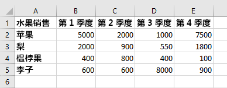
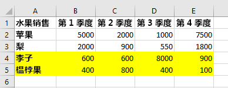
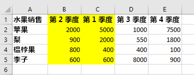

# <a name="work-with-worksheets-using-the-excel-javascript-api"></a><span data-ttu-id="fa22c-102">使用 Excel JavaScript API 处理工作表</span><span class="sxs-lookup"><span data-stu-id="fa22c-102">Work with worksheets using the Excel JavaScript API</span></span>

<span data-ttu-id="fa22c-p101">本文提供了代码示例，介绍如何使用 Excel JavaScript API 对工作表执行常见任务。 有关 `Worksheet` 和 `WorksheetCollection` 对象支持的属性和方法的完整列表，请参阅 [Worksheet 对象 (Excel JavaScript API)](/javascript/api/excel/excel.worksheet) 和 [WorksheetCollection 对象 (Excel JavaScript API)](/javascript/api/excel/excel.worksheetcollection)。</span><span class="sxs-lookup"><span data-stu-id="fa22c-p101">This article provides code samples that show how to perform common tasks with worksheets using the Excel JavaScript API. For the complete list of properties and methods that the `Worksheet` and `WorksheetCollection` objects support, see [Worksheet Object (JavaScript API for Excel)](/javascript/api/excel/excel.worksheet) and [WorksheetCollection Object (JavaScript API for Excel)](/javascript/api/excel/excel.worksheetcollection).</span></span>

> [!NOTE]
> <span data-ttu-id="fa22c-105">本文中的信息仅适用于常规工作表；不适用于“图表”或“宏”表。</span><span class="sxs-lookup"><span data-stu-id="fa22c-105">The information in this article applies only to regular worksheets; it does not apply to "chart" sheets or "macro" sheets.</span></span>

## <a name="get-worksheets"></a><span data-ttu-id="fa22c-106">获取工作表</span><span class="sxs-lookup"><span data-stu-id="fa22c-106">Get worksheets</span></span>

<span data-ttu-id="fa22c-107">下面的代码示例获取工作表集合，加载每个工作表的 `name` 属性，并向控制台写入一条消息。</span><span class="sxs-lookup"><span data-stu-id="fa22c-107">The following code sample gets the collection of worksheets, loads the `name` property of each worksheet, and writes a message to the console.</span></span>

```js
Excel.run(function (context) {
    var sheets = context.workbook.worksheets;
    sheets.load("items/name");

    return context.sync()
        .then(function () {
            if (sheets.items.length > 1) {
                console.log(`There are ${sheets.items.length} worksheets in the workbook:`);
            } else {
                console.log(`There is one worksheet in the workbook:`);
            }
            for (var i in sheets.items) {
                console.log(sheets.items[i].name);
            }
        });
}).catch(errorHandlerFunction);
```

> [!NOTE]
> <span data-ttu-id="fa22c-p102">工作表的 `id` 属性用于唯一标识指定工作簿中的工作表，即使工作表被重命名或移动，此属性的值也仍保持不变。如果工作表从 Mac 版 Excel 的工作簿中删除，已删除工作表的 `id` 可能会重新分配给后续创建的新工作表。</span><span class="sxs-lookup"><span data-stu-id="fa22c-p102">The `id` property of a worksheet uniquely identifies the worksheet in a given workbook and its value will remain the same even when the worksheet is renamed or moved. When a worksheet is deleted from a workbook in Excel on Mac, the `id` of the deleted worksheet may be reassigned to a new worksheet that is subsequently created.</span></span>

## <a name="get-the-active-worksheet"></a><span data-ttu-id="fa22c-110">获取活动工作表</span><span class="sxs-lookup"><span data-stu-id="fa22c-110">Get the active worksheet</span></span>

<span data-ttu-id="fa22c-111">下面的代码示例获取活动工作表，加载其 `name` 属性，并向控制台写入一条消息。</span><span class="sxs-lookup"><span data-stu-id="fa22c-111">The following code sample gets the active worksheet, loads its `name` property, and writes a message to the console.</span></span>

```js
Excel.run(function (context) {
    var sheet = context.workbook.worksheets.getActiveWorksheet();
    sheet.load("name");

    return context.sync()
        .then(function () {
            console.log(`The active worksheet is "${sheet.name}"`);
        });
}).catch(errorHandlerFunction);
```

## <a name="set-the-active-worksheet"></a><span data-ttu-id="fa22c-112">设置活动工作表</span><span class="sxs-lookup"><span data-stu-id="fa22c-112">Set the active worksheet</span></span>

<span data-ttu-id="fa22c-p103">下面的代码示例将活动工作表设置为名为 **Sample** 的工作表，加载其 `name` 属性，并向控制台写入一条消息。 如果没有使用该名称的工作表，`activate()` 方法将引发 `ItemNotFound` 错误。</span><span class="sxs-lookup"><span data-stu-id="fa22c-p103">The following code sample sets the active worksheet to the worksheet named **Sample**, loads its `name` property, and writes a message to the console. If there is no worksheet with that name, the `activate()` method throws an `ItemNotFound` error.</span></span>

```js
Excel.run(function (context) {
    var sheet = context.workbook.worksheets.getItem("Sample");
    sheet.activate();
    sheet.load("name");

    return context.sync()
        .then(function () {
            console.log(`The active worksheet is "${sheet.name}"`);
        });
}).catch(errorHandlerFunction);
```

## <a name="reference-worksheets-by-relative-position"></a><span data-ttu-id="fa22c-115">通过相对位置引用工作表</span><span class="sxs-lookup"><span data-stu-id="fa22c-115">Reference worksheets by relative position</span></span>

<span data-ttu-id="fa22c-116">这些示例演示如何通过相对位置来引用工作表。</span><span class="sxs-lookup"><span data-stu-id="fa22c-116">These examples show how to reference a worksheet by its relative position.</span></span>

### <a name="get-the-first-worksheet"></a><span data-ttu-id="fa22c-117">获取第一个工作表</span><span class="sxs-lookup"><span data-stu-id="fa22c-117">Get the first worksheet</span></span>

<span data-ttu-id="fa22c-118">下面的代码示例获取工作簿中的第一个工作表，加载其 `name` 属性，并向控制台中写入一条消息。</span><span class="sxs-lookup"><span data-stu-id="fa22c-118">The following code sample gets the first worksheet in the workbook, loads its `name` property, and writes a message to the console.</span></span>

```js
Excel.run(function (context) {
    var firstSheet = context.workbook.worksheets.getFirst();
    firstSheet.load("name");

    return context.sync()
        .then(function () {
            console.log(`The name of the first worksheet is "${firstSheet.name}"`);
        });
}).catch(errorHandlerFunction);
```

### <a name="get-the-last-worksheet"></a><span data-ttu-id="fa22c-119">获取最后一个工作表</span><span class="sxs-lookup"><span data-stu-id="fa22c-119">Get the last worksheet</span></span>

<span data-ttu-id="fa22c-120">下面的代码示例获取工作簿中的最后一个工作表，加载其 `name` 属性，并向控制台写入一条消息。</span><span class="sxs-lookup"><span data-stu-id="fa22c-120">The following code sample gets the last worksheet in the workbook, loads its `name` property, and writes a message to the console.</span></span>

```js
Excel.run(function (context) {
    var lastSheet = context.workbook.worksheets.getLast();
    lastSheet.load("name");

    return context.sync()
        .then(function () {
            console.log(`The name of the last worksheet is "${lastSheet.name}"`);
        });
}).catch(errorHandlerFunction);
```

### <a name="get-the-next-worksheet"></a><span data-ttu-id="fa22c-121">获取下一个工作表</span><span class="sxs-lookup"><span data-stu-id="fa22c-121">Get the next worksheet</span></span>

<span data-ttu-id="fa22c-p104">下面的代码示例获取工作簿中活动工作表后面的工作表，加载其 `name` 属性，并向控制台写入一条消息。 如果活动工作表后没有工作表，`getNext()` 方法将引发 `ItemNotFound` 错误。</span><span class="sxs-lookup"><span data-stu-id="fa22c-p104">The following code sample gets the worksheet that follows the active worksheet in the workbook, loads its `name` property, and writes a message to the console. If there is no worksheet after the active worksheet, the `getNext()` method throws an `ItemNotFound` error.</span></span>

```js
 Excel.run(function (context) {
    var currentSheet = context.workbook.worksheets.getActiveWorksheet();
    var nextSheet = currentSheet.getNext();
    nextSheet.load("name");

    return context.sync()
        .then(function () {
            console.log(`The name of the sheet that follows the active worksheet is "${nextSheet.name}"`);
        });
}).catch(errorHandlerFunction);
```

### <a name="get-the-previous-worksheet"></a><span data-ttu-id="fa22c-124">获取上一个工作表</span><span class="sxs-lookup"><span data-stu-id="fa22c-124">Get the previous worksheet</span></span>

<span data-ttu-id="fa22c-p105">下面的代码示例获取工作簿中活动工作表前面的工作表，加载其 `name` 属性，并向控制台写入一条消息。 如果活动工作表前没有工作表，`getPrevious()` 方法将引发 `ItemNotFound` 错误。</span><span class="sxs-lookup"><span data-stu-id="fa22c-p105">The following code sample gets the worksheet that precedes the active worksheet in the workbook, loads its `name` property, and writes a message to the console. If there is no worksheet before the active worksheet, the `getPrevious()` method throws an `ItemNotFound` error.</span></span>

```js
Excel.run(function (context) {
    var currentSheet = context.workbook.worksheets.getActiveWorksheet();
    var previousSheet = currentSheet.getPrevious();
    previousSheet.load("name");

    return context.sync()
        .then(function () {
            console.log(`The name of the sheet that precedes the active worksheet is "${previousSheet.name}"`);
        });
}).catch(errorHandlerFunction);
```

## <a name="add-a-worksheet"></a><span data-ttu-id="fa22c-127">添加工作表</span><span class="sxs-lookup"><span data-stu-id="fa22c-127">Add a worksheet</span></span>

<span data-ttu-id="fa22c-p106">下面的代码示例向工作簿添加新工作表 **Sample**，加载它的 `name` 和 `position` 属性，并向控制台写入消息。新工作表添加在现有全部工作表的后面。</span><span class="sxs-lookup"><span data-stu-id="fa22c-p106">The following code sample adds a new worksheet named **Sample** to the workbook, loads its `name` and `position` properties, and writes a message to the console. The new worksheet is added after all existing worksheets.</span></span>

```js
Excel.run(function (context) {
    var sheets = context.workbook.worksheets;

    var sheet = sheets.add("Sample");
    sheet.load("name, position");

    return context.sync()
        .then(function () {
            console.log(`Added worksheet named "${sheet.name}" in position ${sheet.position}`);
        });
}).catch(errorHandlerFunction);
```

### <a name="copy-an-existing-worksheet"></a><span data-ttu-id="fa22c-130">复制现有工作表</span><span class="sxs-lookup"><span data-stu-id="fa22c-130">Copy an existing worksheet</span></span>

<span data-ttu-id="fa22c-131">`Worksheet.copy` 通过复制现有工作表添加新工作表。</span><span class="sxs-lookup"><span data-stu-id="fa22c-131">`Worksheet.copy` adds a new worksheet that is a copy of an existing worksheet.</span></span> <span data-ttu-id="fa22c-132">新工作表的名称将在末尾附加一个数字，格式与通过 Excel UI 复制工作表一致（例如 **MySheet (2)**）。</span><span class="sxs-lookup"><span data-stu-id="fa22c-132">The new worksheet's name will have a number appended to the end, in a manner consistent with copying a worksheet through the Excel UI (for example, **MySheet (2)**).</span></span> <span data-ttu-id="fa22c-133">`Worksheet.copy` 可采用两个参数，且两者都是可选参数：</span><span class="sxs-lookup"><span data-stu-id="fa22c-133">`Worksheet.copy` can take two parameters, both of which are optional:</span></span>

- <span data-ttu-id="fa22c-134">`positionType` - 一个 [WorksheetPositionType](/javascript/api/excel/excel.worksheetpositiontype) 枚举，指定在工作簿中添加新工作表的位置。</span><span class="sxs-lookup"><span data-stu-id="fa22c-134">`positionType` - A [WorksheetPositionType](/javascript/api/excel/excel.worksheetpositiontype) enum specifying where in the workbook the new worksheet is to be added.</span></span>
- <span data-ttu-id="fa22c-135">`relativeTo` - 如果 `positionType` 为 `Before` 或 `After`，则需要指定一个参考工作表，新工作表将相对于此工作表进行添加（此参数回答的问题是“在什么之前或之后？”）。</span><span class="sxs-lookup"><span data-stu-id="fa22c-135">`relativeTo` - If the `positionType` is `Before` or `After`, you need to specify a worksheet relative to which the new sheet is to be added (this parameter answers the question "Before or after what?").</span></span>

<span data-ttu-id="fa22c-136">下面的代码示例复制当前工作表，并将新工作表直接插入到当前工作表之后。</span><span class="sxs-lookup"><span data-stu-id="fa22c-136">The following code sample copies the current worksheet and inserts the new sheet directly after the current worksheet.</span></span>

```js
Excel.run(function (context) {
    var myWorkbook = context.workbook;
    var sampleSheet = myWorkbook.worksheets.getActiveWorksheet();
    var copiedSheet = sampleSheet.copy(Excel.WorksheetPositionType.after, sampleSheet);
    return context.sync();
});
```

## <a name="delete-a-worksheet"></a><span data-ttu-id="fa22c-137">删除工作表</span><span class="sxs-lookup"><span data-stu-id="fa22c-137">Delete a worksheet</span></span>

<span data-ttu-id="fa22c-138">下面的代码示例删除工作簿中的最后一个工作表（前提是它不是工作簿中的唯一工作表），并向控制台写入一条消息。</span><span class="sxs-lookup"><span data-stu-id="fa22c-138">The following code sample deletes the final worksheet in the workbook (as long as it's not the only sheet in the workbook) and writes a message to the console.</span></span>

```js
Excel.run(function (context) {
    var sheets = context.workbook.worksheets;
    sheets.load("items/name");

    return context.sync()
        .then(function () {
            if (sheets.items.length === 1) {
                console.log("Unable to delete the only worksheet in the workbook");
            } else {
                var lastSheet = sheets.items[sheets.items.length - 1];

                console.log(`Deleting worksheet named "${lastSheet.name}"`);
                lastSheet.delete();

                return context.sync();
            };
        });
}).catch(errorHandlerFunction);
```

> [!NOTE]
> <span data-ttu-id="fa22c-139">不能使用 `delete` 方法删除可见性为 [VeryHidden](/javascript/api/excel/excel.sheetvisibility) 的工作表。</span><span class="sxs-lookup"><span data-stu-id="fa22c-139">A worksheet with a visibility of "[Very Hidden](/javascript/api/excel/excel.sheetvisibility)" cannot be deleted with the `delete` method.</span></span> <span data-ttu-id="fa22c-140">如果仍希望删除工作表，必须先更改可见性。</span><span class="sxs-lookup"><span data-stu-id="fa22c-140">If you wish to delete the worksheet anyway, you must first change the visibility.</span></span>

## <a name="rename-a-worksheet"></a><span data-ttu-id="fa22c-141">重命名工作表</span><span class="sxs-lookup"><span data-stu-id="fa22c-141">Rename a worksheet</span></span>

<span data-ttu-id="fa22c-142">下面的代码示例将活动工作表的名称更改为**新名称**。</span><span class="sxs-lookup"><span data-stu-id="fa22c-142">The following code sample changes the name of the active worksheet to **New Name**.</span></span>

```js
Excel.run(function (context) {
    var currentSheet = context.workbook.worksheets.getActiveWorksheet();
    currentSheet.name = "New Name";

    return context.sync();
}).catch(errorHandlerFunction);
```

## <a name="move-a-worksheet"></a><span data-ttu-id="fa22c-143">移动工作表</span><span class="sxs-lookup"><span data-stu-id="fa22c-143">Move a worksheet</span></span>

<span data-ttu-id="fa22c-144">下面的代码示例将工作表从工作簿中的最后一个位置移动到工作簿中的第一个位置。</span><span class="sxs-lookup"><span data-stu-id="fa22c-144">The following code sample moves a worksheet from the last position in the workbook to the first position in the workbook.</span></span>

```js
Excel.run(function (context) {
    var sheets = context.workbook.worksheets;
    sheets.load("items");

    return context.sync()
        .then(function () {
            var lastSheet = sheets.items[sheets.items.length - 1];
            lastSheet.position = 0;

            return context.sync();
        });
}).catch(errorHandlerFunction);
```

## <a name="set-worksheet-visibility"></a><span data-ttu-id="fa22c-145">设置工作表可见性</span><span class="sxs-lookup"><span data-stu-id="fa22c-145">Set worksheet visibility</span></span>

<span data-ttu-id="fa22c-146">以下示例显示如何设置工作表的可见性。</span><span class="sxs-lookup"><span data-stu-id="fa22c-146">These examples show how to set the visibility of a worksheet.</span></span>

### <a name="hide-a-worksheet"></a><span data-ttu-id="fa22c-147">隐藏工作表</span><span class="sxs-lookup"><span data-stu-id="fa22c-147">Hide a worksheet</span></span>

<span data-ttu-id="fa22c-148">下面的代码示例将名为 **Sample** 的工作表的可见性设置为隐藏，加载其 `name` 属性，并向控制台写入一条消息。</span><span class="sxs-lookup"><span data-stu-id="fa22c-148">The following code sample sets the visibility of worksheet named **Sample** to hidden, loads its `name` property, and writes a message to the console.</span></span>

```js
Excel.run(function (context) {
    var sheet = context.workbook.worksheets.getItem("Sample");
    sheet.visibility = Excel.SheetVisibility.hidden;
    sheet.load("name");

    return context.sync()
        .then(function () {
            console.log(`Worksheet with name "${sheet.name}" is hidden`);
        });
}).catch(errorHandlerFunction);
```

### <a name="unhide-a-worksheet"></a><span data-ttu-id="fa22c-149">取消隐藏工作表</span><span class="sxs-lookup"><span data-stu-id="fa22c-149">Unhide a worksheet</span></span>

<span data-ttu-id="fa22c-150">下面的代码示例将名为 **Sample** 的工作表的可见性设置为可见，加载其 `name` 属性，并向控制台写入一条消息。</span><span class="sxs-lookup"><span data-stu-id="fa22c-150">The following code sample sets the visibility of worksheet named **Sample** to visible, loads its `name` property, and writes a message to the console.</span></span>

```js
Excel.run(function (context) {
    var sheet = context.workbook.worksheets.getItem("Sample");
    sheet.visibility = Excel.SheetVisibility.visible;
    sheet.load("name");

    return context.sync()
        .then(function () {
            console.log(`Worksheet with name "${sheet.name}" is visible`);
        });
}).catch(errorHandlerFunction);
```

## <a name="get-a-single-cell-within-a-worksheet"></a><span data-ttu-id="fa22c-151">获取工作表中的单个单元格</span><span class="sxs-lookup"><span data-stu-id="fa22c-151">Get a single cell within a worksheet</span></span>

<span data-ttu-id="fa22c-152">下面的代码示例从名为 **Sample** 的工作表获取位于第 2 行第 5 列的单元格，加载其 `address` 和 `values` 属性，并向控制台写入一条消息。</span><span class="sxs-lookup"><span data-stu-id="fa22c-152">The following code sample gets the cell that is located in row 2, column 5 of the worksheet named **Sample**, loads its `address` and `values` properties, and writes a message to the console.</span></span> <span data-ttu-id="fa22c-153">传递给 `getCell(row: number, column:number)` 方法的值是要检索的单元格的零索引行号和列号。</span><span class="sxs-lookup"><span data-stu-id="fa22c-153">The values that are passed into the `getCell(row: number, column:number)` method are the zero-indexed row number and column number for the cell that is being retrieved.</span></span>

```js
Excel.run(function (context) {
    var sheet = context.workbook.worksheets.getItem("Sample");
    var cell = sheet.getCell(1, 4);
    cell.load("address, values");

    return context.sync()
        .then(function() {
            console.log(`The value of the cell in row 2, column 5 is "${cell.values[0][0]}" and the address of that cell is "${cell.address}"`);
        })
}).catch(errorHandlerFunction);
```

## <a name="detect-data-changes"></a><span data-ttu-id="fa22c-154">检测数据更改</span><span class="sxs-lookup"><span data-stu-id="fa22c-154">Detect data changes</span></span>

<span data-ttu-id="fa22c-155">加载项可能需要回应对工作表中的数据进行更改的用户。</span><span class="sxs-lookup"><span data-stu-id="fa22c-155">Your add-in may need to react to users changing the data in a worksheet.</span></span> <span data-ttu-id="fa22c-156">若要检测这些更改，可以为工作表的 `onChanged` 事件[注册事件处理程序](excel-add-ins-events.md#register-an-event-handler)。</span><span class="sxs-lookup"><span data-stu-id="fa22c-156">To detect these changes, you can [register an event handler](excel-add-ins-events.md#register-an-event-handler) for the `onChanged` event of a worksheet.</span></span> <span data-ttu-id="fa22c-157">当事件触发时，`onChanged` 事件的事件处理程序将收到 [WorksheetChangedEventArgs](/javascript/api/excel/excel.worksheetchangedeventargs) 对象。</span><span class="sxs-lookup"><span data-stu-id="fa22c-157">Event handlers for the `onChanged` event receive a [WorksheetChangedEventArgs](/javascript/api/excel/excel.worksheetchangedeventargs) object when the event fires.</span></span>

<span data-ttu-id="fa22c-158">`WorksheetChangedEventArgs` 对象提供有关更改和来源的信息。</span><span class="sxs-lookup"><span data-stu-id="fa22c-158">The `WorksheetChangedEventArgs` object provides information about the changes and the source.</span></span> <span data-ttu-id="fa22c-159">由于 `onChanged` 会在数据的格式或值发生变化时触发，因此让加载项检查值是否已实际更改可能很有用。</span><span class="sxs-lookup"><span data-stu-id="fa22c-159">Since `onChanged` fires when either the format or value of the data changes, it can be useful to have your add-in check if the values have actually changed.</span></span> <span data-ttu-id="fa22c-160">`details` 属性以 [ChangedEventDetail](/javascript/api/excel/excel.changedeventdetail) 的形式封装此信息。</span><span class="sxs-lookup"><span data-stu-id="fa22c-160">The `details` property encapsulates this information as a [ChangedEventDetail](/javascript/api/excel/excel.changedeventdetail).</span></span> <span data-ttu-id="fa22c-161">以下代码示例演示如何显示已更改的单元格的之前和之后的值及类型。</span><span class="sxs-lookup"><span data-stu-id="fa22c-161">The following code sample shows how to display the before and after values and types of a cell that has been changed.</span></span>

```js
// This function would be used as an event handler for the Worksheet.onChanged event.
function onWorksheetChanged(eventArgs) {
    Excel.run(function (context) {
        var details = eventArgs.details;
        var address = eventArgs.address;

        // Print the before and after types and values to the console.
        console.log(`Change at ${address}: was ${details.valueBefore}(${details.valueTypeBefore}),`
            + ` now is ${details.valueAfter}(${details.valueTypeAfter})`);
        return context.sync();
    });
}
```

## <a name="handle-sorting-events"></a><span data-ttu-id="fa22c-162">处理排序事件</span><span class="sxs-lookup"><span data-stu-id="fa22c-162">Handle sorting events (preview)</span></span>

<span data-ttu-id="fa22c-163">`onColumnSorted` 和 `onRowSorted` 事件表示工作表数据已排序。</span><span class="sxs-lookup"><span data-stu-id="fa22c-163">The `onColumnSorted` and `onRowSorted` events indicate when any worksheet data is sorted.</span></span> <span data-ttu-id="fa22c-164">这些事件连接到各 `Worksheet` 对象和工作簿的 `WorkbookCollection`</span><span class="sxs-lookup"><span data-stu-id="fa22c-164">These events are connected to individual `Worksheet` objects and to the workbook's `WorkbookCollection`.</span></span> <span data-ttu-id="fa22c-165">无论是通过编程排序还是通过 Excel 用户界面手动执行排序，它们都会触发。</span><span class="sxs-lookup"><span data-stu-id="fa22c-165">They fire whether the sorting is done programmatically or manually through the Excel user interface.</span></span>

> [!NOTE]
> <span data-ttu-id="fa22c-166">通过从左到右排序操作对列排序时，触发 `onColumnSorted`</span><span class="sxs-lookup"><span data-stu-id="fa22c-166">`onColumnSorted` fires when columns are sorted as the result of a left-to-right sort operation.</span></span> <span data-ttu-id="fa22c-167">通过从上到下排序操作对行排序时，触发 `onRowSorted`</span><span class="sxs-lookup"><span data-stu-id="fa22c-167">`onRowSorted` fires when rows are sorted as the result of a top-to-bottom sort operation.</span></span> <span data-ttu-id="fa22c-168">使用列标题上的下拉菜单对表格进行排序时，将触发 `onRowSorted` 事件。</span><span class="sxs-lookup"><span data-stu-id="fa22c-168">Sorting a table using the drop-down menu on a column header results in an `onRowSorted` event.</span></span> <span data-ttu-id="fa22c-169">该事件对应于正在移动的内容，而不是排序条件。</span><span class="sxs-lookup"><span data-stu-id="fa22c-169">The event corresponds with what is moving, not what is being considered as the sorting criteria.</span></span>

<span data-ttu-id="fa22c-170">`onColumnSorted` 和 `onRowSorted` 事件为它们的回叫分别提供 [WorksheetColumnSortedEventArgs](/javascript/api/excel/excel.worksheetcolumnsortedeventargs) 或 [WorksheetRowSortedEventArgs](/javascript/api/excel/excel.worksheetrowsortedeventargs)</span><span class="sxs-lookup"><span data-stu-id="fa22c-170">The `onColumnSorted` and `onRowSorted` events provide their callbacks with [WorksheetColumnSortedEventArgs](/javascript/api/excel/excel.worksheetcolumnsortedeventargs) or [WorksheetRowSortedEventArgs](/javascript/api/excel/excel.worksheetrowsortedeventargs), respectively.</span></span> <span data-ttu-id="fa22c-171">它们提供有关事件的更多详细信息。</span><span class="sxs-lookup"><span data-stu-id="fa22c-171">These give more details about the event.</span></span> <span data-ttu-id="fa22c-172">特别的一点是，两个 `EventArgs` 都有 `address` 属性，表示排序操作移动的行或列。</span><span class="sxs-lookup"><span data-stu-id="fa22c-172">In particular, both `EventArgs` have an `address` property that represents the rows or columns moved as a result of the sort operation.</span></span> <span data-ttu-id="fa22c-173">已添加包含排序内容的所有单元格，即使单元格的值未包含在排序条件中，也是如此。</span><span class="sxs-lookup"><span data-stu-id="fa22c-173">Any cell with sorted content is included, even if that cell's value was not part of the sorting criteria.</span></span>

<span data-ttu-id="fa22c-174">下图显示了排序事件的 `address` 属性返回的范围。</span><span class="sxs-lookup"><span data-stu-id="fa22c-174">The following images show the ranges returned by the `address` property for sort events.</span></span> <span data-ttu-id="fa22c-175">首先是排序前的示例数据：</span><span class="sxs-lookup"><span data-stu-id="fa22c-175">First, here is the sample data before sorting:</span></span>



<span data-ttu-id="fa22c-177">如果对“**Q1**”（“**B**”中的值）执行从上到下排序，则 `WorksheetRowSortedEventArgs.address` 返回以下突出显示的行：</span><span class="sxs-lookup"><span data-stu-id="fa22c-177">If a top-to-bottom sort is performed on "**Q1**" (the values in "**B**"), the following highlighted rows are returned by `WorksheetRowSortedEventArgs.address`:</span></span>



<span data-ttu-id="fa22c-180">如果对原始数据中“**柑橘**”（“**4**”中的值）执行从左到右排序，则 `WorksheetColumnsSortedEventArgs.address` 返回以下突出显示的列：</span><span class="sxs-lookup"><span data-stu-id="fa22c-180">If a left-to-right sort is performed on "**Quinces**" (the values in "**4**") on the original data, the following highlighted columns are returned by `WorksheetColumnsSortedEventArgs.address`:</span></span>



<span data-ttu-id="fa22c-183">下面的代码示例演示如何为 `Worksheet.onRowSorted` 事件注册事件处理程序。</span><span class="sxs-lookup"><span data-stu-id="fa22c-183">The following code sample shows how to register an event handler for the `Worksheet.onRowSorted` event.</span></span> <span data-ttu-id="fa22c-184">处理程序的回叫会清除该范围的填充颜色，然后填充已移动行的单元格。</span><span class="sxs-lookup"><span data-stu-id="fa22c-184">The handler's callback clears the fill color for the range, then fills the cells of the moved rows.</span></span>

```js
Excel.run(function (context) {
    var sheet = context.workbook.worksheets.getActiveWorksheet();

    // This will fire whenever a row has been moved as the result of a sort action.
    sheet.onRowSorted.add(function (event) {
        return Excel.run(function (context) {
            console.log("Row sorted: " + event.address);
            var sheet = context.workbook.worksheets.getActiveWorksheet();

            // Clear formatting for section, then highlight the sorted area.
            sheet.getRange("A1:E5").format.fill.clear();
            if (event.address !== "") {
                sheet.getRanges(event.address).format.fill.color = "yellow";
            }

            return context.sync();
        });
    });

    return context.sync();
}).catch(errorHandlerFunction);
```

## <a name="find-all-cells-with-matching-text"></a><span data-ttu-id="fa22c-185">查找所有包含匹配文本的单元格</span><span class="sxs-lookup"><span data-stu-id="fa22c-185">Find all cells with matching text</span></span>

<span data-ttu-id="fa22c-186">`Worksheet` 对象具有 `find` 方法在工作表内搜索指定字符串。</span><span class="sxs-lookup"><span data-stu-id="fa22c-186">The `Worksheet` object has a `find` method to search for a specified string within the worksheet.</span></span> <span data-ttu-id="fa22c-187">返回 `RangeAreas` 对象，也就是可以进行一次性全部编辑的 `Range` 对象集。</span><span class="sxs-lookup"><span data-stu-id="fa22c-187">It returns a `RangeAreas` object, which is a collection of `Range` objects that can be edited all at once.</span></span> <span data-ttu-id="fa22c-188">以下代码示例查找值等于字符串 **完成** 的所有单元格，并标记为绿色。</span><span class="sxs-lookup"><span data-stu-id="fa22c-188">The following code sample finds all cells with values equal to the string **Complete** and colors them green.</span></span> <span data-ttu-id="fa22c-189">请注意，若指定的字符串不存在于工作表中，`findAll` 将引发 `ItemNotFound` 错误。</span><span class="sxs-lookup"><span data-stu-id="fa22c-189">Note that `findAll` will throw an `ItemNotFound` error if the specified string doesn't exist in the worksheet.</span></span> <span data-ttu-id="fa22c-190">若您预计到指定的字符串可能不存在工作表中，则可使用 [findAllOrNullObject](excel-add-ins-advanced-concepts.md#ornullobject-methods) 方法，以便您的代码可正常处理该情况。</span><span class="sxs-lookup"><span data-stu-id="fa22c-190">If you expect that the specified string may not exist in the worksheet, use the [findAllOrNullObject](excel-add-ins-advanced-concepts.md#ornullobject-methods) method instead, so your code gracefully handles that scenario.</span></span>

```js
Excel.run(function (context) {
    var sheet = context.workbook.worksheets.getItem("Sample");
    var foundRanges = sheet.findAll("Complete", {
        completeMatch: true, // findAll will match the whole cell value
        matchCase: false // findAll will not match case
    });

    return context.sync()
        .then(function() {
            foundRanges.format.fill.color = "green"
    });
}).catch(errorHandlerFunction);
```

> [!NOTE]
> <span data-ttu-id="fa22c-191">本节介绍如何使用 `Worksheet` 对象函数查找单元格与区域。</span><span class="sxs-lookup"><span data-stu-id="fa22c-191">This section describes how to find cells and ranges using the `Worksheet` object's functions.</span></span> <span data-ttu-id="fa22c-192">更多区域检索信息可在特定对象文章中找到。</span><span class="sxs-lookup"><span data-stu-id="fa22c-192">More range retrieval information can be found in object-specific articles.</span></span>
> - <span data-ttu-id="fa22c-193">有关展示如何使用 `Range` 对象获取工作表中区域的示例，请参阅 [使用 Excel JavaScript API 处理区域](excel-add-ins-ranges.md)。</span><span class="sxs-lookup"><span data-stu-id="fa22c-193">For examples that show how to get a range within a worksheet using the `Range` object, see [Work with ranges using the Excel JavaScript API](excel-add-ins-ranges.md).</span></span>
> - <span data-ttu-id="fa22c-194">有关展示如何从 `Table` 对象获取区域的示例，请参阅 [使用 Excel JavaScript API 处理表](excel-add-ins-tables.md)。</span><span class="sxs-lookup"><span data-stu-id="fa22c-194">For examples that show how to get ranges from a `Table` object, see [Work with tables using the Excel JavaScript API](excel-add-ins-tables.md).</span></span>
> - <span data-ttu-id="fa22c-195">有关显示如何基于单元格特性进行多个子区域的较大区域搜索示例，请参阅 [使用 Excel 加载项同时处理多个区域](excel-add-ins-multiple-ranges.md)。</span><span class="sxs-lookup"><span data-stu-id="fa22c-195">For examples that show how to search a large range for multiple sub-ranges based on cell characteristics, see [Work with multiple ranges simultaneously in Excel add-ins](excel-add-ins-multiple-ranges.md).</span></span>

## <a name="filter-data"></a><span data-ttu-id="fa22c-196">筛选数据</span><span class="sxs-lookup"><span data-stu-id="fa22c-196">Filter data</span></span>

<span data-ttu-id="fa22c-197">[自动筛选](/javascript/api/excel/excel.autofilter)在工作表的一个范围内应用数据筛选器。</span><span class="sxs-lookup"><span data-stu-id="fa22c-197">An [AutoFilter](/javascript/api/excel/excel.autofilter) applies data filters across a range within the worksheet.</span></span> <span data-ttu-id="fa22c-198">这是通过 `Worksheet.autoFilter.apply` 创建的，它具有以下属性：</span><span class="sxs-lookup"><span data-stu-id="fa22c-198">This is created with `Worksheet.autoFilter.apply`, which has the following parameters:</span></span>

- <span data-ttu-id="fa22c-199">`range`：应用筛选器的范围，指定为 `Range` 对象或字符串。</span><span class="sxs-lookup"><span data-stu-id="fa22c-199">`range`: The range to which the filter is applied, specified as either a `Range` object or a string.</span></span>
- <span data-ttu-id="fa22c-200">`columnIndex`：从零开始的列索引，根据该索引评估筛选条件。</span><span class="sxs-lookup"><span data-stu-id="fa22c-200">`columnIndex`: The zero-based column index against which the filter criteria is evaluated.</span></span>
- <span data-ttu-id="fa22c-201">`criteria`：[FilterCriteria](/javascript/api/excel/excel.filtercriteria) 对象，该对象确定应基于列的单元格筛选哪些行。</span><span class="sxs-lookup"><span data-stu-id="fa22c-201">`criteria`: A [FilterCriteria](/javascript/api/excel/excel.filtercriteria) object determining which rows should be filtered based on the column's cell.</span></span>

<span data-ttu-id="fa22c-202">第一个代码示例显示如何将筛选器添加到工作表的已使用区域。</span><span class="sxs-lookup"><span data-stu-id="fa22c-202">The first code sample shows how to add a filter to the worksheet's used range.</span></span> <span data-ttu-id="fa22c-203">此筛选器将基于列 **3** 中的值，隐藏不在前 25% 内的条目。</span><span class="sxs-lookup"><span data-stu-id="fa22c-203">This filter will hide entries that are not in the top 25%, based on the values in column **3**.</span></span>

```js
Excel.run(function (context) {
    var sheet = context.workbook.worksheets.getActiveWorksheet();
    var farmData = sheet.getUsedRange();

    // This filter will only show the rows with the top 25% of values in column 3.
    sheet.autoFilter.apply(farmData, 3, { criterion1: "25", filterOn: Excel.FilterOn.topPercent });
    return context.sync();
}).catch(errorHandlerFunction);
```

<span data-ttu-id="fa22c-204">下一个代码示例显示如何使用 `reapply` 方法刷新 auto-filter。</span><span class="sxs-lookup"><span data-stu-id="fa22c-204">The next code sample shows how to refresh the auto-filter using the `reapply` method.</span></span> <span data-ttu-id="fa22c-205">当范围中的数据更改时，应执行此操作。</span><span class="sxs-lookup"><span data-stu-id="fa22c-205">This should be done when the data in the range changes.</span></span>

```js
Excel.run(function (context) {
    var sheet = context.workbook.worksheets.getActiveWorksheet();
    sheet.autoFilter.reapply();
    return context.sync();
}).catch(errorHandlerFunction);
```

<span data-ttu-id="fa22c-206">最终的自动筛选代码示例显示如何使用 `remove` 方法将 auto-filter 从工作表移除。</span><span class="sxs-lookup"><span data-stu-id="fa22c-206">The final auto-filter code sample shows how to remove the auto-filter from the worksheet with the `remove` method.</span></span>

```js
Excel.run(function (context) {
    var sheet = context.workbook.worksheets.getActiveWorksheet();
    sheet.autoFilter.remove();
    return context.sync();
}).catch(errorHandlerFunction);
```

<span data-ttu-id="fa22c-207">`AutoFilter` 也可应用到单个表。</span><span class="sxs-lookup"><span data-stu-id="fa22c-207">An `AutoFilter` can also be applied to individual tables.</span></span> <span data-ttu-id="fa22c-208">有关详细信息，请参阅[使用 Excel JavaScript API 处理表](excel-add-ins-tables.md#autofilter)。</span><span class="sxs-lookup"><span data-stu-id="fa22c-208">See [Work with tables using the Excel JavaScript API](excel-add-ins-tables.md#autofilter) for more information.</span></span>

## <a name="data-protection"></a><span data-ttu-id="fa22c-209">数据保护</span><span class="sxs-lookup"><span data-stu-id="fa22c-209">Data protection</span></span>

<span data-ttu-id="fa22c-210">加载项可以控制用户能否编辑工作表中的数据。</span><span class="sxs-lookup"><span data-stu-id="fa22c-210">Your add-in can control a user's ability to edit data in a worksheet.</span></span> <span data-ttu-id="fa22c-211">工作表的 `protection` 属性是包含 `protect()` 方法的 [WorksheetProtection](/javascript/api/excel/excel.worksheetprotection) 对象。</span><span class="sxs-lookup"><span data-stu-id="fa22c-211">The worksheet's `protection` property is a [WorksheetProtection](/javascript/api/excel/excel.worksheetprotection) object with a `protect()` method.</span></span> <span data-ttu-id="fa22c-212">下面的示例展示了关于切换活动工作表的完整保护的基本方案。</span><span class="sxs-lookup"><span data-stu-id="fa22c-212">The following example shows a basic scenario toggling the complete protection of the active worksheet.</span></span>

```js
Excel.run(function (context) {
    var activeSheet = context.workbook.worksheets.getActiveWorksheet();
    activeSheet.load("protection/protected");

    return context.sync().then(function() {
        if (!activeSheet.protection.protected) {
            activeSheet.protection.protect();
        }
    })
}).catch(errorHandlerFunction);
```

<span data-ttu-id="fa22c-213">`protect` 方法包含两个可选参数：</span><span class="sxs-lookup"><span data-stu-id="fa22c-213">The `protect` method has two optional parameters:</span></span>

- <span data-ttu-id="fa22c-214">`options`：定义具体编辑限制的 [WorksheetProtectionOptions](/javascript/api/excel/excel.worksheetprotectionoptions) 对象。</span><span class="sxs-lookup"><span data-stu-id="fa22c-214">`options`: A [WorksheetProtectionOptions](/javascript/api/excel/excel.worksheetprotectionoptions) object defining specific editing restrictions.</span></span>
- <span data-ttu-id="fa22c-215">`password`：表示用户规避保护并编辑工作表所需使用的密码的字符串。</span><span class="sxs-lookup"><span data-stu-id="fa22c-215">`password`: A string representing the password needed for a user to bypass protection and edit the worksheet.</span></span>

<span data-ttu-id="fa22c-216">[保护工作表](https://support.office.com/article/protect-a-worksheet-3179efdb-1285-4d49-a9c3-f4ca36276de6)一文详细介绍了工作表保护，以及如何通过 Excel UI 更改保护。</span><span class="sxs-lookup"><span data-stu-id="fa22c-216">The article [Protect a worksheet](https://support.office.com/article/protect-a-worksheet-3179efdb-1285-4d49-a9c3-f4ca36276de6) has more information about worksheet protection and how to change it through the Excel UI.</span></span>

## <a name="page-layout-and-print-settings"></a><span data-ttu-id="fa22c-217">页面布局和打印设置</span><span class="sxs-lookup"><span data-stu-id="fa22c-217">Page layout and print settings</span></span>

<span data-ttu-id="fa22c-218">加载项可以在工作表级别访问页面布局设置。</span><span class="sxs-lookup"><span data-stu-id="fa22c-218">Add-ins have access to page layout settings at a worksheet level.</span></span> <span data-ttu-id="fa22c-219">这些控制打印工作表的方式。</span><span class="sxs-lookup"><span data-stu-id="fa22c-219">These control how the sheet is printed.</span></span> <span data-ttu-id="fa22c-220">`Worksheet` 对象有三个与布局相关的属性：`horizontalPageBreaks`、`verticalPageBreaks`、`pageLayout`。</span><span class="sxs-lookup"><span data-stu-id="fa22c-220">A `Worksheet` object has three layout-related properties: `horizontalPageBreaks`, `verticalPageBreaks`, `pageLayout`.</span></span>

<span data-ttu-id="fa22c-221">`Worksheet.horizontalPageBreaks` 和 `Worksheet.verticalPageBreaks` 是 [PageBreakCollections](/javascript/api/excel/excel.pagebreakcollection)。</span><span class="sxs-lookup"><span data-stu-id="fa22c-221">`Worksheet.horizontalPageBreaks` and `Worksheet.verticalPageBreaks` are [PageBreakCollections](/javascript/api/excel/excel.pagebreakcollection).</span></span> <span data-ttu-id="fa22c-222">这些是 [PageBreaks](/javascript/api/excel/excel.pagebreak) 的集合，其中指定插入手动分页符的范围。</span><span class="sxs-lookup"><span data-stu-id="fa22c-222">These are collections of [PageBreaks](/javascript/api/excel/excel.pagebreak), which specify ranges where manual page breaks are inserted.</span></span> <span data-ttu-id="fa22c-223">以下代码示例在第 **21** 行上方添加了水平分页符。</span><span class="sxs-lookup"><span data-stu-id="fa22c-223">The following code sample adds a horizontal page break above row **21**.</span></span>

```js
Excel.run(function (context) {
    var sheet = context.workbook.worksheets.getActiveWorksheet();
    sheet.horizontalPageBreaks.add("A21:E21"); // The page break is added above this range.
    return context.sync();
}).catch(errorHandlerFunction);
```

<span data-ttu-id="fa22c-224">`Worksheet.pageLayout` 是 [PageLayout](/javascript/api/excel/excel.pagelayout) 对象。</span><span class="sxs-lookup"><span data-stu-id="fa22c-224">`Worksheet.pageLayout` is a [PageLayout](/javascript/api/excel/excel.pagelayout) object.</span></span> <span data-ttu-id="fa22c-225">此对象包含不依赖于任何打印机特定实现的布局和打印设置。</span><span class="sxs-lookup"><span data-stu-id="fa22c-225">This object contains layout and print settings that are not dependent any printer-specific implementation.</span></span> <span data-ttu-id="fa22c-226">这些设置包括页边距、方向、页码编号、标题行，并打印区域。</span><span class="sxs-lookup"><span data-stu-id="fa22c-226">These settings include margins, orientation, page numbering, title rows, and print area.</span></span>

<span data-ttu-id="fa22c-227">以下代码示例使页面居中（垂直和水平），设置将在每页顶部打印的标题行，并将打印区域设置为工作表的子部分。</span><span class="sxs-lookup"><span data-stu-id="fa22c-227">The following code sample centers the page (both vertically and horizontally), sets a title row that will be printed at the top of every page, and sets the printed area to a subsection of the worksheet.</span></span>

```js
Excel.run(function (context) {
    var sheet = context.workbook.worksheets.getActiveWorksheet();

    // Center the page in both directions.
    sheet.pageLayout.centerHorizontally = true;
    sheet.pageLayout.centerVertically = true;

    // Set the first row as the title row for every page.
    sheet.pageLayout.setPrintTitleRows("$1:$1");

    // Limit the area to be printed to the range "A1:D100".
    sheet.pageLayout.setPrintArea("A1:D100");

    return context.sync();
}).catch(errorHandlerFunction);
```

## <a name="see-also"></a><span data-ttu-id="fa22c-228">另请参阅</span><span class="sxs-lookup"><span data-stu-id="fa22c-228">See also</span></span>

- [<span data-ttu-id="fa22c-229">Excel JavaScript API 基本编程概念</span><span class="sxs-lookup"><span data-stu-id="fa22c-229">Fundamental programming concepts with the Excel JavaScript API</span></span>](excel-add-ins-core-concepts.md)
