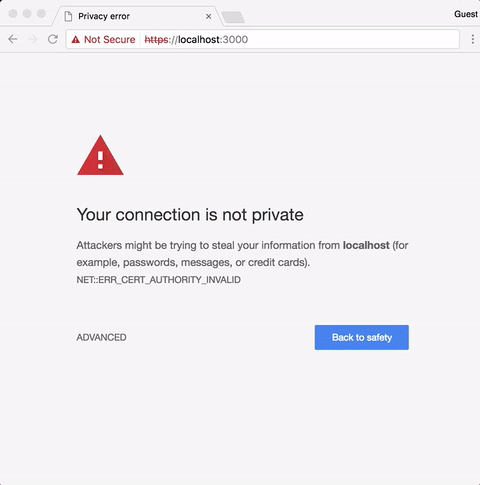

# <a name="create-an-office-add-in-using-any-editor"></a>使用任何编辑器创建 Office 外接程序

可使用 Yeoman 生成器创建 Office 外接程序。Yeoman 生成器可提供项目基架并生成管理。`manifest.xml` 文件告知 Office 应用程序你的外接程序所在的位置以及希望其显示的方式。Office 应用程序负责将其托管在 Office 内。

 >**注意：**这些指令使用 Mac 终端，你也可以使用其他 shell 环境。 


## <a name="prerequisites-for-the-yeoman-generator"></a>Yeoman 生成器系统必备

若要安装 Yeoman Office 生成器，必须在计算机上安装 [git](https://git-scm.com/downloads) 和 node.js。如果使用的是 Mac，我们建议使用 [Node Version Manager](https://github.com/creationix/nvm) 并利用适当权限安装 node.js。如果使用的是 Windows，可以从 [nodejs.org](https://nodejs.org/en/) 安装 node.js。

>**注意：**如果使用的是 Windows，请在安装 git 时使用默认值，以下情况除外：

>- 通过 Windows 命令提示符使用 git
>- 使用 Windows 默认控制台窗口

安装 node.js 后，打开一个终端，然后全局安装生成器。

```
npm install -g yo generator-office
```


## <a name="create-the-default-files-for-your-add-in"></a>为外接程序创建默认文件

Yeoman 生成器在你要为项目搭建架构的目录中运行。开发 Office 外接程序前，应先为项目创建文件夹。

在终端中，移到要在其中创建项目的父文件夹。然后，使用以下命令新建名为 _myHelloWorldaddin_ 的文件夹，然后将当前目录更改为此文件夹：


```
mkdir myHelloWorldaddin
cd myHelloWorldaddin
```

使用 Yeoman 生成器创建所选的外接程序。本文介绍的步骤用于创建简单的任务窗格外接程序。若要运行生成器，请输入以下命令：


```
yo office
```

**有关外接程序的 Yeoman 生成器输入**

生成器将提示输入以下内容： 


- 新建子文件夹 - 使用 _N_
- 外接程序名称 - 使用 _myHelloWorldaddin_ 
- 支持的 Office 应用程序 - 可以选择任意应用程序
- 新建外接程序 - 使用“_是，我想要新建外接程序_”。
- 添加 [TypeScript](https://www.typescriptlang.org/) - 使用 _N_
- 选择框架 - 使用 _Jquery_

>**注意：**若要创建使用 Office UI Fabric React 的 Office 外接程序，请输入以下内容：
>- 添加 [TypeScript](https://www.typescriptlang.org/) - 使用 _Y_
>- 选择框架 - 使用 _React_


这会为外接程序创建结构和基本文件。


## <a name="hosting-your-office-add-in"></a>托管 Office 外接程序

必须通过 HTTPS 托管 Office 外接程序，即使在开发中，也是如此。Yo Office 创建 bsconfig.json，其使用 Browsersync，以便你可以跨多台设备同步文件更改，从而更快速地调整和测试外接程序。 

在控制台中键入以下命令，在 https://localhost:3000 上启动本地 HTTPS 网站：


```
npm start
```

Browsersync 会启动 HTTPS 服务器，并在项目中启动 index.html 文件。你会看到错误消息“此网站的安全证书有问题”。




发生此错误是因为 Browsersync 包括开发环境必须信任的自签名 SSL 证书。若要了解如何解决此错误，请参阅[添加自签名证书](https://github.com/OfficeDev/generator-office/blob/master/src/docs/ssl.md)。

## <a name="sideload-the-add-in-into-office"></a>将外接程序旁加载到 Office

可以使用旁加载来安装外接程序，以供在 Office 客户端内进行测试：

- [旁加载 Office 外接程序以供测试](../testing/create-a-network-shared-folder-catalog-for-task-pane-and-content-add-ins.md)
- [在 iPad 和 Mac 上旁加载 Office 外接程序进行测试](../testing/sideload-an-office-add-in-on-ipad-and-mac.md)   
- [旁加载 Outlook 外接程序以供测试](../outlook/testing-and-tips.md)

## <a name="develop-your-office-add-in"></a>开发 Office 外接程序

可以使用任意文本编辑器开发自定义 Office 外接程序的文件。

> **重要说明：**manifest-myHelloWorldaddin.xml 文件会指示 Office 客户端应用程序如何与外接程序进行交互。`<id>` 标记中的值是 Yo Office 在生成项目时创建的 GUID。请勿为外接程序更改 GUID。如果主机为 Azure，`SourceLocation` 值将为类似 _https:// [name-of-your-web-app].azurewebsites.net/[path-to-add-in]_ 的 URL。如果使用的是自托管选项，在本示例中，此值为 _https://localhost:3000/[path-to-add-in]_。


## <a name="debug-your-office-add-in"></a>调试 Office 外接程序


可通过多种方式调试外接程序：

- 从任务窗格附加调试器 (Office 2016 for Windows)。
- 使用浏览器的开发人员工具。
- 在 Windows 10 上使用 F12 开发人员工具。

### <a name="attach-debugger-from-the-task-pane"></a>从任务窗格附加调试器

在 Office 2016 for Windows 生成号 77xx.xxxx 或更高版本中，可以从任务窗格附加调试器。使用附加调试器功能，可直接将调试器附加到正确的 Internet Explorer 进程中。无论你使用的是 Yeoman 生成器、Visual Studio Code、node.js、Angular 还是其他任何工具，都可以附加调试器。 

有关详细信息，请参阅[从任务窗格附加调试器](../testing/attach-debugger-from-task-pane.md)。


### <a name="browser-developer-tools"></a>浏览器开发者工具 

可使用 Office Web 客户端，打开浏览器的开发人员工具，然后就像调试任何其他客户端 JavaScript 应用程序一样调试外接程序。 

### <a name="f12-developer-tools-on-windows-10"></a>Windows 10 上的 F12 开发人员工具

如果是在 Windows 10 上使用 Office 桌面客户端，可以[在 Windows 10 上使用 F12 开发者工具调试外接程序](../testing/debug-add-ins-using-f12-developer-tools-on-windows-10.md)。
    
## <a name="next-steps"></a>后续步骤

- [部署和发布 Office 外接程序](../publish/publish.md)
    
