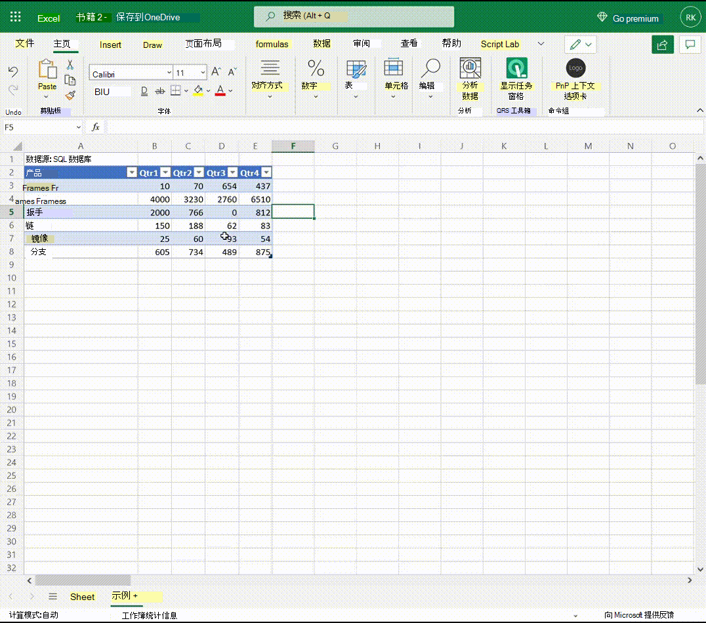

以下动画显示事件如何切换上下文选项卡的可见性以及更改按钮的启用状态。

1. 开始时，焦点不在表上。
1. 单击表格单元格，自定义上下文选项卡"表数据"显示在功能区 (内置上下文选项卡"表格设计") 。 
1. 选择" **表数据"** 选项卡将打开它。 选项卡上的两个按钮处于禁用状态。
1. 更改单元格中的数据将启用两个按钮。
1. 单击其中一个按钮将再次禁用这两个按钮。
1. 单击表外部的单元格将从表中删除焦点，并从功能区中删除两个上下文选项卡。

