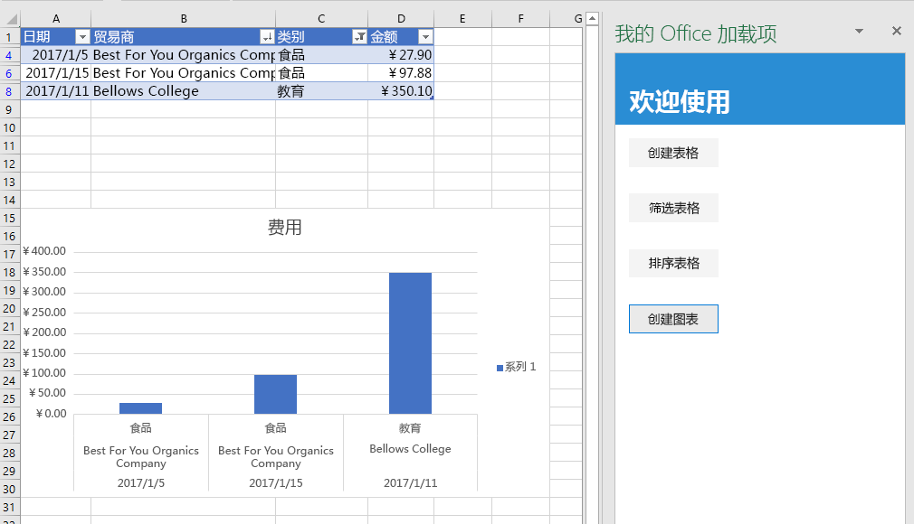

本教程的这一步是，使用先前创建的表中的数据创建图表，再设置图表格式。

> [!NOTE]
> 此为 Excel 加载项分步教程页面。 如果是通过搜索引擎结果或其他直接链接到达此页面，请转到 [Excel 加载项教程](../tutorials/excel-tutorial.yml)介绍性页面，从头开始学习本教程。

## <a name="chart-table-data"></a>将表数据绘制成图表

1. 在代码编辑器中打开项目。
2. 打开文件 index.html。
3. 在包含 `sort-table` 按钮的 `div` 下方，添加下列标记：

    ```html
    <div class="padding">
        <button class="ms-Button" id="create-chart">Create Chart</button>
    </div>
    ```

4. 打开 app.js 文件。

5. 在向 `sort-chart` 按钮分配单击处理程序的代码行下方，添加下列代码：

    ```js
    $('#create-chart').click(createChart);
    ```

6. 在 `sortTable` 函数下方，添加下列函数。

    ```js
    function createChart() {
        Excel.run(function (context) {

            // TODO1: Queue commands to get the range of data to be charted.

            // TODO2: Queue command to create the chart and define its type.

            // TODO3: Queue commands to position and format the chart.

            return context.sync();
        })
        .catch(function (error) {
            console.log("Error: " + error);
            if (error instanceof OfficeExtension.Error) {
                console.log("Debug info: " + JSON.stringify(error.debugInfo));
            }
        });
    }
    ```

7. 将 `TODO1` 替换为下列代码。请注意，为了排除标题行，此代码使用 `Table.getDataBodyRange` 方法（而不是 `getRange` 方法），获取要绘制成图表的数据的范围。

    ```js
    const currentWorksheet = context.workbook.worksheets.getActiveWorksheet();
    const expensesTable = currentWorksheet.tables.getItem('ExpensesTable');
    const dataRange = expensesTable.getDataBodyRange();
    ```

8. 将 `TODO2` 替换为下列代码。 请注意以下参数：
   - `add` 方法的第一个参数指定图表类型。有几十种类型。
   - 第二个参数指定要在图表中添加的数据的范围。
   - 第三个参数确定是按行方向还是按列方向绘制表格中的一系列数据点。 选项 `auto` 指示 Excel 确定最佳方法。

    ```js
    let chart = currentWorksheet.charts.add('ColumnClustered', dataRange, 'auto');
    ```

9. 将 `TODO3` 替换为以下代码。 此代码的大部分内容非常直观明了。 请注意几下几点：
   - `setPosition` 方法的参数指定应包含图表的工作表区域的左上角和右下角单元格。 Excel 可以调整行宽等设置，以便图表能够适应所提供的空间。
   - “系列”是指表格列中的一组数据点。 因为表格中只有一个非字符串列，所以 Excel 推断此列就是要绘制成图表的唯一一列数据点。 它将其他列解释为图表标签。 因此，图表中只有一个系列，它的索引为 0。 这是要标记为“金额（欧元）”的系列。

    ```js
    chart.setPosition("A15", "F30");
    chart.title.text = "Expenses";
    chart.legend.position = "right"
    chart.legend.format.fill.setSolidColor("white");
    chart.dataLabels.format.font.size = 15;
    chart.dataLabels.format.font.color = "black";
    chart.series.getItemAt(0).name = 'Value in €';
    ```

## <a name="test-the-add-in"></a>测试加载项


1. 如果上一阶段教程中的 Git Bash 窗口或已启用 Node.JS 的系统命令提示符仍处于打开状态，请按 Ctrl-C 两次，停止正在运行的 Web 服务器。 否则，打开 Git Bash 窗口或已启用 Node.JS 的系统命令提示符，并转到项目的“开始”**** 文件夹。

     > [!NOTE]
     > 虽然只要更改任意文件（包括 app.js 文件），浏览器同步服务器就会在任务窗格中重新加载加载项，但它不会重新转换 JavaScript。因此，必须重复执行生成命令，这样对 app.js 做出的更改才会生效。 为此，需要终止服务器进程，这样就可以通提示符输入生成命令。 生成后，重启服务器。 接下来的几步执行的就是此进程。

1. 运行命令 `npm run build`，将 ES6 源代码转换为 Internet Explorer 支持的旧版 JavaScript（Excel 在后台用来运行 Excel 加载项）。
2. 运行命令 `npm start`，启动在 localhost 上运行的 Web 服务器。
4. 通过关闭任务窗格来重新加载它，再选择“**开始**”菜单上的“**显示任务窗格**”，以重新打开加载项。
5. 如果出于某种原因在工作表中打不开表格，请在任务窗格中依次选择“**创建表**”、“**筛选表**”和“**排序表**”按钮（按顺序和倒序中的任一顺序排序皆可）。
6. 选择“**创建图表**”按钮。 此时，图表创建完成，其中仅包含筛选出的行中的数据。 底部数据点上的标签按图表的排序顺序进行排序，即按商家名称的字母倒序排序。

    
