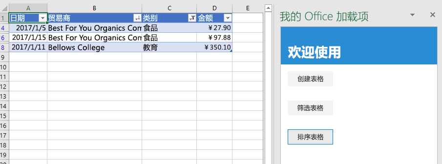

<span data-ttu-id="da9f4-101">本教程的这一步是，筛选并排序之前创建的表。</span><span class="sxs-lookup"><span data-stu-id="da9f4-101">In this step of the tutorial, you'll filter and sort the table that you created previously.</span></span>

> [!NOTE]
> <span data-ttu-id="da9f4-102">此为 Excel 加载项分步教程页面。</span><span class="sxs-lookup"><span data-stu-id="da9f4-102">This page describes an individual step of the Excel add-in tutorial.</span></span> <span data-ttu-id="da9f4-103">如果是通过搜索引擎结果或其他直接链接到达此页面，请转到 [Excel 加载项教程](../tutorials/excel-tutorial.yml)介绍性页面，从头开始学习本教程。</span><span class="sxs-lookup"><span data-stu-id="da9f4-103">If you’ve arrived at this page via search engine results or other direct link, please go to the [Excel add-in tutorial](../tutorials/excel-tutorial.yml) introduction page to start the tutorial from the beginning.</span></span>

## <a name="filter-the-table"></a><span data-ttu-id="da9f4-104">筛选表</span><span class="sxs-lookup"><span data-stu-id="da9f4-104">Filter the table</span></span>

1. <span data-ttu-id="da9f4-105">在代码编辑器中打开项目。</span><span class="sxs-lookup"><span data-stu-id="da9f4-105">Open the project in your code editor.</span></span>
2. <span data-ttu-id="da9f4-106">打开文件 index.html。</span><span class="sxs-lookup"><span data-stu-id="da9f4-106">Open the file index.html.</span></span>
3. <span data-ttu-id="da9f4-107">在包含 `create-table` 按钮的 `div` 正下方，添加下列标记：</span><span class="sxs-lookup"><span data-stu-id="da9f4-107">Just below the `div` that contains the `create-table` button, add the following markup:</span></span>

    ```html
    <div class="padding">
        <button class="ms-Button" id="filter-table">Filter Table</button>
    </div>
    ```

4. <span data-ttu-id="da9f4-108">打开 app.js 文件。</span><span class="sxs-lookup"><span data-stu-id="da9f4-108">Open the app.js file.</span></span>

5. <span data-ttu-id="da9f4-109">在向 `create-table` 按钮分配单击处理程序的代码行正下方，添加下列代码：</span><span class="sxs-lookup"><span data-stu-id="da9f4-109">Just below the line that assigns a click handler to the `create-table` button, add the following code:</span></span>

    ```js
    $('#filter-table').click(filterTable);
    ```

6. <span data-ttu-id="da9f4-110">在 `createTable` 函数正下方，添加下列函数：</span><span class="sxs-lookup"><span data-stu-id="da9f4-110">Just below the `createTable` function, add the following function:</span></span>

    ```js
    function filterTable() {
        Excel.run(function (context) {

            // TODO1: Queue commands to filter out all expense categories except
            //        Groceries and Education.

            return context.sync();
        })
        .catch(function (error) {
            console.log("Error: " + error);
            if (error instanceof OfficeExtension.Error) {
                console.log("Debug info: " + JSON.stringify(error.debugInfo));
            }
        });
    }
    ```

7. <span data-ttu-id="da9f4-p102">将 `TODO1` 替换为以下代码。请注意以下几点：</span><span class="sxs-lookup"><span data-stu-id="da9f4-p102">Replace `TODO1` with the following code. Note:</span></span>
   - <span data-ttu-id="da9f4-113">代码先将列名称传递给 `getItem` 方法（而不是像 `createTable` 方法一样将列索引传递给 `getItemAt` 方法），获取对需要筛选的列的引用。</span><span class="sxs-lookup"><span data-stu-id="da9f4-113">The code first gets a reference to the column that needs filtering by passing the column name to the `getItem` method, instead of passing its index to the `getItemAt` method as the `createTable` method does.</span></span> <span data-ttu-id="da9f4-114">由于用户可以移动表格列，因此给定索引处的列可能会在表格创建后更改。</span><span class="sxs-lookup"><span data-stu-id="da9f4-114">Since users can move table columns, the column at a given index might change after the table is created.</span></span> <span data-ttu-id="da9f4-115">所以，更安全的做法是，使用列名称获取对列的引用。</span><span class="sxs-lookup"><span data-stu-id="da9f4-115">Hence, it is safer to use the column name to get a reference to the column.</span></span> <span data-ttu-id="da9f4-116">上一教程安全地使用了 `getItemAt`，因为是在与创建表格完全相同的方法中使用了它，所以用户没有机会移动列。</span><span class="sxs-lookup"><span data-stu-id="da9f4-116">We used `getItemAt` safely in the preceding tutorial, because we used it in the very same method that creates the table, so there is no chance that a user has moved the column.</span></span>
   - <span data-ttu-id="da9f4-117">`applyValuesFilter` 方法是对 `Filter` 对象执行的多种筛选方法之一。</span><span class="sxs-lookup"><span data-stu-id="da9f4-117">The `applyValuesFilter` method is one of several filtering methods on the `Filter` object.</span></span>

    ```js
    const currentWorksheet = context.workbook.worksheets.getActiveWorksheet();
    const expensesTable = currentWorksheet.tables.getItem('ExpensesTable');
    const categoryFilter = expensesTable.columns.getItem('Category').filter;
    categoryFilter.applyValuesFilter(["Education", "Groceries"]);
    ``` 

## <a name="sort-the-table"></a><span data-ttu-id="da9f4-118">排序表格</span><span class="sxs-lookup"><span data-stu-id="da9f4-118">Sort the table</span></span>

1. <span data-ttu-id="da9f4-119">打开文件 index.html。</span><span class="sxs-lookup"><span data-stu-id="da9f4-119">Open the file index.html.</span></span>
2. <span data-ttu-id="da9f4-120">在包含 `filter-table` 按钮的 `div` 下方，添加下列标记：</span><span class="sxs-lookup"><span data-stu-id="da9f4-120">Below the `div` that contains the `filter-table` button, add the following markup:</span></span>

    ```html
    <div class="padding">
        <button class="ms-Button" id="sort-table">Sort Table</button>
    </div>
    ```

3. <span data-ttu-id="da9f4-121">打开 app.js 文件。</span><span class="sxs-lookup"><span data-stu-id="da9f4-121">Open the app.js file.</span></span>

4. <span data-ttu-id="da9f4-122">在向 `filter-table` 按钮分配单击处理程序的代码行下方，添加下列代码：</span><span class="sxs-lookup"><span data-stu-id="da9f4-122">Below the line that assigns a click handler to the `filter-table` button, add the following code:</span></span>

    ```js
    $('#sort-table').click(sortTable);
    ```

5. <span data-ttu-id="da9f4-123">在 `filterTable` 函数下方，添加下列函数。</span><span class="sxs-lookup"><span data-stu-id="da9f4-123">Below the `filterTable` function add the following function.</span></span>

    ```js
    function sortTable() {
        Excel.run(function (context) {

            // TODO1: Queue commands to sort the table by Merchant name.

            return context.sync();
        })
        .catch(function (error) {
            console.log("Error: " + error);
            if (error instanceof OfficeExtension.Error) {
                console.log("Debug info: " + JSON.stringify(error.debugInfo));
            }
        });
    }
    ```

7. <span data-ttu-id="da9f4-p104">将 `TODO1` 替换为以下代码。请注意以下几点：</span><span class="sxs-lookup"><span data-stu-id="da9f4-p104">Replace `TODO1` with the following code. Note:</span></span>
   - <span data-ttu-id="da9f4-126">此代码创建一组 `SortField` 对象，其中只有一个成员，因为加载项只对“商家”列进行了排序。</span><span class="sxs-lookup"><span data-stu-id="da9f4-126">The code creates an array of `SortField` objects which has just one member since the add-in only sorts on the Merchant column.</span></span>
   - <span data-ttu-id="da9f4-127">`SortField` 对象的 `key` 属性是要排序的列的从零开始编制索引。</span><span class="sxs-lookup"><span data-stu-id="da9f4-127">The `key` property of a `SortField` object is the zero-based index of the column to sort-on.</span></span>
   - <span data-ttu-id="da9f4-128">`Table` 的 `sort` 成员是 `TableSort` 对象，并不是方法。</span><span class="sxs-lookup"><span data-stu-id="da9f4-128">The `sort` member of a `Table` is a `TableSort` object, not a method.</span></span> <span data-ttu-id="da9f4-129">`SortField` 传递到 `TableSort` 对象的 `apply` 方法。</span><span class="sxs-lookup"><span data-stu-id="da9f4-129">The `SortField`s are passed the `TableSort` object's `apply` method.</span></span>

    ```js
    const currentWorksheet = context.workbook.worksheets.getActiveWorksheet();
    const expensesTable = currentWorksheet.tables.getItem('ExpensesTable');
    const sortFields = [
        {
            key: 1,            // Merchant column
            ascending: false,
        }
    ];

    expensesTable.sort.apply(sortFields);
    ```

## <a name="test-the-add-in"></a><span data-ttu-id="da9f4-130">测试加载项</span><span class="sxs-lookup"><span data-stu-id="da9f4-130">Test the add-in</span></span>

1. <span data-ttu-id="da9f4-131">如果上一阶段教程中的 Git Bash 窗口或已启用 Node.JS 的系统命令提示符仍处于打开状态，请按 Ctrl-C 两次，停止正在运行的 Web 服务器。</span><span class="sxs-lookup"><span data-stu-id="da9f4-131">If the Git bash window, or Node.JS-enabled system prompt, from the previous stage tutorial is still open, enter Ctrl-C twice to stop the running web server.</span></span> <span data-ttu-id="da9f4-132">否则，打开 Git Bash 窗口或已启用 Node.JS 的系统命令提示符，并转到项目的“开始”\*\*\*\* 文件夹。</span><span class="sxs-lookup"><span data-stu-id="da9f4-132">Otherwise, open a Git bash window, or Node.JS-enabled system prompt, and navigate to the **Start** folder of the project.</span></span>

     > [!NOTE]
     > <span data-ttu-id="da9f4-133">虽然只要更改任意文件（包括 app.js 文件），浏览器同步服务器就会在任务窗格中重新加载加载项，但它不会重新转换 JavaScript。因此，必须重复执行生成命令，这样对 app.js 做出的更改才会生效。</span><span class="sxs-lookup"><span data-stu-id="da9f4-133">Although the browser-sync server reloads your add-in in the task pane every time you make a change to any file, including the app.js file, it does not retranspile the JavaScript, so you must repeat the build command in order for your changes to app.js to take effect.</span></span> <span data-ttu-id="da9f4-134">为此，需要终止服务器进程，这样就可以获得提示符来输入生成命令。</span><span class="sxs-lookup"><span data-stu-id="da9f4-134">In order to do this, you need to kill the server process in so that you can get a prompt to enter the build command.</span></span> <span data-ttu-id="da9f4-135">生成后，重启服务器。</span><span class="sxs-lookup"><span data-stu-id="da9f4-135">After the build, you restart the server.</span></span> <span data-ttu-id="da9f4-136">接下来的几步执行的就是此进程。</span><span class="sxs-lookup"><span data-stu-id="da9f4-136">The next few steps carry out this process.</span></span>

1. <span data-ttu-id="da9f4-137">运行命令 `npm run build`，将 ES6 源代码转换为 Internet Explorer 支持的旧版 JavaScript（Excel 在后台用来运行 Excel 加载项）。</span><span class="sxs-lookup"><span data-stu-id="da9f4-137">Run the command `npm run build` to transpile your ES6 source code to an earlier version of JavaScript that is supported by Internet Explorer (which is used under-the-hood by Excel to run Excel add-ins).</span></span>
2. <span data-ttu-id="da9f4-138">运行命令 `npm start`，启动在 localhost 上运行的 Web 服务器。</span><span class="sxs-lookup"><span data-stu-id="da9f4-138">Run the command `npm start` to start a web server running on localhost.</span></span>
4. <span data-ttu-id="da9f4-139">通过关闭任务窗格来重新加载它，再选择“**开始**”菜单上的“**显示任务窗格**”，以重新打开加载项。</span><span class="sxs-lookup"><span data-stu-id="da9f4-139">Reload the task pane by closing it, and then on the **Home** menu, select **Show Taskpane** to reopen the add-in.</span></span>
5. <span data-ttu-id="da9f4-140">如果表格因任何原因未在打开的工作表中，请在任务窗格中选择“**创建表**”。</span><span class="sxs-lookup"><span data-stu-id="da9f4-140">If for any reason the table is not in the open worksheet, in the taskpane, choose **Create Table**.</span></span>
6. <span data-ttu-id="da9f4-141">选择“**筛选表**”和“**排序表**”（按顺序和倒序中的任一顺序排序皆可）。</span><span class="sxs-lookup"><span data-stu-id="da9f4-141">Choose the **Filter Table** and **Sort Table** buttons, in either order.</span></span>

    
