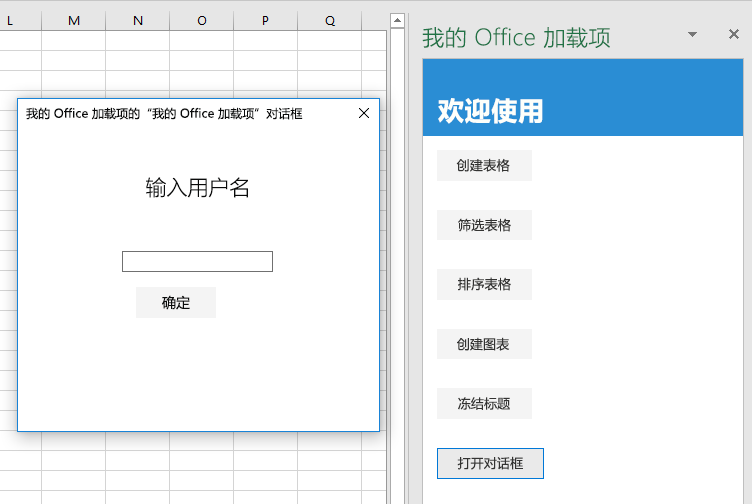

<span data-ttu-id="4bf93-101">本教程的最后一步是，在加载项中打开对话框，将消息从对话框进程传递到任务窗格进程，再关闭对话框。</span><span class="sxs-lookup"><span data-stu-id="4bf93-101">In this final step of the tutorial, you'll open a dialog in your add-in, pass a message from the dialog process to the task pane process, and close the dialog.</span></span> <span data-ttu-id="4bf93-102">Office 加载项对话框是*非模式*窗口。也就是说，用户可以继续与主机 Office 应用中的文档，以及与任务窗格中的主机页进行交互。</span><span class="sxs-lookup"><span data-stu-id="4bf93-102">Office Add-in dialogs are *nonmodal*: a user can continue to interact with both the document in the host Office application and with the host page in the task pane.</span></span>

> [!NOTE]
> <span data-ttu-id="4bf93-103">此为 Excel 加载项分步教程页面。</span><span class="sxs-lookup"><span data-stu-id="4bf93-103">This page describes an individual step of the Excel add-in tutorial.</span></span> <span data-ttu-id="4bf93-104">如果是通过搜索引擎结果或其他直接链接到达此页面，请转到 [Excel 加载项教程](../tutorials/excel-tutorial.yml)介绍性页面，从头开始学习本教程。</span><span class="sxs-lookup"><span data-stu-id="4bf93-104">If you’ve arrived at this page via search engine results or other direct link, please go to the [Excel add-in tutorial](../tutorials/excel-tutorial.yml) introduction page to start the tutorial from the beginning.</span></span>

## <a name="create-the-dialog-page"></a><span data-ttu-id="4bf93-105">创建对话框页面</span><span class="sxs-lookup"><span data-stu-id="4bf93-105">Create the dialog page</span></span>

1. <span data-ttu-id="4bf93-106">在代码编辑器中打开项目。</span><span class="sxs-lookup"><span data-stu-id="4bf93-106">Open the project in your code editor.</span></span>
2. <span data-ttu-id="4bf93-107">在项目的根目录（其中包含 index.html）中，创建 popup.html 文件。</span><span class="sxs-lookup"><span data-stu-id="4bf93-107">Create a file in the root of the project (where index.html is) called popup.html.</span></span>
3. <span data-ttu-id="4bf93-p103">将下面的标记添加到 popup.html 中。请注意以下几点：</span><span class="sxs-lookup"><span data-stu-id="4bf93-p103">Add the following markup to popup.html. Note:</span></span>
   - <span data-ttu-id="4bf93-110">此页面包含可供用户输入用户名的 `<input>`，并包含将用户名发送到任务窗格中用户名显示页面的按钮。</span><span class="sxs-lookup"><span data-stu-id="4bf93-110">The page has a `<input>` where the user will enter their name and a button that will send the name to the page in the task pane where it will be displayed.</span></span>
   - <span data-ttu-id="4bf93-111">此标记加载在后续步骤中创建的 popup.js 脚本。</span><span class="sxs-lookup"><span data-stu-id="4bf93-111">The markup loads a script called popup.js that you will create in a later step.</span></span>
   - <span data-ttu-id="4bf93-112">此标记还加载 Office.JS 库和 jQuery，因为 popup.js 将使用它们。</span><span class="sxs-lookup"><span data-stu-id="4bf93-112">It also loads the Office.JS library and jQuery because they will be used in popup.js.</span></span>

    ```html
    <!DOCTYPE html>
    <html>
        <head lang="en">
            <title>Dialog for My Office Add-in</title>
            <meta charset="UTF-8">
            <meta name="viewport" content="width=device-width, initial-scale=1">

            <link rel="stylesheet" href="node_modules/office-ui-fabric-js/dist/css/fabric.min.css" />
            <link rel="stylesheet" href="node_modules/office-ui-fabric-js/dist/css/fabric.components.css" />
            <link rel="stylesheet" href="app.css" />

            <script type="text/javascript" src="https://appsforoffice.microsoft.com/lib/1.1/hosted/office.js"></script>
            <script type="text/javascript" src="https://ajax.aspnetcdn.com/ajax/jQuery/jquery-2.2.1.min.js"></script>
            <script type="text/javascript" src="popup.js"></script>

        </head>
        <body style="display:flex;flex-direction:column;align-items:center;justify-content:center">
            <div class="padding">
                <p class="ms-font-xl">ENTER YOUR NAME</p>
            </div>
            <div class="padding">
                <input id="name-box" type="text"/>
            </div>
            <div class="padding">
                <button id="ok-button" class="ms-Button">OK</button>
            </div>
        </body>
    </html>
    ```

4. <span data-ttu-id="4bf93-113">在项目的根目录中，创建 popup.js 文件。</span><span class="sxs-lookup"><span data-stu-id="4bf93-113">Create a file in the root of the project called popup.js.</span></span>
5. <span data-ttu-id="4bf93-p104">将下面的代码添加到 popup.js 中。请注意以下几点：</span><span class="sxs-lookup"><span data-stu-id="4bf93-p104">Add the following code to popup.js. Note:</span></span>
   - <span data-ttu-id="4bf93-116">*所有调用 Office.JS 库中 API 的页面都必须向 `Office.initialize` 属性分配函数。*</span><span class="sxs-lookup"><span data-stu-id="4bf93-116">*Every page that calls APIs in the Office.JS library must assign a function to the `Office.initialize` property.*</span></span> <span data-ttu-id="4bf93-117">如果不需要初始化，函数可以主体是空的，但此属性既不得未定义，也不得分配到空值或非函数值。</span><span class="sxs-lookup"><span data-stu-id="4bf93-117">If no initialization is needed, then the function can have an empty body, but the property must not be left undefined, assigned to null or to a non-function value.</span></span> <span data-ttu-id="4bf93-118">有关示例，请参阅项目根目录中的 app.js 文件。</span><span class="sxs-lookup"><span data-stu-id="4bf93-118">For an example, see the app.js file in the project root.</span></span> <span data-ttu-id="4bf93-119">分配代码必须先于任何 Office.JS 调用运行，因此分配代码位于页面加载的脚本文件中，正如本例所示。</span><span class="sxs-lookup"><span data-stu-id="4bf93-119">The code that makes the assignment must run before any calls to Office.JS; hence the assignment is in a script file that is loaded by the page, as it is in this case.</span></span>
   - <span data-ttu-id="4bf93-p106">jQuery `ready` 函数在 `initialize` 方法内调用。应在 `Office.initialize` 函数内加载、初始化或启动其他 JavaScript 库的代码，这几乎就是一条普遍性规则。</span><span class="sxs-lookup"><span data-stu-id="4bf93-p106">The jQuery `ready` function is called inside the `initialize` method. It is an almost universal rule that the loading, initializing, or bootstrapping code of other JavaScript libraries should be inside the `Office.initialize` function.</span></span>

    ```js
    (function () {
    "use strict";

        Office.initialize = function() {
            $(document).ready(function () {  

                // TODO1: Assign handler to the OK button.

            });
        }

        // TODO2: Create the OK button handler

    }());
    ```

6. <span data-ttu-id="4bf93-122">将 `TODO1` 替换为下列代码。</span><span class="sxs-lookup"><span data-stu-id="4bf93-122">Replace `TODO1` with the following code.</span></span> <span data-ttu-id="4bf93-123">将在下一步中创建 `sendStringToParentPage` 函数。</span><span class="sxs-lookup"><span data-stu-id="4bf93-123">You'll create the `sendStringToParentPage` function in the next step.</span></span>

    ```js
    $('#ok-button').click(sendStringToParentPage);
    ```

7. <span data-ttu-id="4bf93-124">将 `TODO2` 替换为以下代码。</span><span class="sxs-lookup"><span data-stu-id="4bf93-124">Replace `TODO2` with the following code.</span></span> <span data-ttu-id="4bf93-125">`messageParent` 方法将它的参数传递到父页面（在此示例中，为任务窗格中的页面）。</span><span class="sxs-lookup"><span data-stu-id="4bf93-125">The `messageParent` method passes its parameter to the parent page, in this case, the page in the task pane.</span></span> <span data-ttu-id="4bf93-126">参数可以是布尔值或字符串，其中包含可串行化为字符串的任何内容（如 XML 或 JSON）。</span><span class="sxs-lookup"><span data-stu-id="4bf93-126">The parameter can be a boolean or a string, which includes anything that can be serialized as a string, such as XML or JSON.</span></span>

    ```js
    function sendStringToParentPage() {
        var userName = $('#name-box').val();
        Office.context.ui.messageParent(userName);
    }
    ```

8. <span data-ttu-id="4bf93-127">保存文件。</span><span class="sxs-lookup"><span data-stu-id="4bf93-127">Save the file.</span></span>

   > [!NOTE]
   > <span data-ttu-id="4bf93-128">popup.html 文件及其加载的 popup.js 文件在完全独立于加载项任务窗格的 Internet Explorer 进程中运行。</span><span class="sxs-lookup"><span data-stu-id="4bf93-128">The popup.html file, and the popup.js file that it loads, run in an entirely separate Internet Explorer process from the add-in's task pane.</span></span> <span data-ttu-id="4bf93-129">如果将 popup.js 转换为与 app.js 文件相同的 bundle.js 文件，加载项必须加载 bundle.js 文件的两个副本，这就违背了绑定目的。</span><span class="sxs-lookup"><span data-stu-id="4bf93-129">If the popup.js was transpiled into the same bundle.js file as the app.js file, then the add-in would have to load two copies of the bundle.js file, which defeats the purpose of bundling.</span></span> <span data-ttu-id="4bf93-130">此外，popup.js 文件不包含任何不受 IE 支持的 JavaScript。</span><span class="sxs-lookup"><span data-stu-id="4bf93-130">In addition, the popup.js file does not contain any JavaScript that is unsupported by IE.</span></span> <span data-ttu-id="4bf93-131">出于这两点原因，此加载项根本不会转换 popup.js。</span><span class="sxs-lookup"><span data-stu-id="4bf93-131">For these two reasons, this add-in does not transpile the popup.js file at all.</span></span>


## <a name="open-the-dialog-from-the-task-pane"></a><span data-ttu-id="4bf93-132">从任务窗格打开对话框</span><span class="sxs-lookup"><span data-stu-id="4bf93-132">Open the dialog from the task pane</span></span>

1. <span data-ttu-id="4bf93-133">打开文件 index.html。</span><span class="sxs-lookup"><span data-stu-id="4bf93-133">Open the file index.html.</span></span>
2. <span data-ttu-id="4bf93-134">在包含 `freeze-header` 按钮的 `div` 下方，添加下列标记：</span><span class="sxs-lookup"><span data-stu-id="4bf93-134">Below the `div` that contains the `freeze-header` button, add the following markup:</span></span>

    ```html
    <div class="padding">
        <button class="ms-Button" id="open-dialog">Open Dialog</button>
    </div>
    ```

3. <span data-ttu-id="4bf93-135">对话框会提示用户输入用户名，并将用户名传递到任务窗格。</span><span class="sxs-lookup"><span data-stu-id="4bf93-135">The dialog will prompt the user to enter a name and pass the user's name to the task pane.</span></span> <span data-ttu-id="4bf93-136">任务窗格将在标签中显示用户名。</span><span class="sxs-lookup"><span data-stu-id="4bf93-136">The task pane will display it in a label.</span></span> <span data-ttu-id="4bf93-137">在刚刚添加的 `div` 正下方，添加下列标记：</span><span class="sxs-lookup"><span data-stu-id="4bf93-137">Immediately below the `div` that you just added, add the following markup:</span></span>

    ```html
    <div class="padding">
        <label id="user-name"></label>
    </div>
    ```

4. <span data-ttu-id="4bf93-138">打开 app.js 文件。</span><span class="sxs-lookup"><span data-stu-id="4bf93-138">Open the app.js file.</span></span>

5. <span data-ttu-id="4bf93-139">在向 `freeze-header` 按钮分配单击处理程序的代码行下方，添加下列代码。</span><span class="sxs-lookup"><span data-stu-id="4bf93-139">Below the line that assigns a click handler to the `freeze-header` button, add the following code.</span></span> <span data-ttu-id="4bf93-140">`openDialog` 方法是在后续步骤中创建。</span><span class="sxs-lookup"><span data-stu-id="4bf93-140">You'll create the `openDialog` method in a later step.</span></span>

    ```js
    $('#open-dialog').click(openDialog);
    ```

6. <span data-ttu-id="4bf93-p112">在 `freezeHeader` 函数下方，添加下列声明。此变量用于保留父页面执行上下文中的对象，以用作对话框页面执行上下文的中间对象。</span><span class="sxs-lookup"><span data-stu-id="4bf93-p112">Below the `freezeHeader` function add the following declaration. This variable is used to hold an object in the parent page's execution context that acts as an intermediator to the dialog page's execution context.</span></span>

    ```js
    let dialog = null;
    ```

7. <span data-ttu-id="4bf93-143">在 `dialog` 声明下方，添加下列函数。</span><span class="sxs-lookup"><span data-stu-id="4bf93-143">Below the declaration of `dialog`, add the following function.</span></span> <span data-ttu-id="4bf93-144">关于此代码，请务必注意它*不*包含的内容，即不含 `Excel.run` 调用。</span><span class="sxs-lookup"><span data-stu-id="4bf93-144">The important thing to notice about this code is what is *not* there: there is no call of `Excel.run`.</span></span> <span data-ttu-id="4bf93-145">这是因为对话框打开 API 跨所有 Office 主机共享，所以它属于 Office JavaScript 公用 API，而不属于 Excel 专用 API。</span><span class="sxs-lookup"><span data-stu-id="4bf93-145">This is because the API to open a dialog is shared among all Office hosts, so it is part of the Office JavaScript Common API, not the Excel-specific API.</span></span>

    ```js
    function openDialog() {
        // TODO1: Call the Office Common API that opens a dialog
    }
    ```

8. <span data-ttu-id="4bf93-p114">将 `TODO1` 替换为以下代码。注意：</span><span class="sxs-lookup"><span data-stu-id="4bf93-p114">Replace `TODO1` with the following code. Note:</span></span>
   - <span data-ttu-id="4bf93-148">`displayDialogAsync` 方法在屏幕中央打开对话框。</span><span class="sxs-lookup"><span data-stu-id="4bf93-148">The `displayDialogAsync` method opens a dialog in the center of the screen.</span></span>
   - <span data-ttu-id="4bf93-149">第一个参数是要打开的页面 URL。</span><span class="sxs-lookup"><span data-stu-id="4bf93-149">The first parameter is the URL of the page to open.</span></span>
   - <span data-ttu-id="4bf93-p115">第二个参数用于传递选项。`height` 和 `width` 是 Office 应用程序窗口大小百分比。</span><span class="sxs-lookup"><span data-stu-id="4bf93-p115">The second parameter passes options. `height` and `width` are percentages of the size of the Office application's window.</span></span>

    ```js
    Office.context.ui.displayDialogAsync(
        'https://localhost:3000/popup.html',
        {height: 45, width: 55},

        // TODO2: Add callback parameter.
    );
    ```

## <a name="process-the-message-from-the-dialog-and-close-the-dialog"></a><span data-ttu-id="4bf93-152">处理对话框发送的消息并关闭对话框</span><span class="sxs-lookup"><span data-stu-id="4bf93-152">Process the message from the dialog and close the dialog</span></span>

1. <span data-ttu-id="4bf93-p116">继续使用 app.js 文件，将 `TODO2` 替换为下列代码。请注意以下几点：</span><span class="sxs-lookup"><span data-stu-id="4bf93-p116">Continue in the app.js file, and replace `TODO2` with the following code. Note:</span></span>
   - <span data-ttu-id="4bf93-155">回调在对话框成功打开后，且当用户在对话框中执行任何操作前立即执行。</span><span class="sxs-lookup"><span data-stu-id="4bf93-155">The callback is executed immediately after the dialog successfully opens and before the user has taken any action in the dialog.</span></span>
   - <span data-ttu-id="4bf93-156">`result.value` 对象用作父页面执行上下文和对话框页面执行上下文的中间对象。</span><span class="sxs-lookup"><span data-stu-id="4bf93-156">The `result.value` is the object that acts as a kind of middleman between the execution contexts of the parent and dialog pages.</span></span>
   - <span data-ttu-id="4bf93-157">`processMessage` 函数将在后续步骤中创建。</span><span class="sxs-lookup"><span data-stu-id="4bf93-157">The `processMessage` function will be created in a later step.</span></span> <span data-ttu-id="4bf93-158">此处理程序将处理通过 `messageParent` 函数调用从对话框页面发送的任何值。</span><span class="sxs-lookup"><span data-stu-id="4bf93-158">This handler will process any values that are sent from the dialog page with calls of the `messageParent` function.</span></span>

    ```js
    function (result) {
        dialog = result.value;
        dialog.addEventHandler(Microsoft.Office.WebExtension.EventType.DialogMessageReceived, processMessage);
    }
    ```

2. <span data-ttu-id="4bf93-159">在 `openDialog` 函数下方，添加下列函数。</span><span class="sxs-lookup"><span data-stu-id="4bf93-159">Below the `openDialog` function, add the following function.</span></span>

    ```js
    function processMessage(arg) {
        $('#user-name').text(arg.message);
        dialog.close();
    }
    ```

## <a name="test-the-add-in"></a><span data-ttu-id="4bf93-160">测试加载项</span><span class="sxs-lookup"><span data-stu-id="4bf93-160">Test the add-in</span></span>

1. <span data-ttu-id="4bf93-161">如果上一阶段教程中的 Git Bash 窗口或已启用 Node.JS 的系统命令提示符仍处于打开状态，请按 Ctrl-C 两次，停止正在运行的 Web 服务器。</span><span class="sxs-lookup"><span data-stu-id="4bf93-161">If the Git bash window, or Node.JS-enabled system prompt, from the previous stage tutorial is still open, enter Ctrl-C twice to stop the running web server.</span></span> <span data-ttu-id="4bf93-162">否则，打开 Git Bash 窗口或已启用 Node.JS 的系统命令提示符，并转到项目的“开始”\*\*\*\* 文件夹。</span><span class="sxs-lookup"><span data-stu-id="4bf93-162">Otherwise, open a Git bash window, or Node.JS-enabled system prompt, and navigate to the **Start** folder of the project.</span></span>

     > [!NOTE]
     > <span data-ttu-id="4bf93-163">虽然只要更改任意文件（包括 app.js 文件），浏览器同步服务器就会在任务窗格中重新加载加载项，但它不会重新转换 JavaScript。因此，必须重复执行生成命令，这样对 app.js 做出的更改才会生效。</span><span class="sxs-lookup"><span data-stu-id="4bf93-163">Although the browser-sync server reloads your add-in in the task pane every time you make a change to any file, including the app.js file, it does not retranspile the JavaScript, so you must repeat the build command in order for your changes to app.js to take effect.</span></span> <span data-ttu-id="4bf93-164">为此，需要终止服务器进程，这样就可以通提示符输入生成命令。</span><span class="sxs-lookup"><span data-stu-id="4bf93-164">In order to do this, you need to kill the server process in so that you can get a prompt to enter the build command.</span></span> <span data-ttu-id="4bf93-165">生成后，重启服务器。</span><span class="sxs-lookup"><span data-stu-id="4bf93-165">After the build, you restart the server.</span></span> <span data-ttu-id="4bf93-166">接下来的几步执行的就是此进程。</span><span class="sxs-lookup"><span data-stu-id="4bf93-166">The next few steps carry out this process.</span></span>

1. <span data-ttu-id="4bf93-167">运行命令 `npm run build`，将 ES6 源代码转换为 Internet Explorer 支持的旧版 JavaScript（Excel 在后台用来运行 Excel 加载项）。</span><span class="sxs-lookup"><span data-stu-id="4bf93-167">Run the command `npm run build` to transpile your ES6 source code to an earlier version of JavaScript that is supported by Internet Explorer (which is used under-the-hood by Excel to run Excel add-ins).</span></span>
2. <span data-ttu-id="4bf93-168">运行命令 `npm start`，启动在 localhost 上运行的 Web 服务器。</span><span class="sxs-lookup"><span data-stu-id="4bf93-168">Run the command `npm start` to start a web server running on localhost.</span></span>
4. <span data-ttu-id="4bf93-169">通过关闭任务窗格来重新加载它，再选择“主页”\*\*\*\* 菜单上的“显示任务窗格”\*\*\*\*，重新打开加载项。</span><span class="sxs-lookup"><span data-stu-id="4bf93-169">Reload the task pane by closing it, and then on the **Home** menu, select **Show Taskpane** to reopen the add-in.</span></span>
6. <span data-ttu-id="4bf93-170">选择任务窗格中的“打开对话框”\*\*\*\* 按钮。</span><span class="sxs-lookup"><span data-stu-id="4bf93-170">Choose the **Open Dialog** button in the task pane.</span></span>
7. <span data-ttu-id="4bf93-171">对话框打开后，拖动它并重设大小。</span><span class="sxs-lookup"><span data-stu-id="4bf93-171">While the dialog is open, drag it and resize it.</span></span> <span data-ttu-id="4bf93-172">请注意，既可以与工作表进行交互，也可以按任务窗格上的其他按钮。</span><span class="sxs-lookup"><span data-stu-id="4bf93-172">Note that you can interact with the worksheet and press other buttons on the task pane.</span></span> <span data-ttu-id="4bf93-173">不过，无法从相同的任务窗格页面启动第二个对话框。</span><span class="sxs-lookup"><span data-stu-id="4bf93-173">But you cannot launch a second dialog from the same task pane page.</span></span>
8. <span data-ttu-id="4bf93-174">在对话框中，输入用户名，再选择“确定”\*\*\*\*。</span><span class="sxs-lookup"><span data-stu-id="4bf93-174">In the dialog, enter a name and choose **OK**.</span></span> <span data-ttu-id="4bf93-175">此时，用户名显示在任务窗格上，且对话框关闭。</span><span class="sxs-lookup"><span data-stu-id="4bf93-175">The name appears on the task pane and the dialog closes.</span></span>
9. <span data-ttu-id="4bf93-176">（可选）注释掉 `processMessage` 函数中的代码行 `dialog.close();`。</span><span class="sxs-lookup"><span data-stu-id="4bf93-176">Optionally, comment out the line `dialog.close();` in the `processMessage` function.</span></span> <span data-ttu-id="4bf93-177">然后，重复执行此部分的步骤。</span><span class="sxs-lookup"><span data-stu-id="4bf93-177">Then repeat the steps of this section.</span></span> <span data-ttu-id="4bf93-178">这样一来，对话框便会继续处于打开状态，可供用户更改用户名。</span><span class="sxs-lookup"><span data-stu-id="4bf93-178">The dialog stays open and you can change the name.</span></span> <span data-ttu-id="4bf93-179">按右上角的“X”\*\*\*\* 按钮，可手动关闭对话框。</span><span class="sxs-lookup"><span data-stu-id="4bf93-179">You can close it manually by pressing the **X** button in the upper right corner.</span></span>

    
